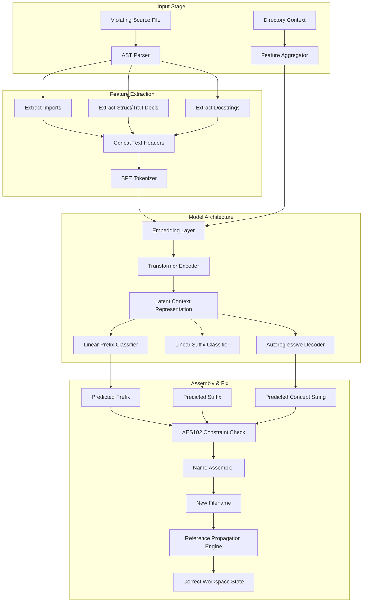

# Deep Learning-Based Semantic Code Naming and Reference Propagation using Rust Burn Framework

See [RULES_AES.md](../../rules/RULES_AES.md) for the rule catalog and
[ARCHITECTURE.md](../ARCHITECTURE.md) for AES layer details.

**Authors:** Development Team, Agentic Engineering Systems Group
**Date:** June 22, 2026
**Document Class:** Technical Research Proposal & Architectural Design Spec

---

## Abstract

Static analysis tools play a critical role in enforcing software
architecture, but repairing violations is typically a manual and error-prone
process. In this paper, we propose a lightweight, fully local deep learning
model implemented via the Rust **Burn** framework to automatically repair
naming violations (AES101 and AES102) within the Agentic Engineering System
(AES) architecture. Unlike simple heuristic renamers, our approach uses a
multi-task Transformer architecture to extract semantic concepts from AST
nodes, predicts valid prefix/suffix layer combinations, and executes
reference-propagation refactoring. The proposed system fits within a
$<15\text{MB}$ memory footprint and executes inference in $<50\text{ms}$ on
commodity CPUs, eliminating dependencies on external LLM APIs.

---

## 1. Introduction

Software systems are increasingly organized under strict multi-layer
architectural guidelines to maintain separation of concerns. The **Agentic
Engineering System (AES)** is a 7-layer architecture designed for building
agentic tools and linters. It organizes software components into a strict
dependency model governed by dependency injection:

$$
\text{Taxonomy} \rightarrow \text{Contract} \rightarrow \text{Utility} \rightarrow \text{Capabilities} \rightarrow \text{Agent} \rightarrow \text{Surface} \rightarrow \text{Root}

$$

In the **lint-arwaky** codebase — a static analysis engine enforcing this
architecture — the physical file naming structure acts as the foundation of
the validation pipeline. Under rules **AES101** and **AES102**, every
filename must explicitly specify its layer (via prefix) and functional role
(via suffix) following the pattern:

$$
\text{filename} = \text{prefix\_concept\_suffix}.\text{extension}

$$

Because subsequent architectural rules (such as import boundaries AES201–205,
circular dependency checks, role validation AES401–406, and orphan detection
AES501–506) rely on the filename prefix to resolve a file's layer, naming
errors cause the entire validation pipeline to cascade into false positives
or failures.

Currently, resolving these violations requires human engineers to read the
file, synthesize the core business concept, deduce the appropriate layer
prefix/suffix, rename the file, and manually fix all import declarations
across the workspace. We present a deep learning-based method implemented in
Rust to automate this entire lifecycle locally.

### 1.1 Data Security & Privacy Guarantee

Because this model is designed to operate on proprietary enterprise source
code, data security is paramount. By leveraging the **Rust Burn** framework,
the AI model is distributed directly as part of the `lint-arwaky` binary.
**100% of the inference is executed locally** on the user's machine (CPU or
GPU). The source code is never transmitted to external cloud APIs (such as
OpenAI, Anthropic, or Google), guaranteeing absolute data privacy and
compliance with strict corporate security policies.

---

## 2. Background and Architectural Foundations

To understand the model's design, we must first explicitly define the
constraints of the **lint-arwaky** engine and the AES naming rules.

### 2.1 The 7-Layer AES Specification

The AES design segregates code based on the following seven functional
layers. Layers do not import each other directly — they import from
**contract** and receive dependencies via `Arc<dyn Trait>` (Rust),
constructor injection (Python/TypeScript):


| Layer Prefix    | Suffix Policy | Description                                                       | Allowed Suffixes                                                                                                         |
| :---------------- | :-------------- | :------------------------------------------------------------------ | :------------------------------------------------------------------------------------------------------------------------- |
| `taxonomy_`     | Strict        | Foundation: value objects, entities, errors, events, constants    | `_vo`, `_entity`, `_error`, `_event`, `_constant`                                                                        |
| `contract_`     | Strict        | Interfaces: protocols and aggregates defining behavior boundaries | `_protocol`, `_aggregate`                                                                                                |
| `utility_`      | Flexible      | Stateless standalone functions and low-level technical mechanics  | *(any except forbidden)*                                                                                                 |
| `capabilities_` | Flexible      | Business logic implementing contract protocols                    | *(any except forbidden)*                                                                                                 |
| `agent_`        | Strict        | Orchestrators coordinating capabilities via aggregate contracts   | `_orchestrator`                                                                                                          |
| `surface_`      | Strict        | User-facing input translation: commands, controllers, views       | `_command`, `_controller`, `_page`, `_router`, `_hook`, `_store`, `_action`, `_screen`, `_component`, `_view`, `_layout` |
| `root_`         | Strict        | DI composition root and application entry points                  | `_entry`, `_container`                                                                                                   |

**Forbidden suffix rules** (AES102):


| Layer           | Forbidden Suffixes                                                                            |
| :---------------- | :---------------------------------------------------------------------------------------------- |
| `utility_`      | `vo`, `entity`, `error`, `event`, `constant`, `protocol`, `aggregate`                         |
| `capabilities_` | `vo`, `entity`, `error`, `event`, `constant`, `constants`, `protocol`, `aggregate`, `utility` |

**Dependency model (AES-DI):**

```
                    ┌──────────────────────────────────┐
                    │             root                  │
                    │  (DI wiring — allowed: ALL)       │
                    └──────┬───────────────────────────┘
                           │
              ┌────────────┼─────────────┐
              ▼            ▼             ▼
         ┌────────┐  ┌─────────┐  ┌──────────────┐
         │surface │  │  agent  │  │ capabilities │
         └───┬────┘  └────┬────┘  └──────┬───────┘
             │            │              │
             ▼            ▼              ▼
        ┌──────────────────────────────────────────┐
        │      contract (protocol / aggregate)      │
        └──────────────────┬───────────────────────┘
                           ▼
                  ┌──────────────────┐
                  │    taxonomy       │
                  └──────────────────┘

         utility ←── flexible, imports taxonomy only
```

### 2.2 Rules Under Automation

- **AES101 (Naming Convention)**: Filenames must be lowercase snake_case
  (letters `a-z`, digits `0-9`, underscores), contain at least **3 words**
  (`prefix_concept_suffix`), and follow the pattern
  `prefix_concept_suffix.extension`
  (e.g., `utility_path_normalizer.rs`, `taxonomy_user_vo.py`).
  Minimum word count is configurable via
  `config.naming.word_count.value` (default 3).
- **AES102 (Suffix/Prefix Alignment)**: The suffix of the file must be
  explicitly permitted by the layer prefix policy. For example,
  `capabilities_user_vo.rs` violates AES102 because `_vo` is strictly
  forbidden in the capabilities layer (it belongs to the taxonomy layer).
  Cross-validation: prefix determines expected layer, suffix must belong
  to that layer's allowed set.

---

## 3. Problem Formulation

Let a source code file be represented by $F = (C, D)$ where $C$ is the text
content of the file and $D$ is the workspace directory path containing the
file.

Our goal is to learn a mapping function $f: F \rightarrow Y$ where:

$$
Y = (P, S, K)

$$

- $P \in \{\text{taxonomy}, \text{contract}, \text{utility}, \text{capabilities}, \text{agent}, \text{surface}, \text{root}\}$ is the predicted layer prefix.
- $S \in \mathcal{S}_{\text{allowed}}(P)$ is the predicted functional suffix, constrained to the allowed suffix set for prefix $P$.
- $K = [k_1, k_2, \dots, k_n]$ is a sequence of tokens representing the semantic domain concept (e.g., `path_normalizer`, `user`, `import_resolver`).

Once $Y$ is predicted, the repaired filename is constructed as:

$$
F_{\text{new\_name}} = P \mathbin{\|} \text{"\_"} \mathbin{\|} \text{concat}(K, \text{"\_"}) \mathbin{\|} S \mathbin{\|} \text{extension}

$$

**Constraint**: The total word count of $F_{\text{new\_name}}$ (excluding
extension) must be $\geq N$ where $N$ is the configured minimum word count
(default 3).

---

## 4. Methodology

The proposed solution consists of an AST extractor, a Byte-Pair Encoding
(BPE) tokenizer, a multi-task deep neural network implemented in **Burn**,
and a workspace refactoring engine.



### 4.1 Feature Extraction and Tokenization

To bypass irrelevant implementation details (such as helper loop logic or
local variables), we perform syntactic feature extraction:

1. **Header Extraction**: We extract the file's header, consisting of the
   first $L$ lines (configurable, default $L = 500$) or up to the end of
   the top-level definitions. This includes imports (`use`, `import`,
   `from`), public type declarations (`struct`, `class`, `interface`,
   `trait`), trait implementations (`impl`, `implements`, inheritance),
   and docstrings.
2. **Directory Prior Embedding**: The directory path $D$ is mapped to a
   high-dimensional vector and concatenated with the first token of the
   input sequence. This guides the prefix classifier since most files in
   `crates/shared/` should be prefixed with `taxonomy_`, `contract_`, or
   `utility_`, while files in `crates/<feature>/` should be prefixed with
   `capabilities_`, `agent_`, `surface_`, or `root_`.
3. **BPE Tokenization**: We train a subword BPE tokenizer with a vocabulary
   size $V = 12{,}000$. This vocabulary is optimized for programming
   language syntax (Rust/Python/TS) and common software engineering terms
   (e.g., `config`, `validation`, `database`, `orchestrator`).

### 4.2 Model Architecture: Multi-Task Transformer

We use a **Multi-Task Transformer** model in Burn. The model shares a single
Transformer Encoder to capture the semantic representation of the file and
feeds it into three distinct prediction heads.

- **Shared Encoder**: A 4-layer Transformer Encoder with an embedding
  dimension $d_{\text{model}} = 128$, feed-forward dimension
  $d_{\text{ff}} = 512$, and $H = 4$ attention heads.
- **Task A: Prefix Classifier**: A dense projection layer with a Softmax
  activation function over 7 AES layer prefixes.

  $$
  \hat{P} = \text{Softmax}(W_P \cdot h_{\text{enc}} + b_P)

  $$

  Where $h_{\text{enc}}$ is the pooled representation of the encoder output.
- **Task B: Suffix Classifier**: A dense projection layer outputting
  probabilities over the vocabulary of valid role suffixes. The suffix
  vocabulary is **conditioned on the predicted prefix** $\hat{P}$ to
  enforce AES102 constraints at inference time:

  $$
  \hat{S} = \text{Softmax}(W_S \cdot h_{\text{enc}} + b_S) \odot \text{Mask}(\hat{P})

  $$

  Where $\text{Mask}(\hat{P})$ zeroes out suffixes not in
  $\mathcal{S}_{\text{allowed}}(\hat{P})$.
- **Task C: Concept Decoder**: A small sequence-to-sequence decoder that
  autoregressively generates the subword tokens of the concept name
  (e.g., generating `path` followed by `normalizer` if the input context
  describes path normalization operations).

### 4.3 Dataset Synthesis and Augmentation

To train a robust model without hand-labeling millions of files:

1. **Positive Mining**: We harvest clean, passing files from public code
   repositories that follow the 7-layer architecture naming rules.
2. **Negative Label Injection**: We generate mutated training inputs by
   randomly renaming the clean files (e.g., rewriting
   `utility_path_normalizer.rs` to `test_path.rs`), stripping docstrings,
   or adding noisy comments. The model is trained to reconstruct the
   original, correct filename from this mutated state.
3. **Identifier Scrambling**: We randomly mask out class and function names
   in the source code to force the model to rely on import dependencies
   and trait implementations to deduce the suffix (e.g., if a class
   implements `IUserRepositoryProtocol`, the suffix should be `_adapter`
   or the file should be in the capabilities layer, even if the class name
   is obfuscated).

---

## 5. Training and Optimization Pipeline

Training is conducted using a customized pipeline within `crates/ai-training`
(future crate — not yet in the PRD Feature Map) leveraging the Rust **Burn**
framework:

```rust
// Representative structural module in crates/ai-training/src/model.rs
use burn::nn::{transformer::TransformerEncoder, Embedding, Linear};
use burn::module::Module;
use burn::tensor::backend::Backend;

#[derive(Module, Debug)]
pub struct AESNamingModel<B: Backend> {
    encoder: TransformerEncoder<B>,
    token_embed: Embedding<B>,
    prefix_head: Linear<B>,    // 7 AES layers
    suffix_head: Linear<B>,    // conditioned on prefix
    concept_projection: Linear<B>,
}
```

- **Loss Function**: The model is optimized under a joint loss objective:

  $$
  \mathcal{L}_{\text{total}} = \alpha \mathcal{L}_{\text{prefix}} + \beta \mathcal{L}_{\text{suffix}} + \gamma \mathcal{L}_{\text{concept}}

  $$

  Where $\mathcal{L}_{\text{prefix}}$ and $\mathcal{L}_{\text{suffix}}$ are
  cross-entropy losses, and $\mathcal{L}_{\text{concept}}$ is the
  sequence-to-sequence loss.
- **Hardware Portability**: Burn's `wgpu` backend is used during training
  on graphics cards. For distribution, we compile the model utilizing
  Burn's `ndarray` backend for zero-dependency CPU inference.
- **Post-Training Quantization (PTQ)**: Model weights are quantized from
  FP32 to INT8, bringing the final `.safetensors` size down to **~10MB**,
  making it easy to bundle inside the binary via `include_bytes!`.

---

## 6. Execution Flow and Reference Propagation

Applying a rename fix requires updating structural dependencies. The system
executes this through the following steps:

1. **Detection**: `lint-arwaky` flags a file (e.g., `src/db_util.rs`) with
   an `AES101` or `AES102` error.
2. **Pre-Filtering (Exceptions & Test Files)**: Before any AI inference
   occurs, the system checks if the file is immune to AES naming rules.
   If a file falls into one of the following categories, the auto-fix is
   immediately aborted:

   - **Barrel / Entry Files**: `main.rs`, `lib.rs`, `mod.rs`, `build.rs`,
     `__init__.py`, `__main__.py`, `index.ts`, `index.js`. Renaming these
     would break module resolution.
   - **Test / Spec Files**: Files matching `*_test.rs`, `test_*.py`,
     `*.spec.ts`, `*.test.ts`. Test files follow separate test-specific
     naming conventions.
   - **Exception List**: Files listed in the rule's `exceptions` config
     (e.g., `main.rs`, `lib.rs`, `mod.rs` for AES101).
3. **Inference**: The auto-fix engine runs the valid file through the Burn
   model. The model predicts:

   - Prefix: `utility`
   - Suffix: `_adapter`
   - Concept: `database`
   - Resulting Name: `utility_database_adapter.rs`
4. **AES102 Constraint Validation**: Before applying the rename, the system
   verifies that the predicted suffix is in the allowed set for the
   predicted prefix. If the suffix is forbidden for the prefix (e.g.,
   `capabilities_user_vo`), the prediction is rejected and the next-best
   alternative is tried.
5. **AST Update & File Renaming**:

   - If the project is a git repository:
     `git mv src/db_util.rs src/utility_database_adapter.rs`
   - If not a git repository (fallback):
     `std::fs::rename("src/db_util.rs", "src/utility_database_adapter.rs")`
6. **Reference Propagation**:

   - The engine parses all other files in the workspace via the filesystem
     crate's AST parser.
   - It replaces import paths referencing the old module
     (e.g., `use crate::db_util;` →
     `use crate::utility_database_adapter;`).
   - If the file is declared as a submodule (e.g., `mod db_util;`), the
     parent module declaration is automatically updated to
     `mod utility_database_adapter;`.
   - For Python: updates `from modules.shared.src.db_util import X` →
     `from modules.shared.src.utility_database_adapter import X`.
   - For TypeScript: updates `import { X } from './db_util'` →
     `import { X } from './utility_database_adapter'`.

---

## 7. Verification and Fallbacks

To ensure absolute safety and rule compliance, we enforce a strict
validation boundary:

1. **Compilation Check**: Immediately after executing reference propagation,
   the system runs `cargo check` (Rust), `python -c "import ..."` (Python),
   or `npx tsc --noEmit` (TypeScript). If compilation fails, the changes
   are reverted via `git checkout` / `git reset` (or restored from backup
   if not a git repository).
2. **Linter Re-check**: The system runs `lint-arwaky` over the modified
   files. If the new filename generates a new violation (e.g., triggering
   a role violation AES401–406 or import violation AES201–205), the
   transaction is rolled back.
3. **Confidence Thresholding**: If the softmax confidence score for any of
   the predicted components ($P$, $S$, or $K$) falls below a configurable
   threshold (default **85%**, configurable via
   `config.ai_naming.confidence_threshold`), the automated rename is
   suspended. Instead, the CLI/TUI presents a prompt showing the top 3
   alternative names to the engineer for approval.

---

## 8. Glossary & Index of Terms

This section provides explicit definitions for all architectural, static
analysis, and machine learning terminology used throughout this paper.

### Architectural Layers & AES Sub-Roles

The **Agentic Engineering System (AES)** divides code into seven distinct
layers, each associated with specific suffix roles:

- **1. Taxonomy Layer (`taxonomy_`)**: The foundational domain definition
  layer containing data models, values, types, constants, and domain
  errors.

  - **Value Object (`_vo`)**: A small, immutable domain representation
    whose equality is determined by value, not identity.
  - **Entity (`_entity`)**: A domain object defined by its persistent
    identity and lifecycle.
  - **Event (`_event`)**: A record of a significant domain change or
    occurrence.
  - **Error (`_error`)**: Custom domain error definitions.
  - **Constant (`_constant`)**: Pure global constants, configurations, or
    statically defined values. No functions, structs, or enums allowed.
- **2. Contract Layer (`contract_`)**: The interface layer defining
  boundaries and communication rules.

  - **Protocol (`_protocol`)**: Interface definitions implemented by the
    Capabilities layer (e.g., `IUserRepositoryProtocol`).
  - **Aggregate (`_aggregate`)**: High-level facade contracts combining
    multiple protocols into orchestratable packages, implemented by the
    Agent layer (e.g., `IUserAggregate`).
- **3. Utility Layer (`utility_`)**: Stateless standalone functions and
  low-level technical mechanics. Imports taxonomy only. No structs, enums,
  traits, or type definitions — functions and constants only.

  - Common flexible suffixes: `_validator`, `_parser`, `_resolver`,
    `_normalizer`, `_detector`, `_mapper`, `_handler`.
  - Forbidden suffixes: `vo`, `entity`, `error`, `event`, `constant`,
    `protocol`, `aggregate`.
- **4. Capabilities Layer (`capabilities_`)**: The business logic and core
  algorithms layer. Implements contract protocols via
  `impl Trait for Struct` (Rust), class inheritance (Python), or
  `implements` (TypeScript).

  - Common flexible suffixes: `_checker`, `_analyzer`, `_processor`,
    `_evaluator`, `_validator`, `_repository`, `_adapter`.
  - Forbidden suffixes: `vo`, `entity`, `error`, `event`, `constant`,
    `constants`, `protocol`, `aggregate`, `utility`.
- **5. Agent Layer (`agent_`)**: The orchestration layer. Coordinates
  capabilities via aggregate contracts. Does NOT import capabilities
  directly — receives them via `Arc<dyn Trait>` / constructor injection.

  - **Orchestrator (`_orchestrator`)**: Coordinates capabilities to run
    goal-oriented workflows.
- **6. Surface Layer (`surface_`)**: The user-facing input translation
  layer. Does NOT import agent directly — receives orchestrator via
  aggregate contract.

  - **Smart surfaces**: `_command`, `_controller`, `_page`, `_router` —
    may contain orchestration logic.
  - **Utility surfaces**: `_hook`, `_store`, `_action`, `_screen` —
    support smart surfaces.
  - **Passive surfaces**: `_component`, `_view`, `_layout` —
    presentation only.
- **7. Root Layer (`root_`)**: The DI composition and application entry
  layer. The only layer allowed to import all other layers.

  - **Entry (`_entry`)**: Binary entry points.
  - **Container (`_container`)**: Dependency Injection composition roots
    where all layers are wired together.

### Multi-Language Workspace Terminology


| Term          | Language      | Definition                                                                                  |
| :-------------- | :-------------- | :-------------------------------------------------------------------------------------------- |
| **Workspace** | All           | The entire project root directory containing all configs and language-specific sub-projects |
| `crates/`     | Rust          | Directory containing all Rust crates (Cargo workspace members)                              |
| `packages/`   | TypeScript/JS | Directory containing all TypeScript/JavaScript packages (npm/pnpm workspace)                |
| `modules/`    | Python        | Directory containing all Python sub-projects                                                |
| **Member**    | All           | A single, self-contained sub-project (crate, package, or module) inside the workspace       |

### Static Analysis & Machine Learning Terminology

- **AES**: Agentic Engineering System — the 7-layer coding convention
  enforced by lint-arwaky (24 product rules: AES101–AES506).
- **AST (Abstract Syntax Tree)**: A tree representation of the abstract
  syntactic structure of source code, produced by tree-sitter in
  lint-arwaky.
- **Autoregressive Decoder**: A neural network component that generates a
  sequence of tokens one by one, using the previously generated tokens as
  additional input for predicting the next token.
- **BPE (Byte-Pair Encoding)**: A subword tokenization algorithm that
  iteratively merges the most frequent pairs of characters or bytes in a
  text corpus to create a compact vocabulary.
- **Burn**: A modern, flexible, and zero-dependency deep learning framework
  written entirely in Rust, designed for portable training and local
  CPU/GPU inference.
- **Cross-Entropy Loss**: A standard loss function used in classification
  tasks to measure the performance of a model whose output is a probability
  distribution.
- **Inference**: The process of running live data through a trained machine
  learning model to compute predictions.
- **Multi-Task Learning**: A subfield of machine learning in which multiple
  learning tasks are solved at the same time, using a shared representation
  to improve generalization.
- **PTQ (Post-Training Quantization)**: An optimization technique where the
  precision of weights in a neural network is reduced (e.g., from FP32 to
  INT8) after training is complete.
- **Reference Propagation**: The process of automatically locating and
  updating all import declarations, module declarations, and dependent
  references throughout a codebase when a file is renamed.
- **Safetensors**: A simple, safe, and efficient file format for storing
  tensors and model weights securely without the safety risks of Python
  pickle serialization.
- **Softmax**: An activation function that normalizes an input vector of
  real numbers into a probability distribution over predicted output
  classes.
- **Static Analysis**: The analysis of computer software performed without
  executing programs, by analyzing ASTs or source tokens.
- **Transformer Encoder**: A neural network architecture block utilizing
  self-attention mechanisms to construct contextualized representations of
  input sequences.
- **WGPU Backend**: A modern graphics API implementation in Rust used by
  Burn to run GPU-accelerated tensor computations portably across WebGPU,
  Vulkan, Metal, and DirectX.

---

## Reference

- PRD: [PRD.md](../../PRD.md)
- Architecture: [ARCHITECTURE.md](../ARCHITECTURE.md)
- AES Rules: [RULES_AES.md](../../rules/RULES_AES.md)
