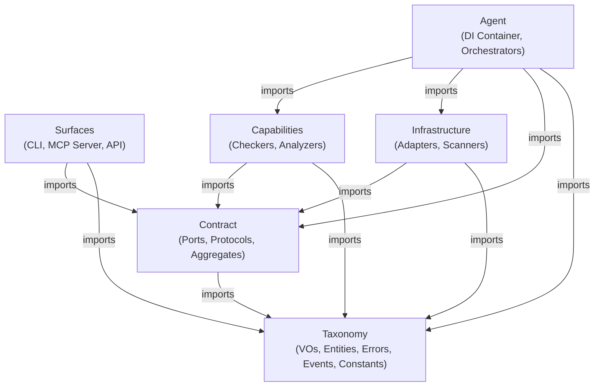

# AES Architecture: Agentic Engineering System

The **Agentic Engineering System (AES)** is a strictly layered, highly decoupled, and AI-native architectural pattern. It is designed to achieve maximum modularity, absolute testability, and extreme maintainability by enforcing rigid structural boundaries. Under the AES paradigm, technical details are isolated, domain models are protected, and dependencies are strictly inverted via abstract contracts. Furthermore, AES is specifically optimized for **Agentic workflows**, ensuring that AI agents and LLMs can easily navigate, understand, and modify the codebase without hallucinating architectural violations.

## Core Pillars and Philosophy

### 1. Strict Layered Boundary Enforcement

The codebase is divided into distinct horizontal and vertical boundaries. Layers can only communicate using downward-only dependency paths to prevent coupling and circular dependencies. Any violation of these import boundaries is caught at compile or lint time by static analysis checkers.

### 2. Sibling Equivalence and Peer Layers

Unlike traditional three-tier architectures, **Capabilities** and **Infrastructure** are horizontal peer layers.

- Neither layer is above or below the other.
- Neither layer can ever import from or know about the other.
- Both layers depend downward on the **Contract** layer exclusively via Ports and Protocols.

### 3. Dependency Inversion

Higher-level orchestrating layers  never import concrete implementations. Instead, they interact with implementations exclusively through interfaces declared in the Contract layer using Dependency Injection (e.g., Surfaces call `ServiceContainerAggregate`, not concrete Orchestrators).

### 4. The 3-Structure Naming Philosophy (Layer Prefix + Vertical Slicing+ Role Suffix)

AES enforces a **Word File Naming Convention**: `[layer]_[concept]_[suffix]` or `[layer]_[concept1]_[concept2]_[suffix]`

1. **Layer (prefix)**: The architectural layer (e.g., `contract_`, `capabilities_`, `taxonomy_`).
2. **Concept (middle)**: A single/multiple word defining the core concept (e.g., `compliance`, `import_rule`).
3. **Role (suffix)**: Defines the architectural role (e.g., `_port`, `_protocol`, `_checker`).

*Example:* `contract_compliance_port.rs` = layer=contract, concept=compliance, suffix=port.

Files are organized into **feature folders** (vertical slicing) rather than layer directories. All six layers coexist in each feature folder, distinguished by their file prefix.

*Example feature folder `layer-rules/` — semua 6 layer dalam satu folder:*

```
contract_compliance_port.rs            ← contract layer
capabilities_compliance_analyzer.rs    ← capabilities layer
infrastructure_compliance_adapter.rs   ← infrastructure layer
agent_compliance_orchestrator.rs       ← agent layer
surface_compliance_command.rs          ← surface layer
taxonomy_compliance_vo.rs              ← taxonomy layer
```

Exceptions: `main.rs`, `lib.rs`, `mod.rs`, `__init__.py`, `index.ts`, `index.js`.

---

### Layer Hierarchy (Dependency Direction)



#### Layer Prefix Specifications

Files use the layer as a **file prefix** (not a directory): `[layer]_[concept]_[suffix].rs`. All six layers coexist in each feature folder, distinguished by their prefix.

| Layer (prefix)      | Allowed suffixes                                                                                                                                                                                                                                                                                                                                                                                                                                                                                                                                | Feature folders                                                                                           |
| ------------------- | ----------------------------------------------------------------------------------------------------------------------------------------------------------------------------------------------------------------------------------------------------------------------------------------------------------------------------------------------------------------------------------------------------------------------------------------------------------------------------------------------------------------------------------------------- | --------------------------------------------------------------------------------------------------------- |
| `taxonomy_`       | `_vo`, `_entity`, `_event`, `_error`, `_constant`                                                                                                                                                                                                                                                                                                                                                                                                                                                                                     | `shared-common/`, `layer-rules/`, `config-system/`, etc.                                            |
| `contract_`       | `_port`, `_protocol`, `_aggregate`                                                                                                                                                                                                                                                                                                                                                                                                                                                                                                        | `layer-rules/`, `config-system/`, `di-containers/`, `pipeline-jobs/`, etc.                        |
| `capabilities_`   | `_analyzer`, `_checker`, `_processor`, `_evaluator`, `_resolver`, `_validator`, `_formatter`, `_executor`, `_transformer`, `_calculator`, `_builder`, `_compiler`, `_aggregator`, `_classifier`, `_extractor`, `_reporter`, `_mapper`, `_filter`, `_collector`, `_comparator`, `_scorer`, `_inspector`, `_reviewer`, `_assessor`, `_actions`                                                                                                                                                  | `layer-rules/`, `semantic-analysis/`, `naming-rules/`, `code-analysis/`, etc.                     |
| `infrastructure_` | `_adapter`, `_provider`, `_scanner`, `_client`, `_constants`, `_schemas`, `_lifespan`, `_wrapper`, `_tracer`, `_tracker`, `_variants`, `_detector`, `_patterns`, `_util`, `_system`, `_repository`, `_cache`, `_loader`, `_writer`, `_reader`, `_driver`, `_connector`, `_gateway`, `_serializer`, `_encoder`, `_decoder`, `_fetcher`, `_watcher`, `_indexer`, `_dispatcher`, `_recorder`, `_proxy`, `_publisher`, `_subscriber`, `_listener`, `_poller`, `_streamer` | `language-adapters/`, `source-parsing/`, `config-system/`, `file-system/`, `http-client/`, etc. |
| `agent_`          | `_container`, `_orchestrator`, `_coordinator`, `_registry`, `_manager`, `_mixin`, `_state`                                                                                                                                                                                                                                                                                                                                                                                                                                        | `role-rules/`, `pipeline-jobs/`, `code-analysis/`, `di-containers/`, `lifecycle-state/`, etc.   |
| `surface_`        | `_command`, `_controller`, `_page`, `_view`, `_component`, `_router`, `_layout`, `_entry`, `_hook`, `_store`, `_action`, `_screen`                                                                                                                                                                                                                                                                                                                                                                                      | `cli-commands/`, `mcp-server/`                                                                        |

### Feature Folders (26 vertical slices)

```
src-rust/
  layer-rules/        — Prefix rules: layer detection (by filename prefix), import validation (AES001/AES002), naming convention (AES010), cycle detection (AES012), hierarchy (AES033/AES034), self-lint (AES022), compliance coordination. NOT role/suffix or quality logic.
  role-rules/         — Suffix/role behavior rules: agent role violations (AES032), surface role violations (AES031), taxonomy role (AES016/AES015), contract role (AES013), mandatory inheritance (AES014). Each suffix type has a dedicated checker with its own protocol + aggregate.
  orphan-detector/    — Orphan code detection (AES030). Protocol defined in `contract_orphan_protocol.rs` within this folder.
  primitive-checker/  — Primitive obsession detection (AES016) — shared utility for scanning raw types.
  cli-commands/       — CLI command surfaces
  cli-transport/      — CLI execution transport
  config-system/      — Config loading & parsing
  pipeline-jobs/      — Jobs, dispatcher, execution
  naming-rules/       — Naming convention & variants
  semantic-analysis/  — Data flow, scope, tracer
  file-watch/         — File watching
  git-hooks/          — Git hooks management
  multi-project/      — Multi-project governance
  project-setup/      — Project init, doctor, mcp-config
  plugin-system/      — Plugin discovery & management
  output-report/      — Output formatting & report generation
  code-analysis/      — Quality algorithms: unused imports (AES023), class/line checking (AES011, AES020/AES021), type detection (AES016 protocol), fix processor (AES036/AES037/AES038), symbol renamer. Wires into coordinator pipeline.
  mcp-server/         — MCP server
  source-parsing/     — Source code parsing
  lifecycle-state/    — Agent lifecycle management
  language-adapters/  — Python, JS, Rust adapters
  di-containers/      — DI container aggregates
  file-system/        — File system abstraction
  http-client/        — HTTP client
  metrics-service/    — Metrics provider
  shared-common/      — Shared value objects (VOs), entities, events, errors, constants, role definitions. All `taxonomy_*` files live here.
```

### Layer Specifications

#### 1. Taxonomy (`taxonomy_` prefix)

- **Prefix**: `taxonomy_`
- **Allowed Suffixes**: `_vo`, `_entity`, `_event`, `_error`, `_constant`
- **Allowed Imports**: Other `taxonomy_` files only. Outer imports trigger **AES001**.
- **Description**: Pure domain models, value objects, and business entities.
- **Components**:
  - **Value Object (`_vo`)**: Immutable data containers. Primitive types forbidden (**AES016**). _Ex: `taxonomy_rule_vo.rs`_
  - **Entity (`_entity`)**: Stateful domain concepts with unique IDs. _Ex: `taxonomy_governance_entity.rs`_
  - **Event (`_event`)**: Immutable domain fact snapshots. _Ex: `taxonomy_applied_event.rs`_
  - **Error (`_error`)**: Domain-level exceptions. _Ex: `taxonomy_system_error.rs`_
  - **Constant (`_constant`)**: Compile-time literals only (**AES015**). _Ex: `taxonomy_names_constant.rs`_

#### 2. Contract (`contract_` prefix)

- **Prefix**: `contract_`
- **Allowed Suffixes**: `_port`, `_protocol`, `_aggregate`
- **Allowed Imports**: `taxonomy_` files and other `contract_` files. Implementation layers forbidden.
- **Description**: Interface definitions — _what_ can be done without _how_.
- **Components**:
  - **Port (`_port`)**: Outbound interfaces implemented by Infrastructure. _Ex: `contract_system_port.rs`_
  - **Protocol (`_protocol`)**: Inbound interfaces implemented by Capabilities. _Ex: `contract_rule_protocol.rs`_
  - **Aggregate (`_aggregate`)**: Composition facades. _Ex: `contract_service_aggregate.rs`_

#### 3. Capabilities (`capabilities_` prefix)

- **Prefix**: `capabilities_`
- **Allowed Suffixes**: `_checker`, `_analyzer`, `_processor`, etc.
- **Allowed Imports**: `taxonomy_` and `contract_` files only.
- **Description**: Use-case logic. Entirely agnostic of infrastructure.

#### 4. Infrastructure (`infrastructure_` prefix)

- **Prefix**: `infrastructure_`
- **Allowed Suffixes**: `_adapter`, `_provider`, `_scanner`, etc.
- **Allowed Imports**: `taxonomy_` and `contract_` files only.
- **Description**: Technical implementations, external tool wrappers.

#### 5. Agent (`agent_` prefix)

- **Prefix**: `agent_`
- **Allowed Suffixes**: `_container`, `_orchestrator`, `_coordinator`, `_registry`, `_manager`, `_mixin`, `_state`
- **Allowed Imports**: Depends on role:
  - `orchestrator`/`coordinator`: `taxonomy_` + `contract_` only (AES032). Must NOT import capabilities/infrastructure directly.
  - `container`/`registry`/`mixin`: `taxonomy_` + `contract_` + `capabilities_` + `infrastructure_` (wiring assembly).
  - `manager`/`state`: `taxonomy_` + `contract_` only (leaf support modules).
- **Description**: Orchestration, DI wiring, pipeline execution.

#### 6. Surfaces (`surface_` prefix)

- **Prefix**: `surface_`
- **Allowed Suffixes**: `_command`, `_controller`, `_page`, `_view`, `_component`, `_router`, `_layout`, `_entry`, `_hook`, `_store`, `_action`, `_screen`
- **Allowed Imports**: Depends on role:
  - Smart surfaces (`command`/`controller`/`page`/`entry`): `taxonomy_` + `contract_aggregate_` only (AES001). Must NOT import capabilities/infrastructure/agent directly — use `ServiceContainerAggregate`.
  - Utility surfaces (`hook`/`store`/`action`/`screen`): `taxonomy_` only + passive surfaces. Must NOT import smart surfaces (AES033).
  - Passive surfaces (`component`/`view`/`layout`): `taxonomy_` only (AES034). No logic or orchestration.
- **Description**: CLI and MCP server entry points.
