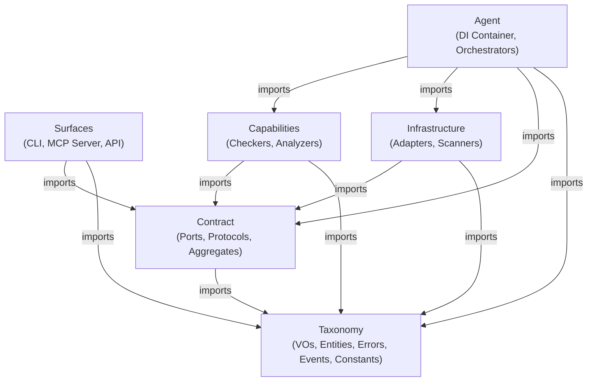

#### Layer Hierarchy (Dependency Direction)

# AES Architecture: Agentic Engineering System

The **Agentic Engineering System (AES)** is a strictly layered, highly decoupled, and AI-native architectural pattern. It is designed to achieve maximum modularity, absolute testability, and extreme maintainability by enforcing rigid structural boundaries. Under the AES paradigm, technical details are isolated, domain models are protected, and dependencies are strictly inverted via abstract contracts. Furthermore, AES is specifically optimized for **Agentic workflows**, ensuring that AI agents and LLMs can easily navigate, understand, and modify the codebase without hallucinating architectural violations.

---

## Core Pillars and Philosophy

### 1. Strict Layered Boundary Enforcement

The codebase is divided into distinct horizontal and vertical boundaries. Layers can only communicate using downward-only dependency paths to prevent coupling and circular dependencies. Any violation of these import boundaries is caught at compile or lint time by static analysis checkers.

### 2. Sibling Equivalence and Peer Layers

Unlike traditional three-tier architectures, **Capabilities** and **Infrastructure** are horizontal peer layers.

- Neither layer is above or below the other.
- Neither layer can ever import from or know about the other.
- Both layers depend downward on the **Contract** layer exclusively via Ports and Protocols.

### 3. Dependency Inversion

Higher-level orchestrating layers  never import concrete implementations. Instead, they interact with implementations exclusively through interfaces declared in the Contract layer using Dependency Injection (e.g., Surfaces call `ServiceContainerAggregate`, not concrete Orchestrators).

### 4. The 3-Word Naming Philosophy (Virtual Namespacing)

To solve the "Scattered Feature Problem", AES enforces a **3-Word File Naming Convention**: `[prefix]_[middle]_[suffix]`.

1. **Prefix**: Groups files by domain or module (e.g., `auth`, `payment`, `lint`).
2. **Middle**: A single word defining the core concept (e.g., `token`, `session`).
3. **Suffix**: Defines the architectural layer and behavioral contract (e.g., `_vo`, `_port`, `_orchestrator`).

*Example:* `auth_session_vo.rs` instantly tells us the domain (auth), the concept (session), and the architectural role (value object). Exceptions: `main.rs`, `lib.rs`, `mod.rs`, `__init__.py`, `index.ts`, `index.js`.

---

### Layer Hierarchy (Dependency Direction)

#### Detailed Layer Specifications

Listed from the innermost (core) to the outermost (edge) layer.

### 1. Taxonomy: The Domain Foundation

- **Path**: `src-rust/taxonomy/`
- **Allowed Suffixes**: `_vo`, `_entity`, `_event`, `_error`, `_constant`
- **Allowed Imports**: Restricted strictly to `src-rust/taxonomy/`. Outer imports trigger an **AES001** violation.
- **Description**: Contains pure, framework-agnostic domain models, value objects, and business entities. It has zero external dependencies and represents the fundamental vocabulary of the system.
- **Components**:
  - **Value Object (`_vo`)**: Immutable data containers encapsulating domain constraints. Constructed at runtime, identified by value, may carry behavior (methods, validation). Primitive types (raw `str`, `int`) are forbidden in core entities and must be wrapped in VOs (**AES006**). _Ex: `auth_token_vo.rs`_
  - **Entity (`_entity`)**: Stateful domain concepts with unique IDs and lifecycle transitions. _Ex: `user_profile_entity.rs`_
  - **Event (`_event`)**: Immutable snapshots of domain facts. _Ex: `lint_scan_event.rs`_
  - **Error (`_error`)**: Specialized domain-level exceptions. _Ex: `file_system_error.rs`_
  - **Constant (`_constant`)**: Compile-time literals (`pub const` / `pub static` in Rust, module-level `Final` in Python) representing fixed domain values: protocol versions, validation bounds, enumerated literals, and other system-wide invariants. Identified by name (not value), zero runtime construction, zero behavior. The only Taxonomy role permitted to expose raw primitives (**AES006** exception) since constants are primitives by definition. Must contain _only_ constant declarations — `struct`/`enum`/`fn`/`impl` blocks are forbidden and trigger **AES033**. Use this role for cross-cutting values shared across multiple VOs or layers; values that constrain a single VO should be expressed as associated constants on that VO instead. _Ex: `mcp_protocol_constant.rs`, `source_extension_constant.rs`_

### 2. Contract: The Abstraction Boundaries

- **Path**: `src-rust/contract/`
- **Allowed Suffixes**: `_port`, `_protocol`, `_aggregate`
- **Allowed Imports**: `src-rust/taxonomy/` and `src-rust/contract/`. Importing implementation layers is strictly forbidden.
- **Description**: The system's formal promises. Defines _what_ can be done without defining _how_.
- **Components**:
  - **Port (`_port`)**: Outbound interfaces for technical operations (I/O, DB, Network). Implemented by Infrastructure. _Ex: `file_system_port.rs`_
  - **Protocol (`_protocol`)**: Inbound interfaces for use cases or domain calculations. Implemented by Capabilities. _Ex: `arch_rule_protocol.rs`_
  - **Aggregate (`_aggregate`)**: Composition-based facades grouping related ports/protocols. _`service_container_aggregate.rs`_

### 3. Capabilities: Domain Logic and Core Use Cases

- **Path**: `src-rust/capabilities/`
- **Allowed Suffixes**: `_analyzer`, `_checker`, `_processor`, `_evaluator`, `_resolver`, `_validator`, `_formatter`, `_handler`, `_executor`, `_transformer`, `_calculator`, `_builder`, `_compiler`, `_aggregator`, `_classifier`, `_extractor`, `_reporter`, `_mapper`, `_filter`, `_collector`, `_comparator`, `_scorer`, `_inspector`, `_reviewer`, `_assessor`, `_actions`
- **Allowed Imports**: `src-rust/taxonomy/` and `src-rust/contract/`.
- **Description**: Implements core business logic, policies, and algorithms. Entirely agnostic of concrete infrastructure.
- **Components**:
  - **Checker/Analyzer (`_checker`, `_analyzer`)**: Evaluates specific audit rules. _Ex: `arch_import_checker.rs`_
  - **Processor/Resolver (`_processor`, `_resolver`)**: Orchestrates transformations or graph operations. _Ex: `orphan_graph_resolver.rs`_
  - **Evaluator (`_evaluator`)**: Coordinates multiple checkers to score complex rules. _Ex: `architecture_rule_evaluator.rs`_
  - **Validator/Formatter (`_validator`, `_formatter`)**: Validates structure or formats output. _Ex: `config_rules_validator.rs`_
  - **Executor/Transformer (`_executor`, `_transformer`)**: Executes actions or transforms data. _Ex: `naming_renamer_processor.rs`_
  - **Builder/Compiler/Aggregator (`_builder`, `_compiler`, `_aggregator`)**: Assembles or aggregates results. _Ex: `lint_reporting_formatter.rs`_
  - **Collector/Filter/Classifier (`_collector`, `_filter`, `_classifier`)**: Gathers and categorizes data. _Ex: `surface_hierarchy_checker.rs`_
  - **Calculator/Scorer/Comparator (`_calculator`, `_scorer`, `_comparator`)**: Computes metrics and comparisons. _Ex: `architecture_metric_checker.rs`_
  - **Mapper/Extractor/Reporter (`_mapper`, `_extractor`, `_reporter`)**: Maps between representations. _Ex: `data_flow_analyzer.rs`_
  - **Inspector/Reviewer/Assessor (`_inspector`, `_reviewer`, `_assessor`)**: Reviews code for quality or security. _Ex: `domain_type_checker.rs`_

### 4. Infrastructure: Technical and Adapter Layer

- **Path**: `src-rust/infrastructure/`
- **Allowed Suffixes**: `_adapter`, `_provider`, `_scanner`, `_client`, `_constants`, `_schemas`, `_lifespan`, `_wrapper`, `_tracer`, `_tracker`, `_variants`, `_detector`, `_patterns`, `_util`, `_system`, `_repository`, `_cache`, `_store`, `_loader`, `_writer`, `_reader`, `_driver`, `_connector`, `_gateway`, `_serializer`, `_encoder`, `_decoder`, `_fetcher`, `_watcher`, `_indexer`, `_dispatcher`, `_recorder`, `_proxy`, `_publisher`, `_subscriber`, `_listener`, `_poller`, `_streamer`
- **Allowed Imports**: `src-rust/taxonomy/` and `src-rust/contract/`. Sibling infrastructure imports are forbidden to enforce isolation.
- **Description**: Houses technical implementations, external library wrappers, and system drivers.
- **Components**:
  - **Adapter (`_adapter`)**: Implements concrete ports for external tools. _Ex: `python_ruff_adapter.rs`_
  - **Scanner (`_scanner`)**: Interfaces with raw hardware/platform APIs. _Ex: `os_fs_scanner.rs`_
  - **Provider (`_provider`)**: Delivers technical configuration or utilities. _Ex: `config_yaml_provider.rs`_
  - **Client/Connector/Gateway (`_client`, `_connector`, `_gateway`)**: Connects to external services. _Ex: `cargo_audit_adapter.rs`_
  - **Serializer/Encoder/Decoder (`_serializer`, `_encoder`, `_decoder`)**: Handles data serialization. _Ex: `mcp_server_schemas.rs`_
  - **Watcher/Poller/Listener (`_watcher`, `_poller`, `_listener`)**: Monitors for changes or events. _Ex: `git_diff_scanner.rs`_
  - **Dispatcher/Recorder/Indexer (`_dispatcher`, `_recorder`, `_indexer`)**: Routes, records, or indexes data. _Ex: `python_ast_utils.rs`_
  - **Proxy/Publisher/Subscriber (`_proxy`, `_publisher`, `_subscriber`)**: Mediates or broadcasts events. _Ex: `mcp_server_wrapper.rs`_
  - **Fetcher/Reader/Writer/Loader (`_fetcher`, `_reader`, `_writer`, `_loader`)**: Handles I/O operations. _Ex: `javascript_linter_adapter.rs`_
  - **Tracer/Tracker/Detector (`_tracer`, `_tracker`, `_detector`)**: Traces or detects patterns. _Ex: `python_bandit_adapter.rs`_
  - **Constants/Schemas/Patterns (`_constants`, `_schemas`, `_patterns`)**: Defines constants or schemas. _Ex: `mcp_server_constants.rs`_
  - **Util/System/Cache/Store (`_util`, `_system`, `_cache`, `_store`)**: General utilities. _Ex: `python_primitive_checker.rs`_
  - **Driver/Repository (`_driver`, `_repository`)**: Data access or system integration. _Ex: `python_analysis_adapter.rs`_
  - **Lifespan/Wrapper (`_lifespan`, `_wrapper`)**: Manages lifecycle or wraps third-party APIs. _Ex: `mcp_server_lifespan.rs`_

### 5. Agent: System Governance and Dependency Injection

- **Path**: `src-rust/agent/`
- **Allowed Suffixes**: `_container`, `_orchestrator`, `_coordinator`, `_registry`, `_manager`, `_mixin`, `_dispatcher`, `_handler`, `_result`, `_state`
- **Allowed Imports**: `src-rust/taxonomy/`, `src-rust/contract/`, `src-rust/capabilities/`, `src-rust/infrastructure/`, and sibling agent components.
- **Description**: The orchestrator of the system. Governs execution flow, sets up DI, and wires capabilities/infrastructure.
- **Components**:
  - **Container (`_container`)**: Purely structural DI wiring. Zero business logic. _Ex: `dependency_injection_container.rs`_
  - **Orchestrator (`_orchestrator`)**: Conducts sequential flow for a single domain goal. Must be completely stateless between calls (**AES021**). _Ex: `arch_compliance_orchestrator.rs`_
  - **Coordinator (`_coordinator`)**: Orchestrates high-level policies across multiple orchestrators. _Ex: `arch_compliance_coordinator.rs`_
  - **Registry (`_registry`)**: Thread-safe, passive inventory store for CRUD/state. _Ex: `pipeline_job_registry.rs`_
  - **Manager (`_manager`)**: Supervises lifecycles and background runners. _Ex: `lifecycle_state_manager.rs`_
  - **Mixin (`_mixin`)**: Composes partial container wiring across multiple modules. _Ex: `capability_mixin.rs`_
  - **Dispatcher (`_dispatcher`)**: Routes commands to appropriate capability handlers. _Ex: `pipeline_dispatcher_aggregate.rs`_
  - **Handler/Result/State (`_handler`, `_result`, `_state`)**: Support modules for managing results, state, or event handling. _Ex: `pipeline_input_aggregate.rs`_

#### 6. Surfaces: External Interfaces and Entrypoints

- **Path**: `src-rust/surfaces/`
- **Allowed Suffixes**: `_command`, `_handler`, `_controller`, `_page`, `_view`, `_component`, `_router`, `_layout`, `_entry`, `_hook`, `_store`, `_provider`
- **Allowed Imports**: `src-rust/taxonomy/`, `src-rust/contract/`. Direct imports to capabilities/infrastructure/agent are forbidden.
- **Description**: The outermost layer interfacing with users, terminals, or client applications.
- **Components**:
  - **Smart Surfaces** (`_command`, `_handler`, `_controller`, `_entry`): Parse input, delegate to Agent orchestrators via `ServiceContainerAggregate`, return structured output. _Ex: `cli_check_command.rs`, `mcp_server_handler.rs`_
  - **Utility Surfaces** (`_hook`, `_store`, `_provider`, `_router`): Stateless helpers that support Smart surfaces. Must NOT import Smart surfaces directly (**AES018**). _Ex: `mcp_command_handler.rs`_
  - **Passive Surfaces** (`_component`, `_layout`, `_view`): Dumb, presentation-only components. Receive read-only VOs, never import agents/contracts (**AES019**). _Ex: `dashboard_view.rs`_
