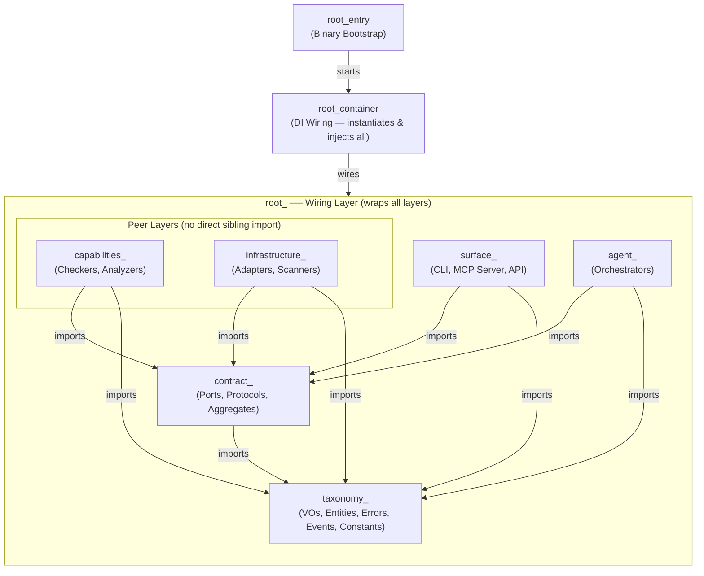

# AES Architecture: Agentic Engineering System

See [AGENTS.md](../AGENTS.md) for workspace conventions and [RULES_AES.md](../.agents/rules/RULES_AES.md) for the full rule catalog.

The **Agentic Engineering System (AES)** is a strictly layered, highly decoupled, and AI-native architectural pattern. It is designed to achieve maximum modularity, absolute testability, and extreme maintainability by enforcing rigid structural boundaries. Under the AES paradigm, technical details are isolated, domain models are protected, and dependencies are strictly inverted via abstract contracts. Furthermore, AES is specifically optimized for **Agentic workflows**, ensuring that AI agents and LLMs can easily navigate, understand, and modify the codebase without hallucinating architectural violations.

---

## Terminology

AES supported lsanguages (Rust, TypeScript, Python) to maintain a single unified vocabulary:

| Term          | Language        | Definition                                                                                                         |
| ------------- | --------------- | ------------------------------------------------------------------------------------------------------------------ |
| **Workspace** | All             | The entire project root directory (e.g.,`lint-arwaky/`) containing all configs and language-specific sub-projects. |
| `crates/`     | Rust            | The directory containing all Rust crates (workspace members), conforming to Cargo workspace specifications.        |
| `packages/`   | TypeScript / JS | The directory containing all TypeScript/JavaScript packages, following npm/pnpm workspace conventions.             |
| `modules/`    | Python          | The directory containing all Python sub-projects, organized as independent python modules.                         |
| Member        | All             | A single, self-contained sub-project (crate, package, or module) inside the workspace.                             |

## Core Pillars and Philosophy

### 1. Strict Layered Boundary Enforcement

The codebase is divided into distinct horizontal and vertical boundaries. Layers can only communicate using downward-only dependency paths to prevent coupling and circular dependencies. Any violation of these import boundaries is caught at compile or lint time by static analysis checkers.

### 2. Sibling Equivalence and Peer Layers

Unlike traditional three-tier architectures, **Capabilities** and **Infrastructure** are horizontal peer layers.

- Neither layer is above or below the other.
- Neither layer can ever import from or know about the other.
- Both layers depend downward on the **Contract** layer exclusively via Ports and Protocols.

### 3. Dependency Inversion

Higher-level orchestrating layers never import concrete implementations. Instead, they interact with implementations exclusively through interfaces declared in the Contract layer using Dependency Injection (e.g., Surfaces call `ServiceContainerAggregate`, not concrete Orchestrators).

### 4. The 3-Structure Naming Philosophy (Layer Prefix + Vertical Slicing + Role Suffix)

AES enforces a **Word File Naming Convention**: `[layer]_[concept]_[suffix]` or `[layer]_[concept1]_[concept2]_[suffix]`

1. **Layer (prefix)**: The architectural layer (e.g., `contract_`, `capabilities_`, `taxonomy_`).
2. **Concept (middle)**: A single/multiple word defining the core concept (e.g., `compliance`, `import_rule`).
3. **Role (suffix)**: Defines the architectural role (e.g., `_port`, `_protocol`, `_checker`).

_Example:_ `contract_compliance_port.rs` = layer=contract, concept=compliance, suffix=port.

Files are organized into **feature crates** (vertical slicing) rather than layer directories. All seven layers coexist in each feature crate, distinguished by their file prefix.

_Example feature crate `import-rules/` — all 7 layers in one crate:_

```
contract_import_parser_port.rs           ← contract layer
contract_import_runner_aggregate.rs       ← contract layer
capabilities_import_mandatory_checker.rs  ← capabilities layer
capabilities_import_forbidden_checker.rs  ← capabilities layer
capabilities_import_intent_checker.rs     ← capabilities layer
capabilities_layer_detection_analyzer.rs  ← capabilities layer
infrastructure_import_parser_adapter.rs   ← infrastructure layer
agent_import_orchestrator.rs              ← agent layer
taxonomy_import_rule_vo.rs                ← taxonomy layer
```

Exceptions: `main.rs`, `lib.rs`, `mod.rs`, `__init__.py`, `index.ts`, `index.js`.

---

## Layer Hierarchy (Dependency Direction)



## Layer Prefix Specifications

Files use the layer as a **file prefix** (not a directory): `[layer]_[concept]_[suffix].`or `[layer]_[concept1]_[concept2]_[suffix]` if needed All seven layers coexist in each feature crate, distinguished by their prefix.

| Layer Prefix      | Allowed Suffixes                                                                                                                                                                                                                                                                                                                                                                                                                  | Allowed Imports                                                                                  | Semantic Role / Description                                                                       |
| :---------------- | :-------------------------------------------------------------------------------------------------------------------------------------------------------------------------------------------------------------------------------------------------------------------------------------------------------------------------------------------------------------------------------------------------------------------------------- | :----------------------------------------------------------------------------------------------- | :------------------------------------------------------------------------------------------------ |
| `taxonomy_`       | `_vo`, `_entity`, `_event`, `_error`, `_constant`, `_utility`, `_helper`                                                                                                                                                                                                                                                                                                                                                          | `taxonomy_` files only (outer imports trigger **AES201**).                                       | Pure domain models, value objects, domain events, errors, helpers, and compile-time constants.    |
| `contract_`       | `_port`, `_protocol`, `_aggregate`                                                                                                                                                                                                                                                                                                                                                                                                | `taxonomy_`, `contract_`                                                                         | Abstract interfaces: Outbound interface ports, inbound protocols, and facade aggregates.          |
| `capabilities_`   | `_analyzer`, `_checker`, `_processor`, `_evaluator`, `_resolver`, `_validator`, `_formatter`, `_executor`, `_transformer`, `_calculator`, `_builder`, `_compiler`, `_classifier`, `_extractor`, `_reporter`, `_mapper`, `_filter`, `_collector`, `_comparator`, `_scorer`, `_inspector`, `_reviewer`, `_assessor`, `_auditor`                                                                                                     | `taxonomy_`, `contract_`                                                                         | Domain use-cases, business logic, and computations. Pure and agnostic of infrastructure.          |
| `infrastructure_` | `_adapter`, `_provider`, `_scanner`, `_client`,`_lifespan`, `_wrapper`, `_tracer`, `_tracker`, `_variants`, `_detector`, `_patterns`, `_system`, `_repository`, `_cache`, `_loader`, `_writer`, `_reader`, `_driver`, `_connector`, `_gateway`, `_serializer`, `_encoder`, `_decoder`, `_fetcher`, `_watcher`, `_indexer`, `_dispatcher`, `_recorder`, `_proxy`, `_publisher`, `_subscriber`, `_listener`, `_poller`, `_streamer` | `taxonomy_`, `contract_`                                                                         | Technical implementations, system adapters, library wraps, databases, CLI/network calls.          |
| `agent_`          | `_orchestrator`                                                                                                                                                                                                                                                                                                                                                                                                                   | `taxonomy_`, `contract_`                                                                         | Coordinates multiple capabilities and infrastructure flows to execute pipelines/workflows.        |
| `surface_`        | `_command`, `_controller`, `_page`, `_view`, `_component`, `_router`, `_layout`, `_hook`, `_store`, `_action`, `_screen`                                                                                                                                                                                                                                                                                                          | Varies by surface role (see Surface layer details below).                                        | Application entry points, UI components, CLI commands, controllers, and pages.                    |
| `root_`           | `_container`, `_entry`                                                                                                                                                                                                                                                                                                                                                                                                            | All layers (`taxonomy_`, `contract_`, `capabilities_`, `infrastructure_`, `agent_`, `surface_`). | App bootstrap, inline composition, and Dependency Injection wiring. Absolutely no business logic. |

## Layer Specifications

#### 1. Taxonomy (`taxonomy_` prefix)

Pure domain models, value objects, and business entities.

##### Components

- **Value Object (`_vo`)**: Immutable data containers. May use primitive types internally (**AES401** allows primitives in VO). _Ex: `taxonomy_import_rule_vo.rs`_
- **Entity (`_entity`)**: Stateful domain concepts with unique IDs. _Ex: `taxonomy_governance_entity.rs`_
- **Event (`_event`)**: Immutable domain fact snapshots. _Ex: `taxonomy_fix_applied_event.rs`_
- **Error (`_error`)**: Domain-level exceptions. _Ex: `taxonomy_system_error.rs`_
- **Constant (`_constant`)**: Compile-time literals only (**AES401**). _Ex: `taxonomy_layer_names_constant.rs`_

#### 2. Contract (`contract_` prefix)

Interface definitions — _what_ can be done without _how_.

##### Components

- **Port (`_port`)**: Outbound interfaces implemented by Infrastructure. _Ex: `contract_system_port.rs`_
- **Protocol (`_protocol`)**: Inbound interfaces implemented by Capabilities. _Ex: `contract_rule_protocol.rs`_
- **Aggregate (`_aggregate`)**: Composition facades. _Ex: `contract_service_aggregate.rs`_

### 3. Capabilities (`capabilities_` prefix)

Use-case logic. Entirely agnostic of infrastructure.

### 4. Infrastructure (`infrastructure_` prefix)

Technical implementations and external tool wrappers.

#### 5. Agent (`agent_` prefix)

Orchestration and pipeline execution.

#### 6. Surfaces (`surface_` prefix)

CLI and MCP server entry points.

##### Components

- **Smart Surfaces (`command`/`controller`/`page`/`entry`)**: `taxonomy_` + `contract_aggregate_` only (AES201). Must NOT import capabilities/infrastructure/agent directly — use `ServiceContainerAggregate`.
- **Utility Surfaces (`hook`/`store`/`action`/`screen`)**: `taxonomy_` only + passive surfaces. Must NOT import smart surfaces (AES406).
- **Passive Surfaces (`component`/`view`/`layout`)**: `taxonomy_` only (AES406). No logic or orchestration.

#### 7. Root (`root_` prefix)

Wiring layer. Responsible for Dependency Injection (DI) composition. No business logic is allowed here — only instantiation and wiring.

##### Components

- **Container (`_container`)**: Per-feature DI container. Instantiates `infrastructure_*` and `capabilities_*` implementations, wires them behind `contract_*` traits, and exposes typed factory methods. Each feature crate owns exactly one `root_*_container`
- **Entry (`_entry`)**: Binary entry point. Bootstraps the application by creating the `CompositionRoot` (the top-level root container that composes all feature containers) and starts the main loop. _Ex: `root_cli_main_entry root_mcp_main_entry`_

---

## Concrete Examples

### Example 1: Container Wiring (DI)

```rust
// root_import_rules_container.rs
// PURPOSE: DI container — instantiates and wires all import-rule dependencies.

use import_rules::capabilities_import_mandatory_checker::ImportMandatoryChecker;
use import_rules::capabilities_import_forbidden_checker::ImportForbiddenChecker;
use import_rules::infrastructure_import_parser_adapter::ImportParserAdapter;
use import_rules::agent_import_orchestrator::ImportOrchestrator;

pub struct ImportContainer {
    orchestrator: ImportOrchestrator,
}

impl ImportContainer {
    pub fn new_default() -> Self {
        // 1. Create infrastructure (adapters)
        let parser = Box::new(ImportParserAdapter::new());

        // 2. Create capabilities (checkers) — receive contract interfaces
        let mandatory = ImportMandatoryChecker::new(parser.clone());
        let forbidden = ImportForbiddenChecker::new(parser.clone());

        // 3. Create agent (orchestrator) — coordinates capabilities
        let orchestrator = ImportOrchestrator::new(mandatory, forbidden);

        Self { orchestrator }
    }

    pub fn orchestrator(&self) -> &ImportOrchestrator {
        &self.orchestrator
    }
}
```

### Example 2: Port → Adapter Pattern

```rust
// contract_file_port.rs — interface definition
pub trait IFilePort {
    fn read(&self, path: &str) -> Result<String, std::io::Error>;
    fn write(&self, path: &str, content: &str) -> Result<(), std::io::Error>;
    fn exists(&self, path: &str) -> bool;
}

// infrastructure_file_adapter.rs — implementation
pub struct FileAdapter;

impl IFilePort for FileAdapter {
    fn read(&self, path: &str) -> Result<String, std::io::Error> {
        std::fs::read_to_string(path)
    }
    fn write(&self, path: &str, content: &str) -> Result<(), std::io::Error> {
        std::fs::write(path, content)
    }
    fn exists(&self, path: &str) -> bool {
        std::path::Path::new(path).exists()
    }
}
```

### Example 3: Data Flow (Surface → Agent → Capability → Contract → Infrastructure)

```
User presses "c" (check) in TUI
  ↓
surface_tui_command.rs — maps key to TuiEvent::ActionCheck
  ↓
agent_tui_orchestrator.rs — receives event, delegates to lint executor
  ↓
capabilities_lint_executor.rs — runs check logic, calls code analysis
  ↓
contract_code_analysis_port.rs — interface for code analysis
  ↓
infrastructure_code_analysis_adapter.rs — actual file scanning
```

### Example 4: Before/After Migration

**BEFORE (flat, no layers):**

```
src/
  main.rs
  user.rs          ← struct + business logic + DB calls
  config.rs        ← struct + file I/O + validation
  api.rs           ← HTTP handlers + business logic
```

**AFTER (AES 7-layer — feature-based vertical slicing):**

```
crates/
├── shared/                        ← shared types (subfolders per feature)
│   ├── src/
│   │   ├── lib.rs
│   │   ├── common/                ← shared across ALL features
│   │   │   ├── taxonomy_common_vo.rs
│   │   │   ├── contract_system_port.rs
│   │   │   └── ...
│   │   ├── user/                  ← shared types for user feature
│   │   │   ├── taxonomy_user_vo.rs
│   │   │   └── ...
│   │   └── config/                ← shared types for config feature
│   │       └── ...
├── user/                          ← feature crate: user
│   └── src/
│       ├── taxonomy_user_vo.rs           ← User data structure
│       ├── taxonomy_user_error.rs        ← User error types
│       ├── contract_user_port.rs         ← User persistence interface
│       ├── contract_user_protocol.rs     ← User business protocol
│       ├── capabilities_user_checker.rs  ← User validation logic
│       ├── infrastructure_user_adapter.rs  ← Database implementation
│       ├── agent_user_orchestrator.rs    ← Coordinates user operations
│       ├── surface_user_command.rs       ← CLI command for user
│       ├── root_user_container.rs        ← DI wiring for user feature
│       └── lib.rs
├── config/                        ← feature crate: config
│   └── src/
│       ├── taxonomy_config_vo.rs         ← Config data structure
│       ├── contract_config_port.rs       ← Config loading interface
│       ├── capabilities_config_validator.rs ← Config validation logic
│       ├── infrastructure_config_adapter.rs ← File system implementation
│       └── lib.rs
├── root_cli_main_entry.rs    ← CLI binary entry point (file, bukan directory)
├── root_mcp_main_entry.rs    ← MCP server entry point
├── root_tui_main_entry.rs    ← TUI entry point
└── lib.rs                    ← workspace library root
```
