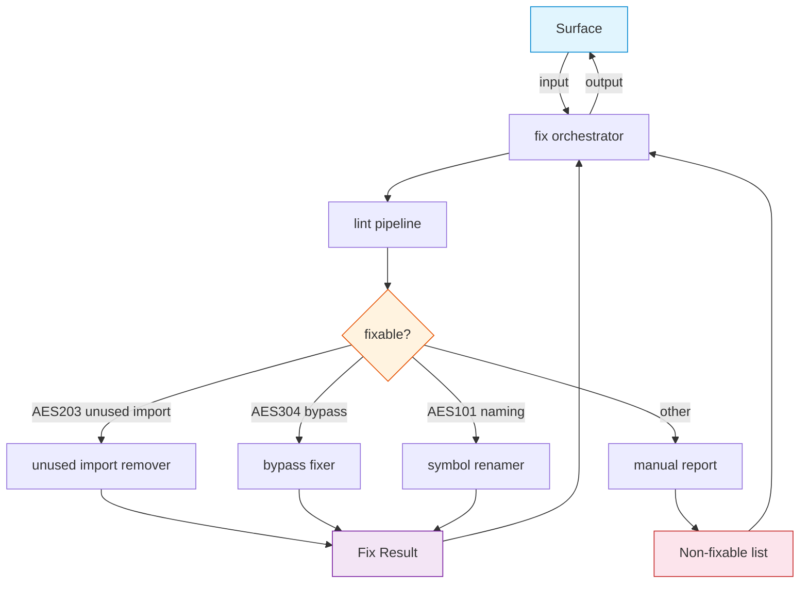

# FRD — auto-fix

## System Overview

### Architecture & Data Flow

The auto-fix crate applies safe, deterministic corrections to source files that violate AES rules. It consumes lint results from the analysis pipeline, filters violations by fixable error code, and writes corrected files back to disk.

**Allowed operation classes (product policy — locked):**

| Class | Examples | Notes |
| ----- | -------- | ----- |
| **Remove** | Delete unused import lines; delete `#[allow(...)]` / bypass comment lines | No new code introduced |
| **Replace** | `unwrap()` → `expect("safe")` on the same line | Local token/line substitution only |
| **Rename** | Prepend `renamed_` (or keep valid snake_case) for AES101 symbols | Mechanical rename of extracted symbol tokens |

**Out of scope:** multi-file renames, structural refactors, adding new imports/types, semantic rewrites, formatting-only passes.

Every fix attempt MUST return a **reason-coded outcome** (`Applied` / `Skipped(reason)` / `Failed(reason)`), not a bare boolean. Dry-run reports the same outcomes without writing files.

## Functional Requirements

### FR-001: Unused Import Removal (AES203)

- **Description**: Automatically remove import lines (`use`, `import`, `from`, `require(`) that are not referenced in the file.
- **Input**: A file path containing an unused import violation reported as AES203 by the linter.
- **Output**: The file with the unused import line deleted. A `FixApplied` event is emitted.
- **Business Rules**:
  - Only lines matching import patterns (`use `, `import `, `from `, `require(`) at the target line are removed.
  - The target line number must be valid (1-indexed, within file length).
  - In dry-run mode, returns `Applied` (would apply) without modifying the file.
- **Edge Cases**:
  - File does not exist: `Failed(file_not_found)`, no modification.
  - Line number is 0 or exceeds file length: `Skipped(line_out_of_bounds)`.
  - Target line is not an import statement: `Skipped(not_an_import_line)`.
  - File has no trailing newline after the removed line: content is reconstructed with newlines preserved.
- **Error Handling**:
  - File read failure (I/O error): `Failed(read_error)`.
  - File write failure: `Failed(write_error)`, file is not modified.

### FR-002: Bypass Comment Removal (AES304)

- **Description**: Remove or replace invalid bypass comments (`#[allow(...)]`, `unwrap()`, `noqa`, `type: ignore`, `panic!`) from source lines.
- **Input**: A file path and line number containing an AES304 bypass violation.
- **Output**: The bypass comment is removed or `unwrap()` is replaced with `expect("safe")`. A `FixApplied` event is emitted.
- **Business Rules**:
  - Lines starting with `#[allow(`, `//`, or `#` (attribute/comment lines) are fully removed.
  - Lines containing `unwrap()` or ending with `unwrap();` are replaced: `unwrap()` → `expect("safe")`, `unwrap();` → `expect("safe");`.
  - Other bypass patterns (`noqa`, `type: ignore`, `panic!`) trigger removal only if they match the target line.
  - In dry-run mode, returns `Applied` (would apply) without modifying the file.
- **Edge Cases**:
  - File does not exist: `Failed(file_not_found)`.
  - Line number out of bounds: `Skipped(line_out_of_bounds)`.
  - Target line has no bypass pattern: `Skipped(no_bypass_pattern)`.
- **Error Handling**:
  - File read failure: `Failed(read_error)`.
  - File write failure: `Failed(write_error)`.

### FR-003: Symbol Renaming (AES101)

- **Description**: Rename symbols that violate snake_case naming conventions by applying a simple rename transform.
- **Input**: A file path and naming violation message containing the symbol to rename.
- **Output**: All occurrences of the old symbol name are replaced with the new name. A `FixApplied` event is emitted with the change count.
- **Business Rules**:
  - The symbol name is extracted from the violation message (token containing `_` with length > 3).
  - Rename logic: if the name already contains `_` and has ≥3 parts, it is kept as-is (already snake_case). Otherwise, `renamed_` prefix is prepended.
  - Only applied if old name ≠ new name.
- **Edge Cases**:
  - File does not exist: `Failed(file_not_found)` with change count 0.
  - Old name not found in file content: `Skipped(symbol_not_found)` with change count 0.
  - Symbol appears multiple times: all occurrences are replaced; `Applied` with change count.
- **Error Handling**:
  - File read failure: `Failed(read_error)`.
  - File write failure: `Failed(write_error)`.

### FR-004: Dry-Run Mode

- **Description**: Run the entire fix pipeline without writing any changes to disk, returning a report of what would be fixed.
- **Input**: A file path and `dry_run = true` flag.
- **Output**: A summary string listing fixable violations by category (AES101, AES304, AES203) and non-fixable manual violations.
- **Business Rules**:
  - No files are modified.
  - Fixable and non-fixable violations are counted and reported.
- **Edge Cases**:
  - No violations found: reports "No automatic fixes applied".
- **Error Handling**:
  - Linter pipeline failure: propagated as error in `FixResult`.

### FR-005: Non-Fixable Violation Reporting

- **Description**: Generate a report of violations that cannot be automatically fixed and require manual intervention.
- **Input**: A list of `LintResult` items from the linter.
- **Output**: A list of `LintMessage` strings describing each non-fixable violation (AES101, AES304, AES203 are fixable; all others are not).
- **Business Rules**:
  - Only violations with codes containing `AES101`, `AES304`, or `AES203` are considered fixable.
  - All other error codes are reported as requiring manual attention.
- **Edge Cases**:
  - Empty violation list: returns empty report.
- **Error Handling**:
  - None (pure data transformation).

## API Contract

| Operation                        | Input                  | Output                        | Purpose                                                             |
| ----------------------------------- | ---------------------- | ----------------------------- | ------------------------------------------------------------------- |
| Execute fixes                     | File path              | Fix result                    | Run linter, filter fixable violations, apply fixes, return summary  |
| Apply bypass fix                   | File path, line number | Reason-coded outcome          | Remove or replace bypass comment at specified line                  |
| Apply unused-import fix           | File path, line number | Reason-coded outcome          | Remove unused import at specified line                              |
| Report non-fixable violations     | Violation list         | Manual fix list               | List violations requiring manual fix                                |
| Run fix (orchestrator)            | File path              | Fix result                    | Delegate to fix protocol's execute method                           |
| Manual report (orchestrator)      | Violation list         | String list                   | Delegate to non-fixable reporting                                   |
| Read file                          | File path              | Optional content              | Read file content                                                   |
| Write file                         | File path, content     | Boolean                       | Write content to file                                               |
| Check path exists                  | File path              | Boolean                       | Check if file exists                                                |

## Integration Points

- **Internal**:
  - Analysis crate — consumed via the analysis aggregate to run linting and obtain violations.
  - The shared crate: value objects, contracts (fix protocol, file adapter protocol, fix orchestrator aggregate), events (fix applied), and utilities (file handler, symbol renaming).
- **External**:
  - Filesystem: reads and writes source files via the file handler utility.

## Non-functional Requirements (Detailed)

- **Performance**: Fix pipeline processes one file at a time. Linting is the bottleneck; fix operations are O(n) per file where n is the number of lines.
- **Memory**: File content is loaded entirely into memory. Large files (>10MB) may cause high memory usage.
- **Accuracy**: Fixes must remain mechanical and local (remove / replace / rename only). No structural or multi-file edits.
- **Idempotency**: Running auto-fix repeatedly on the same file produces no further changes (`Skipped` after first `Applied`).
- **Observability**: Callers can distinguish skip reasons from hard failures via reason-coded outcomes.
- **Concurrency**: Individual fix operations assume single-threaded file access (no concurrent writers).

## Test Scenarios / QA Checklist

- [ ] FR-001: Unused import at valid line is removed (`Applied`).
- [ ] FR-001: Line 0 or beyond EOF → `Skipped(line_out_of_bounds)`.
- [ ] FR-001: Non-import line → `Skipped(not_an_import_line)`.
- [ ] FR-002: `unwrap()` replaced with `expect("safe")` (`Applied`).
- [ ] FR-002: `#[allow(unused)]` line removed entirely (`Applied`).
- [ ] FR-002: Missing file → `Failed(file_not_found)`.
- [ ] FR-003: Symbol rename replaces all occurrences (`Applied` + count).
- [ ] FR-003: Missing file → `Failed(file_not_found)`.
- [ ] FR-004: Dry-run reports outcomes without modifying files.
- [ ] FR-005: Non-fixable violations (e.g., AES401) appear in manual report.
- [ ] FR-005: Empty violation list produces empty manual report.
- [ ] Idempotency: second run yields no further `Applied` outcomes.
- [ ] Write failure → `Failed(write_error)`.

## Assumptions & Constraints

- The analysis pipeline correctly identifies AES203, AES304, and AES101 violations with accurate line numbers.
- Source files are UTF-8 encoded.
- Files are not modified concurrently by external processes during fix execution.
- Dry-run is selectable **per request** (CLI `--dry-run` / MCP args), not only at process construction.
- Only the three fixable error codes (AES101, AES304, AES203) are automated; all others require manual review.

## Glossary

- **AES**: Arwaky Engineering Standards — the architecture rules enforced by lint-arwaky.
- **AES101**: Naming convention violation (e.g., non-snake_case symbols).
- **AES203**: Unused import violation.
- **AES304**: Bypass comment violation (`unwrap()`, `noqa`, `type: ignore`, `#[allow(...)]`, `panic!`).
- **Dry-run**: A mode where the fix pipeline reports what would be fixed without modifying files.
- **Fixable violation**: A violation that can be corrected mechanically without semantic analysis.
- **Reason-coded outcome**: `Applied` | `Skipped(reason)` | `Failed(reason)` for every fix attempt.
- **Operation class**: remove, replace, or rename — the only auto-fix mutation classes allowed.

## Reference

- PRD: [PRD.md](../../PRD.md)
