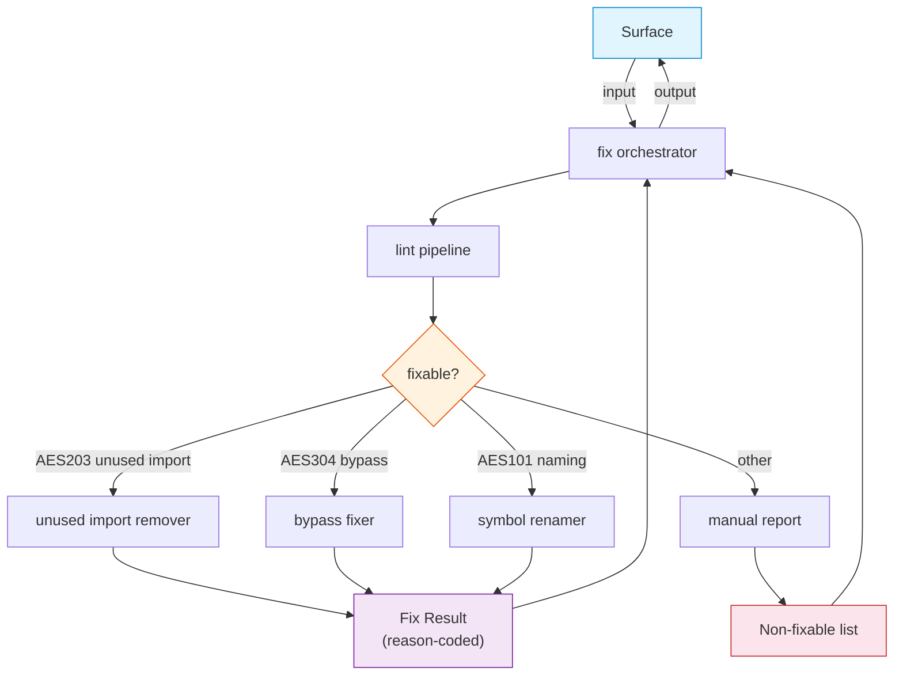

# FRD — auto-fix (v1.1.0)

---

## System Overview

The auto-fix crate applies safe, deterministic corrections to source files
that violate AES rules. It consumes lint results from the analysis pipeline,
filters violations by fixable error code, and writes corrected files back to
disk.

### Allowed Operation Classes (product policy — locked)

| Class       | Examples                                                                 | Notes                                        |
| ------------- | -------------------------------------------------------------------------- | ---------------------------------------------- |
| **Remove**  | Delete unused import lines; delete`#[allow(...)]` / bypass comment lines | No new code introduced                       |
| **Replace** | `unwrap()` → `expect("safe")` on the same line                          | Local token/line substitution only           |
| **Rename**  | Prepend`renamed_` (or keep valid snake_case) for AES101 symbols          | Mechanical rename of extracted symbol tokens |

**Out of scope:** multi-file renames, structural refactors, adding new
imports/types, semantic rewrites, formatting-only passes, `panic!` removal
(requires semantic error handling).

Every fix attempt MUST return a **reason-coded outcome**
(`Applied` / `Skipped(reason)` / `Failed(reason)`), not a bare boolean.
Dry-run reports the same outcomes without writing files.

### Architecture & Data Flow

---

## Functional Requirements

### FR-001: Unused Import Removal (AES203)

- **Description**: Automatically remove import lines (`use`, `import`,
  `from`, `require(`) that are not referenced in the file.
- **Input**: A file path containing an unused import violation reported as
  AES203 by the linter.
- **Output**: The file with the unused import line deleted. A `FixApplied`
  event is emitted.
- **Business Rules**:

  - Only lines matching import patterns (`use `, `import `, `from `,
    `require(`) at the target line are removed.
  - The target line number must be valid (1-indexed, within file length).
  - **Multi-line imports**: If the target line is part of a multi-line
    import block (detected by unclosed `{` or trailing `,`), the fix is
    `Skipped(multi_line_import)` — removing a single line from a multi-line
    import would break syntax.
  - In dry-run mode, returns `Applied` (would apply) without modifying the
    file.
- **Edge Cases**:

  - File does not exist → `Failed(file_not_found)`, no modification.
  - Line number is 0 or exceeds file length → `Skipped(line_out_of_bounds)`.
  - Target line is not an import statement → `Skipped(not_an_import_line)`.
  - Multi-line import block → `Skipped(multi_line_import)`.
  - File has no trailing newline after the removed line → content is
    reconstructed with newlines preserved.
- **Error Handling**:

  - File read failure (I/O error) → `Failed(read_error)`.
  - File write failure → `Failed(write_error)`, file is not modified.

---

### FR-002: Bypass Fix (AES304)

- **Description**: Remove or replace bypass patterns from source lines.
  Only patterns with safe mechanical fixes are applied. Patterns requiring
  semantic understanding are skipped.
- **Input**: A file path and line number containing an AES304 bypass
  violation.
- **Output**: The bypass is removed or replaced. A `FixApplied` event is
  emitted.
- **Business Rules**:

  | Pattern               | Fix Action                                   | Outcome                        |
  | ----------------------- | ---------------------------------------------- | -------------------------------- |
  | `#[allow(...)]`       | Remove entire line                           | `Applied`                      |
  | `// noqa`             | Remove comment from line                     | `Applied`                      |
  | `# noqa`              | Remove comment from line                     | `Applied`                      |
  | `# type: ignore`      | Remove comment from line                     | `Applied`                      |
  | `// @ts-ignore`       | Remove entire line                           | `Applied`                      |
  | `// @ts-expect-error` | Remove entire line                           | `Applied`                      |
  | `// eslint-disable`   | Remove comment from line                     | `Applied`                      |
  | `// FIXME`            | Remove comment from line                     | `Applied`                      |
  | `// HACK`             | Remove comment from line                     | `Applied`                      |
  | `// XXX`              | Remove comment from line                     | `Applied`                      |
  | `unwrap()`            | Replace with`expect("safe")`                 | `Applied`                      |
  | `unwrap();`           | Replace with`expect("safe");`                | `Applied`                      |
  | `panic!(...)`         | **Skip** — requires semantic error handling | `Skipped(unsafe_removal)`      |
  | `todo!(...)`          | **Skip** — requires implementation          | `Skipped(unsafe_removal)`      |
  | `unimplemented!(...)` | **Skip** — requires implementation          | `Skipped(unsafe_removal)`      |
  | `unreachable!(...)`   | **Skip** — requires semantic analysis       | `Skipped(unsafe_removal)`      |
  | `expect(...)`         | **Skip** — already has context message      | `Skipped(already_has_context)` |

  - In dry-run mode, returns `Applied` or `Skipped` (would apply) without
    modifying the file.
- **Edge Cases**:

  - File does not exist → `Failed(file_not_found)`.
  - Line number out of bounds → `Skipped(line_out_of_bounds)`.
  - Target line has no bypass pattern → `Skipped(no_bypass_pattern)`.
  - `unwrap_or()`, `unwrap_or_else()`, `unwrap_or_default()` → NOT
    modified (safe variants, not violations).
- **Error Handling**:

  - File read failure → `Failed(read_error)`.
  - File write failure → `Failed(write_error)`.

---

### FR-003: Symbol Renaming (AES101)

- **Description**: Rename symbols that violate snake_case naming conventions
  by applying a mechanical rename transform.
- **Input**: A file path and naming violation message containing the symbol
  to rename.
- **Output**: All occurrences of the old symbol name are replaced with the
  new name. A `FixApplied` event is emitted with the change count.
- **Business Rules**:

  - The symbol name is extracted from the violation message (token
    containing `_` with length > 3).
  - Rename logic:
    - If the name already contains `_` and has ≥ 3 parts → kept as-is
      (already snake_case), `Skipped(already_valid)`.
    - Otherwise → `renamed_` prefix is prepended.
  - Only applied if old name ≠ new name.
  - **Limitation**: This is a mechanical rename that ensures the symbol
    is flagged differently on re-scan. It does NOT produce semantically
    correct snake_case names (e.g., `MyStruct` → `renamed_MyStruct`, not
    `my_struct`). Correct renaming requires developer judgment.
- **Edge Cases**:

  - File does not exist → `Failed(file_not_found)` with change count 0.
  - Old name not found in file content → `Skipped(symbol_not_found)` with
    change count 0.
  - Symbol appears multiple times → all occurrences are replaced; `Applied`
    with change count.
  - Symbol is a language keyword → `Skipped(keyword_conflict)`.
- **Error Handling**:

  - File read failure → `Failed(read_error)`.
  - File write failure → `Failed(write_error)`.

---

### FR-004: Dry-Run Mode

- **Description**: Run the entire fix pipeline without writing any changes
  to disk, returning a report of what would be fixed.
- **Input**: A file path and `dry_run = true` flag.
- **Output**: A summary string listing fixable violations by category
  (AES101, AES304, AES203) and non-fixable manual violations.
- **Business Rules**:

  - No files are modified.
  - Fixable and non-fixable violations are counted and reported.
  - Reason-coded outcomes are identical to non-dry-run mode.
- **Edge Cases**:

  - No violations found → reports "No automatic fixes applied".
- **Error Handling**: Linter pipeline failure → propagated as error in
  `FixResult`.

---

### FR-005: Non-Fixable Violation Reporting

- **Description**: Generate a report of violations that cannot be
  automatically fixed and require manual intervention.
- **Input**: A list of `LintResult` items from the linter.
- **Output**: A list of `LintMessage` strings describing each non-fixable
  violation.
- **Business Rules**:

  - Fixable codes: `AES101`, `AES203`, `AES304` (subset — see FR-002
    table for which AES304 patterns are fixable).
  - All other error codes are reported as requiring manual attention.
  - AES304 violations with `Skipped(unsafe_removal)` outcome are included
    in the manual report.
- **Edge Cases**:

  - Empty violation list → returns empty report.
- **Error Handling**: None (pure data transformation).

---

## API Contract

| Operation                    | Input                  | Output               | Purpose                                            |
| ------------------------------ | ------------------------ | ---------------------- | ---------------------------------------------------- |
| Execute fixes                | File path              | Fix result           | Run linter, filter fixable violations, apply fixes |
| Apply bypass fix             | File path, line number | Reason-coded outcome | Remove or replace bypass at specified line         |
| Apply unused-import fix      | File path, line number | Reason-coded outcome | Remove unused import at specified line             |
| Apply symbol rename          | File path, symbol      | Reason-coded outcome | Rename symbol across file                          |
| Report non-fixable           | Violation list         | Manual fix list      | List violations requiring manual fix               |
| Run fix (orchestrator)       | File path              | Fix result           | Delegate to fix protocol                           |
| Manual report (orchestrator) | Violation list         | String list          | Delegate to non-fixable reporting                  |
| Read file                    | File path              | Optional content     | Read file content                                  |
| Write file                   | File path, content     | Boolean              | Write content to file                              |
| Check path exists            | File path              | Boolean              | Check if file exists                               |

---

## Integration Points

- **Internal**:

  - Analysis pipeline — consumed via the analysis aggregate to run linting
    and obtain violations.
  - The shared crate: value objects, contracts (fix protocol, file adapter
    protocol, fix orchestrator aggregate), events (fix applied), and
    utilities (file handler, symbol renaming).
- **External**:

  - Filesystem: reads and writes source files via the file handler utility.
    Note: the filesystem crate is read-only; auto-fix performs its own file
    writes.
  - No async runtime dependency.

---

## Non-functional Requirements

- **Performance**: Fix pipeline processes one file at a time. Linting is
  the bottleneck; fix operations are O(n) per file where n is the number
  of lines.
- **Memory**: File content is loaded entirely into memory.
- **Accuracy**: Fixes must remain mechanical and local (remove / replace /
  rename only). No structural or multi-file edits. Patterns requiring
  semantic understanding (`panic!`, `todo!`, `unimplemented!`) are skipped.
- **Idempotency**: Running auto-fix repeatedly on the same file produces no
  further changes (`Skipped` after first `Applied`).
- **Observability**: Callers can distinguish skip reasons from hard failures
  via reason-coded outcomes.
- **Concurrency**: Individual fix operations assume single-threaded file
  access (no concurrent writers).

---

## Test Scenarios / QA Checklist

### FR-001 — Unused Import Removal

| # | Scenario                    | Expected                      | Rule   |
| --- | ----------------------------- | ------------------------------- | -------- |
| 1 | Unused import at valid line | Removed,`Applied`             | FR-001 |
| 2 | Line 0 or beyond EOF        | `Skipped(line_out_of_bounds)` | FR-001 |
| 3 | Non-import line             | `Skipped(not_an_import_line)` | FR-001 |
| 4 | Multi-line import block     | `Skipped(multi_line_import)`  | FR-001 |
| 5 | File does not exist         | `Failed(file_not_found)`      | FR-001 |

### FR-002 — Bypass Fix

| #  | Scenario                     | Expected                                 | Rule   |
| ---- | ------------------------------ | ------------------------------------------ | -------- |
| 1  | `unwrap()` on target line    | Replaced with`expect("safe")`, `Applied` | FR-002 |
| 2  | `#[allow(unused)]` line      | Removed entirely,`Applied`               | FR-002 |
| 3  | `// noqa` comment            | Removed from line,`Applied`              | FR-002 |
| 4  | `// @ts-ignore` line         | Removed entirely,`Applied`               | FR-002 |
| 5  | `// FIXME: refactor` comment | Removed from line,`Applied`              | FR-002 |
| 6  | `panic!("error")`            | `Skipped(unsafe_removal)`                | FR-002 |
| 7  | `todo!()`                    | `Skipped(unsafe_removal)`                | FR-002 |
| 8  | `unimplemented!()`           | `Skipped(unsafe_removal)`                | FR-002 |
| 9  | `unwrap_or_default()`        | Not modified (safe variant)              | FR-002 |
| 10 | Missing file                 | `Failed(file_not_found)`                 | FR-002 |
| 11 | No bypass on target line     | `Skipped(no_bypass_pattern)`             | FR-002 |

### FR-003 — Symbol Renaming

| # | Scenario                        | Expected                         | Rule   |
| --- | --------------------------------- | ---------------------------------- | -------- |
| 1 | Symbol rename, 3 occurrences    | All replaced,`Applied` + count 3 | FR-003 |
| 2 | Symbol already valid snake_case | `Skipped(already_valid)`         | FR-003 |
| 3 | Symbol not found in file        | `Skipped(symbol_not_found)`      | FR-003 |
| 4 | Missing file                    | `Failed(file_not_found)`         | FR-003 |

### FR-004–FR-005 — Dry-Run & Non-Fixable

| # | Scenario                        | Expected                             | Rule   |
| --- | --------------------------------- | -------------------------------------- | -------- |
| 1 | Dry-run with fixable violations | Outcomes reported, no files modified | FR-004 |
| 2 | Dry-run with no violations      | "No automatic fixes applied"         | FR-004 |
| 3 | Non-fixable violations (AES401) | In manual report                     | FR-005 |
| 4 | AES304`panic!` skipped          | In manual report as unsafe_removal   | FR-005 |
| 5 | Empty violation list            | Empty manual report                  | FR-005 |

### Idempotency & Error Handling

| # | Scenario             | Expected                     | Rule |
| --- | ---------------------- | ------------------------------ | ------ |
| 1 | Second run after fix | No further`Applied` outcomes | all  |
| 2 | Write failure        | `Failed(write_error)`        | all  |

---

## Assumptions & Constraints

- The analysis pipeline correctly identifies AES203, AES304, and AES101
  violations with accurate line numbers.
- Source files are UTF-8 encoded.
- Files are not modified concurrently by external processes during fix
  execution.
- Dry-run is selectable **per request** (CLI `--dry-run` / MCP args), not
  only at process construction.
- Only three fixable error codes (AES101, AES304, AES203) are automated;
  all others require manual review.
- AES304 patterns requiring semantic understanding (`panic!`, `todo!`,
  `unimplemented!`, `unreachable!`) are **not auto-fixed** — they are
  skipped and reported as requiring manual intervention.
- Multi-line import blocks are **not auto-fixed** — removing a single line
  would break syntax.
- Symbol renaming is mechanical (`renamed_` prefix) — it does not produce
  semantically correct names. Correct renaming requires developer judgment.
- The filesystem crate is read-only; auto-fix performs its own file writes.
- No async runtime dependency.

---

## Glossary

| Term                     | Definition                                                                                               |
| -------------------------- | ---------------------------------------------------------------------------------------------------------- |
| **AES**                  | Agentic Engineering System — the 7-layer coding convention                                              |
| **AES101**               | Naming convention violation (e.g., non-snake_case symbols)                                               |
| **AES203**               | Unused import violation                                                                                  |
| **AES304**               | Bypass violation (`unwrap()`, `noqa`, `type: ignore`, `#[allow(...)]`, `panic!`, `FIXME`, `HACK`, `XXX`) |
| **Dry-run**              | A mode where the fix pipeline reports what would be fixed without modifying files                        |
| **Fixable violation**    | A violation that can be corrected mechanically without semantic analysis                                 |
| **Reason-coded outcome** | `Applied` / `Skipped(reason)` / `Failed(reason)` for every fix attempt                                   |
| **Operation class**      | Remove, replace, or rename — the only auto-fix mutation classes allowed                                 |
| **Unsafe removal**       | A bypass pattern (`panic!`, `todo!`) that cannot be safely removed without semantic understanding        |

---

## Reference

- PRD: [PRD.md](../../PRD.md)
- Architecture: [ARCHITECTURE.md](../../ARCHITECTURE.md)
- Code Analysis FRD: `crates/quality-rules/FRD.md` (AES304 bypass patterns)
- CLI Commands FRD: `crates/cli-commands/FRD.md` (FR-003 fix command)
