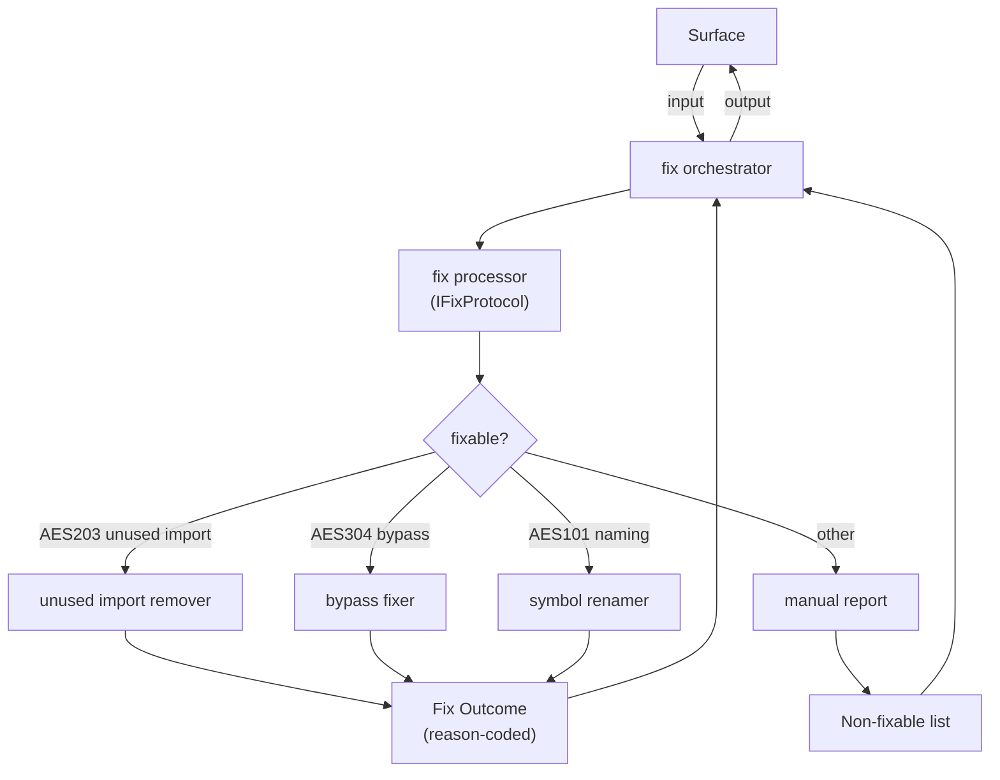

# FRD — auto-fix (v2.0.0)

---

## Reference

- Backlog: [BACKLOG.md](BACKLOG.md) — real condition for this feature; this file is specification only.
- PRD: [PRD.md](../../PRD.md)
- Architecture: [ARCHITECTURE.md](../../ARCHITECTURE.md)
- Quality Rules FRD: `crates/quality-rules/FRD.md` (AES304 bypass patterns)
- CLI Commands FRD: `crates/cli-commands/FRD.md` (fix command)

## System Overview

The auto-fix crate applies safe, deterministic corrections to source files that violate AES rules. It consumes lint results from the analysis pipeline, filters violations by fixable error code, and writes corrected files back to disk.

### Allowed Operation Classes (product policy — locked)

| Class       | Examples                                                          | Notes                                    |
| ----------- | ----------------------------------------------------------------- | ---------------------------------------- |
| **Remove**  | Delete unused import lines; delete `#[allow(...)]` / bypass comment lines | No new code introduced                  |
| **Replace** | `unwrap()` → `expect("safe")` on the same line                    | Local token/line substitution only      |
| **Rename**  | Prepend `renamed_` (or keep valid snake_case) for AES101 symbols   | Mechanical rename of extracted symbol tokens |

**Out of scope:** multi-file renames, structural refactors, adding new imports/types, semantic rewrites, formatting-only passes, `panic!` removal (requires semantic error handling).

Every fix attempt MUST return a **reason-coded outcome** (`Applied` / `Skipped(reason)` / `Failed(reason)`), not a bare boolean. Dry-run reports the same outcomes without writing files.

### Architecture & Data Flow

```mermaid
flowchart TD
    A["Surface"] -->|input| B["fix orchestrator"]
    B --> C["fix processor\n(IFixProtocol)"]
    C --> D{"fixable?"}

    D -->|"AES203 unused import"| E["unused import remover"]
    D -->|"AES304 bypass"| F["bypass fixer"]
    D -->|"AES101 naming"| G["symbol renamer"]
    D -->|"other"| H["manual report"]

    E --> I["Fix Outcome\n(reason-coded)"]
    F --> I
    G --> I
    H --> J["Non-fixable list"]

    I --> B
    J --> B
    B -->|output| A
```

---

## Functional Requirements

### FR-AUTOFIX-001: Unused Import Removal (AES203)

- **Description**: Automatically remove import lines (`use`, `import`, `from`, `require(`, `= require(`) that are not referenced in the file.
- **Input**: A file path containing an unused import violation reported as AES203 by the linter.
- **Output**: The file with the unused import line deleted. A reason-coded `FixOutcome` is returned.
- **Business Rules**:

  - Only lines matching import patterns (`use `, `import `, `from `, `require(`, `= require(`) at the target line are removed.
  - The target line number must be valid (1-indexed, within file length).
  - **Multi-line imports**: If the target line is part of a multi-line import block (detected by unclosed `{`, trailing `,`, or previous-line continuation), the fix is `Skipped(multi_line_import)` — removing a single line from a multi-line import would break syntax.
  - In dry-run mode, returns `Applied` (would apply) without modifying the file.
- **Edge Cases**:

  - File does not exist → `Failed(file_not_found)`, no modification.
  - Line number is 0 or exceeds file length → `Skipped(line_out_of_bounds)`.
  - Target line is not an import statement → `Skipped(not_an_import_line)`.
  - Multi-line import block → `Skipped(multi_line_import)`.
  - File has no trailing newline after the removed line → content is reconstructed with newlines preserved.
- **Error Handling**:

  - File read failure (I/O error) → `Failed(read_error)`.
  - File write failure → `Failed(write_error)`, file is not modified.

---

### FR-AUTOFIX-002: Bypass Fix (AES304)

- **Description**: Remove or replace bypass patterns from source lines. Only patterns with safe mechanical fixes are applied. Patterns requiring semantic understanding are skipped.
- **Input**: A file path and line number containing an AES304 bypass violation.
- **Output**: The bypass is removed or replaced. A reason-coded `FixOutcome` is returned.
- **Business Rules**:

  | Pattern             | Fix Action                            | Outcome                          |
  | ------------------- | ------------------------------------- | -------------------------------- |
  | `#[allow(...)]`     | Remove entire line                    | `Applied`                        |
  | `// noqa`           | Strip comment from line, keep code    | `Applied`                        |
  | `# noqa`            | Strip comment from line, keep code    | `Applied`                        |
  | `# type: ignore`    | Strip comment from line, keep code    | `Applied`                        |
  | `// FIXME`          | Strip comment from line, keep code    | `Applied`                        |
  | `// HACK`           | Strip comment from line, keep code    | `Applied`                        |
  | `// XXX`            | Strip comment from line, keep code    | `Applied`                        |
  | `unwrap()`          | Replace with `expect("safe")`         | `Applied`                        |
  | `unwrap();`         | Replace with `expect("safe");`        | `Applied`                        |
  | `panic!(...)`       | **Skip** — requires semantic error handling | `Skipped(unsafe_removal)`   |
  | Incomplete-work marker | **Skip** — explicit-failure marker for undecided behaviour | `Skipped(unsafe_removal)`   |
  | Incomplete-work marker with arguments | **Skip** — explicit-failure marker for undecided behaviour | `Skipped(unsafe_removal)`   |
  | `unreachable!(...)` | **Skip** — requires semantic analysis      | `Skipped(unsafe_removal)`   |
  | `expect(...)`       | **Skip** — already has context message      | `Skipped(already_has_context)` |

  - Inline comment patterns (`noqa`, `type: ignore`, `FIXME`, `HACK`, `XXX`) are **stripped** from the line (the surrounding code is preserved), not deleted entirely.
  - Standalone comment-only lines and `#[allow]` attribute lines are **removed entirely** (entire line deleted).
  - `unwrap_or()`, `unwrap_or_else()`, `unwrap_or_default()` → NOT modified (safe variants, not violations).
  - In dry-run mode, returns `Applied` or `Skipped` (would apply) without modifying the file.
- **Edge Cases**:

  - File does not exist → `Failed(file_not_found)`.
  - Line number out of bounds → `Skipped(line_out_of_bounds)`.
  - Target line has no bypass pattern → `Skipped(no_bypass_pattern)`.
  - Stripping comment leaves only whitespace → entire line removed.
- **Error Handling**:

  - File read failure → `Failed(read_error)`.
  - File write failure → `Failed(write_error)`.

---

### FR-AUTOFIX-003: Symbol Renaming (AES101)

- **Description**: Rename symbols that violate snake_case naming conventions by applying a mechanical rename transform with word-boundary-aware replacement.
- **Input**: A file path, old symbol name, and new symbol name.
- **Output**: All word-boundary occurrences of the old symbol name are replaced with the new name. A reason-coded `FixOutcome` is returned with the change count.
- **Business Rules**:

  - The rename uses word-boundary-aware replacement to avoid false positives inside strings, comments, or unrelated identifiers.
  - Only applied if old name ≠ new name and old name exists in the file.
  - **Limitation**: This is a mechanical rename that ensures the symbol is flagged differently on re-scan. It does NOT produce semantically correct snake_case names (e.g., `MyStruct` → `renamed_MyStruct`, not `my_struct`). Correct renaming requires developer judgment.
  - In dry-run mode, returns `Applied` with change count without modifying the file.
- **Edge Cases**:

  - File does not exist → `Failed(file_not_found)` with change count 0.
  - Old name not found in file content → `Skipped(symbol_not_found)` with change count 0.
  - Symbol appears multiple times → all word-boundary occurrences are replaced; `Applied` with change count.
  - New name is a Rust keyword → `Skipped(keyword_conflict)`.
- **Error Handling**:

  - File read failure → `Failed(read_error)`.
  - File write failure → `Failed(write_error)`.

---

### FR-AUTOFIX-004: Dry-Run Mode

- **Description**: Run the entire fix pipeline without writing any changes to disk, returning a report of what would be fixed.
- **Input**: A file path and `dry_run = true` flag (selectable per request).
- **Output**: A summary string listing fixable violations by category (AES101, AES304, AES203) and non-fixable manual violations.
- **Business Rules**:

  - No files are modified.
  - Fixable and non-fixable violations are counted and reported.
  - Reason-coded outcomes are identical to non-dry-run mode.
  - The `dry_run` flag is a per-request parameter, not a process-level setting.
- **Edge Cases**:

  - No violations found → reports "No automatic fixes applied".
- **Error Handling**: Linter pipeline failure → propagated as error in `FixResult`.

---

### FR-AUTOFIX-005: Non-Fixable Violation Reporting

- **Description**: Generate a report of violations that cannot be automatically fixed and require manual intervention.
- **Input**: A list of `LintResult` items from the linter.
- **Output**: A list of `LintMessage` strings describing each non-fixable violation.
- **Business Rules**:

  - Fixable codes: `AES101`, `AES203`, `AES304` (subset — see FR-AUTOFIX-002 table for which AES304 patterns are fixable).
  - All other error codes are reported as requiring manual attention.
  - AES304 violations with `Skipped(unsafe_removal)` or `Skipped(already_has_context)` outcome during `execute()` are included in the manual report as skipped items.
- **Edge Cases**:

  - Empty violation list → returns empty report.
- **Error Handling**: None (pure data transformation).

---

## API Contract

### Protocol API

| Method | Input | Output | Error | Event | Description |
| --- | --- | --- | --- | --- | --- |
| `execute` | `FilePath`, `dry_run: bool` | `FixResult` | Reason-coded `Failed(read_error)` / `Failed(write_error)`; a linter pipeline failure propagates as an error inside `FixResult` | `FixApplied` | The single composite fix-processor entry point: runs the linter over one file, filters violations by fixable error code, applies each mechanical correction, and returns a reason-coded outcome per attempt. |

### Aggregate API

| Method | Input | Output | Error | Event | Description |
| --- | --- | --- | --- | --- | --- |
| `execute` | `FixRequest` (`Execute { path, dry_run }` or `ManualReport { violations }`) | `FixResponse` (`Execute { result }` or `ManualReport { reports }`) | None — failure detail travels inside the reason-coded payload | — | Aggregate request/response dispatch covering both the fix run and the manual report. |
| `execute_impl` | `FilePath`, `dry_run: bool` | `FixResult` | Reason-coded `Failed` outcomes; linter failure carried inside `FixResult` | `FixApplied` | Delegate the full fix pipeline to the fix processor. |
| `manual_report_impl` | `&[LintResult]` | `Vec<LintMessage>` | None | — | List the violations that no operation class can correct, including AES304 items skipped as unsafe. |
| `fix_bypass` | `&str` file path, `u32` line | `FixOutcome` | Reason-coded `Failed(file_not_found)` / `Failed(read_error)` / `Failed(write_error)` | `FixApplied` | Apply a single bypass correction at the given line and report its reason-coded outcome. |
| `fix_unused_import` | `&str` file path, `u32` line | `FixOutcome` | Reason-coded `Failed` / `Skipped` variants as defined by the remove class | `FixApplied` | Remove a single unused import line and report its reason-coded outcome. |
| `rename_symbol` | `&str` file path, `&str` old name, `&str` new name | `FixOutcome` | Reason-coded `Failed` / `Skipped` variants as defined by the rename class | `FixApplied` | Rename every word-boundary occurrence of a symbol and report the outcome with the change count. |
| `file_adapter` | — | `Arc<dyn IFileAdapterProtocol>` | None | — | Hand back the injected file I/O adapter so callers can read or write through the same boundary. |

---

## Integration Points

| System | Direction | Purpose | Failure mode |
| --- | --- | --- | --- |
| `IFixProtocol` | in | Protocol contract the fix processor implements; the aggregate delegates every operation through this trait | Protocol method returns an error → propagated as a `Failed(reason)` outcome |
| `IFixAggregate` | in | Single composite entry point over the auto-fix domain that the surface composes | Aggregate unavailable → the surface reports a runtime error exit code |
| `IFileAdapterProtocol` | in | File I/O boundary that the aggregate exposes for direct reads or writes | Read or write error → reason-coded `Failed(read_error)` / `Failed(write_error)` |
| `FixOrchestrator` | out | Thin delegation layer that bridges the aggregate contract to the protocol | An internal panic → unhandled error surfaces to the caller |
| `LintFixProcessor` | out | Core fix algorithm implementation for all three operation classes | Algorithm-level failure → reason-coded outcome, file left unmodified on write failure |
| `FileAdapter` | out | Wraps the filesystem aggregate to perform every read, write, and existence check | Filesystem aggregate error → `Failed(read_error)` or `Failed(write_error)` |
| `AutoFixContainer` | out | DI composition root that wires the aggregate, protocol, and adapter together | A component missing from the container → construction error at startup |
| `filesystem` crate | in | Provides `IFilesystemAggregate` used for `read_cached()`, `write_string()`, and `path_exists()` | File read or write error → `Failed(read_error)` / `Failed(write_error)`; path not found → `Failed(file_not_found)` |
| `quality-rules` crate | in | Provides `ICodeAnalysisAggregate` for running the linter and obtaining violations | Linter pipeline failure → propagated as an error inside `FixResult` |
| `shared` crate | in | Provides value objects (`FixOutcome`, `FixResult`, `FixApplied`), skip and fail reason enums, and the `IFixProtocol` / `IFixAggregate` contracts | Absent → compile-time failure only; no runtime failure mode |

---

## Non-functional Requirements

| Metric | Target | Measurement method |
| --- | --- | --- |
| Fix pipeline throughput | One file at a time; fix operations are O(n) per file where n is the line count | Time a single-file fix run and assert linear growth against file length |
| Linting overhead | The linter is the bottleneck; a single re-lint pass counts remaining violations after fixes are applied | Measure the fix-apply path time and compare it to the linter-only pass |
| Memory | File content is loaded entirely into memory for the duration of the fix run | Inspect the allocator usage during a scan of the largest expected input file |
| Mechanical correctness | Every fix is local — remove, replace, or rename only; no structural or multi-file edits | Parse the AST of every modified file after a fix run and assert no unexpected mutations |
| Idempotency | A second run on the same file produces no further `Applied` outcomes | Run auto-fix twice on the same input and assert the second run returns `Skipped` for every previously applied attempt |
| Observability | Callers distinguish skip reasons from hard failures via reason-coded outcomes | Assert that every outcome carries one of the three reason categories (`Applied`, `Skipped`, `Failed`) |
| Concurrency | Individual fix operations assume single-threaded file access | Validate that no concurrent-writer path is exercised in the test suite |
| Accuracy | Bypass patterns that are explicit-failure markers or incomplete-work markers — which require semantic understanding — are skipped rather than removed | Count occurrences of each pattern class in a fixture file and assert only the safe subset is applied |

---

## Test Scenarios

- An unused import at a valid line is removed and the outcome is `Applied`.
- A target line number of 0, or one beyond the end of the file, yields `Skipped(line_out_of_bounds)`.
- A target line that is not an import statement yields `Skipped(not_an_import_line)`.
- A target line inside a multi-line import block yields `Skipped(multi_line_import)` because removing one line would break syntax.
- A file that does not exist yields `Failed(file_not_found)`.
- A JavaScript `= require(` import pattern is detected and removed on the same terms as any other unused import.
- An `unwrap()` call on the target line is replaced with `expect("safe")` and the outcome is `Applied`.
- A line carrying an `#[allow(unused)]` attribute is removed entirely and the outcome is `Applied`.
- A `// noqa` comment is stripped from its line while the surrounding code is preserved, and the outcome is `Applied`.
- A `// FIXME: refactor` comment is stripped from its line while the surrounding code is preserved, and the outcome is `Applied`.
- An explicit-failure marker such as a panic call with an error message yields `Skipped(unsafe_removal)` because removal requires semantic error handling.
- A `todo!()` incomplete-work marker yields `Skipped(unsafe_removal)`.
- An incomplete-work marker without arguments yields `Skipped(unsafe_removal)`.
- A `unwrap_or_default()` call is not modified because it is a safe variant rather than a violation.
- A bypass fix on a missing file yields `Failed(file_not_found)`.
- A target line with no bypass pattern yields `Skipped(no_bypass_pattern)`.
- A symbol rename over three occurrences replaces all of them and returns `Applied` with the change count.
- A symbol that is already valid snake_case yields `Skipped(already_valid)`.
- A symbol that cannot be found in the file content yields `Skipped(symbol_not_found)` with a change count of zero.
- A rename on a missing file yields `Failed(file_not_found)` with a change count of zero.
- A new name that collides with a reserved language keyword yields `Skipped(keyword_conflict)`.
- A dry run over fixable violations reports the same reason-coded outcomes as a real run while leaving every file unmodified.
- A dry run over a file with no violations reports "No automatic fixes applied".
- A non-fixable violation such as an AES401 lands in the manual report rather than being corrected.
- An AES304 explicit-failure marker that was skipped lands in the manual report classified as an unsafe removal.
- An empty violation list produces an empty manual report.
- A second auto-fix run over an already-corrected file produces no further `Applied` outcomes.
- A file write failure yields `Failed(write_error)` and leaves the file unmodified.
### SCEN-001 — Unused Import Removal

FRD Ref: FR-001

| # | Scenario | Expected |
| - | - | - |
| 1 | Unused import at valid line | Removed, `Applied` |
| 2 | Line 0 or beyond EOF | `Skipped(line_out_of_bounds)` |
| 3 | Non-import line | `Skipped(not_an_import_line)` |
| 4 | Multi-line import block | `Skipped(multi_line_import)` |
| 5 | File does not exist | `Failed(file_not_found)` |
| 6 | JS `= require(` pattern | Detected and removed |

### SCEN-002 — Bypass Fix

FRD Ref: FR-002

| # | Scenario | Expected |
| - | - | - |
| 1 | `unwrap()` on target line | Replaced with `expect("safe")`, `Applied` |
| 2 | `#[allow(unused)]` line | Removed entirely, `Applied` |
| 3 | `// noqa` comment | Stripped from line, `Applied` |
| 4 | `// FIXME: refactor` comment | Stripped from line, `Applied` |
| 5 | `panic!("error")` | `Skipped(unsafe_removal)` |
| 6 | `todo!()` | `Skipped(unsafe_removal)` |
| 7 | `unimplemented!()` | `Skipped(unsafe_removal)` |
| 9 | Missing file | `Failed(file_not_found)` |
| 10 | No bypass on target line | `Skipped(no_bypass_pattern)` |

### SCEN-003 — Symbol Renaming

FRD Ref: FR-003

| # | Scenario | Expected |
| - | - | - |
| 1 | Symbol rename, 3 occurrences | All replaced, `Applied` + count |
| 2 | Symbol already valid snake_case | `Skipped(already_valid)` |
| 3 | Symbol not found in file | `Skipped(symbol_not_found)` |
| 4 | Missing file | `Failed(file_not_found)` |
| 5 | New name is a Rust keyword | `Skipped(keyword_conflict)` |

### SCEN-004–FR-005 — Dry-Run & Non-Fixable

FRD Ref: FR-004, FR-005

| # | Scenario | Expected |
| - | - | - |
| 1 | Dry-run with fixable violations | Outcomes reported, no files modified |
| 2 | Dry-run with no violations | "No automatic fixes applied" |
| 3 | Non-fixable violations (AES401) | In manual report |
| 4 | AES304 `panic!` skipped | In manual report as unsafe_removal |
| 5 | Empty violation list | Empty manual report |

### Idempotency & Error Handling

| #  | Scenario             | Expected                     |
| -- | -------------------- | ---------------------------- |
| 1  | Second run after fix | No further `Applied` outcomes |
| 2  | Write failure        | `Failed(write_error)`        |

---

## Assumptions & Constraints

- The analysis pipeline correctly identifies AES203, AES304, and AES101 violations with accurate line numbers.
- Source files are UTF-8 encoded.
- Files are not modified concurrently by external processes during fix execution.
- Dry-run is selectable **per request** (CLI `--dry-run` / MCP args), not only at process construction.
- Only three fixable error codes (AES101, AES304, AES203) are automated; all others require manual review.
- AES304 patterns requiring semantic understanding — explicit-failure markers, incomplete-work markers, and unreachable-code markers — are **not auto-fixed**; they are skipped and reported as requiring manual intervention.
- Multi-line import blocks are **not auto-fixed** — removing a single line would break syntax.
- Symbol renaming is mechanical (`renamed_` prefix) — it does not produce semantically correct names. Correct renaming requires developer judgment.
- The filesystem crate provides read/write I/O via `IFilesystemAggregate`; auto-fix delegates all I/O through `FileAdapter`.
- No async runtime dependency.

---

## Glossary

- **AES**: Agentic Engineering System — the 7-layer coding convention.
- **AES101**: Naming convention violation (for example, non-snake_case symbols).
- **AES203**: Unused import violation.
- **AES304**: Bypass violation (`unwrap()`, `noqa`, `type: ignore`, `#[allow(...)]`, `FIXME`, `HACK`, `XXX`).
- **Dry-run**: A mode where the fix pipeline reports what would be fixed without modifying files.
- **Fixable violation**: A violation that can be corrected mechanically without semantic analysis.
- **Reason-coded outcome**: `Applied` / `Skipped(reason)` / `Failed(reason)` returned for every fix attempt.
- **Operation class**: Remove, replace, or rename — the only auto-fix mutation classes allowed.
- **Unsafe removal**: A bypass pattern that is an explicit-failure marker or an incomplete-work marker, which cannot be safely removed without semantic understanding.

---
