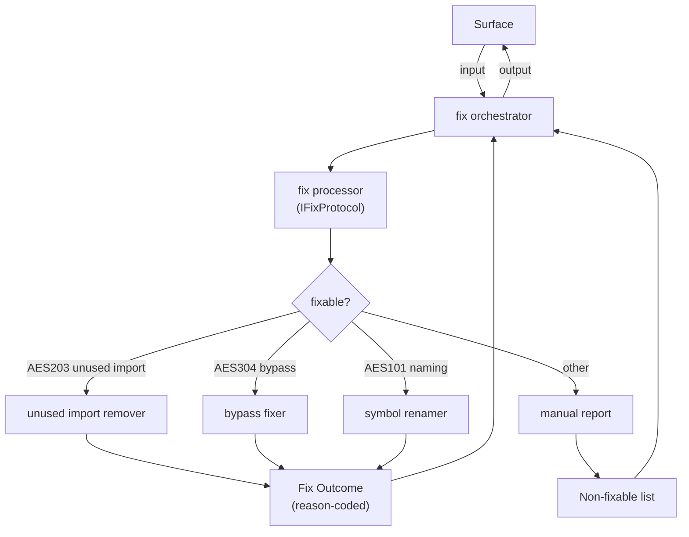

# FRD — auto-fix (v2.0.0)

---

## Reference

- Backlog: [BACKLOG.md](BACKLOG.md) — real condition for this feature; this file is specification only.
- PRD: [PRD.md](../../PRD.md)
- Architecture: [ARCHITECTURE.md](../../ARCHITECTURE.md)
- Quality Rules FRD: `crates/quality-rules/FRD.md` (AES304 bypass patterns)

## System Overview

The auto-fix crate applies safe, deterministic corrections to source files that violate AES rules. It consumes lint results from the analysis pipeline, filters violations by fixable error code, and writes corrected files back to disk.

### Allowed Operation Classes (product policy — locked)

| Class       | Examples                                                          | Notes                                    |
| ----------- | ----------------------------------------------------------------- | ---------------------------------------- |
| **Remove**  | Delete unused import lines; delete `#[allow(...)]` / bypass comment lines | No new code introduced                  |
| **Replace** | `unwrap()` → `expect("safe")` on the same line                    | Local token/line substitution only      |
| **Rename**  | Prepend `renamed_` (or keep valid snake_case) for AES101 symbols   | Mechanical rename of extracted symbol tokens |

**Out of scope:** multi-file renames, structural refactors, adding new imports/types, semantic rewrites, formatting-only passes, `panic!` removal (requires semantic error handling).

Every fix attempt MUST return a **reason-coded outcome** (`Applied` / `Skipped(reason)` / `Failed(reason)`), not a bare boolean. Dry-run reports the same outcomes without writing files.

### Architecture & Data Flow

```mermaid
flowchart TD
    A["Surface"] -->|input| B["fix orchestrator"]
    B --> C["fix processor\n(IFixProtocol)"]
    C --> D{"fixable?"}

    D -->|"AES203 unused import"| E["unused import remover"]
    D -->|"AES304 bypass"| F["bypass fixer"]
    D -->|"AES101 naming"| G["symbol renamer"]
    D -->|"other"| H["manual report"]

    E --> I["Fix Outcome\n(reason-coded)"]
    F --> I
    G --> I
    H --> J["Non-fixable list"]

    I --> B
    J --> B
    B -->|output| A
```

---

## Functional Requirements

### FR-AutoFix-001: Unused Import Removal (AES203)

- **Description**: Automatically remove import lines (`use`, `import`, `from`, `require(`, `= require(`) that are not referenced in the file.
- **Input**: A file path containing an unused import violation reported as AES203 by the linter.
- **Output**: The file with the unused import line deleted. A reason-coded `FixOutcome` is returned.
- **Business Rules**:

  - Only lines matching import patterns (`use `, `import `, `from `, `require(`, `= require(`) at the target line are removed.
  - The target line number must be valid (1-indexed, within file length).
  - **Multi-line imports**: If the target line is part of a multi-line import block (detected by unclosed `{`, trailing `,`, or previous-line continuation), the fix is `Skipped(multi_line_import)` — removing a single line from a multi-line import would break syntax.
  - In dry-run mode, returns `Applied` (would apply) without modifying the file.
- **Edge Cases**:

  - File does not exist → `Failed(file_not_found)`, no modification.
  - Line number is 0 or exceeds file length → `Skipped(line_out_of_bounds)`.
  - Target line is not an import statement → `Skipped(not_an_import_line)`.
  - Multi-line import block → `Skipped(multi_line_import)`.
  - File has no trailing newline after the removed line → content is reconstructed with newlines preserved.
- **Error Handling**:

  - File read failure (I/O error) → `Failed(read_error)`.
  - File write failure → `Failed(write_error)`, file is not modified.

---

### FR-AutoFix-002: Bypass Fix (AES304)

- **Description**: Remove or replace bypass patterns from source lines. Only patterns with safe mechanical fixes are applied. Patterns requiring semantic understanding are skipped.
- **Input**: A file path and line number containing an AES304 bypass violation.
- **Output**: The bypass is removed or replaced. A reason-coded `FixOutcome` is returned.
- **Business Rules**:

  | Pattern             | Fix Action                            | Outcome                          |
  | ------------------- | ------------------------------------- | -------------------------------- |
  | `#[allow(...)]`     | Remove entire line                    | `Applied`                        |
  | `// noqa`           | Strip comment from line, keep code    | `Applied`                        |
  | `# noqa`            | Strip comment from line, keep code    | `Applied`                        |
  | `# type: ignore`    | Strip comment from line, keep code    | `Applied`                        |
  | `// FIXME`          | Strip comment from line, keep code    | `Applied`                        |
  | `// HACK`           | Strip comment from line, keep code    | `Applied`                        |
  | `// XXX`            | Strip comment from line, keep code    | `Applied`                        |
  | `unwrap()`          | Replace with `expect("safe")`         | `Applied`                        |
  | `unwrap();`         | Replace with `expect("safe");`        | `Applied`                        |
  | `panic!(...)`       | **Skip** — requires semantic error handling | `Skipped(unsafe_removal)`   |
  | `todo!(...)`        | **Skip** — future-logic placeholder             | `Skipped(unsafe_removal)`   |
  | `unimplemented!(...)` | **Skip** — future-logic placeholder             | `Skipped(unsafe_removal)`   |
  | `unreachable!(...)` | **Skip** — requires semantic analysis      | `Skipped(unsafe_removal)`   |
  | `expect(...)`       | **Skip** — already has context message      | `Skipped(already_has_context)` |

  - Inline comment patterns (`noqa`, `type: ignore`, `FIXME`, `HACK`, `XXX`) are **stripped** from the line (the surrounding code is preserved), not deleted entirely.
  - Standalone comment-only lines and `#[allow]` attribute lines are **removed entirely** (entire line deleted).
  - `unwrap_or()`, `unwrap_or_else()`, `unwrap_or_default()` → NOT modified (safe variants, not violations).
  - In dry-run mode, returns `Applied` or `Skipped` (would apply) without modifying the file.
- **Edge Cases**:

  - File does not exist → `Failed(file_not_found)`.
  - Line number out of bounds → `Skipped(line_out_of_bounds)`.
  - Target line has no bypass pattern → `Skipped(no_bypass_pattern)`.
  - Stripping comment leaves only whitespace → entire line removed.
- **Error Handling**:

  - File read failure → `Failed(read_error)`.
  - File write failure → `Failed(write_error)`.

---

### FR-AutoFix-003: Symbol Renaming (AES101)

- **Description**: Rename symbols that violate snake_case naming conventions by applying a mechanical rename transform with word-boundary-aware replacement.
- **Input**: A file path, old symbol name, and new symbol name.
- **Output**: All word-boundary occurrences of the old symbol name are replaced with the new name. A reason-coded `FixOutcome` is returned with the change count.
- **Business Rules**:

  - The rename uses word-boundary-aware replacement to avoid false positives inside strings, comments, or unrelated identifiers.
  - Only applied if old name ≠ new name and old name exists in the file.
  - **Limitation**: This is a mechanical rename that ensures the symbol is flagged differently on re-scan. It does NOT produce semantically correct snake_case names (e.g., `MyStruct` → `renamed_MyStruct`, not `my_struct`). Correct renaming requires developer judgment.
  - In dry-run mode, returns `Applied` with change count without modifying the file.
- **Edge Cases**:

  - File does not exist → `Failed(file_not_found)` with change count 0.
  - Old name not found in file content → `Skipped(symbol_not_found)` with change count 0.
  - Symbol appears multiple times → all word-boundary occurrences are replaced; `Applied` with change count.
  - New name is a Rust keyword → `Skipped(keyword_conflict)`.
- **Error Handling**:

  - File read failure → `Failed(read_error)`.
  - File write failure → `Failed(write_error)`.

---

### FR-AutoFix-004: Dry-Run Mode

- **Description**: Run the entire fix pipeline without writing any changes to disk, returning a report of what would be fixed.
- **Input**: A file path and `dry_run = true` flag (selectable per request).
- **Output**: A summary string listing fixable violations by category (AES101, AES304, AES203) and non-fixable manual violations.
- **Business Rules**:

  - No files are modified.
  - Fixable and non-fixable violations are counted and reported.
  - Reason-coded outcomes are identical to non-dry-run mode.
  - The `dry_run` flag is a per-request parameter, not a process-level setting.
- **Edge Cases**:

  - No violations found → reports "No automatic fixes applied".
- **Error Handling**: Linter pipeline failure → propagated as error in `FixResult`.

---

### FR-AutoFix-005: Non-Fixable Violation Reporting

- **Description**: Generate a report of violations that cannot be automatically fixed and require manual intervention.
- **Input**: A list of `LintResult` items from the linter.
- **Output**: A list of `LintMessage` strings describing each non-fixable violation.
- **Business Rules**:

  - Fixable codes: `AES101`, `AES203`, `AES304` (subset — see FR-AutoFix-002 table for which AES304 patterns are fixable).
  - All other error codes are reported as requiring manual attention.
  - AES304 violations with `Skipped(unsafe_removal)` or `Skipped(already_has_context)` outcome during `execute()` are included in the manual report as skipped items.
- **Edge Cases**:

  - Empty violation list → returns empty report.
- **Error Handling**: None (pure data transformation).

---

### FR-AutoFix-006: File I/O Adapter

- **Description**: Read, write, and query file-system paths on behalf of the fix
  operations. This seam carries no lint logic, but it can fail independently
  (missing file, permission error, partial write) and therefore carries its own
  requirement.
- **Input**: A `FilePath` and, for write, a `ContentString`.
- **Output**: `Option<ContentString>` for read, `bool` for write and exists.
- **Business Rules**:
  - `read_file` returns `None` when the path does not exist or cannot be read.
  - `write_file` returns `false` on any I/O failure; callers must not assume
    atomicity.
  - `path_exists` returns `true` only for paths that are reachable and readable.
  - All operations are synchronous; no async runtime dependency.
- **Edge Cases**:
  - Path is a directory on read → returns `None`.
  - Parent directory missing on write → write fails; the caller decides whether
    to create parents.
  - File locked by another process → platform-dependent access error, surfaced
    as `None` or `false`.
- **Error Handling**: All errors are returned through the `bool` / `None` result;
  the caller inspects the return to decide retry, skip, or report.

---

## API Contract

### Protocol API

| Method | Input | Output | Error | Event | Description |
|---|---|---|---|---|---|
| `read_file` | &FilePath | `Option<ContentString>` | — | — | Read file. |
| `write_file` | &FilePath, &ContentString | `bool` | — | — | Write file. |
| `path_exists` | &FilePath | `bool` | — | — | Path exists. |
| `execute` | &FilePath, bool | `FixResult` | — | — | Execute. |
| `fix_bypass_comments` | &str, LineNumber | `FixOutcome` | — | — | Fix bypass comments. |
| `fix_unused_import` | &str, LineNumber | `FixOutcome` | — | — | Fix unused import. |
| `rename_symbol` | &str, &str, &str | `FixOutcome` | — | — | Rename symbol. |
| `report_non_fixable` | &[LintResult] | `Vec<LintMessage>` | — | — | Report non fixable. |

### Aggregate API

| Method | Input | Output | Error | Event | Description |
|---|---|---|---|---|---|
| `execute` | FixRequest | `FixResponse` | — | — | Single composite entry point over the feature. |

## Integration Points
| System | Direction | Purpose | Failure mode |
| --- | --- | --- | --- |
| `filesystem` aggregate | in | Provide cached file reads and writes for the correction pass | A read returns empty content → the fix reports `Failed(read_error)` and the file is left untouched |
| `quality-rules` aggregate | in | Supply lint violations, including the rule code and line number of each finding | No violations supplied → the response carries an empty manual report and no files change |
| Fix processor protocol | out (internal) | Apply one mechanical correction class to a single target line | The line does not match the class → `Skipped` with the specific reason, never a silent write |
| Fix orchestrator aggregate | out (internal) | Expose the single composite entry point the surface calls | A request names an unknown violation code → it is reported as non-fixable, not retried |
| Container composition root | out (internal) | Wire processor, orchestrator, and file adapter together | A dependency is missing at wiring time → startup fails before any file is opened |

## Non-functional Requirements
| Metric | Target | Measurement method |
| --- | --- | --- |
| Correction scope | Every applied correction is a single-line remove, replace, or rename | Assert the outcome is reason-coded and inspect the diff for any change outside the target line |
| Reason coding | 100% of fix attempts return `Applied`, `Skipped(reason)`, or `Failed(reason)` | Assert no bare boolean outcome is produced at the protocol boundary |
| Mechanical-only guarantee | Zero structural or multi-file edits | Diff a file before and after a fix run and confirm the changed-line count equals the number of reported outcomes |
| Idempotency | A second run over an already-fixed file reports no further applied corrections | Run the fix twice against the same input and compare the two outcome sets |
| Latency per file | Correction pass is O(lines); a full re-lint is the dominant cost | Time a run over a fixed workspace and record the correction-to-lint split |
| Memory | One file's content is resident at a time | Inspect the working-set size while fixing a workspace larger than available cache |
| Concurrency | Single-threaded file access; no concurrent writers assumed | Run two fix processes against the same file and confirm the second reports a write failure rather than interleaving |
| Dry-run fidelity | A dry run reports the same outcome codes as a real run, changing no file | Run both modes against the same input and diff the outcomes and the file tree |

## Test Scenarios / QA Checklist

Each scenario is stated below as a table of cases: the input condition and the expected result.

- **SCEN-001 — Unused Import Removal** — e.g. Unused import at valid line → Removed, `Applied`
- **SCEN-002 — Bypass Fix** — e.g. `unwrap()` on target line → Replaced with `expect("safe")`, `Applied`
- **SCEN-003 — Symbol Renaming** — e.g. Symbol rename, 3 occurrences → All replaced, `Applied` + count
- **SCEN-004–FR-AutoFix-005 — Dry-Run & Non-Fixable** — e.g. Dry-run with fixable violations → Outcomes reported, no files modified
- **SCEN-006 — File I/O Adapter** — e.g. Read an existing file → `Some(content)`; read non-existent → `None`; write success → `true`
- **Idempotency & Error Handling** — e.g. Second run after fix → No further `Applied` outcomes

### SCEN-001 — Unused Import Removal

FRD Ref: FR-AutoFix-001

| # | Scenario | Expected |
| - | - | - |
| 1 | Unused import at valid line | Removed, `Applied` |
| 2 | Line 0 or beyond EOF | `Skipped(line_out_of_bounds)` |
| 3 | Non-import line | `Skipped(not_an_import_line)` |
| 4 | Multi-line import block | `Skipped(multi_line_import)` |
| 5 | File does not exist | `Failed(file_not_found)` |
| 6 | JS `= require(` pattern | Detected and removed |

### SCEN-002 — Bypass Fix

FRD Ref: FR-AutoFix-002

| # | Scenario | Expected |
| - | - | - |
| 1 | `unwrap()` on target line | Replaced with `expect("safe")`, `Applied` |
| 2 | `#[allow(unused)]` line | Removed entirely, `Applied` |
| 3 | `// noqa` comment | Stripped from line, `Applied` |
| 4 | `// FIXME: refactor` comment | Stripped from line, `Applied` |
| 5 | `panic!("error")` | `Skipped(unsafe_removal)` |
| 6 | `todo!()` | `Skipped(unsafe_removal)` |
| 7 | `unimplemented!()` | `Skipped(unsafe_removal)` |
| 9 | Missing file | `Failed(file_not_found)` |
| 10 | No bypass on target line | `Skipped(no_bypass_pattern)` |

### SCEN-003 — Symbol Renaming

FRD Ref: FR-AutoFix-003

| # | Scenario | Expected |
| - | - | - |
| 1 | Symbol rename, 3 occurrences | All replaced, `Applied` + count |
| 2 | Symbol already valid snake_case | `Skipped(already_valid)` |
| 3 | Symbol not found in file | `Skipped(symbol_not_found)` |
| 4 | Missing file | `Failed(file_not_found)` |
| 5 | New name is a Rust keyword | `Skipped(keyword_conflict)` |

### SCEN-004–FR-AutoFix-005 — Dry-Run & Non-Fixable

FRD Ref: FR-AutoFix-004, FR-AutoFix-005

| # | Scenario | Expected |
| - | - | - |
| 1 | Dry-run with fixable violations | Outcomes reported, no files modified |
| 2 | Dry-run with no violations | "No automatic fixes applied" |
| 3 | Non-fixable violations (AES401) | In manual report |
| 4 | AES304 `panic!` skipped | In manual report as unsafe_removal |
| 5 | Empty violation list | Empty manual report |

### Idempotency & Error Handling

| #  | Scenario             | Expected                     |
| -- | -------------------- | ---------------------------- |
| 1  | Second run after fix | No further `Applied` outcomes |
| 2  | Write failure        | `Failed(write_error)`        |

---

### SCEN-006 — File I/O Adapter

FRD Ref: FR-AutoFix-006

| # | Scenario | Expected |
| - | - | - |
| 1 | Read an existing file | `Some(content)` |
| 2 | Read a non-existent file | `None` |
| 3 | Write to a valid path | `true` |
| 4 | Write to a read-only path | `false` |
| 5 | `path_exists` for a directory | `true` |

---

## Assumptions & Constraints

- The analysis pipeline correctly identifies AES203, AES304, and AES101 violations with accurate line numbers.
- Source files are UTF-8 encoded.
- Files are not modified concurrently by external processes during fix execution.
- Dry-run is selectable **per request** (CLI `--dry-run` / MCP args), not only at process construction.
- Only three fixable error codes (AES101, AES304, AES203) are automated; all others require manual review.
- AES304 patterns requiring semantic understanding (`panic!`, `todo!`, `unimplemented!`, `unreachable!`) are **not auto-fixed** — they are skipped and reported as requiring manual intervention.
- Multi-line import blocks are **not auto-fixed** — removing a single line would break syntax.
- Symbol renaming is mechanical (`renamed_` prefix) — it does not produce semantically correct names. Correct renaming requires developer judgment.
- The filesystem crate provides read/write I/O via `IFilesystemAggregate`; auto-fix delegates all I/O through `FileAdapter`.
- No async runtime dependency.

---

## Glossary

- **AES**: Agentic Engineering System — the 7-layer coding convention
- **AES101**: Naming convention violation (e.g., non-snake_case symbols)
- **AES203**: Unused import violation
- **AES304**: Bypass violation (`unwrap()`, `noqa`, `type: ignore`, `#[allow(...)]`, `FIXME`, `HACK`, `XXX`)
- **Dry-run**: A mode where the fix pipeline reports what would be fixed without modifying files
- **Fixable violation**: A violation that can be corrected mechanically without semantic analysis
- **Reason-coded outcome**: `Applied` / `Skipped(reason)` / `Failed(reason)` for every fix attempt
- **Operation class**: Remove, replace, or rename — the only auto-fix mutation classes allowed
- **Unsafe removal**: A bypass pattern (`panic!`, `todo!`) that cannot be safely removed without semantic understanding

---
