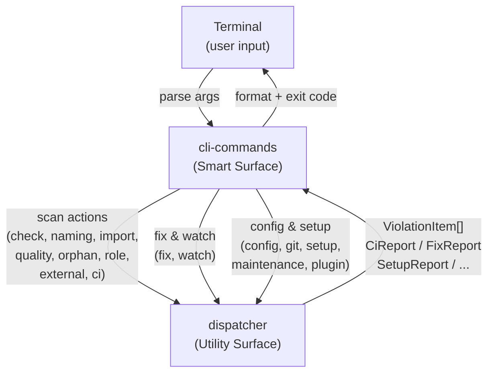

# FRD — cli-commands (v0.2.0)

---

## System Overview

The cli-commands crate is a **Smart Surface** — a thin CLI wrapper that
parses command-line args, delegates **all business logic** to the
`dispatcher` crate via `dispatcher::surface_*_action::*` functions, and
formats the output for terminal display. CLI never calls rule aggregates
directly; dispatcher owns every scan, fix, config, and setup action.

### Architecture & Data Flow

### Exit Code Contract

| Code  | Meaning                                                             |
| ------- | --------------------------------------------------------------------- |
| **0** | Ok / clean / diagnostic completed                                   |
| **1** | Policy fail (violations, CI fail, vulns found, remaining after fix) |
| **2** | Runtime error (bad path, pipeline crash, invalid state)             |
| **3** | Prerequisite missing (required external tool not installed)         |

**Doctor policy (locked):** exit **0** when the diagnostic finishes (missing
tools are listed in the body); exit **2** only if the doctor command itself
fails.

---

## Functional Requirements

### FR-001: Check/Scan Command (Mutual Aliases)

- **Description**: Run full architecture compliance analysis on the target
  project or workspace. `check` and `scan` are 1:1 equivalent command aliases.
- **Input**: `path`, `format`, `filter`, `member`.
- **Output**: `ExitCode` (0 = pass, 1 = violations found, 2 = error).
- **Business Rules**:

  - `check` and `scan` are 1:1 equivalent aliases that invoke the exact same
    analysis pipeline.
  - Delegates to `dispatcher::surface_check_action::collect_scan`.
  - Runs the complete 6-group analysis pipeline sequentially: quality (AES301–305), role
    (AES401–406), import (AES201–205), naming (AES101–102), orphan
    (AES501–506), external (Clippy, Ruff, ESLint, etc.).
  - Results filtered to the target path using canonical path comparison.
  - Auto-discovers workspace members via the config orchestrator aggregate.
  - Each workspace member gets isolated analysis with filtered results.
  - `--member <name>` targets a specific workspace member by directory name.
  - In multi-workspace text mode, prints per-member violation summaries with
    code breakdowns.
  - Falls back to single-scan mode if no workspaces discovered.
  - Files that fail to parse are skipped by the per-group analyzers; the CLI
    does not emit a separate parse-warning diagnostic.
- **Edge Cases**:

  - Path doesn't exist → error message + exit code 2.
  - No violations found → exit code 0.
  - Pipeline runtime creation fails → exit code 2.
  - `--member` with non-existent name → error message listing available members.
  - No workspace members discovered → falls back to single-scan.
  - Pipeline fails for a specific workspace → warning logged, continues with others.
  - Empty results across all workspaces → exit code 0.
- **Error Handling**: Pipeline failures printed to stderr, exit code 2 returned.

---

### FR-002: CI Command

- **Description**: CI-optimized analysis with configurable threshold and
  auto-fail on CRITICAL violations.
- **Input**: `path`, `threshold`.
- **Output**: `ExitCode` (0 = pass, 1 = fail).
- **Business Rules**:

  - Delegates to `dispatcher::surface_ci_action::collect_ci`.
  - Computes architecture compliance score via the score calculation function.
  - Auto-fails on any CRITICAL violation regardless of score.
  - Compares score against threshold as float comparison (not truncated integer).
  - Prints severity breakdown: CRITICAL / HIGH / MEDIUM / LOW counts.
- **Edge Cases**:

  - Score exactly at threshold → passes.
  - CRITICAL violation present but score above threshold → still fails.
  - No violations → score 100, passes.
- **Error Handling**: None — pure computation on existing results.

---

### FR-003: Fix Command

- **Description**: Apply automatic safe fixes to files that violate rules.
- **Input**: `path`, `dry_run`.
- **Output**: `ExitCode` (0 = all fixed, 1 = remaining violations).
- **Business Rules**:

  - Delegates to `dispatcher::surface_fix_action::collect_fix`.
  - Runs lint → apply auto-fixes → re-lint to measure improvement.
  - Supports `--dry-run` for preview mode (no changes applied).
  - Only auto-fixes safe, non-destructive rule violations (naming rules,
    unused imports, bypass comments).
  - Factory pattern allows the DI container to control fix vs dry-run.
  - Reports fixed count = before − after.
- **Edge Cases**:

  - Dry-run mode → skips second scan, prints preview.
  - No violations before fix → reports 0 fixed.
  - All violations fixed → prints "all violations resolved".
- **Error Handling**: Exit code 1 if any violations remain after fix.

---

### FR-004: Doctor Command

- **Description**: Toolchain diagnostics — check availability and version of
  required tools.
- **Input**: Maintenance aggregate.
- **Output**: `ExitCode` — **0** when diagnostic completes; **2** if the
  doctor command fails internally.
- **Business Rules**:

  - Delegates to `dispatcher::surface_maintenance_action::collect_doctor`.
  - Checks Rust toolchain (rustc, cargo, clippy, rustfmt).
  - Checks Python toolchain (python3, ruff, mypy, bandit).
  - Checks JavaScript toolchain (node, npm, eslint, prettier, typescript).
  - Checks VCS tools (git).
  - Displays version and status (OK / MISSING) for each tool.
  - Missing tools are **reported in the body**, not as exit code 3.
- **Edge Cases**:

  - All tools installed → all show OK status, exit 0.
  - Some tools missing → shows MISSING status, still exit 0.
- **Error Handling**: Internal failure of doctor → exit 2.

---

### FR-005: Security Command

- **Description**: Vulnerability scanning via cargo-audit (Rust) or bandit
  (Python).
- **Input**: Maintenance aggregate, optional path.
- **Output**: `ExitCode` (0 = clean, 1 = vulnerabilities found, 3 = tool missing).
- **Business Rules**:

  - Delegates to `dispatcher::surface_maintenance_action::collect_security`.
  - Auto-detects language from project structure.
  - Runs appropriate scanner (cargo-audit for Rust, bandit for Python).
  - Displays findings with severity, test ID, file, line, and issue description.
  - Exit code 3 when scanning tool is not installed.
- **Edge Cases**:

  - Tool not installed → exit code 3, error message.
  - No vulnerabilities → exit code 0.
  - Vulnerabilities found → exit code 1 with findings listed.
- **Error Handling**: Tool not found → exit code 3; scan failures → exit code 2.

---

### FR-006: Dependencies Command

- **Description**: Dependency report from Cargo.lock / pyproject.toml /
  package.json.
- **Input**: Maintenance aggregate, optional path.
- **Output**: `ExitCode` (0 = success, 2 = error).
- **Business Rules**:

  - Delegates to `dispatcher::surface_maintenance_action::collect_dependencies`.
  - Lists all dependencies with name, version, and type.
  - Auto-detects language from project structure.
  - Displays up to 30 dependencies, then "... and N more".
  - Tabular output format with aligned columns.
- **Edge Cases**:

  - More than 30 dependencies → truncated with count.
  - No dependency file found → error message.
- **Error Handling**: Error from dependency report → error message + exit code 2.

---

### FR-007: Init Command

- **Description**: Create default lint-arwaky configuration files and
  distribute documentation.
- **Input**: Setup aggregate, filesystem.
- **Output**: `ExitCode` (0 = success, 1 = partial failure).
- **Business Rules**:

  - Delegates to `dispatcher::surface_setup_action::collect_init`.
  - Detects languages present in the project.
  - Creates `lint_arwaky.config.<lang>.yaml` for each detected language.
  - Distributes docs from XDG config: `ARCHITECTURE.md`, `MIGRATION_RUST.md`,
    `MIGRATION_PYTHON.md`, `MIGRATION_TYPESCRIPT.md`, `RULES_AES.md`.
  - Copies `.agents/` (prompts, rules, skills) from XDG config into project.
  - Overwrites existing files.
- **Edge Cases**:

  - Doc file not in XDG config → prints "not in XDG config", skips.
  - Write failure → error message, overall status set to partial failure.
- **Error Handling**: Per-file errors logged; overall exit code 1 if any failure.

---

### FR-008: Install Command

- **Description**: Install adapter dependencies for detected languages.
- **Input**: Setup aggregate, `sudo` flag.
- **Output**: `ExitCode` (0 = success, 1 = partial failure).
- **Business Rules**:

  - Delegates to `dispatcher::surface_setup_action::collect_install`.
  - Installs Python adapters: ruff, mypy, bandit.
  - Installs JavaScript adapters: eslint, prettier, typescript.
  - Supports `--sudo` flag for npm global installs requiring elevated
    permissions.
  - Prints step progress: [1/2] Python, [2/2] JavaScript.
- **Edge Cases**:

  - Python install fails but JS succeeds → exit code 1.
  - Both succeed → exit code 0.
- **Error Handling**: Per-language install status reported; overall exit code 1
  if any failure.

---

### FR-009: MCP Config Command

- **Description**: Print MCP server configuration JSON for a specified client.
- **Input**: `client` name (claude, cursor, windsurf, copilot, hermes,
  vscode, all).
- **Output**: `ExitCode` (always 0).
- **Business Rules**:

  - Delegates to `dispatcher::surface_setup_action::collect_mcp_config`.
  - Generates client-specific JSON configuration for MCP server integration.
  - Binary resolution priority:
    1. `LINT_ARWAKY_MCP_BIN` environment variable (must point to existing file).
    2. Sibling of current executable (`lint-arwaky-mcp` next to `lint-arwaky-cli`).
    3. Bare name `lint-arwaky-mcp` (relies on OS PATH resolution at runtime).
  - Supports clients: claude-code, cursor, windsurf, copilot, hermes, vscode, all.
- **Edge Cases**:

  - `LINT_ARWAKY_MCP_BIN` points to non-file → error, falls through to priority 2.
  - Sibling binary not found → falls through to priority 3 (bare name).
  - Unknown client → uses default mcpServers format.
- **Error Handling**: Canonicalization failure → error message with fallback to
  bare name.

---

### FR-010: Config Show Command

- **Description**: Display active configuration files and their contents with
  secret redaction.
- **Input**: Config orchestrator aggregate.
- **Output**: `ExitCode` (always 0).
- **Business Rules**:

  - Delegates to `dispatcher::surface_config_action::collect_config_show`.
  - Lists all config files found at project root.
  - Displays raw config content for each file.
  - Redacts sensitive values: AWS access keys (AKIA pattern), long base64
    strings (40+ chars).
  - Multiple configs shown with language header.
- **Edge Cases**:

  - No config files found → prints "Run `lint-arwaky init` to create one."
  - Config read fails → warning logged, continues.
- **Error Handling**: Config read errors logged as warnings.

---

### FR-011: Adapters Command

- **Description**: List enabled external lint adapters discovered by the
  external-lint layer.
- **Input**: External lint aggregate.
- **Output**: `ExitCode` (always 0).
- **Business Rules**:

  - Delegates to `dispatcher::surface_plugin_action::collect_adapters`.
  - Queries adapter names from the external lint aggregate.
  - Lists each adapter on a separate line with bullet prefix.
  - Shows "(none enabled)" when no adapters found.
- **Edge Cases**:

  - No adapters → shows "(none enabled)".
- **Error Handling**: None.

---

### FR-012: Git Diff Command

- **Description**: Run AES analysis only on files changed since a specified
  git base.
- **Input**: Code analysis aggregate, `base` branch, optional project path and filter.
- **Output**: `ExitCode` (0 = clean, 1 = violations).
- **Business Rules**:

  - Delegates to `dispatcher::surface_git_action::collect_git_diff`.
  - Gets changed files from git diff since specified base branch.
  - Filters to lintable files only.
  - Applies optional filter to changed files.
  - Runs per-file AES analysis with violation details (file:line, severity,
    message).
  - Shows up to 3 violations per file in summary.
- **Edge Cases**:

  - No changed files → 0 violations, exit 0.
  - File not lintable → skipped.
- **Error Handling**: None — analysis runs per-file independently.

---

### FR-013: Watch Command

- **Description**: Monitor file changes and trigger re-scans on modified files.
- **Input**: Watch aggregate, optional project path.
- **Output**: `ExitCode` (0 = clean shutdown; 2 = error setting up handler).
- **Business Rules**:

  - Delegates to `dispatcher::surface_watch_action::handle_watch`.
  - Creates a watch configuration from the given path.
  - Sets up Ctrl+C signal handler for graceful shutdown via atomic running flag.
  - Passes an `on_stop` callback to the watch aggregate.
- **Edge Cases**:

  - Ctrl+C handler setup fails → error message + exit code 2.
  - User presses Ctrl+C → prints "Stopping watcher...", graceful shutdown,
    exit 0.
- **Error Handling**: Signal handler registration failure → exit code 2.

---

### FR-014: Individual Linter Commands

- **Description**: Run a single linter independently for targeted analysis.
  Commands: `quality`, `import`, `naming`, `role`, `orphan`, `external`.
- **Input**: Optional path, format; orphan may take member filter.
- **Output**: `ExitCode` (0 = pass, 1 = violations found, 2 = error).
- **Business Rules**:

  - `quality` — Delegates to `dispatcher::surface_quality_action::collect_quality` (AES301–305).
  - `import` — Delegates to `dispatcher::surface_import_action::collect_import` (AES201–205).
  - `naming` — Delegates to `dispatcher::surface_naming_action::collect_naming` (AES101–102).
  - `role` — Delegates to `dispatcher::surface_role_action::collect_role_direct` (AES401–406).
  - `orphan` — Delegates to `dispatcher::surface_orphan_action::collect_orphan` (AES501–506).
  - `external` — Delegates to `dispatcher::surface_external_action::collect_external_direct` (Clippy, Ruff, ESLint, etc.).
  - Each command supports `--format` (text, json, sarif, junit).
  - Files that fail to parse are skipped by the analyzers; no separate
    parse-warning diagnostic is displayed.
- **Edge Cases**:

  - Path doesn't exist → error message + exit code 2.
  - No violations found → exit code 0.
- **Error Handling**: Pipeline failures printed to stderr, exit code 2 returned.

---

## API Contract

| Operation    | Input                                             | Output    | Description                                   |
| -------------- | --------------------------------------------------- | ----------- | ----------------------------------------------- |
| Check        | check options                                     | Exit code | Analysis on project (1:1 alias of Scan)       |
| Scan         | scan options                                      | Exit code | Multi-workspace analysis (1:1 alias of Check) |
| Quality      | path, format                                      | Exit code | Code-quality analysis only (AES301–305)      |
| Import       | path, format                                      | Exit code | Import-rule checks only (AES201–205)         |
| Naming       | path, format                                      | Exit code | Naming-rule checks only (AES101–102)         |
| Role         | path, format                                      | Exit code | Role-rule checks only (AES401–406)           |
| Orphan       | path, member, format                              | Exit code | Orphan detection only (AES501–506)           |
| External     | path, format                                      | Exit code | External linter checks only                   |
| CI           | path, threshold                                   | Exit code | CI-mode threshold comparison                  |
| Fix          | path, dry-run flag                                | Exit code | Apply automatic fixes                         |
| Doctor       | maintenance aggregate                             | Exit code | Toolchain diagnostics                         |
| Security     | maintenance aggregate, path                       | Exit code | Vulnerability scan                            |
| Dependencies | maintenance aggregate, path                       | Exit code | Dependency report                             |
| Init         | setup aggregate, filesystem                       | Exit code | Create config files                           |
| Install      | setup aggregate, sudo flag                        | Exit code | Install adapter dependencies                  |
| MCP Config   | client name                                       | Exit code | Print MCP client config JSON                  |
| Config Show  | config orchestrator aggregate                     | Exit code | Display active config files                   |
| Adapters     | external lint aggregate                           | Exit code | List enabled adapters                         |
| Git Diff     | code analysis aggregate, branch, path, filter     | Exit code | Analyze git-changed files                     |
| Watch        | watch aggregate, path                             | Exit code | File watch with auto-lint                     |

---

## Integration Points

- **Internal**:

  - `dispatcher` — all business logic delegated via `surface_*_action` modules.
  - `report-formatter` — report formatter aggregate for text/JSON/SARIF/JUnit formatting.
  - `shared` — taxonomy VOs (`ViolationItem`, `Format`), contract traits, utility functions.
- **External**:

  - Signal handling (`ctrlc` crate) for graceful watch shutdown.
  - No async runtime dependency.

---

## Non-functional Requirements

- **Cross-platform**: File walker uses canonical paths (not inodes), works on
  all platforms including Windows.
- **Performance**: Linter groups run sequentially as subprocesses (no thread pool).
  Deferred container construction for lightweight commands (version, adapters).
- **Concurrency**: Linter groups run sequentially. No async runtime dependency.
- **Security**: MCP binary resolution uses env var → sibling → bare name
  priority (no explicit PATH search). Config-show redacts AWS keys and base64
  secrets.
- **Surface compliance**: All handlers follow AES406 — zero business logic, only
  dispatch and terminal formatting. Report formatting always delegated to the
  report formatter aggregate.

---

## Test Scenarios / QA Checklist

### FR-001 — Check/Scan

| # | Scenario                                     | Expected                                           | Rule   |
| --- | ---------------------------------------------- | ---------------------------------------------------- | -------- |
| 1 | `check` / `scan` run full pipeline           | Correct exit 0/1/2                                 | FR-001 |
| 2 | Non-existent path                            | Exit 2                                             | FR-001 |
| 3 | Workspace member discovery + `--member`      | Correct member targeted                            | FR-001 |
| 4 | No workspace members                         | Falls back to single-scan                          | FR-001 |
| 5 | Pipeline fails for one workspace             | Warning logged, others continue                    | FR-001 |

### FR-002 — CI

| # | Scenario                             | Expected                        | Rule   |
| --- | -------------------------------------- | --------------------------------- | -------- |
| 1 | Score ≥ threshold, no CRITICAL      | Exit 0                          | FR-002 |
| 2 | Score ≥ threshold, CRITICAL present | Exit 1 (auto-fail)              | FR-002 |
| 3 | Score < threshold                    | Exit 1                          | FR-002 |
| 4 | Score exactly at threshold           | Exit 0 (passes)                 | FR-002 |

### FR-003 — Fix

| # | Scenario                            | Expected                  | Rule   |
| --- | ------------------------------------- | --------------------------- | -------- |
| 1 | `fix` applies remove/replace/rename | Reports fixed count       | FR-003 |
| 2 | `fix --dry-run`                     | Preview only, no changes  | FR-003 |
| 3 | No violations before fix            | Reports 0 fixed           | FR-003 |
| 4 | All violations fixed                | "all violations resolved" | FR-003 |
| 5 | Violations remain after fix         | Exit 1                    | FR-003 |

### FR-004 — Doctor

| # | Scenario                | Expected                     | Rule   |
| --- | ------------------------- | ------------------------------ | -------- |
| 1 | All tools installed     | All OK, exit 0               | FR-004 |
| 2 | Some tools missing      | MISSING listed, still exit 0 | FR-004 |
| 3 | Doctor internal failure | Exit 2                       | FR-004 |

### FR-005 — Security

| # | Scenario              | Expected                | Rule   |
| --- | ----------------------- | ------------------------- | -------- |
| 1 | Tool not installed    | Exit 3                  | FR-005 |
| 2 | No vulnerabilities    | Exit 0                  | FR-005 |
| 3 | Vulnerabilities found | Exit 1, findings listed | FR-005 |

### FR-006 — Dependencies

| # | Scenario           | Expected                        | Rule   |
| --- | -------------------- | --------------------------------- | -------- |
| 1 | Normal project     | Lists up to 30 deps             | FR-006 |
| 2 | > 30 dependencies  | Truncated with "... and N more" | FR-006 |
| 3 | No dependency file | Error, exit 2                   | FR-006 |

### FR-007–FR-011 — Setup & Config

| # | Scenario                                     | Expected                        | Rule   |
| --- | ---------------------------------------------- | --------------------------------- | -------- |
| 1 | `init` creates config for detected languages | Config files created            | FR-007 |
| 2 | `install` partial failure                    | Exit 1                          | FR-008 |
| 3 | `mcp-config` correct JSON per client         | Valid JSON output               | FR-009 |
| 4 | `config-show` redacts secrets                | AWS keys / base64 redacted      | FR-010 |
| 5 | `config-show` no config found                | "Run lint-arwaky init" message  | FR-010 |
| 6 | `adapters` lists enabled adapters            | Bullet list or "(none enabled)" | FR-011 |

### FR-012–FR-014 — Git, Watch, Individual

| # | Scenario                                                        | Expected                        | Rule   |
| --- | ----------------------------------------------------------------- | --------------------------------- | -------- |
| 1 | `git-diff` analyzes only changed files                          | Correct subset scanned          | FR-012 |
| 2 | `watch` monitors and re-scans                                   | Re-scan on file change          | FR-013 |
| 3 | `watch` handler setup fails                                     | Exit 2                          | FR-013 |
| 4 | Individual linters (quality/import/naming/role/orphan/external) | Correct subset of rules         | FR-014 |

---

## Assumptions & Constraints

- All surface handlers follow AES406: zero business logic, only dispatch.
- Report formatting never happens in surface layer — always delegated to the
  report formatter aggregate.
- Exit codes follow the workspace contract: 0 ok, 1 policy fail, 2 runtime
  error, 3 prerequisite missing.
- Workspace structure follows `crates/`, `packages/`, `modules/` convention.
- MCP binary resolution uses env var → sibling → bare name priority (no
  explicit PATH search).
- Config-show always redacts secrets before display.
- MCP execute surface must preserve full parity with these commands
  (see mcp-server FRD).
- Linter groups run sequentially as subprocesses. No async runtime dependency.
- Files that fail to parse are skipped by the per-group analyzers; no separate
  parse-warning diagnostic is emitted.

---

## Glossary

| Term             | Definition                                                                                             |
| ------------------ | -------------------------------------------------------------------------------------------------------- |
| **AES**          | Agentic Engineering System — the 7-layer coding convention                                            |
| **Pipeline**     | The 6-group analysis sequence: code analysis, naming, import, external, role, orphan                   |
| **Surface**      | Thin CLI handler layer — parses args, delegates to agents, formats output                             |
| **Aggregate**    | Agent-layer orchestrator implementing a contract trait                                                 |
| **DI Container** | Composition root that wires capabilities to contract protocols                                         |
| **LintResult**   | Individual violation finding with file, line, code, severity, message                                  |
| **ScanReport**   | Aggregated results + diagnostics from a full pipeline run                                              |
| **Parse skip**   | Files that fail to parse are skipped by the per-group analyzers; no separate warning diagnostic is emitted. |

---

## Reference

- PRD: [PRD.md](../../PRD.md)
- Architecture: [ARCHITECTURE.md](../../ARCHITECTURE.md)
- MCP Server FRD: `crates/mcp-server/FRD.md`
- Report Formatter FRD: `crates/report-formatter/FRD.md`
