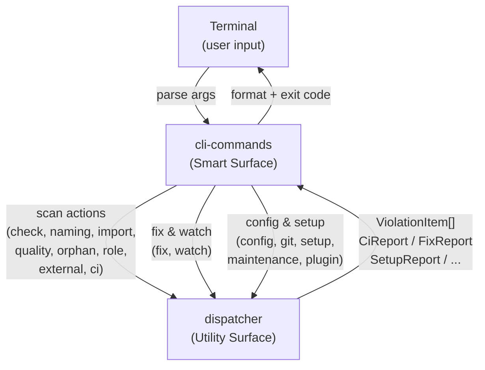

# FRD — cli-commands (v0.2.0)

## Reference
- Backlog: [BACKLOG.md](BACKLOG.md) — real condition for this feature; this file is specification only.
- PRD: [PRD.md](../../PRD.md)
- Architecture: [ARCHITECTURE.md](../../ARCHITECTURE.md)
- MCP Server FRD: `crates/mcp-server/FRD.md`
- Report Formatter FRD: `crates/report-formatter/FRD.md`

## System Overview
The cli-commands crate is a **Smart Surface** — a thin CLI wrapper that
parses command-line args, delegates **all business logic** to the
`dispatcher` crate via `dispatcher::surface_*_action::*` functions, and
formats the output for terminal display. CLI never calls rule aggregates
directly; dispatcher owns every scan, fix, config, and setup action.
### Architecture & Data Flow

```mermaid
flowchart TD
    A["Terminal\n(user input)"] -->|"parse args"| B["cli-commands\n(Smart Surface)"]

    B -->|"scan actions\n(check, naming, import,\nquality, orphan, role,\nexternal, ci)"| D["dispatcher\n(Utility Surface)"]
    B -->|"fix & watch\n(fix, watch)"| D
    B -->|"config & setup\n(config, git, setup,\nmaintenance, plugin)"| D

    D -->|"ViolationItem[]\nCiReport / FixReport\nSetupReport / ..."| B
    B -->|"format + exit code"| A
```
### Exit Code Contract
| Code  | Meaning                                                             |
| ------- | --------------------------------------------------------------------- |
| **0** | Ok / clean / diagnostic completed                                   |
| **1** | Policy fail (violations, CI fail, vulns found, remaining after fix) |
| **2** | Runtime error (bad path, pipeline crash, invalid state)             |
| **3** | Prerequisite missing (required external tool not installed)         |

**Doctor policy (locked):** exit **0** when the diagnostic finishes (missing
tools are listed in the body); exit **2** only if the doctor command itself
fails.

## Functional Requirements
### FR-CLICOMMANDS-001: Check/Scan Command (Mutual Aliases)
- **Description**: Run full architecture compliance analysis on the target
  project or workspace. `check` and `scan` are 1:1 equivalent command aliases.
- **Input**: `path`, `format`, `filter`, `member`.
- **Output**: `ExitCode` (0 = pass, 1 = violations found, 2 = error).
- **Business Rules**:

  - `check` and `scan` are 1:1 equivalent aliases that invoke the exact same
    analysis pipeline.
  - Delegates to `dispatcher::surface_check_action::collect_scan`.
  - Runs the complete 6-group analysis pipeline sequentially: quality (AES301–305), role
    (AES401–406), import (AES201–205), naming (AES101–102), orphan
    (AES501–506), external (Clippy, Ruff, ESLint, etc.).
  - Results filtered to the target path using canonical path comparison.
  - Auto-discovers workspace members via the config orchestrator aggregate.
  - Each workspace member gets isolated analysis with filtered results.
  - `--member <name>` targets a specific workspace member by directory name.
  - In multi-workspace text mode, prints per-member violation summaries with
    code breakdowns.
  - Falls back to single-scan mode if no workspaces discovered.
  - Files that fail to parse are skipped by the per-group analyzers; the CLI
    does not emit a separate parse-warning diagnostic.
- **Edge Cases**:

  - Path doesn't exist → error message + exit code 2.
  - No violations found → exit code 0.
  - Pipeline runtime creation fails → exit code 2.
  - `--member` with non-existent name → error message listing available members.
  - No workspace members discovered → falls back to single-scan.
  - Pipeline fails for a specific workspace → warning logged, continues with others.
  - Empty results across all workspaces → exit code 0.
- **Error Handling**: Pipeline failures printed to stderr, exit code 2 returned.

### FR-CLICOMMANDS-002: CI Command
- **Description**: CI-optimized analysis with configurable threshold and
  auto-fail on CRITICAL violations.
- **Input**: `path`, `threshold`.
- **Output**: `ExitCode` (0 = pass, 1 = fail).
- **Business Rules**:

  - Delegates to `dispatcher::surface_ci_action::collect_ci`.
  - Computes architecture compliance score via the score calculation function.
  - Auto-fails on any CRITICAL violation regardless of score.
  - Compares score against threshold as float comparison (not truncated integer).
  - Prints severity breakdown: CRITICAL / HIGH / MEDIUM / LOW counts.
- **Edge Cases**:

  - Score exactly at threshold → passes.
  - CRITICAL violation present but score above threshold → still fails.
  - No violations → score 100, passes.
- **Error Handling**: None — pure computation on existing results.

### FR-CLICOMMANDS-003: Fix Command
- **Description**: Apply automatic safe fixes to files that violate rules.
- **Input**: `path`, `dry_run`.
- **Output**: `ExitCode` (0 = all fixed, 1 = remaining violations).
- **Business Rules**:

  - Delegates to `dispatcher::surface_fix_action::collect_fix`.
  - Runs lint → apply auto-fixes → re-lint to measure improvement.
  - Supports `--dry-run` for preview mode (no changes applied).
  - Only auto-fixes safe, non-destructive rule violations (naming rules,
    unused imports, bypass comments).
  - Factory pattern allows the DI container to control fix vs dry-run.
  - Reports fixed count = before − after.
- **Edge Cases**:

  - Dry-run mode → skips second scan, prints preview.
  - No violations before fix → reports 0 fixed.
  - All violations fixed → prints "all violations resolved".
- **Error Handling**: Exit code 1 if any violations remain after fix.

### FR-CLICOMMANDS-004: Doctor Command
- **Description**: Toolchain diagnostics — check availability and version of
  required tools.
- **Input**: Maintenance aggregate.
- **Output**: `ExitCode` — **0** when diagnostic completes; **2** if the
  doctor command fails internally.
- **Business Rules**:

  - Delegates to `dispatcher::surface_maintenance_action::collect_doctor`.
  - Checks Rust toolchain (rustc, cargo, clippy, rustfmt).
  - Checks Python toolchain (python3, ruff, mypy, bandit).
  - Checks JavaScript toolchain (node, npm, eslint, prettier, typescript).
  - Checks VCS tools (git).
  - Displays version and status (OK / MISSING) for each tool.
  - Missing tools are **reported in the body**, not as exit code 3.
- **Edge Cases**:

  - All tools installed → all show OK status, exit 0.
  - Some tools missing → shows MISSING status, still exit 0.
- **Error Handling**: Internal failure of doctor → exit 2.

### FR-CLICOMMANDS-005: Security Command
- **Description**: Vulnerability scanning via cargo-audit (Rust) or bandit
  (Python).
- **Input**: Maintenance aggregate, optional path.
- **Output**: `ExitCode` (0 = clean, 1 = vulnerabilities found, 3 = tool missing).
- **Business Rules**:

  - Delegates to `dispatcher::surface_maintenance_action::collect_security`.
  - Auto-detects language from project structure.
  - Runs appropriate scanner (cargo-audit for Rust, bandit for Python).
  - Displays findings with severity, test ID, file, line, and issue description.
  - Exit code 3 when scanning tool is not installed.
- **Edge Cases**:

  - Tool not installed → exit code 3, error message.
  - No vulnerabilities → exit code 0.
  - Vulnerabilities found → exit code 1 with findings listed.
- **Error Handling**: Tool not found → exit code 3; scan failures → exit code 2.

### FR-CLICOMMANDS-006: Dependencies Command
- **Description**: Dependency report from Cargo.lock / pyproject.toml /
  package.json.
- **Input**: Maintenance aggregate, optional path.
- **Output**: `ExitCode` (0 = success, 2 = error).
- **Business Rules**:

  - Delegates to `dispatcher::surface_maintenance_action::collect_dependencies`.
  - Lists all dependencies with name, version, and type.
  - Auto-detects language from project structure.
  - Displays up to 30 dependencies, then "... and N more".
  - Tabular output format with aligned columns.
- **Edge Cases**:

  - More than 30 dependencies → truncated with count.
  - No dependency file found → error message.
- **Error Handling**: Error from dependency report → error message + exit code 2.

### FR-CLICOMMANDS-007: Init Command
- **Description**: Create default lint-arwaky configuration files and
  distribute documentation.
- **Input**: Setup aggregate, filesystem.
- **Output**: `ExitCode` (0 = success, 1 = partial failure).
- **Business Rules**:

  - Delegates to `dispatcher::surface_setup_action::collect_init`.
  - Detects languages present in the project.
  - Creates `lint_arwaky.config.<lang>.yaml` for each detected language.
  - Distributes docs from XDG config: `ARCHITECTURE.md`, `RULES_AES.md`.
  - Copies `.agents/` (prompts, rules, skills) from XDG config into project.
  - Overwrites existing files.
- **Edge Cases**:

  - Doc file not in XDG config → prints "not in XDG config", skips.
  - Write failure → error message, overall status set to partial failure.
- **Error Handling**: Per-file errors logged; overall exit code 1 if any failure.

### FR-CLICOMMANDS-008: Install Command
- **Description**: Install adapter dependencies for detected languages.
- **Input**: Setup aggregate, `sudo` flag.
- **Output**: `ExitCode` (0 = success, 1 = partial failure).
- **Business Rules**:

  - Delegates to `dispatcher::surface_setup_action::collect_install`.
  - Installs Python adapters: ruff, mypy, bandit.
  - Installs JavaScript adapters: eslint, prettier, typescript.
  - Supports `--sudo` flag for npm global installs requiring elevated
    permissions.
  - Prints step progress: [1/2] Python, [2/2] JavaScript.
- **Edge Cases**:

  - Python install fails but JS succeeds → exit code 1.
  - Both succeed → exit code 0.
- **Error Handling**: Per-language install status reported; overall exit code 1
  if any failure.

### FR-CLICOMMANDS-009: MCP Config Command
- **Description**: Print MCP server configuration JSON for a specified client.
- **Input**: `client` name (claude, cursor, windsurf, copilot, hermes,
  vscode, all).
- **Output**: `ExitCode` (always 0).
- **Business Rules**:

  - Delegates to `dispatcher::surface_setup_action::collect_mcp_config`.
  - Generates client-specific JSON configuration for MCP server integration.
  - Binary resolution priority:
    1. `LINT_ARWAKY_MCP_BIN` environment variable (must point to existing file).
    2. Sibling of current executable (`lint-arwaky-mcp` next to `lint-arwaky-cli`).
    3. Bare name `lint-arwaky-mcp` (relies on OS PATH resolution at runtime).
  - Supports clients: claude-code, cursor, windsurf, copilot, hermes, vscode, all.
- **Edge Cases**:

  - `LINT_ARWAKY_MCP_BIN` points to non-file → error, falls through to priority 2.
  - Sibling binary not found → falls through to priority 3 (bare name).
  - Unknown client → uses default mcpServers format.
- **Error Handling**: Canonicalization failure → error message with fallback to
  bare name.

### FR-CLICOMMANDS-010: Config Show Command
- **Description**: Display active configuration files and their contents with
  secret redaction.
- **Input**: Config orchestrator aggregate.
- **Output**: `ExitCode` (always 0).
- **Business Rules**:

  - Delegates to `dispatcher::surface_config_action::collect_config_show`.
  - Lists all config files found at project root.
  - Displays raw config content for each file.
  - Redacts sensitive values: AWS access keys (AKIA pattern), long base64
    strings (40+ chars).
  - Multiple configs shown with language header.
- **Edge Cases**:

  - No config files found → prints "Run `lint-arwaky init` to create one."
  - Config read fails → warning logged, continues.
- **Error Handling**: Config read errors logged as warnings.

### FR-CLICOMMANDS-011: Adapters Command
- **Description**: List enabled external lint adapters discovered by the
  external-lint layer.
- **Input**: External lint aggregate.
- **Output**: `ExitCode` (always 0).
- **Business Rules**:

  - Delegates to `dispatcher::surface_plugin_action::collect_adapters`.
  - Queries adapter names from the external lint aggregate.
  - Lists each adapter on a separate line with bullet prefix.
  - Shows "(none enabled)" when no adapters found.
- **Edge Cases**:

  - No adapters → shows "(none enabled)".
- **Error Handling**: None.

### FR-CLICOMMANDS-012: Git Diff Command
- **Description**: Run AES analysis only on files changed since a specified
  git base.
- **Input**: Code analysis aggregate, `base` branch, optional project path and filter.
- **Output**: `ExitCode` (0 = clean, 1 = violations).
- **Business Rules**:

  - Delegates to `dispatcher::surface_git_action::collect_git_diff`.
  - Gets changed files from git diff since specified base branch.
  - Filters to lintable files only.
  - Applies optional filter to changed files.
  - Runs per-file AES analysis with violation details (file:line, severity,
    message).
  - Shows up to 3 violations per file in summary.
- **Edge Cases**:

  - No changed files → 0 violations, exit 0.
  - File not lintable → skipped.
- **Error Handling**: None — analysis runs per-file independently.

### FR-CLICOMMANDS-013: Watch Command
- **Description**: Monitor file changes and trigger re-scans on modified files.
- **Input**: Watch aggregate, optional project path.
- **Output**: `ExitCode` (0 = clean shutdown; 2 = error setting up handler).
- **Business Rules**:

  - Delegates to `dispatcher::surface_watch_action::handle_watch`.
  - Creates a watch configuration from the given path.
  - Sets up Ctrl+C signal handler for graceful shutdown via atomic running flag.
  - Passes an `on_stop` callback to the watch aggregate.
- **Edge Cases**:

  - Ctrl+C handler setup fails → error message + exit code 2.
  - User presses Ctrl+C → prints "Stopping watcher...", graceful shutdown,
    exit 0.
- **Error Handling**: Signal handler registration failure → exit code 2.

### FR-CLICOMMANDS-014: Individual Linter Commands
- **Description**: Run a single linter independently for targeted analysis.
  Commands: `quality`, `import`, `naming`, `role`, `orphan`, `external`.
- **Input**: Optional path, format; orphan may take member filter.
- **Output**: `ExitCode` (0 = pass, 1 = violations found, 2 = error).
- **Business Rules**:

  - `quality` — Delegates to `dispatcher::surface_quality_action::collect_quality` (AES301–305).
  - `import` — Delegates to `dispatcher::surface_import_action::collect_import` (AES201–205).
  - `naming` — Delegates to `dispatcher::surface_naming_action::collect_naming` (AES101–102).
  - `role` — Delegates to `dispatcher::surface_role_action::collect_role_direct` (AES401–406).
  - `orphan` — Delegates to `dispatcher::surface_orphan_action::collect_orphan` (AES501–506).
  - `external` — Delegates to `dispatcher::surface_external_action::collect_external_direct` (Clippy, Ruff, ESLint, etc.).
  - Each command supports `--format` (text, json, sarif, junit).
  - Files that fail to parse are skipped by the analyzers; no separate
    parse-warning diagnostic is displayed.
- **Edge Cases**:

  - Path doesn't exist → error message + exit code 2.
  - No violations found → exit code 0.
- **Error Handling**: Pipeline failures printed to stderr, exit code 2 returned.

## API Contract
### Protocol API
| Method | Input | Output | Error | Event | Description |
| --- | --- | --- | --- | --- | --- |
| `handle_command` | Parsed CLI arguments | `ExitCode` | Runtime error surfaces as exit code 2 | — | Single composite entry point for the CLI surface: resolves the subcommand, injects its aggregates, and dispatches to the matching handler. |

### Aggregate API
| Method | Input | Output | Error | Event | Description |
| --- | --- | --- | --- | --- | --- |
| `handle_check` | `ScanCommandParams` | `ExitCode` | Pipeline failure → exit 2 | — | Run the full architecture compliance analysis on a project. |
| `handle_scan` | `ScanCommandParams` | `ExitCode` | Pipeline failure → exit 2 | — | Run multi-workspace analysis; a 1:1 alias of the check command. |
| `handle_quality` | `ScanCommandParams` | `ExitCode` | Non-existent path → exit 2 | — | Run code-quality analysis only (AES301–305). |
| `handle_import` | `ImportCommandParams` | `ExitCode` | Non-existent path → exit 2 | — | Run import-rule checks only (AES201–205). |
| `handle_naming` | `NamingCommandParams` | `ExitCode` | Non-existent path → exit 2 | — | Run naming-rule checks only (AES101–102). |
| `handle_role` | `RoleCommandParams` | `ExitCode` | Non-existent path → exit 2 | — | Run role-rule checks only (AES401–406). |
| `handle_orphan` | `OrphanCommandParams` | `ExitCode` | Non-existent path → exit 2 | — | Run orphan detection only (AES501–506). |
| `handle_external` | `ExternalCommandParams` | `ExitCode` | Non-existent path → exit 2 | — | Run external linter checks only. |
| `handle_ci` | `CiCommandParams` | `ExitCode` | None | — | Compare the compliance score against a threshold and auto-fail on CRITICAL violations. |
| `handle_fix` | Fix params, path, dry-run flag | `ExitCode` | Remaining violations → exit 1 | — | Apply automatic safe fixes and report the fixed count. |
| `handle_doctor` | `IMaintenanceAggregate` | `ExitCode` | Internal doctor failure → exit 2 | — | Report toolchain diagnostics; exit 0 whenever the diagnostic completes. |
| `handle_security` | `IMaintenanceAggregate`, optional path | `ExitCode` | Scan tool missing → exit 3; scan failure → exit 2 | — | Run a vulnerability scan for the auto-detected project language. |
| `handle_dependencies` | `IMaintenanceAggregate`, optional path | `ExitCode` | Report failure → exit 2 | — | Print a truncated dependency report. |
| `handle_self_update` | `IMaintenanceAggregate`, `check_only` flag | `ExitCode` | Self-update failure → exit 2 | — | Query GitHub for the latest release and report upgrade status. |
| `handle_init` | `ISetupAggregate`, filesystem | `ExitCode` | Any per-file write failure → exit 1 | — | Create default configuration files and distribute documentation. |
| `handle_install` | `ISetupAggregate`, `sudo` flag | `ExitCode` | Any per-language install failure → exit 1 | — | Install adapter dependencies for the detected languages. |
| `handle_mcp_config` | Client name | `ExitCode` | Canonicalization failure → fallback to bare name | — | Print the MCP server configuration JSON for the named client. |
| `handle_config_show` | `IConfigOrchestratorAggregate` | `ExitCode` | Read errors logged as warnings | — | Display the active configuration files with secrets redacted. |
| `handle_adapters` | `IExternalLintAggregate` | `ExitCode` | None | — | List the enabled external lint adapters. |
| `handle_git_diff` | `ICodeAnalysisAggregate`, base branch, path, filter | `ExitCode` | None | — | Analyze only the files changed since the given git base. |
| `handle_watch` | `IWatchAggregate`, optional path | `ExitCode` | Signal handler setup failure → exit 2 | — | Watch the project and re-scan on every file change. |

## Integration Points
| System | Direction | Purpose | Failure mode |
| --- | --- | --- | --- |
| `dispatcher` | in | All business logic delegated via the `surface_*_action` modules | Dispatcher returns an error → mapped to exit code 2 |
| `report-formatter` | in | Aggregate producing text, JSON, SARIF, and JUnit reports | Formatting failure → raw findings printed to stderr |
| `shared` | in | Taxonomy VOs (`ViolationItem`, `Format`), contract traits, and utility functions | Compile-time dependency; unavailable at build time |
| `ctrlc` signal handling | in | Graceful shutdown for the watch command via an atomic running flag | Handler registration failure → error message and exit code 2 |
| MCP binary resolution | out | Resolves the server binary through env var → sibling → bare name priority (no explicit PATH search) | Binary not found → bare name written into the generated config |
| Config show redaction | out | Redacts AWS access keys and long base64 secrets before display | A secret pattern that does not match is displayed verbatim |

## Non-functional Requirements
| Metric | Target | Measurement method |
| --- | --- | --- |
| Cross-platform path handling | File walker uses canonical paths (not inodes); works on all platforms including Windows | Run a scan on Windows and compare results against Linux |
| Linter group execution | Groups run sequentially as subprocesses; no thread pool | Trace a scan and assert no concurrent analyzer execution |
| Lightweight command latency | Container construction is deferred for lightweight commands (version, adapters) | Time the `adapters` and `version` commands from process start |
| Concurrency model | Linter groups run sequentially; no async runtime dependency | Confirm the crate declares no async runtime dependency |
| Secret redaction | AWS keys and base64 secrets are redacted before config content is printed | Feed a config containing both secret shapes and assert both are masked |
| Surface compliance (AES406) | Zero business logic in handlers; only dispatch and terminal formatting | Review each handler for conditional logic beyond formatting |
| Report formatting delegation | All report formatting is delegated to the report formatter aggregate | Assert no report formatting occurs inside the surface layer |

## Test Scenarios
- Running `check` and `scan` executes the full pipeline and returns the correct exit code of 0, 1, or 2.
- A non-existent path returns exit code 2.
- Workspace member discovery with `--member` targets the correct member.
- A project with no workspace members falls back to a single scan.
- A pipeline failure for one workspace logs a warning and the other workspaces continue.
- A score at or above threshold with no CRITICAL violation exits 0.
- A score at or above threshold with a CRITICAL violation present exits 1 by auto-fail.
- A score below threshold exits 1.
- A score exactly at the threshold exits 0.
- `fix` applies the remove, replace, and rename operations and reports the fixed count.
- `fix --dry-run` previews changes without applying them.
- A project with no violations before the fix reports 0 fixed.
- A project where all violations are fixed prints "all violations resolved".
- A project where violations remain after the fix exits 1.
- A machine with all tools installed reports all OK and exits 0.
- A machine with some tools missing lists them as MISSING and still exits 0.
- An internal doctor failure exits 2.
- A security scan with the tool not installed exits 3.
- A security scan with no vulnerabilities exits 0.
- A security scan that finds vulnerabilities exits 1 with the findings listed.
- A normal project dependency report lists up to 30 dependencies.
- A project with more than 30 dependencies truncates the list with "... and N more".
- A project with no dependency file reports an error and exits 2.
- `init` creates config files for every detected language.
- `install` with a partial failure exits 1.
- `mcp-config` emits valid JSON in the correct shape for each client.
- `config-show` redacts AWS keys and base64 secrets.
- `config-show` with no config found prints the "Run lint-arwaky init" message.
- `adapters` prints a bullet list of enabled adapters or "(none enabled)".
- `git-diff` analyzes only the changed files and scans the correct subset.
- `watch` monitors the project and triggers a re-scan on file change.
- A `watch` signal handler setup failure exits 2.
- The individual linters (quality, import, naming, role, orphan, external) each scan the correct subset of rules.

## Assumptions & Constraints
- All surface handlers follow AES406: zero business logic, only dispatch.
- Report formatting never happens in surface layer — always delegated to the
  report formatter aggregate.
- Exit codes follow the workspace contract: 0 ok, 1 policy fail, 2 runtime
  error, 3 prerequisite missing.
- Workspace structure follows `crates/`, `packages/`, `modules/` convention.
- MCP binary resolution uses env var → sibling → bare name priority (no
  explicit PATH search).
- Config-show always redacts secrets before display.
- MCP execute surface must preserve full parity with these commands
  (see mcp-server FRD).
- Linter groups run sequentially as subprocesses. No async runtime dependency.
- Files that fail to parse are skipped by the per-group analyzers; no separate
  parse-warning diagnostic is emitted.

## Glossary
- **AES**: Agentic Engineering System — the 7-layer coding convention.
- **Pipeline**: The 6-group analysis sequence: code analysis, naming, import, external, role, orphan.
- **Surface**: Thin CLI handler layer — parses args, delegates to agents, formats output.
- **Aggregate**: Agent-layer orchestrator implementing a contract trait.
- **DI Container**: Composition root that wires capabilities to contract protocols.
- **LintResult**: Individual violation finding with file, line, code, severity, message.
- **ScanReport**: Aggregated results plus diagnostics from a full pipeline run.
- **Parse skip**: Files that fail to parse are skipped by the per-group analyzers; no separate warning diagnostic is emitted.
