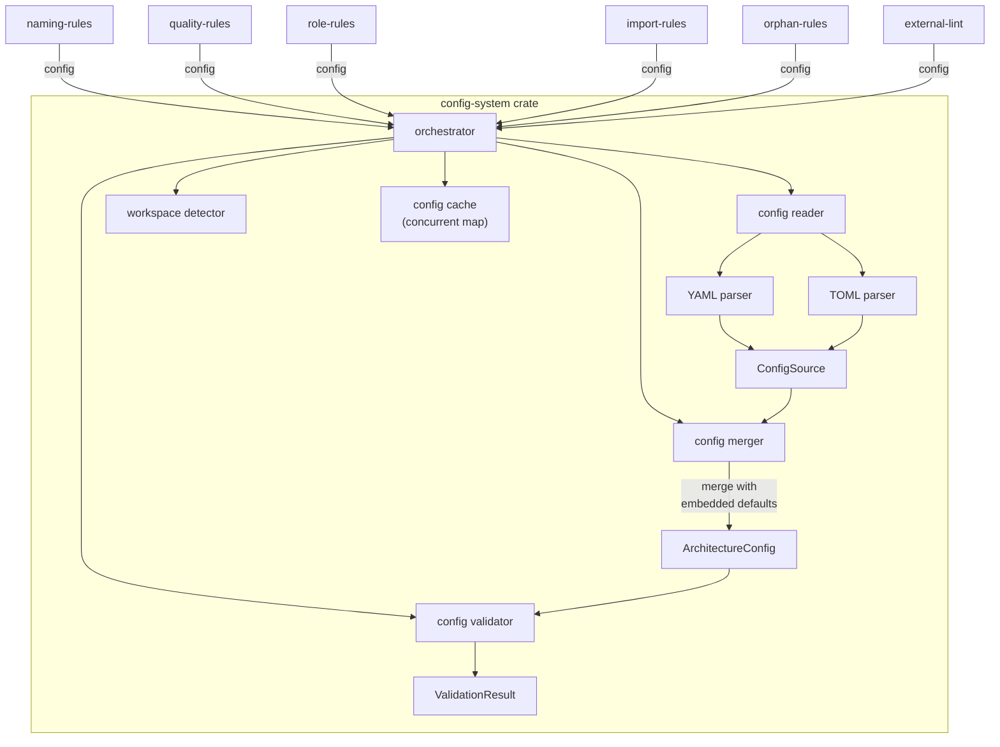

# FRD — config-system (v1.11.0)

---

## System Overview

The config-system crate manages lint-arwaky configuration: loading, parsing, validation, and workspace detection. It reads config files from multiple priority sources, merges them with embedded defaults, and provides a unified configuration facade for all other lint crates via the config orchestrator aggregate.

The config-system crate is an **infrastructure crate** — it manages configuration loading, parsing, validation, and workspace detection. At compile time, it depends only on `shared` and `filesystem` (for config file I/O via `IFileSystemIOProtocol`). Other crates receive config at runtime via DI (aggregate trait injection through `shared` re-exports).

### Architecture & Data Flow



### Config Loading Priority Chain

```
Priority 1: Project root
  lint_arwaky.config.yaml at project root
      │ (not found)
      ▼
Priority 2: Parent directories (up to depth 3)
  Walk up 3 levels looking for config file
      │ (not found)
      ▼
Priority 3: XDG user config
  ~/.config/lint-arwaky/lint_arwaky.config.yaml
      │ (not found)
      ▼
Priority 4: XDG system dirs
  /etc/xdg/lint-arwaky/ (max 8 dirs, absolute paths only)
      │ (not found)
      ▼
Priority 5: Embedded defaults
  Compiled into binary, always available

First match wins — no merge across priority levels.
Loaded config is merged with embedded defaults (FR-005).
```

---

## Functional Requirements

### FR-001: Config File Discovery and Loading

- **Description**: Locate and load the first matching YAML config file for a given project root and language, following a 5-level priority chain.
- **Input**: Project root path, language type.
- **Output**: The loaded config source with raw content, path, and language, or none if no config found.
- **Business Rules**:

  - Priority order: (1) project-root YAML, (2) parent directory YAML (up to depth 3), (3) XDG user config `~/.config/lint-arwaky/`, (4) XDG system dirs `/etc/xdg/lint-arwaky/` (limited to 8 dirs, absolute paths only), (5) embedded defaults.
  - First match wins — deeper/more specific configs take priority over shallower ones.
  - No config file size limit — config files of any size are accepted.
  - Symlinks pointing outside the project root are rejected via canonical path resolution.
- **Edge Cases**:

  - No config file exists at any level → returns `None`, caller falls back to embedded defaults.
  - YAML parse failure → logs warning to stderr, continues searching next priority level.
  - Non-NotFound I/O error (e.g., permission denied) → logs warning, continues searching.
  - Rules with empty conditions are preserved (not dropped).
- **Error Handling**:

  - Permission denied error when symlink points outside project root.
  - IO error on invalid path canonicalization.
  - ConfigError propagated from YAML parse or file read failures.

---

### FR-002: Language-Aware Config File Resolution

- **Description**: Map a language type to the correct set of config filenames to search for.
- **Input**: Language type (Rust, Python, TypeScript).
- **Output**: Config filenames to search in priority order.
- **Business Rules**:

  - All languages → `lint_arwaky.config.yaml` (unified config for Rust, Python, TypeScript).
  - `ConfigLanguage` is a typed enum, not a string — prevents path injection.
- **Edge Cases**:

  - Unknown language → no config files returned, embedded defaults used.
- **Error Handling**: None — pure mapping function.

---

### FR-003: Workspace Type Detection

- **Description**: Detect the language/type of a project by scanning for marker files (Cargo.toml, pyproject.toml, package.json, etc.) and parent directory conventions.
- **Input**: Target path.
- **Output**: Workspace type (Rust, Python, TypeScript, Unknown).
- **Business Rules**:

  - Single-pass directory scan for marker files (single syscall instead of up to 10).
  - Marker files:
    - Rust: `Cargo.toml`
    - Python: `pyproject.toml`, `setup.py`, `requirements.txt`
    - TypeScript: `package.json`, `tsconfig.json`
  - Parent directory name matching: `crates/` → Rust, `packages/` → TypeScript, `modules/` → Python.
  - Walks up to 2 parent directories if no marker found at target path.
  - Multiple marker files present → first match in scan order wins.
- **Edge Cases**:

  - No marker files found at any level → returns Unknown.
  - Multiple marker files (e.g., both Cargo.toml and package.json) → first match in scan order wins.
- **Error Handling**: Directory read failures are silently ignored, fallback to Unknown.

---

### FR-004: Multi-Workspace Member Discovery

- **Description**: Discover all workspace member directories under `crates/`, `packages/`, and `modules/` subdirectories.
- **Input**: Root path.
- **Output**: Workspace member paths.
- **Business Rules**:

  - Scans for subdirectories under `crates/`, `packages/`, `modules/`.
  - Uses sequential filesystem operations (no async runtime, no thread pool).
  - If root is itself a workspace directory (e.g., `crates/`), returns its direct subdirectories.
  - If root's parent is a workspace directory, returns root as a single-member workspace.
- **Edge Cases**:

  - No workspace directories found → returns empty vec, prints warning to stderr.
  - Symlink targets outside workspace root → pruned during file collection.
  - I/O error reading a workspace directory → warning logged, skipped.
- **Error Handling**: Warnings for directory read failures, graceful degradation.

---

### FR-005: Config Merging and Default Injection

- **Description**: Merge loaded config with embedded defaults using field-level merge rules.
- **Input**: Parsed architecture config, language type.
- **Output**: Merged config + source info + warnings.
- **Business Rules**:

  - **Layers** — concatenated; later definitions override earlier ones for the same layer name.
  - **Rules** — concatenated; rules are deduplicated by name field.
  - **Naming** — merged recursively; non-empty values override defaults.
  - **Ignored paths** — concatenated and deduplicated.
  - Empty arrays/objects in a child config do NOT override parent values.
  - When config has no layers, injects defaults for layers only and adds warning.
  - When no config file found, returns embedded defaults with warning.
- **Edge Cases**:

  - Config with empty `layers` array → defaults injected, warning emitted.
  - Duplicate rule names across configs → first occurrence wins.
  - Config error during load → falls back to embedded defaults with error warning.
- **Error Handling**: ConfigError logged as warning string, defaults used as fallback.

---

### FR-006: Config Validation

- **Description**: Validate loaded project config thresholds and adapter settings against schema constraints.
- **Input**: Project config, adapter name.
- **Output**: Validation result (ok or fail with error messages), boolean (adapter enabled status).
- **Business Rules**:

  - Score threshold must be between 0.0 and 100.0 (inclusive).
  - Complexity threshold must be positive (> 0).
  - `max_file_lines` threshold must be positive (> 0).
  - Adapter enabled check: defaults to `true` if adapter not found in config.
- **Edge Cases**:

  - Score threshold at exactly 0 or 100 → valid.
  - Score threshold at 0.1 → valid.
  - Unknown adapter name → returns true (enabled by default).
- **Error Handling**: Multiple validation errors joined with `|` separator.

---

### FR-007: Config Caching

- **Description**: Cache parsed config by file path to avoid repeated YAML parsing.
- **Input**: Cache key (file path string), config source.
- **Output**: Cached or freshly parsed configuration.
- **Business Rules**:

  - Cache is a `DashMap<String, ArchitectureConfig>` with pre-allocated capacity of 32.
  - Parses only on cache miss.
  - Thread-safe via DashMap (no Mutex, no poisoned lock).
  - Concurrent requests for the same key: DashMap handles contention internally.
- **Edge Cases**:

  - Same file path requested concurrently → DashMap ensures single parse.
  - Cache capacity exceeded → DashMap grows dynamically (no eviction).
- **Error Handling**: DashMap operations are infallible (no lock poisoning).

---

### FR-008: Ignored Paths Assembly

- **Description**: Build the complete list of ignored paths from config + hardcoded universal defaults.
- **Input**: Architecture config.
- **Output**: Ignored path patterns.
- **Business Rules**:

  - Default ignored paths (hardcoded, universal):
    - `.git`
    - `node_modules`
    - `target`
    - `dist`
    - `build`
    - `coverage`
    - `.venv`
    - `__pycache__`
  - Config-specified ignored paths appended with deduplication.
  - Path separators normalized to platform-specific separator.
  - Pre-allocated capacity: 8 defaults + config count.
  - No project-specific paths hardcoded — project-specific ignores must come from YAML config.
- **Edge Cases**:

  - Config specifies a path already in defaults → deduplicated, not added twice.
  - Config specifies empty string path → filtered out.
- **Error Handling**: None — pure function.

---

### FR-009: TOML Config Parsing

- **Description**: Parse TOML config files (e.g., Cargo.toml `[tool.lint-arwaky]` section) into project config.
- **Input**: File path.
- **Output**: Project config if found, or error.
- **Business Rules**:

  - Reads the `[tool.lint-arwaky]` or `[tool.lint_arwaky]` section from TOML.
  - Converts TOML value to JSON intermediate representation, then deserializes to `ProjectConfig`.
  - Returns `None` if no `[tool]` section exists (not an error).
- **Edge Cases**:

  - TOML file exists but has no `[tool]` section → returns `None`.
  - TOML file is not valid TOML → returns `ConfigError`.
- **Error Handling**: `ConfigError` with specific keys (tool section, TOML conversion, TOML parsing).

---

### FR-010: Config File Listing

- **Description**: List all config files found at the project root for all supported languages.
- **Input**: Project root path.
- **Output**: List of config file paths per language, or error.
- **Business Rules**:

  - Iterates all three languages (Rust, Python, TypeScript).
  - For each language, checks all config filenames at project root.
  - Deduplicates by path (same file not listed twice).
  - Breaks after first config found per language.
- **Edge Cases**:

  - Multiple languages have config files → all returned.
  - No config files for any language → returns empty list.
  - I/O error reading a config file → warning logged, continues.
- **Error Handling**: ConfigError propagated for file path creation failures.

---

## API Contract


| Operation                         | Input                       | Output                                                 | Purpose                                              |
| ---------------------------------- | ----------------------------- | -------------------------------------------------------- | ------------------------------------------------------ |
| Load project config               | Project root path             | Merged config with source info and warnings              | Auto-detect language and load config                  |
| Load config for language          | Project root path, language   | Merged config with source info and warnings              | Load config for specific language                     |
| Discover workspaces               | Root path                     | Workspace info list                                      | Discover and load configs for all workspace members   |
| Load config sync                  | Project root path             | Architecture configuration                               | Synchronous config load                               |
| Ignored paths                     | Project root path             | Ignored path list                                        | Get merged ignored paths list                         |
| Read config                       | Project root path, language   | Raw config source or error                               | Read raw config from filesystem                       |
| List config files                 | Project root path             | Config file paths per language or error                  | List all config files at project root                 |
| Detect workspace type             | Path                          | Workspace type                                           | Detect workspace type from marker files               |
| Is workspace                      | Path                          | Boolean                                                  | Check if path is a workspace root                     |
| Discover workspace members        | Root path                     | Workspace member paths                                   | Find workspace member directories                     |
| Is adapter enabled                | Config, adapter name          | Boolean                                                  | Check if adapter is enabled in config                 |
| Validate thresholds               | Config                        | Validation result                                        | Validate config thresholds                            |
| Parse YAML config                 | File path                     | Configuration or error                                   | Parse YAML config file                                |
| Parse TOML config                 | File path                     | Project config if found, or error                        | Parse TOML config section                             |

---

## Integration Points

- **Internal**:

  - `shared` crate — value objects, contract traits, and utility functions.
  - Config system root container — wires orchestrator, reader, validator, and parser via dependency injection.
- **External**:

  - XDG config directory resolution library.
  - YAML 1.2 deserialization library (`serde_yaml`).
  - TOML parsing library (`toml`) for `[tool.lint-arwaky]` sections.
  - `dashmap` — concurrent HashMap for config cache.
- **Consumers** (received via DI at runtime through `shared` re-exports, not direct compile-time dependency):
  - `naming-rules`, `quality-rules`, `role-rules`, `import-rules`, `orphan-rules`, `external-lint` — receive `IConfigOrchestratorAggregate` via DI.

---

## Non-functional Requirements

- **Performance**: Config read from project root < 50ms. Config read from XDG paths < 100ms. Workspace discovery for 10 members < 500ms (sequential).
- **Memory**: Memory overhead per parsed config < 10 KB (cached). DashMap pre-allocated with capacity 32.
- **Concurrency**: Workspace discovery runs sequentially. Config cache thread-safe via DashMap (no Mutex, no lock poisoning).
- **Security**: Symlink attack detection via O(1) canonical path check. `ConfigLanguage` enum prevents path injection. XDG_CONFIG_DIRS limited to 8 entries, absolute paths only.
- **Reliability**: DashMap operations are infallible (no lock poisoning). YAML parse failures produce warnings, not silent defaults.

---

## Test Scenarios / QA Checklist

### FR-001 — Config Discovery and Loading


| # | Scenario                                       | Expected                            | Rule   |
| --- | ------------------------------------------------ | ------------------------------------- | -------- |
| 1 | Config exists at project root                  | Loaded from project root            | FR-001 |
| 2 | Config not at root, exists at parent (depth 1) | Loaded from parent                  | FR-001 |
| 3 | Config not at root/parent, exists at XDG user  | Loaded from XDG user                | FR-001 |
| 4 | Config only at XDG system dir                  | Loaded from XDG system              | FR-001 |
| 5 | No config anywhere                             | Embedded defaults used              | FR-001 |
| 6 | Symlink pointing outside project root          | Rejected                            | FR-001 |
| 7 | YAML parse failure at priority 1               | Warning logged, priority 2 searched | FR-001 |
| 8 | Permission denied at priority 1                | Warning logged, priority 2 searched | FR-001 |

### FR-002 — Language Resolution


| # | Scenario                                 | Expected                       | Rule   |
| --- | ------------------------------------------ | -------------------------------- | -------- |
| 1 | Any language (Rust/Python/TypeScript)     | `lint_arwaky.config.yaml`     | FR-002 |
| 2 | Unknown language                         | Empty list, embedded defaults  | FR-002 |

### FR-003 — Workspace Detection


| # | Scenario                         | Expected         | Rule   |
| --- | ---------------------------------- | ------------------ | -------- |
| 1 | Directory with Cargo.toml        | Rust             | FR-003 |
| 2 | Directory with pyproject.toml    | Python           | FR-003 |
| 3 | Directory with package.json      | TypeScript       | FR-003 |
| 4 | Parent dir is`crates/`           | Rust             | FR-003 |
| 5 | Parent dir is`packages/`         | TypeScript       | FR-003 |
| 6 | Parent dir is`modules/`          | Python           | FR-003 |
| 7 | No markers anywhere              | Unknown          | FR-003 |
| 8 | Both Cargo.toml and package.json | First match wins | FR-003 |

### FR-004 — Workspace Members


| # | Scenario                         | Expected                               | Rule   |
| --- | ---------------------------------- | ---------------------------------------- | -------- |
| 1 | Root with crates/foo, crates/bar | [crates/foo, crates/bar]               | FR-004 |
| 2 | Root with no workspace dirs      | Empty vec + warning                    | FR-004 |
| 3 | Root is`crates/` itself          | Direct subdirectories returned         | FR-004 |
| 4 | I/O error on one member dir      | Warning logged, other members returned | FR-004 |

### FR-005 — Config Merging


| # | Scenario                       | Expected                            | Rule   |
| --- | -------------------------------- | ------------------------------------- | -------- |
| 1 | Config with empty layers array | Defaults injected + warning         | FR-005 |
| 2 | Duplicate rule names           | First occurrence wins               | FR-005 |
| 3 | Config error during load       | Defaults used + warning             | FR-005 |
| 4 | Empty ignored_paths in config  | Defaults preserved (not overridden) | FR-005 |

### FR-006 — Validation


| # | Scenario              | Expected               | Rule   |
| --- | ----------------------- | ------------------------ | -------- |
| 1 | Score threshold 50.0  | Valid                  | FR-006 |
| 2 | Score threshold 0.0   | Valid                  | FR-006 |
| 3 | Score threshold 100.0 | Valid                  | FR-006 |
| 4 | Score threshold -1.0  | Invalid                | FR-006 |
| 5 | Score threshold 101.0 | Invalid                | FR-006 |
| 6 | Unknown adapter name  | Enabled (default true) | FR-006 |

### FR-007 — Caching


| # | Scenario                         | Expected               | Rule   |
| --- | ---------------------------------- | ------------------------ | -------- |
| 1 | Same config file requested twice | Parsed once, cached    | FR-007 |
| 2 | Concurrent requests for same key | Single parse (DashMap) | FR-007 |

### FR-008 — Ignored Paths


| # | Scenario                             | Expected                      | Rule   |
| --- | -------------------------------------- | ------------------------------- | -------- |
| 1 | No config ignored paths              | 8 universal defaults returned | FR-008 |
| 2 | Config adds "tests"                  | Defaults + "tests"            | FR-008 |
| 3 | Config adds ".git" (already default) | Deduplicated, not added twice | FR-008 |
| 4 | Config adds empty string             | Filtered out                  | FR-008 |

### FR-009 — TOML Parsing


| # | Scenario                            | Expected             | Rule   |
| --- | ------------------------------------- | ---------------------- | -------- |
| 1 | Cargo.toml with`[tool.lint-arwaky]` | Parsed correctly     | FR-009 |
| 2 | Cargo.toml without`[tool]`          | Returns None         | FR-009 |
| 3 | Invalid TOML syntax                 | ConfigError returned | FR-009 |

---

## Assumptions & Constraints

- `ConfigLanguage` enum restricts input to exactly Rust, Python, TypeScript — no arbitrary strings allowed.
- Config file naming follows a unified convention: `lint_arwaky.config.yaml` for all languages.
- Workspace structure must follow `crates/`, `packages/`, `modules/` convention.
- Maximum 8 XDG_CONFIG_DIRS entries; only absolute paths accepted.
- No config file size limit.
- Workspace discovery runs sequentially.
- YAML parsing uses a YAML 1.2 parser (`serde_yaml`).
- TOML parsing reads only the `[tool]` section, not full TOML config.
- Config cache uses DashMap (no Mutex, no lock poisoning).
- Default ignored paths are universal only — no project-specific paths hardcoded.

---

## Glossary


| Term                   | Definition                                                                    |
| ------------------------ | ------------------------------------------------------------------------------- |
| **AES**                | Agentic Engineering System — the 7-layer coding convention                   |
| **ConfigLanguage**     | Typed enum restricting language input to Rust, Python, TypeScript             |
| **WorkspaceType**      | Enum identifying project language from marker files                           |
| **ArchitectureConfig** | Parsed configuration containing layers, rules, naming, and thresholds         |
| **ConfigSource**       | Metadata about a loaded config file (language, path, raw content)             |
| **ConfigResult**       | Merged config + source info + warnings from the loading process               |
| **XDG**                | XDG Base Directory Specification — standard for user/system config paths     |
| **DashMap**            | Concurrent HashMap used for thread-safe config caching without lock poisoning |
| **Embedded defaults**  | Configuration compiled into the binary, used when no config file is found     |

---

## Appendix A: Top-Level Config Schema

### File Naming Convention

```
lint_arwaky.config.yaml  — unified config for all languages (Rust, Python, TypeScript)
```

### Top-Level Structure

### Default Ignored Paths (Hardcoded, Universal)

These are always included regardless of config:

```
.git
node_modules
target
dist
build
coverage
.venv
__pycache__
```

Config-specified `ignored_paths` are **appended** to these defaults with deduplication.

---

## Reference

- PRD: [PRD.md](../../PRD.md)
- Architecture: [ARCHITECTURE.md](../../ARCHITECTURE.md)
