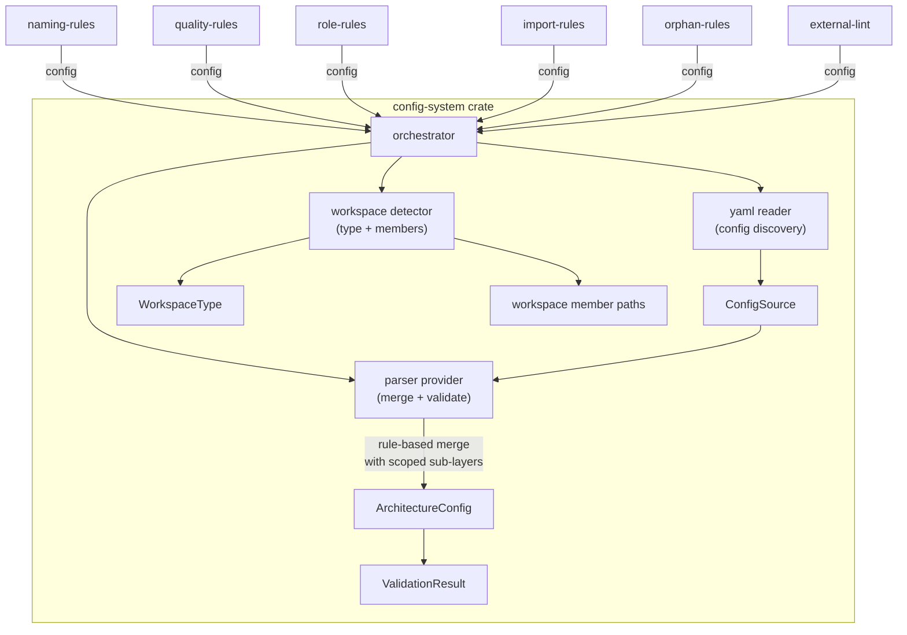

# FRD — config-system

---

## Reference

- Backlog: [BACKLOG.md](BACKLOG.md) — real condition for this feature; this file is specification only.
- PRD: [PRD.md](../../PRD.md)
- Architecture: [ARCHITECTURE.md](../../ARCHITECTURE.md)

## System Overview

The config-system crate manages lint-arwaky configuration as a business capability: discovering projects, loading and merging configuration, validating thresholds, and determining which paths the linter should ignore. It is an **infrastructure crate** — at compile time it depends only on `shared` and `filesystem` (for config file I/O via `IFileSystemIOProtocol`). Other crates receive config at runtime via DI (aggregate trait injection through `shared` re-exports).

- **Architecture & Data Flow**


```mermaid
flowchart TD
    subgraph CS ["config-system crate"]
        A["orchestrator"] --> B["yaml reader\n(config discovery)"]
        A --> C["workspace detector\n(type + members)"]
        A --> D["parser provider\n(merge + validate)"]

        B --> E["ConfigSource"]
        C --> F["WorkspaceType"]
        C --> G["workspace member paths"]
        E --> D
        D -->|"rule-based merge\nwith scoped sub-layers"| H["ArchitectureConfig"]
        H --> I["ValidationResult"]
    end

    J["naming-rules"] -->|"config"| A
    K["quality-rules"] -->|"config"| A
    L["role-rules"] -->|"config"| A
    M["import-rules"] -->|"config"| A
    N["orphan-rules"] -->|"config"| A
    O["external-lint"] -->|"config"| A
```

- **Config Loading Priority Chain**

```text
Priority 1: Project root
  lint_arwaky.config.yaml at project root
      │ (not found)
      ▼
Priority 2: Parent directories (project root plus up to 4 ancestor levels — 5 levels total)
  Walk up 5 levels (root, then 4 ancestors) looking for config file
      │ (not found)
      ▼
Priority 3: XDG user config
  ~/.config/lint-arwaky/lint_arwaky.config.yaml
      │ (not found)
      ▼
Priority 4: XDG system dirs
  /etc/xdg/lint-arwaky/ (max 8 dirs, absolute paths only)
      │ (not found)
      ▼
Priority 5: Embedded defaults
  Compiled into binary, always available

First match wins — no merge across priority levels.
Loaded config is merged with embedded defaults via rule-based layer merging (FR-ConfigSystem-004).
```

---

## Functional Requirements

### FR-ConfigSystem-001: Config Discovery

- **Description**: Locate and load the first matching YAML config file for a project root, following a 5-level priority chain, and list every config file visible at the root. Language naming, TOML section parsing, and config-file listing are steps of this same discovery concern.
- **Input**: Project root path; a `ConfigLanguage` for language-specific reads.
- **Output**: A `ConfigSource` (language, path, raw content), or `None` when no config exists at any priority level (caller falls back to embedded defaults). Listing returns `Vec<(ConfigLanguage, FilePath)>`.
- **Business Rules**:

  - Priority order: (1) project-root YAML, (2) parent directory YAML (project root plus up to 4 ancestor levels — 5 levels total), (3) XDG user config `~/.config/lint-arwaky/`, (4) XDG system dirs `/etc/xdg/lint-arwaky/` (limited to 8 dirs, absolute paths only), (5) embedded defaults.
  - First match wins — deeper/more-specific configs take priority over shallower ones.
  - No config file size limit — config files of any size are accepted.
  - Symlinks pointing outside the project root are rejected via canonical path resolution.
  - Language is derived from workspace marker files (`Cargo.toml` → Rust, `pyproject.toml` → Python, `package.json` → TypeScript) and selects the correct config filename.
  - TOML `[tool.lint-arwaky]` sections in packaging manifests are parsed as an optional secondary source when no YAML config is found.
  - Listing returns one config filename per language, deduplicated by path; absent languages are omitted.
- **Edge Cases**:

  - No config file exists at any level → returns `None`, caller falls back to embedded defaults.
  - YAML parse failure → logs warning to stderr, continues searching next priority level.
  - Non-NotFound I/O error (e.g., permission denied) → logs warning, continues searching.
  - TOML file exists but has no `[tool]` section → ignored, not an error.
  - Root path unreadable during listing → `ConfigError`.
- **Error Handling**:

  - Permission denied error when symlink points outside project root.
  - IO error on invalid path canonicalization.
  - `ConfigError` propagated from YAML parse or file read failures.

---

### FR-ConfigSystem-002: Multi-Workspace

- **Description**: Identify the language type of a project and enumerate all workspace member directories under `crates/`, `packages/`, and `modules/`.
- **Input**: Target path or root path.
- **Output**: A `WorkspaceType` (`Rust`, `Python`, `TypeScript`, `Unknown`); a boolean workspace check; a list of workspace member paths.
- **Business Rules**:

  - Single-pass directory scan for marker files (single syscall per directory).
  - Marker files: Rust `Cargo.toml`; Python `pyproject.toml` and packaging/dependency markers; TypeScript `package.json`, `tsconfig.json`.
  - Walks up to 10 parent directories if no marker found at the target path.
  - Stops at workspace directory names (`crates/`, `packages/`, `modules/`).
  - Member discovery scans subdirectories under `crates/`, `packages/`, `modules/` using sequential filesystem operations.
  - If root is itself a workspace directory, returns its direct subdirectories.
  - If root's parent is a workspace directory, returns root as a single-member workspace.
- **Edge Cases**:

  - No marker files found at any level → returns `Unknown`.
  - Multiple marker files → first match in scan order wins.
  - No workspace directories found → returns empty vec, prints warning to stderr.
  - Symlink targets outside workspace root → pruned during file collection.
  - I/O error reading a workspace directory → warning logged, that directory is skipped.
- **Error Handling**: Directory read failures are silently ignored; warnings for member-directory read failures with graceful degradation.

---

### FR-ConfigSystem-003: Config Merger

- **Description**: Parse YAML config content into a typed configuration and merge it with embedded defaults using rule-based layer merging with scoped sub-layer creation. Threshold validation, adapter enablement, config caching, and ignored-path assembly are steps of this same merge concern.
- **Input**: YAML source text or a file path; a parsed `ArchitectureConfig`; a `ConfigLanguage`.
- **Output**: `ArchitectureConfig` or `(ArchitectureConfig, Vec<String>)` of merge warnings; a `ValidationResult` for threshold validation; a boolean adapter-enabled flag; a `PatternList` of ignored paths.
- **Business Rules**:

  - **Layer merging** — rules are merged INTO layer definitions by scope (base or specialized), not simple concatenation.
  - **Scoped sub-layers** — rules with scoped names (e.g., `agent(container|registry)`) create specialized sub-layer entries derived from the parent layer definition, with inner names split by `|` or `,`.
  - **Rule deduplication** — rules are deduplicated by value containment (checked via `contains()` before appending), not by name.
  - **Naming** — merged recursively; non-empty values override defaults.
  - **Ignored paths** — concatenated and deduplicated with the 8 universal defaults.
  - Empty arrays/objects in a child config do NOT override parent values.
  - When config has no layers, injects defaults for layers only and adds a warning.
  - When no config file found, returns embedded defaults with warning.
  - **Score threshold** must be between 0.0 and 100.0 (inclusive); **complexity** and **max_file_lines** thresholds must be positive (> 0).
  - Adapter enabled check: defaults to `true` if adapter not found in config.
  - Caching is keyed by config path; a hit returns the previously parsed value without re-parsing.
  - **Cache lifetime and invalidation** — the cache lives for as long as the config orchestrator that owns it, which is one process invocation. There is no TTL, no modification-time check, and no explicit invalidation entry point: once a path has been parsed, every later read of that path in the same process is served from the cache, whatever the file on disk now says. A single-shot command therefore sees the config as it stood at first read, and a long-lived `watch` session keeps serving the config it parsed at startup until the session is restarted. Editing the config file while `watch` runs has no effect on that session.
- **Edge Cases**:

  - Config with empty `layers` array → defaults injected, warning emitted.
  - Duplicate rule values across configs → deduplicated, not added twice.
  - Score threshold at exactly 0 or 100 → valid; -1.0 or 101.0 → invalid.
  - Unknown adapter name → returns true (enabled by default).
  - Empty YAML body → `None`, caller falls back to embedded defaults.
- **Error Handling**: Multiple validation errors joined with ` | ` separator. `ConfigError` logged as warning string; defaults used as fallback.

---

## API Contract

### Protocol API

| Method | Input | Output | Error | Event | Description |
|---|---|---|---|---|---|
| `read_config` | &FilePath, ConfigLanguage | `Option<ConfigSource>` | `ConfigError` | — | Read config from priority chain. |
| `list_config_files` | &FilePath | `Vec<(ConfigLanguage, FilePath)>` | `ConfigError` | — | List config files at project root. |
| `detect` | &FilePath | `WorkspaceType` | — | — | Detect workspace type. |
| `is_workspace` | &FilePath | `bool` | — | — | Is workspace. |
| `discover_workspace_members` | &FilePath | `Vec<FilePath>` | — | — | Discover workspace members. |
| `parse_yaml_config` | &FilePath | `ArchitectureConfig` | `ConfigError` | — | Parse yaml config file. |
| `parse_config_yaml_with_warnings` | &str | `(ArchitectureConfig, Vec<String>)` | — | — | Parse config yaml with warnings. |
| `merge_config_with_defaults` | &ArchitectureConfig, ConfigLanguage | `(ArchitectureConfig, Vec<String>)` | — | — | Merge config with embedded defaults. |

### Aggregate API

| Method | Input | Output | Error | Event | Description |
|---|---|---|---|---|---|
| `execute` | ConfigRequest | ConfigResponse | — | — | Single composite entry point over the feature. |

## Integration Points

| System | Direction | Purpose | Failure mode |
| --- | --- | --- | --- |
| `shared` crate | in | Supply value objects, contract traits, and utility functions | A type or trait is missing at compile time → the build fails; no partial config is loaded |
| `filesystem` aggregate | in | Read config files and probe candidate paths during workspace discovery | A candidate path is unreadable → that candidate is skipped and discovery walks upward |
| XDG config directory resolver | in | Resolve the user and system config locations for a platform | The environment variable is unset or relative → the location is dropped rather than resolved from an untrusted path |
| YAML deserialization library | in | Parse YAML configuration bodies | The body is malformed → a warning is emitted and the embedded defaults are used, never a silent default |
| TOML parsing library | in | Parse the `[tool.lint-arwaky]` section of a packaging manifest | The section is absent or malformed → the section is ignored and the rest of the manifest still applies |
| Root composition root | out (internal) | Wire reader, parser, and orchestrator by injection | Wiring is incomplete → construction fails and no config is served |
| Rule-crate consumers | out | Receive the configuration aggregate through injection, with no compile-time dependency on this crate | A consumer asks for a language that was never detected → it receives the embedded defaults for that language |

## Non-functional Requirements

| Metric | Target | Measurement method |
| --- | --- | --- |
| Project-root config read | Under 50 ms | Time repeated reads of a warm project-root config file |
| XDG config read | Under 100 ms | Time repeated reads of a user-level config file, excluding first-call process start-up |
| Workspace discovery | Under 500 ms for 10 members, sequentially | Time discovery over a 10-member workspace and record the per-member cost |
| Concurrency | Workspace discovery sequential; orchestrator is thread-safe | Run concurrent readers against one configuration and assert every reader observes a complete parse |
| Symlink safety | Path resolution is an O(1) canonical check | Audit the resolution path for a readlink loop and confirm the loop is bounded |
| Path injection | Language input is restricted to the typed enum; XDG directory lists are capped at 8 absolute entries | Assert that a relative path or an over-long directory list is rejected before any file is opened |
| Parse-failure reporting | A YAML parse failure produces a warning, never a silent default | Feed a malformed configuration and assert a warning is present in the result |

## Test Scenarios

- **SCEN-001 — Config Discovery** — e.g. Config exists at project root → Loaded from project root
- **SCEN-002 — Multi-Workspace** — e.g. Directory with Cargo.toml → Rust
- **SCEN-003 — Config Merger** — e.g. Config with empty layers array → Defaults injected + warning

---

- **SCEN-001 — Config Discovery**

FRD Ref: FR-ConfigSystem-001

| # | Scenario | Expected |
| - | - | - |
| 1 | Config exists at project root | Loaded from project root |
| 2 | Config not at root, exists at parent (depth 1) | Loaded from parent |
| 3 | Config not at root/parent, exists at XDG user | Loaded from XDG user |
| 4 | Config only at XDG system dir | Loaded from XDG system |
| 5 | No config anywhere | Embedded defaults used |
| 6 | Symlink pointing outside project root | Rejected |
| 7 | YAML parse failure at priority 1 | Warning logged, priority 2 searched |
| 8 | Permission denied at priority 1 | Warning logged, priority 2 searched |
| 9 | TOML with `[tool.lint-arwaky]` | Parsed correctly |
| 10 | TOML without `[tool]` section | Returns None |
| 11 | Invalid TOML syntax | ConfigError returned |
| 12 | Rust workspace (Cargo.toml) | Language resolved to Rust |
| 13 | Python workspace (pyproject.toml) | Language resolved to Python |
| 14 | TypeScript workspace (package.json) | Language resolved to TypeScript |
| 15 | Unknown language | Empty config file names, embedded defaults |
| 16 | Root with one unified config | Listed once, deduplicated |
| 17 | Root with no config files | Empty list |

- **SCEN-002 — Multi-Workspace**

FRD Ref: FR-ConfigSystem-002

| # | Scenario | Expected |
| - | - | - |
| 1 | Directory with Cargo.toml | Rust |
| 2 | Directory with pyproject.toml | Python |
| 3 | Directory with package.json | TypeScript |
| 4 | Parent dir is `crates/` | Rust |
| 5 | Parent dir is `packages/` | TypeScript |
| 6 | Parent dir is `modules/` | Python |
| 7 | No markers anywhere | Unknown |
| 8 | Both Cargo.toml and package.json | First match wins |
| 9 | Directory with Python package markers only | Python |
| 10 | Root with crates/foo, crates/bar | [crates/foo, crates/bar] |
| 11 | Root with no workspace dirs | Empty vec + warning |
| 12 | Root is `crates/` itself | Direct subdirectories returned |
| 13 | I/O error on one member dir | Warning logged, other members returned |

- **SCEN-003 — Config Merger**

FRD Ref: FR-ConfigSystem-003

| # | Scenario | Expected |
| - | - | - |
| 1 | Config with empty layers array | Defaults injected + warning |
| 2 | Duplicate rule values | Deduplicated by value containment |
| 3 | Config error during load | Defaults used + warning |
| 4 | Empty ignored_paths in config | Defaults preserved (not overridden) |
| 5 | Scoped rule `agent(container\|registry)` | Sub-layers created |
| 6 | Score threshold 50.0 | Valid |
| 7 | Score threshold 0.0 | Valid |
| 8 | Score threshold 100.0 | Valid |
| 9 | Score threshold -1.0 | Invalid |
| 10 | Score threshold 101.0 | Invalid |
| 11 | Unknown adapter name | Enabled (default true) |
| 12 | No config ignored paths | 8 universal defaults returned |
| 13 | Config adds ".git" (already default) | Deduplicated, not added twice |
| 14 | Same config path read twice | Second read served from cache |
| 15 | Config file edited on disk between two reads of the same path, same process | Second read still served from the cache — the edit is not observed |
| 16 | Same config path read from a fresh orchestrator (new process) after an edit | The edited file is parsed; the cache does not outlive the process |

---

## Assumptions & Constraints

- `ConfigLanguage` enum restricts input to exactly Rust, Python, TypeScript — no arbitrary strings allowed.
- Config file naming follows a unified convention: `lint_arwaky.config.yaml` for all languages.
- Workspace structure must follow `crates/`, `packages/`, `modules/` convention.
- Maximum 8 XDG_CONFIG_DIRS entries; only absolute paths accepted.
- No config file size limit.
- Workspace discovery runs sequentially.
- YAML parsing uses `serde_yaml_ng`.
- TOML parsing reads only the `[tool]` section, not full TOML config.
- Default ignored paths are universal only — no project-specific paths hardcoded.

---

## Glossary

- **AES**: Agentic Engineering System — the 7-layer coding convention
- **ConfigLanguage**: Typed enum restricting language input to Rust, Python, TypeScript
- **WorkspaceType**: Enum identifying project language from marker files
- **ArchitectureConfig**: Parsed configuration containing layers, rules, naming, and thresholds
- **ConfigSource**: Metadata about a loaded config file (language, path, raw content)
- **ConfigResult**: Merged config + source info + warnings from the loading process
- **XDG**: XDG Base Directory Specification — standard for user/system config paths
- **Embedded defaults**: Configuration compiled into the binary, used when no config file is found
- **Scoped rule**: A rule with a parenthesized scope (e.g., `agent(container|registry)`) that creates specialized sub-layers

---

- **Appendix A: Top-Level Config Schema**

- **File Naming Convention**

```text
lint_arwaky.config.yaml  — unified config for all languages (Rust, Python, TypeScript)
```

- **Default Ignored Paths (Hardcoded, Universal)**

These are always included regardless of config:

```text
.git
node_modules
target
dist
build
coverage
.venv
__pycache__
```

Config-specified `ignored_paths` are **appended** to these defaults with deduplication.
