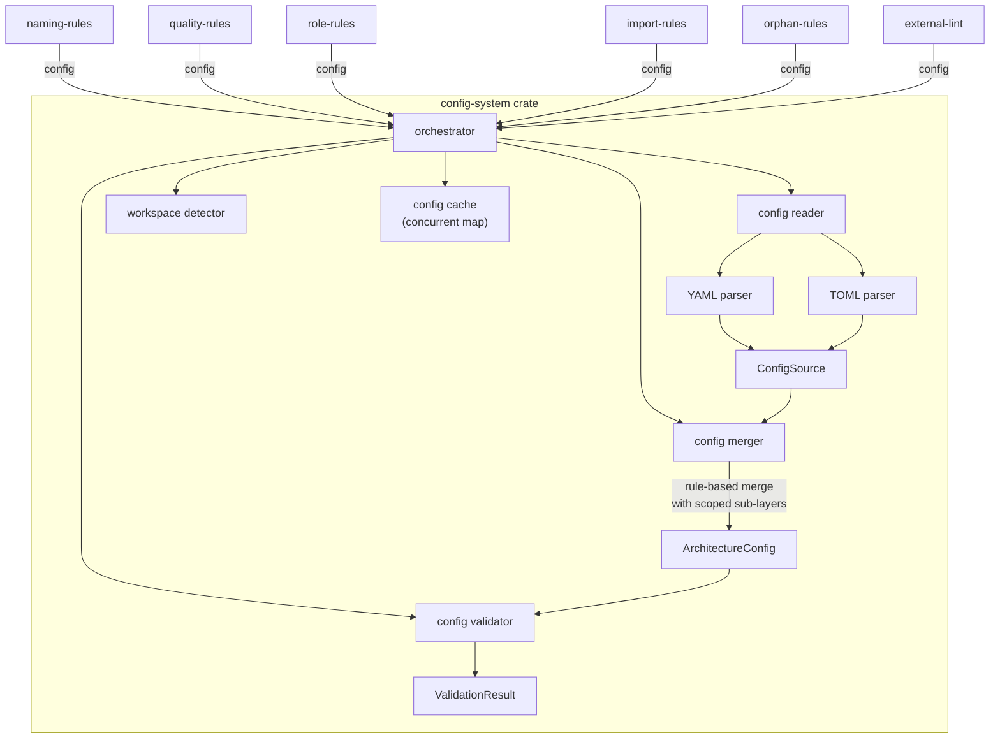

# FRD — config-system

---

## Reference

- Backlog: [BACKLOG.md](BACKLOG.md) — real condition for this feature; this file is specification only.
- PRD: [PRD.md](../../PRD.md)
- Architecture: [ARCHITECTURE.md](../../ARCHITECTURE.md)

## System Overview

The config-system crate manages lint-arwaky configuration: loading, parsing, validation, and workspace detection. It reads config files from multiple priority sources, merges them with embedded defaults via rule-based layer merging (including scoped sub-layer creation), and provides a unified configuration facade for all other lint crates via the config orchestrator aggregate.

The config-system crate is an **infrastructure crate** — it manages configuration loading, parsing, validation, and workspace detection. At compile time, it depends only on `shared` and `filesystem` (for config file I/O via `IFileSystemIOProtocol`). Other crates receive config at runtime via DI (aggregate trait injection through `shared` re-exports).

### Architecture & Data Flow


```mermaid
flowchart TD
    subgraph CS ["config-system crate"]
        A["orchestrator"] --> B["config reader"]
        A --> C["config merger"]
        A --> D["config validator"]
        A --> E["workspace detector"]
        A --> F["config cache\n(concurrent map)"]

        B --> G["YAML parser"]
        B --> H["TOML parser"]
        G --> I["ConfigSource"]
        H --> I
        I --> C
        C -->|"rule-based merge\nwith scoped sub-layers"| J["ArchitectureConfig"]
        J --> D
        D --> K["ValidationResult"]
    end

    L["naming-rules"] -->|"config"| A
    M["quality-rules"] -->|"config"| A
    N["role-rules"] -->|"config"| A
    O["import-rules"] -->|"config"| A
    P["orphan-rules"] -->|"config"| A
    Q["external-lint"] -->|"config"| A

```

### Config Loading Priority Chain

```
Priority 1: Project root
  lint_arwaky.config.yaml at project root
      │ (not found)
      ▼
Priority 2: Parent directories (project root plus up to 4 ancestor levels — 5 levels total)
  Walk up 5 levels (root, then 4 ancestors) looking for config file
      │ (not found)
      ▼
Priority 3: XDG user config
  ~/.config/lint-arwaky/lint_arwaky.config.yaml
      │ (not found)
      ▼
Priority 4: XDG system dirs
  /etc/xdg/lint-arwaky/ (max 8 dirs, absolute paths only)
      │ (not found)
      ▼
Priority 5: Embedded defaults
  Compiled into binary, always available

First match wins — no merge across priority levels.
Loaded config is merged with embedded defaults via rule-based layer merging (FR-CONFIGSYSTEM-005).
```

---

## Functional Requirements

### FR-CONFIGSYSTEM-001: Config File Discovery and Loading

- **Description**: Locate and load the first matching YAML config file for a given project root and language, following a 5-level priority chain.
- **Input**: Project root path, language type.
- **Output**: The loaded config source with raw content, path, and language, or none if no config found.
- **Business Rules**:

  - Priority order: (1) project-root YAML, (2) parent directory YAML (project root plus up to 4 ancestor levels — 5 levels total), (3) XDG user config `~/.config/lint-arwaky/`, (4) XDG system dirs `/etc/xdg/lint-arwaky/` (limited to 8 dirs, absolute paths only), (5) embedded defaults.
  - First match wins — deeper/more specific configs take priority over shallower ones.
  - No config file size limit — config files of any size are accepted.
  - Symlinks pointing outside the project root are rejected via canonical path resolution.
- **Edge Cases**:

  - No config file exists at any level → returns `None`, caller falls back to embedded defaults.
  - YAML parse failure → logs warning to stderr, continues searching next priority level.
  - Non-NotFound I/O error (e.g., permission denied) → logs warning, continues searching.
  - Rules with empty conditions are preserved (not dropped).
- **Error Handling**:

  - Permission denied error when symlink points outside project root.
  - IO error on invalid path canonicalization.
  - ConfigError propagated from YAML parse or file read failures.

---

### FR-CONFIGSYSTEM-002: Language-Aware Config File Resolution

- **Description**: Map a language type to the correct set of config filenames to search for.
- **Input**: Language type (Rust, Python, TypeScript).
- **Output**: Config filenames to search in priority order.
- **Business Rules**:

  - All languages → `lint_arwaky.config.yaml` (unified config for Rust, Python, TypeScript).
  - `ConfigLanguage` is a typed enum, not a string — prevents path injection.
- **Edge Cases**:

  - Unknown language → no config files returned, embedded defaults used.
- **Error Handling**: None — pure mapping function.

---

### FR-CONFIGSYSTEM-003: Workspace Type Detection

- **Description**: Detect the language/type of a project by scanning for marker files (Cargo.toml, pyproject.toml, package.json, etc.) and parent directory conventions.
- **Input**: Target path.
- **Output**: Workspace type (Rust, Python, TypeScript, Unknown).
- **Business Rules**:

  - Single-pass directory scan for marker files (single syscall).
  - Marker files:
    - Rust: `Cargo.toml`
    - Python: `pyproject.toml`, the setup script, `requirements.txt`, the package entry point
    - TypeScript: `package.json`, `tsconfig.json`
  - Walks up to 10 parent directories if no marker found at target path, stopping at workspace directory names (`crates/`, `packages/`, `modules/`).
  - Multiple marker files present → first match in scan order wins.
- **Edge Cases**:

  - No marker files found at any level → returns Unknown.
  - Multiple marker files (e.g., both Cargo.toml and package.json) → first match in scan order wins.
- **Error Handling**: Directory read failures are silently ignored, fallback to Unknown.

---

### FR-CONFIGSYSTEM-004: Multi-Workspace Member Discovery

- **Description**: Discover all workspace member directories under `crates/`, `packages/`, and `modules/` subdirectories.
- **Input**: Root path.
- **Output**: Workspace member paths.
- **Business Rules**:

  - Scans for subdirectories under `crates/`, `packages/`, `modules/`.
  - Uses sequential filesystem operations (no async runtime, no thread pool).
  - If root is itself a workspace directory (e.g., `crates/`), returns its direct subdirectories.
  - If root's parent is a workspace directory, returns root as a single-member workspace.
- **Edge Cases**:

  - No workspace directories found → returns empty vec, prints warning to stderr.
  - Symlink targets outside workspace root → pruned during file collection.
  - I/O error reading a workspace directory → warning logged, skipped.
- **Error Handling**: Warnings for directory read failures, graceful degradation.

---

### FR-CONFIGSYSTEM-005: Config Merging and Default Injection

- **Description**: Merge loaded config with embedded defaults using rule-based layer merging with scoped sub-layer creation.
- **Input**: Parsed architecture config, language type.
- **Output**: Merged layer definitions + rules indexed by scope.
- **Business Rules**:

  - **Layer merging** — rules are merged INTO layer definitions by scope (base or specialized), not simple concatenation.
  - **Scoped sub-layers** — rules with scoped names (e.g., `agent(container|registry)`) create specialized sub-layer entries derived from the parent layer definition, with inner names split by `|` or `,`.
  - **Rule deduplication** — rules are deduplicated by value containment (checked via `contains()` before appending), not by name.
  - **Naming** — merged recursively; non-empty values override defaults.
  - **Ignored paths** — concatenated and deduplicated.
  - Empty arrays/objects in a child config do NOT override parent values.
  - When config has no layers, injects defaults for layers only and adds warning.
  - When no config file found, returns embedded defaults with warning.
- **Edge Cases**:

  - Config with empty `layers` array → defaults injected, warning emitted.
  - Duplicate rule values across configs → deduplicated, not added twice.
  - Config error during load → falls back to embedded defaults with error warning.
- **Error Handling**: ConfigError logged as warning string, defaults used as fallback.

---

### FR-CONFIGSYSTEM-006: Config Validation

- **Description**: Validate loaded project config thresholds and adapter settings against schema constraints.
- **Input**: Project config, adapter name.
- **Output**: Validation result (ok or fail with error messages), boolean (adapter enabled status).
- **Business Rules**:

  - Score threshold must be between 0.0 and 100.0 (inclusive).
  - Complexity threshold must be positive (> 0).
  - `max_file_lines` threshold must be positive (> 0).
  - Adapter enabled check: defaults to `true` if adapter not found in config.
- **Edge Cases**:

  - Score threshold at exactly 0 or 100 → valid.
  - Score threshold at 0.1 → valid.
  - Unknown adapter name → returns true (enabled by default).
- **Error Handling**: Multiple validation errors joined with `|` separator.

---

### FR-CONFIGSYSTEM-007: Config Caching

- **Description**: Cache parsed config by file path to avoid repeated YAML parsing.
- **Input**: Cache key (file path string), config source.
- **Output**: Cached or freshly parsed configuration.
- **Business Rules**:

  - Cache is a `DashMap<String, Arc<ArchitectureConfig>>` with pre-allocated capacity of 32.
  - Parses only on cache miss.
  - Thread-safe via DashMap (no Mutex, no poisoned lock).
  - Concurrent requests for the same key: DashMap handles contention internally.
- **Edge Cases**:

  - Same file path requested concurrently → DashMap ensures single parse.
  - Cache capacity exceeded → DashMap grows dynamically (no eviction).
- **Error Handling**: DashMap operations are infallible (no lock poisoning).

---

### FR-CONFIGSYSTEM-008: Ignored Paths Assembly

- **Description**: Build the complete list of ignored paths from config + hardcoded universal defaults.
- **Input**: Architecture config.
- **Output**: Ignored path patterns.
- **Business Rules**:

  - Default ignored paths (hardcoded, universal):
    - `.git`
    - `node_modules`
    - `target`
    - `dist`
    - `build`
    - `coverage`
    - `.venv`
    - `__pycache__`
  - Config-specified ignored paths appended with deduplication.
  - Path separators normalized to platform-specific separator.
  - Pre-allocated capacity: 8 defaults + config count.
  - No project-specific paths hardcoded — project-specific ignores must come from YAML config.
- **Edge Cases**:

  - Config specifies a path already in defaults → deduplicated, not added twice.
  - Config specifies empty string path → filtered out.
- **Error Handling**: None — pure function.

---

### FR-CONFIGSYSTEM-009: TOML Config Parsing

- **Description**: Parse TOML config files (e.g., Cargo.toml `[tool.lint-arwaky]` section) into project config.
- **Input**: File path.
- **Output**: Project config if found, or error.
- **Business Rules**:

  - Reads the `[tool.lint-arwaky]` or `[tool.lint_arwaky]` section from TOML.
  - Converts TOML value to JSON intermediate representation, then deserializes to `ProjectConfig`.
  - Returns `None` if no `[tool]` section exists (not an error).
- **Edge Cases**:

  - TOML file exists but has no `[tool]` section → returns `None`.
  - TOML file is not valid TOML → returns `ConfigError`.
- **Error Handling**: `ConfigError` with specific keys (tool section, TOML conversion, TOML parsing).

---

### FR-CONFIGSYSTEM-010: Config File Listing

- **Description**: List all config files found at the project root for all supported languages.
- **Input**: Project root path.
- **Output**: List of config file paths per language, or error.
- **Business Rules**:

  - Iterates all three languages (Rust, Python, TypeScript).
  - For each language, checks config filenames at project root only (does not walk up parent directories).
  - Deduplicates by path (same file not listed twice).
  - Breaks after first config found per language.
- **Edge Cases**:

  - Multiple languages have config files → all returned.
  - No config files for any language → returns empty list.
  - I/O error reading a config file → warning logged, continues.
- **Error Handling**: ConfigError propagated for file path creation failures.

---

## API Contract

### Protocol API

| Method | Input | Output | Error | Event | Description |
| --- | --- | --- | --- | --- | --- |
| `execute` | `ConfigRequest` | `ConfigResponse` | None — read and parse failures are carried as warnings inside the response | — | Single composite entry point on the config protocol trait, dispatching every request variant to the orchestrator's capabilities. |

### Aggregate API

| Method | Input | Output | Error | Event | Description |
| --- | --- | --- | --- | --- | --- |
| `execute` | `ConfigRequest` | `ConfigResponse` | None | — | Dispatch a typed config request to the matching capability. |
| `load_project_config` | `FilePath` | `ConfigResult` | Read failure captured as a warning; embedded defaults returned | — | Detect the workspace language, then load and merge the config for it. |
| `load_config_for_language` | `FilePath`, `ConfigLanguage` | `ConfigResult` | Parse failure captured as a warning; embedded defaults returned | — | Load the config for an explicit language and merge it with embedded defaults. |
| `discover_workspaces` | `FilePath` | `Vec<WorkspaceInfo>` | Per-member read failure warned and skipped | — | Discover every workspace member under the root and load its config. |
| `load_config_sync` | `FilePath` | `ArchitectureConfig` | Read failure warned; embedded defaults returned | — | Synchronous config load with no result wrapper. |
| `ignored_paths` | `FilePath` | `PatternList` | None | — | Return the ignored patterns for the auto-detected language. |
| `ignored_paths_for_language` | `FilePath`, `ConfigLanguage` | `PatternList` | None | — | Return the ignored patterns for an explicit language. |
| `read_config` | `FilePath`, `ConfigLanguage` | `Option<ConfigSource>` | Read error warned; `None` returned | — | Read the raw config source without parsing it. |
| `list_config_files` | `FilePath` | `Result<Vec<(ConfigLanguage, FilePath)>, ConfigError>` | `ConfigError` for path construction failures | — | List the config files present at the project root for every supported language. |
| `detect` | `FilePath` | `WorkspaceType` | Directory read failures ignored | — | Detect the workspace type from marker files. |
| `is_workspace` | `FilePath` | `bool` | None | — | Report whether a path is a workspace root. |
| `discover_workspace_members` | `FilePath` | `Vec<FilePath>` | Directory read failure warned and skipped | — | List the workspace member directories under a root. |
| `is_adapter_enabled` | `ProjectConfig`, `AdapterName` | `bool` | None | — | Report whether an adapter is enabled, defaulting to true when absent. |
| `validate_thresholds` | `ProjectConfig` | `ValidationResult` | Validation errors joined with the `|` separator | — | Validate configured thresholds against schema constraints. |
| `parse_yaml_config` | `FilePath` | `Result<ProjectConfig, ConfigError>` | `ConfigError` on read or parse failure | — | Parse a YAML config file. |
| `parse_toml_config` | `FilePath` | `Result<Option<ProjectConfig>, ConfigError>` | `ConfigError` when the TOML is invalid | — | Parse the tool section of a TOML config, returning `None` when absent. |
| `parse_config_yaml_with_warnings` | YAML string | `(ArchitectureConfig, Vec<String>)` | Parse failures surfaced as warnings | — | Parse YAML content into an architecture config plus its warnings. |
| `get_default_config` | Language string | `ArchitectureConfig` | None | — | Return the configuration compiled into the binary. |

---

## Integration Points

| System | Direction | Purpose | Failure mode |
| --- | --- | --- | --- |
| `shared` crate | in | Value objects, contract traits, and utility functions | Compile-time dependency; unavailable at build time |
| `filesystem` crate | in | Config file I/O via `IFilesystemAggregate` and `IFileSystemIOProtocol` | Read failure → warning logged, embedded defaults used |
| Config system root container | in | Wires orchestrator, reader, validator, and parser via dependency injection | Missing dependency → construction error at startup |
| XDG config directory resolution | in | Resolves user and system config directories | Resolution failure → next priority level searched |
| YAML 1.2 deserializer | in | Deserializes config files (`serde_yaml_ng`) | Parse failure → warning logged, next priority level searched |
| TOML parser | in | Parses the `[tool.lint-arwaky]` section (`toml`) | Invalid TOML → `ConfigError` returned |
| `dashmap` | in | Concurrent HashMap backing the config cache | Infallible operations; no failure path |
| `IConfigOrchestratorAggregate` | out | Aggregate surface injected at runtime into `naming-rules`, `quality-rules`, `role-rules`, `import-rules`, `orphan-rules`, and `external-lint` via DI through `shared` re-exports | Aggregate unavailable → consumers fall back to embedded defaults |

---

## Non-functional Requirements

| Metric | Target | Measurement method |
| --- | --- | --- |
| Config read latency at project root | < 50 ms | Time a config load from a local project root |
| Config read latency from XDG paths | < 100 ms | Time a config load from `~/.config` or `/etc/xdg` |
| Workspace discovery for 10 members | < 500 ms (sequential) | Discover all members under a 10-member workspace and measure wall clock |
| Memory overhead per cached config | < 10 KB | Measure the size of a parsed `ArchitectureConfig` after deserialization |
| Concurrency safety | Thread-safe via DashMap; no Mutex, no lock poisoning | Concurrent reads for the same key; assert single parse |
| Symlink attack detection | O(1) canonical path check rejects paths escaping project root | Place a symlink outside the project root and assert it is rejected |

---

## Test Scenarios

- A config at the project root is loaded from the project root.
- A config at the first parent level, absent at the root, is loaded from the parent.
- A config at the XDG user location, absent at root and parent, is loaded from XDG user.
- A config at the XDG system dir only is loaded from XDG system.
- No config at any location — embedded defaults are used.
- A symlink pointing outside the project root is rejected.
- A YAML parse failure at priority 1 logs a warning and searches priority 2.
- A permission denied at priority 1 logs a warning and searches priority 2.
- Any language (Rust/Python/TypeScript) resolves to `lint_arwaky.config.yaml`.
- An unknown language returns an empty list and embedded defaults.
- A directory with `Cargo.toml` is detected as Rust.
- A directory with `pyproject.toml` is detected as Python.
- A directory with `package.json` is detected as TypeScript.
- A parent directory named `crates/` is detected as Rust.
- A parent directory named `packages/` is detected as TypeScript.
- A parent directory named `modules/` is detected as Python.
- No marker files anywhere — returns Unknown.
- Both `Cargo.toml` and `package.json` present — first match in scan order wins.
- A directory with only the Python package entry point is detected as Python.
- A root with `crates/foo` and `crates/bar` returns both members.
- A root with no workspace directories returns an empty list plus a warning.
- A root that is itself `crates/` returns its direct subdirectories.
- An I/O error on one member directory logs a warning and the other members are returned.
- A config with an empty `layers` array injects defaults plus a warning.
- Duplicate rule values are deduplicated by value containment.
- A config error during load uses embedded defaults plus a warning.
- An empty `ignored_paths` in config preserves defaults (not overridden).
- A scoped rule `agent(container|registry)` creates the sub-layers `agent(container)` and `agent(registry)`.
- A score threshold of 50.0 is valid.
- A score threshold of 0.0 is valid.
- A score threshold of 100.0 is valid.
- A score threshold of -1.0 is invalid.
- A score threshold of 101.0 is invalid.
- An unknown adapter name is enabled by default.
- The same config file requested twice is parsed once and served from cache.
- Concurrent requests for the same key produce a single parse.
- No config-specified ignored paths — the 8 universal defaults are returned.
- A config that adds `tests` yields the defaults plus `tests`.
- A config that adds `.git` (already a default) is deduplicated, not added twice.
- A config that adds an empty string path has it filtered out.
- A manifest with `[tool.lint-arwaky]` is parsed correctly.
- A manifest without a `[tool]` section returns None.
- Invalid TOML syntax returns a `ConfigError`.
### SCEN-001 — Config Discovery and Loading


FRD Ref: FR-001

| # | Scenario | Expected |
| - | - | - |
| 1 | Config exists at project root | Loaded from project root |
| 2 | Config not at root, exists at parent (depth 1) | Loaded from parent |
| 3 | Config not at root/parent, exists at XDG user | Loaded from XDG user |
| 4 | Config only at XDG system dir | Loaded from XDG system |
| 5 | No config anywhere | Embedded defaults used |
| 6 | Symlink pointing outside project root | Rejected |
| 7 | YAML parse failure at priority 1 | Warning logged, priority 2 searched |
| 8 | Permission denied at priority 1 | Warning logged, priority 2 searched |

### SCEN-002 — Language Resolution


FRD Ref: FR-002

| # | Scenario | Expected |
| - | - | - |
| 1 | Any language (Rust/Python/TypeScript) | `lint_arwaky.config.yaml` |
| 2 | Unknown language | Empty list, embedded defaults |

### SCEN-003 — Workspace Detection


FRD Ref: FR-003

| # | Scenario | Expected |
| - | - | - |
| 1 | Directory with Cargo.toml | Rust |
| 2 | Directory with pyproject.toml | Python |
| 3 | Directory with package.json | TypeScript |
| 4 | Parent dir is `crates/` | Rust |
| 5 | Parent dir is `packages/` | TypeScript |
| 6 | Parent dir is `modules/` | Python |
| 7 | No markers anywhere | Unknown |
| 8 | Both Cargo.toml and package.json | First match wins |
| 9 | Directory with `__init__.py` only | Python |

### SCEN-004 — Workspace Members


FRD Ref: FR-004

| # | Scenario | Expected |
| - | - | - |
| 1 | Root with crates/foo, crates/bar | [crates/foo, crates/bar] |
| 2 | Root with no workspace dirs | Empty vec + warning |
| 3 | Root is `crates/` itself | Direct subdirectories returned |
| 4 | I/O error on one member dir | Warning logged, other members returned |

### SCEN-005 — Config Merging


FRD Ref: FR-005

| # | Scenario | Expected |
| - | - | - |
| 1 | Config with empty layers array | Defaults injected + warning |
| 2 | Duplicate rule values | Deduplicated by value containment |
| 3 | Config error during load | Defaults used + warning |
| 4 | Empty ignored_paths in config | Defaults preserved (not overridden) |
| 5 | Scoped rule `agent(container\ | registry)` |

### SCEN-006 — Validation


FRD Ref: FR-006

| # | Scenario | Expected |
| - | - | - |
| 1 | Score threshold 50.0 | Valid |
| 2 | Score threshold 0.0 | Valid |
| 3 | Score threshold 100.0 | Valid |
| 4 | Score threshold -1.0 | Invalid |
| 5 | Score threshold 101.0 | Invalid |
| 6 | Unknown adapter name | Enabled (default true) |

### SCEN-007 — Caching


FRD Ref: FR-007

| # | Scenario | Expected |
| - | - | - |
| 1 | Same config file requested twice | Parsed once, cached |
| 2 | Concurrent requests for same key | Single parse (DashMap) |

### SCEN-008 — Ignored Paths


FRD Ref: FR-008

| # | Scenario | Expected |
| - | - | - |
| 1 | No config ignored paths | 8 universal defaults returned |
| 2 | Config adds "tests" | Defaults + "tests" |
| 3 | Config adds ".git" (already default) | Deduplicated, not added twice |
| 4 | Config adds empty string | Filtered out |

### SCEN-009 — TOML Parsing


FRD Ref: FR-009

| # | Scenario | Expected |
| - | - | - |
| 1 | Cargo.toml with `[tool.lint-arwaky]` | Parsed correctly |
| 2 | Cargo.toml without `[tool]` | Returns None |
| 3 | Invalid TOML syntax | ConfigError returned |


---

## Assumptions & Constraints

- `ConfigLanguage` enum restricts input to exactly Rust, Python, TypeScript — no arbitrary strings allowed.
- Config file naming follows a unified convention: `lint_arwaky.config.yaml` for all languages.
- Workspace structure must follow `crates/`, `packages/`, `modules/` convention.
- Maximum 8 XDG_CONFIG_DIRS entries; only absolute paths accepted.
- No config file size limit.
- Workspace discovery runs sequentially.
- YAML parsing uses `serde_yaml_ng`.
- TOML parsing reads only the `[tool]` section, not full TOML config.
- Config cache uses DashMap (no Mutex, no lock poisoning).
- Default ignored paths are universal only — no project-specific paths hardcoded.

---

## Glossary

- **AES**: Agentic Engineering System — the 7-layer coding convention.
- **ConfigLanguage**: Typed enum restricting language input to Rust, Python, TypeScript.
- **WorkspaceType**: Enum identifying project language from marker files.
- **ArchitectureConfig**: Parsed configuration containing layers, rules, naming, and thresholds.
- **ConfigSource**: Metadata about a loaded config file (language, path, raw content).
- **ConfigResult**: Merged config plus source info plus warnings from the loading process.
- **XDG**: XDG Base Directory Specification — standard for user/system config paths.
- **DashMap**: Concurrent HashMap used for thread-safe config caching without lock poisoning.
- **Embedded defaults**: Configuration compiled into the binary, used when no config file is found.
- **Scoped rule**: A rule with a parenthesized scope (e.g., `agent(container|registry)`) that creates specialized sub-layers.

---

## Appendix A: Top-Level Config Schema

### File Naming Convention

```
lint_arwaky.config.yaml  — unified config for all languages (Rust, Python, TypeScript)
```

### Default Ignored Paths (Hardcoded, Universal)

These are always included regardless of config:

```
.git
node_modules
target
dist
build
coverage
.venv
__pycache__
```

Config-specified `ignored_paths` are **appended** to these defaults with deduplication.

---
