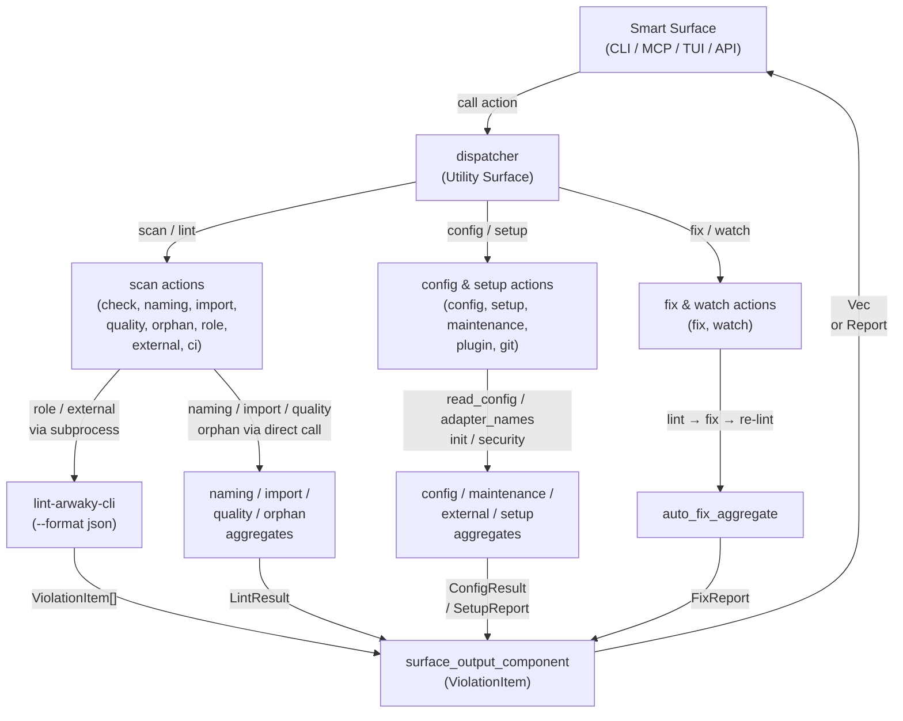

# FRD — dispatcher (v1.11.0)

---

## System Overview

The dispatcher crate is a **Utility Surface** that centralizes all business logic for Smart surfaces (CLI, MCP, TUI, API). Smart surfaces are thin wrappers that parse input, call dispatcher functions, and format output. Dispatcher owns the business logic; surfaces own the rendering.

### Architecture & Data Flow

### Dependency Rule

- Dispatcher imports: shared (taxonomies, contracts, aggregates for filesystem, naming, import, quality, orphan, role, external, config, maintenance, setup, file-watch, auto-fix), filesystem, orphan-rules
- Dispatcher must NOT import: any Smart surface crate (CLI, MCP, TUI, API)

---

## Functional Requirements

### FR-001: Unified Scan

**File**: `surface_check_action.rs`

**What it produces**: Aggregated `Vec<ViolationItem>` from all 6 linters executed as subprocesses.

| Output          | Description                                                              |
| --------------- | ------------------------------------------------------------------------ |
| Violation items | Combined violations from quality, role, import, naming, orphan, external |
| Error message   | User-facing error if path not found or member invalid                    |

**Input**: `ScanOptions` — optional path, filter, member, filesystem aggregate, multi-project orchestrator.

**Business Rules**:

- Runs 6 linters sequentially via `std::process::Command` (self-invocation pattern).
- Each linter invoked with `--format json`, stdout parsed into `ViolationItem`.
- Validates member against discovered workspaces if `multi_project_orchestrator` provided.
- Normalizes relative paths to absolute via filesystem aggregate `canonicalize`.
- Filters violations by target directory (only files within scanned root).
- Optional `filter` parameter: retains only violations whose code contains the filter string.

**Edge Cases**:

- Path does not exist: returns `Err("Error: path '...' does not exist")`.
- Invalid member name: returns `Err("[error] no workspace member matching '...'")`.
- Linter subprocess fails: silently skipped (no violation produced).
- No violations found: returns empty `Vec`.

**Error Handling**: `Result<Vec<ViolationItem>, String>` — user-facing error messages.

---

### FR-002: CI Threshold Validation

**File**: `surface_ci_action.rs`

**What it produces**: `CiReport` with pass/fail decision based on score and critical violations.

| Output           | Description                                         |
| ---------------- | --------------------------------------------------- |
| Score            | Computed quality score (0–100)                     |
| Pass/fail        | Whether all CI checks passed                        |
| Reasons          | List of failure reasons (critical, below threshold) |
| Severity counts  | Critical, high, medium, low violation counts        |
| Total violations | Total number of violations found                    |

**Input**: All aggregate dependencies (code analysis, import, naming, config, orphan, filesystem) + optional path + threshold.

**Business Rules**:

- Builds file index once via `filesystem.build_file_index()`.
- Runs 4 rule categories sequentially: quality → import → naming → orphan.
- Passes pre-fetched `file_list()` to each rule checker (zero-I/O pattern).
- Computes score via `ICodeAnalysisAggregate::calc_score()`.
- Auto-fail if any CRITICAL violation detected.
- Auto-fail if score below threshold.

**Edge Cases**:

- Path does not exist: returns `Err`.
- No violations: score = 100, pass = true.
- CRITICAL violation present: always fail regardless of score.

**Error Handling**: `Result<CiReport, String>`.

---

### FR-003: Individual Linter Scanning

**Files**: `surface_naming_action.rs`, `surface_import_action.rs`, `surface_quality_action.rs`, `surface_orphan_action.rs`, `surface_role_action.rs`, `surface_external_action.rs`

**What it produces**: `Vec<ViolationItem>` from a single linter category.

| Output          | Description                         |
| --------------- | ----------------------------------- |
| Violation items | Violations from one specific linter |
| Error message   | User-facing error if path not found |

**Input**: Optional path, linter orchestrator aggregate, filter string, filesystem aggregate.

**Business Rules**:

- Each function follows the same pattern: resolve path → validate → build file index → run audit → convert to ViolationItem → apply filter.
- `collect_naming`: `naming_orchestrator.run_audit_with_entries(file_list())`
- `collect_import`: `import_orchestrator.run_audit_with_entries(file_list())`
- `collect_quality`: `code_analysis_linter.run_analysis_with_entries(file_list())`
- `collect_orphan`: `orphan_orchestrator.check_orphans_with_entries(file_list(), context)` — supports workspace discovery and member filtering.
- `collect_role` / `collect_external`: Uses subprocess self-invocation (known gap — async aggregate, no tokio runtime available).
- `collect_external_direct`: Direct call without subprocess, used by CLI `external` subcommand to avoid recursive spawning.

**Edge Cases**:

- Path does not exist: returns `Err`.
- Orphan with multi-workspace: iterates each workspace, filters results by workspace prefix.
- Role/external subprocess fails: returns empty violations from failed parse.

**Error Handling**: `Result<Vec<ViolationItem>, String>`.

---

### FR-004: Auto-Fix

**File**: `surface_fix_action.rs`

**What it produces**: `FixReport` with before/after violation counts and fix details.

| Output       | Description                                        |
| ------------ | -------------------------------------------------- |
| Before count | Number of violations before fix                    |
| After count  | Number of violations after fix (0 in dry-run)      |
| Fixed count  | Number of violations resolved                      |
| Fixable list | Violations matching fixable rules (AES101/203/304) |
| Success flag | Whether all violations resolved                    |

**Input**: Optional path, dry_run flag, code analysis aggregate, fix orchestrator factory closure.

**Business Rules**:

- Runs initial lint to get baseline violation count.
- Filters fixable violations (AES101, AES203, AES304 only).
- Creates fix orchestrator via factory closure with `dry_run` flag.
- In dry-run mode: preview only, no modifications, after_count = before_count.
- In execute mode: runs fix, re-lints, computes delta.

**Edge Cases**:

- No fixable violations: `fixable` is empty, fix still runs (no-op).
- Fix orchestrator failure: returns error with fix output.

**Error Handling**: `Result<FixReport, String>`.

---

### FR-005: Git Diff Integration

**File**: `surface_git_action.rs`

**What it produces**: `GitDiffReport` with changed files and their violations.

| Output           | Description                                 |
| ---------------- | ------------------------------------------- |
| Changed files    | `Vec<FilePath>` of lintable changed files |
| Results          | `Vec<LintResult>` per changed file        |
| Total violations | Count of all violations in changed files    |

**Input**: Code analysis aggregate, git base branch name, optional project path, optional filter.

**Business Rules**:

- Runs `git diff --name-only <base>...HEAD` via `std::process::Command`.
- Filters to lintable files via `is_lintable()`.
- Runs code analysis on each changed file individually.
- Optional filter restricts to files containing the filter string.

**Edge Cases**:

- Git diff fails: returns `Err("[error] git diff failed: ...")`.
- No changed files: empty report.
- Non-lintable files changed: excluded from results.

**Error Handling**: `Result<GitDiffReport, String>`.

---

### FR-006: Configuration Display

**File**: `surface_config_action.rs`

**What it produces**: `ConfigShowReport` with redacted config content per language.

| Output   | Description                                 |
| -------- | ------------------------------------------- |
| Entries  | Config file content per language (redacted) |
| Warnings | Errors encountered during config reading    |

**Input**: Config orchestrator aggregate.

**Business Rules**:

- Iterates known languages: Rust, Python, TypeScript.
- Reads config via `orchestrator.read_config()` (sync).
- Redacts AWS keys (`AKIA...`) and long base64-like tokens (>40 chars).
- Returns empty entry for missing configs.

**Edge Cases**:

- Config read error: pushes warning, continues to next language.
- No config files found: returns empty entries with no warnings.

**Error Handling**: Returns `ConfigShowReport` (never errors, warnings embedded).

---

### FR-007: Project Setup

**File**: `surface_setup_action.rs`

**What it produces**: Setup items, install report, MCP config snippet.

| Output         | Description                                  |
| -------------- | -------------------------------------------- |
| Init items     | List of setup steps with success/failure     |
| Install report | Python and JS adapter installation status    |
| MCP config     | JSON config snippet for specified MCP client |

**Input**: Setup management aggregate, optional sudo flag, client name.

**Business Rules**:

- `collect_init`: Detects languages, writes config templates, copies docs and `.agents/` from XDG config dir.
- `collect_install`: Installs Python and JS adapters via aggregate.
- `collect_mcp_config`: Generates JSON config for claude-code, cursor, windsurf, copilot, hermes/vscode.
- MCP binary resolution: env var `LINT_ARWAKY_MCP_BIN` → sibling of current exe → error (no PATH fallback).

**Edge Cases**:

- XDG config dir not found: warns and skips doc distribution.
- Config write failure: reports error, continues.
- MCP binary not found: error with resolution hint.

**Error Handling**: Embedded in report items (never returns `Err` for init).

---

### FR-008: Maintenance Operations

**File**: `surface_maintenance_action.rs`

**What it produces**: Toolchain diagnostics, security scan report, dependency report.

| Output                | Description                        |
| --------------------- | ---------------------------------- |
| Toolchain diagnostics | Tool availability and version info |
| Security scan         | Vulnerability scan results         |
| Dependency report     | Dependency health and metadata     |

**Input**: Maintenance commands aggregate, optional path.

**Business Rules**:

- All operations delegate to `MaintenanceCommandsAggregate` — no direct subprocess calls.
- `collect_doctor`: Toolchain diagnostics.
- `collect_security`: Security scan at given path.
- `collect_dependencies`: Dependency report at given path.

**Error Handling**: `Result<T, String>` for security and dependencies; direct return for doctor.

---

### FR-009: Plugin Management

**File**: `surface_plugin_action.rs`

**What it produces**: `AdapterNameList` of available external lint adapters.

| Output        | Description                      |
| ------------- | -------------------------------- |
| Adapter names | List of registered adapter names |

**Input**: External lint aggregate.

**Business Rules**:

- Delegates to `external_lint.adapter_names()`.
- Single function, single delegation.

**Error Handling**: Direct return (infallible).

---

### FR-010: File Watching

**File**: `surface_watch_action.rs`

**What it produces**: Blocking watch session with Ctrl+C signal handling.

| Output        | Description                   |
| ------------- | ----------------------------- |
| Watch session | Blocks until interrupted      |
| Stop callback | Invoked on Ctrl+C for cleanup |

**Input**: Watch aggregate, optional path, `on_stop` callback.

**Business Rules**:

- Creates `WatchConfig` from resolved path.
- Sets up `ctrlc` handler with atomic running flag.
- Delegates to `watch_aggregate.run(config, running)`.
- `on_stop` callback provided by CLI surface for stop message.

**Edge Cases**:

- Ctrl+C handler setup fails: returns `Err`.
- Watch session fails: returns `Err("watch session failed")`.

**Error Handling**: `Result<(), String>`.

---

### FR-011: Violation Output Component

**File**: `surface_output_component.rs`

**What it produces**: `ViolationItem` — the shared violation data type used by all surface actions.

| Output        | Description                                                           |
| ------------- | --------------------------------------------------------------------- |
| ViolationItem | Normalized violation with code, file, line, column, message, severity |

**Input**: `LintResult` (from rule orchestrators) or `serde_json::Value` (from subprocess JSON).

**Business Rules**:

- `from_lint_result`: Converts `LintResult` → `ViolationItem` using existing VOs.
- `from_json_obj`: Parses JSON object into `ViolationItem`.
- `severity_level`: Maps severity enum to numeric level (0–4) for sorting.
- No duplicate String wrappers — uses shared VOs (`ErrorCode`, `FilePath`, `LineNumber`, etc.).

**Edge Cases**:

- Missing JSON fields: returns `None` from `from_json_obj`.
- Unknown severity string: defaults to `INFO`.

**Error Handling**: `Option<ViolationItem>` for JSON parsing; infallible for `from_lint_result`.

---

### FR-012: Version Info

**File**: `surface_version_action.rs`

**What it produces**: `VersionReport` with compile-time version and edition info.

version      Crate version from `CARGO_PKG_VERSION`
edition       Rust edition from `CARGO_PKG_RUST_VERSION`

**Input**: None (reads compile-time environment variables).

**Business Rules**:

- Returns `VersionReport` with `version` and `edition` fields populated from `env!()` macros.
- Used by MCP server and CLI to report the tool version.

**Edge Cases**: None (infallible).

**Error Handling**: None (infallible).

---

## Non-functional Requirements

- **Performance**: Scan of 1,000 files completes in < 5s (subprocess overhead included).
- **Memory**: Stateless functions — no persistent state between calls.
- **Sync**: All functions are synchronous. No tokio runtime required.
- **DI**: All aggregate dependencies injected via `Arc<dyn Trait>`. No concrete type imports from lower layers.
- **No Formatting**: Dispatcher returns data only. CLI/MCP/TUI format output themselves.

---

## Test Scenarios

### FR-001: Unified Scan

| # | Scenario                  | Expected                                         |
| - | ------------------------- | ------------------------------------------------ |
| 1 | Scan valid project path   | Returns violations from all 6 linters            |
| 2 | Scan non-existent path    | Returns`Err("Error: path ... does not exist")` |
| 3 | Scan with filter "AES101" | Only AES101 violations returned                  |
| 4 | Scan with invalid member  | Returns`Err("no workspace member matching")`   |
| 5 | Scan empty project        | Returns empty Vec                                |

### FR-002: CI Validation

| # | Scenario                      | Expected                                 |
| - | ----------------------------- | ---------------------------------------- |
| 1 | CI with high threshold (90)   | Pass = true if score >= 90               |
| 2 | CI with CRITICAL violation    | Pass = false (auto-fail)                 |
| 3 | CI with score below threshold | Pass = false, reasons contains score msg |
| 4 | CI with no violations         | Pass = true, score = 100                 |

### FR-003: Individual Linters

| # | Scenario                       | Expected                              |
| - | ------------------------------ | ------------------------------------- |
| 1 | Naming scan on valid project   | Returns naming violations             |
| 2 | Import scan with filter        | Only matching violations returned     |
| 3 | Orphan scan on multi-workspace | Iterates each workspace member        |
| 4 | Role scan via subprocess       | Returns violations (or empty on fail) |

### FR-004: Auto-Fix

| # | Scenario                           | Expected                                    |
| - | ---------------------------------- | ------------------------------------------- |
| 1 | Dry-run mode                       | after_count = before_count, fixed_count = 0 |
| 2 | Execute with fixable violations    | fixed_count > 0                             |
| 3 | Execute with no fixable violations | fixable list is empty, no changes           |

### FR-005: Git Diff

| # | Scenario                           | Expected                               |
| - | ---------------------------------- | -------------------------------------- |
| 1 | Diff with 3 changed lintable files | 3 files in report, violations per file |
| 2 | Diff with non-existent base        | Returns git diff error                 |
| 3 | Diff with filter                   | Only matching files included           |

---

## Glossary

| Term                              | Definition                                                   |
| --------------------------------- | ------------------------------------------------------------ |
| **Utility Surface**         | Crate that centralizes business logic for Smart surfaces     |
| **Smart Surface**           | Thin UI wrapper (CLI, MCP, TUI) that calls dispatcher        |
| **ViolationItem**           | Shared data type for lint violations across all actions      |
| **ScanOptions**             | Input VO for unified scan (path, filter, member, aggregates) |
| **CiReport**                | CI evaluation result with score, threshold, pass/fail        |
| **FixReport**               | Auto-fix outcome with before/after counts                    |
| **GitDiffReport**           | Git-diff lint result with changed files and violations       |
| **Self-invocation pattern** | Subprocess spawning the same binary for linter execution     |

---

## Reference

- PRD: [PRD.md](../../PRD.md)
- Architecture: [ARCHITECTURE.md](../../ARCHITECTURE.md)
