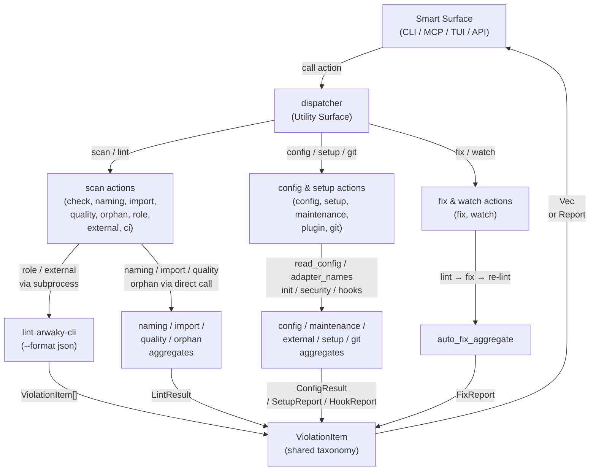

# FRD — dispatcher (v2.0.0)

---

## Reference

- Backlog: [BACKLOG.md](BACKLOG.md) — real condition for this feature; this file is specification only.
- PRD: [PRD.md](../../PRD.md)
- Architecture: [ARCHITECTURE.md](../../ARCHITECTURE.md)
- CLI Commands FRD: `crates/cli-commands/FRD.md` (primary caller)

## System Overview

The dispatcher crate centralizes all business logic for Smart surfaces (CLI, MCP, TUI, API). Smart surfaces are thin wrappers that parse input, call dispatcher actions, and format output. The dispatcher owns the business logic; surfaces own the rendering.

The crate exposes one action per surface command. Each action takes already-injected aggregates (`Arc<dyn Trait>`), performs scan / CI / fix / config / setup / maintenance / plugin / git / watch / version work, and returns a plain report value object. No action formats output, spawns an async runtime, or holds state between calls.

### Architecture & Data Flow

```mermaid
flowchart TD
    A["Smart Surface\n(CLI / MCP / TUI / API)"] -->|"call action"| D["dispatcher\n(Utility Surface)"]

    D -->|"scan / lint"| SCAN["scan actions\n(check, naming, import,\nquality, orphan, role,\nexternal, ci)"]
    D -->|"fix / watch"| FIX["fix & watch actions\n(fix, watch)"]
    D -->|"config / setup / git"| CFG["config & setup actions\n(config, setup, maintenance,\nplugin, git)"]

    SCAN -->|"role / external\nvia subprocess"| S["lint-arwaky-cli\n(--format json)"]
    SCAN -->|"naming / import / quality\norphan via direct call"| B1["naming / import /\nquality / orphan\naggregates"]
    CFG -->|"read_config / adapter_names\ninit / security / hooks"| B2["config / maintenance /\nexternal / setup / git\naggregates"]
    FIX -->|"lint → fix → re-lint"| B6["auto_fix_aggregate"]

    S -->|"ViolationItem[]"| OUT["ViolationItem\n(shared taxonomy)"]
    B1 -->|"LintResult"| OUT
    B2 -->|"ConfigResult\n/ SetupReport / HookReport"| OUT
    B6 -->|"FixReport"| OUT

    OUT -->|"Vec<ViolationItem>\nor Report"| A
```

---

## Functional Requirements

### FR-DISPATCHER-001: Unified Scan

- **Description**: Aggregate the violations produced by all six linters into one normalized list for a target path.
- **Input**: `ScanOptions` — optional path, filter, member, filesystem seam, and an optional in-process aggregate bundle.
- **Output**: `Result<Vec<ViolationItem>, String>` — a normalized violation list where every linter result has been converted to the shared taxonomy type.
- **Business Rules**:
  - Runs the 6 linters sequentially; the default path uses process self-invocation with the JSON output format, and an injected aggregate bundle runs them in-process.
  - Each linter's stdout is parsed into `ViolationItem`.
  - Validates member against discovered workspaces if `multi_project_orchestrator` provided.
  - Normalizes relative paths to absolute via filesystem aggregate `canonicalize`.
  - Filters violations by target directory (only files within scanned root).
  - Optional `filter` parameter: retains only violations whose code contains the filter string.
  - AES205 cycle violations are always retained if the file is within the same parent workspace.
- **Edge Cases**:
  - Path does not exist: returns `Err("Error: path '...' does not exist")`.
  - Invalid member name: returns `Err("[error] no workspace member matching '...'")`.
  - Linter subprocess fails: silently skipped (no violation produced).
  - No violations found: returns empty `Vec`.
- **Error Handling**: `Result<Vec<ViolationItem>, String>` — user-facing error messages.

---

### FR-DISPATCHER-002: CI Threshold Validation

- **Description**: Evaluate a workspace against a score threshold and produce a pass/fail CI decision with reasons.
- **Input**: `CiScanDeps` — all aggregate dependencies (code analysis, import, naming, config, orphan, filesystem) plus an optional path and threshold.
- **Output**: `Result<CiReport, String>` — score, pass/fail decision, failure reasons, per-severity violation counts, and the total violation count.
- **Business Rules**:
  - Builds file index once via `filesystem.build_file_index_with_ignored()`.
  - Runs 4 rule categories sequentially: quality → import → naming → orphan.
  - Passes pre-fetched `file_list()` to each rule checker (zero-I/O pattern).
  - Computes score via `ICodeAnalysisAggregate::calc_score()`.
  - Auto-fail if any CRITICAL violation detected.
  - Auto-fail if score below threshold.
- **Edge Cases**:
  - Path does not exist: returns `Err`.
  - No violations: score = 100, pass = true.
  - CRITICAL violation present: always fail regardless of score.
- **Error Handling**: `Result<CiReport, String>`.

---

### FR-DISPATCHER-003: Individual Linter Scanning

- **Description**: Run a single linter category over a target path and return its violations.
- **Input**: Optional path, the relevant linter orchestrator aggregate, an optional filter string, and the filesystem aggregate.
- **Output**: `Result<Vec<ViolationItem>, String>` — the violations of the one requested linter category.
- **Business Rules**:
  - Each function follows the same pattern: resolve path → validate → build file index → run audit → convert to ViolationItem → apply filter.
  - **Naming**: `naming_orchestrator.run_audit_with_entries(file_list())`
  - **Import**: `import_orchestrator.run_audit_with_entries(file_list())`
  - **Quality**: `code_analysis_linter.run_analysis_with_entries(file_list())`
  - **Orphan**: `orphan_orchestrator.check_orphans_with_entries(file_list(), context)` — supports workspace discovery, member filtering, and unified cross-member orphan graph building.
  - **Role** / **External**: Uses subprocess self-invocation (known gap — no direct aggregate variant for single-path scan).
  - **External Direct**: Direct call without subprocess, used by CLI `external` subcommand to avoid recursive spawning. Detects languages from file extensions, loads config adapter entries, and passes an `ExternalLintContext` to the orchestrator.
- **Edge Cases**:
  - Path does not exist: returns `Err`.
  - Orphan with multi-workspace: builds unified filesystem across all members, runs unified orphan graph, then filters results per workspace member.
  - Role/external subprocess fails: returns empty violations from failed parse.
- **Error Handling**: `Result<Vec<ViolationItem>, String>`.

---

### FR-DISPATCHER-004: Auto-Fix

- **Description**: Run the fix pipeline over a target path and report the before/after violation counts plus the fixable set.
- **Input**: Optional path, dry-run flag, code analysis aggregate, and a fix orchestrator factory closure or a pre-built orchestrator instance.
- **Output**: `Result<FixReport, String>` — before count, after count, fixed count, the fixable violation list (AES101/203/304), and a success flag.
- **Business Rules**:
  - Runs initial lint to get baseline violation count.
  - Filters fixable violations (AES101, AES203, AES304 only).
  - In dry-run mode: preview only, no modifications, after_count = before_count.
  - In execute mode: runs fix, re-lints, computes delta.
  - Two entry points: `collect_fix` (factory closure) and `collect_fix_direct` (pre-built orchestrator for TUI).
- **Edge Cases**:
  - No fixable violations: `fixable` is empty, fix still runs (no-op).
  - Fix orchestrator failure: returns error with fix output.
- **Error Handling**: `Result<FixReport, String>`.

---

### FR-DISPATCHER-005: Git Diff Integration and Hook Management

- **Description**: Report violations for git-changed files, and install or remove the pre-commit hook.
- **Input**: For git diff: code analysis aggregate, git base branch name, optional project path, optional filter. For hooks: git hooks aggregate, optional executable path.
- **Output**: `Result<GitDiffReport, String>` — the changed lintable files with one lint result per file and a total violation count; or `Result<HookReport, String>` — the hook action name, success flag, and message.
- **Business Rules**:
  - Runs `git diff --name-only <base>...HEAD` via `std::process::Command`.
  - Filters to lintable files via `is_lintable()`.
  - Runs code analysis on each changed file individually.
  - Optional filter restricts to files containing the filter string.
  - Hook management: `collect_install_hook` installs a pre-commit hook via `GitHooksAggregate`. `collect_uninstall_hook` removes it.
- **Edge Cases**:
  - Git diff fails: returns `Err("[error] git diff failed: ...")`.
  - No changed files: empty report.
  - Non-lintable files changed: excluded from results.
  - Hook install fails: returns `HookReport` with success=false and error message.
- **Error Handling**: `Result<GitDiffReport, String>` for git diff; `Result<HookReport, String>` for hooks.

---

### FR-DISPATCHER-006: Configuration Display

- **Description**: Collect the active configuration per supported language with secrets redacted.
- **Input**: Config orchestrator aggregate.
- **Output**: `ConfigShowReport` — one entry per language holding the redacted config content, plus the warnings gathered while reading.
- **Business Rules**:
  - Iterates known languages: Rust, Python, TypeScript.
  - Reads config via `orchestrator.read_config()` (sync).
  - Redacts AWS keys (`AKIA...`) and long base64-like tokens (>40 chars).
  - Returns empty entry for missing configs.
- **Edge Cases**:
  - Config read error: pushes warning, continues to next language.
  - No config files found: returns empty entries with no warnings.
- **Error Handling**: Returns `ConfigShowReport` (never errors, warnings embedded).

---

### FR-DISPATCHER-007: Project Setup

- **Description**: Prepare a project for use by producing the init checklist, adapter install status, and the MCP client configuration.
- **Input**: Setup management aggregate, filesystem IO protocol, optional sudo flag, and the MCP client name.
- **Output**: `SetupInitItem` list with per-step success/failure, an `InstallReport` with Python and JS adapter installation status, and an `McpConfigReport` holding the JSON snippet for the requested client.
- **Business Rules**:
  - `collect_init`: Detects languages, writes config template, distributes docs from XDG config dir to project, copies `.agents/` directory from XDG config.
  - `collect_install`: Installs Python and JS adapters via aggregate.
  - `collect_mcp_config`: Generates JSON config for the specified MCP client.
  - MCP binary resolution: env var `LINT_ARWAKY_MCP_BIN` → sibling of current exe → error (no PATH fallback).
- **Edge Cases**:
  - XDG config dir not found: warns and skips doc distribution.
  - Config write failure: reports error, continues.
  - MCP binary not found: error with resolution hint.
- **Error Handling**: Embedded in report items (never returns `Err` for init).

---

### FR-DISPATCHER-008: Maintenance Operations

- **Description**: Surface the maintenance operations — toolchain diagnostics, security scan, dependency report, adapter health check, and self-update check.
- **Input**: Maintenance commands aggregate and an optional target path.
- **Output**: `ToolchainDiagnostics`, `SecurityScanReport`, `DependencyReport`, `HealthCheckResult`, or the self-update outcome, depending on the operation requested.
- **Business Rules**:
  - All operations delegate to `MaintenanceCommandsAggregate` — no direct subprocess calls.
  - `collect_doctor`: Toolchain diagnostics via `diagnose_toolchain()`.
  - `collect_health_check`: 9-adapter availability via `health_check()`.
  - `collect_security`: Security scan at given path via `run_security_scan()`.
  - `collect_dependencies`: Dependency report at given path via `run_dependency_report()`.
  - `collect_self_update`: Resolves the latest published release and reports whether an upgrade is available; a check-only flag suppresses the download step.
- **Edge Cases**:
  - Target path cannot be converted to a valid path value: returns the operation error.
  - Security scan or dependency report fails: the aggregate error is returned to the caller.
- **Error Handling**: `Result<T, String>` for security and dependencies; direct return for doctor and health check.

---

### FR-DISPATCHER-009: Plugin Management

- **Description**: List the external lint adapters that are registered, with their availability status.
- **Input**: External lint aggregate and the filesystem aggregate.
- **Output**: `AdapterNameList` of adapter names, or a list of `AdapterDetail` entries carrying name, label, and installed flag.
- **Business Rules**:
  - `collect_adapters`: Delegates to `external_lint.adapter_names()`.
  - `collect_adapters_detailed`: Scans filesystem for known adapter binaries, returns `Vec<AdapterDetail>` with name, label, and installed status. Includes built-in AST scanners (always available) and external adapters (checked via filesystem).
- **Edge Cases**:
  - No external adapter installed: the built-in AST scanners are still reported as available.
  - Filesystem probe finds no matching binary: the adapter is reported with installed=false.
- **Error Handling**: Direct return (infallible).

---

### FR-DISPATCHER-010: File Watching

- **Description**: Run a blocking watch session over a target path until the interrupt signal is received.
- **Input**: Watch aggregate, optional path, and an `on_stop` callback.
- **Output**: `Result<(), String>` — resolves when the watch session ends normally; the stop callback has already run.
- **Business Rules**:
  - Creates `WatchConfig` from resolved path.
  - Sets up `ctrlc` handler with atomic running flag.
  - Delegates to `watch_aggregate.run(config, running)`.
  - `on_stop` callback provided by CLI surface for stop message.
- **Edge Cases**:
  - Ctrl+C handler setup fails: returns `Err`.
  - Watch session fails: returns `Err("watch session failed")`.
- **Error Handling**: `Result<(), String>`.

---

### FR-DISPATCHER-011: Violation Output Component

- **Description**: Normalize every action's result into the shared violation data type before it reaches a surface.
- **Input**: Lint results or parsed JSON objects produced by any action.
- **Output**: `ViolationItem` — the shared violation record with code, file, line, column, message, and severity.
- **Business Rules**:
  - This module re-exports the shared `ViolationItem` type for use by all dispatcher actions.
  - The actual implementation (`from_lint_result`, `from_json_obj`, `severity_level`) lives in the shared taxonomy layer.
  - All dispatcher actions convert their results to `ViolationItem` before returning to surfaces.
- **Edge Cases**:
  - A linter result has no location information: the violation keeps an empty location rather than failing.
  - A severity string is not one of the known levels: it is mapped to the lowest level rather than rejected.
- **Error Handling**: None — conversion is infallible; unparsable location fields degrade to defaults.

---

### FR-DISPATCHER-012: Version Info

- **Description**: Report the tool version and the language edition it was compiled for.
- **Input**: None (reads compile-time environment variables).
- **Output**: `VersionReport` — the crate version and the Rust edition, both read at compile time.
- **Business Rules**:
  - Returns `VersionReport` with `version` and `edition` fields populated from `env!()` macros.
  - Used by MCP server and CLI to report the tool version.
- **Edge Cases**: None (infallible).
- **Error Handling**: None (infallible).

---

## API Contract

### Protocol API

| Method | Input | Output | Error | Event | Description |
| --- | --- | --- | --- | --- | --- |
| `dispatch` | `SurfaceAction` naming the requested action, its options, and the injected aggregates | `ActionResult` — a violation list, a report value object, or a unit outcome | `Err(String)` carrying a user-facing message | — | Single composite entry point covering the whole feature: one action per surface command (scan, CI, per-linter, fix, git, config, setup, maintenance, plugin, watch, version), each returning data only. |

### Aggregate API

| Method | Input | Output | Error | Event | Description |
| --- | --- | --- | --- | --- | --- |
| `collect_scan` | `ScanOptions` | `Vec<ViolationItem>` | `Err` on missing path or unknown member | — | Aggregate the six linters over a target path into one violation list. |
| `collect_ci` | `CiScanDeps`, path, threshold | `CiReport` | `Err` on missing path | — | Evaluate score and critical violations against a CI threshold. |
| `collect_quality` | Path, code analysis aggregate, filter, filesystem | `Vec<ViolationItem>` | `Err` on missing path | — | Run the code-quality rule category over a target path. |
| `collect_import` | Path, import orchestrator aggregate, filter, filesystem | `Vec<ViolationItem>` | `Err` on missing path | — | Run the import rule category over a target path. |
| `collect_naming` | Path, naming orchestrator aggregate, filter, filesystem | `Vec<ViolationItem>` | `Err` on missing path | — | Run the naming rule category over a target path. |
| `collect_orphan` | `OrphanScanDeps`, path, member, filter | `Vec<ViolationItem>` | `Err` on missing path or unknown member | — | Run orphan detection, building a unified cross-member graph when several members are given. |
| `collect_role` | Path, role orchestrator aggregate, filter | `Vec<ViolationItem>` | `Err` on missing path | — | Run the role rule category through subprocess self-invocation. |
| `collect_role_direct` | Path, role orchestrator aggregate, filter, filesystem | `Vec<ViolationItem>` | `Err` on missing path | — | Run the role rule category in-process, avoiding recursive spawning. |
| `collect_external` | Path, external lint aggregate, filter | `Vec<ViolationItem>` | `Err` on missing path | — | Run the external linter category through subprocess self-invocation. |
| `collect_external_direct` | Path, config orchestrator, external lint aggregate, filter, filesystem | `Vec<ViolationItem>` | `Err` on missing path | — | Run the external linter category in-process, detecting languages and loading adapter entries from config. |
| `collect_fix` | Path, dry-run flag, code analysis aggregate, fix orchestrator factory | `FixReport` | `Err` carrying the fix output | — | Lint, filter fixable violations, fix, and re-lint to compute the delta. |
| `collect_fix_direct` | Path, dry-run flag, code analysis aggregate, pre-built fix orchestrator | `FixReport` | `Err` carrying the fix output | — | Same as the factory entry point, for callers that already own an orchestrator instance. |
| `collect_git_diff` | Code analysis aggregate, base branch, optional path, optional filter | `GitDiffReport` | `Err` when the git diff command fails | — | Analyse only the lintable files changed against a base branch. |
| `collect_install_hook` | Git hooks aggregate, executable path | `HookReport` | `Err` on non-git directory | — | Install the pre-commit hook that gates commits on lint results. |
| `collect_uninstall_hook` | Git hooks aggregate | `HookReport` | `Err` on non-git directory | — | Remove the installed pre-commit hook. |
| `collect_config_show` | Config orchestrator aggregate | `ConfigShowReport` | None — warnings carried in the report | — | Read the active configuration per language with secrets redacted. |
| `collect_init` | Setup aggregate, filesystem IO protocol | `Vec<SetupInitItem>` | None — failures carried per item | — | Detect languages, write config templates, and distribute docs and skills into the project. |
| `collect_install` | Setup aggregate, sudo flag | `InstallReport` | None — failures carried per adapter | — | Install the Python and JS adapter dependencies. |
| `collect_mcp_config` | MCP client name | `McpConfigReport` | `Err` when the MCP binary cannot be resolved | — | Produce the JSON configuration snippet for one MCP client. |
| `collect_doctor` | Maintenance aggregate | `ToolchainDiagnostics` | None | — | Report the availability and version of every required external tool. |
| `collect_security` | Maintenance aggregate, optional path | `SecurityScanReport` | `Err` on invalid path or scan failure | — | Scan for known dependency vulnerabilities at a path. |
| `collect_dependencies` | Maintenance aggregate, optional path | `DependencyReport` | `Err` on invalid path or report failure | — | List the dependencies of a project. |
| `collect_health_check` | Maintenance aggregate | `HealthCheckResult` | None | — | Report the availability of the nine lint adapters. |
| `collect_self_update` | Maintenance aggregate, check-only flag | Self-update outcome | `Err` on invalid path or update failure | — | Report whether a newer published release is available. |
| `collect_adapters` | External lint aggregate | `AdapterNameList` | None | — | List the registered external lint adapter names. |
| `collect_adapters_detailed` | External lint aggregate, filesystem aggregate | `Vec<AdapterDetail>` | None | — | List adapters with their label and installed flag, including built-in scanners. |
| `handle_watch` | Watch aggregate, optional path, `on_stop` callback | `()` | `Err` when the signal handler or the watch session fails | — | Run a watch session over a path until the interrupt signal ends it. |
| `collect_version` | — | `VersionReport` | None | — | Return the compile-time tool version and language edition. |

## Integration Points

| System | Direction | Purpose | Failure mode |
| --- | --- | --- | --- |
| CLI surface (`cli-commands`) | in | Dispatches user commands into these actions | caller error, no TUI |
| MCP surface (`mcp-server`) | in | Same dispatch, JSON-RPC boundary | JSON error envelope |
| TUI surface (`tui`) | in | Consumes the direct fix and orphan action variants | caller error, no CLI path |
| each linter crate (`import-rules`, `naming-rules`, …) | out | Individual violation providers | linter `Err` bubbles up |
| `auto-fix` crate | out | `FixResult` for remediation | `Err(file_not_found)` |
| `git-hooks` crate | out | Hook install / diff-scan | non-git dir → `Err` |
| `project-setup` / `maintenance` crates | out | `init`, `doctor`, `deps` ops | missing tool → exit 3 |
| `file-watch` crate | out | Continuous rescan on change | I/O `Err` stops watch |
| `config-system` crate | out | Config reading and adapter lookup | read error → warning in report |
| the same binary, re-spawned as a subprocess | out | Self-invocation for the role and external categories | spawn/parse failure → empty violation list |

## Non-functional Requirements

| Metric | Target | Measurement method |
| --- | --- | --- |
| Scan throughput | 1,000 files complete in under 5s, subprocess overhead included | Time `collect_scan` over a generated 1,000-file workspace |
| Statelessness | No persistent state between calls | Call two actions with different options in one process and assert the second sees no residue from the first |
| Execution model | All actions are synchronous; no async runtime required | Grep the crate for async/await usage; none may exist |
| Dependency injection | All aggregate dependencies injected via `Arc<dyn Trait>`; no concrete lower-layer type imports | Grep for concrete lower-layer type usages in action modules |
| Output ownership | Actions return data only; CLI/MCP/TUI format output themselves | Grep for formatter or print calls inside the action modules |
| Secret redaction | AWS keys and base64-like tokens longer than 40 characters never leave the config action | Feed a fixture config containing both secret shapes and assert the report masks them |

## Test Scenarios

- Scanning a valid project path returns violations from all six linters.
- Scanning a non-existent path returns `Err("Error: path ... does not exist")`.
- Scanning with the filter "AES101" returns only AES101 violations.
- Scanning with an invalid member returns `Err("no workspace member matching")`.
- Scanning an empty project returns an empty violation list.
- A CI run with a threshold of 90 passes when the score is at least 90.
- A CI run containing a CRITICAL violation fails regardless of score.
- A CI run scoring below the threshold fails and lists the score as a reason.
- A CI run with no violations passes with a score of 100.
- A naming scan on a valid project returns naming violations.
- An import scan with a filter returns only matching violations.
- An orphan scan over several members builds one graph and filters results per member.
- A role scan driven through subprocess returns violations, or an empty list when the subprocess fails.
- A dry-run fix reports after_count equal to before_count and fixed_count of zero.
- An executed fix over fixable violations reports a fixed count greater than zero.
- An executed fix with no fixable violations returns an empty fixable list and changes nothing.
- A diff against a base branch with three changed lintable files reports three files, each with its violations.
- A diff against a non-existent base returns the git diff error.
- A diff with a filter includes only matching files.
- Installing the hook outside a git directory returns a hook report with success=false.
- Uninstalling an installed hook returns a hook report with success=true.
- Watching a path blocks until the interrupt signal fires, then runs the stop callback and returns Ok.

## Assumptions & Constraints

- All aggregate dependencies are injected as `Arc<dyn Trait>`; the dispatcher holds no concrete lower-layer types.
- The dispatcher is the single orchestration point between surfaces (CLI / MCP / TUI) and rule / linter crates.
- No formatting: the dispatcher returns raw data; surfaces own presentation.
- All functions are synchronous; no async runtime in this crate.
- A 1,000-file scan is expected to complete in under 5 s including subprocess overhead.
- Role and external linting have no direct single-path aggregate variant yet, so those two categories still rely on process self-invocation.

## Glossary

- **Utility Surface**: Crate that centralizes business logic for Smart surfaces
- **Smart Surface**: Thin UI wrapper (CLI, MCP, TUI) that calls the dispatcher
- **ViolationItem**: Shared data type for lint violations across all actions
- **ScanOptions**: Input VO for unified scan (path, filter, member, aggregates)
- **CiReport**: CI evaluation result with score, threshold, pass/fail
- **FixReport**: Auto-fix outcome with before/after counts
- **GitDiffReport**: Git-diff lint result with changed files and violations
- **HookReport**: Git hook install/uninstall result with success flag
- **Self-invocation pattern**: Subprocess spawning the same binary for linter execution
