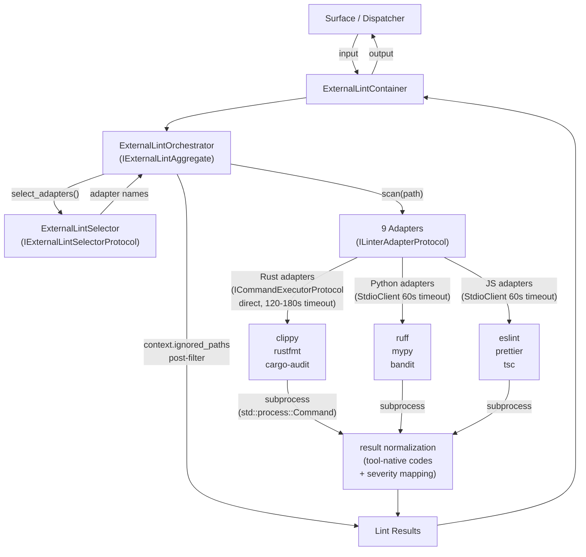

# FRD — external-lint (v1.12.0)

---

## System Overview

The external-lint crate is an aggregate bridge to external, industry-standard linters and formatters. It coordinates and executes Cargo Clippy, Rustfmt, cargo-audit, Ruff, Mypy, Bandit, ESLint, Prettier, and TSC on Rust, Python, and JS/TS files. It normalizes their JSON/text reports into the unified lint-arwaky violation format using **tool-native rule codes** (e.g., `clippy::needless_return`, `ruff::E501`) and integrates them into the compliance report.

The crate also provides **auto-fix** capabilities — each adapter exposes an `apply_fix` method that runs the tool's native fix command (e.g., `cargo clippy --fix`, `ruff check --fix`, `eslint --fix`).

All adapters execute **sequentially** (no threads, no async runtime). Each adapter runs its external tool as a subprocess, captures output, and normalizes results. The entry point is the DI container, which wires all adapters and exposes the aggregate trait.

### Architecture & Data Flow

---

## Functional Requirements

### FR-001: Detect Project Languages

- **Description**: Determine which languages (Rust, Python, JS/TS) are present in the project using a lightweight extension walk via the filesystem aggregate's `discover_files()`.
- **Input**: Filesystem aggregate reference.
- **Output**: Three booleans: `has_rust`, `has_python`, `has_js`.
- **Business Rules**:

  - Language detection based on file extension:
    - Rust: `.rs`
    - Python: `.py`
    - JS/TS: `.js`, `.jsx`, `.ts`, `.tsx`
  - Symlink behavior follows filesystem crate convention: follow if target is within workspace root, skip otherwise.
- **Edge Cases**:

  - Empty project → all booleans false, no adapters selected.
  - Unknown extensions → ignored.
- **Error Handling**: Filesystem crate handles walk errors internally. Returns partial detection results.

---

### FR-002: Select Adapters by Language

- **Description**: Based on detected languages, select the appropriate set of linter adapters to run.
- **Input**: Booleans `has_rust`, `has_python`, `has_js`.
- **Output**: Ordered list of adapter names.
- **Business Rules**:

  - Rust adapters: `clippy`, `rustfmt`, `cargo-audit`.
  - Python adapters: `ruff`, `mypy`, `bandit`.
  - JS/TS adapters: `eslint`, `prettier`, `tsc`.
  - Adapters are appended in language-group order (Rust → Python → JS).
  - Hardcoded defaults via `with_defaults()` constructor.
- **Edge Cases**:

  - No languages detected → empty adapter list, no scans run.
  - All languages detected → up to 9 adapters selected.
- **Error Handling**: No error; empty list for no matches.

---

### FR-003: Execute Scan Across Adapters

- **Description**: Run all selected adapters one after another in adapter-list order, aggregating results. The orchestrator optionally filters adapters by configuration entries and post-filters results by ignored paths.
- **Input**: Target path, optional context (config entries, ignored paths).
- **Output**: Aggregated lint results from all adapters.
- **Business Rules**:

  - Iterates the adapter list in order (Rust → Python → JS groups).
  - Each adapter receives the same target path.
  - Optionally filters adapter list by `context.config_entries` if present.
  - Results are collected into a single `Vec` as they arrive.
  - After collection, filters results against `context.ignored_paths` via the filesystem aggregate's `should_ignore()`.
  - No threads — execution is strictly sequential.
  - Each adapter's scan method invokes subprocess and normalizes output.
- **Edge Cases**:

  - All adapters return empty results → returns empty result list.
  - One adapter fails (panic or error) → remaining adapters still run, failure logged as warning.
  - Adapter binary not installed → warning printed, results for that adapter are empty ("No such file or directory" / "os error 2" detection).
  - Adapter timeout exceeded → error logged, other adapters continue.
- **Error Handling**: Per-adapter errors are caught at the loop boundary. Missing tool detection via OS error string matching. A failing adapter does not stop subsequent adapters.

---

### FR-004: Apply Auto-Fix via Adapters

- **Description**: Run an external linter tool's native fix command for a specific file, returning whether the fix succeeded.
- **Input**: Tool name, file path, fix argument (e.g., `--fix`, `--write`).
- **Output**: Compliance status indicating success or failure.
- **Business Rules**:

  - JS adapters resolve the working directory and absolute file path, then execute the tool via `js_apply_fix`.
  - Fix-capable adapters and their fix commands:
    - ESLint: `npx eslint <file> --fix`
    - Prettier: `npx prettier <file> --write`
    - Ruff: `ruff check <file> --fix --exit-zero`
    - Clippy: `cargo clippy --fix --allow-dirty --allow-staged`
    - Rustfmt: `cargo fmt` (without `--check`)
  - Non-fixing adapters (MyPy, Bandit, TSC, cargo-audit) return a no-op result.
- **Edge Cases**:

  - Fix command fails → returns failure status, does not crash.
  - Tool not installed → returns failure status.
- **Error Handling**: Subprocess failure mapped to adapter error. Caller decides next step.

---

### FR-005: Normalize External Tool Output

- **Description**: Each adapter normalizes its external tool's stdout/JSON output into `LintResult` structs compatible with the unified lint-arwaky format. Rule codes use **tool-native identifiers** (e.g., `clippy::needless_return`, `ruff::E501`).
- **Input**: Raw output from external linter subprocess (JSON or text).
- **Output**: Normalized lint results.
- **Business Rules**:

  - **Rule codes**: Use tool-native identifiers prefixed with tool name:
    - Clippy: `clippy::<lint_name>` (e.g., `clippy::needless_return`)
    - Rustfmt: `rustfmt::unformatted`
    - cargo-audit: `cargo-audit::<RUSTSEC-ID>` (e.g., `cargo-audit::RUSTSEC-2021-0124`)
    - Ruff: `ruff::<code>` (e.g., `ruff::E501`, `ruff::F401`)
    - Mypy: `mypy::<error-code>` (e.g., `mypy::arg-type`)
    - Bandit: `bandit::<test-id>` (e.g., `bandit::B101`)
    - ESLint: `eslint::<rule-id>` (e.g., `eslint::no-unused-vars`)
    - Prettier: `prettier::diff`
    - tsc: `tsc::<error-code>` (e.g., `tsc::TS2345`)
  - File paths are canonicalized to absolute paths.
  - Line numbers extracted from tool-specific JSON fields.
  - Severity mapping per tool (see table below).
- **Severity Mapping**:

  | Tool            | Tool Severity/Category          | lint-arwaky Severity |
  | ----------------- | --------------------------------- | ---------------------- |
  | **Clippy**      | `correctness`                   | CRITICAL             |
  |                 | `suspicious`                    | HIGH                 |
  |                 | `perf`                          | HIGH                 |
  |                 | `style`                         | MEDIUM               |
  |                 | `complexity`                    | MEDIUM               |
  |                 | `pedantic`                      | LOW                  |
  |                 | `nursery`                       | LOW                  |
  |                 | `restriction`                   | LOW                  |
  | **Rustfmt**     | diff found                      | MEDIUM               |
  | **cargo-audit** | `Critical`                      | CRITICAL             |
  |                 | `High`                          | HIGH                 |
  |                 | `Medium`                        | MEDIUM               |
  |                 | `Low` / `Unknown`               | LOW                  |
  | **Ruff**        | `E999` (syntax error)           | CRITICAL             |
  |                 | `S1xx` (security)               | CRITICAL             |
  |                 | `F8xx` (undefined name)         | HIGH                 |
  |                 | `B0xx` (bugbear)                | HIGH                 |
  |                 | `F401` (unused import)          | MEDIUM               |
  |                 | `E1xx` (indentation)            | LOW                  |
  |                 | `E5xx` (line length)            | LOW                  |
  |                 | `W2xx` (whitespace)             | LOW                  |
  |                 | default                         | MEDIUM               |
  | **Mypy**        | `error`                         | HIGH                 |
  |                 | `warning`                       | MEDIUM               |
  |                 | `note`                          | LOW                  |
  | **Bandit**      | HIGH confidence + HIGH severity | CRITICAL             |
  |                 | HIGH severity                   | HIGH                 |
  |                 | MEDIUM severity                 | MEDIUM               |
  |                 | LOW severity                    | LOW                  |
  | **ESLint**      | severity 2 (error)              | HIGH                 |
  |                 | severity 1 (warning)            | MEDIUM               |
  | **Prettier**    | diff found                      | MEDIUM               |
  | **tsc**         | error                           | HIGH                 |

  > Note: Ruff severity is determined by the rule **code**, not the tool's severity field.
- **Edge Cases**:

  - Tool produces invalid JSON → adapter returns empty results with error logged.
  - Tool output contains zero violations → empty result list (not an error).
  - File path in tool output is relative → canonicalized to absolute path.
  - Unknown tool severity/category → defaults to MEDIUM.
- **Error Handling**: Parse failures return empty results with warning. No crash on malformed output.

---

### FR-006: Execute Subprocess Commands

- **Description**: Run external linter tools as subprocesses with timeout, stdout/stderr capture, and error mapping.
- **Input**: Command args, working directory (optional), timeout, adapter name.
- **Output**: Subprocess result containing stdout, stderr, and return code.
- **Business Rules**:

  - Uses `std::process::Command` (blocking, thread-safe).
  - Sets `PYTHONUNBUFFERED=1` environment variable for all subprocesses.
  - Default timeout: 60 seconds per adapter for Python and JS tools.
  - Rust adapters (Clippy, Rustfmt, cargo-audit) bypass the standard executor and use the command executor directly with longer timeouts: 180s for Clippy, 120s for Rustfmt and cargo-audit.
  - Working directory set to the resolved project root for each adapter.
  - Timeout exceeded → process killed, error returned.
  - Command not found → error returned.
  - Working directory is optional — if `None`, adapter is skipped with warning.
- **Edge Cases**:

  - Subprocess hangs beyond timeout → process terminated.
  - Working directory doesn't exist → command fails with OS error.
- **Error Handling**: Missing binary mapped to "tool not found" warning. Timeout mapped to error. Other OS errors mapped to generic adapter failure. All errors are per-adapter.

---

### FR-007: Resolve JS Tool Paths

- **Description**: For JS/TS tools, prefer local `node_modules/.bin/` binaries over global installations.
- **Input**: Tool name, arguments, working directory.
- **Output**: Resolved command with full path.
- **Business Rules**:

  - Check `node_modules/.bin/<tool>` in working directory first.
  - If local binary exists, use its absolute path.
  - If not, fall back to global PATH resolution.
  - Working directory resolved by walking up to 10 parent directories looking for config files (`.eslintrc.*`, `prettier.config.*`, `tsconfig.json`, `package.json`).
  - Nearest config file wins.
- **Edge Cases**:

  - Local `node_modules/.bin/` doesn't exist → falls back to global.
  - Multiple config files in parent hierarchy → nearest one wins.
  - No config file found in 10 levels → use original working directory.
- **Error Handling**: Missing tools result in error at execution time.

---

### FR-008: Resolve Cargo Working Directory

- **Description**: For Rust tools (clippy, rustfmt, cargo-audit), find the directory containing `Cargo.toml` or `Cargo.lock`.
- **Input**: Target path.
- **Output**: Resolved working directory, or none if not found.
- **Business Rules**:

  - Walk up directory tree looking for `Cargo.toml` (for clippy/rustfmt) or `Cargo.lock` (for cargo-audit).
  - If found → return the directory.
  - If not found → return none. Caller skips adapter with warning.
- **Edge Cases**:

  - Monorepo with multiple `Cargo.toml` → nearest ancestor wins.
  - Path is a file → check parent directory first.
- **Error Handling**: None return causes caller to skip adapter with warning.

---

## API Contract

| Operation                     | Input                                     | Output                    | Purpose                                                                    |
| ------------------------------- | ------------------------------------------- | --------------------------- | ---------------------------------------------------------------------------- |
| Full external lint scan       | Target path, context                      | Lint results              | Select adapters, run all sequentially, filter by ignored paths            |
| Apply auto-fix                | Tool name, file path, fix arg              | Compliance status         | Run external tool's native fix command                                    |
| Detect project languages      | Filesystem aggregate                       | Language booleans         | Determine which languages are present                                     |
| Select adapters               | Language booleans                          | Adapter list              | Select adapters based on detected languages                               |
| Execute subprocess            | Command args, working directory, timeout   | Subprocess result         | Run external tool as subprocess with timeout and error mapping            |
| Resolve JS tool path          | Tool name, arguments, working dir          | Resolved command          | Resolve JS tool with local node_modules/.bin fallback                     |
| Resolve Cargo working dir     | Target path                                | Working directory or none | Find directory containing Cargo.toml, or skip adapter                     |

---

## Integration Points

- **Internal**:

  - Linter adapter protocol — interface for all linter adapters (scan + apply_fix).
  - External lint aggregate — aggregate trait for the dispatcher.
  - External lint selector protocol — adapter selection by language.
  - Command executor protocol — protocol for subprocess execution.
  - External lint executor protocol — executor with error mapping for Python/JS adapters.
- **External**:

  - **`filesystem` crate** — provides language detection via file extension walk, JS tool resolution, Cargo working directory resolution, and ignored-paths filtering.
  - `cargo clippy` — Rust idiom, performance, and style linting + auto-fix.
  - `rustfmt --check` / `cargo fmt` — Rust formatting verification + auto-fix.
  - `cargo audit --json` — Rust dependency vulnerability auditing.
  - `ruff check` — Python linting + auto-fix.
  - `mypy` — Python static type checking.
  - `bandit -r` — Python security vulnerability scanning.
  - `eslint` — JavaScript/TypeScript linting + auto-fix.
  - `prettier --check` / `prettier --write` — JavaScript/TypeScript formatting verification + auto-fix.
  - `tsc --noEmit` — TypeScript type checking.

---

## Non-functional Requirements

- **Performance**: All adapters run sequentially; total scan time is the sum of adapter times. Language detection is O(n) in file count.
- **Memory**: Each adapter's results are collected in Vec. JSON parsing loads full tool output into memory. No thread overhead.
- **Accuracy**: Severity mapping is tool-specific (see FR-005 table). Unknown tool severities default to MEDIUM. Tool-native rule codes preserve full diagnostic information.
- **Concurrency**: Sequential execution. No threads, no async runtime dependency.

---

## Test Scenarios / QA Checklist

### Language Detection & Adapter Selection

| # | Scenario                        | Expected                              | Rule       |
| --- | --------------------------------- | --------------------------------------- | ------------ |
| 1 | Rust-only project               | Only clippy, rustfmt, cargo-audit run | FR-001/002 |
| 2 | Python-only project             | Only ruff, mypy, bandit run           | FR-001/002 |
| 3 | JS-only project                 | Only eslint, prettier, tsc run        | FR-001/002 |
| 4 | Multi-language project          | All 9 adapters run                    | FR-001/002 |
| 5 | Empty directory                 | No adapters run, empty result list    | FR-001/002 |
| 6 | Single .rs file path            | Only Rust adapters run                | FR-001/002 |

### Adapter Execution

| # | Scenario                                      | Expected                                          | Rule   |
| --- | ----------------------------------------------- | --------------------------------------------------- | -------- |
| 1 | Adapter binary not installed                  | Warning printed, other adapters continue          | FR-003 |
| 2 | Adapter produces JSON output                  | Correctly parsed into LintResult                  | FR-005 |
| 3 | Adapter produces empty output                 | Empty result list                                 | FR-005 |
| 4 | All adapters fail                             | Returns empty result list with warnings           | FR-003 |
| 5 | One adapter fails                             | Other adapters still run                          | FR-003 |
| 6 | Timeout exceeded                              | Adapter returns error, others continue            | FR-006 |
| 7 | Sequential execution                         | Adapters run one after another                    | FR-003 |

### Auto-Fix

| # | Scenario                        | Expected                          | Rule   |
| --- | --------------------------------- | ----------------------------------- | -------- |
| 1 | ESLint fix                     | `eslint --fix` executed           | FR-004 |
| 2 | Prettier fix                   | `prettier --write` executed       | FR-004 |
| 3 | Ruff fix                       | `ruff check --fix` executed       | FR-004 |
| 4 | Clippy fix                     | `cargo clippy --fix` executed     | FR-004 |
| 5 | Rustfmt fix                    | `cargo fmt` executed              | FR-004 |
| 6 | TSC/MyPy/Bandit/audit fix      | No-op (no auto-fix capability)    | FR-004 |

### Normalization

| # | Scenario                           | Expected                                        | Rule   |
| --- | ------------------------------------ | ------------------------------------------------- | -------- |
| 1 | Clippy `correctness` lint          | Severity CRITICAL, code `clippy::<name>`        | FR-005 |
| 2 | Clippy `style` lint                | Severity MEDIUM                                 | FR-005 |
| 3 | Ruff `E501` (line too long)        | Severity LOW, code `ruff::E501`                 | FR-005 |
| 4 | Ruff `S105` (hardcoded password)   | Severity CRITICAL, code `ruff::S105`            | FR-005 |
| 5 | ESLint severity 2 (error)          | Severity HIGH, code `eslint::<rule>`            | FR-005 |
| 6 | cargo-audit critical vulnerability | Severity CRITICAL, code `cargo-audit::RUSTSEC-*`| FR-005 |
| 7 | Tool produces invalid JSON         | Empty results, warning logged                   | FR-005 |
| 8 | Relative file path in tool output  | Canonicalized to absolute path                  | FR-005 |

### Tool Path Resolution

| # | Scenario                             | Expected                                   | Rule   |
| --- | -------------------------------------- | -------------------------------------------- | -------- |
| 1 | JS tool found in node_modules/.bin   | Local binary used                          | FR-007 |
| 2 | JS tool not found locally            | Global PATH fallback used                  | FR-007 |
| 3 | JS tool not found anywhere           | Error at execution                         | FR-007 |
| 4 | Cargo.toml found in parent directory | Cargo tools use that directory             | FR-008 |
| 5 | No Cargo.toml in hierarchy           | Adapter skipped with warning               | FR-008 |

---

## Assumptions & Constraints

- External linter tools must be installed in the system PATH or in `node_modules/.bin/` for their respective adapters to produce results.
- Missing tools produce warnings, not errors — the scan continues with available adapters.
- Subprocess timeout defaults to 60 seconds for Python/JS adapters; Rust adapters use 120-180 seconds.
- The crate assumes the project root contains appropriate config files for each language's tools.
- JSON parsing of tool output is lenient; malformed output results in empty results rather than crashes.
- Language detection uses the filesystem crate's file extension walk.
- Execution is sequential (no threads). No async runtime dependency.
- Rule codes use tool-native identifiers. No new naming scheme is imposed.

---

## Glossary

| Term                   | Definition                                                                                              |
| ------------------------ | --------------------------------------------------------------------------------------------------------- |
| **AES**                | Agentic Engineering System — the 7-layer coding convention                                             |
| **Adapter**            | A wrapper around an external linter tool that normalizes its output to the unified LintResult format    |
| **Language Detection** | Lightweight filesystem scan to determine which programming languages are present                       |
| **Canonicalize**       | Resolve a relative file path to its absolute path                                                       |
| **Normalization**      | Convert tool-specific severity/message/line/code format to the unified LintResult format                |
| **Tool-native code**   | Rule identifier using the original tool's naming (e.g., `clippy::needless_return`, `ruff::E501`)         |
| **Subprocess**         | External process spawned via `std::process::Command` to run a linter tool                               |
| **Auto-fix**           | Running an external tool's native fix command to automatically correct violations                      |

---

## Reference

- PRD: [PRD.md](../../PRD.md)
- Architecture: [ARCHITECTURE.md](../../ARCHITECTURE.md)
