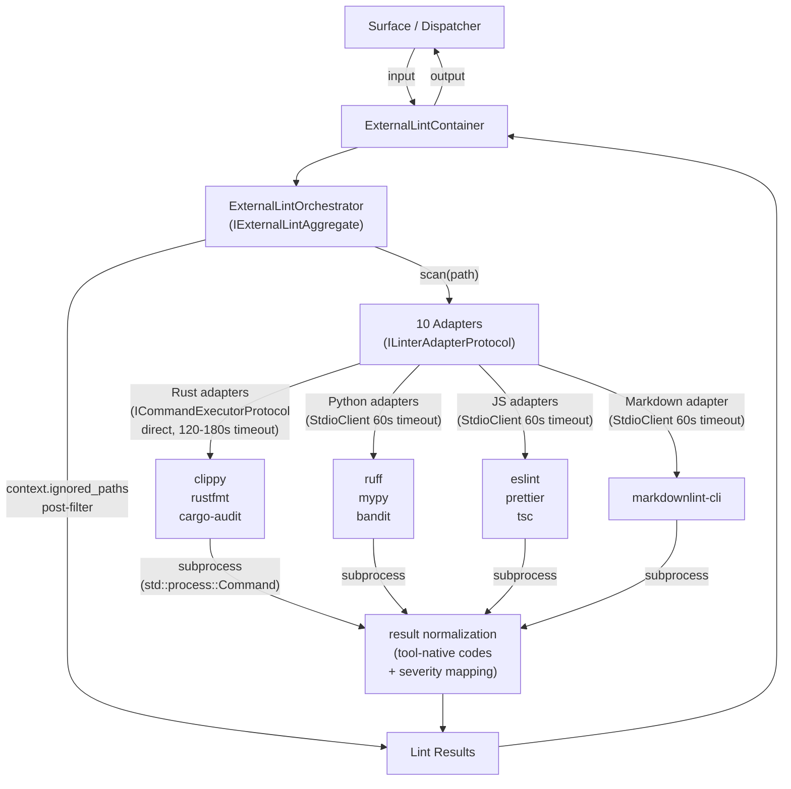

# FRD — external-lint (v1.14.0)

---

## Reference

- Backlog: [BACKLOG.md](BACKLOG.md) — real condition for this feature; this file is specification only.
- PRD: [PRD.md](../../PRD.md)
- Architecture: [ARCHITECTURE.md](../../ARCHITECTURE.md)

---

## System Overview

The external-lint crate is an aggregate bridge to external, industry-standard linters and formatters. It coordinates and executes Cargo Clippy, Rustfmt, cargo-audit, Ruff, Mypy, Bandit, ESLint, Prettier, TSC, and markdownlint-cli on Rust, Python, JS/TS, and Markdown files. It normalizes their JSON/text reports into the unified lint-arwaky violation format using **tool-native rule codes** (e.g., `clippy::needless_return`, `ruff::E501`, `markdownlint::MD041`) and integrates them into the compliance report.

The crate also provides **auto-fix** capabilities — each fix-capable adapter runs the tool's native fix command (e.g., `cargo clippy --fix`, `ruff check --fix`, `eslint --fix`). Non-fixing adapters (MyPy, Bandit, TSC, cargo-audit) return a no-op compliance status.

All adapters execute **sequentially** (no threads, no async runtime). Each adapter runs its external tool as a subprocess, captures output, and normalizes results. The entry point is the DI container, which wires all adapters and exposes the aggregate trait.

### Architecture & Data Flow

```mermaid
flowchart TD
    A["Surface / Dispatcher"] -->|input| B["ExternalLintContainer"]
    B --> C["ExternalLintOrchestrator\n(IExternalLintAggregate)"]

    C -->|"scan(path)"| D["10 Adapters\n(ILinterAdapterProtocol)"]
    C -->|"context.ignored_paths\npost-filter"| E["Lint Results"]

    D -->|"Rust adapters\n(ICommandExecutorProtocol\ndirect, 120-180s timeout)"| R["clippy\nrustfmt\ncargo-audit"]
    D -->|"Python adapters\n(StdioClient 60s timeout)"| P["ruff\nmypy\nbandit"]
    D -->|"JS adapters\n(StdioClient 60s timeout)"| J["eslint\nprettier\ntsc"]
    D -->|"Markdown adapter\n(StdioClient 60s timeout)"| M["markdownlint-cli"]

    R -->|"subprocess\n(std::process::Command)"| G["result normalization\n(tool-native codes\n+ severity mapping)"]
    P -->|"subprocess"| G
    J -->|"subprocess"| G
    M -->|"subprocess"| G

    G --> E
    E --> B
    B -->|output| A
```

---

## Functional Requirements

Each FR below maps to exactly one business capability. Language detection and adapter selection are internal orchestrator mechanics (not protocols). Utilities and infrastructure concerns are documented in the **Technical Utilities** section at the end of this file.

### FR-ExternalLint-001: Execute Scan Across Adapters

- **Description**: Run all selected adapters one after another in adapter-list order, aggregating results. The orchestrator selects adapters from its default language-group configuration (or a config-driven override) based on detected languages, then runs each adapter sequentially.
- **Input**: Target path, optional context (config entries, ignored paths, pre-computed language flags).
- **Output**: Aggregated lint results from all adapters.
- **Business Rules**:

  - Default adapter groups are selected based on detected languages:
    - Rust: `clippy`, `rustfmt`, `cargo-audit`
    - Python: `ruff`, `mypy`, `bandit`
    - JS/TS: `eslint`, `prettier`, `tsc`
    - Markdown: `markdownlint`
  - Language detection is performed via extension walk when context lacks pre-computed flags.
  - Optionally filters adapter list by `context.config_entries` if present.
  - Results are collected into a single `Vec` as they arrive.
  - After collection, filters results against `context.ignored_paths`.
  - No threads — execution is strictly sequential.
  - Each adapter's scan method invokes subprocess and normalizes output.
- **Edge Cases**:

  - All adapters return empty results → returns empty result list.
  - One adapter fails (panic or error) → remaining adapters still run, failure logged as warning.
  - Adapter binary not installed → warning printed, results for that adapter are empty.
  - Adapter timeout exceeded → error logged, other adapters continue.
- **Error Handling**: Per-adapter errors are caught at the loop boundary. A failing adapter does not stop subsequent adapters.

---

### FR-ExternalLint-002: Apply Auto-Fix via Adapters

- **Description**: Run an external linter tool's native fix command for a specific file, returning whether the fix succeeded.
- **Input**: Tool name, file path, fix argument (e.g., `--fix`, `--write`).
- **Output**: Compliance status indicating success or failure.
- **Business Rules**:

  - JS adapters resolve the working directory and absolute file path, then execute the tool.
  - Fix-capable adapters and their fix commands:
    - ESLint: `npx eslint <file> --fix`
    - Prettier: `npx prettier <file> --write`
    - Ruff: `ruff check <file> --fix --exit-zero`
    - Clippy: `cargo clippy --fix --allow-dirty --allow-staged`
    - Rustfmt: `cargo fmt` (without `--check`)
  - Non-fixing adapters (MyPy, Bandit, TSC, cargo-audit) return a no-op result.
- **Edge Cases**:

  - Fix command fails → returns failure status, does not crash.
  - Tool not installed → returns failure status.
- **Error Handling**: Subprocess failure mapped to adapter error. Caller decides next step.

---

### FR-ExternalLint-003: Normalize External Tool Output

- **Description**: Each adapter normalizes its external tool's stdout/JSON output into `LintResult` structs compatible with the unified lint-arwaky format. Rule codes use **tool-native identifiers** (e.g., `clippy::needless_return`, `ruff::E501`).
- **Input**: Raw output from external linter subprocess (JSON or text).
- **Output**: Normalized lint results.
- **Business Rules**:

  - **Rule codes**: Use tool-native identifiers prefixed with tool name:
    - Clippy: `clippy::<lint_name>` (e.g., `clippy::needless_return`)
    - Rustfmt: `rustfmt::unformatted`
    - cargo-audit: `cargo-audit::<RUSTSEC-ID>` (e.g., `cargo-audit::RUSTSEC-2021-0124`)
    - Ruff: `ruff::<code>` (e.g., `ruff::E501`, `ruff::F401`)
    - Mypy: `mypy::<error-code>` (e.g., `mypy::arg-type`)
    - Bandit: `bandit::<test-id>` (e.g., `bandit::B101`)
    - ESLint: `eslint::<rule-id>` (e.g., `eslint::no-unused-vars`)
    - Prettier: `prettier::diff`
    - tsc: `tsc::<error-code>` (e.g., `tsc::TS2345`)
    - markdownlint: `markdownlint::<MD-id>` (e.g., `markdownlint::MD041`)
  - File paths are canonicalized to absolute paths.
  - Line numbers extracted from tool-specific JSON fields.
  - Severity mapping per tool (see table below).
- **Severity Mapping**:

  | Tool            | Tool Severity/Category          | lint-arwaky Severity |
  | ----------------- | --------------------------------- | ---------------------- |
  | **Clippy**      | `correctness`                   | CRITICAL             |
  |                 | `suspicious`                    | HIGH                 |
  |                 | `perf`                          | HIGH                 |
  |                 | `style`                         | MEDIUM               |
  |                 | `complexity`                    | MEDIUM               |
  |                 | `pedantic`                      | LOW                  |
  |                 | `nursery`                       | LOW                  |
  |                 | `restriction`                   | LOW                  |
  | **Rustfmt**     | diff found                      | MEDIUM               |
  | **cargo-audit** | `Critical`                      | CRITICAL             |
  |                 | `High`                          | HIGH                 |
  |                 | `Medium`                        | MEDIUM               |
  |                 | `Low` / `Unknown`               | LOW                  |
  | **Ruff**        | `E999` (syntax error)           | CRITICAL             |
  |                 | `S*` (security, all S-codes)    | CRITICAL             |
  |                 | `F8xx` (undefined name)         | HIGH                 |
  |                 | `B0xx` (bugbear)                | HIGH                 |
  |                 | `F401` (unused import)          | MEDIUM               |
  |                 | `E1xx` (indentation)            | LOW                  |
  |                 | `E5xx` (line length)            | LOW                  |
  |                 | `W2xx` (whitespace)             | LOW                  |
  |                 | default                         | MEDIUM               |
  | **Mypy**        | `error`                         | HIGH                 |
  |                 | `warning`                       | MEDIUM               |
  |                 | `note`                          | LOW                  |
  |                 | `syntax`/`parse` error in message (beyond the table) | CRITICAL |
  | **Bandit**      | HIGH confidence + HIGH severity | CRITICAL             |
  |                 | HIGH severity                   | HIGH                 |
  |                 | MEDIUM severity                 | MEDIUM               |
  |                 | LOW severity                    | LOW                  |
  | **ESLint**      | severity 2 (error)              | HIGH                 |
  |                 | severity 1 (warning)            | MEDIUM               |
  | **Prettier**    | diff found                      | MEDIUM               |
  | **tsc**         | error                           | HIGH                 |
  | **markdownlint** | any rule violation             | MEDIUM               |

  > Note: Ruff severity is determined by the rule **code**, not the tool's severity field.
- **Edge Cases**:

  - Tool produces invalid JSON → adapter returns empty results with error logged.
  - Tool output contains zero violations → empty result list (not an error).
  - File path in tool output is relative → canonicalized to absolute path.
  - Unknown tool severity/category → defaults to MEDIUM.
  - Mypy extension: any error message containing `syntax` or `parse` is escalated to CRITICAL.
- **Error Handling**: Parse failures return empty results with warning. No crash on malformed output.

---

## API Contract

### Protocol API

| Method | Input | Output | Error | Event | Description |
|---|---|---|---|---|---|
| `scan` | &FilePath | `LintResultList` | `LinterOperationError` | — | Scan. |
| `apply_fix` | &FilePath | `ComplianceStatus` | `LinterOperationError` | — | Apply fix. |
| `execute_command` | PatternList, FilePath, Option<Timeout> | `anyhow::Result<ResponseData>` | — | — | Execute command. |
| `health_check` | — | `anyhow::Result<ResponseData>` | — | — | Health check. |
| `exec_cmd_scan` | Vec<String>, FilePath, f64, Option<AdapterName>, &FilePath | `ResponseData` | `LinterOperationError` | — | Exec cmd scan. |
| `exec_cmd_adapter` | Vec<String>, FilePath, f64, AdapterName | `ResponseData` | `LinterOperationError` | — | Exec cmd adapter. |
| `js_apply_fix` | &FilePath, &str, &str | `ComplianceStatus` | `LinterOperationError` | — | Js apply fix. |
| `scan_all` | &FilePath, &ExternalLintContext | `LintResultList` | — | — | Scan all (FR-001). |

### Aggregate API

| Method | Input | Output | Error | Event | Description |
|---|---|---|---|---|---|
| `execute` | ExternalLintRequest | `ExternalLintResponse` | — | — | Single composite entry point over the feature. |

## Integration Points

| System | Direction | Purpose | Failure mode |
| --- | --- | --- | --- |
| Linter adapter protocol | out (internal) | Define the shape every tool adapter implements for scanning and fixing | An adapter omits a required operation → it does not satisfy the protocol and is never selected |
| External lint aggregate | out (internal) | Expose the single composite entry point the surface calls | A request selects a language with no registered adapter → the response reports that no adapter is available for that language |
| Command executor protocol | out (internal) | Spawn the external tool and capture its output | The executable is missing from PATH → the adapter reports the tool as unavailable and the scan continues |
| `filesystem` aggregate | in | Detect languages, resolve tool working directories, and filter ignored paths | Tool resolution fails for a workspace member → that member is skipped, and the rest of the scan proceeds |
| `cargo clippy` | in | Lint Rust idiom, performance, and style, and apply its fixes | The tool exits non-zero on findings → the exit status is read as "findings present", not as a crash; a spawn failure is reported as an adapter error |
| `cargo fmt` / `rustfmt --check` | in | Verify or apply Rust formatting | Formatting diverges → `--check` reports the files to reformat; `--write` rewrites them |
| `cargo audit --json` | in | Audit Rust dependency vulnerabilities | The advisory database is unreachable → the audit reports that it could not run, never that no vulnerabilities exist |
| `ruff check` | in | Lint and fix Python code | The tool is not installed → the adapter reports it as unavailable and the Python slice is skipped |
| `mypy` | in | Type-check Python code | Type errors are found → each is mapped to the unified finding shape with the tool-native code preserved |
| `bandit -r` | in | Scan Python for security issues | The scan finds nothing → an empty result set, which is a pass rather than a skipped run |
| `eslint` | in | Lint and fix JavaScript and TypeScript | The tool is not installed → the adapter reports it as unavailable and the slice is skipped |
| `prettier --check` / `--write` | in | Verify or apply JavaScript and TypeScript formatting | Formatting diverges → `--check` lists the files; `--write` rewrites them |
| `tsc --noEmit` | in | Type-check TypeScript without emitting output | The compiler fails to start → the adapter reports the failure and the type-check slice is skipped |
| `markdownlint-cli --json` | in | Lint Markdown style and structure | The tool is not installed → the adapter reports it as unavailable and the Markdown slice is skipped |

## Non-functional Requirements

| Metric | Target | Measurement method |
| --- | --- | --- |
| Scan time | Total scan time is the sum of adapter times | Time each adapter separately and confirm the total matches the sum within measurement noise |
| Adapter memory | One result vector per adapter; JSON parsing loads one tool's full output at a time | Measure peak memory while running the adapter that produces the largest output |
| Severity mapping | Every tool severity maps to a known level; an unknown level defaults to MEDIUM | Feed one diagnostic per severity level per tool and assert the mapped level |
| Code preservation | The tool-native rule code is preserved verbatim in the normalized finding | Assert the original code appears unchanged in the formatted output for each adapter |
| Concurrency | Adapters run sequentially with no threads and no async runtime | Inspect the scan's thread count during a run and assert it stays at the caller level |
| Missing tool | A tool absent from PATH is reported as unavailable, and the scan continues | Run with one adapter's executable removed from PATH and assert the remaining adapters still complete |

## Test Scenarios / QA Checklist

- **Scan Execution** — e.g. Rust-only project → Only clippy, rustfmt, cargo-audit run
- **Adapter Execution** — e.g. Adapter binary not installed → Warning printed, other adapters continue
- **Auto-Fix** — e.g. ESLint fix → `eslint --fix` executed
- **Normalization** — e.g. Clippy `correctness` lint → Severity CRITICAL, code `clippy::<name>`

### Scan Execution

| # | Scenario | Expected |
| - | - | - |
| 1 | Rust-only project | Only clippy, rustfmt, cargo-audit run |
| 2 | Python-only project | Only ruff, mypy, bandit run |
| 3 | JS-only project | Only eslint, prettier, tsc run |
| 4 | Multi-language project | All 10 adapters run |
| 5 | Markdown-only project | Only markdownlint runs |
| 6 | Empty directory | No adapters run, empty result list |
| 7 | Single .rs file path | Only Rust adapters run |

### Adapter Execution

| # | Scenario | Expected |
| - | - | - |
| 1 | Adapter binary not installed | Warning printed, other adapters continue |
| 2 | Adapter produces JSON output | Correctly parsed into LintResult |
| 3 | Adapter produces empty output | Empty result list |
| 4 | All adapters fail | Returns empty result list with warnings |
| 5 | One adapter fails | Other adapters still run |
| 6 | Timeout exceeded | Adapter returns error, others continue |
| 7 | Sequential execution | Adapters run one after another |

### Auto-Fix

| # | Scenario | Expected |
| - | - | - |
| 1 | ESLint fix | `eslint --fix` executed |
| 2 | Prettier fix | `prettier --write` executed |
| 3 | Ruff fix | `ruff check --fix` executed |
| 4 | Clippy fix | `cargo clippy --fix` executed |
| 5 | Rustfmt fix | `cargo fmt` executed |
| 6 | TSC/MyPy/Bandit/audit fix | No-op (no auto-fix capability) |
| 7 | markdownlint fix | `markdownlint --fix` executed |

### Normalization

| # | Scenario | Expected |
| - | - | - |
| 1 | Clippy `correctness` lint | Severity CRITICAL, code `clippy::<name>` |
| 2 | Clippy `style` lint | Severity MEDIUM |
| 3 | Ruff `E501` (line too long) | Severity LOW, code `ruff::E501` |
| 4 | Ruff `S105` (hardcoded password) | Severity CRITICAL, code `ruff::S105` |
| 5 | ESLint severity 2 (error) | Severity HIGH, code `eslint::<rule>` |
| 6 | cargo-audit critical vulnerability | Severity CRITICAL, code `cargo-audit::RUSTSEC-*` |
| 7 | markdownlint `MD041` | Severity MEDIUM, code `markdownlint::MD041` |
| 8 | Tool produces invalid JSON | Empty results, warning logged |
| 9 | Relative file path in tool output | Canonicalized to absolute path |

---

### Technical Utilities

The following concerns are **utilities**, not business capabilities. They support the adapters and executor but do not represent independent business abilities of the system.

### Subprocess Execution

Executes external tool commands with timeout, stdout/stderr capture, and error mapping. Python and JS tools use a 60-second timeout; Rust tools use longer timeouts (180s for Clippy, 120s for Rustfmt and cargo-audit). Missing binaries are detected and reported as warnings, not hard errors.

### JS Tool Path Resolution

For JS/TS tools, resolves the command to prefer local `node_modules/.bin/<tool>` binaries over global PATH installations. Walks up parent directories looking for config files (`.eslintrc.*`, `prettier.config.*`, `tsconfig.json`, `package.json`) to determine the correct working directory.

### Cargo Working Directory Resolution

Finds the directory containing `Cargo.toml` (for clippy/rustfmt) or `Cargo.lock` (for cargo-audit) by walking up the directory tree from the target path. A missing manifest causes the adapter to skip with a warning rather than failing the entire scan.

---

## Assumptions & Constraints

- External linter tools must be installed in the system PATH or in `node_modules/.bin/` for their respective adapters to produce results.
- Missing tools produce warnings, not errors — the scan continues with available adapters.
- Subprocess timeout defaults to 60 seconds for Python/JS adapters; Rust adapters use 120-180 seconds.
- The crate assumes the project root contains appropriate config files for each language's tools.
- JSON parsing of tool output is lenient; malformed output results in empty results rather than crashes.
- Execution is sequential (no threads). No async runtime dependency.
- Rule codes use tool-native identifiers. No new naming scheme is imposed.

---

## Glossary

- **AES**: Agentic Engineering System — the 7-layer coding convention
- **Adapter**: A wrapper around an external linter tool that normalizes its output to the unified LintResult format
- **Canonicalize**: Resolve a relative file path to its absolute path
- **Normalization**: Convert tool-specific severity/message/line/code format to the unified LintResult format
- **Tool-native code**: Rule identifier using the original tool's naming (e.g., `clippy::needless_return`, `ruff::E501`)
- **Subprocess**: External process spawned via `std::process::Command` to run a linter tool
- **Auto-fix**: Running an external tool's native fix command to automatically correct violations
- **Utility**: A stateless, reusable technical helper (path resolution, subprocess execution). Not a business capability.

---
