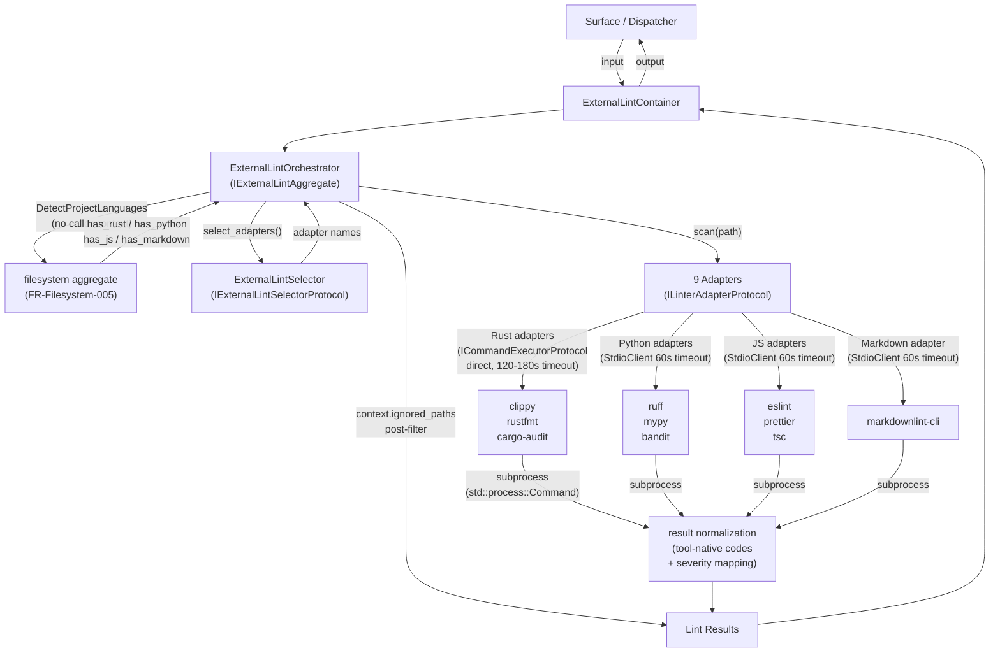

# FRD — external-lint (v1.14.0)

---

## Reference

- Backlog: [BACKLOG.md](BACKLOG.md) — real condition for this feature; this file is specification only.
- PRD: [PRD.md](../../PRD.md)
- Architecture: [ARCHITECTURE.md](../../ARCHITECTURE.md)

## System Overview

The external-lint crate is an aggregate bridge to external, industry-standard linters and formatters. It coordinates and executes Cargo Clippy, Rustfmt, cargo-audit, Ruff, Mypy, Bandit, ESLint, Prettier, TSC, and markdownlint-cli on Rust, Python, JS/TS, and Markdown files. It normalizes their JSON/text reports into the unified lint-arwaky violation format using **tool-native rule codes** (e.g., `clippy::needless_return`, `ruff::E501`, `markdownlint::MD041`) and integrates them into the compliance report.

The crate also provides **auto-fix** capabilities — each adapter exposes an `apply_fix` method that runs the tool's native fix command (e.g., `cargo clippy --fix`, `ruff check --fix`, `eslint --fix`).

All adapters execute **sequentially** (no threads, no async runtime). Each adapter runs its external tool as a subprocess, captures output, and normalizes results. The entry point is the DI container, which wires all adapters and exposes the aggregate trait.

The crate does **not** own language detection. Project-level language detection belongs to the `filesystem` aggregate, which serves it as `FilesystemRequest::DetectProjectLanguages` (see [crates/filesystem/FRD.md](../filesystem/FRD.md), FR-Filesystem-005). When a caller supplies no pre-computed context, the orchestrator asks the filesystem aggregate which language groups are present and uses the returned flags. It never walks the tree itself.

- **Architecture & Data Flow**

```mermaid
flowchart TD
    A["Surface / Dispatcher"] -->|input| B["ExternalLintContainer"]
    B --> C["ExternalLintOrchestrator\n(IExternalLintAggregate)"]

    C -->|"DetectProjectLanguages\n(no caller context)"| FS["filesystem aggregate\n(FR-Filesystem-005)"]
    FS -->|"has_rust / has_python\nhas_js / has_markdown"| C

    C -->|"select_adapters()"| D["ExternalLintSelector\n(IExternalLintSelectorProtocol)"]
    D -->|"adapter names"| C

    C -->|"scan(path)"| E["9 Adapters\n(ILinterAdapterProtocol)"]
    C -->|"context.ignored_paths\npost-filter"| F["Lint Results"]

    E -->|"Rust adapters\n(ICommandExecutorProtocol\ndirect, 120-180s timeout)"| R["clippy\nrustfmt\ncargo-audit"]
    E -->|"Python adapters\n(StdioClient 60s timeout)"| P["ruff\nmypy\nbandit"]
    E -->|"JS adapters\n(StdioClient 60s timeout)"| J["eslint\nprettier\ntsc"]
    E -->|"Markdown adapter\n(StdioClient 60s timeout)"| M["markdownlint-cli"]

    R -->|"subprocess\n(std::process::Command)"| G["result normalization\n(tool-native codes\n+ severity mapping)"]
    P -->|"subprocess"| G
    J -->|"subprocess"| G
    M -->|"subprocess"| G

    G --> F
    F --> B
    B -->|output| A
```

---

## Functional Requirements

### FR-ExternalLint-001: Select and Execute Adapters by Language

- **Description**: Based on the language flags for a project, select the appropriate set of linter adapters and run them in adapter-list order, aggregating the results. The orchestrator optionally filters adapters by configuration entries and post-filters results by ignored paths.
- **Input**: Target path, the booleans `has_rust`, `has_python`, `has_js`, `has_markdown`, and an optional context (config entries, ignored paths).
- **Output**: Ordered list of adapter names, and the aggregated lint results from all adapters.
- **Business Rules**:

  - Rust adapters: `clippy`, `rustfmt`, `cargo-audit`.
  - Python adapters: `ruff`, `mypy`, `bandit`.
  - JS/TS adapters: `eslint`, `prettier`, `tsc`.
  - Markdown adapters: `markdownlint`.
  - Adapters are appended in language-group order (Rust → Python → JS → Markdown).
  - Hardcoded defaults via `with_defaults()` constructor.
  - When no caller-supplied context is present, the language flags are requested from the `filesystem` aggregate via `DetectProjectLanguages`. This crate performs no extension walk of its own.
  - Iterates the adapter list in that order. Each adapter receives the same target path.
  - Optionally filters the adapter list by `context.config_entries` if present.
  - Results are collected into a single `Vec` as they arrive.
  - After collection, filters results against `context.ignored_paths` via the filesystem aggregate's `should_ignore()`.
  - No threads — execution is strictly sequential.
  - Each adapter's scan method invokes subprocess and normalizes output.
- **Edge Cases**:

  - No languages detected → empty adapter list, no scans run.
  - All languages detected → up to 10 adapters selected.
  - All adapters return empty results → returns empty result list.
  - One adapter fails (panic or error) → remaining adapters still run, failure logged as warning.
  - Adapter binary not installed → warning printed, results for that adapter are empty ("No such file or directory" / "os error 2" detection).
  - Adapter timeout exceeded → error logged, other adapters continue.
- **Error Handling**: No error on selection; empty list for no matches. Per-adapter errors are caught at the loop boundary. Missing tool detection via OS error string matching. A failing adapter does not stop subsequent adapters.

---

### FR-ExternalLint-002: Apply Auto-Fix via Adapters

- **Description**: Run an external linter tool's native fix command for a specific file, returning whether the fix succeeded.
- **Input**: Tool name, file path, fix argument (e.g., `--fix`, `--write`).
- **Output**: Compliance status indicating success or failure.
- **Business Rules**:

  - JS adapters resolve the working directory and absolute file path, then execute the tool via `js_apply_fix`.
  - Fix-capable adapters and their fix commands:
    - ESLint: `npx eslint <file> --fix`
    - Prettier: `npx prettier <file> --write`
    - Ruff: `ruff check <file> --fix --exit-zero`
    - Clippy: `cargo clippy --fix --allow-dirty --allow-staged`
    - Rustfmt: `cargo fmt` (without `--check`)
  - Non-fixing adapters (MyPy, Bandit, TSC, cargo-audit) return a no-op result.
- **Edge Cases**:

  - Fix command fails → returns failure status, does not crash.
  - Tool not installed → returns failure status.
- **Error Handling**: Subprocess failure mapped to adapter error. Caller decides next step.

---

### FR-ExternalLint-003: Normalize External Tool Output

- **Description**: Each adapter normalizes its external tool's stdout/JSON output into `LintResult` structs compatible with the unified lint-arwaky format. Rule codes use **tool-native identifiers** (e.g., `clippy::needless_return`, `ruff::E501`).
- **Input**: Raw output from external linter subprocess (JSON or text).
- **Output**: Normalized lint results.
- **Business Rules**:

  - **Rule codes**: Use tool-native identifiers prefixed with tool name:
    - Clippy: `clippy::<lint_name>` (e.g., `clippy::needless_return`)
    - Rustfmt: `rustfmt::unformatted`
    - cargo-audit: `cargo-audit::<RUSTSEC-ID>` (e.g., `cargo-audit::RUSTSEC-2021-0124`)
    - Ruff: `ruff::<code>` (e.g., `ruff::E501`, `ruff::F401`)
    - Mypy: `mypy::<error-code>` (e.g., `mypy::arg-type`)
    - Bandit: `bandit::<test-id>` (e.g., `bandit::B101`)
    - ESLint: `eslint::<rule-id>` (e.g., `eslint::no-unused-vars`)
    - Prettier: `prettier::diff`
    - tsc: `tsc::<error-code>` (e.g., `tsc::TS2345`)
    - markdownlint: `markdownlint::<MD-id>` (e.g., `markdownlint::MD041`)
  - File paths are canonicalized to absolute paths.
  - Line numbers extracted from tool-specific JSON fields.
  - Severity mapping per tool (see table below).
- **Severity Mapping**:

  | Tool            | Tool Severity/Category          | lint-arwaky Severity |
  | ----------------- | --------------------------------- | ---------------------- |
  | **Clippy**      | `correctness`                   | CRITICAL             |
  |                 | `suspicious`                    | HIGH                 |
  |                 | `perf`                          | HIGH                 |
  |                 | `style`                         | MEDIUM               |
  |                 | `complexity`                    | MEDIUM               |
  |                 | `pedantic`                      | LOW                  |
  |                 | `nursery`                       | LOW                  |
  |                 | `restriction`                   | LOW                  |
  | **Rustfmt**     | diff found                      | MEDIUM               |
  | **cargo-audit** | `Critical`                      | CRITICAL             |
  |                 | `High`                          | HIGH                 |
  |                 | `Medium`                        | MEDIUM               |
  |                 | `Low` / `Unknown`               | LOW                  |
  | **Ruff**        | `E999` (syntax error)           | CRITICAL             |
  |                 | `S*` (security, all S-codes)    | CRITICAL             |
  |                 | `F8xx` (undefined name)         | HIGH                 |
  |                 | `B0xx` (bugbear)                | HIGH                 |
  |                 | `F401` (unused import)          | MEDIUM               |
  |                 | `E1xx` (indentation)            | LOW                  |
  |                 | `E5xx` (line length)            | LOW                  |
  |                 | `W2xx` (whitespace)             | LOW                  |
  |                 | default                         | MEDIUM               |
  | **Mypy**        | `error`                         | HIGH                 |
  |                 | `warning`                       | MEDIUM               |
  |                 | `note`                          | LOW                  |
  |                 | `syntax`/`parse` error in message (beyond the table) | CRITICAL |
  | **Bandit**      | HIGH confidence + HIGH severity | CRITICAL             |
  |                 | HIGH severity                   | HIGH                 |
  |                 | MEDIUM severity                 | MEDIUM               |
  |                 | LOW severity                    | LOW                  |
  | **ESLint**      | severity 2 (error)              | HIGH                 |
  |                 | severity 1 (warning)            | MEDIUM               |
  | **Prettier**    | diff found                      | MEDIUM               |
  | **tsc**         | error                           | HIGH                 |
  | **markdownlint** | any rule violation             | MEDIUM               |

  > Note: Ruff severity is determined by the rule **code**, not the tool's severity field.
- **Edge Cases**:

  - Tool produces invalid JSON → adapter returns empty results with error logged.
  - Tool output contains zero violations → empty result list (not an error).
  - File path in tool output is relative → canonicalized to absolute path.
  - Unknown tool severity/category → defaults to MEDIUM.
  - Mypy extension: any error message containing `syntax` or `parse` is escalated to CRITICAL (a parse failure blocks all type checking), beyond the severity table above.
- **Error Handling**: Parse failures return empty results with warning. No crash on malformed output.

---

### FR-ExternalLint-004: Subprocess Execution

- **Description**: Spawn external linter tools as blocking subprocesses, capturing stdout/stderr, enforcing per-adapter timeouts, and mapping spawn/timeout errors.
- **Input**: Tool name, argument list, target path, and timeout in seconds.
- **Output**: Captured stdout/stderr text plus a completion status (ok, timed out, spawn failure).
- **Business Rules**:

  - Python/JS adapters run with a 60-second timeout.
  - Rust adapters (Clippy) run with a 180-second timeout.
  - Rust adapters (Rustfmt, cargo-audit) run with a 120-second timeout.
  - The environment variable `PYTHONUNBUFFERED=1` is set on all subprocesses.
  - A spawn failure or timeout is reported as an adapter error; the scan continues with the next adapter.
  - **No retry.** An adapter gets exactly one attempt per scan, for both spawn failures and timeouts, per the Integration resilience decision in `PRD.md`: a retried tool run executes against a different tool state and can mask the result the first run would have reported, so a skip-and-log is preferred over a second attempt. The contrasting multi-strategy fallback chain in `crates/git-hooks/FRD.md` is not an inconsistency — every strategy there queries the same trusted local repository, so a fallback still yields a correct file list, whereas no second strategy exists here that would yield a correct lint result.
  - **No overall budget.** Each ceiling applies to one adapter. They sum rather than cap, so a scan with every language present can run up to 180 + 120 + 120 + (7 × 60) ≈ 840 s (~14 minutes) before returning. Callers that need a bound — notably the MCP surface, which has no timeout of its own — must impose it themselves.
- **Edge Cases**:

  - Executable absent from PATH → the adapter is reported unavailable, scan continues.
  - Timeout exceeded → error logged, other adapters continue, no retry.
  - Every adapter present and slow → the call blocks for the summed worst case; no layer above interrupts it.
- **Error Handling**: Spawn and timeout errors are surfaced as `LinterOperationError`.

---

### FR-ExternalLint-005: JS Tool Path Resolution

- **Description**: Resolve the binary path for a JS/TS tool, preferring a local `node_modules/.bin/<tool>` installation over a global PATH lookup, and locate the working directory by walking up to 10 parent directories.
- **Input**: Tool name and a starting path.
- **Output**: Absolute path to the resolved binary and the working directory to run it from.
- **Business Rules**:

  1. Check `node_modules/.bin/<tool>` in the resolved working directory.
  2. If the local binary exists, use its absolute path.
  3. Otherwise fall back to global PATH resolution.
  4. Resolve the working directory by walking up to 10 parent directories looking for config files (`.eslintrc.*`, `prettier.config.*`, `tsconfig.json`, `package.json`).
- **Edge Cases**:

  - No local binary and no global PATH entry → tool is reported unavailable.
  - Working directory not found within 10 levels → the scan is skipped for that file.
- **Error Handling**: Resolution failures are reported as adapter errors; other adapters continue.

---

### FR-ExternalLint-006: Rust Working Directory Resolution

- **Description**: Find the directory containing `Cargo.toml` or `Cargo.lock` for Rust tool execution, walking up the directory tree.
- **Input**: Starting path.
- **Output**: Absolute path to the resolved cargo working directory, or none.
- **Business Rules**:

  1. Walk up the directory tree looking for `Cargo.toml` (for Clippy/Rustfmt) or `Cargo.lock` (for cargo-audit).
  2. Return the directory if found; the caller skips the adapter with a warning if not found.
  3. No directory is created or modified — resolution is read-only.
- **Edge Cases**:

  - No `Cargo.toml` or `Cargo.lock` anywhere in the parent chain → the adapter is skipped with a warning.
- **Error Handling**: Resolution failure is reported as an adapter error; other adapters continue.

---

## API Contract

### Protocol API

| Method | Input | Output | Error | Event | Description |
|---|---|---|---|---|---|
| `scan` | &FilePath | `LintResultList` | `LinterOperationError` | — | Scan. |
| `apply_fix` | &FilePath | `ComplianceStatus` | `LinterOperationError` | — | Apply fix. |
| `exec_cmd_scan` | Vec<String>, FilePath, f64, Option<AdapterName>, &FilePath | `ResponseData` | `LinterOperationError` | — | Exec cmd scan. |
| `exec_cmd_adapter` | Vec<String>, FilePath, f64, AdapterName | `ResponseData` | `LinterOperationError` | — | Exec cmd adapter. |
| `js_apply_fix` | &FilePath, &str, &str | `ComplianceStatus` | `LinterOperationError` | — | Js apply fix. |
| `select_adapters` | bool, bool, bool, bool | `AdapterNameList` | — | — | Select adapters. |

### Aggregate API

| Method | Input | Output | Error | Event | Description |
|---|---|---|---|---|---|
| `execute` | ExternalLintRequest | `ExternalLintResponse` | — | — | Single composite entry point over the feature. |

## Integration Points

| System | Direction | Purpose | Failure mode |
| --- | --- | --- | --- |
| Linter adapter protocol | out (internal) | Define the shape every tool adapter implements for scanning and fixing | An adapter omits a required operation → it does not satisfy the protocol and is never selected |
| External lint aggregate | out (internal) | Expose the single composite entry point the surface calls | A request selects a language with no registered adapter → the response reports that no adapter is available for that language |
| External lint selector protocol | out (internal) | Choose the adapter matching a file's language | A file's language maps to no adapter → the file is skipped and reported as uncovered |
| Command executor protocol | out (internal) | Spawn the external tool and capture its output | The executable is missing from PATH → the adapter reports the tool as unavailable and the scan continues |
| `filesystem` aggregate | in | Resolve which language groups are present (`DetectProjectLanguages`), resolve tool working directories, and filter ignored paths | Tool resolution fails for a workspace member → that member is skipped, and the rest of the scan proceeds |
| `cargo clippy` | in | Lint Rust idiom, performance, and style, and apply its fixes | The tool exits non-zero on findings → the exit status is read as "findings present", not as a crash; a spawn failure is reported as an adapter error |
| `cargo fmt` / `rustfmt --check` | in | Verify or apply Rust formatting | Formatting diverges → `--check` reports the files to reformat; `--write` rewrites them |
| `cargo audit --json` | in | Audit Rust dependency vulnerabilities | The advisory database is unreachable → the audit reports that it could not run, never that no vulnerabilities exist |
| `ruff check` | in | Lint and fix Python code | The tool is not installed → the adapter reports it as unavailable and the Python slice is skipped |
| `mypy` | in | Type-check Python code | Type errors are found → each is mapped to the unified finding shape with the tool-native code preserved |
| `bandit -r` | in | Scan Python for security issues | The scan finds nothing → an empty result set, which is a pass rather than a skipped run |
| `eslint` | in | Lint and fix JavaScript and TypeScript | The tool is not installed → the adapter reports it as unavailable and the slice is skipped |
| `prettier --check` / `--write` | in | Verify or apply JavaScript and TypeScript formatting | Formatting diverges → `--check` lists the files; `--write` rewrites them |
| `tsc --noEmit` | in | Type-check TypeScript without emitting output | The compiler fails to start → the adapter reports the failure and the type-check slice is skipped |
| `markdownlint-cli --json`, else `markdownlint-cli2 <glob>` | in | Lint Markdown style and structure | The tool is not installed → the adapter reports it as unavailable and the Markdown slice is skipped |

## Non-functional Requirements

| Metric | Target | Measurement method |
| --- | --- | --- |
| Scan time | Total scan time is the sum of adapter times plus the one delegated language query; the extension walk itself is O(file count) and owned by the filesystem aggregate | Time each adapter separately and confirm the total matches the sum within measurement noise |
| Language flags | One `FilesystemRequest::DetectProjectLanguages` per scan with no caller-supplied context; this crate performs no extension walk of its own | Count filesystem-aggregate calls per scan and confirm exactly one, and assert this crate contains no directory-walking code |
| Adapter memory | One result vector per adapter; JSON parsing loads one tool's full output at a time | Measure peak memory while running the adapter that produces the largest output |
| Severity mapping | Every tool severity maps to a known level; an unknown level defaults to MEDIUM | Feed one diagnostic per severity level per tool and assert the mapped level |
| Code preservation | The tool-native rule code is preserved verbatim in the normalized finding | Assert the original code appears unchanged in the formatted output for each adapter |
| Coverage | Every supported language is served by exactly one selected adapter | Scan a workspace containing all supported languages and assert no file is left uncovered |
| Concurrency | Adapters run sequentially with no threads and no async runtime | Inspect the scan's thread count during a run and assert it stays at the caller level |
| Worst-case adapter phase | Per-adapter ceilings sum with no overall budget: ~840 s (~14 minutes) with all 10 adapters present and each at its ceiling | Compute the sum of the configured ceilings for the selected adapter set and assert the documented bound; callers above this crate set their own timeout against it |
| Resilience posture | One attempt per adapter per scan; a timeout or spawn failure skips that adapter and logs, and never retries | Force a timeout in one adapter and assert exactly one spawn occurred and the remaining adapters still completed |
| Missing tool | A tool absent from PATH is reported as unavailable, and the scan continues | Run with one adapter's executable removed from PATH and assert the remaining adapters still complete |

## Test Scenarios

Each scenario is stated below as a table of cases: the input condition and the expected result.

- **SCEN-001 — Language Flags** — e.g. Rust-only project → the filesystem aggregate reports `has_rust = true`, and only clippy, rustfmt, cargo-audit run
- **SCEN-002 — Adapter Selection** — e.g. Multi-language project → All 10 adapters selected
- **SCEN-003 — Scan Execution** — e.g. One adapter fails → Other adapters still run
- **SCEN-004 — Auto-Fix** — e.g. ESLint fix → `eslint --fix` executed
- **SCEN-005 — Normalization** — e.g. Clippy `correctness` lint → Severity CRITICAL, code `clippy::<name>`

- **SCEN-001 — Language Flags**

Project-level language detection is owned by the `filesystem` aggregate (FR-Filesystem-005). This scenario verifies only that external-lint consumes the flags it receives and selects adapters accordingly.

| # | Scenario | Expected |
| - | - | - |
| 1 | Flags `has_rust = true`, rest false | Only clippy, rustfmt, cargo-audit run |
| 2 | Flags `has_python = true`, rest false | Only ruff, mypy, bandit run |
| 3 | Flags `has_js = true`, rest false | Only eslint, prettier, tsc run |
| 4 | All four flags true | All 10 adapters run |
| 5 | Flags `has_markdown = true`, rest false | Only markdownlint runs |
| 6 | All flags false | No adapters run, empty result list |
| 7 | No caller-supplied context | Exactly one `FilesystemRequest::DetectProjectLanguages` is issued to the filesystem aggregate |
| 8 | Single-file target `README.md` (flags derived from its extension) | Only markdownlint runs |

- **SCEN-002 — Adapter Selection**

| # | Scenario | Expected |
| - | - | - |
| 1 | No languages detected | Empty adapter list |
| 2 | All languages detected | 10 adapters selected |

- **SCEN-003 — Scan Execution**

| # | Scenario | Expected |
| - | - | - |
| 1 | Adapter binary not installed | Warning printed, other adapters continue |
| 2 | Adapter produces JSON output | Correctly parsed into LintResult |
| 3 | Adapter produces empty output | Empty result list |
| 4 | All adapters fail | Returns empty result list with warnings |
| 5 | One adapter fails | Other adapters still run |
| 6 | Timeout exceeded | Adapter returns error, others continue |
| 7 | Sequential execution | Adapters run one after another |

- **SCEN-004 — Auto-Fix**

| # | Scenario | Expected |
| - | - | - |
| 1 | ESLint fix | `eslint --fix` executed |
| 2 | Prettier fix | `prettier --write` executed |
| 3 | Ruff fix | `ruff check --fix` executed |
| 4 | Clippy fix | `cargo clippy --fix` executed |
| 5 | Rustfmt fix | `cargo fmt` executed |
| 6 | TSC/MyPy/Bandit/audit fix | No-op (no auto-fix capability) |
| 7 | markdownlint fix | `<target> --fix` executed against the first resolvable CLI variant (`markdownlint-cli`, then `markdownlint-cli2`) |
| 8 | No markdownlint CLI installed | No-op status, no command spawned |

- **SCEN-005 — Normalization**

| # | Scenario | Expected |
| - | - | - |
| 1 | Clippy `correctness` lint | Severity CRITICAL, code `clippy::<name>` |
| 2 | Clippy `style` lint | Severity MEDIUM |
| 3 | Ruff `E501` (line too long) | Severity LOW, code `ruff::E501` |
| 4 | Ruff `S105` (hardcoded password) | Severity CRITICAL, code `ruff::S105` |
| 5 | ESLint severity 2 (error) | Severity HIGH, code `eslint::<rule>` |
| 6 | cargo-audit critical vulnerability | Severity CRITICAL, code `cargo-audit::RUSTSEC-*` |
| 7 | markdownlint `MD041` | Severity MEDIUM, code `markdownlint::MD041` |
| 8 | Tool produces invalid JSON | Empty results, warning logged |
| 9 | Relative file path in tool output | Canonicalized to absolute path |

---

## Assumptions & Constraints

- External linter tools must be installed in the system PATH or in `node_modules/.bin/` for their respective adapters to produce results.
- Missing tools produce warnings, not errors — the scan continues with available adapters.
- Subprocess timeout defaults to 60 seconds for Python/JS adapters; Rust adapters use 120-180 seconds.
- The crate assumes the project root contains appropriate config files for each language's tools.
- JSON parsing of tool output is lenient; malformed output results in empty results rather than crashes.
- Language detection is delegated to the filesystem aggregate's `DetectProjectLanguages` request; this crate performs no extension walk.
- Execution is sequential (no threads). No async runtime dependency.
- Rule codes use tool-native identifiers. No new naming scheme is imposed.

---

## Glossary

- **AES**: Agentic Engineering System — the 7-layer coding convention
- **Adapter**: A wrapper around an external linter tool that normalizes its output to the unified LintResult format
- **Language Detection**: Lightweight filesystem scan to determine which programming languages are present
- **Canonicalize**: Resolve a relative file path to its absolute path
- **Normalization**: Convert tool-specific severity/message/line/code format to the unified LintResult format
- **Tool-native code**: Rule identifier using the original tool's naming (e.g., `clippy::needless_return`, `ruff::E501`)
- **Subprocess**: External process spawned via `std::process::Command` to run a linter tool
- **Auto-fix**: Running an external tool's native fix command to automatically correct violations
- **Utility**: A stateless, reusable technical function (e.g., subprocess execution, path resolution) that capabilities depend on but is not itself a business capability

---
