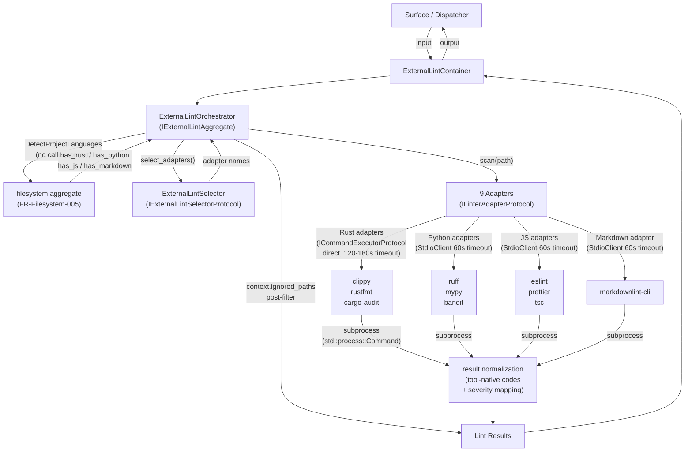

# FRD — external-lint (v1.14.0)

---

## Feature Overview

The external-lint crate is an aggregate bridge to external, industry-standard linters and formatters. It coordinates and executes Cargo Clippy, Rustfmt, cargo-audit, Ruff, Mypy, Bandit, ESLint, Prettier, TSC, and markdownlint-cli on Rust, Python, JS/TS, and Markdown files. It normalizes their JSON/text reports into the unified lint-arwaky violation format using **tool-native rule codes** (e.g., `clippy::needless_return`, `ruff::E501`, `markdownlint::MD041`) and integrates them into the compliance report.

The crate also provides **auto-fix** capabilities — each adapter exposes an `apply_fix` method that runs the tool's native fix command (e.g., `cargo clippy --fix`, `ruff check --fix`, `eslint --fix`).

All adapters execute **sequentially** (no threads, no async runtime). Each adapter runs its external tool as a subprocess, captures output, and normalizes results. The entry point is the DI container, which wires all adapters and exposes the aggregate trait.

The crate does **not** own language detection. Project-level language detection belongs to the `filesystem` aggregate, which serves it as `FilesystemRequest::DetectProjectLanguages` (see [crates/filesystem/FRD.md](../filesystem/FRD.md), FR-Filesystem-005). When a caller supplies no pre-computed context, the orchestrator asks the filesystem aggregate which language groups are present and uses the returned flags. It never walks the tree itself.

- **Architecture & Data Flow**

```mermaid
flowchart TD
    A["Surface / Dispatcher"] -->|input| B["ExternalLintContainer"]
    B --> C["ExternalLintOrchestrator\n(IExternalLintAggregate)"]

    C -->|"DetectProjectLanguages\n(no caller context)"| FS["filesystem aggregate\n(FR-Filesystem-005)"]
    FS -->|"has_rust / has_python\nhas_js / has_markdown"| C

    C -->|"select_adapters()"| D["ExternalLintSelector\n(IExternalLintSelectorProtocol)"]
    D -->|"adapter names"| C

    C -->|"scan(path)"| E["9 Adapters\n(ILinterAdapterProtocol)"]
    C -->|"context.ignored_paths\npost-filter"| F["Lint Results"]

    E -->|"Rust adapters\n(ICommandExecutorProtocol\ndirect, 120-180s timeout)"| R["clippy\nrustfmt\ncargo-audit"]
    E -->|"Python adapters\n(StdioClient 60s timeout)"| P["ruff\nmypy\nbandit"]
    E -->|"JS adapters\n(StdioClient 60s timeout)"| J["eslint\nprettier\ntsc"]
    E -->|"Markdown adapter\n(StdioClient 60s timeout)"| M["markdownlint-cli"]

    R -->|"subprocess\n(std::process::Command)"| G["result normalization\n(tool-native codes\n+ severity mapping)"]
    P -->|"subprocess"| G
    J -->|"subprocess"| G
    M -->|"subprocess"| G

    G --> F
    F --> B
    B -->|output| A
```

---

## Functional Requirements

### FR-ExternalLint-001: Select and Execute Adapters by Language

- **Description**: Based on the language flags for a project, select the appropriate set of linter adapters and run them in adapter-list order, aggregating the results. The orchestrator optionally filters adapters by configuration entries and post-filters results by ignored paths.
- **Input**: Target path, the booleans `has_rust`, `has_python`, `has_js`, `has_markdown`, and an optional context (config entries, ignored paths).
- **Output**: Ordered list of adapter names, and the aggregated lint results from all adapters.
- **Business Rules**:

  - Rust adapters: `clippy`, `rustfmt`, `cargo-audit`.
  - Python adapters: `ruff`, `mypy`, `bandit`.
  - JS/TS adapters: `eslint`, `prettier`, `tsc`.
  - Markdown adapters: `markdownlint`.
  - Adapters are appended in language-group order (Rust → Python → JS → Markdown).
  - Hardcoded defaults via `with_defaults()` constructor.
  - When no caller-supplied context is present, the language flags are requested from the `filesystem` aggregate via `DetectProjectLanguages`. This crate performs no extension walk of its own.
  - Iterates the adapter list in that order. Each adapter receives the same target path.
  - Optionally filters the adapter list by `context.config_entries` if present.
  - Results are collected into a single `Vec` as they arrive.
  - After collection, filters results against `context.ignored_paths` via the filesystem aggregate's `should_ignore()`.
  - No threads — execution is strictly sequential.
  - Each adapter's scan method invokes subprocess and normalizes output.
- **Edge Cases**:

  - No languages detected → empty adapter list, no scans run.
  - All languages detected → up to 10 adapters selected.
  - All adapters return empty results → returns empty result list.
  - One adapter fails (panic or error) → remaining adapters still run, failure logged as warning.
  - Adapter binary not installed → warning printed, results for that adapter are empty ("No such file or directory" / "os error 2" detection).
  - Adapter timeout exceeded → error logged, other adapters continue.
- **Error Handling**: No error on selection; empty list for no matches. Per-adapter errors are caught at the loop boundary. Missing tool detection via OS error string matching. A failing adapter does not stop subsequent adapters.

---

### FR-ExternalLint-002: Apply Auto-Fix via Adapters

- **Description**: Run an external linter tool's native fix command for a specific file, returning whether the fix succeeded.
- **Input**: Tool name, file path, fix argument (e.g., `--fix`, `--write`).
- **Output**: Compliance status indicating success or failure.
- **Business Rules**:

  - JS adapters resolve the working directory and absolute file path, then execute the tool via `js_apply_fix`.
  - Fix-capable adapters and their fix commands:
    - ESLint: `npx eslint <file> --fix`
    - Prettier: `npx prettier <file> --write`
    - Ruff: `ruff check <file> --fix --exit-zero`
    - Clippy: `cargo clippy --fix --allow-dirty --allow-staged`
    - Rustfmt: `cargo fmt` (without `--check`)
  - Non-fixing adapters (MyPy, Bandit, TSC, cargo-audit) return a no-op result.
- **Edge Cases**:

  - Fix command fails → returns failure status, does not crash.
  - Tool not installed → returns failure status.
- **Error Handling**: Subprocess failure mapped to adapter error. Caller decides next step.

---

### FR-ExternalLint-003: Normalize External Tool Output

- **Description**: Each adapter normalizes its external tool's stdout/JSON output into `LintResult` structs compatible with the unified lint-arwaky format. Rule codes use **tool-native identifiers** (e.g., `clippy::needless_return`, `ruff::E501`).
- **Input**: Raw output from external linter subprocess (JSON or text).
- **Output**: Normalized lint results.
- **Business Rules**:

  - **Rule codes**: Use tool-native identifiers prefixed with tool name:
    - Clippy: `clippy::<lint_name>` (e.g., `clippy::needless_return`)
    - Rustfmt: `rustfmt::unformatted`
    - cargo-audit: `cargo-audit::<RUSTSEC-ID>` (e.g., `cargo-audit::RUSTSEC-2021-0124`)
    - Ruff: `ruff::<code>` (e.g., `ruff::E501`, `ruff::F401`)
    - Mypy: `mypy::<error-code>` (e.g., `mypy::arg-type`)
    - Bandit: `bandit::<test-id>` (e.g., `bandit::B101`)
    - ESLint: `eslint::<rule-id>` (e.g., `eslint::no-unused-vars`)
    - Prettier: `prettier::diff`
    - tsc: `tsc::<error-code>` (e.g., `tsc::TS2345`)
    - markdownlint: `markdownlint::<MD-id>` (e.g., `markdownlint::MD041`)
  - File paths are canonicalized to absolute paths.
  - Line numbers extracted from tool-specific JSON fields.
  - Severity mapping per tool (see table below).
- **Severity Mapping**:

  | Tool            | Tool Severity/Category          | lint-arwaky Severity |
  | ----------------- | --------------------------------- | ---------------------- |
  | **Clippy**      | `correctness`                   | CRITICAL             |
  |                 | `suspicious`                    | HIGH                 |
  |                 | `perf`                          | HIGH                 |
  |                 | `style`                         | MEDIUM               |
  |                 | `complexity`                    | MEDIUM               |
  |                 | `pedantic`                      | LOW                  |
  |                 | `nursery`                       | LOW                  |
  |                 | `restriction`                   | LOW                  |
  | **Rustfmt**     | diff found                      | MEDIUM               |
  | **cargo-audit** | `Critical`                      | CRITICAL             |
  |                 | `High`                          | HIGH                 |
  |                 | `Medium`                        | MEDIUM               |
  |                 | `Low` / `Unknown`               | LOW                  |
  | **Ruff**        | `E999` (syntax error)           | CRITICAL             |
  |                 | `S*` (security, all S-codes)    | CRITICAL             |
  |                 | `F8xx` (undefined name)         | HIGH                 |
  |                 | `B0xx` (bugbear)                | HIGH                 |
  |                 | `F401` (unused import)          | MEDIUM               |
  |                 | `E1xx` (indentation)            | LOW                  |
  |                 | `E5xx` (line length)            | LOW                  |
  |                 | `W2xx` (whitespace)             | LOW                  |
  |                 | default                         | MEDIUM               |
  | **Mypy**        | `error`                         | HIGH                 |
  |                 | `warning`                       | MEDIUM               |
  |                 | `note`                          | LOW                  |
  |                 | `syntax`/`parse` error in message (beyond the table) | CRITICAL |
  | **Bandit**      | HIGH confidence + HIGH severity | CRITICAL             |
  |                 | HIGH severity                   | HIGH                 |
  |                 | MEDIUM severity                 | MEDIUM               |
  |                 | LOW severity                    | LOW                  |
  | **ESLint**      | severity 2 (error)              | HIGH                 |
  |                 | severity 1 (warning)            | MEDIUM               |
  | **Prettier**    | diff found                      | MEDIUM               |
  | **tsc**         | error                           | HIGH                 |
  | **markdownlint** | any rule violation             | MEDIUM               |

  > Note: Ruff severity is determined by the rule **code**, not the tool's severity field.
- **Edge Cases**:

  - Tool produces invalid JSON → adapter returns empty results with error logged.
  - Tool output contains zero violations → empty result list (not an error).
  - File path in tool output is relative → canonicalized to absolute path.
  - Unknown tool severity/category → defaults to MEDIUM.
  - Mypy extension: any error message containing `syntax` or `parse` is escalated to CRITICAL (a parse failure blocks all type checking), beyond the severity table above.
- **Error Handling**: Parse failures return empty results with warning. No crash on malformed output.

---

### FR-ExternalLint-004: Subprocess Execution

- **Description**: Spawn external linter tools as blocking subprocesses, capturing stdout/stderr, enforcing per-adapter timeouts, and mapping spawn/timeout errors.
- **Input**: Tool name, argument list, target path, and timeout in seconds.
- **Output**: Captured stdout/stderr text plus a completion status (ok, timed out, spawn failure).
- **Business Rules**:

  - Python/JS adapters run with a 60-second timeout.
  - Rust adapters (Clippy) run with a 180-second timeout.
  - Rust adapters (Rustfmt, cargo-audit) run with a 120-second timeout.
  - The environment variable `PYTHONUNBUFFERED=1` is set on all subprocesses.
  - A spawn failure or timeout is reported as an adapter error; the scan continues with the next adapter.
  - **No retry.** An adapter gets exactly one attempt per scan, for both spawn failures and timeouts, per the Integration resilience decision in `PRD.md`: a retried tool run executes against a different tool state and can mask the result the first run would have reported, so a skip-and-log is preferred over a second attempt. The contrasting multi-strategy fallback chain in `crates/git-hooks/FRD.md` is not an inconsistency — every strategy there queries the same trusted local repository, so a fallback still yields a correct file list, whereas no second strategy exists here that would yield a correct lint result.
  - **No overall budget.** Each ceiling applies to one adapter. They sum rather than cap, so a scan with every language present can run up to 180 + 120 + 120 + (7 × 60) ≈ 840 s (~14 minutes) before returning. Callers that need a bound — notably the MCP surface, which has no timeout of its own — must impose it themselves.
- **Edge Cases**:

  - Executable absent from PATH → the adapter is reported unavailable, scan continues.
  - Timeout exceeded → error logged, other adapters continue, no retry.
  - Every adapter present and slow → the call blocks for the summed worst case; no layer above interrupts it.
- **Error Handling**: Spawn and timeout errors are surfaced as `LinterOperationError`.

---

### FR-ExternalLint-005: JS Tool Path Resolution

- **Description**: Resolve the binary path for a JS/TS tool, preferring a local `node_modules/.bin/<tool>` installation over a global PATH lookup, and locate the working directory by walking up to 10 parent directories.
- **Input**: Tool name and a starting path.
- **Output**: Absolute path to the resolved binary and the working directory to run it from.
- **Business Rules**:

  1. Check `node_modules/.bin/<tool>` in the resolved working directory.
  2. If the local binary exists, use its absolute path.
  3. Otherwise fall back to global PATH resolution.
  4. Resolve the working directory by walking up to 10 parent directories looking for config files (`.eslintrc.*`, `prettier.config.*`, `tsconfig.json`, `package.json`).
- **Edge Cases**:

  - No local binary and no global PATH entry → tool is reported unavailable.
  - Working directory not found within 10 levels → the scan is skipped for that file.
- **Error Handling**: Resolution failures are reported as adapter errors; other adapters continue.

---

### FR-ExternalLint-006: Rust Working Directory Resolution

- **Description**: Find the directory containing `Cargo.toml` or `Cargo.lock` for Rust tool execution, walking up the directory tree.
- **Input**: Starting path.
- **Output**: Absolute path to the resolved cargo working directory, or none.
- **Business Rules**:

  1. Walk up the directory tree looking for `Cargo.toml` (for Clippy/Rustfmt) or `Cargo.lock` (for cargo-audit).
  2. Return the directory if found; the caller skips the adapter with a warning if not found.
  3. No directory is created or modified — resolution is read-only.
- **Edge Cases**:

  - No `Cargo.toml` or `Cargo.lock` anywhere in the parent chain → the adapter is skipped with a warning.
- **Error Handling**: Resolution failure is reported as an adapter error; other adapters continue.

---

## Public Interface

### Protocol API

| Method | Input | Output | Error | Event | Description |
|---|---|---|---|---|---|
| `scan` | &FilePath | `LintResultList` | `LinterOperationError` | — | Scan. |
| `fix` | &FilePath | `ComplianceStatus` | `LinterOperationError` | — | Apply fix. |
| `exec_cmd_scan` | Vec<String>, FilePath, f64, Option<AdapterName>, &FilePath | `ResponseData` | `LinterOperationError` | — | Exec cmd scan. |
| `exec_cmd_adapter` | Vec<String>, FilePath, f64, AdapterName | `ResponseData` | `LinterOperationError` | — | Exec cmd adapter. |
| `js_apply_fix` | &FilePath, &str, &str | `ComplianceStatus` | `LinterOperationError` | — | Js apply fix. |
| `select_adapters` | bool, bool, bool, bool | `AdapterNameList` | — | — | Select adapters. |

### Aggregate API

| Method | Input | Output | Error | Event | Description |
|---|---|---|---|---|---|
| `execute` | ExternalLintRequest | `ExternalLintResponse` | — | — | Single composite entry point over the feature. |

## Reference

- Backlog: [BACKLOG.md](BACKLOG.md) — real condition for this feature; this file is specification only.
- PRD: [PRD.md](../../PRD.md)
- Architecture: [ARCHITECTURE.md](../../ARCHITECTURE.md)

| Roadmap | {Link to ROADMAP.md} | [{link}](ROADMAP.md) |
