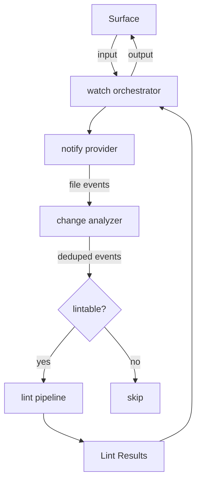

# FRD — file-watch (v1.11.0)

## System Overview

The file-watch crate provides a filesystem monitoring system that detects file changes in real time and re-triggers analysis via an injected `ICodeAnalysisAggregate`. It uses the `notify` crate (inotify on Linux) with `notify-debouncer-mini` to debounce rapid changes and avoid redundant processing.

### Architecture & Data Flow

## Functional Requirements

### FR-001: Start Filesystem Watcher

- **Description**: Initialize a debounced filesystem watcher on a target path using the `notify` crate.
- **Input**: Watch configuration containing path (string), debounce interval in milliseconds (u64), recursive flag (bool), and ignore patterns (list of strings).
- **Output**: Result — Ok on successful start, Err with descriptive message if path doesn't exist or debouncer creation fails.
- **Business Rules**:
  - Path must exist on disk; return error if path does not exist.
  - Debounce interval is configurable (default 200ms via `notify-debouncer-mini`).
  - Recursive mode controlled by the recursive flag in configuration.
  - Ignore patterns are matched via substring containment against event paths.
- **Edge Cases**:
  - Path is a file (not a directory) — still watch the file.
  - Debouncer creation fails — return error before starting.
  - Poisoned mutex (watcher lock) — recover via lock recovery.
- **Error Handling**: Returns an error with descriptive message for: path not found, debouncer creation failure, watch path failure.

### FR-002: Receive and Broadcast File Change Events

- **Description**: Receive debounced filesystem events, filter by ignore patterns, and broadcast file change events to all subscribers.
- **Input**: Raw debounced event from the `notify-debouncer-mini` callback.
- **Output**: File change event broadcast via a tokio broadcast channel (capacity 256).
- **Business Rules**:
  - Only "Any" kind events are forwarded.
  - Events matching any ignore pattern substring are skipped.
  - Each event is tagged as a modification event.
- **Edge Cases**:
  - Broadcast channel full (receivers lagging) — events silently dropped.
  - Multiple subscribers — each receives independent copies via subscription.
- **Error Handling**: No error returned; dropped events are non-fatal.

### FR-003: Filter Lintable Files

- **Description**: Determine whether a file path is lintable based on its extension.
- **Input**: File path string.
- **Output**: Boolean — true if the file has a lintable extension.
- **Business Rules**:
  - Supported extensions: `.rs`, `.py`, `.js`, `.ts`, `.tsx`, `.jsx`, `.mjs`, `.cjs`, `.json`, `.css`, `.md`, `.toml`, `.yaml`, `.yml`.
  - Extension matching is suffix-based (no case normalization).
- **Edge Cases**:
  - File with no extension — not lintable.
  - File with multiple dots (e.g., `file.test.ts`) — matches on the final extension.
  - Hidden files (e.g., `.gitignore`) — not lintable (no matching extension).
- **Error Handling**: Returns false for non-lintable paths; no error thrown.

### FR-004: Deduplicate Watch Events

- **Description**: Deduplicate a batch of watch events by file path, keeping only the latest event per file.
- **Input**: List of file change events.
- **Output**: List of file change events with unique paths.
- **Business Rules**:
  - Deduplication key is the file path string.
  - When duplicate paths exist, last-inserted event wins (hash map insert semantics).
  - Order of output is not guaranteed to match input order.
- **Edge Cases**:
  - Empty input — returns empty list.
  - All events for same path — returns single event.
- **Error Handling**: No error paths; pure in-memory operation.

### FR-005: Run Lint on Changed Files

- **Description**: On each detected file change, run the full code analysis pipeline on the changed file and report violations and score.
- **Input**: File change event with file path.
- **Output**: Printed output: `[change] <path> | <count> violations, score <score>`.
- **Business Rules**:
  - Only lintable files (per FR-003) trigger a lint run.
  - Score is calculated via the code analysis aggregate's score calculation method.
  - Initial full lint runs on startup before watching begins.
- **Edge Cases**:
  - File deleted between event and lint run — lint handles missing files gracefully.
  - Broadcast channel closed — break event loop.
  - Broadcast lagged (events missed) — continue without processing missed events.
- **Error Handling**: Lint failures are non-fatal; event loop continues.

### FR-006: Graceful Shutdown

- **Description**: Stop the watcher and event loop on Ctrl+C signal.
- **Input**: Atomic running flag (set to false by `ctrlc` handler in the CLI surface).
- **Output**: Watcher stopped, success exit code returned.
- **Business Rules**:
  - Ctrl+C sets running flag to false via atomic boolean.
  - Event loop checks running flag on every iteration.
  - Provider stop is called to clean up the debouncer.
- **Edge Cases**:
  - Multiple Ctrl+C presses — idempotent via atomic boolean.
  - Tokio runtime not yet created — fallback to single-threaded runtime.
- **Error Handling**: Tokio runtime creation failure returns failure exit code.

## API Contract

| Operation                        | Input                                    | Output             | Purpose                                                                 |
| ----------------------------------- | ---------------------------------------- | ------------------ | ----------------------------------------------------------------------- |
| Run watcher (sync)               | Watch config, atomic running flag        | Exit code          | Creates runtime if needed, delegates to async run.                      |
| Run watcher (async)              | Watch config, atomic running flag        | Exit code          | Initial lint, start watcher, process events, shutdown.                  |
| Start notify provider            | Watch config                             | Result             | Create debouncer, register watch path, start receiving events.          |
| Stop notify provider             | —                                        | Result             | Drop debouncer to stop watching.                                        |
| Subscribe to events               | —                                        | Broadcast receiver | Subscribe to file change events.                                        |
| Check feature available          | —                                        | Boolean            | Check if watch feature is compiled in.                                  |
| Check if lintable                 | File path                                | Boolean            | Check if a file path has a lintable extension.                          |
| Analyze events                    | List of events                           | List of events     | Deduplicate events by path.                                             |
| Filter lintable events           | List of events                           | List of events     | Keep only events for lintable files.                                    |

## Integration Points

- **Internal**:
  - Code analysis aggregate — lint pipeline for running analysis on changed files.
  - Watch provider protocol — protocol interface for the notify provider.
  - Change analyzer protocol — protocol interface for change analysis.
  - Watch aggregate — aggregate trait for the orchestrator.
- **External**:
  - `notify` crate — OS-level filesystem event monitoring (inotify on Linux).
  - `notify-debouncer-mini` — debouncing layer for rapid filesystem events.
  - `tokio` — async runtime for event loop and broadcast channels.

## Non-functional Requirements (Detailed)

- **Performance**: File changes detected within debounce interval (default 200ms). Event loop polls at 100ms intervals when idle.
- **Memory**: Broadcast channel capacity fixed at 256 events. Debouncer memory footprint is negligible for typical project sizes.
- **Accuracy**: All file modifications within watched directories are detected (subject to OS inotify limits). False positives are possible for editor temp files (mitigated by ignore patterns).

## Test Scenarios / QA Checklist

- [ ] Start watcher on existing directory — events received within debounce window.
- [ ] Start watcher on non-existent path — returns watch error.
- [ ] Modify a `.rs` file — lint triggered, violations reported.
- [ ] Modify a `.txt` file — lint not triggered (non-lintable extension).
- [ ] Rapid modifications to same file — only one lint run after debounce.
- [ ] File matching ignore pattern — event skipped, no lint run.
- [ ] Ctrl+C during watch — graceful shutdown, watcher stopped.
- [ ] Multiple subscribers — all receive the same events.
- [ ] Broadcast channel lagged — event loop continues without crash.
- [ ] Initial lint on startup — baseline violations and score printed.
- [ ] Recursive watch — subdirectory changes detected.
- [ ] Non-recursive watch — subdirectory changes ignored.

## Assumptions & Constraints

- OS must support `notify` crate's recommended watcher (inotify on Linux, FSEvents on macOS).
- Maximum inotify watch limit depends on system configuration (default varies by distro).
- The watch feature is feature-gated; availability check returns true when the feature is enabled.
- The crate runs on the Tokio async runtime; must be compatible with both single-threaded and multi-threaded runtimes.

## Glossary

| Term              | Definition                                                               |
| ----------------- | ------------------------------------------------------------------------ |
| Debounce          | Coalesce multiple rapid events into a single event after a quiet period. |
| Lintable          | A file whose extension matches one of the supported linting targets.     |
| File Change Event | A structured representation of a filesystem change event.                |
| inotify           | Linux kernel subsystem for filesystem event monitoring.                  |

## Reference

- PRD: [PRD.md](../../PRD.md)
