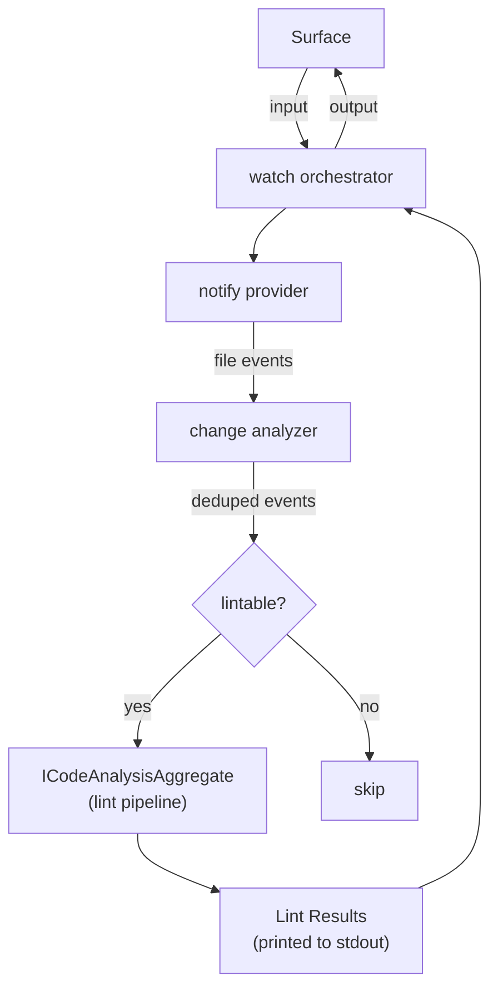

# FRD — file-watch

## Reference

- PRD: [PRD.md](../../PRD.md)
- Backlog: [BACKLOG.md](BACKLOG.md) — real condition for this crate; this file is specification only.

## System Overview

The file-watch crate provides a filesystem monitoring system that detects file changes in real time and re-triggers analysis via an injected `ICodeAnalysisAggregate`. It uses the `notify` crate (inotify on Linux) with `notify-debouncer-mini` to debounce rapid changes and avoid redundant processing.

### Architecture & Data Flow

```mermaid
flowchart TD
    A["Surface"] -->|input| B["watch orchestrator"]
    B --> C["notify provider"]
    C -->|file events| D["change analyzer"]
    D -->|deduped events| E{"lintable?"}

    E -->|"yes"| F["ICodeAnalysisAggregate\n(lint pipeline)"]
    E -->|"no"| G["skip"]

    F --> H["Lint Results\n(printed to stdout)"]
    H --> B
    B -->|output| A

```

## Functional Requirements

### FR-FILEWATCH-001: Start Filesystem Watcher

- **Description**: Initialize a debounced filesystem watcher on a target path using the `notify` crate.
- **Input**: Watch configuration containing path (string), debounce interval in milliseconds (u64), recursive flag (bool), and ignore patterns (list of strings).
- **Output**: Result — Ok on successful start, Err with descriptive message if path doesn't exist or debouncer creation fails.
- **Business Rules**:
  - Path must exist on disk; return error if path does not exist.
  - Debounce interval is configurable (default 200ms via `notify-debouncer-mini`).
  - Recursive mode controlled by the recursive flag in configuration.
  - Ignore patterns are matched via substring containment against event paths.
- **Edge Cases**:
  - Path is a file (not a directory) — still watch the file.
  - Debouncer creation fails — return error before starting.
  - Poisoned mutex (watcher lock) — recover via lock recovery.
- **Error Handling**: Returns an error with descriptive message for: path not found, debouncer creation failure, watch path failure.

### FR-FILEWATCH-002: Receive and Broadcast File Change Events

- **Description**: Receive debounced filesystem events, filter by ignore patterns, and broadcast file change events to all subscribers.
- **Input**: Raw debounced event from the `notify-debouncer-mini` callback.
- **Output**: File change event broadcast via a tokio broadcast channel (capacity 256).
- **Business Rules**:
  - Only "Any" kind events are forwarded.
  - Events matching any ignore pattern substring are skipped.
  - Each event is tagged as a modification event.
- **Edge Cases**:
  - Broadcast channel full (receivers lagging) — events silently dropped.
  - Multiple subscribers — each receives independent copies via subscription.
- **Error Handling**: No error returned; dropped events are non-fatal.

### FR-FILEWATCH-003: Filter Lintable Files

- **Description**: Determine whether a file path is lintable based on its extension.
- **Input**: File path string.
- **Output**: Boolean — true if the file has a lintable extension.
- **Business Rules**:
  - Supported extensions: `.rs`, `.py`, `.js`, `.ts`, `.tsx`, `.jsx`, `.mjs`, `.cjs`, `.json`, `.css`, `.md`, `.toml`, `.yaml`, `.yml`.
  - All listed extensions are treated as lintable.
  - Extension matching is suffix-based (no case normalization).
- **Edge Cases**:
  - File with no extension — not lintable.
  - File with multiple dots — matches on the final extension.
  - Hidden files (e.g., `.gitignore`) — not lintable (no matching extension).
  - Files with extensions not in the list (e.g., `.txt`, `.png`, `.lock`) — not lintable.
- **Error Handling**: Returns false for non-lintable paths; no error thrown.

### FR-FILEWATCH-004: Deduplicate Watch Events

- **Description**: Deduplicate a batch of watch events by file path, keeping only the latest event per file.
- **Input**: List of file change events.
- **Output**: List of file change events with unique paths.
- **Business Rules**:
  - Deduplication key is the file path string.
  - When duplicate paths exist, last-inserted event wins (hash map insert semantics).
  - Order of output is not guaranteed to match input order.
- **Edge Cases**:
  - Empty input — returns empty list.
  - All events for same path — returns single event.
- **Error Handling**: No error paths; pure in-memory operation.

### FR-FILEWATCH-005: Run Lint on Changed Files

- **Description**: On each detected file change, delegate to the injected `ICodeAnalysisAggregate` and report violations and score.
- **Input**: File change event with file path.
- **Output**: Printed output: `[change] <path> | <count> violations, score <score>`.
- **Business Rules**:
  - Only lintable files (per FR-FILEWATCH-003) trigger a lint run.
  - Score is calculated via the code analysis aggregate's score calculation method.
  - Initial full lint runs on startup before watching begins.
- **Edge Cases**:
  - File deleted between event and lint run — lint handles missing files gracefully.
  - Broadcast channel closed — break event loop.
  - Broadcast lagged (events missed) — continue without processing missed events.
- **Error Handling**: Lint failures are non-fatal; event loop continues.

### FR-FILEWATCH-006: Graceful Shutdown

- **Description**: Stop the watcher and event loop on Ctrl+C signal.
- **Input**: Atomic running flag (set to false by `ctrlc` handler in the CLI surface).
- **Output**: Watcher stopped, success exit code returned.
- **Business Rules**:
  - Ctrl+C sets running flag to false via atomic boolean.
  - Event loop checks running flag on every iteration.
  - Provider stop is called to clean up the debouncer.
- **Edge Cases**:
  - Multiple Ctrl+C presses — idempotent via atomic boolean.
  - Tokio runtime not yet created — fallback to single-threaded runtime.
- **Error Handling**: Tokio runtime creation failure returns failure exit code.

## API Contract

### Protocol API

| Method | Input | Output | Error | Event | Description |
| --- | --- | --- | --- | --- | --- |
| `run_watch` | `WatchConfig`, `Arc<AtomicBool>` | `ExitCode` | Runtime error on async runtime creation failure | — | Single entry point covering the whole feature folder: initial lint, watch start, event loop, and shutdown. |

### Aggregate API

| Method | Input | Output | Error | Event | Description |
| --- | --- | --- | --- | --- | --- |
| `run_watch` | `WatchConfig`, `Arc<AtomicBool>` | `ExitCode` | Runtime error on async runtime creation failure | — | Synchronous entry point; creates the async runtime when absent, then delegates to the async run. |
| `start_watch` | `WatchConfig` | `Result<()>` | Error when the path is absent or the debouncer cannot be created | — | Create the debouncer, register the watch path, and begin receiving events. |
| `stop_watch` | — | `Result<()>` | Error while dropping the debouncer | — | Drop the debouncer to stop watching. |
| `subscribe` | — | `broadcast::Receiver<WatchEvent>` | None | `WatchEvent` broadcast | Subscribe to deduplicated file change events. |
| `watch_feature_available` | — | `bool` | None | — | Report whether the watch feature is compiled in. |
| `is_lintable` | `FilePath` | `bool` | None | — | Decide whether a path carries a lintable extension. |
| `analyze_events` | `Vec<WatchEvent>` | `Vec<WatchEvent>` | None | — | Deduplicate a batch of events, keeping the latest per path. |
| `filter_lintable_events` | `Vec<WatchEvent>` | `Vec<WatchEvent>` | None | — | Keep only the events whose path is lintable. |
| `run_lint_on_change` | `FilePath` | Printed report | Non-fatal; the loop continues | — | Delegate a changed file to the injected code analysis aggregate and report violations and score. |

## Integration Points

| System | Direction | Purpose | Failure mode |
| --- | --- | --- | --- |
| Code analysis aggregate | in | Run lint analysis over a changed file | Aggregate error logged; the event loop continues |
| `notify` | in | OS-level filesystem event monitoring (inotify on Linux) | Watcher construction fails → runtime error |
| `notify-debouncer-mini` | in | Debounce rapid filesystem events into one | Debouncer creation fails → runtime error |
| `tokio` | in | Async runtime hosting the event loop and broadcast channel | Runtime creation fails → runtime error exit code |
| Watch provider protocol | out | Contract for the notify-backed provider | Provider returns an error → propagated to the caller |
| Change analyzer protocol | out | Contract for deduplication and lintable filtering | Analysis returns an error → propagated to the caller |
| Watch aggregate | out | Aggregate surface the surface layer composes | Aggregate unavailable → the surface falls back to its CLI path |

## Non-functional Requirements

| Metric | Target | Measurement method |
| --- | --- | --- |
| Change detection latency | Within the configured debounce interval (default 200ms) | Timestamp a file write and the resulting lint run |
| Idle poll interval | 100ms | Read the event loop timer constant |
| Broadcast channel capacity | 256 events | Read the channel capacity constant |
| Detection completeness | All modifications within watched directories are detected, subject to OS inotify limits | Modify each watched file and assert an event arrives |
| False positive rate | Editor temp-file events suppressed by ignore patterns | Save from a temp file and assert no event is broadcast |

## Test Scenarios

- Starting the watcher on an existing directory yields events within the debounce window.
- Starting the watcher on a non-existent path returns a watch error.
- Modifying a lintable source file triggers a lint run and reports violations.
- Modifying a non-lintable file triggers no lint run.
- Rapid modifications to one file produce exactly one lint run after debounce.
- A file matching an ignore pattern is skipped and triggers no lint run.
- Ctrl+C during a watch run shuts the watcher down gracefully.
- Every subscriber receives the same event.
- A lagged broadcast channel lets the event loop continue without crashing.
- The startup lint run prints a baseline violation count and score.
- Recursive watch mode reports subdirectory changes.
- Non-recursive watch mode ignores subdirectory changes.

## Assumptions & Constraints

- OS must support `notify` crate's recommended watcher (inotify on Linux, FSEvents on macOS).
- Maximum inotify watch limit depends on system configuration (default varies by distro).
- The watch feature is feature-gated; availability check returns true when the feature is enabled.
- The crate runs on the Tokio async runtime; must be compatible with both single-threaded and multi-threaded runtimes.

## Glossary

- **Debounce**: Coalesce multiple rapid filesystem events into a single event after a quiet period.
- **Lintable**: A file whose extension matches one of the supported linting targets.
- **File Change Event**: A structured representation of a filesystem change event emitted by the debouncer.
- **inotify**: Linux kernel subsystem used by the `notify` crate for filesystem event monitoring.
