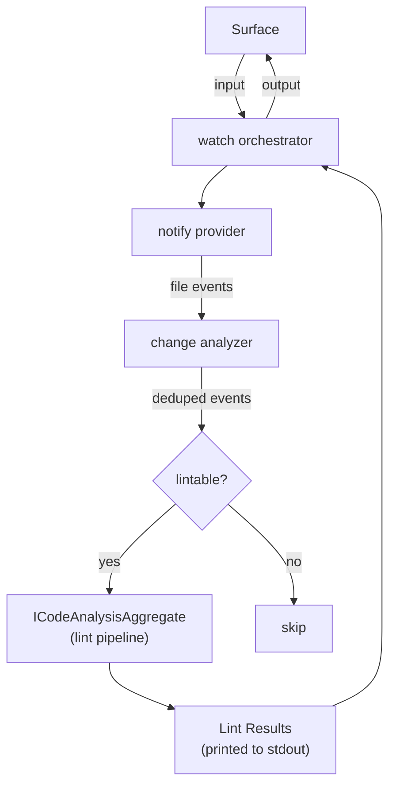

# FRD — file-watch

## Reference

- PRD: [PRD.md](../../PRD.md)
- Backlog: [BACKLOG.md](BACKLOG.md) — real condition for this crate; this file is specification only.

## System Overview

The file-watch crate provides a filesystem monitoring system that detects file changes in real time and re-triggers analysis via an injected `ICodeAnalysisAggregate`. It uses the `notify` crate (inotify on Linux) with `notify-debouncer-mini` to debounce rapid changes and avoid redundant processing.

### Architecture & Data Flow

```mermaid
flowchart TD
    A["Surface"] -->|input| B["watch orchestrator"]
    B --> C["notify provider"]
    C -->|file events| D["change analyzer"]
    D -->|deduped events| E{"lintable?"}

    E -->|"yes"| F["ICodeAnalysisAggregate\n(lint pipeline)"]
    E -->|"no"| G["skip"]

    F --> H["Lint Results\n(printed to stdout)"]
    H --> B
    B -->|output| A

```

## Functional Requirements

### FR-FileWatch-001: Start Filesystem Watcher

- **Description**: Initialize a debounced filesystem watcher on a target path using the `notify` crate.
- **Input**: Watch configuration containing path (string), debounce interval in milliseconds (u64), recursive flag (bool), and ignore patterns (list of strings).
- **Output**: Result — Ok on successful start, Err with descriptive message if path doesn't exist or debouncer creation fails.
- **Business Rules**:
  - Path must exist on disk; return error if path does not exist.
  - Debounce interval is configurable (default 200ms via `notify-debouncer-mini`).
  - Recursive mode controlled by the recursive flag in configuration.
  - Ignore patterns are matched via substring containment against event paths.
- **Edge Cases**:
  - Path is a file (not a directory) — still watch the file.
  - Debouncer creation fails — return error before starting.
  - Poisoned mutex (watcher lock) — recover via lock recovery.
- **Error Handling**: Returns an error with descriptive message for: path not found, debouncer creation failure, watch path failure.

### FR-FileWatch-002: Receive and Broadcast File Change Events

- **Description**: Receive debounced filesystem events, filter by ignore patterns, and broadcast file change events to all subscribers.
- **Input**: Raw debounced event from the `notify-debouncer-mini` callback.
- **Output**: File change event broadcast via a tokio broadcast channel (capacity 256).
- **Business Rules**:
  - Only "Any" kind events are forwarded.
  - Events matching any ignore pattern substring are skipped.
  - Each event is tagged as a modification event.
- **Edge Cases**:
  - Broadcast channel full (receivers lagging) — events silently dropped.
  - Multiple subscribers — each receives independent copies via subscription.
- **Error Handling**: No error returned; dropped events are non-fatal.

### FR-FileWatch-003: Filter Lintable Files

- **Description**: Determine whether a file path is lintable based on its extension.
- **Input**: File path string.
- **Output**: Boolean — true if the file has a lintable extension.
- **Business Rules**:
  - Supported extensions: `.rs`, `.py`, `.js`, `.ts`, `.tsx`, `.jsx`, `.mjs`, `.cjs`, `.json`, `.css`, `.md`, `.toml`, `.yaml`, `.yml`.
  - All listed extensions are treated as lintable.
  - Extension matching is suffix-based (no case normalization).
- **Edge Cases**:
  - File with no extension — not lintable.
  - File with multiple dots (e.g. a double-dotted TypeScript test) — matches on the final extension.
  - Hidden files (e.g., `.gitignore`) — not lintable (no matching extension).
  - Files with extensions not in the list (e.g., `.txt`, `.png`, `.lock`) — not lintable.
- **Error Handling**: Returns false for non-lintable paths; no error thrown.

### FR-FileWatch-004: Deduplicate Watch Events

- **Description**: Deduplicate a batch of watch events by file path, keeping only the latest event per file.
- **Input**: List of file change events.
- **Output**: List of file change events with unique paths.
- **Business Rules**:
  - Deduplication key is the file path string.
  - When duplicate paths exist, last-inserted event wins (hash map insert semantics).
  - Order of output is not guaranteed to match input order.
- **Edge Cases**:
  - Empty input — returns empty list.
  - All events for same path — returns single event.
- **Error Handling**: No error paths; pure in-memory operation.

### FR-FileWatch-005: Run Lint on Changed Files

- **Description**: On each detected file change, delegate to the injected `ICodeAnalysisAggregate` and report violations and score.
- **Input**: File change event with file path.
- **Output**: Printed output: `[change] <path> | <count> violations, score <score>`.
- **Business Rules**:
  - Only lintable files (per FR-FileWatch-003) trigger a lint run.
  - Score is calculated via the code analysis aggregate's score calculation method.
  - Initial full lint runs on startup before watching begins.
- **Edge Cases**:
  - File deleted between event and lint run — lint handles missing files gracefully.
  - Broadcast channel closed — break event loop.
  - Broadcast lagged (events missed) — continue without processing missed events.
- **Error Handling**: Lint failures are non-fatal; event loop continues.

### FR-FileWatch-006: Graceful Shutdown

- **Description**: Stop the watcher and event loop on Ctrl+C signal.
- **Input**: Atomic running flag (set to false by `ctrlc` handler in the CLI surface).
- **Output**: Watcher stopped, success exit code returned.
- **Business Rules**:
  - Ctrl+C sets running flag to false via atomic boolean.
  - Event loop checks running flag on every iteration.
  - Provider stop is called to clean up the debouncer.
- **Edge Cases**:
  - Multiple Ctrl+C presses — idempotent via atomic boolean.
  - Tokio runtime not yet created — fallback to single-threaded runtime.
- **Error Handling**: Tokio runtime creation failure returns failure exit code.

## API Contract

### Protocol API

| Method | Input | Output | Error | Event | Description |
|---|---|---|---|---|---|
| `analyze` | Vec<WatchEvent> | `Vec<WatchEvent>` | — | — | Analyze. |
| `is_lintable` | &str | `bool` | — | — | Is lintable. |
| `filter_lintable` | Vec<WatchEvent> | `Vec<WatchEvent>` | — | — | Filter lintable. |
| `subscribe` | — | `tokio::sync::broadcast::Receiver<WatchEvent>` | — | — | Subscribe. |

### Aggregate API

| Method | Input | Output | Error | Event | Description |
|---|---|---|---|---|---|
| `execute` | WatchRequest | `WatchResponse` | — | — | Single composite entry point over the feature. |

## Integration Points
| System | Direction | Purpose | Failure mode |
| --- | --- | --- | --- |
| Code analysis aggregate | in | Re-run analysis over a changed file, injected at runtime rather than compiled against | Analysis fails for a file → the failure is reported and the watch loop continues with the next event |
| Watch provider protocol | out (internal) | Define the interface the OS event provider implements | The OS watch limit is reached → the watch call reports failure instead of silently watching a subset |
| Change analyzer protocol | out (internal) | Decide whether a raw event is worth re-analysing | An event cannot be classified → it is treated as a change, so a lint run is spent rather than a change missed |
| Watch aggregate | out (internal) | Expose the single composite entry point the surface calls | The watched path does not exist → a watch error is returned and no loop is started |
| `notify` | in | Deliver OS-level filesystem events | The kernel watch descriptor limit is hit → events stop arriving and the provider surfaces the error |
| `notify-debouncer-mini` | in | Coalesce bursts of events into one, so one save does not trigger many analyses | A burst never settles → the debounce window elapses and the pending change is analysed once |
| Async runtime | in | Drive the event loop and the broadcast channel | The loop task is cancelled → subscribers are notified and shutdown proceeds |

## Non-functional Requirements
| Metric | Target | Measurement method |
| --- | --- | --- |
| Detection latency | A change is reported within the 200 ms debounce window | Touch a file and time from the write to the delivered event |
| Idle polling | The event loop polls at 100 ms when idle | Measure the loop's wake interval while no events occur |
| Burst coalescing | One save burst produces exactly one analysis run | Issue N writes inside one debounce window and count the analysis runs |
| Non-lintable files | A change to a non-lintable file triggers no analysis | Modify a non-source file and assert no analysis run is started |
| Ignored paths | A change under an ignored path triggers no analysis | Modify a file matching an ignore pattern and assert no analysis run is started |
| Recursion | Changes in watched subdirectories are reported when recursive, and are not when non-recursive | Modify a nested file under both watch modes and compare delivered events |
| Subscriber fan-out | Every subscriber receives the same event sequence | Attach two subscribers, trigger one change, and compare both received sequences |
| Overflow | A lagging broadcast channel does not crash the event loop | Overflow the channel while the loop runs and assert it continues and reports the drop |
| Shutdown | Interrupt during a run stops the watcher cleanly | Send an interrupt mid-run and assert the process exits without a panic |

## Test Scenarios

- Start watcher on existing directory — events received within debounce window.
- Start watcher on non-existent path — returns watch error.
- Modify a `.rs` file — lint triggered, violations reported.
- Modify a `.txt` file — lint not triggered (non-lintable extension).
- Rapid modifications to same file — only one lint run after debounce.
- File matching ignore pattern — event skipped, no lint run.
- Ctrl+C during watch — graceful shutdown, watcher stopped.
- Multiple subscribers — all receive the same events.
- Broadcast channel lagged — event loop continues without crash.
- Initial lint on startup — baseline violations and score printed.
- Recursive watch — subdirectory changes detected.
- Non-recursive watch — subdirectory changes ignored.

## Assumptions & Constraints

- OS must support `notify` crate's recommended watcher (inotify on Linux, FSEvents on macOS).
- Maximum inotify watch limit depends on system configuration (default varies by distro).
- The watch feature is feature-gated; availability check returns true when the feature is enabled.
- The crate runs on the Tokio async runtime; must be compatible with both single-threaded and multi-threaded runtimes.

## Glossary
- **Debounce**: Coalesce multiple rapid events into a single event after a quiet period.
- **Lintable**: A file whose extension matches one of the supported linting targets.
- **File Change Event**: A structured representation of a filesystem change event.
- **inotify**: Linux kernel subsystem for filesystem event monitoring.
