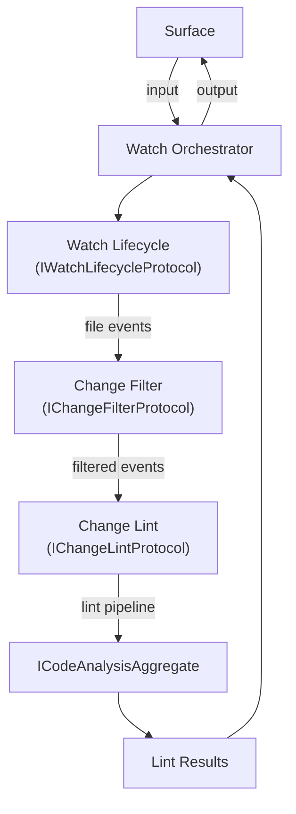

# FRD — file-watch

## Reference

- PRD: [PRD.md](../../PRD.md)
- Backlog: [BACKLOG.md](BACKLOG.md) — real condition for this crate; this file is specification only.

## System Overview

The file-watch crate provides a filesystem monitoring system that detects file
changes in real time and re-triggers analysis via an injected
`ICodeAnalysisAggregate`. It uses the `notify` crate (inotify on Linux) with
`notify-debouncer-mini` to debounce rapid changes and avoid redundant
processing.

**Configuration lifetime in a watch session.** A watch session is one
long-lived process holding one config orchestrator, and the config cache is
keyed by path with no modification-time check and no invalidation entry point
(see `crates/config-system/FRD.md`, FR-ConfigSystem-003). The configuration a
session uses is therefore the one parsed at startup, for the whole session:
editing `lint_arwaky.config.yaml` while `watch` runs changes nothing until the
session is restarted. Thresholds, ignored paths, and adapter toggles are
start-of-session values.

- **Architecture & Data Flow**

```mermaid
flowchart TD
    A["Surface"] -->|input| B["Watch Orchestrator"]
    B --> C["Watch Lifecycle\n(IWatchLifecycleProtocol)"]
    C -->|file events| D["Change Filter\n(IChangeFilterProtocol)"]
    D -->|filtered events| E["Change Lint\n(IChangeLintProtocol)"]
    E -->|lint pipeline| F["ICodeAnalysisAggregate"]
    F --> G["Lint Results"]
    G --> B
    B -->|output| A
```

## Functional Requirements

### FR-FileWatch-001: Watch Filesystem Lifecycle

- **Description**: Start, maintain, and stop a debounced filesystem watcher on
  a target path. The lifecycle capability exposes subscribe for event consumers,
  start for path activation, and stop for clean shutdown.
- **Input**: `WatchConfig` containing path, debounce interval, recursive flag,
  and ignore patterns.
- **Output**: `Result<(), WatchServiceError>` — Ok on successful start/stop; Err
  with a descriptive message if the path does not exist, the debouncer fails to
  initialise, or the watch call fails.
- **Business Rules**:

  - Path must exist on disk before the watcher starts; otherwise `start` returns
    an error.
  - Debounce interval is configurable via `WatchConfig.debounce_ms`
    (default 200 ms via `notify-debouncer-mini`).
  - Recursive mode is controlled by `WatchConfig.recursive`.
  - Ignore patterns are matched via substring containment against event paths.
  - Only `Any`-kind events are forwarded to subscribers.
  - `subscribe` returns a broadcast receiver; each subscriber receives an
    independent copy of every event.
  - `is_available` returns true only when the `watch` feature gate is compiled
    in for the current platform.
- **Edge Cases**:

  - Path is a file (not a directory) — the watcher still attaches to it.
  - Multiple Ctrl+C presses — `stop` is idempotent because the internal mutex
    guard handles concurrent access safely.
  - Tokio runtime creation fails — the orchestrator falls back to a single-threaded
    runtime.
- **Error Handling**: Returns `WatchServiceError` for path-not-found, debouncer
  creation failure, and watch-path failure. Dropping an event because the
  broadcast channel is full is non-fatal.

---

### FR-FileWatch-002: Filter and Deduplicate Change Events

- **Description**: Given a batch of raw file-change events, deduplicate by path
  (last-write-wins) and then filter to lintable extensions only.
- **Input**: List of `WatchEvent` structs.
- **Output**: Filtered, deduplicated list of `WatchEvent` structs.
- **Business Rules**:

  - Deduplication key is the file path string. When duplicate paths exist the
    last-inserted event wins (hash-map insert semantics).
  - Lintable extensions: `.rs`, `.py`, `.js`, `.ts`, `.tsx`, `.jsx`, `.mjs`,
    `.cjs`, `.json`, `.css`, `.md`, `.toml`, `.yaml`, `.yml`.
  - Extension matching is suffix-based; no case normalization is applied.
  - The two operations are applied in sequence — deduplicate first, then filter.
- **Edge Cases**:

  - Empty input — returns an empty list.
  - All events for the same path — returns a single event.
  - File with no extension — excluded by the filter.
  - Hidden files (e.g. `.gitignore`) — not lintable; excluded.
  - Files with non-lintable extensions (e.g. `.txt`, `.png`, `.lock`) — excluded.
- **Error Handling**: No error paths; both operations are pure in-memory.

---

### FR-FileWatch-003: Run Lint on Changed Files

- **Description**: On each lintable change event, delegate to the injected
  `ICodeAnalysisAggregate` and report violations and score.
- **Input**: A single `WatchEvent` containing the changed file path.
- **Output**: Printed output line in the form
  `[change] <path> | <count> violations, score <score>`, plus an empty `Ok` on
  success.
- **Business Rules**:

  - Only lintable files (as determined by FR-FileWatch-002) trigger a lint run.
  - The aggregate computes violations and a compliance score; both are printed
    on completion.
  - Initial full lint runs on startup before the event loop begins, establishing
    a baseline.
- **Edge Cases**:

  - File deleted between event receipt and lint execution — the aggregate handles
    the missing file gracefully; no violation is reported.
  - Broadcast channel closed — the orchestrator breaks the event loop; this FR
    does not handle channel closure directly.
  - Broadcast lagged (events missed) — the orchestrator skips missed events;
    this FR continues processing the events it receives.
- **Error Handling**: Lint failures are non-fatal; the orchestrator logs the
  error and continues with the next event.

---

## API Contract

### Protocol API

| Method | Input | Output | Error | Event | Description |
|---|---|---|---|---|---|
| `start` / `subscribe` / `stop` | `&WatchConfig` / `—` / `—` | `Result<(), WatchServiceError>` / `Receiver` / `Result<(), WatchServiceError>` | — | — | Watch lifecycle. |
| `filter_events` | `Vec<WatchEvent>` | `Vec<WatchEvent>` | — | — | Deduplicate then filter to lintable extensions. |
| `lint_changed` | `&WatchEvent` | `Result<(), WatchServiceError>` | — | — | Run lint pipeline on a changed file. |

### Aggregate API

| Method | Input | Output | Error | Event | Description |
|---|---|---|---|---|---|
| `execute` | `WatchRequest` | `WatchResponse` | — | — | Single composite entry point over the feature. |

## Integration Points

| System | Direction | Purpose | Failure mode |
|---|---|---|---|
| Code analysis aggregate | in | Re-run analysis over a changed file; injected at runtime rather than compiled against | Analysis fails for a file → the failure is reported and the watch loop continues with the next event |
| Watch lifecycle protocol | out (internal) | Define the interface the OS event provider implements | The OS watch limit is reached → the watch call reports failure instead of silently watching a subset |
| Change filter protocol | out (internal) | Decide which events are worth processing | An event cannot be classified → it is treated as a change, so a lint run is spent rather than a change missed |
| Change lint protocol | out (internal) | Run the lint pipeline for a single event | A lint failure is non-fatal; the loop continues |
| Watch aggregate | out (internal) | Expose the single composite entry point the surface calls | The watched path does not exist → a watch error is returned and no loop is started |
| `notify` | in | Deliver OS-level filesystem events | The kernel watch descriptor limit is hit → events stop arriving and the provider surfaces the error |
| `notify-debouncer-mini` | in | Coalesce bursts of events into one, so one save does not trigger many analyses | A burst never settles → the debounce window elapses and the pending change is analysed once |
| Async runtime | in | Drive the event loop and the broadcast channel | The loop task is cancelled → subscribers are notified and shutdown proceeds |

## Non-functional Requirements

| Metric | Target | Measurement method |
|---|---|---|
| Detection latency | A change is reported within the 200 ms debounce window | Touch a file and time from the write to the delivered event |
| Idle polling | The event loop polls at 100 ms when idle | Measure the loop's wake interval while no events occur |
| Burst coalescing | One save burst produces exactly one analysis run | Issue N writes inside one debounce window and count the analysis runs |
| Non-lintable files | A change to a non-lintable file triggers no analysis | Modify a non-source file and assert no analysis run is started |
| Ignored paths | A change under an ignored path triggers no analysis | Modify a file matching an ignore pattern and assert no analysis run is started |
| Recursion | Changes in watched subdirectories are reported when recursive, and are not when non-recursive | Modify a nested file under both watch modes and compare delivered events |
| Subscriber fan-out | Every subscriber receives the same event sequence | Attach two subscribers, trigger one change, and compare both received sequences |
| Overflow | A lagging broadcast channel does not crash the event loop | Overflow the channel while the loop runs and assert it continues and reports the drop |
| Shutdown | Interrupt during a run stops the watcher cleanly | Send an interrupt mid-run and assert the process exits without a panic |

## Test Scenarios

- Start watcher on existing directory — events received within debounce window.
- Start watcher on non-existent path — returns watch error.
- Modify a `.rs` file — lint triggered, violations reported.
- Modify a `.txt` file — lint not triggered (non-lintable extension).
- Rapid modifications to same file — only one lint run after debounce.
- File matching ignore pattern — event skipped, no lint run.
- Ctrl+C during watch — graceful shutdown, watcher stopped.
- Multiple subscribers — all receive the same events.
- Broadcast channel lagged — event loop continues without crash.
- Initial lint on startup — baseline violations and score printed.
- Recursive watch — subdirectory changes detected.
- Non-recursive watch — subdirectory changes ignored.
- Config file edited mid-session — the session keeps using the configuration parsed at startup; the edit takes effect only after a restart.

## Assumptions & Constraints

- OS must support `notify` crate's recommended watcher (inotify on Linux,
  FSEvents on macOS).
- Maximum inotify watch limit depends on system configuration (default varies by
  distro).
- The watch feature is feature-gated; availability check returns true when the
  feature is enabled.
- The crate runs on the Tokio async runtime; must be compatible with both
  single-threaded and multi-threaded runtimes.

## Glossary

- **Debounce**: Coalesce multiple rapid events into a single event after a quiet
  period.
- **Lintable**: A file whose extension matches one of the supported linting
  targets.
- **File Change Event**: A structured representation of a filesystem change
  event.
- **inotify**: Linux kernel subsystem for filesystem event monitoring.
