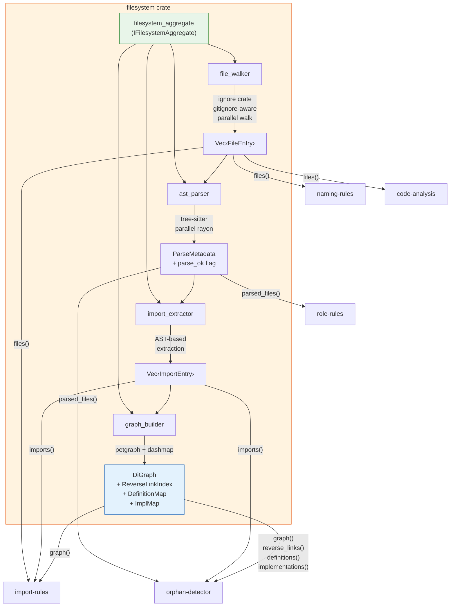

# FRD — filesystem (v1.1.0)

---

## System Overview

The filesystem crate centralizes all file I/O, AST parsing, import extraction, and dependency graph construction for lint-arwaky. It is the **single source of file data** for all rule crates (naming-rules, code-analysis, role-rules, import-rules, orphan-detector). Rule crates do not perform file I/O or AST parsing directly — they access pre-parsed data through granular accessor methods on the `IFilesystemAggregate` trait.

### Architecture & Data Flow



### Pipeline Sequence

```
filesystem_aggregate (lazy: pipeline runs on first accessor call)
  │
  ├── Stage 1: file_walker
  │     Walk crates/, packages/, modules/
  │     Filter by extension (.rs, .py, .ts, .js, .jsx, .tsx)
  │     Respect .gitignore, .ignore, config ignored_paths
  │     Skip hidden directories, symlink safety
  │     Read file contents (UTF-8)
  │     → Vec<FileEntry> (path, content, language, extension)
  │
  ├── Stage 2: ast_parser (parallel via rayon)
  │     Parse each FileEntry via tree-sitter
  │     Set parse_ok flag (true/false)
  │     Extract parse metadata (type declarations, impl blocks,
  │       method signatures, function definitions, class bases)
  │     Emit PARSE_WARN for parse_ok = false
  │     → Vec<FileEntry> (enriched with parse metadata)
  │
  ├── Stage 3: import_extractor
  │     Extract import/use/from/require statements from AST
  │     Normalize relative paths to workspace-root-relative
  │     Resolve barrel re-exports (mod.rs, __init__.py, index.ts)
  │     Skip external dependencies (crates.io, npm)
  │     Skip conditional imports (#[cfg(...)])
  │     → Vec<ImportEntry>
  │
  └── Stage 4: graph_builder
        Build DiGraph (file → file edges)
        Build ReverseLinkIndex (file → importers)
        Build DefinitionMap (trait/class/struct → file)
        Build ImplMap (trait → implementors)
        → GraphData
```

### Consumer Access Pattern

```
IFilesystemAggregate trait (granular accessors, return references):

  file_list()              → all source files              naming-rules, code-analysis, import-rules
  parsed_file_list()       → files with parse metadata     role-rules, orphan-detector
  parse_warnings()         → parse diagnostics             all consumers
  import_list()            → all import entries            import-rules, orphan-detector
  dependency_graph()       → forward import graph          import-rules, orphan-detector
  reverse_import_map()     → reverse import map            orphan-detector
  symbol_definitions()     → symbol → file map             orphan-detector
  trait_implementations()  → trait → implementors map      orphan-detector
```

---

## Functional Requirements

### FR-001: File Discovery

- **Description**: Walk project directory tree using `ignore` crate (gitignore-aware, parallel walk). Produce a flat list of source files filtered by extension. Read file contents into memory.
- **Input**: Root path, ignored paths (from config), allowed extensions (from config).
- **Output**: `Vec<FileEntry>` — path, content, extension, language.
- **Business Rules**:

  - Uses `ignore::WalkBuilder` for parallel, gitignore-aware walking.
  - Scans `crates/`, `packages/`, `modules/` subdirectories at root level.
  - Filters by extension: `.rs`, `.py`, `.ts`, `.js`, `.jsx`, `.tsx`.
  - Respects `.gitignore`, `.ignore`, and `ignored_paths` from config.
  - Skips hidden directories (`.git`, `.venv`, `node_modules`, `target`, `dist`, `build`, `__pycache__`).
  - Reads file content into `FileEntry.content` (UTF-8). Non-UTF-8 files are skipped with warning.
  - No file size limit — all files regardless of size are read and processed.
- **Edge Cases**:

  - Symlinks: follow if target is within workspace root, skip otherwise (symlink safety).
  - Empty directories: return empty list, no error.
  - Permission denied: log warning, skip file, continue walk.
  - Non-UTF-8 content: skip file, log warning.
  - Empty files: included in result with empty content string.
- **Error Handling**: Non-fatal — skip inaccessible files, return partial results. Walk errors do not abort the scan.

---

### FR-002: AST Parsing

- **Description**: Parse file contents into ASTs using tree-sitter. Parallel parsing via rayon. Enrich each `FileEntry` with parse metadata and `parse_ok` flag.
- **Input**: `Vec<FileEntry>` from FR-001.
- **Output**: `Vec<FileEntry>` enriched with parse metadata + `parse_ok` flag + list of `PARSE_WARN` diagnostics.
- **Business Rules**:

  - Uses `tree-sitter` with language-specific grammars:
    - `tree-sitter-rust` for `.rs`
    - `tree-sitter-python` for `.py`
    - `tree-sitter-typescript` for `.ts`, `.tsx`
    - `tree-sitter-javascript` for `.js`, `.jsx`
  - Parsing is parallel via `rayon::par_iter`.
  - Each `FileEntry` is enriched with:
    - `parse_ok: bool` — whether parsing succeeded.
    - `parse_metadata` — language-specific structured data:
      - **Rust**: `ItemUse` (imports), `ItemMod` (module declarations with `#[path]` attributes), `ItemImpl` (trait implementations with trait path and implementor type), `ItemStruct` / `ItemEnum` / `ItemTrait` / `ItemType` (definitions), `ItemFn` (function definitions with body span and parameter types).
      - **Python**: import statements, class declarations (with base classes), function definitions (with body span and parameter types).
      - **TypeScript/JavaScript**: import/export statements, class declarations (with implements clause), interface declarations, type alias declarations, function definitions (with body span).
  - Files with `parse_ok = false` produce a `PARSE_WARN` diagnostic:
    - Code: `PARSE_WARN` (not an AES code).
    - Severity: `WARNING`.
    - Message: `"File skipped: parse failure — {error_detail}"`.
  - Files with `parse_ok = false` are retained in the result with empty parse metadata. Consumer crates decide how to handle them.
  - No regex fallback. If tree-sitter grammar is not available for a language, the file is marked `parse_ok = false`.
- **Edge Cases**:

  - Syntax error in source: tree-sitter produces partial tree. `parse_ok = false`, partial metadata extracted where possible.
  - Empty file: `parse_ok = true`, empty metadata.
  - JSX/TSX content: tree-sitter-typescript handles JSX natively.
  - Multi-line imports/definitions: handled natively by tree-sitter AST.
- **Error Handling**: Non-fatal — parse errors produce `parse_ok = false` + `PARSE_WARN`, do not block scan. No panics, no unwraps.

---

### FR-003: Import/Dependency Extraction

- **Description**: Extract import statements from ASTs. Normalize to absolute module paths. Produce a flat list of import entries.
- **Input**: `Vec<FileEntry>` with parse metadata from FR-002.
- **Output**: `Vec<ImportEntry>` — source file, target module path, imported symbols, import type, is_reexport, is_wildcard, resolved.
- **Business Rules**:

  - **Rust**: Extract `use` and `mod` statements from `ItemUse` / `ItemMod` parse metadata. Resolve `crate::`, `super::`, `self::` prefixes. Handle grouped imports (`use foo::{A, B}`), glob imports (`use foo::*`), and `pub use` re-exports. Handle `#[path = "..."]` attributes on `ItemMod`.
  - **Python**: Extract `import X` and `from X import Y` from parse metadata. Resolve relative imports (`from . import X`, `from ..module import Y`) by walking parent directories.
  - **TypeScript/JavaScript**: Extract `import { X } from`, `import X from`, `import * as X from`, side-effect imports, `export { X } from`, `export * from`, and `require()` from parse metadata. Resolve extensionless imports by trying `.ts`, `.js`, `.tsx`, `.jsx`, and `/index.*` candidates.
  - Normalize relative paths (`./foo`, `../bar`) to workspace-root-relative module paths.
  - Handle barrel re-exports (`mod.rs`, `__init__.py`, `index.ts`) — resolve through barrel to original source file.
  - Skip external dependencies (crates.io packages, npm packages) — only internal workspace imports.
  - **Conditional imports (`#[cfg(...)]`) are SKIPPED** — not extracted, not included in `Vec<ImportEntry>`.
  - Hyphen/underscore normalization: Rust crate names with hyphens (`lint-arwaky`) normalized to underscores (`lint_arwaky`) for module path resolution.
  - Build crate module index for cross-crate resolution.
- **Edge Cases**:

  - Dynamic imports (`import()` in TS): extract string literal if static, mark as `is_dynamic = true`. Variable-based dynamic imports (`import(moduleName)`) are skipped.
  - Star imports (`use foo::*`, `export * from`): mark as `is_wildcard = true`, edge created to module root.
  - Unresolvable imports (target file not found): `ImportEntry` created with `resolved = false`.
  - Files with `parse_ok = false`: no imports extracted (empty contribution).
  - Multi-line import statements: handled natively by tree-sitter AST.
- **Error Handling**: Non-fatal — unresolvable imports logged, marked `resolved = false`, excluded from graph edges.

---

### FR-004: Dependency Graph and Map Construction

- **Description**: Build a directed graph of file-to-file dependencies from extracted imports. Build reverse link index, definition map, and implementation map from parse metadata.
- **Input**: `Vec<ImportEntry>` from FR-003, `Vec<FileEntry>` with parse metadata from FR-002.
- **Output**: `GraphData` containing:

  - `DiGraph` — petgraph `DiGraph<FileNode, ImportEdge>` (forward import graph).
  - `ReverseLinkIndex` — `HashMap<PathBuf, Vec<PathBuf>>` (file → list of files that import it).
  - `DefinitionMap` — `HashMap<SymbolName, PathBuf>` (trait/class/struct/interface name → defining file).
  - `ImplMap` — `HashMap<SymbolName, Vec<PathBuf>>` (trait/interface name → list of implementor files).
- **Business Rules**:

  - **DiGraph construction**:

    - Nodes: each source file (keyed by workspace-root-relative path).
    - Edges: import relationship (source file → imported file).
    - Edge weight: import type (use/from/require/mod), is_reexport, is_wildcard.
    - Parallel construction via `DashMap` → merge into `petgraph::DiGraph`.
    - Duplicate imports: single edge, deduplicated.
    - Broken imports (`resolved = false`): edge created with `resolved = false` flag.
  - **ReverseLinkIndex construction**:

    - Invert all DiGraph edges: for each edge A → B, add A to B's importer list.
    - Barrel file re-exports are resolved: if A imports from barrel B which re-exports from C, the reverse link points to C (original source), not B (barrel).
  - **DefinitionMap construction** (from parse metadata):

    - Rust: `ItemStruct` name → file, `ItemEnum` name → file, `ItemTrait` name → file, `ItemType` name → file.
    - Python: class name → file.
    - TypeScript: class name → file, interface name → file, type alias name → file.
  - **ImplMap construction** (from parse metadata):

    - Rust: `ItemImpl` with `trait_` field → trait name mapped to implementor file. Handles generic impls (`impl<T> Trait for Type`) and qualified paths (`impl foo::Trait for Bar`).
    - Python: class base list → parent class mapped to child file.
    - TypeScript: `implements` clause → interface mapped to implementor file.
  - **Graph queries supported**:

    - `dependents(file)` → who imports this file? (ReverseLinkIndex lookup)
    - `dependencies(file)` → what does this file import? (DiGraph outgoing edges)
    - `reachable(from)` → all files transitively reachable from `from` (BFS)
- **Edge Cases**:

  - External dependencies (not in workspace): not added as nodes. Import entries with `resolved = false` are logged but do not create edges.
  - Circular imports: cycles exist in graph but do not cause construction errors.
  - Files with `parse_ok = false`: present as nodes (from file list) but contribute no edges, definitions, or implementations.
- **Error Handling**: Non-fatal — broken imports create unresolved entries. Graph construction errors produce partial graph with diagnostics.

---

### FR-005: Filesystem Orchestrator

- **Description**: Single entry point that orchestrates FR-001 through FR-004. Exposes data via **granular accessor methods** on the `IFilesystemAggregate` trait. Pipeline runs once (lazy initialization on first accessor call), results cached internally, served to all consumers via reference.
- **Input**: Scan root path, architecture configuration (ignored paths, extensions).
- **Output**: Per-accessor return (see trait definition below).
- **Business Rules**:

  - **Pipeline**: walk → parse → extract → graph (sequential stages, parallel within each stage).
  - Pipeline runs once per scan (lazy: triggered on first accessor call). Results cached internally.
  - All accessors return **references** (`&[T]`, `&Map`) — zero-cost, no clone.
  - Result is immutable after construction (read-only queries only).
  - Implements `IFilesystemAggregate` trait (defined by this crate, not by consumer crates).
  - Each stage logs timing for performance profiling.
  - **Consumer access pattern**:


    | Consumer        | Accessors Used                                                                               |
    | ----------------- | ---------------------------------------------------------------------------------------------- |
    | naming-rules    | file_list()                                                                                   |
    | code-analysis   | file_list()                                                                                   |
    | role-rules      | parsed_file_list()                                                                            |
    | import-rules    | file_list(), import_list(), dependency_graph()                                               |
    | orphan-detector | parsed_file_list(), import_list(), dependency_graph(), reverse_import_map(), symbol_definitions(), trait_implementations() |
    | all consumers   | parse_warnings()                                                                              |
- **Edge Cases**:

  - Empty project: all accessors return empty slices/maps, no error.
  - Single file: still run full pipeline (consistency).
  - Multiple consumers calling different accessors: pipeline runs once, results shared.
  - Accessor called before pipeline completes: blocks until pipeline finishes (lazy init).
- **Error Handling**: Pipeline failure at any stage produces `ScanError` with stage identification. Partial results available via accessors for completed stages. `parse_warnings()` always returns diagnostics for any parse failures.

---

## API Contract


| Operation                         | Input                      | Output                    | Purpose                                                                         |
| ---------------------------------- | ---------------------------- | --------------------------- | --------------------------------------------------------------------------------- |
| Full scan (walk → parse → graph) | Root path, configuration     | Internal pipeline trigger   | Run full pipeline, lazy on first accessor call                                  |
| File list                        | —                           | All source files            | All discovered files (path, content, language)                                  |
| Parsed file list                 | —                           | Parsed files                | Files enriched with parse metadata and parse_ok flag                            |
| Parse warnings                   | —                           | Parse diagnostics           | Warnings emitted for files that failed to parse                                 |
| Import list                      | —                           | Import entries              | All extracted import entries across the workspace                               |
| Dependency graph                 | —                           | Forward import graph        | File-to-file import edges                                                       |
| Reverse import map               | —                           | Reverse import map          | File → list of files that import it                                             |
| Definition map                   | —                           | Symbol → file map           | Trait/class/struct/interface names mapped to their defining file                |
| Implementation map               | —                           | Trait → implementor map     | Trait/interface names mapped to their implementor files                         |
| DI container                     | —                           | Filesystem container        | Default dependency injection container                                          |
| DI container with config         | Architecture configuration  | Filesystem container        | DI container with custom configuration                                         |

---

## Integration Points

- **Internal** (filesystem crate):

  - `file_walker` — `ignore` crate-based parallel directory walker with gitignore awareness.
  - `ast_parser` — tree-sitter-based parallel AST parser with language dispatch.
  - `import_extractor` — AST-based import/mod/from/require extraction with path normalization and barrel resolution.
  - `graph_builder` — petgraph DiGraph construction, ReverseLinkIndex, DefinitionMap, ImplMap.
  - `filesystem_aggregate` — orchestrator implementing `IFilesystemAggregate` trait.
  - Taxonomy VOs — `FileEntry`, `ImportEntry`, `ParseMetadata`, `GraphData`, `GraphAnalysisContext`.
- **External**:

  - `ignore` crate — parallel, gitignore-aware directory walking.
  - `tree-sitter` + `tree-sitter-rust` + `tree-sitter-python` + `tree-sitter-typescript` + `tree-sitter-javascript` — full AST parsing for all supported languages.
  - `petgraph` — directed graph data structure and algorithms.
  - `dashmap` — concurrent HashMap for parallel graph construction.
  - `rayon` — data parallelism for file reading and parsing.
  - No network calls. No filesystem writes. Read-only static analysis.
- **Consumers** (dependency direction: consumer → filesystem, never reverse):

  - `naming-rules` crate — accesses `files()`.
  - `code-analysis` crate — accesses `files()`.
  - `role-rules` crate — accesses `parsed_files()`.
  - `import-rules` crate — accesses `files()`, `imports()`, `graph()`.
  - `orphan-detector` crate — accesses `parsed_files()`, `imports()`, `graph()`, `reverse_links()`, `definitions()`, `implementations()`.

---

## Non-functional Requirements

- **Performance**:

  - Full scan of 1,660 files: **< 5 seconds** total.
  - File discovery (walk): **< 500ms** for 1,660 files.
  - File reading: **< 2s** for 1,660 files (parallel via rayon).
  - AST parsing: **< 2s** for 1,660 files (parallel via rayon).
  - Import extraction: **< 500ms** (query parsed ASTs).
  - Graph construction: **< 200ms** (DashMap + petgraph).
  - 10,000 files: **< 15 seconds** total.
  - Accessor calls after pipeline: **O(1)** — return cached reference.
- **Memory**:

  - File content cache: O(total file size). For 1,660 files × ~500 avg lines: ~50 MiB.
  - AST parse metadata: ~2x file content overhead (tree-sitter trees are compact). ~100 MiB.
  - Import entries: ~200 bytes per entry. For ~10,000 imports: ~2 MiB.
  - Graph: ~100 bytes per edge, ~1 KB per node. For 10,000 edges: ~1 MiB.
  - DefinitionMap + ImplMap: ~100 bytes per entry. ~1 MiB.
  - Total estimated for 1,660 files: **~150 MiB**.
  - No file size limit — memory bounded by total workspace size.
- **Accuracy**:

  - **All languages WAJIB full AST** via tree-sitter. No regex-based or line-based parsing.
  - AST parsing eliminates false data from: matches inside comments, matches inside string literals, multi-line statement fragmentation.
  - Known limitation: macro-generated code (Rust `macro_rules!`, proc macros) is not expanded. Macro-generated imports, definitions, and implementations are invisible.
  - Conditional imports (`#[cfg(...)]`) are skipped — consistent with import-rules behavior.
- **Concurrency**:

  - File reading and AST parsing parallelized via `rayon`.
  - Graph construction parallelized via `DashMap`.
  - `IFilesystemAggregate` trait is `Send + Sync` — safe for concurrent access from multiple consumer crates.
  - Pipeline result is immutable after construction — no synchronization needed for accessor calls.
- **Configurability**:

  - **Hardcoded conventions (permanent, by design)**:
    - Workspace directory structure (`crates/`, `packages/`, `modules/`).
    - Barrel file names (`mod.rs`, `lib.rs`, `__init__.py`, `index.ts`).
    - Supported file extensions (`.rs`, `.py`, `.ts`, `.js`, `.jsx`, `.tsx`).
  - **Configurable (via YAML)**:
    - Additional ignored paths.
    - Additional workspace directories (beyond default three).
    - Symlink following behavior.

---

## Test Scenarios / QA Checklist

### FR-001 — File Discovery


| #  | Scenario                                    | Expected                               | Rule   |
| ---- | --------------------------------------------- | ---------------------------------------- | -------- |
| 1  | Workspace with 100 .rs files across crates/ | All 100 discovered                     | FR-001 |
| 2  | Workspace with .rs, .py, .ts, .js files     | All extensions discovered              | FR-001 |
| 3  | File in .gitignore                          | Not discovered                         | FR-001 |
| 4  | File in config ignored_paths                | Not discovered                         | FR-001 |
| 5  | Hidden directory (.git, .venv)              | Not discovered                         | FR-001 |
| 6  | Symlink pointing outside workspace          | Skipped (symlink safety)               | FR-001 |
| 7  | Symlink pointing inside workspace           | Followed                               | FR-001 |
| 8  | Permission denied file                      | Skipped with warning, walk continues   | FR-001 |
| 9  | Empty directory                             | Empty list, no error                   | FR-001 |
| 10 | Non-UTF-8 file                              | Skipped with warning                   | FR-001 |
| 11 | Empty file (0 bytes)                        | Included with empty content            | FR-001 |
| 12 | File with .md extension                     | Not discovered (unsupported extension) | FR-001 |

### FR-002 — AST Parsing


| # | Scenario                                | Expected                             | Rule   |
| --- | ----------------------------------------- | -------------------------------------- | -------- |
| 1 | Valid Rust file                         | parse_ok = true, full metadata       | FR-002 |
| 2 | Valid Python file                       | parse_ok = true, full metadata       | FR-002 |
| 3 | Valid TypeScript file with JSX          | parse_ok = true, full metadata       | FR-002 |
| 4 | Rust file with syntax error             | parse_ok = false, PARSE_WARN emitted | FR-002 |
| 5 | Python file with unterminated string    | parse_ok = false, PARSE_WARN emitted | FR-002 |
| 6 | Empty file                              | parse_ok = true, empty metadata      | FR-002 |
| 7 | Multi-line struct definition            | Fully extracted in metadata          | FR-002 |
| 8 | Generic impl (`impl<T> Trait for Type`) | Trait + implementor extracted        | FR-002 |
| 9 | 1,000 files parsed in parallel          | Completes in < 2s                    | FR-002 |

### FR-003 — Import Extraction


| #  | Scenario                                       | Expected                                            | Rule   |
| ---- | ------------------------------------------------ | ----------------------------------------------------- | -------- |
| 1  | Rust`use crate::foo::Bar`                      | ImportEntry with resolved path                      | FR-003 |
| 2  | Rust`use foo::{A, B, C}`                       | 3 ImportEntries                                     | FR-003 |
| 3  | Rust`use foo::*`                               | 1 ImportEntry, is_wildcard = true                   | FR-003 |
| 4  | Rust`pub use foo::Bar`                         | ImportEntry, is_reexport = true                     | FR-003 |
| 5  | Rust`#[cfg(test)] use foo::Bar`                | Not extracted (conditional skip)                    | FR-003 |
| 6  | Python`from . import X`                        | Resolved to sibling file                            | FR-003 |
| 7  | Python`from ..module import Y`                 | Resolved to parent directory                        | FR-003 |
| 8  | TS`import { X } from './path'`                 | ImportEntry with resolved path                      | FR-003 |
| 9  | TS extensionless import`from './utils/helper'` | Resolves helper.ts / helper/index.ts                | FR-003 |
| 10 | TS`export * from './path'`                     | ImportEntry, is_reexport = true, is_wildcard = true | FR-003 |
| 11 | External dependency (`use serde::Serialize`)   | Not extracted (external)                            | FR-003 |
| 12 | Import inside comment                          | Not extracted (AST ignores comments)                | FR-003 |
| 13 | Import inside string literal                   | Not extracted (AST ignores strings)                 | FR-003 |
| 14 | File with parse_ok = false                     | No imports extracted                                | FR-003 |

### FR-004 — Graph Construction


| #  | Scenario                                                  | Expected                                | Rule   |
| ---- | ----------------------------------------------------------- | ----------------------------------------- | -------- |
| 1  | File A imports File B                                     | Edge A → B in DiGraph                  | FR-004 |
| 2  | File A imports File B                                     | B's reverse_links contains A            | FR-004 |
| 3  | Circular imports (A → B → A)                            | Both edges exist, no construction error | FR-004 |
| 4  | Duplicate imports (A imports B twice)                     | Single edge, deduplicated               | FR-004 |
| 5  | Broken import (target not found)                          | Edge with resolved = false              | FR-004 |
| 6  | Rust`struct Foo` in file A                                | DefinitionMap: "Foo" → A               | FR-004 |
| 7  | Rust`impl IBar for Foo` in file A                         | ImplMap: "IBar" → [A]                  | FR-004 |
| 8  | Python`class Foo(Bar)` in file A                          | ImplMap: "Bar" → [A]                   | FR-004 |
| 9  | TS`class Foo implements IBar` in file A                   | ImplMap: "IBar" → [A]                  | FR-004 |
| 10 | Barrel re-export: A imports barrel B, B re-exports from C | Reverse link: A → C (not B)            | FR-004 |

### FR-005 — Orchestrator


| # | Scenario                                            | Expected                                        | Rule   |
| --- | ----------------------------------------------------- | ------------------------------------------------- | -------- |
| 1 | First accessor call triggers pipeline               | Pipeline runs once                              | FR-005 |
| 2 | Second accessor call                                | Returns cached result, no re-run                | FR-005 |
| 3 | Multiple consumers call different accessors         | Pipeline runs once, all served                  | FR-005 |
| 4 | Empty project                                       | All accessors return empty, no error            | FR-005 |
| 5 | Pipeline failure at Stage 2                         | ScanError with stage ID, Stage 1 data available | FR-005 |
| 6 | `parse_warnings()` after scan with 3 parse failures | 3 PARSE_WARN diagnostics                        | FR-005 |

### Performance


| # | Scenario                        | Expected     | Rule |
| --- | --------------------------------- | -------------- | ------ |
| 1 | 1,660 file workspace full scan  | < 5 seconds  | perf |
| 2 | 10,000 file workspace full scan | < 15 seconds | perf |
| 3 | Accessor call after pipeline    | O(1), < 1ms  | perf |

---

## Assumptions & Constraints

- Workspace follows AES convention with `crates/`, `packages/`, `modules/` directories.
- All source files are UTF-8 encoded. Non-UTF-8 files are skipped.
- No file size limit — all files are read and processed regardless of size.
- Tree-sitter grammars are available for all supported languages (Rust, Python, TypeScript, JavaScript). No regex fallback.
- Macro-generated code (Rust `macro_rules!`, proc macros) is not expanded. Macro-generated imports, definitions, and implementations are invisible to the parser.
- Conditional imports (`#[cfg(...)]`) are skipped — consistent with import-rules behavior.
- Pipeline runs once per scan. Results are immutable and cached. No incremental re-parsing.
- The filesystem crate defines `IFilesystemAggregate` trait. Consumer crates depend on this trait. The filesystem crate does NOT implement traits from consumer crates.
- No network calls. No filesystem writes. Read-only static analysis.

---

## Glossary


| Term                     | Definition                                                                                                    |
| -------------------------- | --------------------------------------------------------------------------------------------------------------- |
| **AES**                  | Agentic Engineering System — the 7-layer coding convention                                                   |
| **FileEntry**            | Value object containing file path, content, language, extension, parse metadata, and parse_ok flag            |
| **ImportEntry**          | Value object containing source file, target module path, imported symbols, import type, and resolution status |
| **DiGraph**              | petgraph directed graph with file nodes and import edges                                                      |
| **ReverseLinkIndex**     | Map of file path → list of files that import it (inverted graph edges)                                       |
| **DefinitionMap**        | Map of symbol name (trait/class/struct/interface) → defining file path                                       |
| **ImplMap**              | Map of trait/interface name → list of implementor file paths                                                 |
| **GraphData**            | Composite structure containing DiGraph, ReverseLinkIndex, DefinitionMap, and ImplMap                          |
| **parse_ok**             | Boolean flag on FileEntry indicating whether AST parsing succeeded                                            |
| **PARSE_WARN**           | Warning diagnostic (non-AES code) emitted when a file fails to parse                                          |
| **Barrel file**          | A package marker or re-export file (`__init__.py`, `mod.rs`, `lib.rs`, `index.ts`)                            |
| **IFilesystemAggregate** | Trait defined by filesystem crate exposing granular accessor methods. Consumer crates depend on this trait.   |
| **Granular accessor**    | Trait method returning reference to specific data slice (`&[FileEntry]`, `&DiGraph`, etc.)                    |
| **Pipeline**             | Sequential stages (walk → parse → extract → graph) with parallelism within each stage                      |

## Reference

- PRD: [PRD.md](../../PRD.md)
- Architecture: [ARCHITECTURE.md](../../ARCHITECTURE.md)
