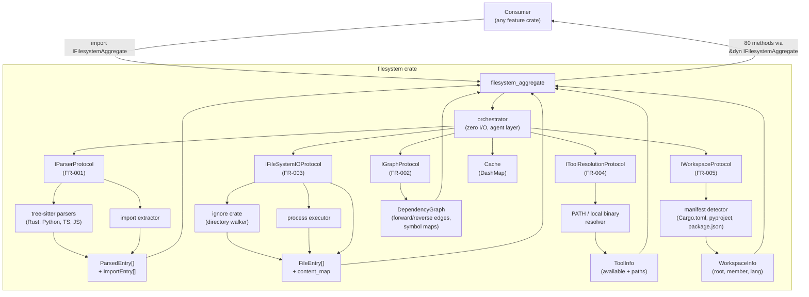

# FRD — filesystem

---

## System Overview

The filesystem crate produces filesystem data for all feature crates.

### Architecture & Data Flow



### Data Production Map


| FR | Output Data |
| --- | --- |
| FR-001 | Parsed entries + import data |
| FR-002 | Dependency graph + symbol maps |
| FR-003 | File paths, content, I/O operations |
| FR-004 | Tool availability + resolved paths |
| FR-005 | Workspace metadata (root, member, lang) |

---

## Functional Requirements

### FR-001: AST Parsing & Import Extraction

**What it produces**: File entries enriched with parse metadata + flat list of import entries, with barrel import resolution.


| Output | Description |
| --- | --- |
| Parsed entries | File entries with parse_ok flag and language-specific AST data |
| Import entries | Source file → target module mapping with resolution status |
| Resolved imports | Import entries with resolved_path populated via barrel/external resolution |
| Parse warnings | Diagnostic entries for files that failed to parse |

**Input**: File entries with content from FR-003.

**Business Rules**:

- Uses tree-sitter with language-specific grammars (Rust, Python, TypeScript, JavaScript).
- Parsing is parallel via rayon.
- Each file entry is enriched with parse_ok flag and language-specific structured metadata.
- Import extraction handles: grouped imports, glob imports, pub re-exports, relative paths, barrel files.
- Barrel import resolution resolves imports through `__init__.py`, `mod.rs`, `index.ts`, etc. to original source files.
- External crate/package import resolution scans Cargo.toml and package.json to find matching workspace members.
- Skips external dependencies and conditional imports.

**Edge Cases**:

- Syntax error: tree-sitter produces partial tree, parse_ok = false.
- Empty file: parse_ok = true, empty metadata.
- Unresolvable imports: marked as unresolved.
- Macro-generated code: invisible to parser.

**Error Handling**: Non-fatal — parse errors produce warnings, unresolvable imports marked as unresolved.

---

### FR-002: Dependency Graph Construction

**What it produces**: Structured graph data with forward links, reverse links, definitions, implementations, cycles, and orphan detection.


| Output | Description |
| --- | --- |
| Dependency graph | File → files it imports (forward edges) |
| Reverse links | File → files that import it (reverse edges) |
| Symbol definitions | Symbol name → defining file(s) |
| Implementations | Trait/interface → implementing file(s) |
| Reachability | Whether two files are connected via import chain |
| Cycles | Strongly connected components via Kosaraju algorithm |
| Orphan files | Nodes with no incoming edges |

**Input**: Import entries + parsed file entries from FR-001.

**Business Rules**:

- Nodes = source files, Edges = import relationships.
- Parallel construction via DashMap.
- Barrel re-exports resolved to original source.
- Graph queries: dependents, dependencies, reachability.
- Cycle detection via Kosaraju SCC algorithm.
- Orphan detection identifies files with no incoming import edges.

**Edge Cases**:

- Circular imports: cycles exist but don't cause errors.
- Broken imports: edge with unresolved status.
- Files with parse_ok = false: nodes but no edges.

**Error Handling**: Non-fatal — broken imports create unresolved entries.

---

### FR-003: File I/O & Directory Operations

**What it produces**: File content, directory listings, path metadata, process execution results.


| Output | Description |
| --- | --- |
| File paths | Discovered source file paths from directory walk |
| File content | String content of source files |
| Path metadata | Exists, is_dir, is_file, canonicalize, symlinks |
| Directory listings | Directory entries with ignore filtering |
| Process output | stdout/stderr/success from git and external commands |
| Scan timing | Duration breakdown of last scan |
| Cached content | Repeated reads from DashMap-backed cache |

**Input**: File paths, directory paths, command arguments.

**Business Rules**:

- Directory walk uses ignore crate (gitignore-aware, sequential).
- Filters by source file extensions.
- Respects .gitignore, .ignore, and configurable ignored paths.
- Process execution returns stdout, stderr, and success flag.
- Cache provides thread-safe repeated reads.

**Edge Cases**:

- Symlinks: follow if target is within workspace root.
- Permission denied: log warning, skip file, continue.
- Non-UTF-8 content: skip file, log warning.
- Empty directories: return empty list.
- Cache misses: fall through to disk reads.

**Error Handling**: Non-fatal — skip inaccessible files, return partial results.

---

### FR-004: Tool Resolution

**What it produces**: Tool availability status and resolved command paths.


| Output | Description |
| --- | --- |
| PATH detection | Whether executable exists in system PATH |
| Local binary | Whether executable exists in node_modules/.bin |
| JS tool command | Resolved command vector for local JS tools |
| Working directory | Resolved project root for JS/Cargo tools |
| Config detection | Whether directory contains config files (.eslintrc, tsconfig, etc) |
| Cargo manifest | Whether Cargo.toml/Cargo.lock exists in ancestors |
| Python detection | Whether path contains Python files (recursive) |

**Input**: Tool name, working directory, arguments.

**Business Rules**:

- JS tool resolution: local binary only, no npx/bunx fallback.
- Working directory resolution: walk up to find project root.
- Config detection: checks for standard config file names.
- Cargo manifest detection: walks up to find Cargo.toml/Cargo.lock.

**Error Handling**: Non-fatal — return false/None for unavailable tools.

---

### FR-005: Workspace Detection

**What it produces**: Workspace structure metadata.


| Output | Description |
| --- | --- |
| Workspace root | Root directory of the workspace |
| Member status | Whether path is a workspace member |
| Leaf member | Whether path is a member without sub-members |
| Source directory | Primary source directory (src/, lib/, etc.) |
| Language detection | ConfigLanguage from file path or manifest markers |
| Container wiring | Whether identifiers are wired in container manifest |
| Module resolver | Resolved module path relative to base directory |

**Input**: Start path (string or Path).

**Business Rules**:

- Workspace root detection: walk up looking for workspace directories + manifest.
- Member detection: Cargo.toml (no workspace), __init__.py/pyproject.toml, package.json.
- Leaf member: member without sub-members.
- Source dir: check packages/, crates/, modules/ in order.
- Language: check manifest markers.
- Container wiring: check if identifiers are referenced in Cargo.toml.
- Orphan module: resolve module path relative to base_dir, confined under root.

**Error Handling**: Non-fatal — returns None/Err for unresolvable cases.

---

## Consumer Access Pattern

All consumers import **one aggregate trait** which composes all 5 protocol traits. A single reference gives access to **80 methods** (6 + 7 + 29 + 12 + 8 + 18).

### Setup

```rust
// One-time setup
let container = FilesystemContainer::new();
let fs = container.orchestrator();

// Pass as trait object
fn lint(fs: &dyn IFilesystemAggregate) { ... }
```

---

## API Contract

All operations are accessible via `&dyn IFilesystemAggregate`. Grouped by protocol trait.

### IParserProtocol (6 operations)


| Operation | Input | Output |
| --- | --- | --- |
| parse_all | `&mut [FileEntry]` | — (mutates in-place) |
| parse_warnings | — | `&[ParseWarning]` |
| import_list | — | `Vec<ImportEntry>` |
| imports_for | `&Path` | `Vec<ImportEntry>` |
| extract | `&Path, &str, Language` | `Vec<ImportEntry>` |
| resolve_barrel_imports | `&Path` | — (populates resolved_path fields) |

### IGraphProtocol (7 operations)


| Operation | Input | Output |
| --- | --- | --- |
| build_graph | `&[ImportEntry], &[FileEntry], &[DefinitionEntry], &[ImplEntry]` | — (populates graph) |
| reverse_links | — | `&HashMap<PathBuf, Vec<PathBuf>>` |
| symbol_definitions | — | `&HashMap<String, Vec<PathBuf>>` |
| implementations | — | `&HashMap<String, Vec<PathBuf>>` |
| dependents | `&Path` | `Vec<PathBuf>` |
| dependencies | `&Path` | `Vec<PathBuf>` |
| reachable | `&Path, &Path` | `bool` |

### IFileSystemIOProtocol (29 operations)


| Operation | Input | Output |
| --- | --- | --- |
| path_exists | `&Path` | `bool` |
| is_dir | `&Path` | `bool` |
| is_file | `&Path` | `bool` |
| is_symlink | `&Path` | `bool` |
| should_ignore | `&FilePath, &[String]` | `bool` |
| is_ignored_dir | `&Path, &PatternList` | `bool` |
| is_source_file | `&Path` | `bool` |
| is_source_ext | `&FileExtension` | `bool` |
| is_python_file | `&Path` | `bool` |
| canonicalize | `&Path` | `Result<PathBuf>` |
| canonicalize_path_str | `&FilePath` | `String` |
| metadata | `&Path` | `Result<Metadata>` |
| symlink_metadata | `&Path` | `Result<Metadata>` |
| get_file_stem | `&str` | `&str` |
| get_basename | `&str` | `&str` |
| get_parent | `&str` | `&str` |
| read_to_string | `&Path` | `Result<ContentString>` |
| write_string | `&Path, &str` | `Result<()>` |
| copy_file | `&Path, &Path` | `Result<ByteCount>` |
| create_dir_all | `&Path` | `Result<()>` |
| remove_dir_all | `&Path` | `Result<()>` |
| remove_file | `&Path` | `Result<()>` |
| set_permissions | `&Path, FileMode` | `Result<()>` |
| scan_directory_with_ignored | `&Path, &PatternList` | `Vec<PathBuf>` |
| read_dir_entries_as_pathbuf | `&Path` | `Result<Vec<PathBuf>>` |
| run_git_command | `&[&str], &str` | `GitCommandResult` |
| run_external_command_in | `&str, &[&str], &str` | `(String, String, bool)` |
| parse_output_lines | `&str` | `ParsedLines` |
| timing | — | `&ScanTiming` |

### IToolResolutionProtocol (12 operations)


| Operation | Input | Output |
| --- | --- | --- |
| is_executable_in_path | `&ToolName` | `bool` |
| is_binary_available | `&ToolName` | `bool` |
| has_local_bin | `&Path, &ToolName` | `bool` |
| has_config_file | `&Path` | `bool` |
| has_cargo_toml | `&FilePath` | `Option<FilePath>` |
| has_cargo_lock | `&FilePath` | `Option<FilePath>` |
| is_python_file_recursive | `&FilePath` | `bool` |
| resolve_js_cmd | `&ToolName, Vec<String>, &FilePath` | `Option<Vec<String>>` |
| resolve_js_working_dir | `&FilePath` | `FilePath` |
| resolve_cargo_working_dir | `&FilePath` | `FilePath` |
| resolve_cargo_lock_working_dir | `&FilePath` | `FilePath` |
| default_working_dir | `&FilePath` | `FilePath` |

### IWorkspaceProtocol (8 operations)


| Operation | Input | Output |
| --- | --- | --- |
| workspace_root | `&FilePath` | `Option<PathBuf>` |
| find_workspace_root_from_path | `&Path` | `Result<PathBuf>` |
| is_member_path | `&FilePath` | `bool` |
| is_leaf_member_path | `&FilePath` | `bool` |
| detect_source_dir | `&Path` | `PathBuf` |
| detect_language_from_path | `&str` | `ConfigLanguage` |
| check_wired_in_container | `&Path, &PatternList` | `bool` |
| resolve_orphan_module_path | `&Path, &Path, &str` | `Option<PathBuf>` |

### IFilesystemAggregate — Cache Accessors & Orchestration (18 operations)


| Operation | Input | Output |
| --- | --- | --- |
| file_list | — | `&[FileEntry]` |
| read_cached | `&FilePath` | `ContentString` |
| get_file_content | `&Path` | `Option<String>` |
| has_file | `&Path` | `bool` |
| collect_file_entries | `&PatternList` | `Vec<FileContentPair>` |
| discover_source_files | `&Path, &[String]` | `Vec<String>` |
| read_file | `&Path` | `Option<String>` |
| scan_directory | `&Path` | `Vec<String>` |
| discover_files | `&Path` | `Vec<String>` |
| collect_source_files | `&Path, &[String]` | `Vec<FilePath>` |
| read_lintable_file | `&str` | `Option<String>` |
| used_identifiers_for | `&Path` | `Vec<String>` |
| implemented_traits_map | — | `HashMap<String, Vec<String>>` |
| build_file_index | `&Path` | — (populates caches) |
| build_file_index_with_ignored | `&Path, &[String]` | — (populates caches with config ignores) |
| build_orphan_graph_context | `&Path, &[String]` | `GraphAnalysisContext` |
| find_workspace_root | `&Path` | `Option<PathBuf>` |
| resolved_import_list | — | `Vec<ImportEntry>` |

---

## Non-functional Requirements

- **Performance**: Pipeline processes 1,000 files in < 2s. 10,000 files in < 10s. Accessor calls O(1).
- **Memory**: Bounded by total workspace size. Cache capped at 20,000 entries.
- **Accuracy**: Full AST via tree-sitter for all languages. No regex fallback.
- **Concurrency**: Pipeline parallel via rayon + DashMap. Trait is `Send + Sync`.
- **Configurability**: Hardcoded conventions (workspace structure, extensions). Configurable via YAML (ignored paths, workspace dirs).
- **DI**: Agent never imports concrete capability types. All dependencies injected via protocol traits.

---

## Test Scenarios

### FR-001: AST Parsing & Import Extraction


| # | Scenario | Expected |
| --- | --- | --- |
| 1 | Valid Rust file | parse_ok = true, full metadata |
| 2 | Rust file with syntax error | parse_ok = false, warning |
| 3 | Empty file | parse_ok = true, empty metadata |
| 4 | `use crate::foo::Bar` | Resolved import entry |
| 5 | `use foo::*` | Wildcard import entry |
| 6 | `#[cfg(test)] use foo::Bar` | Not extracted |
| 7 | External dependency | Not extracted |
| 8 | Barrel re-export through `mod.rs` | Resolved to original source |
| 9 | 1,000 files parsed in parallel | Completes in < 1s |

### FR-002: Dependency Graph Construction


| # | Scenario | Expected |
| --- | --- | --- |
| 1 | A imports B | Edge A → B |
| 2 | Circular imports | Both edges exist |
| 3 | `struct Foo` in A | Definition: "Foo" → A |
| 4 | `impl IBar for Foo` | Implementation: "IBar" → [A] |
| 5 | Barrel re-export | Resolved to original source |
| 6 | File with no incoming edges | Identified as orphan |
| 7 | Circular dependency chain | Cycle detected via SCC |

### FR-003: File I/O & Directory Operations


| # | Scenario | Expected |
| --- | --- | --- |
| 1 | Workspace with 100 .rs files | All 100 discovered |
| 2 | File in .gitignore | Not discovered |
| 3 | Symlink pointing outside workspace | Skipped |
| 4 | Empty directory | Empty list |
| 5 | Non-UTF-8 file | Skipped with warning |
| 6 | Read existing file | Returns content |
| 7 | Write + read back | Content matches |
| 8 | Scan with ignored patterns | Ignored files excluded |

### FR-004: Tool Resolution


| # | Scenario | Expected |
| --- | --- | --- |
| 1 | node_modules/.bin/eslint exists | Command resolved |
| 2 | Binary in system PATH | Available = true |
| 3 | Config file present | Detected = true |
| 4 | Cargo.toml in ancestor | Found |

### FR-005: Workspace Detection


| # | Scenario | Expected |
| --- | --- | --- |
| 1 | Start from crates/some-crate/src | Finds workspace root |
| 2 | Path with Cargo.toml (no workspace) | is_member = true |
| 3 | Path with Cargo.toml nearby | language = Rust |
| 4 | Leaf member detection | No sub-members |

---

## Glossary


| Term | Definition |
| --- | --- |
| **IFilesystemAggregate** | Composed trait: all 5 protocols + cache/orchestration accessors = 80 methods |
| **IParserProtocol** | AST parse results and import extraction queries |
| **IGraphProtocol** | Dependency graph, definitions, implementations, reachability, cycles, orphans |
| **IFileSystemIOProtocol** | Low-level file I/O, path ops, directory ops, process execution |
| **IToolResolutionProtocol** | External tool availability and command resolution |
| **IWorkspaceProtocol** | Workspace structure detection and navigation |
| **Container** | Composition root — creates capabilities, injects via Arc<dyn Trait> |
| **OrchestratorDeps** | DI struct — holds Arc<dyn ProtocolTrait> for agent injection |
| **FileEntry** | Value object: path + content + language + extension + parse metadata |
| **ImportEntry** | Value object: source file + target module + symbols + resolution status |
| **ParseWarning** | Diagnostic for files that failed to parse |

---

## Reference

- PRD: [PRD.md](../../PRD.md)
- Architecture: [ARCHITECTURE.md](../../ARCHITECTURE.md)
