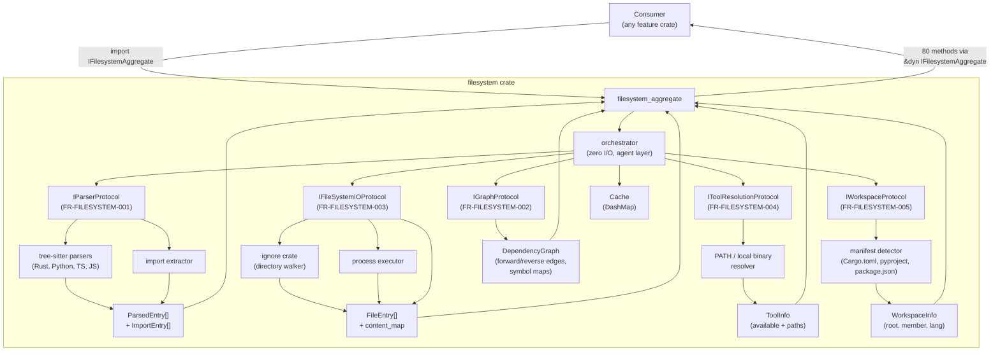

# FRD — filesystem

---

## Reference

- Backlog: [BACKLOG.md](BACKLOG.md) — real condition for this feature; this file is specification only.
- PRD: [PRD.md](../../PRD.md)
- Architecture: [ARCHITECTURE.md](../../ARCHITECTURE.md)

## System Overview

The filesystem crate produces filesystem data for all feature crates.

### Architecture & Data Flow


```mermaid
flowchart TD
    A["Consumer\n(any feature crate)"] -->|"import IFilesystemAggregate"| D["filesystem_aggregate"]

    subgraph FS ["filesystem crate"]
        D --> O["orchestrator\n(zero I/O, agent layer)"]
        O --> P1["IParserProtocol\n(FR-FILESYSTEM-001)"]
        O --> P2["IGraphProtocol\n(FR-FILESYSTEM-002)"]
        O --> P3["IFileSystemIOProtocol\n(FR-FILESYSTEM-003)"]
        O --> P4["IToolResolutionProtocol\n(FR-FILESYSTEM-004)"]
        O --> P5["IWorkspaceProtocol\n(FR-FILESYSTEM-005)"]
        O --> C["Cache\n(DashMap)"]

        P1 --> T1["tree-sitter parsers\n(Rust, Python, TS, JS)"]
        P1 --> T2["import extractor"]
        P3 --> T3["ignore crate\n(directory walker)"]
        P3 --> T4["process executor"]
        P4 --> T5["PATH / local binary\nresolver"]
        P5 --> T6["manifest detector\n(Cargo.toml, pyproject, package.json)"]

        T1 --> R1["ParsedEntry[]\n+ ImportEntry[]"]
        T2 --> R1
        P2 --> R2["DependencyGraph\n(forward/reverse edges,\nsymbol maps)"]
        T3 --> R3["FileEntry[]\n+ content_map"]
        T4 --> R3
        P3 --> R3
        T5 --> R4["ToolInfo\n(available + paths)"]
        T6 --> R5["WorkspaceInfo\n(root, member, lang)"]
    end

    R1 --> D
    R2 --> D
    R3 --> D
    R4 --> D
    R5 --> D
    D -->|"80 methods via\n&dyn IFilesystemAggregate"| A
```

### Data Production Map

| FR | Output Data |
| --- | --- |
| FR-FILESYSTEM-001 | Parsed entries + import data |
| FR-FILESYSTEM-002 | Dependency graph + symbol maps |
| FR-FILESYSTEM-003 | File paths, content, I/O operations |
| FR-FILESYSTEM-004 | Tool availability + resolved paths |
| FR-FILESYSTEM-005 | Workspace metadata (root, member, lang) |

---

## Functional Requirements

### FR-FILESYSTEM-001: AST Parsing & Import Extraction

- **Description**: Enrich file entries with parse metadata and a flat list of import entries, resolving barrel imports through module-entry source files.
- **Input**: File entries with content from FR-FILESYSTEM-003.
- **Output**: Parsed entries with `parse_ok` flag and language-specific AST data; import entries with resolved paths populated via barrel/external resolution; parse warnings for files that failed to parse.
- **Business Rules**:
  - Uses tree-sitter with language-specific grammars (Rust, Python, TypeScript, JavaScript).
  - Parsing is parallel via rayon.
  - Each file entry is enriched with parse_ok flag and language-specific structured metadata.
  - Import extraction handles: grouped imports, glob imports, pub re-exports, relative paths, barrel files.
  - Barrel import resolution resolves imports through the module-entry file of a package or namespace to original source files.
  - External crate/package import resolution scans manifest files to find matching workspace members.
  - Skips external dependencies and conditional imports.
- **Edge Cases**:
  - Syntax error: tree-sitter produces partial tree, parse_ok = false.
  - Empty file: parse_ok = true, empty metadata.
  - Unresolvable imports: marked as unresolved.
  - Macro-generated code: invisible to parser.
- **Error Handling**: Non-fatal — parse errors produce warnings, unresolvable imports marked as unresolved.

### FR-FILESYSTEM-002: Dependency Graph Construction

- **Description**: Build a dependency graph with forward links, reverse links, symbol definitions, implementations, cycles, and orphan detection.
- **Input**: Import entries + parsed file entries from FR-FILESYSTEM-001.
- **Output**: A dependency graph containing forward edges (file → files it imports), reverse edges (file → files that import it), symbol definitions, trait implementations, reachability results, strongly connected components via Kosaraju algorithm, and orphan files (nodes with no incoming edges).
- **Business Rules**:
  - Nodes = source files, Edges = import relationships.
  - Parallel construction via DashMap.
  - Barrel re-exports resolved to original source.
  - Graph queries: dependents, dependencies, reachability.
  - Cycle detection via Kosaraju SCC algorithm.
  - Orphan detection identifies files with no incoming import edges.
- **Edge Cases**:
  - Circular imports: cycles exist but don't cause errors.
  - Broken imports: edge with unresolved status.
  - Files with parse_ok = false: nodes but no edges.
- **Error Handling**: Non-fatal — broken imports create unresolved entries.

### FR-FILESYSTEM-003: File I/O & Directory Operations

- **Description**: Provide low-level file content, directory listings, path metadata, process execution results, scan timing, and cached reads.
- **Input**: File paths, directory paths, command arguments.
- **Output**: Discovered source file paths; file content strings; path metadata (exists, is_dir, is_file, canonicalize, symlinks); directory entries with ignore filtering; process stdout/stderr/success from git and external commands; duration breakdown of last scan; repeated reads from DashMap-backed cache.
- **Business Rules**:
  - Directory walk uses ignore crate (gitignore-aware, sequential).
  - Filters by source file extensions.
  - Respects gitignore patterns and configurable ignored paths.
  - Process execution returns stdout, stderr, and success flag.
  - Cache provides thread-safe repeated reads.
- **Edge Cases**:
  - Symlinks: follow if target is within workspace root.
  - Permission denied: log warning, skip file, continue.
  - Non-UTF-8 content: skip file, log warning.
  - Empty directories: return empty list.
  - Cache misses: fall through to disk reads.
- **Error Handling**: Non-fatal — skip inaccessible files, return partial results.

### FR-FILESYSTEM-004: Tool Resolution

- **Description**: Determine tool availability and resolve command paths for external linting tools.
- **Input**: Tool name, working directory, arguments.
- **Output**: PATH detection (whether executable exists in system PATH); local binary detection (whether executable exists in node_modules/.bin); resolved command vector for local JS tools; resolved project root for JS/Cargo tools; config file detection (.eslintrc, tsconfig, etc.); Cargo manifest detection (Cargo.toml/Cargo.lock in ancestors); recursive Python-file detection.
- **Business Rules**:
  - JS tool resolution: local binary only, no npx/bunx fallback.
  - Working directory resolution: walk up to find project root.
  - Config detection: checks for standard config file names.
  - Cargo manifest detection: walks up to find Cargo.toml/Cargo.lock.
- **Edge Cases**:
  - Tool not found in PATH or local binaries: returns false/None.
  - No config files present: returns false.
  - No Cargo manifest in ancestors: returns None.
- **Error Handling**: Non-fatal — return false/None for unavailable tools.

### FR-FILESYSTEM-005: Workspace Detection

- **Description**: Detect workspace structure metadata including root, member status, source directory, language, container wiring, and module resolution.
- **Input**: Start path (string or Path).
- **Output**: Workspace root directory; member status (whether path is a workspace member); leaf member status (member without sub-members); primary source directory (src/, lib/, etc.); language detected from file path or manifest markers; container wiring status (whether identifiers are wired in container manifest); resolved module path relative to base directory.
- **Business Rules**:
  - Workspace root detection: walk up looking for workspace directories + manifest.
  - Member detection: Cargo.toml (no workspace), Python package entry point, pyproject.toml, package.json.
  - Leaf member: member without sub-members.
  - Source dir: check packages/, crates/, modules/ in order.
  - Language: check manifest markers.
  - Container wiring: check if identifiers are referenced in Cargo.toml.
  - Orphan module: resolve module path relative to base_dir, confined under root.
- **Edge Cases**:
  - Path outside any workspace: returns None/Err.
  - Multiple manifest types nearby: prefers Cargo.toml, then pyproject.toml, then package.json.
  - Deeply nested member: walks up until workspace root is found.
- **Error Handling**: Non-fatal — returns None/Err for unresolvable cases.

---

## API Contract

### Protocol API

| Method | Input | Output | Error | Event | Description |
| --- | --- | --- | --- | --- | --- |
| `execute` | `FilesystemRequest` | `FilesystemResponse` | None — parse warnings and missing tools are carried as structured fields inside the response | — | Single composite entry point on the filesystem protocol trait, dispatching every request variant to the orchestrator's capabilities. |

### Aggregate API

| Method | Input | Output | Error | Event | Description |
| --- | --- | --- | --- | --- | --- |
| `build_file_index` | `&Path` | — | Non-fatal — skips inaccessible files | — | Build the full file index from a root, discovering, reading, and parsing all source files. |
| `build_file_index_with_ignored` | `&Path`, `&[String]` | — | Non-fatal — skips inaccessible files | — | Build the file index merging extra ignored patterns into the defaults. |
| `build_file_index_and_snapshot` | `&Path`, `&[String]` | — | Non-fatal — skips inaccessible files | — | Build the file index and record an import-cache snapshot for later replay. |
| `build_orphan_graph_context` | `&Path`, `&[String]` | `GraphAnalysisContext` | Non-fatal — partial context on error | — | Build a graph analysis context scoped to orphan detection, including file list and import entries. |
| `discover_source_files` | `&Path`, `&[String]` | `Vec<String>` | None — returns empty on error | — | Discover every source file under a root, respecting ignore patterns. |
| `scan_directory` | `&Path` | `Vec<String>` | None — returns empty on error | — | List directory entries for a given path. |
| `discover_files` | `&Path` | `Vec<String>` | None — returns empty on error | — | Discover files in a directory using default extensions. |
| `collect_source_files` | `&Path`, `&[String]` | `Vec<FilePath>` | None | — | Collect source file paths under a directory with optional ignores. |
| `read_lintable_file` | `&str` | `Option<String>` | None | — | Read a single lintable file's content by path string. |
| `used_identifiers_for` | `&Path` | `Vec<String>` | None | — | Return identifiers used at a path from the parsed import data. |
| `implemented_traits_map` | — | `HashMap<String, Vec<String>>` | None | — | Return the trait-to-implementing-files map built during graph construction. |
| `file_list_snapshot` | — | `Vec<FileEntry>` | None | — | Return a snapshot of all discovered source file entries. |
| `read_cached` | `&FilePath` | `ContentString` | None | — | Read a file's content from the bounded DashMap cache. |
| `get_file_content` | `&Path` | `Option<String>` | None | — | Return cached file content by path, or `None` if absent. |
| `has_file` | `&Path` | `bool` | None | — | Report whether the path is present in the current scan. |
| `collect_file_entries` | `&PatternList` | `Vec<FileContentPair>` | None | — | Collect file entries and content pairs for the current scan. |
| `find_workspace_root` | `&Path` | `Option<PathBuf>` | None | — | Walk up from a path to find the enclosing workspace root. |
| `resolved_import_list` | — | `Vec<ImportEntry>` | None | — | Return the full resolved import list for the last completed scan. |

## Integration Points

| System | Direction | Purpose | Failure mode |
| --- | --- | --- | --- |
| tree-sitter | in | Parse Rust / Python / TS source into ASTs | parse warnings; file skipped, not failed |
| rayon (or std::thread pool) | in | Parallelise per-file parse and graph construction | work cancelled mid-scan; partial graph |
| caller aggregate (e.g. naming / import / quality rules) | out | Consume `GraphAnalysisContext` produced here | caller sees stale or partial context if a walk was interrupted |

## Non-functional Requirements

| Metric | Target | Measurement method |
| --- | --- | --- |
| Pipeline throughput (1,000 files) | < 2s | Measure wall-clock time of a full scan on a 1,000-file workspace |
| Pipeline throughput (10,000 files) | < 10s | Measure wall-clock time of a full scan on a 10,000-file workspace |
| Cache accessor latency | O(1) | Benchmark `read_cached` / `get_file_content` call time |
| Cache capacity | 20,000 entries | Read the cache-cap constant from source |
| Workspace size bound | Bounded by total workspace size | Monitor RSS during scan of the largest supported workspace |
| Parser accuracy | Full AST via tree-sitter; no regex fallback | Inspect parser implementation to confirm tree-sitter is the sole path |

## Test Scenarios

- A valid Rust file yields `parse_ok = true` with full metadata.
- A Rust file with a syntax error yields `parse_ok = false` and a parse warning.
- An empty file yields `parse_ok = true` with empty metadata.
- A `use crate::foo::Bar` import is resolved into an import entry.
- A wildcard `use foo::*` import is extracted as a wildcard import entry.
- A `#[cfg(test)] use foo::Bar` import is not extracted.
- An external dependency import is not extracted.
- A barrel re-export through the module-entry file of a package is resolved to the original source.
- One thousand files are parsed in parallel and complete in under one second.
- File A importing file B produces a forward edge from A to B.
- Circular imports produce bidirectional edges in the graph.
- A struct definition in file A is captured as a symbol definition mapping "Foo" → A.
- A trait implementation `impl IBar for Foo` is captured as an implementation mapping "IBar" → [A].
- A barrel re-export in the graph is resolved to the original source file.
- A file with no incoming import edges is identified as an orphan.
- A chain of circular dependencies is detected as a cycle via the SCC algorithm.
- A workspace containing 100 `.rs` files discovers all 100.
- A file listed in a gitignore pattern is not discovered.
- A symlink pointing outside the workspace root is skipped.
- An empty directory returns an empty file list.
- A non-UTF-8 file is skipped and produces a warning.
- Reading an existing file returns its content.
- Writing then reading back produces matching content.
- A scan with ignored patterns excludes the ignored files from results.
- A `node_modules/.bin/eslint` binary exists and resolves to a command vector.
- A binary available in the system PATH is reported as available.
- A standard config file is present and detected.
- A `Cargo.toml` ancestor is found during manifest resolution.
- Scanning from `crates/some-crate/src` finds the workspace root.
- A path with a `Cargo.toml` (no workspace) reports `is_member = true`.
- A path with a nearby `Cargo.toml` reports `language = Rust`.
- A leaf member has no sub-members beneath it.

## Assumptions & Constraints

- One workspace root; paths passed in are relative to it and contain no `..` escapes.
- tree-sitter grammars for the three supported languages are always available at parse time.
- A parse warning (see `IParserProtocol::parse_warnings`) never aborts a scan; the file is treated as best-effort.
- `IGraphProtocol` results are not persisted; they live for the duration of one scan and are discarded after the caller reports.

---

## Consumer Access Pattern

All consumers import **one aggregate trait** which composes all 5 protocol traits. A single reference gives access to **80 methods** (6 + 7 + 29 + 12 + 8 + 18).

### Setup

```rust
// One-time setup
let container = FilesystemContainer::new();
let fs = container.orchestrator();

// Pass as trait object
fn lint(fs: &dyn IFilesystemAggregate) { ... }
```

---

## Glossary

- **IFilesystemAggregate**: Composed trait that aggregates all five protocol traits plus cache and orchestration accessors, providing 80 methods through a single reference.
- **IParserProtocol**: The AST parse and import-extraction seam, providing parse, warning, and import-list queries.
- **IGraphProtocol**: The dependency-graph seam, providing forward/reverse edges, symbol definitions, implementations, reachability, cycles, and orphan queries.
- **IFileSystemIOProtocol**: The low-level I/O seam, providing file-read, path, directory, process-execution, and timing operations.
- **IToolResolutionProtocol**: The external-tool seam, providing PATH-local resolution, config detection, and manifest-detection queries.
- **IWorkspaceProtocol**: The workspace-navigation seam, providing root discovery, member detection, language detection, and orphan-module resolution.
- **Container**: The composition root that creates capabilities and injects them via `Arc<dyn Trait>`.
- **OrchestratorDeps**: The DI struct that holds `Arc<dyn ProtocolTrait>` references for agent injection.
- **FileEntry**: Value object carrying a file path, content, language, extension, and parse metadata.
- **ImportEntry**: Value object carrying source file, target module, symbols, and resolution status.
- **ParseWarning**: Diagnostic attached to a file that failed to parse; non-fatal and surfaced in the response.

---