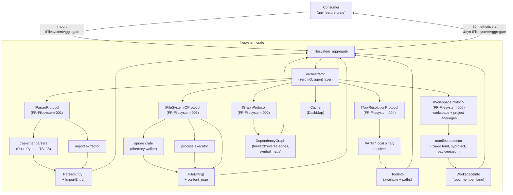

# FRD — filesystem

---

## Reference

- Backlog: [BACKLOG.md](BACKLOG.md) — real condition for this feature; this file is specification only.
- PRD: [PRD.md](../../PRD.md)
- Architecture: [ARCHITECTURE.md](../../ARCHITECTURE.md)

## System Overview

The filesystem crate produces filesystem data for all feature crates.

### Architecture & Data Flow


```mermaid
flowchart TD
    A["Consumer\n(any feature crate)"] -->|"import IFilesystemAggregate"| D["filesystem_aggregate"]

    subgraph FS ["filesystem crate"]
        D --> O["orchestrator\n(zero I/O, agent layer)"]
        O --> P1["IParserProtocol\n(FR-Filesystem-001)"]
        O --> P2["IGraphProtocol\n(FR-Filesystem-002)"]
        O --> P3["IFileSystemIOProtocol\n(FR-Filesystem-003)"]
        O --> P4["IToolResolutionProtocol\n(FR-Filesystem-004)"]
        O --> P5["IWorkspaceProtocol\n(FR-Filesystem-005)\nworkspace + project languages"]
        O --> C["Cache\n(DashMap)"]

        P1 --> T1["tree-sitter parsers\n(Rust, Python, TS, JS)"]
        P1 --> T2["import extractor"]
        P3 --> T3["ignore crate\n(directory walker)"]
        P3 --> T4["process executor"]
        P4 --> T5["PATH / local binary\nresolver"]
        P5 --> T6["manifest detector\n(Cargo.toml, pyproject, package.json)"]

        T1 --> R1["ParsedEntry[]\n+ ImportEntry[]"]
        T2 --> R1
        P2 --> R2["DependencyGraph\n(forward/reverse edges,\nsymbol maps)"]
        T3 --> R3["FileEntry[]\n+ content_map"]
        T4 --> R3
        P3 --> R3
        T5 --> R4["ToolInfo\n(available + paths)"]
        T6 --> R5["WorkspaceInfo\n(root, member, lang)"]
    end

    R1 --> D
    R2 --> D
    R3 --> D
    R4 --> D
    R5 --> D
    D -->|"80 methods via\n&dyn IFilesystemAggregate"| A

```

### Data Production Map

| FR | Output Data |
| --- | --- |
| FR-Filesystem-001 | Parsed entries + import data |
| FR-Filesystem-002 | Dependency graph + symbol maps |
| FR-Filesystem-003 | File paths, content, I/O operations |
| FR-Filesystem-004 | Tool availability + resolved paths |
| FR-Filesystem-005 | Workspace metadata + project language presence flags |

---

## Functional Requirements

### FR-Filesystem-001: AST Parsing & Import Extraction

**Description**: Parses source files using tree-sitter and extracts import statements, producing structured file entries with parse metadata and import data.

**What it produces**: File entries enriched with parse metadata + flat list of import entries, with barrel import resolution.

| Output | Description |
| --- | --- |
| Parsed entries | File entries with parse_ok flag and language-specific AST data |
| Import entries | Source file → target module mapping with resolution status |
| Resolved imports | Import entries with resolved_path populated via barrel/external resolution |
| Parse warnings | Diagnostic entries for files that failed to parse |

**Output**: Parsed file entries with metadata, import entry list, and optional parse warnings.

**Input**: File entries with content from FR-Filesystem-003.

**Business Rules**:

- Uses tree-sitter with language-specific grammars (Rust, Python, TypeScript, JavaScript).
- Parsing is parallel via rayon.
- Each file entry is enriched with parse_ok flag and language-specific structured metadata.
- Import extraction handles: grouped imports, glob imports, pub re-exports, relative paths, barrel files.
- Barrel import resolution resolves imports through the language's barrel file to original source files.
- External crate/package import resolution scans Cargo.toml and package.json to find matching workspace members.
- Skips external dependencies and conditional imports.

**Edge Cases**:

- Syntax error: tree-sitter produces partial tree, parse_ok = false.
- Empty file: parse_ok = true, empty metadata.
- Unresolvable imports: marked as unresolved.
- Macro-generated code: invisible to parser.

**Error Handling**: Non-fatal — parse errors produce warnings, unresolvable imports marked as unresolved.

---

### FR-Filesystem-002: Dependency Graph Construction

**Description**: Builds a dependency graph from parsed file entries, computing forward/reverse edges, symbol definitions, implementations, reachability, cycles, and orphan detection.

**What it produces**: Structured graph data with forward links, reverse links, definitions, implementations, cycles, and orphan detection.

| Output | Description |
| --- | --- |
| Dependency graph | File → files it imports (forward edges) |
| Reverse links | File → files that import it (reverse edges) |
| Symbol definitions | Symbol name → defining file(s) |
| Implementations | Trait/interface → implementing file(s) |
| Reachability | Whether two files are connected via import chain |
| Cycles | Strongly connected components via Kosaraju algorithm |
| Orphan files | Nodes with no incoming edges |

**Output**: Dependency graph with forward/reverse edges, symbol maps, implementation maps, reachability queries, cycle detection, and orphan file list.

**Input**: Import entries + parsed file entries from FR-Filesystem-001.

**Business Rules**:

- Nodes = source files, Edges = import relationships.
- Parallel construction via DashMap.
- Barrel re-exports resolved to original source.
- Graph queries: dependents, dependencies, reachability.
- Cycle detection via Kosaraju SCC algorithm.
- Orphan detection identifies files with no incoming import edges.

**Edge Cases**:

- Circular imports: cycles exist but don't cause errors.
- Broken imports: edge with unresolved status.
- Files with parse_ok = false: nodes but no edges.

**Error Handling**: Non-fatal — broken imports create unresolved entries.

---

### FR-Filesystem-003: File I/O & Directory Operations

**Description**: Performs file system I/O operations including directory walking, file content reading, path metadata queries, and external command execution with caching.

**What it produces**: File content, directory listings, path metadata, process execution results.

| Output | Description |
| --- | --- |
| File paths | Discovered source file paths from directory walk |
| File content | String content of source files |
| Path metadata | Exists, is_dir, is_file, canonicalize, symlinks |
| Directory listings | Directory entries with ignore filtering |
| Process output | stdout/stderr/success from git and external commands |
| Scan timing | Duration breakdown of last scan |
| Cached content | Repeated reads from DashMap-backed cache |

**Output**: File paths, content strings, path metadata, directory listings, process results, timing data, and cached content.

**Input**: File paths, directory paths, command arguments.

**Business Rules**:

- Directory walk uses ignore crate (gitignore-aware, sequential).
- Filters by source file extensions.
- Respects .gitignore, .ignore, and configurable ignored paths.
- Process execution returns stdout, stderr, and success flag.
- Cache provides thread-safe repeated reads.

**Edge Cases**:

- Symlinks: follow if target is within workspace root.
- Permission denied: log warning, skip file, continue.
- Non-UTF-8 content: skip file, log warning.
- Empty directories: return empty list.
- Cache misses: fall through to disk reads.

**Error Handling**: Non-fatal — skip inaccessible files, return partial results.

---

### FR-Filesystem-004: Tool Resolution

**Description**: Resolves external tool availability and command paths by checking system PATH, local binaries, and project configuration files.

**What it produces**: Tool availability status and resolved command paths.

| Output | Description |
| --- | --- |
| PATH detection | Whether executable exists in system PATH |
| Local binary | Whether executable exists in node_modules/.bin |
| JS tool command | Resolved command vector for local JS tools |
| Working directory | Resolved project root for JS/Cargo tools |
| Config detection | Whether directory contains config files (.eslintrc, tsconfig, etc) |
| Cargo manifest | Whether Cargo.toml/Cargo.lock exists in ancestors |
| Python detection | Whether path contains Python files (recursive) |

**Output**: Tool availability boolean, resolved command vectors, working directory paths, and config detection flags.

**Input**: Tool name, working directory, arguments.

**Business Rules**:

- JS tool resolution: local binary only, no npx/bunx fallback.
- Working directory resolution: walk up to find project root.
- Config detection: checks for standard config file names.
- Cargo manifest detection: walks up to find Cargo.toml/Cargo.lock.

**Edge Cases**:

- Binary not found: returns false for all resolution attempts.
- Multiple matches in PATH: uses first match (standard resolution order).
- Symlinked binaries: resolves through symlinks to actual path.

**Error Handling**: Non-fatal — return false/None for unavailable tools.

---

### FR-Filesystem-005: Workspace & Project Language Detection

**Description**: Detects workspace root, member status, source directories, project-level language presence flags, and language configuration from file paths and manifest markers.

**What it produces**: Workspace structure metadata plus `ProjectLanguagesVO`.

| Output | Description |
| --- | --- |
| Workspace root | Root directory of the workspace |
| Member status | Whether path is a workspace member |
| Leaf member | Whether path is a member without sub-members |
| Source directory | Primary source directory (src/, lib/, etc.) |
| Language detection | ConfigLanguage from file path or manifest markers |
| Project languages | `ProjectLanguagesVO` — boolean flags for Rust, Python, JS/TS, and Markdown file presence under the root |
| Container wiring | Whether identifiers are wired in container manifest |
| Module resolver | Resolved module path relative to base directory |

**Output**: Workspace root path, member status flags, source directory path, language enum, project language presence flags, wiring boolean, and resolved module path.

**Input**: Start path (string or Path).

**Business Rules**:

- Workspace root detection: walk up looking for workspace directories + manifest.
- Member detection: a Rust manifest without a workspace table, a Python package marker or manifest, a Node manifest.
- Leaf member: member without sub-members.
- Source dir: check packages/, crates/, modules/ in order.
- Language: check manifest markers.
- Container wiring: check if identifiers are referenced in Cargo.toml.
- Orphan module: resolve module path relative to base_dir, confined under root.
- Project language detection (FR-005B): walk the project root and classify extensions into four presence flags — `.rs` → `has_rust`, `.py` → `has_python`, `.js/.jsx/.ts/.tsx` → `has_js`, `.md/.markdown` → `has_markdown`. Short-circuits when all four are found. Directories in `DEFAULT_IGNORED_PATHS` are skipped. A single-file input classifies only that file's extension.

**Edge Cases**:

- Path outside workspace: returns None for root, false for member checks.
- Multiple manifests: uses closest ancestor as workspace root.
- Non-standard layouts: falls back to heuristic detection.
- Empty project: all language flags false.
- Unknown extensions: ignored.

**Error Handling**: Non-fatal — returns None/Err for unresolvable cases. Returns partial flags for whatever was found before any I/O error.

---

## API Contract

### Protocol API

| Method | Input | Output | Error | Event | Description |
|---|---|---|---|---|---|
| `path_exists` | &Path | `bool` | — | — | Path exists. |
| `is_dir` | &Path | `bool` | — | — | Is dir. |
| `is_file` | &Path | `bool` | — | — | Is file. |
| `should_ignore` | &crate::common::taxonomy_path_vo::FilePath, &[String] | `bool` | — | — | Should ignore. |
| `canonicalize` | &Path | `PathBuf` | `std::io::Error` | — | Canonicalize. |
| `canonicalize_path_str` | &FilePath | `FilePath` | — | — | Canonicalize path str. |
| `is_symlink` | &Path | `bool` | — | — | Is symlink. |
| `metadata` | &Path | `std::fs::Metadata` | `std::io::Error` | — | Metadata. |
| `symlink_metadata` | &Path | `std::fs::Metadata` | `std::io::Error` | — | Symlink metadata. |
| `get_file_stem` | &'a str | `&'a str` | — | — | Get file stem. |
| `is_source_file` | &Path | `bool` | — | — | Is source file. |
| `is_source_ext` | &FileExtension | `bool` | — | — | Is source ext. |
| `get_basename` | &'a str | `&'a str` | — | — | Get basename. |
| `get_parent` | &'a str | `&'a str` | — | — | Get parent. |
| `is_python_file` | &Path | `bool` | — | — | Is python file. |
| `scan_directory_with_ignored` | &Path, &PatternList | `Vec<PathBuf>` | — | — | Scan directory with ignored. |
| `is_ignored_dir` | &Path, &PatternList | `bool` | — | — | Is ignored dir. |
| `read_dir_entries_as_pathbuf` | &Path | `Vec<PathBuf>` | `std::io::Error` | — | Read dir entries as pathbuf. |
| `read_to_string` | &Path | `ContentString` | `std::io::Error` | — | Read to string. |
| `write_string` | &Path, &str | `()` | `std::io::Error` | — | Write string. |
| `copy_file` | &Path, &Path | `ByteCount` | `std::io::Error` | — | Copy file. |
| `create_dir_all` | &Path | `()` | `std::io::Error` | — | Create dir all. |
| `remove_dir_all` | &Path | `()` | `std::io::Error` | — | Remove dir all. |
| `set_permissions` | &Path, FileMode | `()` | `io::Error` | — | Set permissions. |
| `remove_file` | &Path | `()` | `io::Error` | — | Remove file. |
| `run_git_command` | &[&str], &str | `GitCommandResult` | — | — | Run git command. |
| `parse_output_lines` | &str | `ParsedLines` | — | — | Parse output lines. |
| `run_external_command_in` | &str, &[&str], &str | `(String, String, bool)` | — | — | Run external command in. |
| `timing` | — | `&ScanTiming` | — | — | Timing. |
| `build_graph` | &[ImportEntry], &[FileEntry], &[DefinitionEntry], &[ImplEntry] | `` | — | — | Build graph. |
| `symbol_definitions` | — | `&HashMap<String, Vec<PathBuf>>` | — | — | Symbol definitions. |
| `implementations` | — | `&HashMap<String, Vec<PathBuf>>` | — | — | Implementations. |
| `dependents` | &Path | `Vec<PathBuf>` | — | — | Dependents. |
| `dependencies` | &Path | `Vec<PathBuf>` | — | — | Dependencies. |
| `reachable` | &Path, &Path | `bool` | — | — | Reachable. |
| `reverse_links` | — | `&HashMap<PathBuf, Vec<PathBuf>>` | — | — | Reverse links. |
| `parse_warnings` | — | `&[ParseWarning]` | — | — | Parse warnings. |
| `import_list` | — | `Vec<ImportEntry>` | — | — | Import list. |
| `parse_all` | &mut [FileEntry] | `` | — | — | Parse all. |
| `imports_for` | &Path | `Vec<ImportEntry>` | — | — | Imports for. |
| `extract` | &Path, &str, Language | `Vec<ImportEntry>` | — | — | Extract. |
| `resolve_barrel_imports` | &Path | `` | — | — | Resolve barrel imports. |
| `is_executable_in_path` | &ToolName | `bool` | — | — | Is executable in path. |
| `is_binary_available` | &ToolName | `bool` | — | — | Is binary available. |
| `has_local_bin` | &Path, &ToolName | `bool` | — | — | Has local bin. |
| `resolve_js_cmd` | `&ToolName, Vec<String>, &FilePath` | `Option<Vec<String>>` | — | — | Resolve js cmd. |
| `resolve_js_working_dir` | &FilePath | `FilePath` | — | — | Resolve js working dir. |
| `resolve_cargo_working_dir` | &FilePath | `FilePath` | — | — | Resolve cargo working dir. |
| `resolve_cargo_lock_working_dir` | &FilePath | `FilePath` | — | — | Resolve cargo lock working dir. |
| `has_config_file` | &Path | `bool` | — | — | Has config file. |
| `has_cargo_toml` | &FilePath | `Option<FilePath>` | — | — | Has cargo toml. |
| `has_cargo_lock` | &FilePath | `Option<FilePath>` | — | — | Has cargo lock. |
| `is_python_file_recursive` | &FilePath | `bool` | — | — | Is python file recursive. |
| `default_working_dir` | &FilePath | `FilePath` | — | — | Default working dir. |
| `workspace_root` | &FilePath | `Option<PathBuf>` | — | — | Workspace root. |
| `find_workspace_root_from_path` | &Path | `PathBuf` | `std::io::Error` | — | Find workspace root from path. |
| `is_member_path` | &FilePath | `bool` | — | — | Is member path. |
| `is_leaf_member_path` | &FilePath | `bool` | — | — | Is leaf member path. |
| `detect_source_dir` | &Path | `PathBuf` | — | — | Detect source dir. |
| `detect_language_from_path` | &str | `ConfigLanguage` | — | — | Detect language from path. |
| `check_wired_in_container` | &Path, &PatternList | `bool` | — | — | Check wired in container. |
| `resolve_orphan_module_path` | &Path, &Path, &str | `Option<PathBuf>` | — | — | Resolve orphan module path. |

### Aggregate API

| Method | Input | Output | Error | Event | Description |
|---|---|---|---|---|---|
| `execute` | FilesystemRequest | `FilesystemResponse` | — | — | Single composite entry point over the feature. |

## Integration Points

| System | Direction | Purpose | Failure mode |
|--------|-----------|---------|--------------|
| tree-sitter | in | Parse Rust / Python / TS source into ASTs | parse warnings; file skipped, not failed |
| rayon (or std::thread pool) | in | Parallelise per-file parse and graph construction | work cancelled mid-scan; partial graph |
| caller aggregate (e.g. naming / import / quality rules) | out | Consume `GraphAnalysisContext` produced here | caller sees stale or partial context if a walk was interrupted |

## Non-functional Requirements
| Metric | Target | Measurement method |
| --- | --- | --- |
| Pipeline throughput (indexing scope) | 1,000 files in under 2 s; 10,000 files in under 10 s — this crate's own build-index run: discovery, read, parse | Time a full build-index run over workspaces of each size, with the Criterion benches under this crate; the recorded figure is the evidence for the matching row in `PRD.md` |
| Pipeline throughput (full-pipeline scope) | 1,000 files in under 5 s; 10,000 files in under 15 s — indexing plus every rule group, external adapters excluded | Time a `check` run over workspaces of each size; the indexing budget above is the lower bound inside it |
| Accessor cost | Cache accessors are O(1) | Call an accessor repeatedly and confirm constant time across cache sizes |
| Cache bound | The content cache is capped at 20,000 entries | Inspect the cap and assert insertion beyond it does not grow the cache |
| Memory | Bounded by total workspace size | Measure retained memory against two workspace sizes |
| Parsing accuracy | Full AST parsing for all supported languages, with no regex fallback | Assert the parse path is the only path, and that identifier extraction from a string literal yields nothing |
| Parse-failure handling | A parse warning never aborts a scan; the file is treated as best-effort | Feed an unparseable file and assert the scan completes and reports a warning |
| Concurrency | The pipeline is parallel and the aggregate is `Send + Sync` | Assert the bounds at compile time and share one aggregate across threads in a test |
| Configuration | Workspace layout and extensions are compiled-in; ignored paths and workspace directories are configurable | Assert a configured ignore path excludes a file from the walk |
| Dependency injection | No layer imports a concrete implementation; every dependency arrives through a protocol | Assert the agent module has no concrete capability imports |

## Test Scenarios

Each scenario is stated below as a table of cases: the input condition and the expected result.

- **SCEN-001: AST Parsing & Import Extraction** — e.g. Valid Rust file → parse_ok = true, full metadata
- **SCEN-002: Dependency Graph Construction** — e.g. A imports B → Edge A → B
- **SCEN-003: File I/O & Directory Operations** — e.g. Workspace with 100 .rs files → All 100 discovered
- **SCEN-004: Tool Resolution** — e.g. node_modules/.bin/eslint exists → Command resolved
- **SCEN-005: Workspace Detection** — e.g. Start from crates/some-crate/src → Finds workspace root

### SCEN-001: AST Parsing & Import Extraction

| # | Scenario | Expected |
| --- | --- | --- |
| 1 | Valid Rust file | parse_ok = true, full metadata |
| 2 | Rust file with syntax error | parse_ok = false, warning |
| 3 | Empty file | parse_ok = true, empty metadata |
| 4 | `use crate::foo::Bar` | Resolved import entry |
| 5 | `use foo::*` | Wildcard import entry |
| 6 | `#[cfg(test)] use foo::Bar` | Not extracted |
| 7 | External dependency | Not extracted |
| 8 | Barrel re-export through a Rust module barrel | Resolved to original source |
| 9 | 1,000 files parsed in parallel | Completes in under 1 s |

### SCEN-002: Dependency Graph Construction

| # | Scenario | Expected |
| --- | --- | --- |
| 1 | A imports B | Edge A → B |
| 2 | Circular imports | Both edges exist |
| 3 | `struct Foo` in A | Definition: "Foo" → A |
| 4 | `impl IBar for Foo` | Implementation: "IBar" → [A] |
| 5 | Barrel re-export | Resolved to original source |
| 6 | File with no incoming edges | Identified as orphan |
| 7 | Circular dependency chain | Cycle detected via SCC |

### SCEN-003: File I/O & Directory Operations

| # | Scenario | Expected |
| --- | --- | --- |
| 1 | Workspace with 100 .rs files | All 100 discovered |
| 2 | File in .gitignore | Not discovered |
| 3 | Symlink pointing outside workspace | Skipped |
| 4 | Empty directory | Empty list |
| 5 | Non-UTF-8 file | Skipped with warning |
| 6 | Read existing file | Returns content |
| 7 | Write + read back | Content matches |
| 8 | Scan with ignored patterns | Ignored files excluded |

### SCEN-004: Tool Resolution

| # | Scenario | Expected |
| --- | --- | --- |
| 1 | node_modules/.bin/eslint exists | Command resolved |
| 2 | Binary in system PATH | Available = true |
| 3 | Config file present | Detected = true |
| 4 | Cargo.toml in ancestor | Found |

### SCEN-005: Workspace Detection

| # | Scenario | Expected |
| --- | --- | --- |
| 1 | Start from crates/some-crate/src | Finds workspace root |
| 2 | Path with Cargo.toml (no workspace) | is_member = true |
| 3 | Path with Cargo.toml nearby | language = Rust |
| 4 | Leaf member detection | No sub-members |

---

## Assumptions & Constraints

- One workspace root; paths passed in are relative to it and contain no `..` escapes.
- tree-sitter grammars for the three supported languages are always available at parse time.
- A parse warning (see `IParserProtocol::parse_warnings`) never aborts a scan; the file is treated as best-effort.
- `IGraphProtocol` results are not persisted; they live for the duration of one scan and are discarded after the caller reports.

### IParserProtocol (6 operations)

| Operation | Input | Output |
| --- | --- | --- |
| parse_all | `&mut [FileEntry]` | — (mutates in-place) |
| parse_warnings | — | `&[ParseWarning]` |
| import_list | — | `Vec<ImportEntry>` |
| imports_for | `&Path` | `Vec<ImportEntry>` |
| extract | `&Path, &str, Language` | `Vec<ImportEntry>` |
| resolve_barrel_imports | `&Path` | — (populates resolved_path fields) |

### IGraphProtocol (7 operations)

| Operation | Input | Output |
| --- | --- | --- |
| build_graph | `&[ImportEntry], &[FileEntry], &[DefinitionEntry], &[ImplEntry]` | — (populates graph) |
| reverse_links | — | `&HashMap<PathBuf, Vec<PathBuf>>` |
| symbol_definitions | — | `&HashMap<String, Vec<PathBuf>>` |
| implementations | — | `&HashMap<String, Vec<PathBuf>>` |
| dependents | `&Path` | `Vec<PathBuf>` |
| dependencies | `&Path` | `Vec<PathBuf>` |
| reachable | `&Path, &Path` | `bool` |

### IFileSystemIOProtocol (29 operations)

| Operation | Input | Output |
| --- | --- | --- |
| path_exists | `&Path` | `bool` |
| is_dir | `&Path` | `bool` |
| is_file | `&Path` | `bool` |
| is_symlink | `&Path` | `bool` |
| should_ignore | `&FilePath, &[String]` | `bool` |
| is_ignored_dir | `&Path, &PatternList` | `bool` |
| is_source_file | `&Path` | `bool` |
| is_source_ext | `&FileExtension` | `bool` |
| is_python_file | `&Path` | `bool` |
| canonicalize | `&Path` | `Result<PathBuf>` |
| canonicalize_path_str | `&FilePath` | `String` |
| metadata | `&Path` | `Result<Metadata>` |
| symlink_metadata | `&Path` | `Result<Metadata>` |
| get_file_stem | `&str` | `&str` |
| get_basename | `&str` | `&str` |
| get_parent | `&str` | `&str` |
| read_to_string | `&Path` | `Result<ContentString>` |
| write_string | `&Path, &str` | `Result<()>` |
| copy_file | `&Path, &Path` | `Result<ByteCount>` |
| create_dir_all | `&Path` | `Result<()>` |
| remove_dir_all | `&Path` | `Result<()>` |
| remove_file | `&Path` | `Result<()>` |
| set_permissions | `&Path, FileMode` | `Result<()>` |
| scan_directory_with_ignored | `&Path, &PatternList` | `Vec<PathBuf>` |
| read_dir_entries_as_pathbuf | `&Path` | `Result<Vec<PathBuf>>` |
| run_git_command | `&[&str], &str` | `GitCommandResult` |
| run_external_command_in | `&str, &[&str], &str` | `(String, String, bool)` |
| parse_output_lines | `&str` | `ParsedLines` |
| timing | — | `&ScanTiming` |

### IToolResolutionProtocol (12 operations)

| Operation | Input | Output |
| --- | --- | --- |
| is_executable_in_path | `&ToolName` | `bool` |
| is_binary_available | `&ToolName` | `bool` |
| has_local_bin | `&Path, &ToolName` | `bool` |
| has_config_file | `&Path` | `bool` |
| has_cargo_toml | `&FilePath` | `Option<FilePath>` |
| has_cargo_lock | `&FilePath` | `Option<FilePath>` |
| is_python_file_recursive | `&FilePath` | `bool` |
| resolve_js_cmd | `&ToolName, Vec<String>, &FilePath` | `Option<Vec<String>>` |
| resolve_js_working_dir | `&FilePath` | `FilePath` |
| resolve_cargo_working_dir | `&FilePath` | `FilePath` |
| resolve_cargo_lock_working_dir | `&FilePath` | `FilePath` |
| default_working_dir | `&FilePath` | `FilePath` |

### IWorkspaceProtocol (8 operations)

| Operation | Input | Output |
| --- | --- | --- |
| workspace_root | `&FilePath` | `Option<PathBuf>` |
| find_workspace_root_from_path | `&Path` | `Result<PathBuf>` |
| is_member_path | `&FilePath` | `bool` |
| is_leaf_member_path | `&FilePath` | `bool` |
| detect_source_dir | `&Path` | `PathBuf` |
| detect_language_from_path | `&str` | `ConfigLanguage` |
| check_wired_in_container | `&Path, &PatternList` | `bool` |
| resolve_orphan_module_path | `&Path, &Path, &str` | `Option<PathBuf>` |

### IFilesystemAggregate — Cache Accessors & Orchestration (18 operations)

| Operation | Input | Output |
| --- | --- | --- |
| file_list | — | `&[FileEntry]` |
| read_cached | `&FilePath` | `ContentString` |
| get_file_content | `&Path` | `Option<String>` |
| has_file | `&Path` | `bool` |
| collect_file_entries | `&PatternList` | `Vec<FileContentPair>` |
| discover_source_files | `&Path, &[String]` | `Vec<String>` |
| read_file | `&Path` | `Option<String>` |
| scan_directory | `&Path` | `Vec<String>` |
| discover_files | `&Path` | `Vec<String>` |
| collect_source_files | `&Path, &[String]` | `Vec<FilePath>` |
| read_lintable_file | `&str` | `Option<String>` |
| used_identifiers_for | `&Path` | `Vec<String>` |
| implemented_traits_map | — | `HashMap<String, Vec<String>>` |
| build_file_index | `&Path` | — (populates caches) |
| build_file_index_with_ignored | `&Path, &[String]` | — (populates caches with config ignores) |
| build_orphan_graph_context | `&Path, &[String]` | `GraphAnalysisContext` |
| find_workspace_root | `&Path` | `Option<PathBuf>` |
| resolved_import_list | — | `Vec<ImportEntry>` |

---

## Glossary

- **IFilesystemAggregate**: Composed trait: all 5 protocols + cache/orchestration accessors = 80 methods
- **IParserProtocol**: AST parse results and import extraction queries
- **IGraphProtocol**: Dependency graph, definitions, implementations, reachability, cycles, orphans
- **IFileSystemIOProtocol**: Low-level file I/O, path ops, directory ops, process execution
- **IToolResolutionProtocol**: External tool availability and command resolution
- **IWorkspaceProtocol**: Workspace structure detection and navigation
- **Container**: Composition root — creates capabilities, injects via `Arc<dyn Trait>`
- **OrchestratorDeps**: DI struct — holds `Arc<dyn ProtocolTrait>` for agent injection
- **FileEntry**: Value object: path + content + language + extension + parse metadata
- **ImportEntry**: Value object: source file + target module + symbols + resolution status
- **ParseWarning**: Diagnostic for files that failed to parse

---

### Consumer Access Pattern

All consumers import **one aggregate trait** which composes all 5 protocol traits. A single reference gives access to **80 methods** (6 + 7 + 29 + 12 + 8 + 18).

### Setup

```rust
// One-time setup
let container = FilesystemContainer::new();
let fs = container.orchestrator();

// Pass as trait object
fn lint(fs: &dyn IFilesystemAggregate) { ... }
```

---
