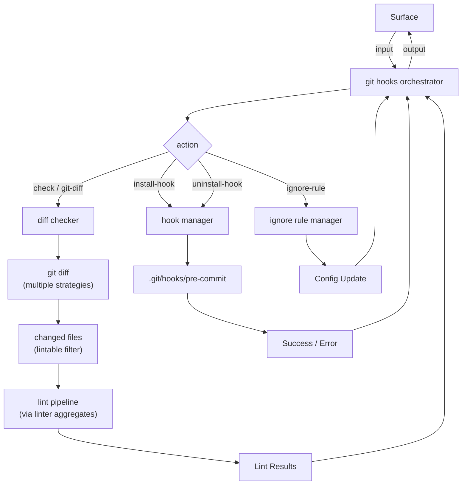

# FRD — git-hooks (v1.11.0)

---

## System Overview

The git-hooks crate implements a pre-commit hook system that enforces AES
compliance before code enters the repository. It detects changed files via
git diff, runs linting only on modified files, and blocks commits that
violate AES rules.

The crate follows the AES 7-layer architecture: the diff checker and hook
manager (capabilities) implement the diff protocol and hook protocol, the
git hook adapter (capabilities) implements the hook manager protocol for
low-level hook file operations, the git hooks orchestrator (agent) composes
the three protocols, and the git container (root) wires dependencies.

### Architecture & Data Flow



---

## Functional Requirements

### FR-001: Git Diff Detection

- **Description**: Identify files changed between the current HEAD and the
  default branch using git diff commands.
- **Input**: `FilePath` (project root directory).
- **Output**: `GitDiffResultVO` containing lists of added, modified, deleted,
  renamed files; a filtered `lintable_files` list; and total change count.
- **Business Rules**:

  - Default branch detection: runs
    `git symbolic-ref refs/remotes/origin/HEAD`, falls back to `"main"`.
  - Changed file collection tries multiple diff variants in order:
    1. `origin/<branch>...HEAD`
    2. `HEAD...origin/<branch>`
    3. `<branch>...HEAD`
    4. `master...HEAD`
  - Falls back to `git diff --name-only HEAD` if all variants return empty.
  - Final fallback: `git ls-files --modified --others --exclude-standard`.
  - Lintable file filter (source code only):
    `.rs`, `.py`, `.ts`, `.js`, `.jsx`, `.tsx`.
  - Non-source files (`.md`, `.toml`, `.json`, `.yaml`, `.yml`, `.lock`,
    images, binaries) are excluded from lintable list.
- **Edge Cases**:

  - No git repository → diff commands fail silently, returns empty result.
  - No remote configured → `symbolic-ref` fails, defaults to `"main"`.
  - No changes between branches → returns empty lists with
    `total_changed: 0`.
  - Detached HEAD state → diff variants may all fail; falls back to `HEAD`
    diff.
  - Shallow clone → diff may not find base branch; fallback strategies
    handle this.
- **Error Handling**:

  - Git command failure (non-zero exit) → treated as no changes for that
    variant.
  - Invalid `FilePath` from git output → skipped silently.

---

### FR-002: Pre-Commit Hook Installation

- **Description**: Install a pre-commit hook script into `.git/hooks/` that
  runs `lint-arwaky check .` before each commit.
- **Input**: `FilePath` (path to the `lint-arwaky` executable).
- **Output**: `SuccessStatus` indicating whether the hook was installed.
- **Business Rules**:

  - Hook script content:
    ```bash
    #!/bin/bash
    # Lint Arwaky Pre-Commit Hook
    echo "Running Lint Arwaky check..."
    <executable> check .
    if [ $? -ne 0 ]; then
      echo "Linting failed. Please fix issues before committing."
      exit 1
    fi
    echo "Linting passed."
    exit 0
    ```
  - Creates `.git/hooks/` directory if it does not exist.
  - Sets hook file permissions to `0o755` on Unix systems.
  - If executable path is empty, defaults to `"lint-arwaky-cli"`.
  - If not a git repository (no `.git/` dir) → returns
    `SuccessStatus(false)` without error.
- **Edge Cases**:

  - `.git/hooks/` already exists → directory creation is idempotent.
  - Hook file already exists → overwritten.
  - Not a git repository → returns success with `false` (not an error).
  - Windows → permission setting is skipped (Unix-only feature).
- **Error Handling**:

  - Directory creation failure → returns `GitHookError` with message.
  - File write failure → returns `GitHookError` with message.
  - Permission set failure → returns `GitHookError` with message.

---

### FR-003: Pre-Commit Hook Uninstallation

- **Description**: Remove the pre-commit hook script from `.git/hooks/`.
- **Input**: None.
- **Output**: `SuccessStatus` indicating whether the hook was removed.
- **Business Rules**:

  - Removes `.git/hooks/pre-commit` if it exists.
  - If not a git repository → returns `SuccessStatus(false)` without error.
  - If hook file does not exist → returns `SuccessStatus(true)`
    (already clean).
- **Edge Cases**:

  - Hook file does not exist → returns success (idempotent).
  - Not a git repository → returns success with `false`.
- **Error Handling**: File removal failure → returns `GitHookError` with
  message.

---

### FR-004: Git Hooks Check Execution

- **Description**: Run the git diff check and lint pipeline on changed files.
- **Input**: `FilePath` (project root).
- **Output**: `LintResultList` containing lint results for changed files.
- **Business Rules**:

  - Collects changed files via FR-001 (git diff detection).
  - Filters to lintable source files only.
  - Delegates to linter aggregates for AES analysis on changed files.
  - Files that fail to parse are skipped by the linter aggregates; no separate
    parse-warning diagnostic is included in output.
  - Only lintable file types (per FR-001 filter) are included.
- **Edge Cases**:

  - No changed files → returns empty `LintResultList`.
  - All changed files are non-lintable → returns empty list.
  - Changed file with parse failure → skipped by the linter aggregates for
    AES checks.
- **Error Handling**: Git command failure → treated as no changes.

---

### FR-005: Diff Data Comparison

- **Description**: Compare two file paths to determine their diff status
  and content difference score.
- **Input**: Two file path strings.
- **Output**: `GitDiffDataVO` with version info, difference score, and
  status.
- **Business Rules**:

  - Status is determined by file existence:
    - First missing → `MissingFirst`.
    - Second missing → `MissingSecond`.
    - Both exist but not files → `NotAFile`.
    - Both exist and are files → content comparison performed.
  - Difference score calculation:
    - Read both files as bytes.
    - Score = 1.0 − (matching bytes / max file size).
    - Identical files → score `0.0`.
    - Completely different files → score `1.0`.
    - One file empty → score `1.0`.
  - Status for existing files:
    - Score `0.0` → `Unchanged`.
    - Score > `0.0` → `Modified`.
- **Edge Cases**:

  - Both paths are the same file → status `Unchanged`, score `0.0`.
  - Paths are directories → `NotAFile`.
  - File read failure → score `1.0`, status `Modified` (assume changed).
- **Error Handling**: File read errors result in score `1.0` (assume
  modified). No crash.

---

### FR-006: Ignore Rule Management

- **Description**: Manage ignore rules in the lint-arwaky config file for
  git-hooks specific exclusions.
- **Input**: `HookIgnoreUpdateVO` (rule path, add/remove action).
- **Output**: `DescriptionVO` with status message.
- **Business Rules**:

  - Locates config file using config-system resolution
    (`lint_arwaky.config.yaml`).
  - Adds or removes a path from the `ignored_paths` list in the config file.
  - If config file not found → returns error message suggesting
    `lint-arwaky-cli init`.
  - Config initialization is handled by the **project-setup** crate, not
    git-hooks.
- **Edge Cases**:

  - Config file not found → returns descriptive error.
  - Rule already exists (add) → no-op, returns "already present".
  - Rule not found (remove) → no-op, returns "not found".
- **Error Handling**: Config file not found → returns error description.
  Config parse failure → returns error description.

---

## API Contract


| Operation                 | Input                     | Output                           | Purpose                                    |
| --------------------------- | --------------------------- | ---------------------------------- | -------------------------------------------- |
| Git hooks check           | project root              | Lint results                     | Run diff and lint changed files            |
| Get diff                  | project root              | Diff result with lintable filter | Get full diff result                       |
| Get changed files         | project root, base branch | File path list                   | Get files changed vs base branch           |
| Get default branch        | project root              | Branch name                      | Detect default branch name                 |
| Install pre-commit hook   | executable path           | Success or error                 | Write hook script to .git/hooks/pre-commit |
| Uninstall pre-commit hook | —                        | Success or error                 | Remove hook script                         |
| Update ignore rule        | Ignore update info        | Description                      | Add/remove ignore rule in config           |
| Get diff data             | Two file paths            | Diff data with score             | Compare two file paths                     |

---

## Integration Points

- **Internal**:

  - The shared crate: value objects, contracts (diff protocol, hook
    protocol, hook manager protocol, git hooks aggregate), and utilities
    (git I/O, file handler).
  - Linter aggregates: for running AES analysis on changed files.
  - Config-system: for config file resolution and ignore rule management.
- **External**:

  - `git` CLI: `diff --name-only`, `symbolic-ref`, `ls-files` for change
    detection.
  - Filesystem: `.git/hooks/` directory operations, config file read/write.
  - Standard library: file permissions, file removal.
  - No async runtime dependency.

---

## Non-functional Requirements

- **Performance**: Diff detection uses multiple fallback strategies; early
  termination when changes are found. Git command execution is the
  bottleneck (subprocess spawn).
- **Memory**: Changed files are collected into a deduplicated set to avoid
  duplicates across diff variants. Memory scales with number of changed
  files.
- **Accuracy**: Only actually changed files are scanned. Multiple diff
  strategies ensure compatibility with different git states (shallow clone,
  detached HEAD, etc.).
- **Cross-platform**: Hook installation supports Linux, macOS (Unix
  permissions), and Windows (no permission setting). Git commands are
  platform-agnostic.
- **Reliability**: Multiple fallback strategies for diff detection ensure
  the system works even when the primary diff command fails.

---

## Test Scenarios / QA Checklist

### FR-001 — Git Diff Detection


| # | Scenario                                        | Expected                   | Rule   |
| --- | ------------------------------------------------- | ---------------------------- | -------- |
| 1 | Default branch from`origin/HEAD`                | Correct branch detected    | FR-001 |
| 2 | `symbolic-ref` fails                            | Defaults to "main"         | FR-001 |
| 3 | Changed files via`origin/main...HEAD`           | Correct file list          | FR-001 |
| 4 | All branch variants empty                       | Fallback to`HEAD` diff     | FR-001 |
| 5 | All diff strategies fail                        | Fallback to`ls-files`      | FR-001 |
| 6 | Lintable filter: .rs, .py, .ts, .js, .jsx, .tsx | Included                   | FR-001 |
| 7 | Non-lintable: .md, .toml, .json, .png, .lock    | Excluded                   | FR-001 |
| 8 | Empty diff                                      | total_changed: 0           | FR-001 |
| 9 | Detached HEAD                                   | Fallback strategies handle | FR-001 |

### FR-002 — Hook Installation


| # | Scenario                 | Expected                                    | Rule   |
| --- | -------------------------- | --------------------------------------------- | -------- |
| 1 | Normal install           | Hook script created with correct executable | FR-002 |
| 2 | `.git/hooks/` missing    | Directory created                           | FR-002 |
| 3 | Hook file already exists | Overwritten                                 | FR-002 |
| 4 | Not a git repo           | SuccessStatus(false), no error              | FR-002 |
| 5 | Unix permissions         | 0o755 set                                   | FR-002 |
| 6 | Windows                  | Permission setting skipped                  | FR-002 |
| 7 | Empty executable path    | Defaults to "lint-arwaky-cli"               | FR-002 |

### FR-003 — Hook Uninstallation


| # | Scenario           | Expected                        | Rule   |
| --- | -------------------- | --------------------------------- | -------- |
| 1 | Hook exists        | Removed, SuccessStatus(true)    | FR-003 |
| 2 | Hook doesn't exist | SuccessStatus(true), idempotent | FR-003 |
| 3 | Not a git repo     | SuccessStatus(false)            | FR-003 |

### FR-004 — Check Execution


| # | Scenario                        | Expected              | Rule   |
| --- | --------------------------------- | ----------------------- | -------- |
| 1 | Changed files with violations   | Lint results returned | FR-004 |
| 2 | No changed files                | Empty result list     | FR-004 |
| 3 | Changed file with parse failure | Skipped by linters, no warning | FR-004 |
| 4 | All changed files non-lintable  | Empty result list     | FR-004 |

### FR-005 — Diff Data Comparison


| # | Scenario                   | Expected                            | Rule   |
| --- | ---------------------------- | ------------------------------------- | -------- |
| 1 | Both files identical       | Score 0.0, status Unchanged         | FR-005 |
| 2 | Files partially different  | Score between 0.0 and 1.0, Modified | FR-005 |
| 3 | First file missing         | MissingFirst                        | FR-005 |
| 4 | Second file missing        | MissingSecond                       | FR-005 |
| 5 | Both paths are directories | NotAFile                            | FR-005 |
| 6 | Same file path twice       | Score 0.0, Unchanged                | FR-005 |

### FR-006 — Ignore Rule Management


| # | Scenario                  | Expected                               | Rule   |
| --- | --------------------------- | ---------------------------------------- | -------- |
| 1 | Add ignore rule           | Rule added to config                   | FR-006 |
| 2 | Remove ignore rule        | Rule removed from config               | FR-006 |
| 3 | Config file not found     | Error suggesting`lint-arwaky-cli init` | FR-006 |
| 4 | Rule already exists (add) | No-op, "already present"               | FR-006 |

---

## Assumptions & Constraints

- `git` CLI is installed and available in PATH.
- The project is a git repository (has `.git/` directory) for hook
  operations.
- Git commands execute within a reasonable timeout (subprocess-based).
- The pre-commit hook runs `lint-arwaky-cli check .` which must be in PATH
  or specified via executable path.
- Config file format (`lint_arwaky.config.yaml`) is stable and
  parseable.
- Config initialization is handled by the project-setup crate, not
  git-hooks.
- Lintable files are source code only (.rs, .py, .ts, .js, .jsx, .tsx).
  Non-source files are excluded from linting.
- No async runtime dependency.

---

## Glossary


| Term                | Definition                                                                                  |
| --------------------- | --------------------------------------------------------------------------------------------- |
| **AES**             | Agentic Engineering System — the 7-layer coding convention                                 |
| **Pre-commit hook** | A git hook that runs before a commit is finalized; can block the commit by exiting non-zero |
| **Lintable file**   | A source code file that can be analyzed by lint-arwaky (.rs, .py, .ts, .js, .jsx, .tsx)     |
| **Default branch**  | The main development branch (typically`main` or `master`) used as the diff base             |
| **Diff variant**    | A git diff command string tried against the repository to find changed files                |
| **Hook manager**    | Low-level component that handles`.git/hooks/` file operations                               |
| **Diff checker**    | Component that runs git commands to identify changed files                                  |
| **Parse skip**       | Files that fail to parse are skipped by the linter aggregates; no separate warning diagnostic is included in output. |

---

## Reference

- PRD: [PRD.md](../../PRD.md)
- Architecture: [ARCHITECTURE.md](../../ARCHITECTURE.md)
- CLI Commands FRD: `crates/cli-commands/FRD.md` (FR-012 git-diff command)
- Config System FRD: `crates/config-system/FRD.md` (config resolution)
- Project Setup FRD: `crates/project-setup/FRD.md` (config initialization)
