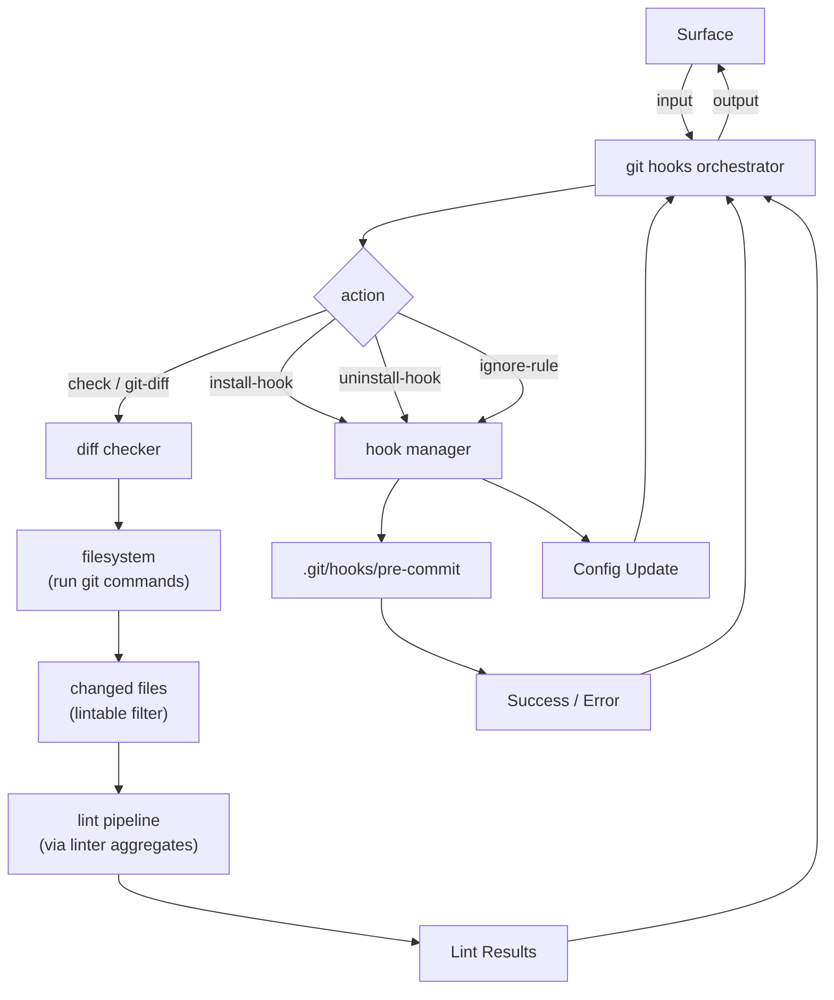

# FRD — git-hooks

---

## Reference

- Backlog: [BACKLOG.md](BACKLOG.md) — real condition for this feature; this file is specification only.
- PRD: [PRD.md](../../PRD.md)
- Architecture: [ARCHITECTURE.md](../../ARCHITECTURE.md)
- CLI Commands FRD: `crates/cli-commands/FRD.md` (FR-GITHOOKS-012 git-diff command)
- Config System FRD: `crates/config-system/FRD.md` (config resolution)
- Project Setup FRD: `crates/project-setup/FRD.md` (config initialization)

## System Overview

The git-hooks crate implements a pre-commit hook system that enforces AES
compliance before code enters the repository. It detects changed files via
git diff, runs linting only on modified files, and blocks commits that
violate AES rules.

The crate follows the AES 7-layer architecture: the diff checker and hook
manager (capabilities) implement the diff protocol and hook protocol, the
git hook adapter (capabilities) implements the hook manager protocol for
low-level hook file operations, the git hooks orchestrator (agent) composes
the three protocols, and the git container (root) wires dependencies.

### Architecture & Data Flow


```mermaid
flowchart TD
    A["Surface"] -->|input| B["git hooks orchestrator"]
    B --> C{"action"}

    C -->|"check / git-diff"| D["diff checker"]
    C -->|"install-hook"| E["hook manager"]
    C -->|"uninstall-hook"| E
    C -->|"ignore-rule"| E

    D --> G["filesystem\n(run git commands)"]
    G --> H["changed files\n(lintable filter)"]
    H --> I["lint pipeline\n(via linter aggregates)"]
    I --> J["Lint Results"]

    E --> K[".git/hooks/pre-commit"]
    K --> L["Success / Error"]
    E --> M["Config Update"]

    J --> B
    L --> B
    M --> B
    B -->|output| A

```

---

## Functional Requirements

### FR-GITHOOKS-001: Git Diff Detection

- **Description**: Identify files changed between the current HEAD and the
  default branch using git diff commands.
- **Input**: `FilePath` (project root directory).
- **Output**: `GitDiffResultVO` containing lists of added, modified, deleted,
  renamed files; a filtered `lintable_files` list; and total change count.
- **Business Rules**:

  - Default branch detection: runs
    `git symbolic-ref refs/remotes/origin/HEAD`, falls back to `"main"`.
  - Changed file collection tries multiple diff variants in order:
    1. `origin/<branch>...HEAD`
    2. `HEAD...origin/<branch>`
    3. `<branch>...HEAD`
    4. `master...HEAD`
  - Falls back to `git diff --name-only HEAD` if all variants return empty.
  - Final fallback: `git ls-files --modified --others --exclude-standard`.
  - Classification via `--diff-filter`: added (A), modified (M), deleted (D),
    renamed (R with `old => new` parsing).
  - Lintable file filter (source code only):
    `.rs`, `.py`, `.ts`, `.js`, `.jsx`, `.tsx`.
  - Non-source files (`.md`, `.toml`, `.json`, `.yaml`, `.yml`, `.lock`,
    images, binaries) are excluded from lintable list.
- **Edge Cases**:

  - No git repository → diff commands fail silently, returns empty result.
  - No remote configured → `symbolic-ref` fails, defaults to `"main"`.
  - No changes between branches → returns empty lists with
    `total_changed: 0`.
  - Detached HEAD state → diff variants may all fail; falls back to `HEAD`
    diff.
  - Shallow clone → diff may not find base branch; fallback strategies
    handle this.
- **Error Handling**:

  - Git command failure (non-zero exit) → treated as no changes for that
    variant.
  - Invalid `FilePath` from git output → skipped silently.

---

### FR-GITHOOKS-002: Pre-Commit Hook Installation

- **Description**: Install a pre-commit hook script into `.git/hooks/` that
  runs `lint-arwaky check .` before each commit.
- **Input**: `FilePath` (path to the `lint-arwaky` executable).
- **Output**: `SuccessStatus` indicating whether the hook was installed.
- **Business Rules**:

  - Hook script content:
    ```bash
    #!/bin/bash
    # Lint Arwaky Pre-Commit Hook
    echo "Running Lint Arwaky check..."
    <executable> check .
    if [ $? -ne 0 ]; then
      echo "Linting failed. Please fix issues before committing."
      exit 1
    fi
    echo "Linting passed."
    exit 0
    ```
  - Creates `.git/hooks/` directory if it does not exist.
  - Sets hook file permissions to `0o755` on Unix systems.
  - If executable path is empty, defaults to `"lint-arwaky-cli"`.
  - If not a git repository (no `.git/` dir) → returns
    `SuccessStatus(false)` without error.
- **Edge Cases**:

  - `.git/hooks/` already exists → directory creation is idempotent.
  - Hook file already exists → overwritten.
  - Not a git repository → returns success with `false` (not an error).
  - Windows → permission setting is skipped (Unix-only feature).
- **Error Handling**:

  - Directory creation failure → returns `GitHookError` with message.
  - File write failure → returns `GitHookError` with message.
  - Permission set failure → returns `GitHookError` with message.

---

### FR-GITHOOKS-003: Pre-Commit Hook Uninstallation

- **Description**: Remove the pre-commit hook script from `.git/hooks/`.
- **Input**: None.
- **Output**: `SuccessStatus` indicating whether the hook was removed.
- **Business Rules**:

  - Removes `.git/hooks/pre-commit` if it exists.
  - If not a git repository → returns `SuccessStatus(false)` without error.
  - If hook file does not exist → returns `SuccessStatus(true)`
    (already clean).
- **Edge Cases**:

  - Hook file does not exist → returns success (idempotent).
  - Not a git repository → returns success with `false`.
- **Error Handling**: File removal failure → returns `GitHookError` with
  message.

---

### FR-GITHOOKS-004: Git Hooks Check Execution

- **Description**: Run the git diff check and lint pipeline on changed files.
- **Input**: `FilePath` (project root).
- **Output**: `LintResultList` containing lint results for changed files.
- **Business Rules**:

  - Collects changed files via FR-GITHOOKS-001 (git diff detection).
  - Filters to lintable source files only.
  - Delegates to linter aggregates for AES analysis on changed files.
  - Files that fail to parse are skipped by the linter aggregates; no separate
    parse-warning diagnostic is included in output.
  - Only lintable file types (per FR-GITHOOKS-001 filter) are included.
- **Edge Cases**:

  - No changed files → returns empty `LintResultList`.
  - All changed files are non-lintable → returns empty list.
  - Changed file with parse failure → skipped by the linter aggregates for
    AES checks.
- **Error Handling**: Git command failure → treated as no changes.

---

### FR-GITHOOKS-005: Diff Data Comparison

- **Description**: Compare two file paths to determine their diff status
  and content difference score.
- **Input**: Two file path strings.
- **Output**: `GitDiffDataVO` with version info, difference score, and
  status.
- **Business Rules**:

  - Status is determined by file existence:
    - Both paths missing → `BothMissing`.
    - First missing → `MissingFirst`.
    - Second missing → `MissingSecond`.
    - Either path not a file (directory) → `NotAFile`.
    - Both exist and are files → content comparison performed.
  - Difference score calculation:
    - Read both files as bytes.
    - Score = 1.0 − (matching bytes / max file size).
    - Identical files → score `0.0`.
    - Completely different files → score `1.0`.
    - One file empty → score `1.0`.
  - Status for existing files:
    - Score `0.0` → `Unchanged`.
    - Score > `0.0` → `Modified`.
- **Edge Cases**:

  - Both paths are the same file → status `Unchanged`, score `0.0`.
  - Both paths are directories → `NotAFile`.
  - Both paths missing → `BothMissing`.
  - File read failure → score `1.0`, status `Modified` (assume changed).
- **Error Handling**: File read errors result in score `1.0` (assume
  modified). No crash.

---

### FR-GITHOOKS-006: Ignore Rule Management

- **Description**: Manage ignore rules in the lint-arwaky config file for
  git-hooks specific exclusions.
- **Input**: `HookIgnoreUpdateVO` (rule path, add/remove action).
- **Output**: `DescriptionVO` with status message.
- **Business Rules**:

  - Locates config file using config-system resolution
    (`lint_arwaky.config.yaml`).
  - Adds or removes a path from the `ignored_paths` list in the config file.
  - If config file not found → returns error message suggesting
    `lint-arwaky-cli init`.
  - Config initialization is handled by FR-GITHOOKS-007, not here.
- **Edge Cases**:

  - Config file not found → returns descriptive error.
  - Rule already exists (add) → no-op, returns "already present".
  - Rule not found (remove) → no-op, returns "not found".
- **Error Handling**: Config file not found → returns error description.
  Config parse failure → returns error description.

---

### FR-GITHOOKS-007: Config Initialization

- **Description**: Create a default lint-arwaky config file if one does not
  already exist.
- **Input**: Path string (project root directory).
- **Output**: `DescriptionVO` with status message indicating whether the
  config was created or already existed.
- **Business Rules**:

  - Target file: `lint_arwaky.config.yaml` in the given path.
  - Default content includes `ignored_paths: []` structure.
  - If config file already exists → returns "ALREADY_EXISTS" status
    (no-op, idempotent).
- **Edge Cases**:

  - Config file already present → no-op, descriptive status message.
  - File write failure → error description returned.
- **Error Handling**: Write failures return descriptive error messages.

---

## API Contract

### Protocol API

| Method | Input | Output | Error | Event | Description |
| --- | --- | --- | --- | --- | --- |
| `run_git_diff_check` | `FilePath` | `LintResultList` | None — unparsable files are skipped silently | — | Single composite entry point on the git hooks protocol: detect the changed files, filter to lintable ones, and run AES analysis over them. |

### Aggregate API

| Method | Input | Output | Error | Event | Description |
| --- | --- | --- | --- | --- | --- |
| `execute` | `GitHooksRequest` | `GitHooksResponse` | Errors carried within the response variant | — | Dispatch a typed git hooks request to the matching capability. |
| `run_git_hooks_check` | `FilePath` | `LintResultList` | None | — | Run the AES analysis over the lintable files changed since the default branch. |
| `get_diff` | `FilePath` | `GitDiffResultVO` | None — every diff variant failing falls back to the file listing | — | Resolve the changed files with the lintable filter applied. |
| `get_changed_files` | `FilePath`, `GitBranchName` | `FilePathList` | None | — | List the files changed relative to the given base branch. |
| `get_default_branch` | `FilePath` | `GitBranchName` | None | — | Detect the default branch, defaulting to `main` when the symbolic ref lookup fails. |
| `get_diff_data` | Two file paths | `DiffDataVO` | None | — | Compare two file paths and return the similarity score and change status. |
| `install_hook` | `FilePath` | `Result<SuccessStatus, GitHookError>` | `GitHookError` on write failure | — | Write the pre-commit hook script into the repository hooks directory. |
| `uninstall_hook` | — | `Result<SuccessStatus, GitHookError>` | `GitHookError` on removal failure | — | Remove the pre-commit hook script; idempotent when it is already absent. |
| `initialize_config` | `FilePath` | String description | Write failure reported in the description | — | Create the default configuration file when none exists. |
| `update_ignore_rule` | `IgnoreUpdateRequest` | String description | Missing config file reported in the description | — | Add or remove an ignore rule in the configuration. |
| `get_hook_manager` | — | `Arc<dyn IHookManagerProtocol>` | None | — | Return the hook manager protocol for direct hooks-directory access. |
| `get_hook_manager_identity` | — | `Identity` | None | — | Return the manager identity value object. |
| `diff_protocol` | — | `&dyn IDiffProtocol` | None | — | Expose the diff protocol for consumers that need raw diff data. |
| `hook_protocol` | — | `&dyn IHookProtocol` | None | — | Expose the hook protocol for consumers that need raw hook operations. |

---

## Integration Points

| System | Direction | Purpose | Failure mode |
| --- | --- | --- | --- |
| `shared` crate | in | Value objects, contract traits, and utility functions | Compile-time dependency; unavailable at build time |
| `IFilesystemAggregate` | in | Runs git commands (diff, symbolic-ref, file listing) and file operations (hooks directory, hook script, config I/O) | Subprocess spawn failure → next fallback strategy |
| Linter aggregates | in | Run the AES analysis over the changed lintable files | Parse failure → file skipped silently; no warning diagnostic |
| `git` CLI | in | Change detection via `diff --name-only`, `symbolic-ref`, and the file listing command | Command fails → next fallback diff variant; all variants fail → default branch `main` |
| Filesystem | in | Hooks directory operations and config file read/write | Write failure → `GitHookError` with a descriptive message |
| Standard library | in | File permission setting and file removal | Permission setting skipped on Windows |
| Git pre-commit hook script | out | Runs `lint-arwaky-cli check .` when a commit is finalized | Non-zero exit blocks the commit |

---

## Non-functional Requirements

| Metric | Target | Measurement method |
| --- | --- | --- |
| Diff detection latency | Early termination as soon as a diff variant returns changes | Time detection across the fallback chain and confirm the first non-empty result short-circuits |
| Git command cost | Subprocess spawn via the filesystem aggregate is the bottleneck | Profile a check run and attribute time to git subprocesses |
| Memory: changed files | Deduplicated set; scales with the number of changed files | Measure peak memory across runs with varying change counts |
| Scan accuracy | Only actually changed files are scanned | Run a check with mixed changed and unchanged files and assert only the changed ones appear |
| State compatibility | Fallback strategies keep detection working in a shallow clone or detached HEAD | Repeat the check in a shallow clone and in a detached HEAD state |
| Cross-platform hooks | Linux and macOS set Unix permissions; Windows skips permission setting | Install the hook on each platform and inspect the resulting file mode |
| Reliability | Multiple fallback strategies keep detection working when the primary diff command fails | Force the primary diff to fail and confirm a later strategy still yields the file list |

---

## Test Scenarios

- The default branch is resolved from the remote HEAD reference and the correct branch is detected.
- When the symbolic-ref lookup fails, the default branch falls back to `main`.
- Changed files are resolved from the diff against the default branch and the correct file list is returned.
- When every branch diff variant returns empty, detection falls back to the working-tree diff against HEAD.
- When every diff strategy fails, detection falls back to the tracked-file listing.
- Lintable extensions (`.rs`, `.py`, `.ts`, `.js`, `.jsx`, `.tsx`) are included in the result.
- Non-lintable extensions (`.md`, `.toml`, `.json`, `.png`, `.lock`) are excluded from the result.
- An empty diff reports a total changed count of 0.
- A detached HEAD is handled by the fallback strategies.
- Renamed files classified with the rename diff filter yield both the old and new paths.
- A normal install creates the hook script with the correct executable permission.
- A missing hooks directory is created during installation.
- An existing hook file is overwritten.
- Installing outside a git repository returns `SuccessStatus(false)` with no error.
- On Unix the executable permission `0o755` is set.
- On Windows the permission setting is skipped.
- An empty executable path defaults to `lint-arwaky-cli`.
- Uninstalling an existing hook removes it and returns `SuccessStatus(true)`.
- Uninstalling a hook that does not exist is idempotent and returns `SuccessStatus(true)`.
- Uninstalling outside a git repository returns `SuccessStatus(false)`.
- Changed files containing violations produce the corresponding lint results.
- A run with no changed files returns an empty result list.
- A changed file that fails to parse is skipped by the linters with no warning emitted.
- A run where every changed file is non-lintable returns an empty result list.
- Comparing two identical files yields a score of 0.0 and an `Unchanged` status.
- Comparing two partially different files yields a score between 0.0 and 1.0 and a `Modified` status.
- A missing first file yields a `MissingFirst` status.
- A missing second file yields a `MissingSecond` status.
- Two paths that are both directories yield a `NotAFile` status.
- Two paths that are both missing yield a `BothMissing` status.
- Comparing the same file path twice yields a score of 0.0 and an `Unchanged` status.
- Adding an ignore rule adds the rule to the config.
- Removing an ignore rule removes the rule from the config.
- A missing config file returns an error suggesting the init command.
- Adding an ignore rule that is already present is a no-op reporting "already present".
- Initializing when no config is present creates the default config and reports success.
- Initializing when the config already exists is idempotent and reports an `ALREADY_EXISTS` status.
- A config write failure returns an error description.

---

## Assumptions & Constraints

- `git` CLI is installed and available in PATH.
- The project is a git repository (has `.git/` directory) for hook
  operations.
- Git commands execute within a reasonable timeout (subprocess-based,
  invoked via `IFilesystemAggregate::run_git_command`).
- The pre-commit hook runs `lint-arwaky-cli check .` which must be in PATH
  or specified via executable path.
- Config file format (`lint_arwaky.config.yaml`) is stable and
  parseable.
- Lintable files are source code only (.rs, .py, .ts, .js, .jsx, .tsx).
  Non-source files are excluded from linting.
- No async runtime dependency.

---

## Glossary

- **AES**: Agentic Engineering System — the 7-layer coding convention.
- **Pre-commit hook**: A git hook that runs before a commit is finalized; it can block the commit by exiting non-zero.
- **Lintable file**: A source code file that can be analyzed by lint-arwaky (`.rs`, `.py`, `.ts`, `.js`, `.jsx`, `.tsx`).
- **Default branch**: The main development branch (typically `main` or `master`) used as the diff base.
- **Diff variant**: A git diff command string tried against the repository to find changed files.
- **Hook manager**: Low-level component that handles the hooks directory file operations.
- **Diff checker**: Component that runs git commands to identify changed files.
- **Parse skip**: Files that fail to parse are skipped by the linter aggregates; no separate warning diagnostic is included in output.

---
