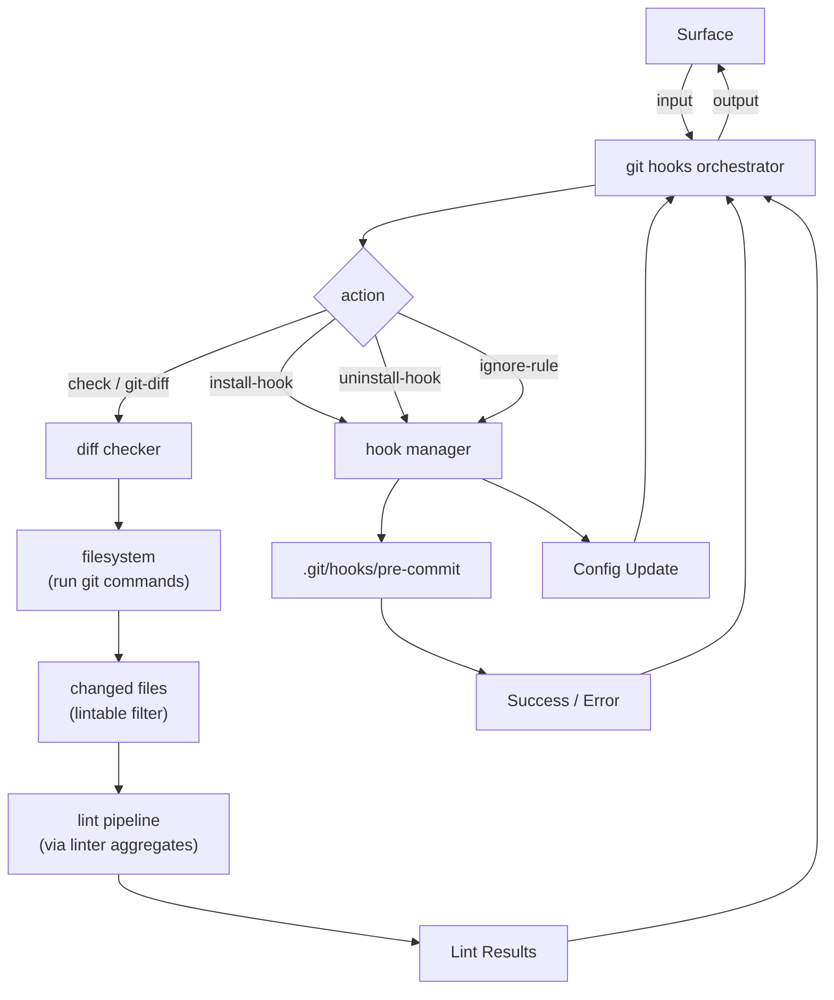

# FRD — git-hooks

---

## Reference

- Backlog: [BACKLOG.md](BACKLOG.md) — real condition for this feature; this file is specification only.
- PRD: [PRD.md](../../PRD.md)
- Architecture: [ARCHITECTURE.md](../../ARCHITECTURE.md)
- Config System FRD: `crates/config-system/FRD.md` (config resolution)
- Project Setup FRD: `crates/project-setup/FRD.md` (config initialization)

## System Overview

The git-hooks crate implements a pre-commit hook system that enforces AES
compliance before code enters the repository. It detects changed files via
git diff, runs linting only on modified files, and blocks commits that
violate AES rules.

The crate follows the AES 7-layer architecture: the diff checker and hook
manager (capabilities) implement the diff protocol and hook protocol, the
git hook adapter (capabilities) implements the hook manager protocol for
low-level hook file operations, the git hooks orchestrator (agent) composes
the three protocols, and the git container (root) wires dependencies.

### Architecture & Data Flow


```mermaid
flowchart TD
    A["Surface"] -->|input| B["git hooks orchestrator"]
    B --> C{"action"}

    C -->|"check / git-diff"| D["diff checker"]
    C -->|"install-hook"| E["hook manager"]
    C -->|"uninstall-hook"| E
    C -->|"ignore-rule"| E

    D --> G["filesystem\n(run git commands)"]
    G --> H["changed files\n(lintable filter)"]
    H --> I["lint pipeline\n(via linter aggregates)"]
    I --> J["Lint Results"]

    E --> K[".git/hooks/pre-commit"]
    K --> L["Success / Error"]
    E --> M["Config Update"]

    J --> B
    L --> B
    M --> B
    B -->|output| A

```

---

## Functional Requirements

### FR-GitHooks-001: Git Diff Detection

- **Description**: Identify files changed between the current HEAD and the
  default branch using git diff commands.
- **Input**: `FilePath` (project root directory).
- **Output**: `GitDiffResultVO` containing lists of added, modified, deleted,
  renamed files; a filtered `lintable_files` list; and total change count.
- **Business Rules**:

  - Default branch detection: runs
    `git symbolic-ref refs/remotes/origin/HEAD`, falls back to `"main"`.
  - Changed file collection tries multiple diff variants in order:
    1. `origin/<branch>...HEAD`
    2. `HEAD...origin/<branch>`
    3. `<branch>...HEAD`
    4. `master...HEAD`
  - Falls back to `git diff --name-only HEAD` if all variants return empty.
  - Final fallback: `git ls-files --modified --others --exclude-standard`.
  - Classification via `--diff-filter`: added (A), modified (M), deleted (D),
    renamed (R with `old => new` parsing).
  - Lintable file filter (source code only):
    `.rs`, `.py`, `.ts`, `.js`, `.jsx`, `.tsx`.
  - Non-source files (`.md`, `.toml`, `.json`, `.yaml`, `.yml`, `.lock`,
    images, binaries) are excluded from lintable list.
- **Edge Cases**:

  - No git repository → diff commands fail silently, returns empty result.
  - No remote configured → `symbolic-ref` fails, defaults to `"main"`.
  - No changes between branches → returns empty lists with
    `total_changed: 0`.
  - Detached HEAD state → diff variants may all fail; falls back to `HEAD`
    diff.
  - Shallow clone → diff may not find base branch; fallback strategies
    handle this.
- **Error Handling**:

  - Git command failure (non-zero exit) → treated as no changes for that
    variant.
  - Invalid `FilePath` from git output → skipped silently.

---

### FR-GitHooks-002: Pre-Commit Hook Installation

- **Description**: Install a pre-commit hook script into `.git/hooks/` that
  runs `lint-arwaky check .` before each commit.
- **Input**: `FilePath` (path to the `lint-arwaky` executable).
- **Output**: `SuccessStatus` indicating whether the hook was installed.
- **Business Rules**:

  - Hook script content:
    ```bash
    #!/bin/bash
    # Lint Arwaky Pre-Commit Hook
    echo "Running Lint Arwaky check..."
    <executable> check .
    if [ $? -ne 0 ]; then
      echo "Linting failed. Please fix issues before committing."
      exit 1
    fi
    echo "Linting passed."
    exit 0
    ```
  - Creates `.git/hooks/` directory if it does not exist.
  - Sets hook file permissions to `0o755` on Unix systems.
  - If executable path is empty, defaults to `"lint-arwaky-cli"`.
  - If not a git repository (no `.git/` dir) → returns
    `SuccessStatus(false)` without error.
- **Edge Cases**:

  - `.git/hooks/` already exists → directory creation is idempotent.
  - Hook file already exists → overwritten.
  - Not a git repository → returns success with `false` (not an error).
  - Windows → permission setting is skipped (Unix-only feature).
- **Error Handling**:

  - Directory creation failure → returns `GitHookError` with message.
  - File write failure → returns `GitHookError` with message.
  - Permission set failure → returns `GitHookError` with message.

---

### FR-GitHooks-003: Pre-Commit Hook Uninstallation

- **Description**: Remove the pre-commit hook script from `.git/hooks/`.
- **Input**: None.
- **Output**: `SuccessStatus` indicating whether the hook was removed.
- **Business Rules**:

  - Removes `.git/hooks/pre-commit` if it exists.
  - If not a git repository → returns `SuccessStatus(false)` without error.
  - If hook file does not exist → returns `SuccessStatus(true)`
    (already clean).
- **Edge Cases**:

  - Hook file does not exist → returns success (idempotent).
  - Not a git repository → returns success with `false`.
- **Error Handling**: File removal failure → returns `GitHookError` with
  message.

---

### FR-GitHooks-004: Git Hooks Check Execution

- **Description**: Run the git diff check and lint pipeline on changed files.
- **Input**: `FilePath` (project root).
- **Output**: `LintResultList` containing lint results for changed files.
- **Business Rules**:

  - Collects changed files via FR-GitHooks-001 (git diff detection).
  - Filters to lintable source files only.
  - Delegates to linter aggregates for AES analysis on changed files.
  - Files that fail to parse are skipped by the linter aggregates; no separate
    parse-warning diagnostic is included in output.
  - Only lintable file types (per FR-GitHooks-001 filter) are included.
- **Edge Cases**:

  - No changed files → returns empty `LintResultList`.
  - All changed files are non-lintable → returns empty list.
  - Changed file with parse failure → skipped by the linter aggregates for
    AES checks.
- **Error Handling**: Git command failure → treated as no changes.

---

### FR-GitHooks-005: Diff Data Comparison

- **Description**: Compare two file paths to determine their diff status
  and content difference score.
- **Input**: Two file path strings.
- **Output**: `GitDiffDataVO` with version info, difference score, and
  status.
- **Business Rules**:

  - Status is determined by file existence:
    - Both paths missing → `BothMissing`.
    - First missing → `MissingFirst`.
    - Second missing → `MissingSecond`.
    - Either path not a file (directory) → `NotAFile`.
    - Both exist and are files → content comparison performed.
  - Difference score calculation:
    - Read both files as bytes.
    - Score = 1.0 − (matching bytes / max file size).
    - Identical files → score `0.0`.
    - Completely different files → score `1.0`.
    - One file empty → score `1.0`.
  - Status for existing files:
    - Score `0.0` → `Unchanged`.
    - Score > `0.0` → `Modified`.
- **Edge Cases**:

  - Both paths are the same file → status `Unchanged`, score `0.0`.
  - Both paths are directories → `NotAFile`.
  - Both paths missing → `BothMissing`.
  - File read failure → score `1.0`, status `Modified` (assume changed).
- **Error Handling**: File read errors result in score `1.0` (assume
  modified). No crash.

---

### FR-GitHooks-006: Ignore Rule Management

- **Description**: Manage ignore rules in the lint-arwaky config file for
  git-hooks specific exclusions.
- **Input**: `HookIgnoreUpdateVO` (rule path, add/remove action).
- **Output**: `DescriptionVO` with status message.
- **Business Rules**:

  - Locates config file using config-system resolution
    (`lint_arwaky.config.yaml`).
  - Adds or removes a path from the `ignored_paths` list in the config file.
  - If config file not found → returns error message suggesting
    `lint-arwaky-cli init`.
  - Config initialization is handled by FR-GitHooks-007, not here.
- **Edge Cases**:

  - Config file not found → returns descriptive error.
  - Rule already exists (add) → no-op, returns "already present".
  - Rule not found (remove) → no-op, returns "not found".
- **Error Handling**: Config file not found → returns error description.
  Config parse failure → returns error description.

---

### FR-GitHooks-007: Config Initialization

- **Description**: Create a default lint-arwaky config file if one does not
  already exist.
- **Input**: Path string (project root directory).
- **Output**: `DescriptionVO` with status message indicating whether the
  config was created or already existed.
- **Business Rules**:

  - Target file: `lint_arwaky.config.yaml` in the given path.
  - Default content includes `ignored_paths: []` structure.
  - If config file already exists → returns "ALREADY_EXISTS" status
    (no-op, idempotent).
- **Edge Cases**:

  - Config file already present → no-op, descriptive status message.
  - File write failure → error description returned.
- **Error Handling**: Write failures return descriptive error messages.

---

## API Contract

### Protocol API

| Method | Input | Output | Error | Event | Description |
|---|---|---|---|---|---|
| `run_git_diff_check` | &FilePath | `LintResultList` | — | — | Run git diff check. |
| `get_diff` | &FilePath | `GitDiffResultVO` | — | — | Get diff. |
| `get_changed_files` | &FilePath, &GitBranchName | `FilePathList` | — | — | Get changed files. |
| `get_default_branch` | &FilePath | `GitBranchName` | — | — | Get default branch. |
| `install_pre_commit` | &FilePath) -> Result<SuccessStatus, GitHookError>; /// Uninstall pre-commit hook. fn uninstall_pre_commit(&self | `SuccessStatus` | `GitHookError` | — | Install pre commit. |
| `get_hook_manager_identity` | — | `Identity` | — | — | Get hook manager identity. |
| `initialize_config` | &str | `DescriptionVO` | — | — | Initialize config. |
| `update_ignore_rule` | HookIgnoreUpdateVO | `DescriptionVO` | — | — | Update ignore rule. |
| `get_diff_data` | &str, &str | `GitDiffDataVO` | — | — | Get diff data. |

### Aggregate API

| Method | Input | Output | Error | Event | Description |
|---|---|---|---|---|---|
| `execute` | GitHooksRequest | `GitHooksResponse` | — | — | Single composite entry point over the feature. |

## Integration Points
| System | Direction | Purpose | Failure mode |
| --- | --- | --- | --- |
| `shared` crate | in | Supply value objects plus the diff, hook, hook-manager, and aggregate contracts | A contract is missing at compile time → the build fails before any hook is installed |
| `filesystem` aggregate | in | Run git subprocesses, perform hook-directory and script writes, and read configuration | A git subprocess cannot be spawned → that diff strategy fails and the next fallback strategy is tried |
| Linter aggregates | in | Run AES analysis over the changed files | Analysis finds violations → the hook exits non-zero and the commit is blocked; analysis itself failing is reported distinctly from violations |
| `git` CLI | in | Report changed paths and the current branch through diff, symbolic-ref, and ls-files | The repository is shallow, detached, or mid-rebase → the primary diff strategy fails and a fallback strategy is used |
| Hook directory | in | Hold the installed hook script | The directory is not writable → installation reports failure and leaves the repository unchanged |
| Standard library file operations | in | Set the executable bit and remove the previous script | Permission setting is unsupported on the platform → the hook is installed without the executable bit and reports which platform it is on |

## Non-functional Requirements
| Metric | Target | Measurement method |
| --- | --- | --- |
| Diff detection | Early termination once changes are found; git subprocess spawn dominates the cost | Time the hook on a workspace with and without staged changes and compare |
| Deduplication | A file changed across several diff strategies is analysed once | Stage a change that two diff strategies both report and assert one analysis run |
| Scan scope | Only changed files are analysed | Compare the analysed file set against the repository's changed-file list |
| Repository-state coverage | Diff detection succeeds in a shallow clone, a detached HEAD, and a mid-rebase state | Run the hook in each of the three states and assert the changed set is correct |
| Memory | The changed-file set is held once and deduplicated | Scale the staged file count and record the retained set size |
| Cross-platform install | The hook installs on Linux, macOS, and Windows, setting the executable bit only where it exists | Install on each platform and assert the script is registered and, where applicable, executable |
| Install atomicity | A failed install leaves the previous hook script in place | Interrupt an install and assert the original script is still registered |
| Block semantics | The hook exits non-zero exactly when violations are found, and zero otherwise | Run the hook against a clean and a violating change set and assert the two exit codes |

## Test Scenarios / QA Checklist

Each scenario is stated below as a table of cases: the input condition and the expected result.

- **SCEN-001 — Git Diff Detection** — e.g. Default branch from`origin/HEAD` → Correct branch detected
- **SCEN-002 — Hook Installation** — e.g. Normal install → Hook script created with correct executable
- **SCEN-003 — Hook Uninstallation** — e.g. Hook exists → Removed, SuccessStatus(true)
- **SCEN-004 — Check Execution** — e.g. Changed files with violations → Lint results returned
- **SCEN-005 — Diff Data Comparison** — e.g. Both files identical → Score 0.0, status Unchanged
- **SCEN-006 — Ignore Rule Management** — e.g. Add ignore rule → Rule added to config
- **SCEN-007 — Config Initialization** — e.g. Config not present → Default config created, success

### SCEN-001 — Git Diff Detection

FRD Ref: FR-GitHooks-001

| # | Scenario | Expected |
| - | - | - |
| 1 | Default branch from`origin/HEAD` | Correct branch detected |
| 2 | `symbolic-ref` fails | Defaults to "main" |
| 3 | Changed files via`origin/main...HEAD` | Correct file list |
| 4 | All branch variants empty | Fallback to`HEAD` diff |
| 5 | All diff strategies fail | Fallback to`ls-files` |
| 6 | Lintable filter: .rs, .py, .ts, .js, .jsx, .tsx | Included |
| 7 | Non-lintable: .md, .toml, .json, .png, .lock | Excluded |
| 8 | Empty diff | total_changed: 0 |
| 9 | Detached HEAD | Fallback strategies handle |
| 10 | Renamed files classified via `--diff-filter=R` | Old/new paths parsed |

### SCEN-002 — Hook Installation

FRD Ref: FR-GitHooks-002

| # | Scenario | Expected |
| - | - | - |
| 1 | Normal install | Hook script created with correct executable |
| 2 | `.git/hooks/` missing | Directory created |
| 3 | Hook file already exists | Overwritten |
| 4 | Not a git repo | SuccessStatus(false), no error |
| 5 | Unix permissions | 0o755 set |
| 6 | Windows | Permission setting skipped |
| 7 | Empty executable path | Defaults to "lint-arwaky-cli" |

### SCEN-003 — Hook Uninstallation

FRD Ref: FR-GitHooks-003

| # | Scenario | Expected |
| - | - | - |
| 1 | Hook exists | Removed, SuccessStatus(true) |
| 2 | Hook doesn't exist | SuccessStatus(true), idempotent |
| 3 | Not a git repo | SuccessStatus(false) |

### SCEN-004 — Check Execution

FRD Ref: FR-GitHooks-004

| # | Scenario | Expected |
| - | - | - |
| 1 | Changed files with violations | Lint results returned |
| 2 | No changed files | Empty result list |
| 3 | Changed file with parse failure | Skipped by linters, no warning |
| 4 | All changed files non-lintable | Empty result list |

### SCEN-005 — Diff Data Comparison

FRD Ref: FR-GitHooks-005

| # | Scenario | Expected |
| - | - | - |
| 1 | Both files identical | Score 0.0, status Unchanged |
| 2 | Files partially different | Score between 0.0 and 1.0, Modified |
| 3 | First file missing | MissingFirst |
| 4 | Second file missing | MissingSecond |
| 5 | Both paths are directories | NotAFile |
| 6 | Both paths missing | BothMissing |
| 7 | Same file path twice | Score 0.0, Unchanged |

### SCEN-006 — Ignore Rule Management

FRD Ref: FR-GitHooks-006

| # | Scenario | Expected |
| - | - | - |
| 1 | Add ignore rule | Rule added to config |
| 2 | Remove ignore rule | Rule removed from config |
| 3 | Config file not found | Error suggesting`lint-arwaky-cli init` |
| 4 | Rule already exists (add) | No-op, "already present" |

### SCEN-007 — Config Initialization

FRD Ref: FR-GitHooks-007

| # | Scenario | Expected |
| - | - | - |
| 1 | Config not present | Default config created, success |
| 2 | Config already exists | Idempotent, "ALREADY_EXISTS" status |
| 3 | Write failure | Error description returned |

---

## Assumptions & Constraints

- `git` CLI is installed and available in PATH.
- The project is a git repository (has `.git/` directory) for hook
  operations.
- Git commands execute within a reasonable timeout (subprocess-based,
  invoked via `IFilesystemAggregate::run_git_command`).
- The pre-commit hook runs `lint-arwaky-cli check .` which must be in PATH
  or specified via executable path.
- Config file format (`lint_arwaky.config.yaml`) is stable and
  parseable.
- Lintable files are source code only (.rs, .py, .ts, .js, .jsx, .tsx).
  Non-source files are excluded from linting.
- No async runtime dependency.

---

## Glossary

- **AES**: Agentic Engineering System — the 7-layer coding convention
- **Pre-commit hook**: A git hook that runs before a commit is finalized; can block the commit by exiting non-zero
- **Lintable file**: A source code file that can be analyzed by lint-arwaky (.rs, .py, .ts, .js, .jsx, .tsx)
- **Default branch**: The main development branch (typically`main` or `master`) used as the diff base
- **Diff variant**: A git diff command string tried against the repository to find changed files
- **Hook manager**: Low-level component that handles`.git/hooks/` file operations
- **Diff checker**: Component that runs git commands to identify changed files
- **Parse skip**: Files that fail to parse are skipped by the linter aggregates; no separate warning diagnostic is included in output.

---
