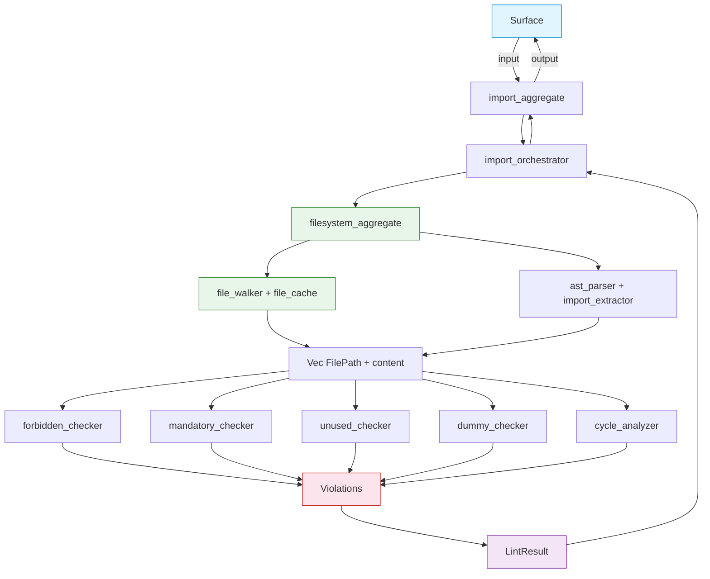

# FRD — import-rules (v1.12.0)

## System Overview

The import-rules crate enforces correct structural boundaries and unidirectional dependency flows across the 7-layer AES architecture. It prevents spaghetti architecture, circular dependencies, and dead/unused imports by validating every import statement against a predefined layer-hierarchy matrix.

### Architecture & Data Flow



### FR-001: Layer Dependency Violation (AES201)

- **Description**: Restricts imports based on the layer hierarchy. Lower layers must never import higher layers. Uses AST-based import extraction and barrel file resolution for accurate layer detection.
- **Input**: Rust, Python, JS/TS source files, architecture configuration, layer map.
- **Output**: List of AES201 CRITICAL diagnostics with file path, line number, source layer, forbidden layer, and allowed layers.
- **Business Rules**:
  - **Import extraction (AST)**:
    - Rust: Extract `ItemUse` nodes via `syn` — handles `use`, `pub use`, `pub(crate) use`, grouped imports `use foo::{A, B}`, glob imports `use foo::*`, and multi-line imports.
    - Python: Extract `from X import Y` and `import X` via structured parsing with comment/string awareness.
    - TypeScript: Extract `import { X } from`, `import X from`, `import * as X from`, side-effect imports, and `export { X } from` re-exports via structured parsing.
  - **Layer detection**: Detected from filename prefix of the importing file (`taxonomy_*` → taxonomy, `contract_*` → contract, etc.) and from the import target path segments.
  - **Forbidden layer enforcement**:
    - `taxonomy_` must not import `contract_`, `utility_`, `capabilities_`, `agent_`, `surface_`, `root_`.
    - `contract_` must not import `utility_`, `capabilities_`, `agent_`, `surface_`, `root_`.
    - `utility_` and `capabilities_` must not import each other directly.
    - `capabilities_` must not import `agent_`, `surface_`, or other `capabilities_`.
    - `agent_` must not import `surface_` or `capabilities_` directly.
    - `surface_` must not import `capabilities_`, `agent_`, or `utility_` directly.
  - **Barrel resolution**: When direct module-path matching fails (import through `__init__.py`, `mod.rs`, `index.ts` hides the original file name), resolve each imported symbol through the barrel file to detect the original source file and its layer prefix.
  - **Scope-based rules**: Config-driven scope patterns (e.g., `taxonomy(vo)`, `contract(protocol)`, `surface(command|controller|page)`) enforce per-sub-layer forbidden/allowed rules.
  - Whole-word segment matching is used for all layer detection (split on `:`, `.`, `/`, `\` — never substring `contains()`).
- **Edge Cases**:
  - Circular imports across layers are detected by AES205, not AES201.
  - Conditional imports (`#[cfg(...)]` blocks) are skipped during import extraction.
  - Barrel files (`mod.rs`, `lib.rs`, `main.rs`, `__init__.py`, `index.ts`) are skipped for scope-level checks.
  - Imports inside comments or string literals are NOT extracted (AST guarantees this for Rust; comment-aware parsing for Python/TS).
- **Error Handling**: Unreadable files are skipped with a warning. Files with unparseable content produce no violations (fail-safe). Parse failures produce empty import lists.

### FR-002: Mandatory Layer Imports (AES202)

- **Description**: Verifies that specific layers contain required imports as defined in the architecture configuration.
- **Input**: Rust, Python, JS/TS source files, architecture configuration, layer map.
- **Output**: List of AES202 HIGH diagnostics with file path, source layer, and required import.
- **Business Rules**:
  - **Mandatory import checking**:
    - For each file, check that at least one import targets each layer in the `mandatory` set defined in the layer definition or config rule.
    - Direct match: check if any import line's module path segments match the required layer name.
    - Scope match: check if any import line satisfies the required scope pattern (e.g., `contract(protocol)` requires an import matching `contract` layer with `_protocol` suffix).
  - **Barrel resolution fallback**: When direct module-path matching fails, resolve each imported symbol through the barrel file to find the original source file and verify its layer matches the required layer.
  - **Layer-specific defaults**:
    - Capability files must import their corresponding contract protocol.
    - Surface entries must import their container or aggregate.
  - Files with empty `mandatory` config are skipped.
  - `__init__.py` files are skipped for mandatory checks.
  - `mod.rs`, `lib.rs`, `main.rs` are skipped for scope-level mandatory checks.
- **Edge Cases**: Files with multiple roles (e.g., a file that is both `capabilities` and `utility`) use the primary layer prefix. Files without a recognized prefix are skipped.
- **Error Handling**: Unreadable files are skipped. Missing config defaults to no mandatory requirements.

### FR-003: Unused Import Detection (AES203)

- **Description**: Detects and flags imported symbols that are never referenced within the file body. Uses AST-based usage tracking for Rust and structured parsing for Python/TS.
- **Input**: Rust, Python, JS/TS source files.
- **Output**: List of AES203 MEDIUM diagnostics with file path, line number, and unused symbol name.
- **Business Rules**:
  - **Import extraction (AST)**:
    - Rust: Extract all `ItemUse` nodes via `syn`. Each imported alias is recorded with its full path.
    - Python: Extract `from X import Y` and `import X` aliases via structured parsing.
    - TypeScript: Extract named imports, default imports, namespace imports, and re-exports via structured parsing.
  - **Usage detection (AST for Rust)**:
    - Walk the AST using `syn::visit::Visit` to collect all identifier references (`ExprPath`, `TypePath`, `PathSegment`).
    - An imported symbol is "used" if its name appears as an identifier reference anywhere in the file body (excluding the import statement itself).
    - Usage inside `#[derive(...)]` attributes is detected via attribute parsing — no hardcoded `DERIVE_MACROS` whitelist needed.
    - Usage inside macro invocations is detected if the macro is expanded (see FR-010).
  - **Usage detection (structured for Python/TS)**:
    - Strip comments and string literals, then search for whole-word matches of each imported alias in the remaining code.
    - An imported symbol is "used" if it appears as a whole-word identifier outside import statements, comments, and strings.
  - **Exemptions**:
    - Barrel files (`__init__.py`, `mod.rs`, `lib.rs`, `main.rs`, `index.ts`, `index.js`) are skipped — re-exports are intentional public API.
    - `pub use` / `export { X } from` re-exports are treated as used (they define public API).
    - `__future__` imports (Python) are skipped — they affect parsing behavior, not runtime usage.
    - Wildcard imports (`use foo::*`, `export * from`) are flagged as unused (cannot verify individual symbol usage).
    - `#[cfg(...)]` conditional blocks are skipped during import extraction.
  - **Exported symbol detection**: Symbols exported via `__all__` (Python), `export { X }` (TS), or `pub use` (Rust) are treated as used.
- **Edge Cases**:
  - Multi-line imports (`use foo::{\n  A,\n  B,\n}`) are handled natively by AST.
  - Aliased imports (`use foo::Bar as Baz`) track the alias `Baz`, not the original `Bar`.
  - Imports used only in type annotations are counted as used.
  - Imports used only in doc comments (`/// [`FilePath`]`) are NOT counted as used (AST does not parse doc comments as code).
- **Error Handling**: Files that fail AST parsing fall back to structured line-based parsing. Unreadable files produce no violations.

### FR-004: Dummy Import Detection (AES204)

- **Description**: Detects imports, functions, and trait implementations that are dummy/stub code existing only to suppress unused-import warnings.
- **Input**: Rust, Python, JS/TS source files, layer map.
- **Output**: List of AES204 HIGH diagnostics with file path, line number, dummy symbol name, and intent description.
- **Business Rules**:
  - **Dummy function detection (AST for Rust)**:
    - Rust: Extract `ItemFn` nodes via `syn`. Functions named `_use_*` or `dummy_*` are flagged.
    - Python: Detect `def _use_*` and `def dummy_*` via structured parsing.
    - TypeScript: Detect `function _use*`, `function dummy*`, `const _use*`, `const dummy*` via structured parsing.
  - **Dummy trait implementation detection (AST for Rust)**:
    - Rust: Extract `ItemImpl` nodes via `syn`. Implementations where ALL method bodies are empty, `todo!()`, `unimplemented!()`, `panic!()`, or `unreachable!()` are flagged.
    - Detection uses AST body analysis, not line-by-line brace counting.
  - **Dummy import detection**:
    - Imported symbols that appear ONLY inside dummy function ranges (not in real logic) are flagged.
    - Symbol usage checking skips: import lines, comment lines, dummy function ranges, dummy trait impl ranges, `PhantomData` lines.
    - Whole-word matching is used (manual character boundary check, not regex `\b`).
    - String-literal-only usage is detected and excluded (symbol appearing only inside `"..."` is not real usage).
  - **Taxonomy intent checking**:
    - If a file has dummy functions AND imports taxonomy VOs (`taxonomy_*`), but those VOs are used only inside dummy functions (not in real logic), flag as intent violation.
  - **Surface logic checking**:
    - Surface files must not call business logic functions directly (e.g., `lint_path(`, `compute_score(`, `has_critical(`, `walk_rs_files(`).
    - These must be delegated to the aggregate layer.
  - **Barrel file exemption**: Barrel files are skipped for all dummy checks.
  - **`__future__` import exemption**: Python `from __future__ import ...` is skipped.
- **Edge Cases**:
  - Re-exports (`pub use`, `export { X } from`) are not flagged as dummy.
  - Trait implementations with at least one non-dummy method are not flagged.
  - Multi-line function bodies are handled by AST (Rust) or brace/indent counting (Python/TS).
- **Error Handling**: Files that fail AST parsing fall back to line-based detection. Unreadable files produce no violations.

### FR-005: Forbidden Import Config Detection (AES201 — Config-Driven)

- **Description**: Detects imports that violate layer boundary rules defined in YAML configuration, using scope pattern matching.
- **Input**: Rust, Python, JS/TS source files, architecture configuration with scope rules.
- **Output**: List of AES201 CRITICAL diagnostics with file path, line number, source layer, forbidden layer, and allowed layers.
- **Business Rules**:
  - **Scope pattern matching**: Each config rule has a `scope` pattern (e.g., `taxonomy(vo)`, `contract(protocol)`, `surface(command|controller|page)`). Files are matched to rules via filename prefix and suffix.
  - **Forbidden enforcement**: For each matched rule, check that no import targets a layer in the rule's `forbidden` list.
  - **Allowed enforcement**: The diagnostic message includes the rule's `allowed` list for remediation guidance.
  - **Exception handling**: Files whose basename appears in the rule's `exceptions` list are skipped.
  - **Barrel resolution**: Same barrel resolution as FR-001 applies.
  - **Layer detection from import**: Import target layer is detected from path segments using prefix matching (`contract_*` → contract), not substring matching.
- **Edge Cases**:
  - `mod.rs`, `lib.rs`, `main.rs` are skipped for scope-level checks.
  - Files matching multiple scope rules are checked against all matched rules.
  - Conditional imports (`#[cfg(...)]`) are skipped.
- **Error Handling**: Missing config defaults to no scope rules. Unreadable files are skipped.

### FR-006: Circular Dependency Detection (AES205)

- **Description**: Builds a dependency graph of imports across all workspace files and detects cycles using 3-color DFS.
- **Input**: All workspace source files, architecture configuration, layer map.
- **Output**: List of AES205 CRITICAL diagnostics with cycle path description.
- **Business Rules**:
  - **Module extraction (AST-based)**:
    - Rust: Extract `ItemUse` and `ItemMod` nodes via `syn` to build import edges.
    - Python: Extract `from X import Y` and `import X` via structured parsing.
    - TypeScript: Extract `import` and `export from` via structured parsing.
  - **Barrel-aware resolution**: For imports through barrel files, resolve to the original source file so the dependency graph reflects actual file-to-file dependencies.
  - **Layer-level graph**: Import edges are normalized to layer-level edges (e.g., `capabilities → contract`). Cycle detection operates on the layer graph, not the file graph.
  - **Cycle detection algorithm**: 3-color DFS (White → Gray → Black). A Gray → Gray edge indicates a back edge (cycle). Cycle nodes are extracted via parent-chain traversal.
  - **Deduplication**: Cycles are deduplicated by sorted node set to avoid reporting the same cycle multiple times.
  - **Direct cycles** (A → B → A) and **indirect cycles** (A → B → C → A) are both flagged.
  - **Cross-layer crate imports**: `crate::` and `lint_arwaky::` prefixed imports are resolved to their target layer. Non-cross-layer crate imports (e.g., `crate::common::FilePath` within the same crate) are skipped.
- **Edge Cases**:
  - Self-imports are ignored (a file importing itself does not create a cycle).
  - Conditional cycles (imports inside `#[cfg(...)]` blocks) are not detected (conditional blocks are skipped).
  - Files without a recognized layer prefix are excluded from the layer graph.
- **Error Handling**: Unreadable files are skipped. Files with unparseable content contribute no edges. The cycle detection algorithm itself is pure graph theory — no parsing errors possible.

### FR-007: AST Parser Layer (Shared)

- **Description**: Centralized AST/structured parsing for all source files, shared between import-rules and orphan-detector. Replaces all regex-based extraction.
- **Input**: File path and file content.
- **Output**: Language-specific parse result (`RustParseResultVO`, `PythonParseResultVO`, `TsParseResultVO`).
- **Business Rules**:
  - **Rust**: Use `syn::parse_file()` to produce a full AST. Walk top-level items via pattern matching on `syn::Item` variants. Recursively walk `UseTree` nodes for nested/grouped imports. Extract `#[path = "..."]` attributes from `ItemMod`. Extract `ItemImpl` for trait implementations. Extract `ItemFn` for function definitions.
  - **Python**: Strip comments and string literals line-by-line (quote-aware, escape-aware). Parse `from`/`import` statements and `class` declarations from cleaned lines. Handle multi-line parenthesized imports.
  - **TypeScript/JavaScript**: Strip `//` and `/* */` comments (string-aware, template-literal-aware). Parse `import`/`export` statements and `class implements` declarations from cleaned lines.
  - All parse results are typed structs (taxonomy VOs) — no string captures, no capture group indexing.
  - Parse results include a `parse_ok` flag. When `false`, consumers should treat the file as having no extractable data (fail-safe).
  - **Shared types** live in `taxonomy_orphan_parse_result_vo.rs` (taxonomy layer) — accessible by both import-rules and orphan-detector utilities.
- **Edge Cases**:
  - Rust files with syntax errors → `parse_ok = false`, empty result.
  - Python files with unterminated strings → comment stripping is best-effort.
  - TypeScript files with JSX → structured parsing handles `import`/`export` lines regardless of JSX content.
  - Empty files → empty result, `parse_ok = true`.
- **Error Handling**: `syn` parse errors are caught and produce `parse_ok = false`. No panics, no unwraps on parse results.

### FR-008: Barrel File Resolution

- **Description**: Resolve imports through barrel files (`__init__.py`, `mod.rs`, `index.ts`) to their original source files for accurate layer detection.
- **Input**: Module path, symbol name, workspace root directory.
- **Output**: `ResolvedImport` VO with original module, resolved file stem, resolved layer, and symbol name.
- **Business Rules**:
  - **Barrel file discovery**: For a given module path, search for barrel files in the resolved directory:
    - Python: `__init__.py`
    - Rust: `mod.rs`
    - TypeScript/JavaScript: `index.ts`, `index.js`, `index.tsx`, `index.jsx`
  - **Path conventions handled**:
    - Python dotted paths: `modules.shared.src.server` → `modules/shared/src/server/__init__.py`
    - Rust crate paths: `shared::import_rules` → `crates/shared/src/import-rules/mod.rs`
    - TypeScript relative paths: `./services` → `services/index.ts`
    - Hyphen/underscore normalization: Rust replaces `-` with `_` in module paths.
  - **Re-export parsing**: Parse the barrel file content to build a `symbol → source_file_stem` mapping:
    - Python: `from .contract_protocol import IFoo` → `{"IFoo": "contract_protocol"}`
    - TypeScript: `export { Foo } from './foo-service'` → `{"Foo": "foo-service"}`
    - Rust: `pub use auth::AuthOrchestrator` → `{"AuthOrchestrator": "auth"}`
  - **Layer detection**: The resolved file stem is checked for layer prefix (`contract_*` → contract).
  - **Suffix matching**: For scope patterns like `contract(protocol)`, the resolved file stem is checked for `_protocol` suffix.
- **Edge Cases**:
  - Nested barrel files (barrel importing from another barrel) are resolved one level deep.
  - Symbols not found in the barrel file return `None` (caller falls back to direct matching).
  - Barrel files that do not exist on disk return `None`.
- **Error Handling**: File read errors return `None`. Unparseable barrel content returns an empty re-export map.

### FR-009: Configuration-Driven Rule Suppression

- **Description**: Suppress import rule violations based on architecture configuration.
- **Input**: Architecture configuration, rule code, file basename.
- **Output**: Suppression decision (skip or proceed).
- **Business Rules**:
  - If `config.enabled` is `false`, all import checks return empty immediately.
  - If the specific rule (AES201–AES205) has `enabled: false`, skip that rule.
  - If the file's basename appears in the rule's `exceptions` list, skip that file for that rule.
  - If the file path matches any pattern in `config.ignored_paths`, skip that file.
  - Default skip directories (`.git`, `node_modules`, `target`, `dist`, `build`, `.venv`, `__pycache__`, `tests`) are always excluded from file collection.
- **Edge Cases**: Multiple suppression mechanisms are checked in order: global → rule → exception → path.
- **Error Handling**: Missing configuration defaults to enabled (fail-open for detection).

### FR-010: Macro-Generated Code Handling (Future)

- **Description**: Detect imports and usage generated by declarative macros (`macro_rules!`) and procedural macros.
- **Input**: File content with macro invocations.
- **Output**: Additional import/usage entries.
- **Business Rules**:
  - **Current (v1.12)**: Macro-generated code is NOT detected. `syn` parses the source as-written; macro invocations appear as `ItemMacro` nodes, not as expanded items.
  - **Derive macro handling**: For AES203, `#[derive(Serialize, Deserialize)]` usage is detected via AST attribute parsing — the derive macro names are extracted from the attribute, not from a hardcoded whitelist.
  - **Future (v2.0)**: Integrate `cargo expand` or `rust-analyzer` expansion to capture macro-generated imports and usage.
- **Edge Cases**: Files that rely heavily on macros for imports (e.g., `macro_rules! import_all { ... }`) will have incomplete import detection.
- **Error Handling**: N/A for current version.

---

## API Contract


| Operation                   | Input                                   | Output                                 | Description                                   |
| ----------------------------- | ----------------------------------------- | ---------------------------------------- | ----------------------------------------------- |
| Run full import audit       | Target path (file or directory)         | `Result<Vec<LintResult>, ScanError>`   | Run all 5 checks (AES201–AES205) on target   |
| Check forbidden imports     | Config, layer map, file list, root dir  | `Result<LintResultList, ImportError>`  | Check AES201 (layer hierarchy + config rules) |
| Check mandatory imports     | Config, layer map, file list, root dir  | `Result<LintResultList, ImportError>`  | Check AES202 (required imports per layer)     |
| Check unused imports        | File path, file content                 | `Result<Vec<LintResult>, ImportError>` | Check AES203 (unused symbols)                 |
| Check dummy imports         | File path, content, root dir, layer map | `Result<Vec<LintResult>, ImportError>` | Check AES204 (dummy/stub code)                |
| Check circular dependencies | Config, layer map, file list, root dir  | `Result<Vec<LintResult>, ImportError>` | Check AES205 (layer-level cycles)             |
| Parse file (AST)            | File path, file content                 | `FileParseResultVO` (enum)             | Centralized AST/structured parsing dispatch   |
| Resolve barrel import       | Module path, symbol name, root dir      | `Option<ResolvedImport>`               | Resolve import through barrel file            |
| Detect cycle edges          | Dependency edges                        | `Vec<SymbolName>`                      | Pure graph cycle detection (3-color DFS)      |
| Create DI container         | Architecture config                     | `ImportContainer`                      | Wire all checkers via dependency injection    |
| Create DI from orchestrator | Config orchestrator, project root       | `ImportContainer`                      | Canonical DI from config orchestrator         |

---

## Integration Points

- **Internal**:
  - The config system shared module — `ArchitectureConfig`, `ArchitectureRule`, `LayerDefinition`, `LayerMapVO` for rule configuration.
  - The import rules contract module — `IImportRunnerAggregate`, `IImportForbiddenProtocol`, `IImportMandatoryProtocol`, `IUnusedImportProtocol`, `IDummyImportCheckerProtocol`, `ICycleImportProtocol`.
  - The import rules taxonomy module — `AesImportViolation`, `DependencyEdge`, `ImportError`, `ResolvedImport`, `GraphColorVO`.
  - The import rules utility module — `utility_import_resolver` (import line parsing, barrel resolution, scope matching), `utility_import_module_parser` (module extraction), `utility_import_symbol_extractor` (symbol extraction), `utility_dummy_detector` (dummy detection), `utility_cycle_detector` (cycle detection), `utility_path_normalizer` (path normalization).
  - The common shared module — `FilePath`, `LineNumber`, `Severity`, `LintResult`, `LintMessage`, `Identity`, `SymbolName`, `LayerNameVO`, `LanguageVO`.
  - The common utility module — `utility_file_handler` (file reading, directory walking), `utility_layer_detector` (layer detection from filename prefix), `utility_scope_matcher` (scope pattern matching).
  - **AST parser utility** (shared with orphan-detector) — `utility_orphan_rust_parser`, `utility_orphan_python_parser`, `utility_orphan_ts_parser`, `utility_orphan_parser_dispatch`, `taxonomy_orphan_parse_result_vo`.
- **External**:
  - `syn` crate (v2, features: `full`, `visit`, `parsing`) — Rust AST parsing.
  - No network calls. No filesystem writes. Pure static analysis.

---

## Non-functional Requirements (Detailed)

- **Performance**:
  - Check 1,000 files in < 2 seconds (validated via criterion benchmark).
  - Check 5,000 files in < 8 seconds.
  - AST parsing via `syn` adds ~0.1–0.3ms per file vs regex ~0.01ms, but eliminates multi-pass scanning and dynamic regex compilation. Net effect: comparable or faster for AES203 (single AST pass vs dynamic regex per file).
  - AES205 cycle detection is O(V + E) — linear in the number of layer-level edges.
  - File-level checks (AES203, AES204) are parallelized via `rayon` (`par_iter`).
  - Mandatory and forbidden checks (AES201, AES202) run concurrently via `tokio::join!`.
- **Memory**:
  - O(n) where n = number of imports across all files.
  - AST parse results are not cached globally — each file is parsed once per check invocation.
  - Barrel file content is read on-demand (not pre-loaded).
- **Accuracy**:
  - Zero false positives for valid imports.
  - AST parsing eliminates false positives from: matches inside comments, matches inside string literals, multi-line statement fragmentation, and dynamic regex failures.
  - AES203 accuracy improvement: AST-based usage tracking eliminates the hardcoded `DERIVE_MACROS` whitelist (40+ entries) and the `is_rust_trait_import` heuristic.
  - Remaining accuracy limitations: macro-generated code (see FR-010), Python/TS structured parsing (not full AST).
- **Concurrency**: Thread-safe via `Arc<dyn Trait>` shared ownership. File-level analysis is parallelized via `rayon`. AST parsing is stateless and thread-safe. Mandatory + forbidden checks run concurrently via `tokio::join!`.
- **Configurability**: All behavior overridable via the architecture configuration YAML. Scope patterns, forbidden/allowed/mandatory lists, exceptions, and ignored paths are all config-driven. No hardcoded assumptions about project structure beyond workspace directory conventions (`crates/`, `packages/`, `modules/`).

---

## Test Scenarios / QA Checklist

### AES201 — Forbidden Import
| #  | Scenario | Expected | Rule |
| -- | -------- | -------- | ---- |
| 1  | File imports from forbidden layer | AES201 violation | AES201 |
| 2  | File imports from allowed layer | No violation | pass |
| 3  | File with no imports | No violation | pass |

### AES202 — Mandatory Import
| #  | Scenario | Expected | Rule |
| -- | -------- | -------- | ---- |
| 1  | Capabilities file missing taxonomy import | AES202 violation | AES202 |
| 2  | Capabilities file has taxonomy import | No violation | pass |
| 3  | File in exception list | No violation — exception | excl |

### AES203 — Unused Import
| #  | Scenario | Expected | Rule |
| -- | -------- | -------- | ---- |
| 1  | Import declared but never referenced in code | AES203 violation | AES203 |
| 2  | Import declared and used in code | No violation | pass |
| 3  | Import used only in comments | AES203 violation | AES203 |

### AES204 — Dummy Import
| #  | Scenario | Expected | Rule |
| -- | -------- | -------- | ---- |
| 1  | Import path matches source file path exactly | AES204 violation | AES204 |
| 2  | Import path differs from source file path | No violation | pass |

### AES205 — Circular Dependency
| #  | Scenario | Expected | Rule |
| -- | -------- | -------- | ---- |
| 1  | Two files importing each other | AES205 violation | AES205 |
| 2  | Linear dependency chain | No violation | pass |
| 3  | Self-import (file imports itself) | AES205 violation | AES205 |

### Configuration
| #  | Scenario | Expected | Rule |
| -- | -------- | -------- | ---- |
| 1  | Rule disabled in config | No violation for that rule | config |
| 2  | File in exceptions list | No violation for that file | config |


## Assumptions & Constraints

- Workspace follows AES convention with `crates/`, `packages/`, `modules/` directories.
- Layer hierarchy is defined in config YAML and detected from filename prefixes.
- Naming convention validation is handled by the naming rules crate; import-rules assumes filenames are correctly named.
- Import resolution is language-specific: Rust via `syn` AST, Python/TS via structured line parsing.
- No network calls are required; all analysis is local filesystem.
- Configuration is loaded once and reused across all checks in a scan.
- Macro-generated code (Rust `macro_rules!`, proc macros) is not expanded — imports and usage inside macros are invisible to the detector (see FR-010).
- Python and TypeScript parsing is not full AST — it is comment-aware structured line parsing. This handles >95% of real-world import patterns but does not handle dynamically constructed imports (`importlib`, `require(variable)`).
- Barrel file resolution is one level deep — nested barrel chains (barrel importing from another barrel) are not fully resolved.

---

## Glossary


| Term                   | Definition                                                                                                         |
| ------------------------ | -------------------------------------------------------------------------------------------------------------------- |
| **AES**                | Agentic Engineering System — the 7-layer coding convention                                                        |
| **Layer**              | Architectural boundary (taxonomy, contract, utility, capabilities, agent, surface, root)                           |
| **Diagnostic**         | Violation report with file path, line, column, rule code, severity, and message                                    |
| **Dummy Import**       | Import that exists only to suppress unused-import warnings, placed inside`_use_*` functions                        |
| **Forbidden Import**   | Import that violates layer boundary rules defined in YAML configuration                                            |
| **Mandatory Import**   | Import that a layer must contain per its architectural contract                                                    |
| **Barrel file**        | A package marker or re-export file (`__init__.py`, `mod.rs`, `index.ts`)                                           |
| **AST**                | Abstract Syntax Tree — structured representation of source code produced by a parser                              |
| **`syn`**              | Rust crate for parsing Rust source code into an AST                                                                |
| **Structured parsing** | Comment-aware, string-aware line-by-line parsing (used for Python/TS where full AST is not available in pure Rust) |
| **Parse result**       | Typed struct containing extracted imports, trait impls, struct defs, trait defs, and mod declarations              |
| **`parse_ok`**         | Boolean flag on parse results indicating whether parsing succeeded                                                 |
| **Re-export**          | A`pub use` (Rust) or `export { X } from` (TS) that re-exports a symbol from another module                         |
| **Scope pattern**      | Config syntax like`taxonomy(vo)` or `surface(command                                                               |
| **3-color DFS**        | Graph traversal algorithm (White/Gray/Black) used for cycle detection                                              |
| **Dependency edge**    | A directed edge in the layer dependency graph (e.g.,`capabilities → contract`)                                    |
| **ResolvedImport**     | VO carrying the result of barrel file resolution (original module, resolved file, resolved layer)                  |

---

## Migration Notes (v1.11 → v1.12)


| Component                                  | v1.11 (Regex/Line-based)                                                | v1.12 (AST)                                                                                      |
| -------------------------------------------- | ------------------------------------------------------------------------- | -------------------------------------------------------------------------------------------------- |
| `utility_import_symbol_extractor.rs`       | Dynamic regex`\b(A                                                      | B                                                                                                |
| `utility_import_resolver.rs`               | Line-based`parse_import_lines_helper` (no comment/string awareness)     | AST`ItemUse` extraction (Rust) + comment-aware structured parsing (Python/TS)                    |
| `utility_import_module_parser.rs`          | Line-based`extract_import_modules`                                      | AST-based module extraction via parser dispatch                                                  |
| `utility_dummy_detector.rs`                | Line-based function detection + manual brace counting                   | AST`ItemFn` + `ItemImpl` extraction (Rust) + structured parsing (Python/TS)                      |
| `utility_cycle_detector.rs`                | **No change** — pure graph theory (3-color DFS)                        | **No change**                                                                                    |
| `utility_path_normalizer.rs`               | **No change** — path utilities                                         | **No change**                                                                                    |
| `capabilities_import_forbidden_checker.rs` | Uses`parse_import_lines_helper` + `extract_layer_from_import`           | Uses AST parser dispatch + segment-based layer detection                                         |
| `capabilities_import_mandatory_checker.rs` | Uses`contains()` for layer matching                                     | Uses segment-based matching + barrel resolution                                                  |
| `capabilities_import_unused_checker.rs`    | Uses`extract_imported_aliases` + `extract_used_symbols` (dynamic regex) | Uses AST parser dispatch +`syn::visit` usage tracking                                            |
| `capabilities_dummy_import_checker.rs`     | Uses`dummy_function_ranges` + `symbol_used_real` (line-based)           | Uses AST parser dispatch + AST body analysis                                                     |
| `capabilities_cycle_import_analyzer.rs`    | Uses`extract_import_modules_resolved` (line-based)                      | Uses AST parser dispatch for module extraction                                                   |
| `Cargo.toml`                               | `regex`, `once_cell`                                                    | `syn = { version = "2", features = ["full", "visit", "parsing"] }` (shared with orphan-detector) |

---

## Reference

- PRD: [PRD.md](../../PRD.md)
- Architecture: [ARCHITECTURE.md](../../ARCHITECTURE.md)
- AST Parser (shared): `crates/orphan-detector/src/utility_orphan_rust_parser.rs`, `utility_orphan_python_parser.rs`, `utility_orphan_ts_parser.rs`, `utility_orphan_parser_dispatch.rs`
- Taxonomy VOs (shared): `crates/orphan-detector/src/taxonomy_orphan_parse_result_vo.rs`
- Import Resolver: `crates/shared/src/import-rules/utility_import_resolver.rs`
- Cycle Detector: `crates/shared/src/import-rules/utility_cycle_detector.rs`
- Dummy Detector: `crates/shared/src/import-rules/utility_dummy_detector.rs`

---

## Appendix A: YAML Configuration Schema

The import-rules crate reads its configuration from `lint_arwaky.config.<language>.yaml` files. Below is the schema for the `architecture` section relevant to import rules.

### Top-Level Structure

```yaml
ignored_paths:                   # Global path exclusions
    - "/tests"
    - "/target"
architecture:
  enabled: true                    # Master switch for all architecture rules
  rules:                           # Map of rule codes to their configurations
    AES201: { ... }
    AES202: { ... }
    AES203: { ... }
    AES204: { ... }
    AES205: { ... }
```

### Rule Configuration Schema

Each rule (AES201–AES205) follows this schema:

```yaml
AES201:
  enabled: true                    # Enable/disable this specific rule
  scope: "taxonomy"                # Scope pattern (layer prefix + optional sub-layer)
  exceptions:                      # Filenames to skip (basename match)
    - "main.rs"
    - "lib.rs"
    - "mod.rs"
  allowed:                         # Layers this scope can import from
    - "taxonomy"
  forbidden:                       # Layers this scope cannot import from
    - "agent"
    - "surface"
    - "contract"
    - "utility"
    - "capabilities"
    - "root"
  mandatory:                       # Required imports (null = none)
    - "contract(protocol)"
```

### Scope Pattern Syntax

Scope patterns use parentheses to specify sub-layers:


| Pattern                        | Meaning                               |
| -------------------------------- | --------------------------------------- |
| `taxonomy`                     | All taxonomy files                    |
| `taxonomy(vo)`                 | Only taxonomy value objects           |
| `taxonomy(entity,error,event)` | Taxonomy entities, errors, and events |
| `contract(protocol)`           | Only contract protocols               |
| `contract(aggregate)`          | Only contract aggregates              |
| `capabilities`                 | All capability files                  |
| `agent(orchestrator)`          | Only agent orchestrators              |
| `surface(command               | controller                            |
| `surface(hook                  | store                                 |
| `surface(component             | view                                  |

### Layer Hierarchy (Default)

```
taxonomy (lowest)
  └── contract
       └── utility
       └── capabilities
            └── agent
                 └── surface
                      └── root (highest)
```

### Example: Minimal Config

```yaml
architecture:
  enabled: true
  rules:
    AES201:
      enabled: true
      scope: "taxonomy"
      exceptions: ["main.rs", "lib.rs"]
      forbidden: ["contract", "utility", "capabilities", "agent", "surface", "root"]
    AES202:
      enabled: true
      scope: "capabilities"
      exceptions: ["main.rs"]
      mandatory: ["contract(protocol)"]
    AES203:
      enabled: true
      scope: "taxonomy"
    AES204:
      enabled: true
      scope: "taxonomy"
    AES205:
      enabled: true
      scope: "taxonomy"
```

---

## Appendix B: File Discovery Algorithm

The file collection method of the import analysis orchestrator discovers source files for analysis.

### Algorithm

```
collect_files(target_path):
  if target_path is a file:
    return [target_path]
  if target_path is a directory:
    return walk_dir(target_path)

walk_dir(dir, is_subdir=false):
  if is_subdir and is_ignored(dir):
    return []
  results = []
  for entry in read_dir(dir):
    if entry is a directory:
      results.extend(walk_dir(entry, is_subdir=true))
    else if entry is a file:
      if is_ignored(entry):
        continue
      if entry.extension in ["rs", "py", "js", "ts", "jsx", "tsx"]:
        results.append(entry)
  return results
```

### Ignore Rules

Files and directories are skipped if they match any of these criteria:

1. **Config-level ignores**: Paths listed in `ignored_paths` in the YAML config
2. **Default skip directories**: `.git`, `node_modules`, `target`, `dist`, `build`, `.venv`, `__pycache__`, `tests`
3. **Hidden directories**: Any directory starting with `.` (e.g., `.github`, `.vscode`)
4. **File extension**: Only files with extensions `rs`, `py`, `js`, `ts`, `jsx`, `tsx` are collected
5. **Workspace restriction**: At root level, only `crates/`, `packages/`, `modules/` subdirectories are scanned (avoids walking test-workspaces, scripts, docs)
6. **Symlink safety**: Symlink targets outside the workspace root are pruned to prevent path traversal

### Language Detection

Language is determined by file extension:


| Extension     | Language   |
| --------------- | ------------ |
| `.rs`         | Rust       |
| `.py`         | Python     |
| `.js`, `.jsx` | JavaScript |
| `.ts`, `.tsx` | TypeScript |

### Layer Detection

After file collection, each file's architectural layer is detected from its filename prefix:


| Filename Pattern    | Detected Layer |
| --------------------- | ---------------- |
| `taxonomy_*.rs`     | taxonomy       |
| `contract_*.rs`     | contract       |
| `capabilities_*.rs` | capabilities   |
| `utility_*.rs`      | utility        |
| `agent_*.rs`        | agent          |
| `surface_*.rs`      | surfaces       |
| `root_*.rs`         | root           |

Files without a recognized prefix are skipped by layer-dependent rules (AES201, AES202) but still checked by layer-agnostic rules (AES203, AES204).
