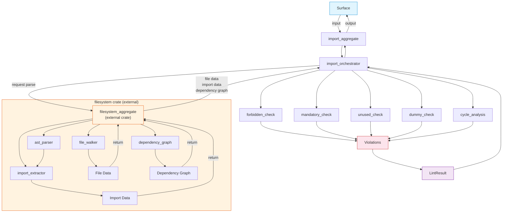

# FRD — import-rules (v1.12.1)

## System Overview

The import-rules crate enforces correct structural boundaries and dependency flows across the 7-layer AES architecture. It validates every import statement against a config-driven dependency, detects dummy/stub code created to circumvent unused-import warnings, and identifies circular dependencies at the layer level.File system operations are handled by the external `filesystem` crate. The import-rules crate receives pre-parsed data from the filesystem crate via the filesystem aggregate trait, then delegates analysis to its internal checkers.All rule behavior is governed by YAML configuration. The crate makes no assumptions about allowed/forbidden dependencies beyond what is explicitly defined in config.

### Architecture & Data Flow



### FR-001: Layer Dependency Violation (AES201)

- **Description**: Validates imports against the AES config-driven dependency matrix. Each layer/sub-layer has explicit `allowed`, `forbidden`, and `mandatory` rules defined in YAML configuration via a `conditions` array. All rules are per-scope, config-driven.
- **Input**: File data, import data (from filesystem crate), architecture configuration (with `conditions` array), layer map.
- **Output**:

  - `allowed` match → pass (no diagnostic).
  - `forbidden` match → AES201 **CRITICAL** diagnostic with file path, line number, source scope, forbidden layer, and allowed layers.
- **Dependency Model (AES-DI)**:

  AES uses **dependency injection** as the inter-layer wiring mechanism. Layers do not import each other directly; they import from **contract** (protocol/aggregate) and receive dependencies

  ```
                      ┌──────────────────────────────────┐
                      │             root                  │
                      │  (composition root / DI wiring)   │
                      │  allowed: ALL layers              │
                      └──────┬───────────────────────────┘
                             │ wires
                ┌────────────┼─────────────┐
                ▼            ▼             ▼
           ┌────────┐  ┌─────────┐  ┌──────────────┐
           │surface │  │  agent  │  │ capabilities │
           └───┬────┘  └────┬────┘  └──────┬───────┘
               │            │              │
               │  imports   │  imports     │  imports
               ▼            ▼              ▼
          ┌──────────────────────────────────────────┐
          │      contract (protocol / aggregate)      │
          └──────────────────┬───────────────────────┘
                             │
                             ▼
                    ┌──────────────────┐
                    │    taxonomy       │
                    │ (vo / entity /   │
                    │  error / event / │
                    │  constant)       │
                    └──────────────────┘

           utility ←── flexible, imports taxonomy only
                       imported BY capabilities, agent, surface
  ```

  **Rationale**: Agent does not import capabilities because agent receives capabilities via DI (trait objects). Surface does not import agent because surface receives orchestrator via DI from contract aggregate. Utility does not require contract and remains flexible.
- **Per-Scope Rules**


  | Scope                          | Allowed                                                    | Forbidden                                               | Mandatory                              |
  | -------------------------------- | ------------------------------------------------------------ | --------------------------------------------------------- | ---------------------------------------- |
  | `taxonomy(vo)`                 | taxonomy                                                   | agent, surface, contract, utility, capabilities, root   | —                                     |
  | `taxonomy(entity,error,event)` | taxonomy                                                   | agent, surface, contract, utility, capabilities, root   | taxonomy(vo\|constant)                 |
  | `taxonomy(constant)`           | taxonomy                                                   | agent, surface, contract, utility, capabilities, root   | —                                     |
  | `utility`                      | taxonomy                                                   | agent, surface, contract, capabilities, root            | —                                     |
  | `contract(protocol)`           | taxonomy, contract                                         | agent, surface, capabilities, contract(aggregate), root | taxonomy                               |
  | `contract(aggregate)`          | taxonomy, contract                                         | agent, surface, capabilities, root                      | taxonomy                               |
  | `capabilities`                 | taxonomy, contract, utility                                | surface, agent, capabilities, root                      | taxonomy, contract(protocol)           |
  | `agent(orchestrator)`          | taxonomy, contract(aggregate), contract(protocol), utility | surface, capabilities, root                             | taxonomy, contract(aggregate)          |
  | `surface(command               | controller                                                 | page)`                                                  | taxonomy, contract(aggregate), utility |
  | `surface(hook                  | store                                                      | action                                                  | screen                                 |
  | `surface(component             | view                                                       | layout)`                                                | taxonomy                               |
  | `root`                         | taxonomy, contract, capabilities, agent, surface           | —                                                      | —                                     |
- **Key directional rules** (derived from config):

  ```
  capabilities → utility          ✅  (one-way)
  utility → capabilities          ❌

  surface(command) → utility      ✅  (one-way, command/controller/page only)
  surface(hook) → utility         ❌
  surface(component) → utility    ❌

  agent → utility                 ✅
  agent → capabilities            ❌  (via DI)

  surface → agent                 ❌  (via DI)
  surface → contract(aggregate)   ✅  (command/controller/page only)
  surface → contract(protocol)    ❌

  contract(protocol) → contract(aggregate)  ❌
  contract(aggregate) → contract(protocol)  ✅
  ```
- **Enforcement model**: Whitelist + Blacklist hybrid.

  - Target layer in `allowed` → **pass**.
  - Target layer in `forbidden` → **AES201 CRITICAL**.
- **Import extraction**: Performed by the filesystem crate via full AST parsing. import-rules receives pre-extracted import data.

  - Rust: `ItemUse` nodes via `syn` — handles `use`, `pub use`, `pub(crate) use`, grouped imports `use foo::{A, B}`, glob imports `use foo::*`, and multi-line imports.
  - Python: `from X import Y` and `import X` via full AST parser.
  - TypeScript: `import { X } from`, `import X from`, `import * as X from`, side-effect imports, and `export { X } from` re-exports via full AST parser.
- **Layer detection**: Detected from filename prefix of the importing file (`taxonomy_*` → taxonomy, `contract_*` → contract, etc.) and from the import target path segments. Whole-word segment matching (split on `:`, `.`, `/`, `\` — never substring `contains()`).
- **Barrel resolution**: When direct module-path matching fails (import through `__init__.py`, `mod.rs`, `index.ts` hides the original file name), resolve each imported symbol through the barrel file to detect the original source file and its layer prefix (see FR-007).
- **Scope matching**: Files are matched to `conditions` entries via filename prefix and suffix. Files matching multiple conditions are checked against **all** matched conditions.
- **Edge Cases**:

  - Circular imports across layers are detected by AES205, not AES201.
  - Conditional imports (`#[cfg(...)]` blocks) are skipped during import extraction.
  - Barrel files (`mod.rs`, `lib.rs`, `main.rs`, `__init__.py`, `index.ts`) are skipped for scope-level checks.
  - Imports inside comments or string literals are NOT extracted (AST guarantees this).
  - Files matching multiple scope conditions are checked against all matched conditions.
- **Error Handling**: Unreadable files are skipped with `PARSE_WARN` warning (see FR-006). Files with unparseable content produce no violations (fail-safe). Parse failures produce empty import lists.

---

### FR-002: Mandatory Layer Imports (AES202)

- **Description**: Verifies that specific scopes contain required imports as defined in the `mandatory` field of each `conditions` entry.
- **Input**: File data, import data (from filesystem crate), architecture configuration, layer map.
- **Output**: List of AES202 HIGH diagnostics with file path, source scope, and required import.
- **Business Rules**:

  - For each file, match against `conditions` entries. For each matched condition with a non-null `mandatory` list, check that at least one import targets each required layer/scope.
  - Direct match: check if any import line's module path segments match the required layer name.
  - Scope match: check if any import satisfies the required scope pattern (e.g., `contract(protocol)` requires an import matching `contract` layer with `_protocol` suffix).
  - Barrel resolution fallback: When direct module-path matching fails, resolve through barrel file (FR-007).
  - Files with empty or null `mandatory` config are skipped.
  - `__init__.py` files are skipped for mandatory checks.
  - `mod.rs`, `lib.rs`, `main.rs` are skipped for scope-level mandatory checks.
- **Edge Cases**: Files with multiple roles use the primary layer prefix. Files without a recognized prefix are skipped.
- **Error Handling**: Unreadable files are skipped with `PARSE_WARN`. Missing config defaults to no mandatory requirements.

---

### FR-003: Unused Import Detection (AES203)

- **Description**: Detects and flags imported symbols that are never referenced within the file body. Uses AST-based usage tracking for all languages.
- **Input**: File data, import data (from filesystem crate).
- **Output**: List of AES203 MEDIUM diagnostics with file path, line number, and unused symbol name.
- **Business Rules**:

  - **Import extraction**: Performed by the filesystem crate via full AST parsing. import-rules receives pre-extracted import data with all aliases and full paths.

    - Rust: All `ItemUse` nodes via `syn`. Each imported alias is recorded with its full path.
    - Python: `from X import Y` and `import X` aliases via full AST parser.
    - TypeScript: Named imports, default imports, namespace imports, and re-exports via full AST parser.
  - **Usage detection (AST)**:

    - Walk the AST to collect all identifier references.
    - An imported symbol is "used" if its name appears as an identifier reference anywhere in the file body (excluding the import statement itself).
    - Usage inside `#[derive(...)]` attributes is detected via attribute parsing — no hardcoded whitelist.
    - Usage inside macro invocations (non-derive) is **NOT tracked** in v1.12. Imported symbols that appear ONLY inside macro bodies are **exempt from AES203** (skip, not flag). Full macro expansion is planned for v2.0 (see FR-009).
  - **Exemptions**:

    - Barrel files (`__init__.py`, `mod.rs`, `lib.rs`, `main.rs`, `index.ts`, `index.js`) are skipped — re-exports are intentional public API.
    - `pub use` / `export { X } from` re-exports are treated as used (they define public API).
    - `__future__` imports (Python) are skipped — they affect parsing behavior, not runtime usage.
    - Wildcard imports (`use foo::*`, `export * from`) are flagged as unused (cannot verify individual symbol usage).
    - `#[cfg(...)]` conditional blocks are skipped during import extraction.
    - Symbols appearing only inside macro bodies (non-derive) are exempt.
  - **Exported symbol detection**: Symbols exported via `__all__` (Python), `export { X }` (TS), or `pub use` (Rust) are treated as used.
- **Edge Cases**:

  - Multi-line imports are handled natively by AST.
  - Aliased imports (`use foo::Bar as Baz`) track the alias `Baz`, not the original `Bar`.
  - Imports used only in type annotations are counted as used.
  - Imports used only in doc comments (`/// [`FilePath`]`) are NOT counted as used.
- **Error Handling**: Files that fail AST parsing produce `PARSE_WARN` warning and no violations. Unreadable files produce no violations.

---

### FR-004: Dummy Import Detection (AES204)

- **Description**: Detects imports, functions, and trait implementations that are dummy/stub code existing only to suppress unused-import warnings. This rule specifically targets **AI-generated cheating patterns** where AI creates dummy functions to make imports appear "used" and circumvent AES203.
- **Input**: File data, import data (from filesystem crate), layer map.
- **Output**: List of AES204 HIGH diagnostics with file path, line number, dummy symbol name, and intent description.
- **Business Rules**:

  - **Dummy function detection (AST)**:

    - Rust: Extract `ItemFn` nodes via `syn`. Functions named `_use_*` or `dummy_*` are flagged.
    - Python: Detect `def _use_*` and `def dummy_*` via AST.
    - TypeScript: Detect `function _use*`, `function dummy*`, `const _use*`, `const dummy*` via AST.
  - **Dummy trait implementation detection (AST)**:

    - Rust: Extract `ItemImpl` nodes via `syn`. Implementations where ALL method bodies are empty, `todo!()`, `unimplemented!()`, `panic!()`, or `unreachable!()` are flagged.
    - Detection uses AST body analysis, not line-by-line brace counting.
  - **Dummy import detection**:

    - Imported symbols that appear ONLY inside dummy function ranges (not in real logic) are flagged.
    - Symbol usage checking skips: import lines, comment lines, dummy function ranges, dummy trait impl ranges, `PhantomData` lines.
    - Whole-word matching is used (manual character boundary check, not regex `\b`).
    - String-literal-only usage is detected and excluded.
  - **Taxonomy intent checking**:

    - If a file has dummy functions AND imports taxonomy VOs (`taxonomy_*`), but those VOs are used only inside dummy functions (not in real logic), flag as intent violation.
  - **Surface logic checking**:

    - Surface files must not call business logic functions directly (e.g., `lint_path(`, `compute_score(`, `has_critical(`, `walk_rs_files(`).
    - These must be delegated to the aggregate layer.
  - **Barrel file exemption**: Barrel files are skipped for all dummy checks.
  - **`__future__` import exemption**: Python `from __future__ import ...` is skipped.
- **Relationship with AES203**: AES203 and AES204 are **independent rules without deduplication**.

  - AES203 detects imports that are truly never referenced.
  - AES204 detects imports that *appear* referenced but only inside dummy functions created to circumvent AES203.
  - A single import may trigger **both** AES203 and AES204 if it is unused in real code AND its only "usage" is inside a dummy function. This is intentional — it signals that both the import and the dummy function should be removed.
- **Edge Cases**:

  - Re-exports (`pub use`, `export { X } from`) are not flagged as dummy.
  - Trait implementations with at least one non-dummy method are not flagged.
  - Multi-line function bodies are handled by AST.
- **Error Handling**: Files that fail AST parsing produce `PARSE_WARN` warning and no violations. Unreadable files produce no violations.

---

### FR-005: Circular Dependency Detection (AES205)

- **Description**: Builds a dependency graph of imports across all workspace files and detects cycles using 3-color DFS.
- **Input**: File data, import data, dependency graph (from filesystem crate), architecture configuration, layer map.
- **Output**: List of AES205 CRITICAL diagnostics with cycle path description.
- **Business Rules**:

  - **Module extraction**: Performed by the filesystem crate via full AST parsing. import-rules receives pre-built `DiGraph` with dependency edges.
    - Rust: `ItemUse` and `ItemMod` nodes via `syn` to build import edges.
    - Python: `from X import Y` and `import X` via AST.
    - TypeScript: `import` and `export from` via AST.
  - **Barrel-aware resolution**: For imports through barrel files, resolve to the original source file so the dependency graph reflects actual file-to-file dependencies.
  - **Layer-level graph**: Import edges are normalized to layer-level edges (e.g., `capabilities → contract`). Cycle detection operates on the layer graph, not the file graph.
  - **Cycle detection algorithm**: 3-color DFS (White → Gray → Black). A Gray → Gray edge indicates a back edge (cycle). Cycle nodes are extracted via parent-chain traversal.
  - **Deduplication**: Cycles are deduplicated by sorted node set to avoid reporting the same cycle multiple times.
  - **Direct cycles** (A → B → A) and **indirect cycles** (A → B → C → A) are both flagged.
  - **Cross-layer crate imports**: `crate::` and `lint_arwaky::` prefixed imports are resolved to their target layer. Non-cross-layer crate imports (e.g., `crate::common::FilePath` within the same crate) are skipped.
- **Edge Cases**:

  - **Self-imports are silently ignored** (a file importing itself does not create a cycle and produces no diagnostic).
  - Conditional cycles (imports inside `#[cfg(...)]` blocks) are not detected (conditional blocks are skipped).
  - Files without a recognized layer prefix are excluded from the layer graph.
- **Error Handling**: Unreadable files are skipped with `PARSE_WARN`. Files with unparseable content contribute no edges. The cycle detection algorithm itself is pure graph theory — no parsing errors possible.

---

---

## API Contract


| Operation                          | Input                                                   | Output               | Purpose                                          |
| ------------------------------------ | --------------------------------------------------------- | ---------------------- | -------------------------------------------------- |
| Full import audit                  | Target path (file or directory)                         | Lint results         | Run all import checks (AES201–AES205)           |
| Forbidden import check (AES201)    | File data, import data, configuration                   | CRITICAL violations  | Validate imports against layer dependency matrix |
| Mandatory import check (AES202)    | File data, import data, configuration                   | HIGH violations      | Verify required imports per scope                |
| Unused import check (AES203)       | File data, import data                                  | MEDIUM violations    | Detect symbols never referenced in code          |
| Dummy import check (AES204)        | File data, import data, layer map                       | HIGH violations      | Detect stub code circumventing AES203            |
| Circular dependency check (AES205) | File data, import data, dependency graph, configuration | CRITICAL violations  | Detect layer-level import cycles                 |
| Barrel resolution                  | Module path, symbol name, root dir                      | Resolved import info | Resolve import through barrel re-export files    |

---

## Integration Points

- **Internal** (import-rules crate):

  - The config system shared module — `ArchitectureConfig`, `ArchitectureRule`, `ArchitectureCondition`, `LayerDefinition`, `LayerMapVO` for rule configuration.
  - The import rules contract module — aggregate and protocol traits for runner, forbidden, mandatory, unused, dummy, cycle, and purpose checks.
  - The import rules taxonomy module — value objects for violations, errors, resolved imports, graph coloring, and import purpose.
  - The import rules utility module — barrel resolution, scope matching, dummy detection, cycle detection, and path normalization.
  - The common shared module — path, line number, severity, lint result, lint message, identity, symbol name, layer name, and language value objects.
- **External**:

  - **`filesystem` crate** — provides `filesystem_aggregate` which handles:
    - File walking and discovery (`file_walker`).
    - Full AST parsing for all languages (`ast_parser` — Rust via `syn`, Python/TS via tree-sitter).
    - Import extraction from AST (`import_extractor`).
    - Dependency graph construction (`dependency_graph`).
    - Returns file data, import data, and dependency graph to the caller.
    - Shared AST parser utilities: `utility_orphan_rust_parser`, `utility_orphan_python_parser`, `utility_orphan_ts_parser`, `utility_orphan_parser_dispatch`, `taxonomy_orphan_parse_result_vo`.
  - `syn` crate (v2, features: `full`, `visit`, `parsing`) — Rust AST parsing (via filesystem crate).
  - `tree-sitter` + `tree-sitter-python` + `tree-sitter-typescript` — Python/TS full AST parsing (via filesystem crate).
  - No network calls. No filesystem writes. Pure static analysis.

---

## Non-functional Requirements

- **Performance**:

  - Check 1,000 files in < 2 seconds (validated via criterion benchmark).
  - Check 5,000 files in < 8 seconds.
  - AES205 cycle detection is O(V + E) — linear in the number of layer-level edges.
  - File-level checks (AES203, AES204) are parallelized via `rayon` (`par_iter`).
  - Mandatory and forbidden checks (AES201, AES202) run concurrently via `rayon::join`.
- **Memory**:

  - O(n) where n = number of imports across all files.
  - AST parse results are not cached globally — each file is parsed once per check invocation.
  - Barrel file content is read on-demand (not pre-loaded).
- **Accuracy**:

  - **All languages WAJIB full AST.** No regex-based or line-based parsing is acceptable as a final implementation.
  - **Zero false positives** for valid imports across all supported languages (Rust, Python, TypeScript/JavaScript).
  - AST parsing eliminates false positives from: matches inside comments, matches inside string literals, multi-line statement fragmentation, and dynamic regex failures.
  - AES203 accuracy: AST-based usage tracking eliminates hardcoded whitelists and heuristics.
  - Known limitation: macro-generated code (see FR-009). Macro body exemption is the only accepted source of potential false negatives.
- **Concurrency**: Thread-safe via trait object shared ownership. File-level analysis is parallelized via `rayon`. AST parsing is stateless and thread-safe. No async runtime dependency.

---

## Test Scenarios / QA Checklist

### AES201 — Forbidden Import


| #  | Scenario                                            | Expected                            | Rule   |
| ---- | ----------------------------------------------------- | ------------------------------------- | -------- |
| 1  | File imports from forbidden layer                   | AES201 CRITICAL                     | AES201 |
| 2  | File imports from allowed layer                     | No violation                        | pass   |
| 3  | File imports from layer not in allowed or forbidden | AES201 WARNING (grey area)          | AES201 |
| 4  | File with no imports                                | No violation                        | pass   |
| 5  | capabilities file imports utility                   | No violation (allowed)              | pass   |
| 6  | utility file imports capabilities                   | AES201 CRITICAL (forbidden)         | AES201 |
| 7  | surface(component) imports contract                 | AES201 CRITICAL (forbidden)         | AES201 |
| 8  | surface(command) imports contract(aggregate)        | No violation (allowed)              | pass   |
| 9  | agent imports capabilities                          | AES201 CRITICAL (forbidden, via DI) | AES201 |
| 10 | contract(protocol) imports contract(aggregate)      | AES201 CRITICAL (forbidden)         | AES201 |

### AES202 — Mandatory Import


| # | Scenario                                                   | Expected                  | Rule   |
| --- | ------------------------------------------------------------ | --------------------------- | -------- |
| 1 | Capabilities file missing taxonomy import                  | AES202 violation          | AES202 |
| 2 | Capabilities file missing contract(protocol) import        | AES202 violation          | AES202 |
| 3 | Capabilities file has both taxonomy and contract(protocol) | No violation              | pass   |
| 4 | File in exception list                                     | No violation — exception | excl   |
| 5 | taxonomy(entity) missing taxonomy(vo) import               | AES202 violation          | AES202 |

### AES203 — Unused Import


| # | Scenario                                        | Expected                | Rule   |
| --- | ------------------------------------------------- | ------------------------- | -------- |
| 1 | Import declared but never referenced in code    | AES203 violation        | AES203 |
| 2 | Import declared and used in code                | No violation            | pass   |
| 3 | Import used only in comments                    | AES203 violation        | AES203 |
| 4 | Import used only inside macro body (non-derive) | No violation (exempt)   | pass   |
| 5 | Import used in`#[derive(...)]`                  | No violation (detected) | pass   |

### AES204 — Dummy Import


| #  | Scenario                                                                        | Expected                                | Rule   |
| ---- | --------------------------------------------------------------------------------- | ----------------------------------------- | -------- |
| 1  | Function named`_use_serialization()` containing import reference                | AES204 violation (dummy function)       | AES204 |
| 2  | Function named`dummy_helper()` containing import reference                      | AES204 violation (dummy function)       | AES204 |
| 3  | Trait impl with all method bodies =`todo!()`                                    | AES204 violation (dummy impl)           | AES204 |
| 4  | Trait impl with 1 real method + 1`todo!()` method                               | No violation (has real logic)           | pass   |
| 5  | Import`Foo` only referenced inside `_use_foo()`, not in real logic              | AES204 violation (dummy import)         | AES204 |
| 6  | Import`Bar` referenced in `_use_bar()` AND in real function                     | No violation (real usage exists)        | pass   |
| 7  | `pub use` re-export                                                             | No violation (public API)               | pass   |
| 8  | Taxonomy file has`_use_vo()` referencing taxonomy VO, VO not used in real logic | AES204 violation (taxonomy intent)      | AES204 |
| 9  | Surface file calls`lint_path(` directly                                         | AES204 violation (surface logic bypass) | AES204 |
| 10 | Barrel file (`mod.rs`) with re-exports                                          | No violation (exempt)                   | pass   |

### AES205 — Circular Dependency


| # | Scenario                          | Expected                        | Rule   |
| --- | ----------------------------------- | --------------------------------- | -------- |
| 1 | Two layers importing each other   | AES205 violation                | AES205 |
| 2 | Linear dependency chain           | No violation                    | pass   |
| 3 | Self-import (file imports itself) | No violation (silently ignored) | pass   |
| 4 | Indirect cycle (A → B → C → A) | AES205 violation                | AES205 |

### Configuration


| # | Scenario                         | Expected                               | Rule   |
| --- | ---------------------------------- | ---------------------------------------- | -------- |
| 1 | Rule disabled in config          | No violation for that rule             | config |
| 2 | File in exceptions list          | No violation for that file             | config |
| 3 | File matches multiple conditions | Checked against all matched conditions | config |

---

## Assumptions & Constraints

- Workspace follows AES convention with `crates/`, `packages/`, `modules/` directories.
- Layer hierarchy is defined in config YAML and detected from filename prefixes (hardcoded AES convention).
- Naming convention validation is handled by the naming rules crate; import-rules assumes filenames are correctly named.
- All languages use full AST parsing (Rust via `syn`, Python/TS via tree-sitter), implemented in the external filesystem crate. No regex or line-based parsing in final implementation.
- No network calls are required; all analysis is local filesystem.
- Configuration is loaded once and reused across all checks in a scan.
- Macro-generated code (Rust `macro_rules!`, proc macros) is not expanded — imports and usage inside macros are invisible to the detector. Macro body exemption applies to AES203 (see FR-009).
- Barrel file resolution is one level deep — nested barrel chains are not fully resolved.
- AES203 and AES204 are independent and may both flag the same import (no deduplication).
- File walking, AST parsing, import extraction, and dependency graph construction are handled by the external filesystem crate. import-rules receives pre-parsed data and performs analysis only.

---

## Glossary


| Term                 | Definition                                                                                                                                            |
| ---------------------- | ------------------------------------------------------------------------------------------------------------------------------------------------------- |
| **AES**              | Agentic Engineering System — the 7-layer coding convention                                                                                           |
| **Layer**            | Architectural boundary (taxonomy, contract, utility, capabilities, agent, surface, root)                                                              |
| **Diagnostic**       | Violation report with file path, line, column, rule code, severity, and message                                                                       |
| **Dummy Import**     | Import that exists only to suppress unused-import warnings, placed inside`_use_*` functions. A pattern of AI-generated code cheating.                 |
| **Forbidden Import** | Import that violates layer boundary rules defined in YAML configuration                                                                               |
| **Mandatory Import** | Import that a scope must contain per its architectural contract                                                                                       |
| **Barrel file**      | A package marker or re-export file (`__init__.py`, `mod.rs`, `index.ts`)                                                                              |
| **AST**              | Abstract Syntax Tree — structured representation of source code produced by a parser                                                                 |
| **`syn`**            | Rust crate for parsing Rust source code into an AST                                                                                                   |
| **tree-sitter**      | Incremental parsing library used for Python/TypeScript full AST parsing                                                                               |
| **Filesystem crate** | External crate that handles file walking, AST parsing, import extraction, and dependency graph construction. Returns pre-parsed data to import-rules. |
| **Parse result**     | Typed struct containing extracted imports, trait impls, struct defs, trait defs, and mod declarations                                                 |
| **`parse_ok`**       | Boolean flag on parse results indicating whether parsing succeeded                                                                                    |
| **`PARSE_WARN`**     | Warning diagnostic (non-AES code) emitted when a file fails to parse                                                                                  |
| **Re-export**        | A`pub use` (Rust) or `export { X } from` (TS) that re-exports a symbol from another module                                                            |
| **Scope pattern**    | Config syntax like`taxonomy(vo)` or `surface(command                                                                                                  |
| **Conditions array** | YAML structure where each entry defines scope-specific`allowed`, `forbidden`, and `mandatory` rules                                                   |
| **3-color DFS**      | Graph traversal algorithm (White/Gray/Black) used for cycle detection                                                                                 |
| **Dependency edge**  | A directed edge in the layer dependency graph (e.g.,`capabilities → contract`)                                                                       |
| **ResolvedImport**   | VO carrying the result of barrel file resolution (original module, resolved file, resolved layer)                                                     |
| **Grey area**        | Import target that is neither in`allowed` nor `forbidden` list — produces WARNING, not CRITICAL                                                      |
| **AES-DI**           | AES Dependency Injection model — layers import from contract, receive dependencies via trait objects                                                 |

---

## Appendix A: YAML Configuration Schema

### Top-Level Structure

```yaml
ignored_paths:
    - "/tests"
    - "/target"
architecture:
  enabled: true
  rules:
    AES201: { ... }
    AES202: { ... }
    AES203: { ... }
    AES204: { ... }
    AES205: { ... }
```

### Rule Configuration Schema (AES201)

### Condition Entry Schema

```yaml
- scope: "<layer>(<sub-layer>|<sub-layer>)"   # Scope pattern
  allowed: ["<layer>", ...]                    # Whitelist — pass
  forbidden: ["<layer>", ...]                  # Blacklist — AES201 CRITICAL
  mandatory: ["<layer>(<sub>)", ...] | null    # Required imports (AES202)

```

**Enforcement model**: Whitelist + Blacklist hybrid.

- Target in `allowed` → pass.
- Target in `forbidden` → AES201 CRITICAL.
- Target in neither → AES201 WARNING (grey area).

### Scope Pattern Syntax


| Pattern                        | Meaning                               |
| -------------------------------- | --------------------------------------- |
| `taxonomy`                     | All taxonomy files                    |
| `taxonomy(vo)`                 | Only taxonomy value objects           |
| `taxonomy(entity,error,event)` | Taxonomy entities, errors, and events |
| `contract(protocol)`           | Only contract protocols               |
| `contract(aggregate)`          | Only contract aggregates              |
| `capabilities`                 | All capability files                  |
| `agent(orchestrator)`          | Only agent orchestrators              |
| `surface(command               | controller                            |
| `surface(hook                  | store                                 |
| `surface(component             | view                                  |
| `root`                         | Root / composition root               |

### Layer Detection (Hardcoded Convention)


| Filename Pattern    | Detected Layer |
| --------------------- | ---------------- |
| `taxonomy_*.rs`     | taxonomy       |
| `contract_*.rs`     | contract       |
| `capabilities_*.rs` | capabilities   |
| `utility_*.rs`      | utility        |
| `agent_*.rs`        | agent          |
| `surface_*.rs`      | surface        |
| `root_*.rs`         | root           |

Files without a recognized prefix are skipped by layer rules

---

## Appendix B: File Discovery Algorithm

File discovery is handled by the **filesystem crate** (external). The import-rules crate requests file discovery via `filesystem_aggregate` and receives pre-parsed results. The algorithm below documents the behavior of the filesystem crate's file walker for reference.

### Ignore Rules

Files and directories are skipped if they match any of these criteria:

1. **Config-level ignores**: Paths listed in `ignored_paths` in the YAML config.
2. **Default skip directories**: `.git`, `node_modules`, `target`, `dist`, `build`, `.venv`, `__pycache__`, `tests`.
3. **Hidden directories**: Any directory starting with `.` (e.g., `.github`, `.vscode`).
4. **File extension**: Only files with extensions `rs`, `py`, `js`, `ts`, `jsx`, `tsx` are collected.
5. **Workspace restriction**: At root level, only `crates/`, `packages/`, `modules/` subdirectories are scanned.
6. **Symlink safety**: Symlink targets outside the workspace root are pruned to prevent path traversal.

### Language Detection


| Extension     | Language   |
| --------------- | ------------ |
| `.rs`         | Rust       |
| `.py`         | Python     |
| `.js`, `.jsx` | JavaScript |
| `.ts`, `.tsx` | TypeScript |

---

## Reference

- PRD: [PRD.md](../../PRD.md)
- Architecture: [ARCHITECTURE.md](../../ARCHITECTURE.md)
- Filesystem crate
- Shared crate
