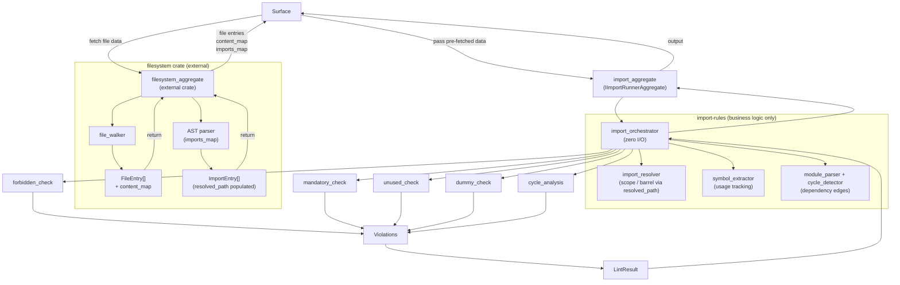

# FRD — import-rules

## Reference

- PRD: [PRD.md](../../PRD.md)
- Backlog: [BACKLOG.md](BACKLOG.md) — real condition for this feature; this file is specification only.

## System Overview

The import-rules crate enforces correct structural boundaries and dependency flows across the 7-layer AES architecture. It validates every import statement against a config-driven dependency matrix, detects dummy/stub code created to circumvent unused-import warnings, and identifies circular dependencies at the layer level. File discovery, raw content reads, AST parsing (import extraction + identifier extraction), and barrel resolution are handled by the filesystem aggregate (`IFilesystemAggregate`). The Surface fetches file entries, import data, and `used_identifiers` (via `used_identifiers_for(path)`) from filesystem first, then passes pre-fetched data to the import orchestrator. The import-rules crate receives `&[FileEntry]`, `content_map`, `imports_map`, and `used_identifiers_map` — all pre-fetched by the caller. The import orchestrator does **zero I/O** — it only performs business logic analysis. All rule behavior is governed by YAML configuration. The crate makes no assumptions about allowed/forbidden dependencies beyond what is explicitly defined in config.

### Architecture & Data Flow


```mermaid
flowchart TD
    A["Surface"] -->|"fetch file data"| D["filesystem_aggregate\n(external crate)"]

    subgraph FS ["filesystem crate (external)"]
        D --> E1["file_walker"]
        D --> E2["AST parser\n(imports_map)"]
        E1 --> G1["FileEntry[]\n+ content_map"]
        E2 --> G2["ImportEntry[]\n(resolved_path populated)"]
    end

    G1 -->|"return"| D
    G2 -->|"return"| D
    D -->|"file entries\ncontent_map\nimports_map"| A

    A -->|"pass pre-fetched data"| B["import_aggregate\n(IImportRunnerAggregate)"]
    B --> C["import_orchestrator\n(zero I/O)"]

    subgraph IR ["import-rules (business logic only)"]
        C --> P1["import_resolver\n(scope / barrel via resolved_path)"]
        C --> P2["symbol_extractor\n(usage tracking)"]
        C --> P3["module_parser + cycle_detector\n(dependency edges)"]
    end

    C --> H1["forbidden_check"]
    C --> H2["mandatory_check"]
    C --> H3["unused_check"]
    C --> H4["dummy_check"]
    C --> H5["cycle_analysis"]
    H1 --> I["Violations"]
    H2 --> I
    H3 --> I
    H4 --> I
    H5 --> I

    I --> J["LintResult"]
    J --> C
    C --> B
    B -->|output| A

```

## Functional Requirements

### FR-IMPORTRULES-001: Layer Dependency Violation (AES201)

- **Description**: Validates imports against the AES config-driven dependency matrix. Each layer/sub-layer has explicit `allowed`, `forbidden`, and `mandatory` rules defined in YAML configuration via a `conditions` array. All rules are per-scope, config-driven.
- **Input**: File data, raw file contents (from filesystem crate), architecture configuration (with `conditions` array), layer map.
- **Output**:
  - `allowed` match → pass (no diagnostic).
  - `forbidden` match → AES201 **CRITICAL** diagnostic with file path, line number, source scope, forbidden layer, and allowed layers.
- **Business Rules**:
  - Per-scope rules are defined in the YAML `conditions` array; every rule is config-driven.
  - The enforcement model is a whitelist + blacklist hybrid: `allowed` → pass, `forbidden` → CRITICAL, neither → WARNING.
  - Layer detection uses whole-word filename-prefix and path-segment matching (split on `:`, `.`, `/`, `\`).
  - Barrel files are skipped for scope-level checks.
  - Files matching multiple scope conditions are checked against all of them.
- **Dependency Model (AES-DI)**:

  AES uses **dependency injection** as the inter-layer wiring mechanism. Layers do not import each other directly; they import from **contract** (protocol/aggregate) and receive dependencies

  ```
                      ┌──────────────────────────────────┐
                      │             root                  │
                      │  (composition root / DI wiring)   │
                      │  allowed: ALL layers              │
                      └──────┬───────────────────────────┘
                             │ wires
                ┌────────────┼─────────────┐
                ▼            ▼             ▼
           ┌────────┐  ┌─────────┐  ┌──────────────┐
           │surface │  │  agent  │  │ capabilities │
           └───┬────┘  └────┬────┘  └──────┬───────┘
               │            │              │
               │  imports   │  imports     │  imports
               ▼            ▼              ▼
          ┌──────────────────────────────────────────┐
          │      contract (protocol / aggregate)      │
          └──────────────────┬───────────────────────┘
                             │
                             ▼
                    ┌──────────────────┐
                    │    taxonomy       │
                    │ (vo / entity /   │
                    │  error / event / │
                    │  constant)       │
                    └──────────────────┘

           utility ←── flexible, imports taxonomy only
                       imported BY capabilities, agent, surface
  ```

  **Rationale**: Agent does not import capabilities because agent receives capabilities via DI (trait objects). Surface does not import agent because surface receives orchestrator via DI from contract aggregate. Utility does not require contract and remains flexible.
- **Per-Scope Rules**
  | Scope                                  | Allowed                                                    | Forbidden                                               | Mandatory                     |
  | ---------------------------------------- | ------------------------------------------------------------ | --------------------------------------------------------- | ------------------------------- |
  | `taxonomy(vo)`                         | taxonomy                                                   | agent, surface, contract, utility, capabilities, root   | —                            |
  | `taxonomy(entity,error,event)`         | taxonomy                                                   | agent, surface, contract, utility, capabilities, root   | taxonomy(vo|constant)        |
  | `taxonomy(constant)`                   | taxonomy                                                   | agent, surface, contract, utility, capabilities, root   | —                            |
  | `utility`                              | taxonomy,utility                                           | agent, surface, contract, capabilities, root            | taxonomy                      |
  | `contract(protocol)`                   | taxonomy, contract                                         | agent, surface, capabilities, contract(aggregate), root | taxonomy                      |
  | `contract(aggregate)`                  | taxonomy, contract                                         | agent, surface, capabilities, root                      | taxonomy                      |
  | `capabilities`                         | taxonomy, contract, utility                                | surface, agent, capabilities, root                      | taxonomy, contract(protocol)  |
  | `agent(orchestrator)`                  | taxonomy, contract(aggregate), contract(protocol), utility | surface, capabilities, root                             | taxonomy, contract(aggregate) |
  | surface(command, controller, page)   | taxonomy,contract(aggregate)                               | capabilities, utility, agent                            | taxonomy                      |
  | surface(hook, store, action, screen) | taxonomy,contract(aggregate)                               | capabilities, utility, agent                            | taxonomy                      |
  | surface(component, view, layout)       | taxonomy                                                   | capabilities, utility, agent                            | taxonomy                      |
  | `root`                                 | taxonomy, contract, capabilities, agent, surface, utility  | —                                                      | —                            |
- **Enforcement model**: Whitelist + Blacklist hybrid.
  - Target layer in `allowed` → **pass**.
  - Target layer in `forbidden` → **AES201 CRITICAL**.
- **Import extraction**: Pre-fetched by Surface via filesystem crate's AST parser (`IParserProtocol` → `ImportEntry`). The `imports_map` (HashMap of file path to `Vec<ImportEntry>`) is passed to the import orchestrator. Each `ImportEntry` contains `raw_path`, `resolved_path` (populated by barrel resolution), `symbols`, `is_wildcard`, `is_reexport`, and `import_type`. Import-rules consumes `ImportEntry` fields directly — no text-based parsing.
  - Rust: `use_declaration` and `mod_item` nodes via tree-sitter.
  - Python: `import_statement` and `import_from_statement` nodes via tree-sitter.
  - TypeScript/JavaScript: `import_statement`, `export_statement`, and `require()` calls via tree-sitter.
- **Layer detection**: Detected from the layer prefix of the importing file's name (`taxonomy_` prefix → taxonomy layer, `contract_` prefix → contract layer, and so on for every AES layer) and from the import target path segments. Whole-word segment matching (split on `:`, `.`, `/`, `\` — never substring `contains()`).
- **Barrel resolution**: When direct module-path matching fails (import through a package entry point, module entry point, or barrel file hides the original file name), resolve each imported symbol through the barrel file to detect the original source file and its layer prefix (see FR-IMPORTRULES-007).
- **Scope matching**: Files are matched to `conditions` entries via filename prefix and suffix. Files matching multiple conditions are checked against **all** matched conditions.
- **Edge Cases**:
  - Circular imports across layers are detected by AES205, not AES201.
  - Conditional imports (`#[cfg(...)]` blocks) are skipped during import extraction.
  - Barrel files (module entry point, library entry point, package entry point, barrel file) are skipped for scope-level checks.
  - Imports inside comments or string literals are NOT extracted (AST guarantees this).
  - Files matching multiple scope conditions are checked against all matched conditions.
- **Error Handling**: Unreadable files are skipped silently. Files with unparseable content produce no violations (fail-safe). Parse failures produce empty import lists.

### FR-IMPORTRULES-002: Mandatory Layer Imports (AES202)

- **Description**: Verifies that specific scopes contain required imports as defined in the `mandatory` field of each `conditions` entry.
- **Input**: File data, raw file contents (from filesystem crate), architecture configuration, layer map.
- **Output**: List of AES202 HIGH diagnostics with file path, source scope, and required import.
- **Business Rules**:
  - For each file, match against `conditions` entries. For each matched condition with a non-null `mandatory` list, check that at least one import targets each required layer/scope.
  - Direct match: check if any import line's module path segments match the required layer name.
  - Scope match: check if any import satisfies the required scope pattern (e.g., `contract(protocol)` requires an import matching `contract` layer with `_protocol` suffix).
  - Barrel resolution fallback: When direct module-path matching fails, resolve through barrel file (FR-IMPORTRULES-007).
  - Files with empty or null `mandatory` config are skipped.
  - Package entry points are skipped for mandatory checks.
  - Module entry point, library entry point, and root entry point files are skipped for scope-level mandatory checks.
- **Edge Cases**: Files with multiple roles use the primary layer prefix. Files without a recognized prefix are skipped.
- **Error Handling**: Unreadable files are skipped. Missing config defaults to no mandatory requirements.

### FR-IMPORTRULES-003: Unused Import Detection (AES203)

- **Description**: Detects and flags imported symbols that are never referenced within the file body. Uses AST-based usage tracking for all languages.
- **Input**: File data, raw file contents (from filesystem crate), `used_identifiers_map` (required, from filesystem's `used_identifiers_for(path)` via tree-sitter AST).
- **Output**: List of AES203 MEDIUM diagnostics with file path, line number, and unused symbol name.
- **Business Rules**:
  - **Import extraction**: Pre-fetched by Surface via filesystem crate. Import-rules consumes `ImportEntry` fields directly via `utility_import_symbol_extractor::extract_imported_aliases_from_entries`.
    - Import data comes from `imports_map` (tree-sitter parsed `ImportEntry` with `resolved_path`, `symbols`, `is_wildcard`, `is_reexport`).
    - **Usage detection (tree-sitter AST)**: `used_identifiers` from `ParseMetadata` are required — a pre-computed `HashSet<&str>` lookup per alias. All surfaces (`run_audit` and `run_audit_with_entries`) build `used_identifiers_map` from the filesystem aggregate's `used_identifiers_for(path)` method, which reads from the tree-sitter AST cache. No fallback to line-based parsing.
    - An imported symbol is "used" if its name appears as an identifier reference anywhere in the file body (excluding the import statement itself).
    - Usage inside `#[derive(...)]` attributes is detected via attribute parsing — no hardcoded whitelist.
    - Usage inside macro invocations (non-derive) is **NOT tracked** in v1.12. Imported symbols that appear ONLY inside macro bodies are **exempt from AES203** (skip, not flag). Full macro expansion is planned for v2.0 (see FR-IMPORTRULES-009).
  - **Exemptions**:
    - Barrel files (package entry point, module entry point, library entry point, root entry point, barrel file) are skipped — re-exports are intentional public API.
    - `pub use` / `export { X } from` re-exports are treated as used (they define public API).
    - `__future__` imports (Python) are skipped — they affect parsing behavior, not runtime usage.
    - Wildcard imports (`use foo::*`, `export * from`) are flagged as unused (cannot verify individual symbol usage).
    - `#[cfg(...)]` conditional blocks are skipped during import extraction.
    - Symbols appearing only inside macro bodies (non-derive) are exempt.
    - Exported symbol detection: Symbols exported via `__all__` (Python), `export { X }` (TS), or `pub use` (Rust) are treated as used.
- **Edge Cases**:
  - Multi-line imports are handled natively by AST.
  - Aliased imports (`use foo::Bar as Baz`) track the alias `Baz`, not the original `Bar`.
  - Imports used only in type annotations are counted as used.
  - Imports used only in doc comments (`/// [`FilePath`]`) are NOT counted as used.
- **Error Handling**: Files that fail parsing produce no violations. Unreadable files produce no violations.

### FR-IMPORTRULES-004: Dummy Import Detection (AES204)

- **Description**: Detects imports, functions, and trait implementations that are dummy/stub code existing only to suppress unused-import warnings. This rule specifically targets **AI-generated cheating patterns** where AI creates dummy functions to make imports appear "used" and circumvent AES203.
- **Input**: File data, raw file contents (from filesystem crate), layer map.
- **Output**: List of AES204 HIGH diagnostics with file path, line number, dummy symbol name, and intent description.
- **Business Rules**:
  - **Dummy function detection**:
    - Rust: Line-based scanning (`utility_dummy_detector::dummy_function_ranges`). Functions named `_use_*` or `dummy_*` are flagged.
    - Python: Detect `def _use_*` and `def dummy_*` via line-based scanning.
    - TypeScript: Detect `function _use*`, `function dummy*`, `const _use*`, `const dummy*` via line-based scanning.
  - **Dummy trait implementation detection**:
    - Rust: Line-based body analysis (`utility_dummy_detector::dummy_impl_traits_with_lines` / `trait_impl_is_dummy`). Trait impls where ALL method bodies are empty, `todo!()`, `unimpl!()`, `panic!()`, or `unreachable!()` are flagged.
    - Detection uses line-by-line body analysis, not `syn` AST.
  - **Dummy import detection**:
    - Imported symbols that appear ONLY inside dummy function ranges (not in real logic) are flagged.
    - Symbol usage checking skips: import lines, comment lines, dummy function ranges, dummy trait impl ranges, `PhantomData` lines.
    - Whole-word matching is used (manual character boundary check, not regex `\b`).
    - String-literal-only usage is detected and excluded.
  - **Taxonomy intent checking**:
    - If a file has dummy functions AND imports taxonomy VOs (`taxonomy_*`), but those VOs are used only inside dummy functions (not in real logic), flag as intent violation.
  - **Surface logic checking**:
    - Surface files must not call business logic functions directly (e.g., `lint_path(`, `compute_score(`, `has_critical(`, `walk_rs_files(`).
    - These must be delegated to the aggregate layer.
  - **Barrel file exemption**: Barrel files are skipped for all dummy checks.
  - **`__future__` import exemption**: Python `from __future__ import ...` is skipped.
- **Relationship with AES203**: AES203 and AES204 are **independent rules without deduplication**.
  - AES203 detects imports that are truly never referenced.
  - AES204 detects imports that *appear* referenced but only inside dummy functions created to circumvent AES203.
  - A single import may trigger **both** AES203 and AES204 if it is unused in real code AND its only "usage" is inside a dummy function. This is intentional — it signals that both the import and the dummy function should be removed.
- **Edge Cases**:
  - Re-exports (`pub use`, `export { X } from`) are not flagged as dummy.
  - Trait implementations with at least one non-dummy method are not flagged.
  - Multi-line function bodies are handled by AST.
- **Error Handling**: Files that fail parsing produce no violations. Unreadable files produce no violations.

### FR-IMPORTRULES-005: Circular Dependency Detection (AES205)

- **Description**: Builds a dependency graph of imports across all workspace files and detects cycles using 3-color DFS.
- **Input**: File data, raw file contents (from filesystem crate), architecture configuration, layer map.
- **Output**: List of AES205 CRITICAL diagnostics with cycle path description.
- **Business Rules**:
  - **Module extraction**: Pre-fetched by Surface via filesystem crate. Import-rules uses `ImportEntry.resolved_path` (populated by barrel resolution) and `ImportEntry.raw_path` to build dependency edges. Uses `utility_import_module_parser::extract_import_modules_from_entries_resolved`.
    - Import data comes from `imports_map` (tree-sitter parsed `ImportEntry` with `resolved_path`, `symbols`).
    - Barrel resolution is handled by filesystem — `resolved_path` points to the actual source file, not the barrel re-export.
  - **Layer-level graph**: Import edges are normalized to layer-level edges (e.g., `capabilities → contract`). Cycle detection operates on the layer graph, not the file graph.
  - **Cycle detection algorithm**: 3-color DFS (White → Gray → Black). A Gray → Gray edge indicates a back edge (cycle). Cycle nodes are extracted via parent-chain traversal.
  - **Deduplication**: Cycles are deduplicated by sorted node set to avoid reporting the same cycle multiple times.
  - **Direct cycles** (A → B → A) and **indirect cycles** (A → B → C → A) are both flagged.
  - **Cross-layer crate imports**: `crate::` and `lint_arwaky::` prefixed imports are resolved to their target layer. Non-cross-layer crate imports (e.g., `crate::common::FilePath` within the same crate) are skipped.
- **Edge Cases**:
  - **Self-imports are silently ignored** (a file importing itself does not create a cycle and produces no diagnostic).
  - Conditional cycles (imports inside `#[cfg(...)]` blocks) are not detected (conditional blocks are skipped).
  - Files without a recognized layer prefix are excluded from the layer graph.
- **Error Handling**: Unreadable files are skipped. Files with unparseable content contribute no edges. The cycle detection algorithm itself is pure graph theory — no parsing errors possible.

## API Contract

### Protocol API

| Method | Input | Output | Error | Event | Description |
| --- | --- | --- | --- | --- | --- |
| `execute` | `ImportRequest` enum | `ImportResponse` enum | None | — | Single composite entry point covering the whole feature folder: audits paths, entries, and returns the adapter name. |

### Aggregate API

| Method | Input | Output | Error | Event | Description |
| --- | --- | --- | --- | --- | --- |
| `run_audit` | `FilePath` target | `Result<Vec<LintResult>, ScanError>` | Runtime error when target path does not exist | — | Full audit: discovers files, pre-fetches content and imports from the filesystem aggregate, then runs all checks. |
| `run_audit_with_entries` | `&[FileEntry]` pre-discovered files | `Vec<LintResult>` | None | — | Audit from already-discovered entries, fetching imports from the parser. |
| `run_audit_with_entries_and_imports` | `&[FileEntry]`, `&HashMap<String, Vec<ImportEntry>>` | `Vec<LintResult>` | None | — | Audit from entries plus an externally supplied import map (avoids re-fetching). |
| `name` | — | `&str` ("import-rules") | None | — | Report the adapter name for registration. |

## Integration Points

| System | Direction | Purpose | Failure mode |
| --- | --- | --- | --- |
| Config system shared module | in | Supply `ArchitectureConfig`, `ArchitectureCondition`, `LayerMapVO`, and other rule configuration | Missing config → rules fall back to defaults, no violations emitted |
| Import rules contract module | in | Provide protocol traits for runner, forbidden, mandatory, unused, dummy, and cycle capabilities | Capability unavailable → corresponding check is skipped |
| Import rules taxonomy module | in | Provide VOs for violations, errors, resolved imports, graph coloring | Invalid VO → check returns error and is skipped |
| Import rules utility module | in | Scope matching, dummy detection, cycle detection, path normalization | Utility panic → wrapped as ImportError and logged |
| Common shared module | in | Shared VOs: path, severity, lint result, lint message, identity, symbol name, layer name, language | Malformed VO → diagnostic dropped |
| Surface layer | in | Fetches all file data from filesystem aggregate and passes it to the import orchestrator | Missing data → check is skipped for that file |
| `filesystem` crate | in | File walking, AST parsing, import extraction, barrel resolution, identifier extraction | Parse failure → empty import list; path missing → error propagated |
| `syn` crate | in | Rust AST parsing for dummy detection and layer analysis | Unparseable Rust → file skipped |

## Non-functional Requirements

| Metric | Target | Measurement method |
| --- | --- | --- |
| Check 1,000 files | < 2 seconds | Criterion benchmark `bench_import_rules_throughput` |
| Check 5,000 files | < 8 seconds | Criterion benchmark `bench_import_rules_throughput` |
| Cycle detection complexity | O(V + E) linear in layer-level edges | Inspect `capabilities_cycle_import_analyzer` algorithm |
| File-level parallelism | Parallelized via `rayon` (`par_iter`) | Inspect `run_checks` in orchestrator |
| Memory usage | O(n) where n = total imports | Criterion memory benchmark |
| False positive rate | Zero for valid imports across Rust, Python, TypeScript, JavaScript | Scan `workspaces-good/` fixtures, assert 0 violations |

## Test Scenarios

- File imports from a forbidden layer → AES201 CRITICAL diagnostic.
- File imports from an allowed layer → no violation.
- File imports from a layer not listed in either `allowed` or `forbidden` → AES201 WARNING (grey area).
- File with no imports → no violation.
- Capabilities file importing utility → no violation (allowed by matrix).
- Utility file importing capabilities → AES201 CRITICAL (forbidden).
- Surface component file importing contract → AES201 CRITICAL (forbidden).
- Surface command file importing contract aggregate → no violation (allowed).
- Agent importing capabilities → AES201 CRITICAL (forbidden, via DI).
- Contract protocol importing contract aggregate → AES201 CRITICAL (forbidden).
- Capabilities file missing taxonomy import → AES202 violation.
- Capabilities file missing contract(protocol) import → AES202 violation.
- Capabilities file with both taxonomy and contract(protocol) imports → no violation.
- File in exception list → no violation.
- Taxonomy entity file missing taxonomy vo import → AES202 violation.
- Import declared but never referenced in code body → AES203 violation.
- Import declared and used in code → no violation.
- Import used only in comments → AES203 violation.
- Import used only inside macro body (non-derive) → no violation (exempt).
- Import used inside `#[derive(...)]` → no violation (detected).
- Function named `_use_*` containing import reference → AES204 violation (dummy function).
- Function named `dummy_*` containing import reference → AES204 violation (dummy function).
- Trait impl with all method bodies equal to `todo!()` → AES204 violation (dummy impl).
- Trait impl with one real method plus one `todo!()` method → no violation (has real logic).
- Import referenced only inside a dummy function, not in real logic → AES204 violation (dummy import).
- Import referenced in both a dummy function and real logic → no violation (real usage exists).
- `pub use` re-export → no violation (public API).
- Taxonomy file with `_use_vo()` referencing taxonomy VO unused in real logic → AES204 violation (taxonomy intent).
- Surface file calling business logic function directly → AES204 violation (surface logic bypass).
- Barrel file with re-exports → no violation (exempt).
- Two layers importing each other → AES205 violation.
- Linear dependency chain → no violation.
- Self-import (file imports itself) → no violation (silently ignored).
- Indirect cycle (A → B → C → A) → AES205 violation.
- Rule disabled in config → no violation for that rule.
- File in exceptions list → no violation for that file.
- File matching multiple scope conditions → checked against all matched conditions.

## Assumptions & Constraints

- Workspace follows AES convention with `crates/`, `packages/`, `modules/` directories.
- Layer hierarchy is defined in config YAML and detected from filename prefixes (hardcoded AES convention).
- Naming convention validation is handled by the naming rules crate; import-rules assumes filenames are correctly named.
- Rust uses full AST parsing via `syn`; Python/TS/JS use tree-sitter AST for identifier extraction (via `ParseMetadata.used_identifiers` from filesystem crate's `used_identifiers_for(path)` method). No line-based fallback.
- No network calls are required; all analysis is local filesystem.
- Configuration is loaded once and reused across all checks in a scan.
- Macro-generated code (Rust `macro_rules!`, proc macros) is not expanded — imports and usage inside macros are invisible to the detector. Macro body exemption applies to AES203 (see FR-IMPORTRULES-009).
- Barrel file resolution is one level deep — nested barrel chains are not fully resolved.
- AES203 and AES204 are independent and may both flag the same import (no deduplication).
- File walking, raw content reads, AST parsing (import extraction + identifier extraction), and barrel resolution are handled by the external filesystem crate. Import-rules consumes pre-parsed `ImportEntry` and `used_identifiers_for(path)` — no internal parsing for import/usage detection.

## Glossary

- **AES**: Agentic Engineering System — the 7-layer coding convention.
- **Layer**: Architectural boundary (taxonomy, contract, utility, capabilities, agent, surface, root).
- **Diagnostic**: Violation report with file path, line, column, rule code, severity, and message.
- **Dummy Import**: Import that exists only to suppress unused-import warnings, placed inside `_use_*` functions. A pattern of AI-generated code cheating.
- **Forbidden Import**: Import that violates layer boundary rules defined in YAML configuration.
- **Mandatory Import**: Import that a scope must contain per its architectural contract.
- **Barrel file**: A package marker or re-export file that hides the original module name behind an intermediate entry point.
- **AST**: Abstract Syntax Tree — structured representation of source code produced by a parser.
- **`syn`**: Rust crate for parsing Rust source code into an AST.
- **tree-sitter**: Incremental parsing library used by the filesystem crate's `IParserProtocol` pipeline for import extraction and identifier extraction (Python/TS/JS). Import-rules consumes `ParseMetadata.used_identifiers` from tree-sitter AST for AES203 usage detection.
- **Filesystem crate**: External crate that handles file walking/discovery, AST parsing (import extraction + identifier extraction), and barrel resolution for import-rules. All I/O is centralized here.
- **Parse result**: Typed struct containing extracted imports, trait impls, struct defs, trait defs, and mod declarations.
- **`parse_ok`**: Boolean flag on parse results indicating whether parsing succeeded.
- **Parse skip**: Files that fail to parse or unreadable files are skipped; no separate warning diagnostic is emitted.
- **Re-export**: A `pub use` (Rust) or `export { X } from` (TS) that re-exports a symbol from another module.
- **Scope pattern**: Config syntax like `taxonomy(vo)` or `surface(command)` describing a layer plus sub-role suffix.
- **Conditions array**: YAML structure where each entry defines scope-specific `allowed`, `forbidden`, and `mandatory` rules.
- **3-color DFS**: Graph traversal algorithm (White/Gray/Black) used for cycle detection.
- **Dependency edge**: A directed edge in the layer dependency graph (e.g., `capabilities → contract`).
- **ResolvedImport**: VO carrying the result of barrel file resolution (original module, resolved file, resolved layer).
- **Grey area**: Import target that is neither in `allowed` nor `forbidden` list — produces WARNING, not CRITICAL.
- **AES-DI**: AES Dependency Injection model — layers import from contract, receive dependencies via trait objects.

## Appendix A: YAML Configuration Schema

### Top-Level Structure

```yaml
ignored_paths:
    - "/tests"
    - "/target"
architecture:
  enabled: true
  rules:
    AES201: { ... }
    AES202: { ... }
    AES203: { ... }
    AES204: { ... }
    AES205: { ... }
```

### Rule Configuration Schema (AES201)

### Condition Entry Schema

```yaml
- scope: "<layer>(<sub-layer>|<sub-layer>)"   # Scope pattern
  allowed: ["<layer>", ...]                    # Whitelist — pass
  forbidden: ["<layer>", ...]                  # Blacklist — AES201 CRITICAL
  mandatory: ["<layer>(<sub>)", ...] | null    # Required imports (AES202)
```

**Enforcement model**: Whitelist + Blacklist hybrid.

- Target in `allowed` → pass.
- Target in `forbidden` → AES201 CRITICAL.
- Target in neither → AES201 WARNING (grey area).

### Layer Detection (Hardcoded Convention)
Every source file name starts with a layer prefix followed by an underscore and its
concern/role segments. The prefix alone selects the layer.

| Filename prefix | Detected Layer |
| ---------------- | ---------------- |
| `taxonomy_`      | taxonomy        |
| `contract_`      | contract        |
| `capabilities_`  | capabilities    |
| `utility_`       | utility         |
| `agent_`         | agent           |
| `surface_`       | surface         |
| `root_`          | root            |

Files without a recognized prefix are skipped by layer rules.

## Appendix B: File Discovery Algorithm

File discovery is handled by the **filesystem crate** (external). The import-rules crate requests file discovery via `filesystem_aggregate` (`discover_source_files`) and receives raw file paths; file contents are read via `read_file` and parsed internally by import-rules. The algorithm below documents the behavior of the filesystem crate's file walker for reference.

### Ignore Rules

Files and directories are skipped if they match any of these criteria:

1. **Config-level ignores**: Paths listed in `ignored_paths` in the YAML config.
2. **Default skip directories**: `.git`, `node_modules`, `target`, `dist`, `build`, `.venv`, `__pycache__`, `tests`.
3. **Hidden directories**: Any directory starting with `.` (e.g., `.github`, `.vscode`).
4. **File extension**: Only files with extensions `rs`, `py`, `js`, `ts`, `jsx`, `tsx` are collected.
5. **Workspace restriction**: At root level, only `crates/`, `packages/`, `modules/` subdirectories are scanned.
6. **Symlink safety**: Symlink targets outside the workspace root are pruned to prevent path traversal.

### Language Detection
| Extension     | Language   |
| --------------- | ------------ |
| `.rs`         | Rust       |
| `.py`         | Python     |
| `.js`, `.jsx` | JavaScript |
| `.ts`, `.tsx` | TypeScript |
