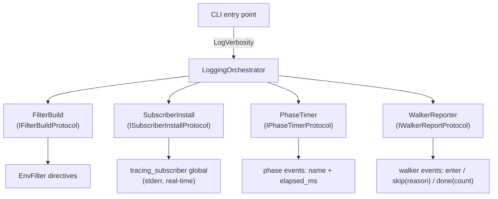

# FRD — logging

---

## Reference

- Backlog: [BACKLOG.md](BACKLOG.md) — real condition for this feature; this file is specification only.
- PRD: [PRD.md](../../PRD.md)
- Architecture: [ARCHITECTURE.md](../../ARCHITECTURE.md)

## System Overview

The logging crate gives a developer running `lint-arwaky scan -v` a
real-time feed on stderr of what the scan is doing: which directories
it walks, which directories it skips and why, how long each linter
phase takes, and what the final result is.

It provides:

- `LogVerbosity` — the value type the `-v` / `--verbose` flag selects.
  One density level: the flag is always the full per-file trace.
- Four capabilities: filter construction, subscriber installation,
  phase timing, and walker reporting.
- An orchestrator that composes the four capabilities; a root
  container that wires them together.

Output goes to stderr so stdout stays clean for piping.

- **Architecture & Data Flow**

---

## Functional Requirements

### FR-Logging-001: Build the Filter Directives

- **Description**: Map a `LogVerbosity` value to the `EnvFilter`
  directive string that decides which events reach the terminal.
- **Input**: `LogVerbosity`.
- **Output**: An `EnvFilter` ready to install.
- **Business Rules**:
  - `Default` → `"warn,lint_arwaky::audit=info"` (no flag; quiet).
  - `Info` → `"info,lint_arwaky::audit=info"` (`-v`; the full feed).
  - `Debug` → `"debug,lint_arwaky::audit=debug"` (`-v` repeated;
    adds walker trace-level detail).
  - An explicitly-set `LINT_ARWAKY_LOG` env var overrides the flag
    (operator override — useful in CI where the flag is not passed).
- **Edge Cases**:
  - Malformed `LINT_ARWAKY_LOG` value → tracing falls back to the
    flag's directive (built-in behavior).
  - No env var, no flag → `Default` directives.
- **Error Handling**: none — directive construction cannot fail; a
  malformed env value degrades to the flag's directive.

---

### FR-Logging-002: Install the Global Subscriber

- **Description**: Install the process-wide `tracing_subscriber` fmt
  layer, writing to stderr, with the filter from FR-Logging-001.
- **Input**: `LogVerbosity`, `with_ansi: bool`.
- **Output**: none (the global subscriber is set-once).
- **Business Rules**:
  - `with_ansi = true` → ANSI colors enabled (CLI).
  - `with_ansi = false` → ANSI escapes suppressed (MCP stdio
    transport must never carry escape bytes).
  - A second call is a no-op: the global subscriber cannot be
    re-initialized, so the guard must swallow it silently.
- **Edge Cases**:
  - Called before any `tracing::` event → the subscriber catches
    everything from that point on.
  - Called twice in the same process → second call is a no-op, no
    panic.
- **Error Handling**: none at runtime; a panic on re-init is
  prevented by the set-once guard.

---

### FR-Logging-003: Time a Scan Phase

- **Description**: Measure how long one scan phase takes and emit a
  structured event when it finishes.
- **Input**: a phase name; a start marker; an end marker with a
  result count.
- **Output**: one tracing event per finished phase:
  `{phase, elapsed_ms, count?}`.
- **Business Rules**:
  - One event per phase; the phase is identified by name (`quality`,
    `role`, `import`, `naming`, `orphan`, `external:<adapter>`,
    `structure`, `doc`).
  - `elapsed_ms` is wall-clock time from start to end marker.
  - `count` is optional (violation count, file count, adapter
    count).
  - Events use the audit target so the filter in FR-Logging-001
    controls their visibility.
- **Edge Cases**:
  - A phase that panics → the end marker still fires (the timer is
    a scope guard, not a success check).
  - Nested phases are not supported; one timer per phase, flat.
- **Error Handling**: none — timing cannot fail.

---

### FR-Logging-004: Report Walker Progress

- **Description**: Emit a real-time event per directory the file
  walker enters or skips, so a developer watching `scan -v` sees
  exactly what is being read and what is being ignored, and why.
- **Input**: a directory name; optionally a skip reason; optionally
  a running file count.
- **Output**: tracing events: `walker_enter(dir)`,
  `walker_skip(dir, reason)`, `files_discovered(count, elapsed_ms)`.
- **Business Rules**:
  - `walker_enter` fires once per directory the walker descends
    into.
  - `walker_skip` fires once per directory the walker does not
    descend into, carrying exactly one reason: `default_skip_dir`,
    `ignored_path_pattern`, `non_member_at_ws_root`, or
    `nested_git_repo`.
  - `files_discovered` fires once at the end of the walk, carrying
    the total lintable-file count and the walk duration.
  - All three use the audit target; visibility follows
    FR-Logging-001.
- **Edge Cases**:
  - A skip that matches two rules (e.g. an ignored dir that is also
    a nested git repo) → report the first matching reason, in the
    fixed order: default skip dir, ignored path pattern, non-member
    at workspace root, nested git repo.
  - The walk root itself never fires `walker_enter` (the scan starts
    there, not inside it).
- **Error Handling**: none — the walker receives directory names
    from the filesystem aggregate; a missing directory produces no
    event.

---

## API Contract

### Protocol API

| Method | Input | Output | Error | Event | Description |
|---|---|---|---|---|---|
| `build_filter` | `LogVerbosity` | `EnvFilter` | — | — | Construct the filter without installing. |
| `install` | `LogVerbosity`, `with_ansi: bool` | `()` | — | — | Install the global subscriber (set-once). |
| `phase_started` | `&str` (phase name) | `PhaseTimer` | — | `phase_start` | Begin a timing scope for one phase. |
| `phase_finished` | `PhaseTimer`, `count: Option<usize>` | `()` | — | `phase_done` | End the scope, emit `{phase, elapsed_ms, count?}`. |
| `walker_enter` | `dir: &str` | `()` | — | `walker_enter` | Report the walker descending into `dir`. |
| `walker_skip` | `dir: &str`, `reason: SkipReason` | `()` | — | `walker_skip` | Report a skipped directory with its reason. |
| `files_discovered` | `count: usize`, `elapsed_ms: u64` | `()` | — | `files_discovered` | Report the walk total. |

### Aggregate API

| Method | Input | Output | Error | Event | Description |
|---|---|---|---|---|---|
| `execute` | `LoggingRequest` | `LoggingResponse` | — | — | Single entry point. Routes request variants to capability seams. |

---

## Integration Points

| System | Direction | Purpose | Failure mode |
| --- | --- | --- | --- |
| `tracing` crate | in | Provide the event macros the phases and walker emit through | A missing subscriber in a non-CLI context (e.g. test) → events are dropped silently |
| `tracing_subscriber` crate | in | Build the fmt layer + env filter | A malformed `LINT_ARWAKY_LOG` value → tracing falls back to the flag's directive |
| CLI entry point | out | The `-v` / `--verbose` flag selects `LogVerbosity` | Flag absent at runtime → `Default` level, no feed emitted |
| Scan pipeline (dispatcher) | out | Emits the phase and walker events this feature reports | No events emitted → the feed is silent even when the subscriber is installed |
| MCP entry point | out | Installs the subscriber with `with_ansi = false` | ANSI escapes leaking into the stdio transport → MCP client framing breaks |

## Non-functional Requirements

| Metric | Target | Measurement method |
| --- | --- | --- |
| Init cost | < 1 ms (one-time, process start) | Time `install` in a microbench |
| No duplicate install | A second `install` call is a no-op, no panic, no log output | Call `install` twice in a test and assert no error |
| Env override | Setting `LINT_ARWAKY_LOG` before `install` takes precedence over the flag | Export the env, call `install`, assert the filter is the env value |
| Feed overhead | The phase + walker event emission adds < 5% wall-clock time to a full scan | Time a scan with and without the feed enabled, at `-v` |

## Test Scenarios

- **SCEN-001 — filter directives**: `build_filter(Default)` → `warn,lint_arwaky::audit=info`; `build_filter(Info)` → `info,lint_arwaky::audit=info`; `build_filter(Debug)` → `debug,lint_arwaky::audit=debug`.
- **SCEN-002 — install**: `install(Default, true)` → subscriber installed, no panic; `install(Debug, false)` → installed with ANSI off; a second `install` call → no-op, no panic.
- **SCEN-003 — env override**: `LINT_ARWAKY_LOG=trace` + `install(Default)` → the effective filter is `trace`; env unset + `install(Debug)` → the filter is `debug,lint_arwaky::audit=debug`.
- **SCEN-004 — phase timing**: a timed closure of 20 ms under `time_phase("quality")` emits `phase_start{quality}` and `phase_done{quality, elapsed_ms≈20, count}`.
- **SCEN-005 — walker events**: `report_walk("crates/logging", Enter)` emits `walker_enter{crates/logging}`; `report_walk("benches", Skip(IgnoredPathPattern))` emits `walker_skip{benches, reason=ignored_path_pattern}`; `files_discovered(250, 38)` emits `files_discovered{count=250, elapsed_ms=38}`.

---

## Assumptions & Constraints

- `tracing_subscriber`'s global subscriber is set-once; the process
  must call `install` exactly once, before any event is emitted.
- The TUI uses a file-appender subscriber with its own controller and
  does not call this feature's `install`.
- No async runtime dependency: all four capabilities are synchronous.
- The feed is real-time: events are emitted as the scan progresses,
  not batched at the end.

---

## Glossary

- **EnvFilter**: the `tracing_subscriber` filter directive language;
  the directive string controls which event levels are emitted.
- **AUDIT_TARGET**: the tracing target name
  (`"lint_arwaky::audit"`) used by scan-phase, walker, and adapter
  events.
- **LogVerbosity**: the three-level enum (`Default`, `Info`, `Debug`)
  that the `-v` flag maps to filter directives.
- **PhaseTimer**: the timing scope a scan phase runs inside; it
  carries the phase name and start instant.
- **SkipReason**: the four-reason enum (`default_skip_dir`,
  `ignored_path_pattern`, `non_member_at_ws_root`,
  `nested_git_repo`) a `walker_skip` event carries.

---
