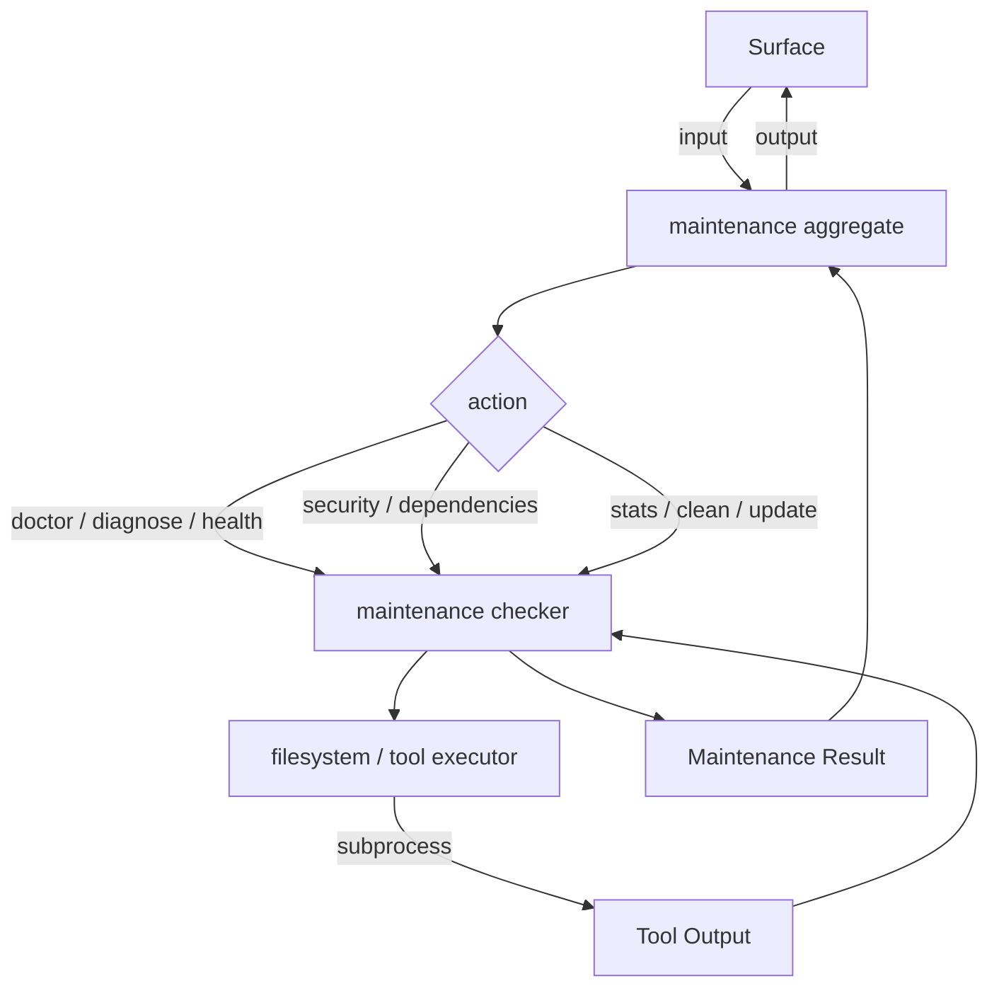

# FRD — maintenance (v2.0.0)

---

## System Overview

The maintenance crate provides operational health and upkeep commands for the
lint-arwaky system: environment diagnostics, toolchain verification, adapter
health checking, cache cleanup, tool updates, security scanning, dependency
reporting, and project statistics. It is the ops-focused crate — it handles
environment health, not code quality analysis.

The crate follows the AES 7-layer architecture: the maintenance checker
(capabilities) implements the maintenance checker protocol, the maintenance
orchestrator (agent) delegates to the protocol, and the maintenance container
(root) wires dependencies.

### Architecture & Data Flow

---

## Functional Requirements

### FR-001: Environment Health Check (doctor)

- **Description**: Build a health status report by combining toolchain
  diagnostics with adapter status information.
- **Input**: None (operates on current working directory).
- **Output**: Doctor result containing language versions, adapter statuses
  (map of tool name to status), and overall health status.
- **Business Rules**:

  - Calls `diagnose_toolchain` to obtain per-tool status (OK/WARN/FAIL)
    and version strings for Rust, Python, JS, and VCS tools.
  - Extracts rust, python, and node version from the first tool in each
    category.
  - Builds adapter statuses map from all tool statuses.
  - Health is true only when all required tools have OK status.
  - Issues list is currently empty (issues are embedded in tool statuses).
- **Edge Cases**:

  - No tools installed → health is false, adapter statuses all show FAIL.
  - Partial toolchain (e.g., Python only) → health is false.
- **Error Handling**: No error thrown; all information is embedded in the
  result structure.

---

### FR-002: Project Statistics (stats)

- **Description**: Count source files and test files in the top-level
  directory of a project, compute test-to-file ratio.
- **Input**: Project root path.
- **Output**: Maintenance stats containing project path, total file count,
  test file count, test ratio, and per-language file counts (Rust, Python,
  JS/TS).
- **Business Rules**:

  - Reads entries in the top-level project directory (non-recursive).
  - Counts files by extension: `.rs` (Rust), `.py` (Python),
    `.ts`, `.js`, `.jsx`, `.tsx` (JS/TS).
  - Identifies test files by name containing "test" or "spec".
  - Test ratio = test files / source files (0.0 if no source files).
  - Source count is the sum of Rust + Python + JS/TS files.
- **Edge Cases**:

  - Empty directory (no files) → all counts 0, ratio 0.0.
  - Non-source files (e.g., `.md`, `.yaml`) → counted in total but not
    in per-language breakdowns.
- **Error Handling**: Directory read failure → returns default stats with
  zero counts.

---

### FR-003: Cache Cleanup (clean)

- **Description**: Remove known cache directories from the project tree.
- **Input**: None (operates on current working directory).
- **Output**: None (side effect: directories deleted).
- **Business Rules**:

  - Targets: `.pytest_cache`, `__pycache__`, `node_modules/.cache`,
    `target`.
  - Checks each target in the current directory and removes it if present.
- **Edge Cases**:

  - Cache directory doesn't exist → no-op.
  - Permission denied on cache directory → removal fails silently.
- **Error Handling**: Directory removal failures are silently ignored.

---

### FR-004: Tool Update (update)

- **Description**: Upgrade Python linter tools to their latest versions.
- **Input**: None.
- **Output**: None (side effect: tools upgraded).
- **Business Rules**:

  - Python tools: `ruff`, `mypy`, `bandit` — upgraded via
    `pip install --upgrade`.
  - Each tool upgraded in a single pip invocation.
  - JS/TS tools and Rust tools are **not upgraded** by this command.
- **Edge Cases**:

  - pip not installed → command fails, warning printed.
  - Tool already at latest version → package manager exits successfully.
  - Network unavailable → package manager fails, warning printed.
- **Error Handling**: Failure logged as warning; no crash.

---

### FR-005: Diagnose Toolchain

- **Description**: Check installation status and version of Rust, Python,
  JavaScript, and VCS tools.
- **Input**: None.
- **Output**: Toolchain diagnostics containing rust tools, python tools,
  js tools, vcs tools (each a list of tool statuses), and binary path.
- **Business Rules**:

  - Rust tools: `rustc`, `cargo`, `clippy` (via `cargo clippy`), `rustfmt`
    — all required.
  - Python tools: `python3`, `ruff`, `mypy` — all optional.
  - JS tools: `node`, `eslint` — all optional.
  - VCS tools: `git` (required).
  - Tool status: `OK` (found), `WARN` (optional, not found), `FAIL`
    (required, not found).
  - Version extracted from first line of stdout.
  - Clippy is checked via `cargo clippy --version` and reported as "clippy".
- **Edge Cases**:

  - Tool installed but version command produces no output → version set to
    empty string.
  - Multiple versions installed → only the first found is reported.
- **Error Handling**: Failed tool checks return status without crashing.

---

### FR-006: Security Scan

- **Description**: Run dependency vulnerability scanning using cargo-audit
  for Rust projects.
- **Input**: Project root path.
- **Output**: Security scan report containing language, tool name, findings
  list, and tool installed status.
- **Business Rules**:

  - Checks if `Cargo.lock` exists at the project root.
  - If present, runs `cargo audit --json` and parses JSON output for
    vulnerability advisories.
  - Extracts findings with severity, advisory ID, package name, and
    issue description.
  - If `Cargo.lock` does not exist, returns empty findings with
    `tool_installed: false`.
- **Edge Cases**:

  - `Cargo.lock` missing → returns empty findings with tool_installed false.
  - cargo-audit not installed → returns empty findings with warning.
  - JSON parse failure → returns empty findings list with warning.
  - Advisory without CVE ID → test id set to "unknown".
- **Error Handling**: Parse failures result in empty findings with warning;
  no crash. Tool not installed → `tool_installed: false`.

---

### FR-007: Dependency Report

- **Description**: Parse Rust project dependency files and list direct and
  transitive dependencies.
- **Input**: Project root path.
- **Output**: Result containing language ("Rust") and dependencies list.
- **Business Rules**:

  - Checks if `Cargo.lock` exists at the project root.
  - Parses `Cargo.lock` line by line, extracting package name and version
    from `[[package]]` entries.
  - All entries classified as "transitive" (Cargo.lock does not distinguish
    direct vs transitive without Cargo.toml cross-reference).
  - Each dependency includes name, version, and dependency type.
- **Edge Cases**:

  - No `Cargo.lock` found → returns error.
  - Empty `Cargo.lock` → returns empty dependency list.
  - Incomplete package entry at end of file → still captured.
- **Error Handling**: File read failures propagate as error.

---

### FR-008: Adapter Health Check

- **Description**: Check availability of all 9 linter adapters and return
  their installation status.
- **Input**: None.
- **Output**: Health check result containing a list of adapter statuses
  (name, language, available flag).
- **Business Rules**:

  - Checks all 9 adapters via version command:

    | Adapter     | Language |
    | ------------- | ---------- |
    | clippy      | Rust     |
    | rustfmt     | Rust     |
    | cargo-audit | Rust     |
    | ruff        | Python   |
    | mypy        | Python   |
    | bandit      | Python   |
    | eslint      | JS/TS    |
    | prettier    | JS/TS    |
    | tsc         | JS/TS    |
  - Each adapter checked via its version command (e.g., `ruff --version`).
  - Available is `true` if version command succeeds, `false` otherwise.
- **Edge Cases**:

  - Adapter not installed → available set to `false`.
  - Version command produces no output but exits successfully → available
    set to `true`.
- **Error Handling**: No error thrown; unavailable adapters reported in the
  result structure.

---

## API Contract

| Operation             | Input        | Output                | Purpose                                                         |
| ----------------------- | -------------- | ----------------------- | ----------------------------------------------------------------- |
| Doctor check          | —           | Doctor result         | Build health status from toolchain diagnostics + adapter statuses |
| Project statistics    | project path | Maintenance stats     | Count files in top-level directory, compute test ratio           |
| Cache cleanup         | —           | —                    | Remove known cache directories from current directory            |
| Tool update           | —           | —                    | Upgrade Python linter tools via pip                              |
| Toolchain diagnostics | —           | Toolchain diagnostics | Check Rust/Python/JS/VCS tool installations                     |
| Security scan         | project path | Security scan report  | Run cargo-audit for Rust dependency vulnerabilities              |
| Dependency report     | project path | Dependency list       | Parse Cargo.lock and list project dependencies                   |
| Adapter health check  | —           | Health check result   | Check availability of all 9 linter adapters                     |

---

## Integration Points

- **Internal**:

  - Maintenance checker protocol — protocol interface for checker capabilities.
  - Maintenance commands aggregate — aggregate trait the orchestrator implements.
  - Tool executor protocol — protocol interface for subprocess execution
    (wraps `std::process::Command`).
  - Filesystem aggregate — file I/O operations (read, write, delete,
    directory listing, external command execution).
- **External**:

  - `cargo audit --json` — Rust dependency vulnerability scanning.
  - `pip install --upgrade` — Python tool upgrade.
  - `which <tool>` — tool availability detection (via filesystem aggregate).
  - `std::process::Command` — synchronous subprocess execution.
  - `std::fs` — filesystem I/O for cache cleanup.
  - No async runtime dependency.

---

## Non-functional Requirements

- **Performance**: Doctor check completes in < 2s (10 tool checks + 3
  language version checks). Stats scan is O(n) in top-level file count.
  Cache cleanup checks a fixed list of directories.
- **Memory**: Dependency report loads entire Cargo.lock into memory;
  suitable for projects with < 10K dependencies.
- **Accuracy**: Tool availability reflects exact state of system PATH at
  invocation time.
- **Concurrency**: All subprocess operations use `std::process::Command`
  (synchronous). No async runtime dependency.

---

## Test Scenarios / QA Checklist

### FR-001 — Doctor

| # | Scenario                    | Expected                                       | Rule   |
| --- | ----------------------------- | ------------------------------------------------ | -------- |
| 1 | All required tools OK       | healthy: true, all statuses "OK"               | FR-001 |
| 2 | Missing rustc (required)    | healthy: false                                 | FR-001 |
| 3 | Missing ruff (optional)     | Status "WARN" in adapter_statuses              | FR-001 |
| 4 | Language runtimes installed | Versions reported (rustc, python3, node)       | FR-001 |
| 5 | Language runtime missing    | Version "NOT FOUND"                            | FR-001 |

### FR-002 — Stats

| # | Scenario                       | Expected                             | Rule   |
| --- | -------------------------------- | -------------------------------------- | -------- |
| 1 | Directory with mixed files    | Per-language counts + overall totals | FR-002 |
| 2 | Python project with test files | Correct test ratio                   | FR-002 |
| 3 | Directory with no source files | All zeros, ratio 0.0                 | FR-002 |
| 4 | Empty directory               | All zeros, ratio 0.0                 | FR-002 |

### FR-003 — Clean

| # | Scenario                               | Expected              | Rule   |
| --- | ---------------------------------------- | ----------------------- | -------- |
| 1 | Project with .pytest_cache, __pycache__ | Directories removed   | FR-003 |
| 2 | Project with target/                    | Directory removed     | FR-003 |
| 3 | No cache directories                   | No-op                 | FR-003 |

### FR-004 — Update

| # | Scenario             | Expected                       | Rule   |
| --- | ---------------------- | -------------------------------- | -------- |
| 1 | Python tools upgrade | pip install --upgrade per tool | FR-004 |
| 2 | pip not installed    | Warning, no crash              | FR-004 |

### FR-005 — Diagnose

| # | Scenario                       | Expected            | Rule   |
| --- | -------------------------------- | --------------------- | -------- |
| 1 | cargo + rustc installed        | Status "OK"         | FR-005 |
| 2 | Missing clippy (required)      | Status "FAIL"       | FR-005 |
| 3 | Missing mypy (optional)        | Status "WARN"       | FR-005 |
| 4 | Missing eslint (optional)      | Status "WARN"       | FR-005 |

### FR-006 — Security

| # | Scenario                        | Expected                              | Rule   |
| --- | --------------------------------- | --------------------------------------- | -------- |
| 1 | Rust project with Cargo.lock    | Runs cargo-audit                      | FR-006 |
| 2 | No Cargo.lock                   | tool_installed: false, empty findings | FR-006 |
| 3 | cargo-audit not installed       | tool_installed: false, empty findings | FR-006 |
| 4 | No vulnerabilities              | Empty findings, success               | FR-006 |

### FR-007 — Dependencies

| # | Scenario                           | Expected                              | Rule   |
| --- | ------------------------------------ | --------------------------------------- | -------- |
| 1 | Rust project with Cargo.lock        | Parses all packages                   | FR-007 |
| 2 | No Cargo.lock                       | Returns error                         | FR-007 |
| 3 | Empty Cargo.lock                    | Empty dependency list                 | FR-007 |

### FR-008 — Adapter Health Check

| # | Scenario                        | Expected                              | Rule   |
| --- | --------------------------------- | --------------------------------------- | -------- |
| 1 | All 9 adapters installed       | All available: true                   | FR-008 |
| 2 | Missing ruff                    | ruff available: false                 | FR-008 |
| 3 | No adapters installed          | All available: false                  | FR-008 |

---

## Assumptions & Constraints

- The crate assumes `pip`, `cargo`, `npm`, `which`, and other tools are
  available in the system PATH when invoked.
- Security scanning requires `cargo-audit` to be installed for Rust projects.
- Dependency parsing is line-based (not full TOML/lockfile parsing); may
  miss edge cases in complex manifests.
- Cache cleanup operates on CWD; the caller must ensure the correct working
  directory.
- All subprocess operations use `std::process::Command` (synchronous).
  No async runtime dependency.
- The maintenance crate performs its own file walking for ops purposes
  (stats, clean). This is distinct from source code analysis walking
  handled by the filesystem crate.
- Currently only Rust projects are supported for security scanning and
  dependency reporting. Python and JS/TS support is planned but not yet
  implemented.

---

## Glossary

| Term                  | Definition                                                                                     |
| ----------------------- | ------------------------------------------------------------------------------------------------ |
| **AES**               | Agentic Engineering System — the 7-layer coding convention                                    |
| **Toolchain**         | The set of programming language tools (compilers, linters, formatters) installed on the system |
| **Dependency Report** | A listing of all project dependencies with name, version, and classification                   |
| **Cache Directory**   | Temporary build/lint output directories that can be safely deleted                             |
| **Security Finding**  | A vulnerability detected by cargo-audit in project dependencies                                |

---

## Reference

- PRD: [PRD.md](../../PRD.md)
- Architecture: [ARCHITECTURE.md](../../ARCHITECTURE.md)
