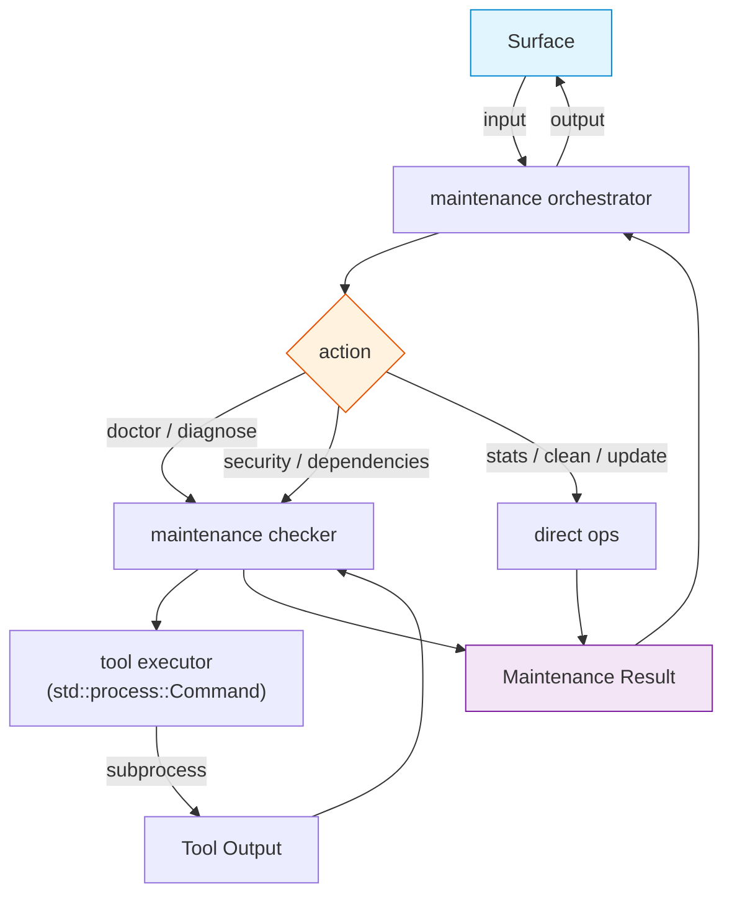

# FRD — maintenance (v1.1.0)

---

## System Overview

The maintenance crate provides operational health and upkeep commands for the
lint-arwaky system: environment diagnostics, toolchain verification, cache
cleanup, tool updates, security scanning, dependency reporting, and project
statistics. It is the ops-focused crate — it handles environment health, not
code quality analysis.

### Architecture & Data Flow

---

## Functional Requirements

### FR-001: Environment Health Check (doctor)

- **Description**: Verify that required linter tools are installed and
  configuration files exist in the project root.
- **Input**: None (operates on current working directory).
- **Output**: Doctor result containing language versions, installation
  status, config presence, adapter statuses (map of all 9 adapters),
  issues list, and overall health status.
- **Business Rules**:

  - Checks for config file: `lint_arwaky.config.yaml`, `pyproject.toml`, `Cargo.toml`,
    `package.json`.
  - Checks all 9 adapter availability via `which` command:

    | Adapter     | Language |
    | ------------- | ---------- |
    | clippy      | Rust     |
    | rustfmt     | Rust     |
    | cargo-audit | Rust     |
    | ruff        | Python   |
    | mypy        | Python   |
    | bandit      | Python   |
    | eslint      | JS/TS    |
    | prettier    | JS/TS    |
    | tsc         | JS/TS    |
  - Checks language runtime versions: `rustc --version`, `python3 --version`,
    `node --version`.
  - If no config file found, adds "No configuration file found" issue.
  - If adapter not found, adds "Linter adapter '<name></name>' is not installed"
    issue.
  - Health is true only if issues list is empty.
- **Edge Cases**:

  - `which` command fails for adapter → status set to "MISSING".
  - Config files exist but are empty → still counted as found.
  - Language runtime not installed → version set to "not installed".
- **Error Handling**: No error thrown; issues collected in the result's
  issues list.

---

### FR-002: Project Statistics (stats)

- **Description**: Count source files and test files across all supported
  languages in a project, compute test-to-file ratio per language and total.
- **Input**: Project root path.
- **Output**: Maintenance stats containing project path, per-language counts
  (total files, test files, test ratio), and overall totals.
- **Business Rules**:

  - Recursively walks directory tree excluding: `target/`, `.git/`,
    `node_modules/`, `.venv/`, `__pycache__/`, `dist/`, `build/`.
  - Counts files by extension:

    | Language | Extensions                   | Test file patterns                                            |
    | ---------- | ------------------------------ | --------------------------------------------------------------- |
    | Rust     | `.rs`                        | `*_test.rs`, `test_*.rs`, files inside `tests/`               |
    | Python   | `.py`                        | `test_*.py`, `*_test.py`, files inside `tests/`               |
    | JS/TS    | `.js`, `.jsx`, `.ts`, `.tsx` | `*.test.*`, `*.spec.*`, files inside `tests/` or `__tests__/` |
  - Test ratio = test files / total files per language (0.0 if no files).
  - Overall totals aggregated across all languages.
- **Edge Cases**:

  - Empty project (no source files) → all counts 0, ratio 0.0.
  - Symlinks → followed if they point to directories within workspace.
  - Permission denied on subdirectory → silently skipped.
- **Error Handling**: Walk failures are silently ignored; partial results
  returned.

---

### FR-003: Cache Cleanup (clean)

- **Description**: Remove cache directories from the project tree.
- **Input**: None (operates on current working directory).
- **Output**: None (side effect: directories deleted).
- **Business Rules**:

  - Targets: `.pytest_cache`, `.mypy_cache`, `.ruff_cache`, `__pycache__`,
    `.lint_arwaky_cache`, `.eslintcache`, `.tsc-cache`.
  - Recursively searches from CWD, excluding `target/`, `.git/`,
    `node_modules/`.
  - Uses `std::fs::remove_dir_all` for each found cache directory.
- **Edge Cases**:

  - Cache directory doesn't exist → no-op.
  - Permission denied on cache directory → removal fails, silently ignored.
- **Error Handling**: Directory removal failures are silently ignored.

---

### FR-004: Tool Update (update)

- **Description**: Upgrade linter tools for detected languages.
- **Input**: None.
- **Output**: None (side effect: tools upgraded).
- **Business Rules**:

  - Python tools: `ruff`, `mypy`, `bandit` — upgraded via
    `pip install --upgrade`.
  - JS/TS tools: `eslint`, `prettier`, `typescript` — upgraded via
    `npm install -g` (or `pnpm add -g` if pnpm detected).
  - Rust tools: not upgraded (managed via `rustup`; print suggestion
    "Run `rustup update` to update Rust tools").
  - Each tool upgraded independently.
  - Failure of one tool does not prevent others from being upgraded.
- **Edge Cases**:

  - pip/npm not installed → command fails, warning printed.
  - Tool already at latest version → package manager exits successfully.
  - Network unavailable → package manager fails, warning printed.
- **Error Handling**: Per-tool failures logged as warnings; overall
  continuation guaranteed.

---

### FR-005: Diagnose Toolchain

- **Description**: Check installation status and version of Rust, Python,
  JavaScript, and VCS tools.
- **Input**: None.
- **Output**: Toolchain diagnostics containing rust tools, python tools,
  js tools, vcs tools (each a list of tool statuses), and binary path.
- **Business Rules**:

  - Rust tools: `rustc`, `cargo`, `clippy`, `rustfmt` — all required.
  - Python tools: `python3`, `ruff`, `mypy`, `bandit` — all optional.
  - JS tools: `node`, `eslint`, `prettier`, `tsc` — all optional; local
    `node_modules/.bin/` preferred over global.
  - VCS tools: `git` (required).
  - Tool status: `OK` (found), `WARN` (optional, not found), `FAIL`
    (required, not found).
  - Version extracted from first line of stdout.
- **Edge Cases**:

  - Tool installed but version command produces no output → version set to
    empty string.
  - Local `node_modules/.bin/<tool>` exists → reported as "local" version.
  - Multiple versions installed → only the first found is reported.
- **Error Handling**: Failed tool checks return status without crashing.

---

### FR-006: Security Scan

- **Description**: Run dependency vulnerability scanning using cargo-audit
  (Rust), bandit (Python), or npm audit (JS/TS).
- **Input**: Project root path.
- **Output**: Security scan report containing language, tool name, findings
  list, and tool installed status.
- **Business Rules**:

  - Language detection:
    - `Cargo.lock` exists → run `cargo audit --json` (Rust).
    - `package.json` exists → run `npm audit --json` (JS/TS).
    - Python files exist → run `bandit -r --format json <root>` (Python).
    - Multiple detected → run all applicable scanners, merge findings.
  - Parse JSON output to extract findings with severity, test id, file,
    line, and issue description.
  - Tool installed status reflects actual availability:
    - Tool found → `true`.
    - Tool not found → `false`, findings empty, warning message included.
- **Edge Cases**:

  - No project files detected → empty findings, warning "no scannable
    project detected".
  - cargo-audit / bandit / npm not installed → `tool_installed: false`,
    empty findings.
  - JSON parse failure → returns empty findings list with warning.
  - Advisory without CVE ID → test id set to "unknown".
- **Error Handling**: Parse failures result in empty findings with warning;
  no crash. Tool not installed → `tool_installed: false`.

---

### FR-007: Dependency Report

- **Description**: Parse project dependency files and list direct and
  transitive dependencies.
- **Input**: Project root path.
- **Output**: Result containing language and dependencies list.
- **Business Rules**:

  - Rust projects: parse `Cargo.lock` + `Cargo.toml` to classify deps as
    "direct" or "transitive".
  - Python projects: parse `pyproject.toml` or `requirements.txt`
    (fallback chain).
  - JS/TS projects: parse `package.json` (`dependencies` +
    `devDependencies`). If `package-lock.json` / `pnpm-lock.yaml` exists,
    classify as "direct" (in package.json) or "transitive" (only in
    lockfile).
  - Each dependency includes name, version, and dependency type.
- **Edge Cases**:

  - No dependency files found → returns error.
  - Cargo.toml has no `[dependencies]` section → all Cargo.lock entries
    classified as transitive.
  - requirements.txt has unpinned versions → version set to empty string.
  - pyproject.toml has comments or section headers → skipped during parsing.
  - package.json has no dependencies → empty list.
- **Error Handling**: File read failures propagate as error.

---

## API Contract

| Operation             | Input        | Output                | Purpose                                                         |
| ----------------------- | -------------- | ----------------------- | ----------------------------------------------------------------- |
| Doctor check          | —           | Doctor result         | Check environment health: 9 adapters, config, language versions |
| Project statistics    | project path | Maintenance stats     | Count files per language, compute test ratio                    |
| Cache cleanup         | —           | —                    | Remove cache directories from project tree                      |
| Tool update           | —           | —                    | Upgrade linter tools (pip / npm)                                |
| Toolchain diagnostics | —           | Toolchain diagnostics | Check Rust/Python/JS/VCS tool installations                     |
| Security scan         | project path | Security scan report  | Run cargo-audit / bandit / npm audit                            |
| Dependency report     | project path | Dependency list       | Parse and list project dependencies                             |

---

## Integration Points

- **Internal**:

  - Maintenance commands aggregate — aggregate trait the orchestrator implements.
  - Maintenance checker protocol — protocol interface for checker capabilities.
  - Tool executor protocol — protocol interface for subprocess execution.
  - Command runner utility — shared command execution utilities.
  - Dependency I/O utility — shared dependency file I/O utilities.
- **External**:

  - `cargo audit --json` — Rust dependency vulnerability scanning.
  - `bandit -r --format json` — Python security vulnerability scanning.
  - `npm audit --json` — JS/TS dependency vulnerability scanning.
  - `pip install --upgrade` — Python tool upgrade.
  - `npm install -g` — JS/TS tool upgrade.
  - `which <tool>` — tool availability detection.
  - `std::process::Command` — synchronous subprocess execution.
  - `std::fs` — filesystem I/O for stats, clean, dependency parsing.
  - No async runtime dependency.

---

## Non-functional Requirements

- **Performance**: Doctor check completes in < 2s (9 tool checks + config
  scan + 3 language version checks). Stats walk scales linearly with file
  count. Cache cleanup is O(n) in directory tree size.
- **Memory**: Dependency report loads entire Cargo.lock / pyproject.toml /
  package.json into memory; suitable for projects with < 10K dependencies.
- **Accuracy**: Tool availability reflects exact state of system PATH at
  invocation time. Dependency classification (direct vs transitive) relies
  on manifest files (Cargo.toml, package.json).
- **Concurrency**: All subprocess operations use `std::process::Command`
  (synchronous). No async runtime dependency.

---

## Test Scenarios / QA Checklist

### FR-001 — Doctor

| # | Scenario                    | Expected                                       | Rule   |
| --- | ----------------------------- | ------------------------------------------------ | -------- |
| 1 | All 9 tools installed       | healthy: true, all statuses "OK"               | FR-001 |
| 2 | Missing ruff                | Issue "Linter adapter 'ruff' is not installed" | FR-001 |
| 3 | No config file              | Issue "No configuration file found"            | FR-001 |
| 4 | Language runtimes installed | Versions reported (rustc, python3, node)       | FR-001 |
| 5 | Language runtime missing    | Version "not installed"                        | FR-001 |

### FR-002 — Stats

| # | Scenario                       | Expected                             | Rule   |
| --- | -------------------------------- | -------------------------------------- | -------- |
| 1 | Multi-language project         | Per-language counts + overall totals | FR-002 |
| 2 | Python project with test files | Correct test ratio                   | FR-002 |
| 3 | Rust project with tests/ dir   | Test files counted                   | FR-002 |
| 4 | JS/TS project with *.test.ts   | Test files counted                   | FR-002 |
| 5 | Empty directory                | All zeros, ratio 0.0                 | FR-002 |

### FR-003 — Clean

| # | Scenario                               | Expected              | Rule   |
| --- | ---------------------------------------- | ----------------------- | -------- |
| 1 | Project with .pytest_cache,__pycache__ | Directories removed   | FR-003 |
| 2 | Project with .eslintcache              | Directory removed     | FR-003 |
| 3 | target/ and .git/ directories          | Skipped (not removed) | FR-003 |
| 4 | No cache directories                   | No-op                 | FR-003 |

### FR-004 — Update

| # | Scenario             | Expected                       | Rule   |
| --- | ---------------------- | -------------------------------- | -------- |
| 1 | Python tools upgrade | pip install --upgrade per tool | FR-004 |
| 2 | JS/TS tools upgrade  | npm install -g per tool        | FR-004 |
| 3 | Rust tools           | Suggestion "Run rustup update" | FR-004 |
| 4 | One tool fails       | Others still upgraded          | FR-004 |

### FR-005 — Diagnose

| # | Scenario                       | Expected            | Rule   |
| --- | -------------------------------- | --------------------- | -------- |
| 1 | cargo + rustc installed        | Status "OK"         | FR-005 |
| 2 | Missing clippy (required)      | Status "FAIL"       | FR-005 |
| 3 | Missing mypy (optional)        | Status "WARN"       | FR-005 |
| 4 | Local node_modules/.bin/eslint | Reported as "local" | FR-005 |

### FR-006 — Security

| # | Scenario                        | Expected                              | Rule   |
| --- | --------------------------------- | --------------------------------------- | -------- |
| 1 | Rust project with Cargo.lock    | Runs cargo-audit                      | FR-006 |
| 2 | Python project                  | Runs bandit                           | FR-006 |
| 3 | JS/TS project with package.json | Runs npm audit                        | FR-006 |
| 4 | cargo-audit not installed       | tool_installed: false, empty findings | FR-006 |
| 5 | No vulnerabilities              | Empty findings, exit 0                | FR-006 |

### FR-007 — Dependencies

| # | Scenario                           | Expected                              | Rule   |
| --- | ------------------------------------ | --------------------------------------- | -------- |
| 1 | Rust project                       | Parses Cargo.lock + Cargo.toml        | FR-007 |
| 2 | Python project with pyproject.toml | Parses dependencies                   | FR-007 |
| 3 | JS/TS project with package.json    | Parses dependencies + devDependencies | FR-007 |
| 4 | No dependency files                | Returns error                         | FR-007 |

---

## Assumptions & Constraints

- The crate assumes `pip`, `cargo`, `npm`, `which`, and other tools are
  available in the system PATH when invoked.
- Security scanning requires `cargo-audit` (Rust), `bandit` (Python), or
  `npm` (JS/TS) to be installed.
- Dependency parsing is line-based (not full TOML/lockfile parsing); may
  miss edge cases in complex manifests.
- Cache cleanup operates on CWD; the caller must ensure the correct working
  directory.
- All subprocess operations use `std::process::Command` (synchronous).
  No async runtime dependency.
- The maintenance crate performs its own file walking for ops purposes
  (stats, clean). This is distinct from source code analysis walking
  handled by the filesystem crate.

---

## Glossary

| Term                  | Definition                                                                                     |
| ----------------------- | ------------------------------------------------------------------------------------------------ |
| **AES**               | Agentic Engineering System — the 7-layer coding convention                                    |
| **Toolchain**         | The set of programming language tools (compilers, linters, formatters) installed on the system |
| **Dependency Report** | A listing of all project dependencies with name, version, and classification                   |
| **Cache Directory**   | Temporary build/lint output directories that can be safely deleted                             |
| **Security Finding**  | A vulnerability detected by cargo-audit, bandit, or npm audit in project dependencies          |

---

## Reference

- PRD: [PRD.md](../../PRD.md)
- Architecture: [ARCHITECTURE.md](../../ARCHITECTURE.md)
