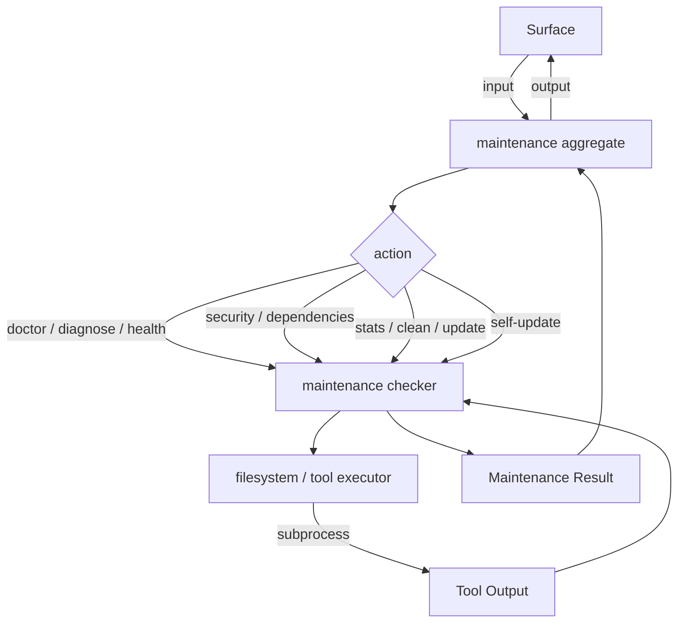

# FRD — maintenance (v2.1.0)

---

## Reference

- PRD: [PRD.md](../../PRD.md)
- Backlog: [BACKLOG.md](BACKLOG.md) — real condition for this feature; this file is specification only.
- Architecture: [ARCHITECTURE.md](../../ARCHITECTURE.md)

## System Overview

The maintenance crate provides operational health and upkeep commands for the
lint-arwaky system: environment diagnostics, toolchain verification, adapter
health checking, cache cleanup, tool updates, binary self-update from
GitHub releases, security scanning, dependency reporting, and project
statistics. It is the ops-focused crate — it handles environment health,
not code quality analysis.

The crate follows the AES 7-layer architecture: the maintenance checker
(capabilities) implements the maintenance checker protocol, the maintenance
orchestrator (agent) delegates to the protocol, and the maintenance container
(root) wires dependencies.

### Architecture & Data Flow

```mermaid
flowchart TD
    A["Surface"] -->|input| B["maintenance aggregate"]
    B --> C{"action"}

    C -->|"doctor / diagnose / health"| D["maintenance checker"]
    C -->|"security / dependencies"| D
    C -->|"stats / clean / update"| D
    C -->|"self-update"| D

    D --> F["filesystem / tool executor"]
    F -->|subprocess| G["Tool Output"]
    G --> D
    D --> H["Maintenance Result"]

    H --> B
    B -->|output| A

```

---

## Functional Requirements

### FR-Maintenance-001: Environment Health Check (doctor)

- **Description**: Build a health status report by combining toolchain
  diagnostics with adapter status information.
- **Input**: None (operates on current working directory).
- **Output**: Doctor result containing language versions, adapter statuses
  (map of tool name to status), and overall health status.
- **Business Rules**:

  - Calls `diagnose_toolchain` to obtain per-tool status (OK/WARN/FAIL)
    and version strings for Rust, Python, JS, and VCS tools.
  - Extracts rust, python, and node version from the first tool in each
    category.
  - Builds adapter statuses map from all tool statuses.
  - Health is true only when all required tools have OK status.
  - Issues list is currently empty (issues are embedded in tool statuses).
- **Edge Cases**:

  - No tools installed → health is false, adapter statuses all show FAIL.
  - Partial toolchain (e.g., Python only) → health is false.
- **Error Handling**: No error thrown; all information is embedded in the
  result structure.

---

### FR-Maintenance-002: Project Statistics (stats)

- **Description**: Count source files and test files in the top-level
  directory of a project, compute test-to-file ratio.
- **Input**: Project root path.
- **Output**: Maintenance stats containing project path, total file count,
  test file count, test ratio, and per-language file counts (Rust, Python,
  JS/TS).
- **Business Rules**:

  - Reads entries in the top-level project directory (non-recursive).
  - Counts files by extension: `.rs` (Rust), `.py` (Python),
    `.ts`, `.js`, `.jsx`, `.tsx` (JS/TS).
  - Identifies test files by name containing "test" or "spec".
  - Test ratio = test files / source files (0.0 if no source files).
  - Source count is the sum of Rust + Python + JS/TS files.
- **Edge Cases**:

  - Empty directory (no files) → all counts 0, ratio 0.0.
  - Non-source files (e.g., `.md`, `.yaml`) → counted in total but not
    in per-language breakdowns.
- **Error Handling**: Directory read failure → returns default stats with
  zero counts.

---

### FR-Maintenance-003: Cache Cleanup (clean)

- **Description**: Remove known cache directories from the project tree.
- **Input**: None (operates on current working directory).
- **Output**: None (side effect: directories deleted).
- **Business Rules**:

  - Targets: `.pytest_cache`, `__pycache__`, `node_modules/.cache`,
    `target`.
  - Checks each target in the current directory and removes it if present.
- **Edge Cases**:

  - Cache directory doesn't exist → no-op.
  - Permission denied on cache directory → removal fails silently.
- **Error Handling**: Directory removal failures are silently ignored.

---

### FR-Maintenance-004: Tool Update (update)

- **Description**: Upgrade Python linter tools to their latest versions.
- **Input**: None.
- **Output**: None (side effect: tools upgraded).
- **Business Rules**:

  - Python tools: `ruff`, `mypy`, `bandit` — upgraded via
    `pip install --upgrade`.
  - Each tool upgraded in a single pip invocation.
  - JS/TS tools and Rust tools are **not upgraded** by this command.
- **Edge Cases**:

  - pip not installed → command fails, warning printed.
  - Tool already at latest version → package manager exits successfully.
  - Network unavailable → package manager fails, warning printed.
- **Error Handling**: Failure logged as warning; no crash.

---

### FR-Maintenance-005: Diagnose Toolchain

- **Description**: Check installation status and version of Rust, Python,
  JavaScript, and VCS tools.
- **Input**: None.
- **Output**: Toolchain diagnostics containing rust tools, python tools,
  js tools, vcs tools (each a list of tool statuses), and binary path.
- **Business Rules**:

  - Rust tools: `rustc`, `cargo`, `clippy` (via `cargo clippy`), `rustfmt`
    — all required.
  - Python tools: `python3`, `ruff`, `mypy` — all optional.
  - JS tools: `node`, `eslint` — all optional.
  - VCS tools: `git` (required).
  - Tool status: `OK` (found), `WARN` (optional, not found), `FAIL`
    (required, not found).
  - Version extracted from first line of stdout.
  - Clippy is checked via `cargo clippy --version` and reported as "clippy".
- **Edge Cases**:

  - Tool installed but version command produces no output → version set to
    empty string.
  - Multiple versions installed → only the first found is reported.
- **Error Handling**: Failed tool checks return status without crashing.

---

### FR-Maintenance-006: Security Scan

- **Description**: Run dependency vulnerability scanning using cargo-audit
  for Rust projects.
- **Input**: Project root path.
- **Output**: Security scan report containing language, tool name, findings
  list, and tool installed status.
- **Business Rules**:

  - Checks if `Cargo.lock` exists at the project root.
  - If present, runs `cargo audit --json` and parses JSON output for
    vulnerability advisories.
  - Extracts findings with severity, advisory ID, package name, and
    issue description.
  - If `Cargo.lock` does not exist, returns empty findings with
    `tool_installed: false`.
- **Edge Cases**:

  - `Cargo.lock` missing → returns empty findings with tool_installed false.
  - cargo-audit not installed → returns empty findings with warning.
  - JSON parse failure → returns empty findings list with warning.
  - Advisory without CVE ID → test id set to "unknown".
- **Error Handling**: Parse failures result in empty findings with warning;
  no crash. Tool not installed → `tool_installed: false`.

---

### FR-Maintenance-007: Dependency Report

- **Description**: Parse Rust project dependency files and list direct and
  transitive dependencies.
- **Input**: Project root path.
- **Output**: Result containing language ("Rust") and dependencies list.
- **Business Rules**:

  - Checks if `Cargo.lock` exists at the project root.
  - Parses `Cargo.lock` line by line, extracting package name and version
    from `[[package]]` entries.
  - All entries classified as "transitive" (Cargo.lock does not distinguish
    direct vs transitive without Cargo.toml cross-reference).
  - Each dependency includes name, version, and dependency type.
- **Edge Cases**:

  - No `Cargo.lock` found → returns error.
  - Empty `Cargo.lock` → returns empty dependency list.
  - Incomplete package entry at end of file → still captured.
- **Error Handling**: File read failures propagate as error.

---

### FR-Maintenance-008: Adapter Health Check

- **Description**: Check availability of all 9 linter adapters and return
  their installation status.
- **Input**: None.
- **Output**: Health check result containing a list of adapter statuses
  (name, language, available flag).
- **Business Rules**:

  - Checks all 9 adapters via version command:

    | Adapter     | Language |
    | ------------- | ---------- |
    | clippy      | Rust     |
    | rustfmt     | Rust     |
    | cargo-audit | Rust     |
    | ruff        | Python   |
    | mypy        | Python   |
    | bandit      | Python   |
    | eslint      | JS/TS    |
    | prettier    | JS/TS    |
    | tsc         | JS/TS    |
  - Each adapter checked via its version command (e.g., `ruff --version`).
  - Available is `true` if version command succeeds, `false` otherwise.
- **Edge Cases**:

  - Adapter not installed → available set to `false`.
  - Version command produces no output but exits successfully → available
    set to `true`.
- **Error Handling**: No error thrown; unavailable adapters reported in the
  result structure.

---

### FR-Maintenance-009: Self-Update (binary)

- **Description**: Query the latest release from GitHub and install the
  `lint-arwaky-cli` binary when a newer version is available.
- **Input**: None (operates on current executable path).
- **Output**: `SelfUpdateResultVO` — current version, latest tag, upgrade
  status, human-readable message.
- **Business Rules**:
  - Fetches the latest release from `https://api.github.com/repos/rakaarwaky/lint-arwaky/releases/latest`
    using `curl` via the filesystem IO protocol.
  - Compares `CARGO_PKG_VERSION` (normalised by stripping the `v` prefix)
    against the release tag. Only installs when the release tag is strictly
    greater.
  - When `check_only` is `true`, reports the result without downloading.
  - When `check_only` is `false`, downloads the `lint-arwaky-cli` asset and
    the published `lint-arwaky-cli.sha256` checksum to a temporary file in the
    same directory as the running binary, verifies the binary's SHA-256 hash
    against the published value, then moves the verified binary over the
    existing executable and marks it executable with `chmod +x`.
- **Edge Cases**:
  - Network unavailable → graceful error, no crash, `latest_version` empty.
  - Release tag missing or malformed → graceful error.
  - Current executable cannot be resolved → error.
  - Download fails (missing asset, 404) → error logged, no binary replaced.
  - Published checksum missing or SHA-256 mismatch → error logged, no binary
    replaced; the downloaded asset is cleaned up.
  - `chmod` fails → error logged, no binary replaced.
  - Local version is ahead of the released version → no update triggered.
- **Error Handling**: All failures return `SelfUpdateResultVO::error()` with
  a descriptive message; the process exits with `RUNTIME_ERROR`.

---

## API Contract

### Protocol API

| Method | Input | Output | Error | Event | Description |
|---|---|---|---|---|---|
| `diagnose_toolchain` | — | `ToolchainDiagnostics` | — | — | Diagnose toolchain. |
| `health_check` | — | `HealthCheckResult` | — | — | Health check. |
| `run_security_scan` | &FilePath | `SecurityScanReport` | — | — | Run security scan. |
| `run_dependency_report` | &FilePath | `DependencyReport` | `String` | — | Run dependency report. |
| `stats` | &FilePath | `MaintenanceStatsVO` | — | — | Stats. |
| `clean` | — | `` | — | — | Clean. |
| `update` | — | `` | — | — | Update. |
| `doctor` | — | `DoctorResultVO` | — | — | Doctor. |
| `self_update` | bool | `SelfUpdateResultVO` | — | — | Self update. |
| `run_tool` | &str, &[&str] | `ToolOutput` | — | — | Run tool. |
| `run_tool_in_dir` | &str, &[&str], &FilePath | `ToolOutput` | — | — | Run tool in dir. |
| `tool_exists` | &str | `bool` | — | — | Tool exists. |
| `get_binary_path` | — | `FilePath` | — | — | Get binary path. |

### Aggregate API

| Method | Input | Output | Error | Event | Description |
|---|---|---|---|---|---|
| `execute` | MaintenanceRequest | `MaintenanceResponse` | — | — | Single composite entry point over the feature. |

## Integration Points
| System | Direction | Purpose | Failure mode |
| --- | --- | --- | --- |
| `shared` crate | in | Supply value objects plus the checker, installer, and aggregate contracts | A contract is missing at compile time → the build fails before any command runs |
| `filesystem` aggregate | in | Read, write, and delete files, list directories, and run external commands | A file operation fails → the command reports the failing path and stops rather than continuing on a partial state |
| Tool executor protocol | out (internal) | Wrap synchronous subprocess execution behind a protocol | The subprocess cannot be spawned → the tool is reported as unavailable, which is the same result as a missing tool |
| Maintenance checker protocol | out (internal) | Define the shape every individual check implements | A check fails mid-run → the diagnostic reports that specific check as failed and the rest still run |
| Maintenance commands aggregate | out (internal) | Expose the single composite entry point the surface calls | An unknown subcommand is requested → an invalid-argument error is returned |
| `cargo audit --json` | in | Audit Rust dependencies for vulnerabilities | The advisory database is unreachable → the audit reports that it could not run, never that no vulnerabilities exist |
| `pip` | in | Upgrade the Python tooling | The interpreter is managed by the OS and refuses the install → the retry adds the system-packages override |
| `curl` | in | Query the GitHub releases API and download the release asset | The download fails or the checksum does not match → the running binary is left in place and the failure is reported |
| `mv` / `chmod` | in | Replace the binary atomically and set its executable bit | The replacement fails → the previous binary is still in place and the failure is reported |
| `which` | in | Detect whether a tool is on PATH | The tool is not on PATH → it is reported as missing, and the doctor diagnostic says so explicitly |
| `sha256sum` | in | Verify the integrity of a downloaded binary | The checksum does not match → the download is discarded and the existing binary is untouched |

## Non-functional Requirements
| Metric | Target | Measurement method |
| --- | --- | --- |
| Doctor latency | Under 2 s for 10 tool checks plus 3 language version checks | Time a full doctor run and record the per-check cost |
| Stats scan | O(n) in top-level file count | Scale the top-level file count and confirm linear growth |
| Cache cleanup | A fixed directory list is checked; cost is independent of workspace size | Time cache cleanup against two workspace sizes of very different sizes |
| Dependency report memory | The full dependency lockfile is resident, suited to projects under 10,000 dependencies | Measure retained size at 10,000 dependencies and assert the report still completes |
| Tool availability | Availability reflects the exact PATH state at invocation | Remove a tool from PATH and assert doctor reports it missing on the same run |
| Update integrity | A downloaded binary is verified by checksum before it replaces the running one | Corrupt a download and assert the existing binary is retained and the mismatch is reported |
| Update atomicity | Replacement is atomic; a failed replacement leaves the previous binary runnable | Interrupt a replacement and assert the previous binary still runs |
| Concurrency | All subprocess work is synchronous; no async runtime dependency | Inspect the dependency tree for an async runtime and assert it is absent |

## Test Scenarios / QA Checklist

Each scenario is stated below as a table of cases: the input condition and the expected result.

- **SCEN-001 — Doctor** — e.g. All required tools OK → healthy: true, all statuses "OK"
- **SCEN-002 — Stats** — e.g. Directory with mixed files → Per-language counts + overall totals
- **SCEN-003 — Clean** — e.g. Project with .pytest_cache, __pycache__ → Directories removed
- **SCEN-004 — Update** — e.g. Python tools upgrade → pip install --upgrade per tool
- **SCEN-005 — Diagnose** — e.g. cargo + rustc installed → Status "OK"
- **SCEN-006 — Security** — e.g. Rust project with Cargo.lock → Runs cargo-audit
- **SCEN-007 — Dependencies** — e.g. Rust project with Cargo.lock → Parses all packages
- **SCEN-008 — Adapter Health Check** — e.g. All 9 adapters installed → All available: true
- **SCEN-009 — Self-Update** — e.g. GitHub reachable, same version → already_up_to_date=true, upgraded=false

### SCEN-001 — Doctor

FRD Ref: FR-Maintenance-001

| # | Scenario | Expected |
| - | - | - |
| 1 | All required tools OK | healthy: true, all statuses "OK" |
| 2 | Missing rustc (required) | healthy: false |
| 3 | Missing ruff (optional) | Status "WARN" in adapter_statuses |
| 4 | Language runtimes installed | Versions reported (rustc, python3, node) |
| 5 | Language runtime missing | Version "NOT FOUND" |

### SCEN-002 — Stats

FRD Ref: FR-Maintenance-002

| # | Scenario | Expected |
| - | - | - |
| 1 | Directory with mixed files | Per-language counts + overall totals |
| 2 | Python project with test files | Correct test ratio |
| 3 | Directory with no source files | All zeros, ratio 0.0 |
| 4 | Empty directory | All zeros, ratio 0.0 |

### SCEN-003 — Clean

FRD Ref: FR-Maintenance-003

| # | Scenario | Expected |
| - | - | - |
| 1 | Project with .pytest_cache, __pycache__ | Directories removed |
| 2 | Project with target/ | Directory removed |
| 3 | No cache directories | No-op |

### SCEN-004 — Update

FRD Ref: FR-Maintenance-004

| # | Scenario | Expected |
| - | - | - |
| 1 | Python tools upgrade | pip install --upgrade per tool |
| 2 | pip not installed | Warning, no crash |

### SCEN-005 — Diagnose

FRD Ref: FR-Maintenance-005

| # | Scenario | Expected |
| - | - | - |
| 1 | cargo + rustc installed | Status "OK" |
| 2 | Missing clippy (required) | Status "FAIL" |
| 3 | Missing mypy (optional) | Status "WARN" |
| 4 | Missing eslint (optional) | Status "WARN" |

### SCEN-006 — Security

FRD Ref: FR-Maintenance-006

| # | Scenario | Expected |
| - | - | - |
| 1 | Rust project with Cargo.lock | Runs cargo-audit |
| 2 | No Cargo.lock | tool_installed: false, empty findings |
| 3 | cargo-audit not installed | tool_installed: false, empty findings |
| 4 | No vulnerabilities | Empty findings, success |

### SCEN-007 — Dependencies

FRD Ref: FR-Maintenance-007

| # | Scenario | Expected |
| - | - | - |
| 1 | Rust project with Cargo.lock | Parses all packages |
| 2 | No Cargo.lock | Returns error |
| 3 | Empty Cargo.lock | Empty dependency list |

### SCEN-008 — Adapter Health Check

FRD Ref: FR-Maintenance-008

| # | Scenario | Expected |
| - | - | - |
| 1 | All 9 adapters installed | All available: true |
| 2 | Missing ruff | ruff available: false |
| 3 | No adapters installed | All available: false |

### SCEN-009 — Self-Update

FRD Ref: FR-Maintenance-009

| # | Scenario | Expected |
| - | - | - |
| 1 | GitHub reachable, same version | already_up_to_date=true, upgraded=false |
| 2 | GitHub reachable, newer version | latest_version set, upgraded=true (when not check-only) |
| 3 | check_only=true | No download performed; status reports current tag |
| 4 | Network unavailable | latest_version empty, status starts with "Error:" |
| 5 | Local version ahead of release | already_up_to_date=true (local > released) |

---

## Assumptions & Constraints

- The crate assumes `pip`, `cargo`, `npm`, `which`, `curl`, `mv`, and
  `chmod` are available in the system PATH when invoked.
- Security scanning requires `cargo-audit` to be installed for Rust projects.
- Dependency parsing is line-based (not full TOML/lockfile parsing); may
  miss edge cases in complex manifests.
- Cache cleanup operates on CWD; the caller must ensure the correct working
  directory.
- All subprocess operations use `std::process::Command` (synchronous).
  No async runtime dependency.
- The maintenance crate performs its own file walking for ops purposes
  (stats, clean). This is distinct from source code analysis walking
  handled by the filesystem crate.
- Security scanning and dependency reporting currently cover Rust projects only.
  Python and JS/TS support is planned; see BACKLOG.md for status.

---

## Glossary

- **AES**: Agentic Engineering System — the 7-layer coding convention
- **Toolchain**: The set of programming language tools (compilers, linters, formatters) installed on the system
- **Dependency Report**: A listing of all project dependencies with name, version, and classification
- **Cache Directory**: Temporary build/lint output directories that can be safely deleted
- **Self-Update**: Process of downloading the latest release binary from GitHub and replacing the running executable
- **Security Finding**: A vulnerability detected by cargo-audit in project dependencies

---
