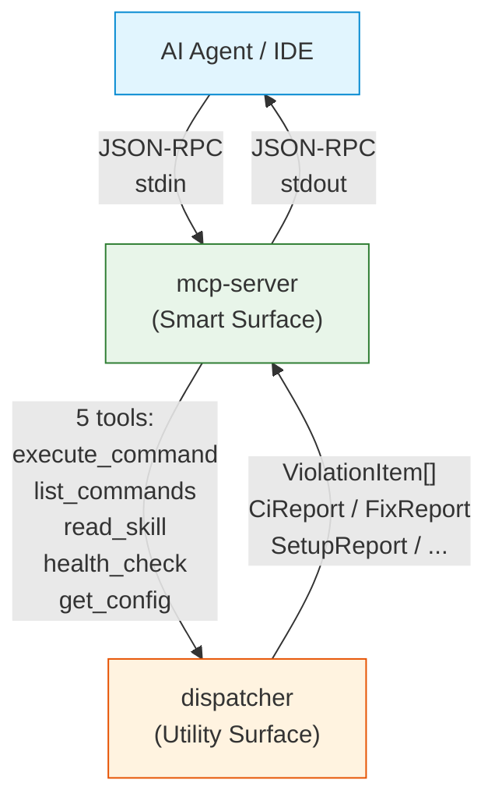

 FRD — mcp-server (v1.1.0)

---

## System Overview

The mcp-server crate implements a Model Context Protocol (MCP) server that
exposes the lint-arwaky pipeline as JSON-RPC tools for AI agents and IDEs.
It communicates via **stdio** (stdin/stdout) using the rmcp MCP framework on
a Tokio async runtime. Tool handlers are `async fn`; concurrent requests are
handled by the async runtime.

### Architecture & Data Flow

### Product Policy (locked)

- **Five MCP tools**: `execute_command`, `list_commands`, `read_skill`,
  `health_check`, `get_config`.
- **Full CLI parity** for every action under `execute_command` — no silent
  stubs or placeholder success responses.
- JSON responses include `exit_code` aligned with the workspace Exit Code
  Contract (`0` / `1` / `2` / `3`) from the root PRD.
- Files that fail to parse are skipped by the underlying analyzers; the MCP
  server does not emit a separate parse-warning diagnostic.

---

## Functional Requirements

### FR-001: Execute Command

- **Description**: Execute any lint-arwaky CLI-equivalent action via MCP with
  the same business outcome as the CLI.
- **Input**: Action string and optional argument map (keys: `path`,
  `threshold`, `client`, `dry_run`, `format`, `member`, `base`, …).
- **Output**: JSON with `status`, `action`, `exit_code`, and action-specific
  fields (e.g., `total_violations`, `results`, `error`).
- **Business Rules**:

  - Supported actions MUST match CLI capability:
    `check`, `scan`, `fix`, `ci`, `doctor`, `version`, `adapters`,
    `install-hook`, `uninstall-hook`, `init`, `install`, `mcp-config`,
    `config-show`, `orphan`, `security`, `dependencies`,
    `quality`, `import`, `naming`, `role`, `external`.
  - `watch` returns explicit `unsupported` with `exit_code: 2` until
    long-lived MCP watch design exists.
  - Each action **delegates to the same aggregates** used by the CLI
    (analysis, auto-fix, maintenance, git-hooks, project-setup, etc.).
  - **Forbidden**: placeholder success, empty success without side effects,
    or "returns action + path only" stubs for actions that perform real work
    on CLI.
  - `check` / `scan`: default path `"."`; run full pipeline; `exit_code`
    0/1/2 per Exit Code Contract. Files that fail to parse are silently
    skipped by the underlying analyzers (counted in `skipped_count` when
    available); no separate `parse_warnings` array is emitted.
  - `ci`: default path `"."`, default threshold 80; pass/fail with
    `exit_code` 0/1/2.
  - `fix`: run auto-fix (remove/replace/rename); honor `dry_run`; report
    applied/skipped/failed outcomes with reason codes.
  - `doctor`: toolchain diagnostics; `exit_code` 0 when diagnostic completes
    (missing tools listed in body); `2` on internal failure.
  - `security`: vulnerability scan; `exit_code` 0 clean, 1 findings,
    2 runtime error, **3** tool missing.
  - `install-hook` / `uninstall-hook`: perform real hook install/uninstall
    via git-hooks aggregate.
  - `init` / `install` / `mcp-config` / `config-show`: perform real
    setup/config operations via project-setup / config aggregates.
  - `orphan` / `dependencies` / individual linter actions: run real analysis
    or reports.
  - Unknown action: `{"error": "Unknown action: <action>", "exit_code": 2}`.
- **Edge Cases**:

  - Missing `path`: defaults to `"."`.
  - Missing `threshold`: defaults to 80.
  - Pipeline failure: `exit_code: 2` with error message.
  - Required tool missing (security): `exit_code: 3`.
  - Files with parse failures: silently skipped by analyzers, not counted
    as violations.
- **Error Handling**: Errors returned as JSON objects with `error` +
  `exit_code`; never silent success.

---

### FR-002: List Commands

- **Description**: List available CLI commands with descriptions and examples,
  optionally filtered by domain.
- **Input**: Optional domain filter string.
- **Output**: JSON with `commands` array (`name`, `description`, `example`),
  `total`, `exit_code: 0`.
- **Business Rules**:

  - Non-empty domain filter restricts to commands whose name contains the
    domain string.
  - Empty/absent domain returns full catalog from taxonomy/command catalog.
- **Edge Cases**:

  - No matches: empty `commands`, `total: 0`.
- **Error Handling**: Serialization failure: `exit_code: 2` with error object.

---

### FR-003: Read Skill

- **Description**: Read skill documentation by section from candidate
  locations.
- **Input**: Optional section filter string.
- **Output**: JSON with `content` or `error`, plus `exit_code`.
- **Business Rules**:

  - Search order: `.agents/skills/` skill candidates, then XDG config
    (`~/.config/lint-arwaky/.agents/skills/`).
  - Optional section extracts content between `## <section>` headers.
- **Edge Cases**:

  - Not found: error + searched paths, `exit_code: 2`.
  - Section missing: error, `exit_code: 2`.
- **Error Handling**: File read failure treated as not found.

---

### FR-004: Health Check

- **Description**: Report adapter availability and server version.
- **Input**: None.
- **Output**: JSON with `version`, `adapters_available`, `adapters_total`,
  `adapters[]` (`name`, `language`, `status`), `exit_code: 0` when check
  completes.
- **Business Rules**:

  - All 9 adapters checked:

    | Adapter     | Language |
    | ------------- | ---------- |
    | clippy      | Rust     |
    | rustfmt     | Rust     |
    | cargo-audit | Rust     |
    | ruff        | Python   |
    | mypy        | Python   |
    | bandit      | Python   |
    | eslint      | JS/TS    |
    | prettier    | JS/TS    |
    | tsc         | JS/TS    |
  - Status is `available` or `not_installed`.
  - Completing the check always yields `exit_code: 0` (missing adapters are
    data, not process failure).
- **Edge Cases**:

  - All adapters missing: `adapters_available: 0`, still `exit_code: 0`.
- **Error Handling**: Spawn/`which` failure for a tool → that adapter
  `not_installed`.

---

### FR-005: Get Config

- **Description**: Return the effective architecture configuration for a
  target path/language so agents can reason about rules, thresholds, and
  adapters without shelling out.
- **Input**: Optional `path`, optional language hint.
- **Output**: JSON with effective config summary (layers, rules enabled,
  score threshold, ignored paths, adapter toggles), config source path(s),
  warnings, `exit_code`.
- **Business Rules**:

  - Loads config via the same config-system path resolution as CLI
    (`config-show` parity for data).
  - Does not mutate files.
  - Redacts secrets if any env-backed fields appear (none expected for core
    config).
- **Edge Cases**:

  - No config file: return embedded defaults + warning, `exit_code: 0`.
  - Invalid path: `exit_code: 2`.
- **Error Handling**: Parse failures: surface warnings or `exit_code: 2`
  when config is unusable.

---

### FR-006: MCP Protocol Registration

- **Description**: Register all five tools and server metadata with the MCP
  framework.
- **Input**: None (construction-time).
- **Output**: Server info with protocol version, name `lint-arwaky`, version,
  tools capability listing five tools.
- **Business Rules**:

  - Tools: `execute_command`, `list_commands`, `read_skill`, `health_check`,
    `get_config`.
- Transport: stdio via `rmcp::transport::stdio()`.
- Concurrent requests handled by the Tokio async runtime; tool handlers are
  `async fn`.
- **Edge Cases**: None (declarative).
- **Error Handling**: Registration failures prevent server start (fail fast).

---

## API Contract

| Operation       | Input                  | Output                           | Description                  |
| ----------------- | ------------------------ | ---------------------------------- | ------------------------------ |
| Execute command | action + args          | JSON + exit_code                 | CLI-parity action execution  |
| List commands   | optional domain        | JSON command catalog             | Discover actions             |
| Read skill      | optional section       | JSON content/error               | Documentation access         |
| Health check    | none                   | JSON adapter status (9 adapters) | Environment health           |
| Get config      | optional path/language | JSON effective config            | Agent-readable configuration |
| Server info     | none                   | Server metadata                  | MCP handshake                |

---

## Integration Points

- **Internal**:

  - CLI command aggregates / analysis pipeline (same aggregates as CLI).
  - `auto-fix`, `maintenance`, `git-hooks`, `project-setup`, `config-system`,
    `external-lint` — operation aggregates.
  - `shared` — taxonomy VOs and contracts.
  - All linter aggregates receive data from the `filesystem` crate via
    `IFilesystemAggregate` trait (same data flow as CLI).
- **External**:

  - MCP protocol library (JSON-RPC, tool registration).
  - Host process environment (`which`, cargo, language toolchains).
  - Tokio async runtime (via `rmcp`).

---

## Non-functional Requirements

- **Performance**: `list_commands` / `read_skill` / `get_config` /
  `health_check` under 5s typical. `execute_command` bounded by underlying
  pipeline performance.
- **Parity**: For every non-watch action, MCP and CLI produce equivalent
  exit semantics and side effects.
- **Concurrency**: MCP server runs on the Tokio async runtime (rmcp). Tool
  handlers are `async fn`; concurrent requests are handled by the runtime.
  File mutations (`fix`)
  are serialized per path to prevent race conditions. No async runtime
  dependency.
- **Security**: Unknown actions never invoke arbitrary shell; only
  allowlisted actions. Config secrets redacted in `get_config` response.

---

## Test Scenarios / QA Checklist

### FR-001 — Execute Command

| # | Scenario                                      | Expected                            | Rule   |
| --- | ----------------------------------------------- | ------------------------------------- | -------- |
| 1 | `check`/`scan` returns violations + exit_code | Matches CLI on same fixture         | FR-001 |
| 2 | `fix` applies real fixes (or dry-run report)  | No placeholder success              | FR-001 |
| 3 | `install-hook` / `uninstall-hook`             | Changes hook state like CLI         | FR-001 |
| 4 | `security` tool missing                       | exit_code 3                         | FR-001 |
| 5 | Unknown action                                | Error + exit_code 2                 | FR-001 |
| 6 | `watch` action                                | Explicit`unsupported` + exit_code 2 | FR-001 |
| 7 | Files with parse failures             | Silently skipped, not counted as violations | FR-001 |
| 8 | Missing path argument                         | Defaults to "."                     | FR-001 |

### FR-002 — List Commands

| # | Scenario                | Expected                | Rule   |
| --- | ------------------------- | ------------------------- | -------- |
| 1 | List without filter     | Full command catalog    | FR-002 |
| 2 | List with domain filter | Filtered subset         | FR-002 |
| 3 | No matches              | Empty commands, total 0 | FR-002 |

### FR-003 — Read Skill

| # | Scenario              | Expected                            | Rule   |
| --- | ----------------------- | ------------------------------------- | -------- |
| 1 | Read full skill       | Content returned                    | FR-003 |
| 2 | Read specific section | Section content returned            | FR-003 |
| 3 | Missing skill         | Error + searched paths, exit_code 2 | FR-003 |
| 4 | Missing section       | Error, exit_code 2                  | FR-003 |

### FR-004 — Health Check

| # | Scenario                 | Expected                                | Rule   |
| --- | -------------------------- | ----------------------------------------- | -------- |
| 1 | All 9 adapters installed | adapters_available 9, exit_code 0       | FR-004 |
| 2 | Some adapters missing    | Correct status per adapter, exit_code 0 | FR-004 |
| 3 | All adapters missing     | adapters_available 0, exit_code 0       | FR-004 |

### FR-005 — Get Config

| # | Scenario           | Expected                                 | Rule   |
| --- | -------------------- | ------------------------------------------ | -------- |
| 1 | Config file exists | Effective config returned                | FR-005 |
| 2 | No config file     | Embedded defaults + warning, exit_code 0 | FR-005 |
| 3 | Invalid path       | exit_code 2                              | FR-005 |

### FR-006 — Protocol Registration

| # | Scenario       | Expected                        | Rule   |
| --- | ---------------- | --------------------------------- | -------- |
| 1 | MCP tools/list | Exactly 5 tools returned        | FR-006 |
| 2 | Server info    | Name, version, protocol version | FR-006 |

---

## Assumptions & Constraints

- Same aggregates as CLI are wired into the MCP composition root.
- Long-lived `watch` is deferred with explicit unsupported response until
  async watch design exists.
- Skill file location search is best-effort across project and XDG paths.
- MCP server uses stdio transport on the Tokio async runtime (rmcp).
- Files that fail to parse are skipped by the underlying analyzers; no
  separate parse-warning diagnostic is emitted.
- All 9 external lint adapters are checked in health_check.

---

## Glossary

| Term                   | Definition                                                                                    |
| ------------------------ | ----------------------------------------------------------------------------------------------- |
| **AES**                | Agentic Engineering System — the 7-layer coding convention                                   |
| **MCP**                | Model Context Protocol — JSON-RPC standard for AI agent tools                                |
| **Parity**             | Same business outcome for an action via CLI or MCP                                            |
| **Exit Code Contract** | 0 ok, 1 policy fail, 2 runtime error, 3 prerequisite missing                                  |
| **get_config**         | Fifth MCP tool for effective configuration inspection                                         |
| **Parse skip**         | Files that fail to parse are skipped by the underlying analyzers; no separate warning diagnostic is emitted. |
| **stdio**              | Standard input/output transport for MCP JSON-RPC communication                                |

---

## Reference

- PRD: [PRD.md](../../PRD.md)
- Architecture: [ARCHITECTURE.md](../../ARCHITECTURE.md)
- CLI Commands FRD: `crates/cli-commands/FRD.md`
- External Lint FRD: `crates/external-lint/FRD.md`
- Config System FRD: `crates/config-system/FRD.md`
