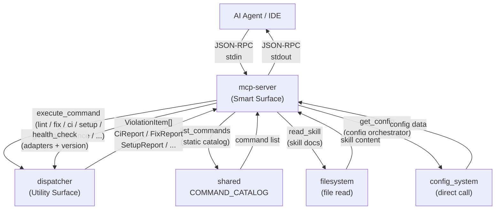

FRD — mcp-server

---

## Reference

- PRD: [PRD.md](../../PRD.md)
- Backlog: [BACKLOG.md](BACKLOG.md) — real condition for this crate; this file is specification only.
- Architecture: [ARCHITECTURE.md](../../ARCHITECTURE.md)
- CLI Commands FRD: `crates/cli-commands/FRD.md`
- External Lint FRD: `crates/external-lint/FRD.md`
- Config System FRD: `crates/config-system/FRD.md`

## System Overview

The mcp-server crate implements a Model Context Protocol (MCP) server that
exposes the lint-arwaky pipeline as JSON-RPC tools for AI agents and IDEs.
It communicates via **stdio** (stdin/stdout) using the rmcp MCP framework on
a Tokio async runtime. Tool handlers are `async fn`; concurrent requests are
handled by the async runtime.

### Architecture & Data Flow

```mermaid
flowchart TD
    A["AI Agent / IDE"] -->|"JSON-RPC\nstdin"| B["mcp-server\n(Smart Surface)"]

    B -->|"execute_command\n(lint / fix / ci / setup /\ngit / maintenance / ...)"| D["dispatcher\n(Utility Surface)"]
    B -->|"health_check\n(adapters + version)"| D
    B -->|"list_commands\n(static catalog)"| LC["shared\nCOMMAND_CATALOG"]
    B -->|"read_skill\n(skill docs)"| SK["filesystem\n(file read)"]
    B -->|"get_config\n(config orchestrator)"| CFG["config_system\n(direct call)"]

    D -->|"ViolationItem[]\nCiReport / FixReport\nSetupReport / ..."| B
    LC -->|"command list"| B
    SK -->|"skill content"| B
    CFG -->|"config data"| B
    B -->|"JSON-RPC\nstdout"| A

```

### Product Policy (locked)

- **Five MCP tools**: `execute_command`, `list_commands`, `read_skill`,
  `health_check`, `get_config`.
- **Full CLI parity** for every action under `execute_command` — no silent
  stubs or placeholder success responses.

### Tool Routing

| MCP Tool | Target | How |
|----------|--------|-----|
| `execute_command` | `dispatcher::surface_*_action::*` | All lint/fix/ci/setup/git/maintenance actions |
| `health_check` | `dispatcher::surface_maintenance_action::collect_health_check` + `collect_version` | Adapter availability + version |
| `list_commands` | `shared::COMMAND_CATALOG` (static) | Local catalog filter by domain |
| `read_skill` | Filesystem (file read) | Skill `.md` docs from `.agents/skills/` |
| `get_config` | `config_orchestrator` (direct call) | Config files, rules, thresholds |

### Dependency Rule

- MCP server imports: shared (taxonomies, aggregates including `IConfigOrchestratorAggregate`), dispatcher (surface_*_action)
- MCP server must NOT import: rule crates, filesystem aggregate (except read_skill)
- JSON responses include `exit_code` aligned with the workspace Exit Code
  Contract (`0` / `1` / `2` / `3`) from the root PRD.
- Files that fail to parse are skipped by the underlying analyzers; the MCP
  server does not emit a separate parse-warning diagnostic.

---

## Functional Requirements

### FR-MCPSERVER-001: Execute Command

- **Description**: Execute any lint-arwaky CLI-equivalent action via MCP with
  the same business outcome as the CLI.
- **Input**: Action string and optional argument map (keys: `path`,
  `threshold`, `client`, `dry_run`, `format`, `member`, `base`, …).
- **Output**: JSON with `status`, `action`, `exit_code`, and action-specific
  fields (e.g., `total_violations`, `results`, `error`).
- **Business Rules**:

  - Supported actions MUST match CLI capability:
    `check`, `scan`, `fix`, `ci`, `doctor`, `version`, `adapters`,
    `install-hook`, `uninstall-hook`, `init`, `install`, `config-show`,
    `orphan`, `security`, `dependencies`,
    `quality`, `import`, `naming`, `role`, `external`, `watch`.
  - `watch` returns explicit `unsupported` with `exit_code: 2` until
    long-lived MCP watch design exists.
  - `adapters` delegates to `health_check` handler for adapter availability.
  - `version` returns current lint-arwaky version info.
  - Each action **delegates to the same aggregates** used by the CLI
    (analysis, auto-fix, maintenance, git-hooks, project-setup, etc.).
  - **Forbidden**: placeholder success, empty success without side effects,
    or "returns action + path only" stubs for actions that perform real work
    on CLI.
  - `check` / `scan`: default path `"."`; run full pipeline; `exit_code`
    0/1/2 per Exit Code Contract. Files that fail to parse are silently
    skipped by the underlying analyzers (counted in `skipped_count` when
    available); no separate `parse_warnings` array is emitted.
  - `ci`: default path `"."`, default threshold 80; pass/fail with
    `exit_code` 0/1/2.
  - `fix`: run auto-fix (remove/replace/rename); honor `dry_run`; report
    applied/skipped/failed outcomes with reason codes.
  - `doctor`: toolchain diagnostics; `exit_code` 0 when diagnostic completes
    (missing tools listed in body); `2` on internal failure.
  - `security`: vulnerability scan; `exit_code` 0 clean, 1 findings,
    2 runtime error, **3** tool missing.
  - `install-hook` / `uninstall-hook`: perform real hook install/uninstall
    via git-hooks aggregate.
  - `init` / `install`: perform real setup operations via project-setup
    aggregate.
  - `config-show`: return effective configuration via config orchestrator.
  - `orphan` / `dependencies` / individual linter actions: run real analysis
    or reports.
  - `mcp-config`: returns error indicating transport configuration required;
    full setup must be done via CLI.
  - Unknown action: `{"error": "Unknown action: <action>", "exit_code": 2}`.
- **Edge Cases**:

  - Missing `path`: defaults to `"."`.
  - Missing `threshold`: defaults to 80.
  - Pipeline failure: `exit_code: 2` with error message.
  - Required tool missing (security): `exit_code: 3`.
  - Files with parse failures: silently skipped by analyzers, not counted
    as violations.
- **Error Handling**: Errors returned as JSON objects with `error` +
  `exit_code`; never silent success.

---

### FR-MCPSERVER-002: List Commands

- **Description**: List available CLI commands with descriptions and examples,
  optionally filtered by domain.
- **Input**: Optional domain filter string.
- **Output**: JSON with `commands` array (`name`, `description`, `example`),
  `total`, `exit_code: 0`.
- **Business Rules**:

  - Non-empty domain filter restricts to commands whose name contains the
    domain string.
  - Empty/absent domain returns full catalog from taxonomy/command catalog.
- **Edge Cases**:

  - No matches: empty `commands`, `total: 0`.
- **Error Handling**: Serialization failure: `exit_code: 2` with error object.

---

### FR-MCPSERVER-003: Read Skill

- **Description**: Read skill documentation by section from candidate
  locations.
- **Input**: Optional section filter string.
- **Output**: JSON with `content` or `error`, plus `exit_code`.
- **Business Rules**:

  - Search order: `.agents/skills/` skill candidates, then XDG config
    (`~/.config/lint-arwaky/.agents/skills/`).
  - Optional section extracts content between `## <section>` headers.
- **Edge Cases**:

  - Not found: error + searched paths, `exit_code: 2`.
  - Section missing: error, `exit_code: 2`.
- **Error Handling**: File read failure treated as not found.

---

### FR-MCPSERVER-004: Health Check

- **Description**: Report adapter availability and server version.
- **Input**: None.
- **Output**: JSON with `version`, `adapters_available`, `adapters_total`,
  `adapters[]` (`name`, `language`, `status`), `exit_code: 0` when check
  completes.
- **Business Rules**:

  - All supported adapters checked (Rust, Python, JS/TS, and VCS tools
    discovered by the maintenance aggregate).
  - Status is `available` or `not_installed`.
  - Completing the check always yields `exit_code: 0` (missing adapters are
    data, not process failure).
- **Edge Cases**:

  - All adapters missing: `adapters_available: 0`, still `exit_code: 0`.
- **Error Handling**: Spawn/`which` failure for a tool → that adapter
  `not_installed`.

---

### FR-MCPSERVER-005: Get Config

- **Description**: Return the effective architecture configuration for a
  target path/language so agents can reason about rules, thresholds, and
  adapters without shelling out.
- **Input**: Optional `path`, optional language hint.
- **Output**: JSON with effective config summary (layers, rules enabled,
  score threshold, ignored paths, adapter toggles), config source path(s),
  warnings, `exit_code`.
- **Business Rules**:

  - Loads config via the same config-system path resolution as CLI
    (`config-show` parity for data).
  - Does not mutate files.
  - Redacts secrets if any env-backed fields appear (none expected for core
    config).
- **Edge Cases**:

  - No config file: return embedded defaults + warning, `exit_code: 0`.
  - Invalid path: `exit_code: 2`.
- **Error Handling**: Parse failures: surface warnings or `exit_code: 2`
  when config is unusable.

---

### FR-MCPSERVER-006: MCP Protocol Registration

- **Description**: Register all five tools and server metadata with the MCP
  framework.
- **Input**: None (construction-time).
- **Output**: Server info with protocol version, name `lint-arwaky`, version,
  tools capability listing five tools.
- **Business Rules**:

  - Tools: `execute_command`, `list_commands`, `read_skill`, `health_check`,
    `get_config`.
- Transport: stdio via `rmcp::transport::stdio()`.
- Concurrent requests handled by the Tokio async runtime; tool handlers are
  `async fn`.
- **Edge Cases**: None (declarative).
- **Error Handling**: Registration failures prevent server start (fail fast).

---

## API Contract

### Protocol API

| Method | Input | Output | Error | Event | Description |
| --- | --- | --- | --- | --- | --- |
| `execute_command` | Action string plus an optional argument map (`path`, `threshold`, `client`, `dry_run`, `format`, `member`, `base`, …) | JSON with `status`, `action`, `exit_code`, and action-specific fields | Unknown action → `error` + `exit_code: 2`; pipeline failure → `exit_code: 2`; missing scan tool → `exit_code: 3` | JSON-RPC tool call | Single composite entry point on the MCP tool surface: dispatches every allowlisted action to the same aggregates the CLI uses. |

### Aggregate API

| Method | Input | Output | Error | Event | Description |
| --- | --- | --- | --- | --- | --- |
| `execute_command` | Action string plus arguments | JSON with `exit_code` | Errors returned as JSON with `error` + `exit_code`; never a silent success | — | Route the action to the matching per-action executor. |
| `execute_check` | Path (defaults to `.`) | JSON with violations and `exit_code` | `exit_code: 2` on pipeline failure | — | Run the full analysis pipeline over the target path. |
| `execute_ci` | Path, threshold (default 80) | JSON with score and `exit_code` | `exit_code: 2` on pipeline failure | — | Run CI-mode analysis and compare the score against the threshold. |
| `execute_fix` | Path, `dry_run` flag | JSON with applied, skipped, and failed counts | `exit_code: 2` on pipeline failure | — | Apply automatic safe fixes, honouring dry-run preview mode. |
| `execute_quality` | Path | JSON with results and `exit_code` | `exit_code: 2` on invalid path | — | Run code-quality analysis only (AES301–305). |
| `execute_import` | Path | JSON with results and `exit_code` | `exit_code: 2` on invalid path | — | Run import-rule analysis only (AES201–205). |
| `execute_naming` | Path | JSON with results and `exit_code` | `exit_code: 2` on invalid path | — | Run naming-rule analysis only (AES101–102). |
| `execute_role` | Path | JSON with results and `exit_code` | `exit_code: 2` on invalid path | — | Run role-rule analysis only (AES401–406). |
| `execute_orphan` | Path | JSON with results and `exit_code` | `exit_code: 2` on invalid path | — | Run orphan detection only (AES501–506). |
| `execute_external` | Path | JSON with results and `exit_code` | `exit_code: 2` on invalid path | — | Run external linter analysis. |
| `execute_doctor` | — | JSON with toolchain diagnostics and `exit_code` | `exit_code: 2` on internal failure | — | Report toolchain diagnostics; exit 0 whenever the diagnostic completes. |
| `execute_security` | Path | JSON with findings and `exit_code` | `exit_code: 3` when the scan tool is missing; `2` on scan failure | — | Run a vulnerability scan over the target project. |
| `execute_dependencies` | Path | JSON with the dependency list and `exit_code` | `exit_code: 2` when the report cannot be produced | — | Produce the project dependency report. |
| `execute_version` | — | JSON with the current version and `exit_code: 0` | None | — | Return the current lint-arwaky version. |
| `execute_watch` | — | JSON with `unsupported` and `exit_code: 2` | Deferred until a long-lived MCP watch design exists | — | Report that the watch action is explicitly unsupported over MCP. |
| `handle_health_check` | — | JSON with `version`, `adapters_available`, `adapters_total`, and per-adapter status | Spawn or `which` failure for a tool → that adapter marked `not_installed` | — | Report adapter availability and the server version; always `exit_code: 0`. |
| `handle_list_commands` | Optional domain filter | JSON with `commands`, `total`, `exit_code: 0` | `exit_code: 2` on serialization failure | — | Return the command catalog, optionally filtered by domain. |
| `handle_read_skill` | Optional section filter | JSON with `content` or `error`, plus `exit_code` | Not found → error plus the searched paths and `exit_code: 2` | — | Read skill documentation from the candidate locations. |
| `handle_get_config` | Path, optional language hint | JSON with the effective config, source paths, warnings, and `exit_code` | Invalid path → `exit_code: 2`; no config file → embedded defaults with a warning | — | Return the effective architecture configuration for the target. |

---

## Integration Points

| System | Direction | Purpose | Failure mode |
| --- | --- | --- | --- |
| `dispatcher` | in | All lint, fix, CI, setup, git, and maintenance actions via the `surface_*_action` modules | Action returns an error → mapped to the matching `exit_code` |
| CLI command aggregates and analysis pipeline | in | The same aggregates the CLI uses, so every action has full CLI parity | Aggregate unavailable → error with `exit_code: 2` |
| `auto-fix`, `maintenance`, `git-hooks`, `project-setup`, `config-system`, `external-lint` | in | Operation aggregates reached through the dispatcher | Aggregate returns an error → error field in the JSON response |
| `shared` | in | Taxonomy VOs, contracts, and the static command catalog | Compile-time dependency; unavailable at build time |
| `filesystem` | in | File read access for skill documentation only | File read failure treated as not found → `exit_code: 2` |
| MCP protocol library (`rmcp`) | in | JSON-RPC framing and tool registration | Registration failure prevents server start (fail fast) |
| Host process environment | in | `which`, cargo, and language toolchains resolved for the health check | Tool not found → that adapter reported `not_installed` |
| Tokio async runtime | in | Hosts the stdio server loop and the async tool handlers | Runtime creation failure → server exits with a runtime error |

---

## Non-functional Requirements

| Metric | Target | Measurement method |
| --- | --- | --- |
| Lightweight tool latency | `list_commands`, `read_skill`, `get_config`, and `health_check` complete within 5s typically | Time each tool call against a local project |
| `execute_command` latency | Bounded by the underlying pipeline performance | Time a full `check` action and compare against the same CLI run |
| CLI parity | For every non-watch action, MCP and CLI produce equivalent exit semantics and side effects | Run each action through both surfaces and diff the resulting state and exit code |
| Action safety | Unknown actions never invoke an arbitrary shell; only allowlisted actions run | Send an unknown action name and assert no subprocess is spawned |
| Secret handling | Config secrets are redacted in the `get_config` response | Return a config containing secret-shaped values and assert they are masked |
| Concurrency | Tool handlers are `async fn` on the Tokio runtime; file mutations (`fix`) are serialized per path | Run concurrent fix requests against one path and assert no interleaving corruption |
| Action completeness | No placeholder success, no empty success without side effects, no "action + path only" stubs | Compare every allowlisted action's response against its CLI counterpart |

---

## Test Scenarios

- A `check` or `scan` action returns the violations and an `exit_code` matching the CLI on the same fixture.
- A `fix` action applies real fixes, or reports the dry-run preview, with no placeholder success.
- An `install-hook` or `uninstall-hook` action changes the hook state the same way the CLI does.
- A `security` action with the scan tool missing returns `exit_code: 3`.
- An unknown action returns an error with `exit_code: 2`.
- A `watch` action returns an explicit `unsupported` status with `exit_code: 2`.
- Files with parse failures are silently skipped and are not counted as violations.
- A missing `path` argument defaults to `.`.
- A `version` action returns the version information with `exit_code: 0`.
- An `adapters` action delegates to the health check handler and reports the same adapter status.
- Listing commands without a filter returns the full command catalog.
- Listing commands with a domain filter returns the filtered subset.
- Listing commands with a filter that matches nothing returns an empty command list with `total: 0`.
- Reading a full skill returns its content.
- Reading a specific section returns only that section's content.
- Reading a missing skill returns an error with the searched paths and `exit_code: 2`.
- Reading a missing section returns an error with `exit_code: 2`.
- A health check with all adapters installed reports every adapter as available with `exit_code: 0`.
- A health check with some adapters missing reports the correct per-adapter status with `exit_code: 0`.
- A health check with all adapters missing reports `adapters_available: 0` with `exit_code: 0`.
- A `get_config` call on a project with a config file returns the effective config.
- A `get_config` call with no config file returns the embedded defaults plus a warning with `exit_code: 0`.
- A `get_config` call on an invalid path returns `exit_code: 2`.
- An MCP tools list returns exactly 5 tools.
- The server info response carries the name, version, and protocol version.

---

## Assumptions & Constraints

- Same aggregates as CLI are wired into the MCP composition root.
- Long-lived `watch` is deferred with explicit unsupported response until
  async watch design exists.
- Skill file location search is best-effort across project and XDG paths.
- MCP server uses stdio transport on the Tokio async runtime (rmcp).
- Files that fail to parse are skipped by the underlying analyzers; no
  separate parse-warning diagnostic is emitted.
- All supported external lint adapters are checked in health_check.

---

## Glossary

- **AES**: Agentic Engineering System — the 7-layer coding convention.
- **MCP**: Model Context Protocol — JSON-RPC standard for AI agent tools.
- **Parity**: The same business outcome for an action whether it is invoked via the CLI or MCP.
- **Exit Code Contract**: 0 ok, 1 policy fail, 2 runtime error, 3 prerequisite missing.
- **Parse skip**: Files that fail to parse are skipped by the underlying analyzers; no separate warning diagnostic is emitted.
- **stdio**: Standard input/output transport for MCP JSON-RPC communication.

---
