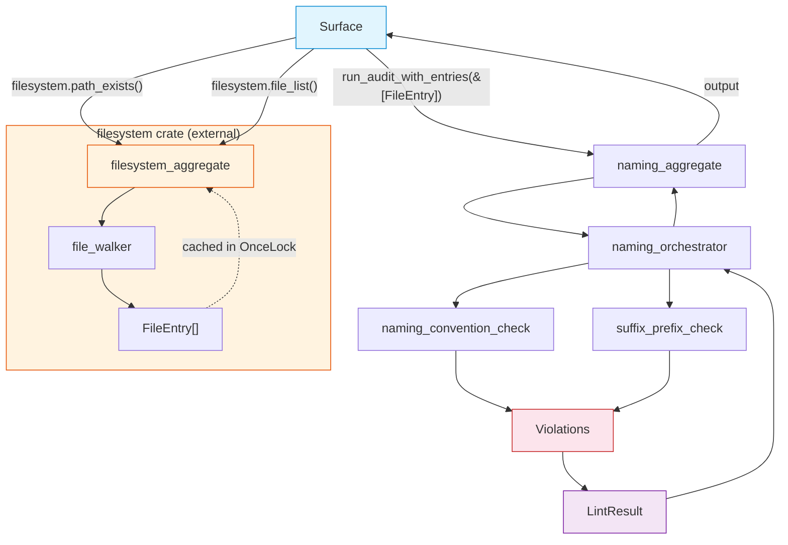

# FRD — naming-rules (v1.1.0)

---

## System Overview

The naming-rules crate enforces strict naming conventions across the codebase to ensure consistency, readability, and adherence to the 7-layer AES architecture. It validates that files conform to structural naming patterns (AES101) and that file prefixes/suffixes are consistent with their architectural layer (AES102), preventing naming chaos and ensuring every file can be correctly assigned to an architectural layer.

File system operations  are handled by the external `filesystem` crate via `IFilesystemAggregate`. The surface layer fetches the pre-populated file list from `filesystem.file_list()` and passes it to the naming orchestrator via `run_audit_with_entries(&[FileEntry])`. The naming-rules crate performs zero I/O — it receives data and delegates analysis to its internal checkers.

### Architecture & Data Flow



---

## Functional Requirements

### FR-001: Naming Convention (AES101)

- **Description**: Every file stem must be snake_case with at least N underscore-separated words in `prefix_concept_suffix` pattern.
- **Input**: Pre-populated `&[FileEntry]` from filesystem aggregate (via surface), architecture configuration, layer map.
- **Output**:

  - AES101 diagnostic if naming structure is invalid.
- **Business Rules**:

  - Must be snake_case: lowercase ASCII letters (`a-z`), digits (`0-9`), and underscores only. No uppercase, no hyphens, no dots.
  - Must follow `prefix_concept_suffix` pattern with minimum N words (configurable via `config.naming.word_count.value`, default 3.
  - Validation regex: `^[a-z0-9]+(_[a-z0-9]+){N-1,}$` — compiled once per word count and cached in a static `OnceLock` table (one slot per word count 1–10).
  - Exceptions: barrel files (`mod.rs`, `lib.rs`, `__init__.py`, `index.ts`, `index.js`) and any file listed in the rule's `exceptions` list are skipped.
- **Edge Cases**:

  - Files with uppercase letters → AES101 (invalid snake_case).
  - Files with hyphens (`taxonomy-user-vo`) → AES101 (invalid separator).
  - Files with dots (`taxonomy.user.vo`) → AES101 (invalid character).
  - Abbreviations like `db` or `http` → allowed as long as lowercase and underscore-separated.
  - Digits in segments (`taxonomy_v2_vo`) → allowed.
  - Files with fewer than N words → AES101 (too few words).
- **Error Handling**:

  - Emit AES101 with the invalid stem, expected pattern, and minimum word count.
  - Emit AES000 with the unrecognized prefix and list of valid prefixes.
  - Unreadable file paths (returned by filesystem crate with error flag) are skipped.

---

### FR-002: Suffix/Prefix Validation (AES102)

- **Description**: File suffix must align with the architectural layer indicated by its prefix, and file prefix must be consistent with its suffix. Forbidden suffixes from other layers are rejected. Prefix-suffix cross-validation ensures a file's layer identity is internally consistent.
- **Input**: Pre-populated `&[FileEntry]` from filesystem aggregate (via surface), architecture configuration with per-layer suffix policies, layer map.
- **Output**: AES102 diagnostic if suffix is forbidden, mismatches the layer's allowed list, or is inconsistent with the prefix.
- **Business Rules**:

  - **Suffix extraction**: The suffix is the last underscore-separated token from the stem (e.g., `taxonomy_user_vo` → suffix = `vo`).
  - **Prefix extraction**: The prefix is the first underscore-separated token from the stem (e.g., `taxonomy_user_vo` → prefix = `taxonomy`).
  - **Suffix policy per layer** (from config `layers` definition):

    - `strict`: Only suffixes in the explicit allow-list are permitted. Any other suffix → AES102 (`SuffixMismatch`).
    - `flexible`: Any suffix is allowed EXCEPT those in the `forbidden` list. Forbidden suffix → AES102 (`SuffixForbidden`).
    - If a layer has no suffix definition, suffix checking is skipped for that layer.
  - **Prefix-suffix cross-validation**:

    - The detected prefix determines the expected layer.
    - The suffix must belong to that layer's allowed suffix set.
    - If the suffix belongs to a DIFFERENT layer's suffix set, AES102 is emitted with both the expected and actual layer.
    - Example: `taxonomy_user_protocol` → prefix = `taxonomy`, suffix = `protocol`. But `protocol` belongs to `contract` layer → AES102 (`PrefixSuffixMismatch`: expected taxonomy suffix, got contract suffix).
  - **Forbidden suffix enforcement**:

    - If a suffix appears in the layer's `forbidden` list, it is immediately rejected (AES102 with `SuffixForbidden`), regardless of flexible/strict policy.
  - **Barrel files and entry points** (`mod.rs`, `lib.rs`, `main.rs`, `__init__.py`, `index.ts`, `index.js`, `build.rs`) are skipped.
  - **Files in the rule's `exceptions` list** are skipped.
  - **Layer detection** via the layer detection utility using filename prefix.
- **Per-Layer Suffix Policies** (source of truth: YAML config):


  | Layer        | Policy   | Allowed Suffixes                                                                                              | Forbidden Suffixes                                                                            |
  | -------------- | ---------- | --------------------------------------------------------------------------------------------------------------- | ----------------------------------------------------------------------------------------------- |
  | taxonomy     | strict   | `vo`, `entity`, `error`, `event`, `constant`                                                                  | —                                                                                            |
  | contract     | strict   | `protocol`, `aggregate`                                                                                       | —                                                                                            |
  | utility      | flexible | *(any)*                                                                                                       | `vo`, `entity`, `error`, `event`, `constant`, `protocol`, `aggregate`                         |
  | capabilities | flexible | *(any)*                                                                                                       | `vo`, `entity`, `error`, `event`, `constant`, `constants`, `protocol`, `aggregate`, `utility` |
  | agent        | strict   | `orchestrator`                                                                                                | —                                                                                            |
  | surface      | strict   | `command`, `controller`, `page`, `view`, `component`, `router`, `layout`, `hook`, `store`, `action`, `screen` | —                                                                                            |
  | root         | strict   | `entry`, `container`                                                                                          | —                                                                                            |
- **Edge Cases**:

  - Files with no suffix (single-word stem after prefix, e.g., `taxonomy_user`) → fails strict policy check (AES102 `SuffixMismatch`).
  - Multiple valid suffixes for a layer (e.g., taxonomy allows `_vo`, `_entity`, `_error`, `_event`, `_constant`) → all pass.
  - Custom or unknown layers without a definition → skipped (no definition means no suffix policy).
  - Prefix-suffix mismatch across layers (e.g., `contract_user_vo`) → AES102 (`PrefixSuffixMismatch`).
  - `build.rs` is skipped (in exceptions list).
- **Error Handling**: Emit AES102 with the layer name, used suffix, prefix, and the full allowed/forbidden lists. For prefix-suffix mismatch, include expected layer and actual suffix layer.

---

## API Contract


| Operation                        | Input                                    | Output             | Purpose                                                              |
| ---------------------------------- | ------------------------------------------ | -------------------- | ---------------------------------------------------------------------- |
| Full naming audit                | `&[FileEntry]` from filesystem aggregate | Lint results       | Run both naming convention and suffix/prefix checks (AES101–AES102) |
| Naming convention check (AES101) | `&[FileEntry]`, configuration            | AES101 violations | Validate snake_case structure and minimum word count                 |
| Suffix/prefix check (AES102)     | `&[FileEntry]`, configuration, layer map | AES102 violations  | Validate suffix matches layer policy and prefix-suffix consistency   |

---

## Integration Points

- **Internal** (naming-rules crate):

  - The configuration system in the shared crate — reads architecture configuration YAML for layer definitions, naming rules, exceptions, ignored paths.
  - The taxonomy definitions in the shared crate — layer map and layer name value objects.
  - The layer detection utility in the shared crate — filename prefix detection.
  - The path value objects in the shared crate — barrel and entry-point detection.
- **External**:

  - **`filesystem` crate** — provides `IFilesystemAggregate` which handles:
    - File walking and directory traversal (`file_walker`).
    - File filtering by extension (`rs`, `py`, `js`, `ts`, `jsx`, `tsx`).
    - Ignore rules (config-level, default skip directories, hidden directories, symlink safety).
    - Caches discovered `FileEntry[]` in `OnceLock<Vec<FileEntry>>` — accessible via `file_list()`.
    - Surface layer calls `filesystem.file_list()` to get the cached entries, then passes them to the naming orchestrator via `run_audit_with_entries()`.
  - No network calls. No filesystem writes. Pure static analysis.
  - The naming-rules crate performs **zero I/O** — all filesystem access is delegated to the filesystem aggregate via the surface layer.

---

## Non-functional Requirements

- **Performance**: Walk and check 1,000 source files in < 1 second (regex compiled once per word count, O(n) per file).
- **Memory**: O(1) per file for checker state. Regex cache is a static `OnceLock` table — one slot per word count 1–10 (typically 1 entry for default config).
- **Accuracy**: Zero false positives for correctly named files. Zero false negatives for files that violate naming structure or suffix/prefix policies. All validation is deterministic (regex + list membership) — no heuristics, no AST ambiguity.

---

## Test Scenarios / QA Checklist

### AES101 — Naming Convention


| #  | Input Scenario                                                                | Expected Output                | Rule   |
| ---- | ------------------------------------------------------------------------------- | -------------------------------- | -------- |
| 1  | Valid snake_case file, 3+ words, recognized layer prefix (`taxonomy_user_vo`) | No violation                   | pass   |
| 2  | File with uppercase characters in stem (`Taxonomy_User_Vo`)                   | AES101 — invalid snake_case   | AES101 |
| 3  | File with only 2 words (`taxonomy_user`)                                      | AES101 — too few words        | AES101 |
| 4  | File with hyphens (`taxonomy-user-vo`)                                        | AES101 — invalid separator    | AES101 |
| 5  | File with dots (`taxonomy.user.vo`)                                           | AES101 — invalid character    | AES101 |
| 6  | Barrel file (`mod.rs`, `__init__.py`, `index.ts`)                             | No violation — exception      | excl   |
| 7  | File in exception list (`main.rs`, `lib.rs`)                                  | No violation — exception      | excl   |
| 8  | Valid file but`min_words` config set to 5, file has 3 words                   | AES101 — below configured min | AES101 |
| 9  | File with unrecognized prefix (`foobar_user_vo`)                              | AES000 — unknown prefix       | AES101 |
| 10 | File with digits in segment (`taxonomy_v2_vo`)                                | No violation (digits allowed)  | pass   |

### AES102 — Suffix/Prefix Validation


| #  | Input Scenario                                                                               | Expected Output                                           | Rule   |
| ---- | ---------------------------------------------------------------------------------------------- | ----------------------------------------------------------- | -------- |
| 1  | `taxonomy_user_vo` — prefix taxonomy, suffix vo (in strict allow-list)                      | No violation                                              | pass   |
| 2  | `taxonomy_user_protocol` — prefix taxonomy, suffix protocol (belongs to contract)           | AES102 — prefix-suffix mismatch                          | AES102 |
| 3  | `contract_user_vo` — prefix contract, suffix vo (belongs to taxonomy)                       | AES102 — prefix-suffix mismatch                          | AES102 |
| 4  | `agent_user_helper` — prefix agent, suffix helper (not in strict allow-list)                | AES102 — suffix mismatch (agent requires`orchestrator`)  | AES102 |
| 5  | `utility_user_helper` — prefix utility, suffix helper (flexible, not forbidden)             | No violation                                              | pass   |
| 6  | `utility_user_protocol` — prefix utility, suffix protocol (in forbidden list)               | AES102 — forbidden suffix                                | AES102 |
| 7  | `capabilities_user_vo` — prefix capabilities, suffix vo (in forbidden list)                 | AES102 — forbidden suffix                                | AES102 |
| 8  | `capabilities_user_checker` — prefix capabilities, suffix checker (flexible, not forbidden) | No violation                                              | pass   |
| 9  | `surface_user_command` — prefix surface, suffix command (in strict allow-list)              | No violation                                              | pass   |
| 10 | `surface_user_helper` — prefix surface, suffix helper (not in strict allow-list)            | AES102 — suffix mismatch                                 | AES102 |
| 11 | `root_app_entry` — prefix root, suffix entry (in strict allow-list)                         | No violation                                              | pass   |
| 12 | `root_app_helper` — prefix root, suffix helper (not in strict allow-list)                   | AES102 — suffix mismatch                                 | AES102 |
| 13 | `build.rs`                                                                                   | No violation — exception                                 | excl   |
| 14 | File in exception list for its layer                                                         | No violation — exception                                 | excl   |
| 15 | `taxonomy_user` — no suffix (single word after prefix)                                      | AES102 — suffix mismatch (strict policy requires suffix) | AES102 |

### Configuration


| # | Scenario                       | Expected                    | Rule   |
| --- | -------------------------------- | ----------------------------- | -------- |
| 1 | Rule AES101 disabled in config | No AES101/AES000 violations | config |
| 2 | Rule AES102 disabled in config | No AES102 violations        | config |
| 3 | File in exceptions list        | No violation for that file  | config |

---

## Assumptions & Constraints

- Layer hierarchy and naming policies are defined in the architecture configuration YAML.
- File naming follows AES conventions (`prefix_concept_suffix` pattern).
- Exceptions are configurable per rule in the rule's `exceptions` list.
- Ignored paths (`node_modules`, `.git`, `target`) are excluded from scanning by the filesystem crate.
- The crate receives pre-populated `&[FileEntry]` from the surface layer (which fetches from `filesystem.file_list()`). No file walking, directory traversal, or filesystem I/O is performed internally.
- Layer detection is based on filename prefix (hardcoded AES convention: `taxonomy_*`, `contract_*`, `utility_*`, `capabilities_*`, `agent_*`, `surface_*`, `root_*`).
- Naming validation is a prerequisite for import-rules layer detection. Files that fail naming validation may cause incorrect layer assignment in downstream crates.

---

## Glossary


| Term                       | Definition                                                                                                                                                                                |
| ---------------------------- | ------------------------------------------------------------------------------------------------------------------------------------------------------------------------------------------- |
| **AES**                    | Agentic Engineering System — the 7-layer architecture framework                                                                                                                          |
| **Layer**                  | Architectural boundary (taxonomy, contract, utility, capabilities, agent, surface, root)                                                                                                  |
| **Suffix**                 | Last underscore-separated token in the filename indicating role (`vo`, `protocol`, `orchestrator`, `checker`, etc.)                                                                       |
| **Prefix**                 | First underscore-separated token in the filename identifying the architectural layer (`taxonomy`, `contract`, `utility`, etc.)                                                            |
| **Stem**                   | Filename without extension (e.g.,`capabilities_user_checker`)                                                                                                                             |
| **Strict suffix policy**   | Layer requires suffix to be in an explicit allow-list. Any other suffix is rejected.                                                                                                      |
| **Flexible suffix policy** | Layer allows any suffix EXCEPT those in the forbidden list.                                                                                                                               |
| **Forbidden suffix**       | Suffix explicitly banned for a layer (belongs to another layer's domain)                                                                                                                  |
| **Prefix-suffix mismatch** | File prefix indicates one layer but suffix belongs to a different layer's suffix set                                                                                                      |
| **Filesystem crate**       | External crate that handles file walking, directory traversal, and file filtering. Caches`FileEntry[]` in `OnceLock`. Surface layer fetches via `file_list()` and passes to naming-rules. |
| **Unreadable skip**        | File paths returned by the filesystem crate with an error flag are skipped silently; no separate warning diagnostic is emitted.                                                           |

---

## Appendix A: YAML Configuration Schema

### Top-Level Structure

```yaml
architecture:
  enabled: true
  rules:
    AES101: { ... }
    AES102: { ... }
```

### Suffix Policy Schema

```yaml
layers:
  <layer_name>:
    suffix:
      - strict: ["<suffix>", ...]      # Only these suffixes allowed
      # OR
      - flexible: []                    # Any suffix allowed (except forbidden)
      - forbidden: ["<suffix>", ...]   # These suffixes are banned
```

**Policy semantics**:

- `strict`: Whitelist. Suffix MUST be in the list. Anything else → AES102 `SuffixMismatch`.
- `flexible`: Open. Any suffix allowed UNLESS in `forbidden` list. Forbidden → AES102 `SuffixForbidden`.
- `strict` and `flexible` are mutually exclusive per layer. `forbidden` can coexist with `flexible`.

---

## Reference

- PRD: [PRD.md](../../PRD.md)
- Architecture: [ARCHITECTURE.md](../../ARCHITECTURE.md)
- Filesystem crate
- Shared crate
