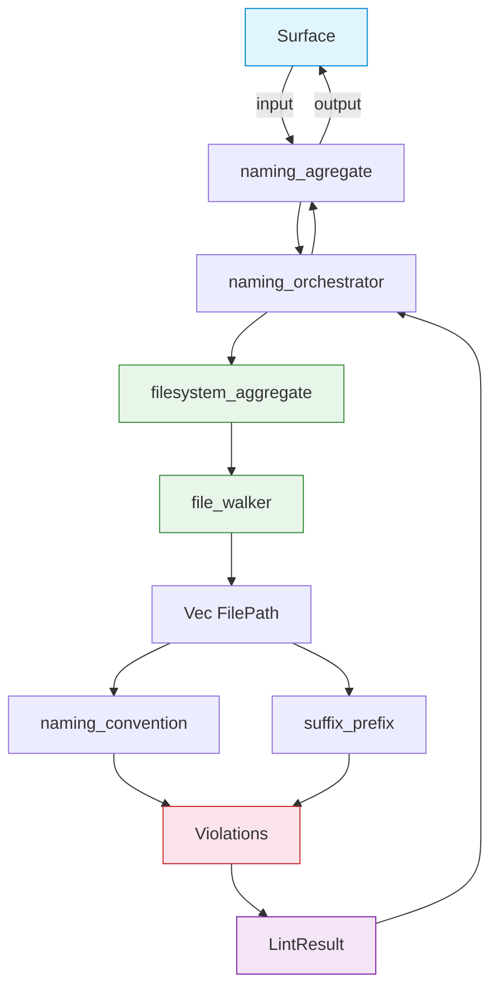

# FRD — naming-rules

## System Overview

The naming-rules crate enforces strict naming conventions across the codebase to ensure consistency, readability, and adherence to the 7-layer architecture. It validates that files and identifiers conform to structural and semantic naming patterns, preventing naming chaos and ensuring every file can be correctly assigned to an architectural layer.

### Architecture & Data Flow

## Functional Requirements

### FR-001: Naming Convention  (AES101)

- **Description**: Every file stem must be snake_case with at least 3 underscore-separated words in `prefix_concept_suffix` pattern.
- **Input**: File path
- **Output**: AES101 diagnostic if invalid, or AES000 (unknown prefix) if no layer can be detected
- **Business Rules**:
  - Must be snake_case (lowercase ASCII + underscores)
  - Must follow `prefix_concept_suffix` pattern (minimum N words, configurable, default 3)
  - Word count is read from `config.naming.word_count.value`; falls back to 3 if non-positive
  - A dynamic regex `^[a-z0-9.]+(_[a-z0-9.]+){N-1,}$` is compiled once and cached per word count
  - If the file has no recognized layer prefix, AES000 is emitted with the unknown prefix and a list of allowed prefixes
  - Exceptions: barrel files (`mod.rs`, `__init__.py`, `index.ts`, `index.js`) and any file listed in the layer definition's exceptions are skipped
- **Edge Cases**:
  - Files with uppercase letters, hyphens, or dots instead of underscores — caught by regex
  - Abbreviations like `db` or `http` — allowed as long as they are lowercase and separated by underscores
  - Files in unknown directories (no detectable layer) — fall back to AES000 unknown prefix check
- **Error Handling**: Emit AES101 with the invalid stem, expected pattern, and minimum word count; emit AES000 with the unrecognized prefix and list of valid prefixes

### FR-002: Suffix/Prefix  (AES102)

- **Description**: File suffix must align with the architectural layer it belongs to; forbidden suffixes from other layers are rejected.
- **Input**: File path
- **Output**: AES102 diagnostic if suffix is forbidden or mismatches the layer's allowed list
- **Business Rules**:
  - Each layer has an allowed suffix list and a forbidden suffix list defined in the layer definition's naming configuration
  - Suffix is extracted as the last underscore-separated token from the stem
  - If a suffix appears in the layer's `forbidden_suffix` list, it is immediately rejected (AES102 with `SuffixForbidden`)
  - If the layer uses `suffix_policy = strict`, only suffixes in the `allowed_suffix` list are permitted (AES102 with `SuffixMismatch`)
  - Barrel files and entry points are skipped
  - Files in the layer's exception list are skipped
  - Layers detected via the layer detection utility for sub-layer routing
- **Edge Cases**:
  - Files with no suffix (suffix = None) — fails strict policy check
  - Multiple valid suffixes for a layer (e.g., taxonomy allows `_vo`, `_entity`, `_error`, `_event`, `_constant`) — all pass
  - Custom or unknown layers without a definition — skipped (no def means no suffix policy)
- **Error Handling**: Emit AES102 with the layer name, used suffix, and the full allowed/forbidden lists

## API Contract

| Function                                                 | Input                                             | Output                                 | Description                                                   |
| ---------------------------------------------------------- | --------------------------------------------------- | ---------------------------------------- | --------------------------------------------------------------- |
| The naming convention checker's file naming check method | config, layer map, files, root directory, results | Mutates results                        | Scan all files; emit AES101/AES000 for naming violations      |
| The suffix/prefix checker's domain suffix check method   | config, layer map, files, root directory, results | Mutates results                        | Scan all files; emit AES102 for forbidden/mismatched suffixes |
| The naming runner aggregate's audit method               | target file path                                  | Result with lint results or scan error | Walk directory, filter source files, run both checkers        |
| The naming convention checker's regex builder            | min words                                         | Optional compiled regex                | Build/cache regex for given min word count                    |
| The naming convention checker's config reader            | the architecture configuration                    | min words value                        | Extract min words with fallback to 3                          |

## Integration Points

- **Internal**:
  - The configuration system in the shared crate — reads architecture configuration YAML for layer definitions, naming rules, exceptions, ignored paths
  - The taxonomy definitions in the shared crate — layer map, layer definition, and layer name value objects for layer metadata
  - The layer detection utility in the shared crate — filename prefix detection and specialized layer resolution
  - The path value objects in the shared crate — barrel/entry-point detection
- **External**: None

## Non-functional Requirements (Detailed)

- Performance: Walk and check 1000 source files in < 1 second (regex compiled once, O(n) per file)
- Memory: O(1) per file for checker state; regex cache limited to 10 static slots (word counts 0–9)
- Accuracy: Zero false positives for files that match the naming pattern and have valid layer suffixes

## Test Scenarios / QA Checklist

| #  | Input Scenario                                                   | Expected Output                | Rule   |
| ---- | ------------------------------------------------------------------ | -------------------------------- | -------- |
| 1  | Valid snake_case file, 3+ words, recognized layer prefix         | No violation                   | AES101 |
| 2  | File with uppercase characters in stem                           | AES101 — invalid snake_case   | AES101 |
| 3  | File with only 2 words (below minimum)                           | AES101 — too few words        | AES101 |
| 4  | File with hyphens instead of underscores                         | AES101 — invalid separator    | AES101 |
| 5  | Barrel file (mod.rs,__init__.py, index.ts)                       | No violation — exception      | excl   |
| 6  | File with valid prefix but suffix not in layer allow-list        | AES102 — suffix mismatch      | AES102 |
| 7  | File with valid prefix and allowed suffix for that layer         | No violation                   | AES102 |
| 8  | File with forbidden suffix for its layer (e.g. _helper on agent) | AES102 — forbidden suffix     | AES102 |
| 9  | File with unrecognized prefix (not in layer definition)          | AES000 — unknown prefix       | AES102 |
| 10 | Valid file but min_words config set higher than word count       | AES101 — below configured min | AES101 |
| 11 | File with root layer and allowed root suffix                     | No violation                   | AES102 |
| 12 | File in exception list for its layer                             | No violation — exception      | excl   |

## Assumptions & Constraints

- Layer hierarchy and naming policies are defined in the architecture configuration YAML
- File naming follows AES conventions (prefix_layer_concept_suffix pattern)
- Exceptions are configurable per layer in the layer definition's exceptions
- Ignored paths (node_modules, .git, target) are excluded from scanning
- The crate operates on a pre-filtered list of source files (no binary or non-lintable files)

## Glossary

- **AES**: Agentic Engineering System — the 7-layer architecture framework
- **Layer**: Architectural boundary (taxonomy, contract, utility, capabilities, agent, surface, root)
- **Suffix**: File name ending indicating role (`_vo`, `_protocol`, `_orchestrator`, `_checker`, etc.)
- **Prefix**: First underscore-separated word in the filename identifying the architectural layer
- **Stem**: Filename without extension (e.g., `capabilities_user_checker`)
- **Strict suffix policy**: Layer requires suffix to be in an explicit allow-list
- **Forbidden suffix**: Suffix explicitly banned for a layer (belongs to another layer's domain)

## Reference

- PRD: [PRD.md](../../PRD.md)
