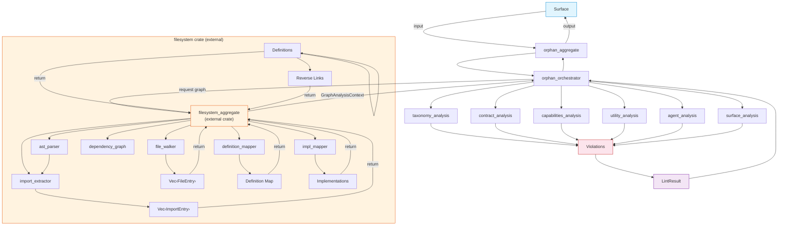

# FRD — orphan-detector (v1.12.1)

---

## System Overview

The orphan-detector crate identifies dead, unused, or unreachable code components across the 7-layer AES architecture. It receives a pre-built import reachability graph, definition maps, and implementation maps from the external filesystem crate, then performs layer-specific orphan analysis starting from valid entry points (containers, binary entries, main files).

All file system operations are handled by the external `filesystem` crate. The orphan-detector crate receives a complete GraphAnalysisContext from the filesystem crate and performs analysis only. It does not perform file I/O, AST parsing, or graph construction directly.

### Architecture & Data Flow



---

## Functional Requirements

### FR-001: Graph Context Reception and Validation

- **Description**: Receive the pre-built `GraphAnalysisContext` from the external filesystem crate and validate its completeness before dispatching to analyzers.
- **Input**: `GraphAnalysisContext` from filesystem crate containing:

  - All workspace source files (path + content + language + parse metadata + `parse_ok` flag).
  - All extracted import edges.
  - Forward import graph (file → file edges).
  - Reverse import map (file → list of importers).
  - Trait/class/struct/interface names mapped to their defining file.
  - Trait/interface names mapped to their implementor files.
- **Output**: Validated `GraphAnalysisContext` ready for analysis, plus list of `PARSE_WARN` diagnostics for files with `parse_ok = false`.
- **Business Rules**:

  - Validate that all required components are present (graph, maps, file list).
  - Files with `parse_ok = false` are retained in the file list but flagged with `PARSE_WARN` warning diagnostic:
    - Code: `PARSE_WARN` (not an AES code).
    - Severity: `WARNING`.
    - Message: `"File skipped: parse failure — {error_detail}"`.
  - Files with `parse_ok = false` are treated as **orphan candidates** (fail-strict: cannot verify reachability without parse data).
  - All paths in the graph are workspace-root-relative (normalized by filesystem crate).
  - Barrel files are identified and tagged for downstream skipping (see FR-010).
- **Edge Cases**:

  - Empty workspace (zero files) → empty context, no violations.
  - Filesystem crate returns error → propagate as `ScanError`, no analysis performed.
  - Files with `parse_ok = false` → `PARSE_WARN` emitted, file flagged as orphan candidate.
- **Error Handling**: Missing or incomplete graph components produce a `ScanError` with descriptive message. Individual file parse failures produce `PARSE_WARN` and orphan candidacy.

---

### FR-002: Entry Point Discovery

- **Description**: Identify valid entry points that anchor the reachability graph.
- **Input**: `Vec<FileEntry>` from `GraphAnalysisContext`, optional configured entry point patterns from architecture configuration.
- **Output**: Set of entry point file paths.
- **Business Rules**:

  - Default entry point patterns

    - `*_container.*`, `*_entry.*`
    - Files starting with `root_`
  - Merges configured additional entry point patterns from architecture configuration.
  - Pattern matching uses **segment matching**: exact match, stem match, prefix match, suffix match, extension match — never substring `contains()` to prevent false positives (e.g., `germanic_utils` must not match `main`).
  - Deduplicates and sorts the final list.
- **Edge Cases**:

  - Workspace with zero entry points → all non-barrel files flagged as orphans.
  - Workspace with entry points in non-standard locations → requires config override.
- **Error Handling**: Missing or inaccessible entry point files (not in `Vec<FileEntry>`) are excluded from the set.

---

### FR-003: Reachability Tracing

- **Description**: Perform BFS from all entry points through the forward import graph to determine which files are transitively reachable ("alive").
- **Input**: Entry point set and the forward import graph from the analysis context.
- **Output**: `Vec<String>` of all reachable file paths (alive set).
- **Business Rules**:

  - Uses breadth-first search with a visited tracker to avoid revisiting nodes.
  - A file is "alive" if it is transitively reachable from any entry point via import edges.
  - The alive set is used by capabilities, agent, and surface orphan analyzers.
  - Files with `parse_ok = false` are NOT added to the alive set (cannot verify edges).
- **Edge Cases**:

  - Isolated files with no imports from any entry point → not in alive set → flagged by analyzers.
  - Entry points that import nothing → valid (they are roots, alive by definition).
  - Cycles in the graph → handled by visited set, no infinite loops.
- **Error Handling**: Cycles handled by visited set. Missing graph nodes (file in file list but not in graph) → treated as unreachable.

---

### FR-004: Taxonomy Orphan Detection (AES501)

- **Description**: Check that taxonomy layer files (`taxonomy_*`) are imported by at least one file from any other layer.
- **Input**: File path, reverse link index from the analysis context.
- **Output**: Orphan indicator result with `is_orphan` flag, reason, and severity.
- **Business Rules**:

  - A taxonomy file is orphan if no contract, capabilities, agent, utility, or surface file imports it (via `ReverseLinkIndex`).
  - Internal taxonomy-to-taxonomy imports do NOT count — at least one non-taxonomy importer is required.
  - Barrel files (`mod.rs`, `__init__.py`, `index.ts`) do not count as importers.
  - Files with `parse_ok = false` → flagged as orphan (fail-strict) + `PARSE_WARN`.
- **Edge Cases**:

  - Taxonomy files imported only by other taxonomy files → flagged (no consumer outside taxonomy).
  - Taxonomy VO imported by a contract protocol → not orphan.
- **Error Handling**: Files with no detectable inbound links in `ReverseLinkIndex` → orphan candidates.

---

### FR-005: Contract Orphan Detection (AES502)

- **Description**: Check that contract files have at least one implementation or consumer, using the `DefinitionMap` and `ImplMap` from the filesystem crate.
- **Input**: File path, definition map, implementation map, reverse link index from the analysis context.
- **Output**: Orphan indicator result with `is_orphan` flag, reason, and severity.
- **Business Rules**:

  - **Protocol contracts** (`_protocol` files):
    - Must be implemented by at least one capabilities file (checked via `ImplMap`).
    - Must be called/referenced by at least one agent, container, capabilities, or surface file (checked via `ReverseLinkIndex`).
    - Both conditions must be satisfied. Implementation without callers → orphan. Callers without implementation → orphan.
  - **Aggregate contracts** (`_aggregate` files):
    - Must be implemented by at least one agent file (checked via `ImplMap`).
    - Must be called/referenced by at least one surface or container file (checked via `ReverseLinkIndex`).
  - **Barrel re-export check**: If any trait/interface name from the contract file appears in a barrel file's re-exports, the contract is considered used as public API and is NOT flagged.
  - Whole-word matching is used for all identifier checks.
  - Files with `parse_ok = false` → flagged as orphan (fail-strict) + `PARSE_WARN`.
- **Edge Cases**:

  - Protocol with implementation but zero callers → orphan.
  - Protocol with callers but no implementation → orphan.
  - Aggregate re-exported in barrel → not orphan.
  - Contract file with no traits/interfaces (e.g., only type aliases) → not orphan (nothing to check).
- **Error Handling**: Files with `parse_ok = false` → orphan + `PARSE_WARN`. Files with empty `DefinitionMap` entries → not flagged (no traits to check).

---

### FR-006: Capabilities Orphan Detection (AES503)

- **Description**: Check that capability files are wired in a root container or reachable from entry points.
- **Input**: File path, alive set (from FR-003), definition map from the analysis context.
- **Output**: Orphan indicator result with `is_orphan` flag, reason, and severity.
- **Business Rules**:

  - Capabilities use dependency injection (`Arc<T>` in Rust, DI containers in Python/TS).
  - A capability is orphan if:
    1. Its struct/class names (from `DefinitionMap`) do not appear in any container file, AND
    2. The file is not in the alive set (not transitively reachable from entry points).
  - Container files are identified by suffix: `*_container.*`, `*_entry.*`.
  - Additionally includes the file stem and its PascalCase variant as identifiers to search.
  - Files with `parse_ok = false` → flagged as orphan (fail-strict) + `PARSE_WARN`.
- **Edge Cases**:

  - Capability imported only by other capabilities in a chain → alive if any link in the chain reaches a container (BFS handles this).
  - Capability with no struct/class names in `DefinitionMap` → treated as potential orphan.
- **Error Handling**: Files with `parse_ok = false` → orphan + `PARSE_WARN`.

---

### FR-007: Utility Orphan Detection (AES504)

- **Description**: Check that utility files are imported by at least one consumer layer (capabilities, agent, surface, or root).
- **Input**: File path, reverse link index from the analysis context.
- **Output**: Orphan indicator result with `is_orphan` flag, reason, and severity.
- **Business Rules**:

  - Check `ReverseLinkIndex` for inbound links. Classify each importer by layer prefix.
  - Valid consumer layers: `capabilities`, `agent`, `surface`, `root`.
  - If any consumer-layer importer exists → not orphan.
  - Utility-only import chains are flagged as dead code (utility importing utility does not count).
  - Files with `parse_ok = false` → flagged as orphan (fail-strict) + `PARSE_WARN`.
- **Edge Cases**:

  - Utility imported by another utility that is itself orphaned → the chain is dead → orphan.
  - Utility imported by a capabilities file → not orphan.
  - Utility with no inbound links → orphan.
- **Error Handling**: Files with `parse_ok = false` → orphan + `PARSE_WARN`. If `ReverseLinkIndex` has no entry for the file → orphan.

---

### FR-008: Agent Orphan Detection (AES505)

- **Description**: Check that agent orchestrator files are called by surface layer files or binary entry points, using the `ImplMap` and `DefinitionMap` from the filesystem crate.
- **Input**: File path, implementation map, definition map, reverse link index from the analysis context.
- **Output**: Orphan indicator result with `is_orphan` flag, reason, and severity.
- **Business Rules**:

  - Extract aggregate trait/interface names implemented by the agent file (from `ImplMap` — traits containing "Aggregate" in the name).
  - Check if any surface, entry, main, index, or container file references these aggregate names (via `ReverseLinkIndex` and `DefinitionMap`).
  - Candidate reference files are pre-filtered by filename pattern: `surface_*`, `*_container.*`, `*_entry.*`, `main.*`, `lib.*`, `index.*`, `__main__.*`.
  - Agent is orphan only if **ALL** aggregates are uncalled (not ANY).
  - Agent file with no aggregate implementation → not orphan (empty aggregate list → skip check).
  - Severity: HIGH — orphaned agent means entire feature behavior is unreachable.
  - Files with `parse_ok = false` → flagged as orphan (fail-strict) + `PARSE_WARN`.
- **Edge Cases**:

  - Agent with 2 aggregates, 1 called and 1 uncalled → not orphan (not ALL uncalled).
  - Agent with 2 aggregates, both uncalled → orphan.
  - Agent with no aggregate impl → not orphan (skip).
- **Error Handling**: Files with `parse_ok = false` → orphan + `PARSE_WARN`. Files with empty `ImplMap` entries → not flagged (no aggregates to check).

---

### FR-009: Surface Orphan Detection (AES506)

- **Description**: Check that surface files are reachable based on their group classification (Smart, Utility, Passive).
- **Input**: File path, alive set (from FR-003), reverse link index from the analysis context, architecture configuration.
- **Output**: Orphan indicator result with `is_orphan` flag, reason, and severity.
- **Business Rules**:

  - **Surface classification by filename suffix** (configurable via YAML):

    - **Smart**: `_command`, `_controller`, `_page`, `_entry`, `_router` — must be imported by entry point or container. Severity: HIGH.
    - **Utility**: `_hook`, `_store`, `_action`, `_screen` — must be imported by a Smart surface. Severity: MEDIUM.
    - **Passive**: `_component`, `_view`, `_layout`, and all other recognized surface suffixes — must be imported by Smart OR Utility surface. Severity: LOW.
  - Dependency chain: `Entry → Smart → Utility → Passive`.
  - Detection uses BFS reachability from the forward import graph and `ReverseLinkIndex`.
  - Files with **unclassifiable suffixes** (not in Smart, Utility, or Passive lists) → **skipped** (no orphan check performed).
  - Files with `parse_ok = false` → flagged as orphan (fail-strict) + `PARSE_WARN`.
- **Edge Cases**:

  - Passive surface imported only by another passive surface → orphan (must be imported by Smart or Utility).
  - Smart surface not imported by any entry/container → orphan (HIGH).
  - Utility surface not imported by any Smart surface → orphan (MEDIUM).
  - Surface file with unclassifiable suffix → skipped entirely.
- **Error Handling**: Files with `parse_ok = false` → orphan + `PARSE_WARN`. Unclassifiable suffix → skip (no violation, no error).

---

### FR-010: Barrel File Exception Handling

- **Description**: Skip known barrel/package marker files from orphan detection.
- **Input**: File path.
- **Output**: Skip signal (no violation produced).
- **Business Rules**:

  - `__init__.py` — Python package marker.
  - `mod.rs` — Rust module re-export.
  - `lib.rs` — Rust library root.
  - `index.ts` / `index.js` / `index.tsx` / `index.jsx` — TypeScript/JavaScript barrel files.
  - These files are package markers or re-export files, not logic.
  - Check is performed in the orchestrator before dispatching to any analyzer.
- **Edge Cases**: A file named `mod.rs` inside a deeply nested module is still skipped.
- **Error Handling**: N/A — simple filename check.

## API Contract


| Function                           | Input                                                             | Output                     | Description                                                                                       |
| ------------------------------------ | ------------------------------------------------------------------- | ---------------------------- | --------------------------------------------------------------------------------------------------- |
| Full orphan scan                   | Target path                                                       | Lint results               | Request graph from filesystem crate, discover entry points, trace reachability, run all analyzers |
| Orphan scan with context           | Pre-built analysis context                                        | Lint results               | Orphan scan with pre-built context (avoids filesystem crate call)                                 |
| Identify entry points              | File list from analysis context, configured patterns              | Set of entry point paths   | Discover all valid entry points                                                                   |
| Trace reachability                 | Entry point set, import graph                                     | Alive file set             | BFS from entry points through import graph                                                        |
| Check taxonomy orphan              | File path, reverse link index                                     | Orphan indicator result    | AES501 — taxonomy file orphan check                                                              |
| Check contract orphan              | File path, definition map, impl map, reverse link index           | Orphan indicator result    | AES502 — contract file orphan check                                                              |
| Check capabilities orphan          | File path, alive set, definition map                              | Orphan indicator result    | AES503 — capabilities file orphan check                                                          |
| Check utility orphan               | File path, reverse link index                                     | Orphan indicator result    | AES504 — utility file orphan check                                                               |
| Check agent orphan                 | File path, implementation map, definition map, reverse link index | Orphan indicator result    | AES505 — agent file orphan check                                                                 |
| Check surface orphan               | File path, alive set, reverse link index, config                  | Orphan indicator result    | AES506 — surface file orphan check                                                               |
| Create default DI container        | —                                                                | Orphan detection container | Default dependency injection container                                                            |
| Create DI container with config    | Architecture configuration                                        | Orphan detection container | DI container with custom config                                                                   |
| Create DI from config orchestrator | Config orchestrator reference, root directory                     | Orphan detection container | Canonical DI from config orchestrator                                                             |

---

## Integration Points

- **Internal** (orphan-detector crate):

  - The orphan detection aggregate contract — aggregate trait defining the public API surface.
  - The orphan detection protocol contracts — 6 layer-specific orphan indicator protocols.
  - The orphan detection filename utility — filename parsing (stem, suffix, basename).
  - The orphan detection path utility — path resolution and segment-based ignore checking.
  - The common layer detection utility — layer detection from filename prefix.
  - The config system configuration value objects — architecture config for exceptions, rules, and orphan toggles.
  - The lint result value objects — lint result, severity, and location types.
  - The config system orchestrator aggregate — config loading from orchestrator.
  - The graph analysis context value objects — `GraphAnalysisContext`, `OrphanIndicatorResult`, `ReachabilityResult`.
- **External**:

  - **`filesystem` crate** — provides `filesystem_aggregate` which handles:
    - File walking and directory traversal (`file_walker`).
    - Full AST parsing for all languages (`ast_parser` — Rust via `syn`, Python/TS via tree-sitter).
    - Import extraction from AST (`import_extractor`).
    - Dependency graph construction (`dependency_graph`).
    - Trait/class/struct definition mapping (`definition_mapper`).
    - Implementation relationship mapping (`impl_mapper`).
    - Reverse link index construction.
    - Returns the pre-built analysis context to the caller.
    - Files that cannot be read are excluded. Files that cannot be parsed are included with `parse_ok = false`.
  - No network calls. No filesystem writes. Pure static analysis.

---

## Non-functional Requirements

- **Performance**:

  - 1,000 files < 500ms; 5,000 files < 2s; 10,000 files < 5s.
  - Graph construction and parsing performed by filesystem crate (not counted in orphan-detector performance).
  - Orphan analysis is O(V + E) for BFS reachability + O(n) per analyzer for map lookups.
  - Contract/agent analyzers use `DefinitionMap` and `ImplMap` lookups (O(1) per trait) instead of re-parsing files.
- **Memory**:

  - `GraphAnalysisContext` holds all graph data in memory. For 10,000 files with average 10 imports each, peak memory < 50MB.
  - Analyzers do not cache additional data beyond what `GraphAnalysisContext` provides.
- **Accuracy**:

  - **All languages WAJIB full AST.** No regex-based or line-based parsing is acceptable as a final implementation.
  - Zero false positives on transitively reachable code. A file is valid if it is transitively reachable from an entry point.
  - AST parsing eliminates false positives from: matches inside comments, matches inside string literals, multi-line statement fragmentation.
  - Known limitation: macro-generated code (see FR-011). Macro-generated impls are invisible → potential false orphan flags.
  - Parse failure → orphan (fail-strict). This eliminates false negatives at the cost of potential false positives for files with syntax errors.
- **Concurrency**: Thread-safe via `Arc<dyn Trait>` shared ownership. File-level analysis is parallelized via `rayon` (`par_iter`). Graph analysis is read-only after construction.
- **Configurability**:

  - **Hardcoded conventions (permanent, by design)**:
    - Layer detection from filename prefix (`taxonomy_*`, `contract_*`, `utility_*`, `capabilities_*`, `agent_*`, `surface_*`, `root_*`).
    - Workspace directory structure (`crates/`, `packages/`, `modules/`).
    - Barrel file names (`mod.rs`, `lib.rs`, `__init__.py`, `index.ts`).
    - Default entry point patterns (`*_container.*`, `*_entry.*`, `main.*`, `lib.*`, `index.*`).
  - **Configurable (via YAML)**:
    - Additional entry point patterns.
    - Per-layer orphan check toggle (`check_orphan`).
    - Per-rule enable/disable (AES501–AES506).
    - Per-layer exceptions.
    - Ignored paths.
    - Surface classification suffixes (Smart/Utility/Passive).

---

## Test Scenarios / QA Checklist

### Core Detection


| # | Scenario                                            | Expected                                   | Rule   |
| --- | ----------------------------------------------------- | -------------------------------------------- | -------- |
| 1 | Workspace with 100 files, 5 orphans across 3 layers | All 5 detected, 0 false positives          | all    |
| 2 | Circular imports between two capabilities           | Both reachable, neither flagged            | pass   |
| 3 | Workspace with zero entry points                    | All non-barrel files flagged as orphans    | all    |
| 4 | Cross-crate imports (crate A imports from crate B)  | Graph resolves correctly                   | pass   |
| 5 | Configuration disabled                              | Full orphan scan returns empty immediately | config |
| 6 | File with`parse_ok = false`                         | Flagged as orphan + PARSE_WARN emitted     | all    |

### Barrel Files


| # | Scenario                               | Expected             | Rule |
| --- | ---------------------------------------- | ---------------------- | ------ |
| 1 | Python`__init__.py` package marker     | Skipped, not flagged | excl |
| 2 | TypeScript barrel`index.ts` re-exports | Skipped, not flagged | excl |
| 3 | Rust`mod.rs` re-exports                | Skipped, not flagged | excl |
| 4 | Rust`lib.rs` library root              | Skipped, not flagged | excl |

### AES501 — Taxonomy Orphan


| # | Scenario                                            | Expected                          | Rule   |
| --- | ----------------------------------------------------- | ----------------------------------- | -------- |
| 1 | Taxonomy file imported by a contract file           | Not orphan                        | pass   |
| 2 | Taxonomy file imported only by other taxonomy files | Orphan (no non-taxonomy consumer) | AES501 |
| 3 | Taxonomy file with no inbound links                 | Orphan                            | AES501 |
| 4 | Taxonomy file imported by capabilities file         | Not orphan                        | pass   |

### AES502 — Contract Orphan


| # | Scenario                                          | Expected                      | Rule   |
| --- | --------------------------------------------------- | ------------------------------- | -------- |
| 1 | Protocol with implementation AND callers          | Not orphan                    | pass   |
| 2 | Protocol with implementation but zero callers     | Orphan                        | AES502 |
| 3 | Protocol with callers but no implementation       | Orphan                        | AES502 |
| 4 | Aggregate re-exported in barrel file              | Not orphan (public API)       | pass   |
| 5 | Aggregate implemented by agent, called by surface | Not orphan                    | pass   |
| 6 | Contract file with no traits (only type aliases)  | Not orphan (nothing to check) | pass   |

### AES503 — Capabilities Orphan


| # | Scenario                                                           | Expected                 | Rule   |
| --- | -------------------------------------------------------------------- | -------------------------- | -------- |
| 1 | Capability struct referenced in container file                     | Not orphan               | pass   |
| 2 | Capability file transitively reachable from entry point            | Not orphan               | pass   |
| 3 | Capability file not in alive set, not in any container             | Orphan                   | AES503 |
| 4 | Capability imported by other capabilities, chain reaches container | Not orphan (chain alive) | pass   |

### AES504 — Utility Orphan


| # | Scenario                                 | Expected                           | Rule   |
| --- | ------------------------------------------ | ------------------------------------ | -------- |
| 1 | Utility imported by a capabilities file  | Not orphan                         | pass   |
| 2 | Utility imported only by other utilities | Orphan (utility chain = dead code) | AES504 |
| 3 | Utility with no inbound links            | Orphan                             | AES504 |
| 4 | Utility imported by agent file           | Not orphan                         | pass   |

### AES505 — Agent Orphan


| # | Scenario                                                  | Expected                      | Rule   |
| --- | ----------------------------------------------------------- | ------------------------------- | -------- |
| 1 | Agent aggregate called by surface file                    | Not orphan                    | pass   |
| 2 | Agent aggregate not called by any surface/entry/container | Orphan (HIGH)                 | AES505 |
| 3 | Agent with no aggregate implementation                    | Not orphan (skip check)       | pass   |
| 4 | Agent with 2 aggregates, 1 called, 1 uncalled             | Not orphan (not ALL uncalled) | pass   |
| 5 | Agent with 2 aggregates, both uncalled                    | Orphan (HIGH)                 | AES505 |

### AES506 — Surface Orphan


| # | Scenario                                                          | Expected                                | Rule   |
| --- | ------------------------------------------------------------------- | ----------------------------------------- | -------- |
| 1 | Smart surface (`_command`) imported by entry point                | Not orphan                              | pass   |
| 2 | Smart surface not imported by any entry/container                 | Orphan (HIGH)                           | AES506 |
| 3 | Utility surface (`_hook`) imported by Smart surface               | Not orphan                              | pass   |
| 4 | Utility surface not imported by any Smart surface                 | Orphan (MEDIUM)                         | AES506 |
| 5 | Passive surface (`_component`) imported by Smart surface          | Not orphan                              | pass   |
| 6 | Passive surface imported only by another Passive surface          | Orphan (LOW)                            | AES506 |
| 7 | Dependency chain: Entry → Smart → Utility → Passive, all alive | No violations                           | pass   |
| 8 | Remove Smart import → Utility + Passive flagged                  | Utility (MEDIUM) + Passive (LOW) orphan | AES506 |
| 9 | Surface file with unclassifiable suffix                           | Skipped (no check)                      | skip   |

### Configuration


| # | Scenario                                | Expected                                     | Rule   |
| --- | ----------------------------------------- | ---------------------------------------------- | -------- |
| 1 | Config`check_orphan: false` for a layer | No violations for that layer                 | config |
| 2 | Config with exceptions list             | Excepted files produce no violations         | config |
| 3 | Config with`ignored_paths: ["tests"]`   | `tests/` segment files produce no violations | config |
| 4 | Config with AES501 disabled             | No taxonomy orphan violations                | config |
| 5 | Config with custom entry point patterns | Additional entry points recognized           | config |

### Performance


| # | Scenario                                      | Expected                                   | Rule |
| --- | ----------------------------------------------- | -------------------------------------------- | ------ |
| 1 | 10,000 file workspace                         | Completes in under 5 seconds               | perf |
| 2 | Contract analyzer with 50 traits × 500 files | Completes in under 2 seconds (map lookups) | perf |

---

## Assumptions & Constraints

- Workspace follows AES convention with `crates/`, `packages/`, `modules/` directories.
- Naming convention validation is handled by the naming-rules crate; orphan-detector assumes filenames are correctly named.
- Entry points are identified by filename patterns (configurable), not by content analysis.
- All parsing and graph construction is performed by the external filesystem crate using full AST (Rust via `syn`, Python/TS via tree-sitter). No regex or line-based parsing in the final implementation.
- No network calls are required; all analysis is local filesystem.
- Configuration is loaded once and reused across all checks in a scan.
- Macro-generated code (Rust `macro_rules!`, proc macros) is not expanded — trait implementations inside macros are invisible to the detector (see FR-011).
- Parse failure → orphan (fail-strict). Files with `parse_ok = false` are flagged as orphans because reachability cannot be verified.
- Surface files with unclassifiable suffixes are skipped (no orphan check performed).
- The crate receives a complete `GraphAnalysisContext` from the external filesystem crate. No file I/O, AST parsing, or graph construction is performed internally.

---

## Glossary


| Term                     | Definition                                                                                                                                      |
| -------------------------- | ------------------------------------------------------------------------------------------------------------------------------------------------- |
| **AES**                  | Agentic Engineering System — the 7-layer coding convention                                                                                     |
| **Orphan**               | A source file not transitively reachable from any entry point, or failing layer-specific consumer requirements                                  |
| **Entry point**          | A file that anchors the reachability graph (main, lib, container, entry, root)                                                                  |
| **Barrel file**          | A package marker or re-export file (`__init__.py`, `mod.rs`, `lib.rs`, `index.ts`)                                                              |
| **Alive file**           | A file reachable via BFS from any entry point through the import graph                                                                          |
| **DI**                   | Dependency Injection — wiring implementations to trait/interface contracts                                                                     |
| **Inbound link**         | A file that imports the target file (reverse import edge)                                                                                       |
| **AST**                  | Abstract Syntax Tree — structured representation of source code produced by a parser                                                           |
| **GraphAnalysisContext** | Pre-built analysis context from filesystem crate containing file list, import graph, reverse link index, definition map, and implementation map |
| **DefinitionMap**        | Map of trait/class/struct/interface names to their defining file                                                                                |
| **ImplMap**              | Map of trait/interface names to their implementor files                                                                                         |
| **ReverseLinkIndex**     | Map of file path to list of files that import it                                                                                                |
| **`parse_ok`**           | Boolean flag on file entries indicating whether parsing succeeded                                                                               |
| **`PARSE_WARN`**         | Warning diagnostic (non-AES code) emitted when a file fails to parse                                                                            |
| **Re-export**            | A`pub use` (Rust) or `export { X } from` (TS) that re-exports a symbol from another module                                                      |
| **Glob import**          | `use foo::*` (Rust) or `export * from` (TS) — imports all symbols from a module                                                                |
| **Smart surface**        | Surface with`_command`, `_controller`, `_page`, `_entry`, `_router` suffix — may contain orchestration                                         |
| **Utility surface**      | Surface with`_hook`, `_store`, `_action`, `_screen` suffix — supports smart surfaces                                                           |
| **Passive surface**      | Surface with`_component`, `_view`, `_layout`, or other recognized suffix — presentation-only                                                   |
| **Filesystem crate**     | External crate that handles file walking, AST parsing, graph construction, and mapping. Returns`GraphAnalysisContext` to orphan-detector.       |
| **Segment matching**     | Path matching by splitting on`/` and comparing individual segments (not substring containment)                                                  |

---

## Appendix A: YAML Configuration Schema

### Top-Level Structure

```yaml
architecture:
  enabled: true
  rules:
    AES501: { ... }
    AES502: { ... }
    AES503: { ... }
    AES504: { ... }
    AES505: { ... }
    AES506: { ... }
  orphan:
    entry_points:
      - "*_container.*"
      - "*_entry.*"
      - "main.rs"
      - "lib.rs"
      - "main.py"
      - "__main__.py"
      - "main.ts"
      - "main.js"
      - "index.ts"
      - "index.js"
```

### Per-Rule Configuration

```yaml
AES501:
  enabled: true
  exceptions: []

AES502:
  enabled: true
  exceptions: []

AES503:
  enabled: true
  exceptions: []

AES504:
  enabled: true
  exceptions: []

AES505:
  enabled: true
  exceptions: []

AES506:
  enabled: true
  exceptions: []
    # Files with suffix not in any list → skipped
```

---

## Reference

- PRD: [PRD.md](../../PRD.md)
- Architecture: [ARCHITECTURE.md](../../ARCHITECTURE.md)
- **Filesystem crate** (external): `
