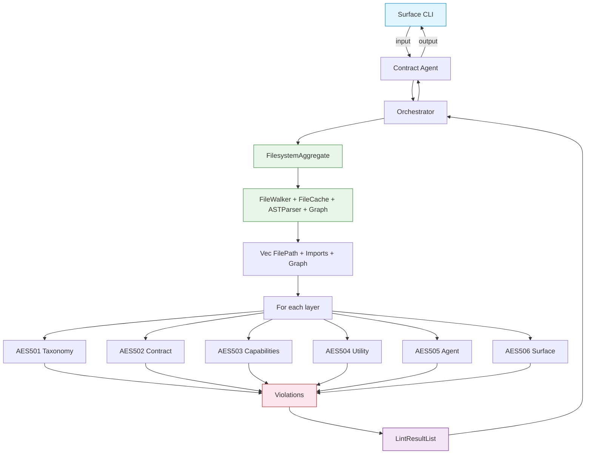

# FRD — orphan-detector (v1.12.0)

## System Overview

The orphan-detector crate identifies dead, unused, or unreachable code components across the 7-layer AES architecture. It builds an import reachability graph starting from valid entry points (containers, binary entries, main files), then flags any source file that has been orphaned.

### Architecture & Data Flow

### FR-001: AST-Based Import Graph Construction

- **Description**: Build a bidirectional import graph from all workspace source files using AST parsing for Rust and structured parsing for Python/TypeScript, resolving cross-crate and cross-language imports.
- **Input**: List of source file paths (`Vec<String>`) and workspace root directory.
- **Output**: A graph analysis context containing the forward import graph, reverse link index, trait/class definition map, and implementation relationship map.
- **Business Rules**:
  - Scan all `crates/`, `packages/`, `modules/` subdirectories recursively for source files.
  - **Rust (AST via `syn`)**:
    - Extract `ItemUse` nodes → import edges (handles `crate::`, `super::`, `self::`, grouped imports `use foo::{A, B}`, glob imports `use foo::*`, and `pub use` re-exports).
    - Extract `ItemMod` nodes → module declaration edges (handles `#[path = "..."]` attributes and plain `mod foo;` declarations).
    - Extract `ItemImpl` nodes → trait implementation relationships.
    - Extract `ItemStruct` / `ItemTrait` nodes → definition map entries.
  - **Python (structured parsing)**:
    - Parse `from X import Y` and `import X` statements with comment/string awareness.
    - Resolve relative imports (`from . import X`, `from ..module import Y`) by walking parent directories.
    - Extract `class Foo(Bar):` → inheritance map entries.
  - **TypeScript/JavaScript (structured parsing)**:
    - Parse `import { X } from './path'`, `import X from './path'`, `import * as X from './path'`, and side-effect imports.
    - Parse `export { X } from './path'` and `export * from './path'` as re-export edges.
    - Resolve extensionless imports by trying `.ts`, `.js`, `.tsx`, `.jsx`, and `/index.*` candidates.
    - Extract `class Foo implements Bar` → inheritance map entries.
  - Expand file list to include all workspace source files for cross-crate import resolution.
  - Build a crate module index for hyphen-aware cross-crate resolution (e.g., `lint-arwaky` → `lint_arwaky`).
  - All paths in the graph are normalized to workspace-root-relative format.
- **Edge Cases**:
  - Files with circular imports form cycles in the graph but do not cause infinite loops (BFS with visited set).
  - Files outside supported extensions are silently skipped.
  - Rust files that fail `syn` parsing (syntax errors) produce an empty parse result — no edges contributed, but the file is still present in the graph as a node.
  - Multi-line import statements (e.g., `use foo::{\n  A,\n  B,\n}`) are handled natively by AST.
  - Macro-generated `impl` blocks are not visible to `syn` unless the file is pre-expanded (see FR-012).
- **Error Handling**: Unreadable files are skipped with no error. Invalid paths produce no entry in the graph. Parse failures produce an empty result (fail-safe: file becomes a graph node with no edges).

### FR-002: Entry Point Discovery

- **Description**: Identify valid entry points that anchor the reachability graph.
- **Input**: List of file paths and optional configured entry point patterns from the architecture configuration.
- **Output**: Set of entry point file paths.
- **Business Rules**:
  - Default entry point patterns: `*_container.*`, `*_entry.*`, `main.rs`, `lib.rs`, `main.py`, `__main__.py`, `main.ts`, `main.js`, `index.ts`, `index.js`.
  - Files starting with `root_` are also treated as entry points.
  - Merges configured additional entry point patterns from each layer definition in the architecture configuration.
  - Pattern matching uses exact match, stem match, prefix match (`_container`), suffix match (`.rs`), and extension match — never substring `contains()` to prevent false positives (e.g., `germanic_utils` must not match `main`).
  - Deduplicates and sorts the final list.
- **Edge Cases**: Workspace with zero entry points results in all files flagged as orphans. Workspace with entry points in non-standard locations requires config override.
- **Error Handling**: Missing or inaccessible entry point files are excluded from the set.

### FR-003: Reachability Tracing

- **Description**: Perform BFS from all entry points through the import graph to determine which files are transitively reachable ("alive").
- **Input**: Entry point set (`Vec<String>`) and the forward import graph.
- **Output**: `Vec<String>` of all reachable file paths.
- **Business Rules**:
  - Uses breadth-first search with a visited tracker to avoid revisiting nodes.
  - A file is "alive" if it is transitively reachable from any entry point.
  - The alive set is used by capabilities, agent, and surfaces orphan analyzers.
- **Edge Cases**: Isolated files with no imports from any entry point are flagged. Entry points that import nothing are valid (they are roots).
- **Error Handling**: Cycles in the graph are handled by the visited set — no infinite loops.

### FR-004: Taxonomy Orphan Detection (AES501)

- **Description**: Check that taxonomy layer files (`taxonomy_*`) are imported by at least one file from any other layer.
- **Input**: File path, root directory, reverse link map (AST-built).
- **Output**: An orphan indicator result with is_orphan flag, reason, and severity.
- **Business Rules**:
  - A taxonomy file is orphan if no contract, capabilities, agent, utility, or surface file imports it.
  - Internal taxonomy-to-taxonomy imports do not count — at least one non-taxonomy importer is required.
  - Barrel files (`mod.rs`, `__init__.py`, `index.ts`) do not count as importers.
  - The AST-built graph captures all `use crate::...` imports natively — no fallback scanning is needed.
- **Edge Cases**: Taxonomy files imported only by other taxonomy files are flagged (no consumer outside taxonomy). Files with suffix `_utility` or `_helper` are categorized as "utility" for message purposes but follow the same detection logic.
- **Error Handling**: Files with no detectable inbound links are treated as orphan candidates.

### FR-005: Contract Orphan Detection (AES502)

- **Description**: Check that contract files have at least one implementation or consumer, using AST-based trait extraction and implementation detection.
- **Input**: File path, root directory, definition map, inheritance map, all workspace files.
- **Output**: An orphan indicator result with is_orphan flag, reason, and severity.
- **Business Rules**:
  - **Trait extraction (AST)**:
    - Rust: Extract `ItemTrait` names via `syn` (replaces regex `(?:pub\s+)?trait\s+([A-Za-z0-9_]+)`).
    - Python: Extract class names from structured parsing.
    - TypeScript: Extract interface names from structured parsing.
  - **Implementation detection (AST)**:
    - Rust: Check `ItemImpl` nodes where `trait_` field matches the target trait name (handles multi-line impls, generic impls `impl<T> Trait for Type`, and qualified paths `impl foo::Trait for Bar`).
    - Python: Check `class_bases` from structured parsing.
    - TypeScript: Check `class_implements` from structured parsing.
  - **Protocol contracts** — Must be implemented by a capabilities file AND called by an agent, container, capabilities, or surface file.
  - **Aggregate contracts** — Must be implemented by an agent file AND called by a surface or container file.
  - **Barrel re-export check**: If any trait name appears in a barrel file (`mod.rs`, `__init__.py`, `index.ts`), the contract is considered used as public API and is not flagged.
  - Whole-word matching is used for all identifier checks (split on non-alphanumeric boundaries).
- **Edge Cases**: A protocol with an implementation but zero callers is still an orphan — the protocol must be both implemented AND called by the expected layers. Multi-line `impl` blocks are handled by AST natively.
- **Error Handling**: Files that fail AST parsing fall back to empty trait list — not flagged as orphan (fail-safe).

### FR-006: Capabilities Orphan Detection (AES503)

- **Description**: Check that capability files are wired in a root container or reachable from entry points.
- **Input**: File path, root directory, reachable file paths set.
- **Output**: An orphan indicator result with is_orphan flag, reason, and severity.
- **Business Rules**:
  - Capabilities use dependency injection (`Arc<T>` in Rust, DI containers in Python/TS).
  - A capability is orphan if its struct/trait names do not appear in any container file AND the file is not transitively reachable.
  - **Identifier extraction (AST)**:
    - Rust: Extract `ItemStruct` and `ItemTrait` names via `syn`.
    - Python: Extract class names from structured parsing.
    - TypeScript: Extract class names from structured parsing.
    - Additionally includes the file stem and its PascalCase variant.
  - Container files are identified by suffix: `*_container.rs`, `*_container.py`, `*_container.ts`, `*_container.js`, `*_entry.*`.
  - Capabilities should NOT directly import agent or other capability files (enforced by role-rules, not here).
- **Edge Cases**: A capability imported only by other capabilities in a chain is alive if any link in the chain reaches a container.
- **Error Handling**: Files with no struct/trait names detectable via AST are treated as potential orphans.

### FR-007: Utility Orphan Detection (AES504)

- **Description**: Check that utility files are imported by at least one consumer layer (agent, capability, surface, or root).
- **Input**: File path, root directory, all workspace files, reverse link map (AST-built).
- **Output**: An orphan indicator result with is_orphan flag, reason, and severity.
- **Business Rules**:
  - **Phase 1 (graph-based)**: Check AST-built inbound links. Classify each importer by layer prefix. If any consumer-layer importer exists → not orphan.
  - **Phase 2 (AST-based fallback)**: For consumer-layer files not captured in the graph, parse them via AST and check if any import segment matches the utility module name.
  - Utility-only import chains are flagged as dead code (utility importing utility does not count).
  - Valid consumer layers: `capabilities`, `agent`, `surface`, `root`.
- **Edge Cases**: Utility imported by another utility that is itself orphaned — the chain is dead. Utility files with suffix `_utility` or `_helper` in taxonomy layer are handled by taxonomy analyzer, not utility analyzer.
- **Error Handling**: Unparseable files in Phase 2 are skipped. If both phases find no consumer → orphan.

### FR-008: Agent Orphan Detection (AES505)

- **Description**: Check that agent orchestrator files are called by surface layer files or binary entry points, using AST-based aggregate trait extraction.
- **Input**: File path, root directory, all workspace files.
- **Output**: An orphan indicator result with is_orphan flag, reason, and severity.
- **Business Rules**:
  - **Aggregate extraction (AST)**:
    - Rust: Extract `ItemImpl` nodes where the trait name contains "Aggregate" (via `syn`). Handles `impl IOrphanAggregate for ArchOrphanAnalyzer`, generic impls, and qualified paths.
    - Python: Extract class base names containing "Aggregate" from structured parsing.
    - TypeScript: Extract implemented interface names containing "Aggregate" from structured parsing.
  - Check if any surface, entry, main, index, or container file references these aggregate names using whole-word matching.
  - Candidate files are pre-filtered by filename pattern (surface_*, *_container.*, *_entry.*, main.*, lib.*, index.*, __main__.*) to avoid scanning all workspace files.
  - Candidate file contents are cached to avoid N×M re-reads.
  - Severity: HIGH — orphaned agent means entire feature behavior is unreachable.
- **Edge Cases**: Agent file with no aggregate implementation returns not-orphan (empty aggregate list → skip check). Agent is orphan only if ALL aggregates are uncalled (not ANY).
- **Error Handling**: Files that fail AST parsing produce an empty aggregate list → not flagged (fail-safe).

### FR-009: Surface Orphan Detection (AES506)

- **Description**: Check that surface files are reachable based on their group classification (Smart, Utility, Passive).
- **Input**: File path, root directory, reachable file paths set, optional layer definition.
- **Output**: An orphan indicator result with is_orphan flag, reason, and severity.
- **Business Rules**:
  - **Smart** (`_command`, `_controller`, `_page`, `_router`): Must be imported by entry point or container. Severity: HIGH.
  - **Utility** (`_hook`, `_store`, `_action`, `_screen`): Must be imported by a Smart surface. Severity: MEDIUM.
  - **Passive** (`_component`, `_view`, `_layout`): Must be imported by Smart OR Utility surface. Severity: LOW.
  - Dependency chain: `Entry → Smart → Utility → Passive`.
  - Detection uses BFS reachability from the AST-built import graph.
- **Edge Cases**: A passive surface imported only by another passive surface is orphan. Smart surfaces bypass passive checks. Files with unclassifiable suffixes default to "unknown" category with MEDIUM severity.
- **Error Handling**: Files with unclassifiable suffixes default to Passive group.

### FR-010: Barrel File Exception Handling

- **Description**: Skip known barrel/package marker files from orphan detection.
- **Input**: File path.
- **Output**: Skip signal (no violation produced).
- **Business Rules**:
  - `__init__.py` — Python package marker.
  - `mod.rs` — Rust module re-export.
  - `index.ts` / `index.js` / `index.tsx` / `index.jsx` — TypeScript/JavaScript barrel files.
  - These files are package markers or re-export files, not logic.
  - Check is performed in the orchestrator before dispatching to any analyzer.
- **Edge Cases**: A file named `mod.rs` inside a deeply nested module is still skipped.
- **Error Handling**: N/A — simple filename suffix check.

### FR-011: AST Parser Layer

- **Description**: Centralized AST/structured parsing for all source files, replacing all regex-based extraction.
- **Input**: File path and file content.
- **Output**: Language-specific parse result (`RustParseResult`, `PythonParseResult`, `TsParseResult`).
- **Business Rules**:
  - **Rust**: Use `syn::parse_file()` to produce a full AST. Walk top-level items via pattern matching on `syn::Item` variants. Recursively walk `UseTree` nodes for nested/grouped imports. Extract `#[path = "..."]` attributes from `ItemMod`.
  - **Python**: Strip comments and string literals line-by-line (quote-aware, escape-aware). Parse `from`/`import` statements and `class` declarations from cleaned lines.
  - **TypeScript/JavaScript**: Strip `//` and `/* */` comments (string-aware, template-literal-aware). Parse `import`/`export` statements and `class implements` declarations from cleaned lines.
  - All parse results are typed structs — no string captures, no capture group indexing.
  - Parse results include a `parse_ok` flag. When `false`, consumers should treat the file as having no extractable data (fail-safe).
- **Edge Cases**:
  - Rust files with syntax errors → `parse_ok = false`, empty result.
  - Python files with unterminated strings → comment stripping is best-effort.
  - TypeScript files with JSX → structured parsing handles `import`/`export` lines regardless of JSX content.
  - Empty files → empty result, `parse_ok = true`.
- **Error Handling**: `syn` parse errors are caught and produce `parse_ok = false`. No panics, no unwraps on parse results.

### FR-012: Macro-Generated Code Handling (Future)

- **Description**: Detect trait implementations generated by declarative macros (`macro_rules!`) and procedural macros.
- **Input**: File content with macro invocations.
- **Output**: Additional trait implementation entries.
- **Business Rules**:
  - **Current (v1.12)**: Macro-generated impls are NOT detected. `syn` parses the source as-written; macro invocations appear as `ItemMacro` nodes, not as expanded `ItemImpl` nodes.
  - **Future (v2.0)**: Integrate `cargo expand` or `rust-analyzer` expansion to capture macro-generated impls. This requires a build step and is not compatible with pure static analysis.
- **Edge Cases**: Files that rely heavily on macros (e.g., `impl_via_macro!(Trait, Type)`) will have incomplete trait detection.
- **Error Handling**: N/A for current version.

### FR-013: Configuration-Driven Rule Suppression

- **Description**: Suppress orphan violations based on architecture configuration.
- **Input**: Architecture configuration, layer name, AES rule code.
- **Output**: Suppression decision (skip or proceed).
- **Business Rules**:
  - If `config.enabled` is `false`, all orphan checks return empty immediately.
  - If `layer_definition.orphan.check_orphan` is `false`, skip that layer.
  - If the file's basename appears in `layer_definition.exceptions`, skip that file.
  - If the AES rule code (AES501–AES506) is disabled in `config.rules`, skip that rule.
  - If the file path matches any pattern in `config.ignored_paths`, skip that file.
- **Edge Cases**: Multiple suppression mechanisms are checked in order: global → layer → exception → rule → path.
- **Error Handling**: Missing configuration defaults to enabled (fail-open for detection).

---

## API Contract

| Function                           | Input                                                                 | Output                       | Description                                                   |
| ------------------------------------ | ----------------------------------------------------------------------- | ------------------------------ | --------------------------------------------------------------- |
| Build orphan graph context         | File list, root directory                                             | Graph analysis context       | Build full AST-based import graph for the workspace           |
| Identify orphan entry points       | File list, configured patterns                                        | Set of entry point paths     | Discover all valid entry points                               |
| Full orphan scan                   | File list, root directory                                             | Lint results                 | Full orphan scan with graph construction                      |
| Orphan scan with context           | File list, root directory, pre-built graph                            | Lint results                 | Orphan scan with pre-built graph (avoids rebuild)             |
| Scan orphans (directory)           | Root directory, ignored paths                                         | Graph context + lint results | Directory scan with file discovery, graph build, and analysis |
| Check taxonomy orphan              | File path, root directory, layer definition, reverse link map         | Orphan indicator result      | Check single taxonomy file for orphan status                  |
| Check contract orphan              | File path, root directory, definition map, inheritance map, all files | Orphan indicator result      | Check single contract file for orphan status                  |
| Check capabilities orphan          | File path, root directory, reachable file set                         | Orphan indicator result      | Check single capabilities file for orphan status              |
| Check utility orphan               | File path, root directory, all files, reverse link map                | Orphan indicator result      | Check single utility file for orphan status                   |
| Check agent orphan                 | File path, root directory, all files                                  | Orphan indicator result      | Check single agent file for orphan status                     |
| Check surface orphan               | File path, root directory, reachable file set, layer definition       | Orphan indicator result      | Check single surface file for orphan status                   |
| Parse file (AST)                   | File path, file content                                               | File parse result (enum)     | Centralized AST/structured parsing dispatch                   |
| Parse Rust file                    | File content                                                          | Rust parse result            | `syn`-based AST extraction                                    |
| Parse Python file                  | File content                                                          | Python parse result          | Comment-aware structured extraction                           |
| Parse TypeScript file              | File content                                                          | TypeScript parse result      | Comment-aware structured extraction                           |
| Create default DI container        | —                                                                    | Orphan detection container   | Default dependency injection container                        |
| Create DI container with config    | Architecture configuration                                            | Orphan detection container   | DI container with custom config                               |
| Create DI from config orchestrator | Config orchestrator reference, root directory                         | Orphan detection container   | Canonical DI from config orchestrator                         |

---

## Integration Points

- **Internal**:
  - The code analysis shared module — graph analysis context, import graph, reverse link map, orphan indicator result, and reachability result value objects.
  - The orphan detection aggregate contract — aggregate trait defining the public API surface.
  - The orphan detection protocol contracts — 6 layer-specific orphan indicator protocols.
  - The orphan detection file I/O utility — file reading, scanning, directory checks.
  - The orphan detection filename utility — filename parsing (stem, suffix, basename).
  - The orphan detection path utility — path resolution and ignore checking.
  - The common layer detection utility — layer detection from filename prefix.
  - The config system configuration value objects — architecture config for exceptions and rules.
  - The lint result value objects — lint result, severity, and location types.
  - The config system orchestrator aggregate — config loading from orchestrator.
  - **AST parser utility** (`utility_orphan_ast_parser`) — centralized parsing for all analyzers and graph resolver.
  - **Graph resolver utility** (`utility_orphan_graph_resolver`) — edge management, workspace root detection, crate module index, TS relative import resolution.
- **External**:
  - `syn` crate (v2, features: `full`, `visit`, `parsing`) — Rust AST parsing.
  - No network calls. No filesystem writes. Pure static analysis.

---

## Non-functional Requirements (Detailed)

- **Performance**:
  - 1,000 files < 500ms; 5,000 files < 2s; 10,000 files < 5s.
  - AST parsing via `syn` adds ~0.1–0.3ms per file vs regex ~0.01ms, but eliminates multi-pass scanning. Net effect: comparable or faster for graph construction (single pass vs 7 regex passes).
  - Contract/agent analyzers cache parsed results per file to avoid re-parsing across multiple trait checks.
- **Memory**:
  - Graph construction holds all edges in memory; for 10,000 files with average 10 imports each, peak memory < 50MB.
  - AST parse results are not cached globally (only per-analyzer-session) to bound memory.
- **Accuracy**:
  - Zero false positives on transitively reachable code. A file is valid if it is transitively reachable from an entry point.
  - AST parsing eliminates false positives from: matches inside comments, matches inside string literals, multi-line statement fragmentation, and regex capture group failures.
  - Remaining false positive sources: path normalization mismatches (mitigated by workspace-root-relative normalization), macro-generated code (see FR-012).
- **Concurrency**: Thread-safe via `Arc<dyn Trait>` shared ownership. File-level analysis is parallelized via `rayon` (`par_iter`). AST parsing is stateless and thread-safe.
- **Configurability**: All behavior overridable via the architecture configuration. No hardcoded assumptions about project structure beyond workspace directory conventions (`crates/`, `packages/`, `modules/`).

---

## Test Scenarios / QA Checklist

### Core Detection

- [ ]  Workspace with 100 files, 5 orphans across 3 layers — all 5 detected, 0 false positives.
- [ ]  Circular imports between two capabilities — both reachable, neither flagged.
- [ ]  Workspace with zero entry points — all non-barrel files flagged as orphans.
- [ ]  Cross-crate imports (crate A imports from crate B) — graph resolves correctly.
- [ ]  Configuration disabled — full orphan scan returns empty immediately.

### Barrel Files

- [ ]  Python nested `__init__.py` packages — barrel files skipped, not flagged as orphan.
- [ ]  TypeScript barrel `index.ts` re-exports — barrel files skipped.
- [ ]  Rust `mod.rs` re-exports — barrel files skipped.

### AST Parsing (Rust)

- [ ]  Multi-line `impl` block (`impl<T>\n  Trait\n  for\n  Type`) — trait implementation detected.
- [ ]  Grouped import (`use foo::{A, B, C}`) — all three edges created.
- [ ]  Glob import (`use foo::*`) — edge created to module root.
- [ ]  `pub use` re-export — edge created with `is_reexport = true`.
- [ ]  `#[path = "custom/path.rs"] mod foo;` — edge created to custom path.
- [ ]  `pub(crate) mod foo;` — module declaration detected.
- [ ]  Import inside doc comment (`/// use foo::bar;`) — NOT extracted.
- [ ]  Import inside string literal (`let s = "use foo::bar";`) — NOT extracted.
- [ ]  File with syntax error — `parse_ok = false`, no edges, no panic.

### AST Parsing (Python)

- [ ]  `from . import X` (relative, no module) — resolved to sibling file.
- [ ]  `from ..module import Y` (parent relative) — resolved to parent directory.
- [ ]  `from modules.cli.src import X` (dotted absolute) — resolved via directory walk.
- [ ]  Comment line `# import foo` — NOT extracted.
- [ ]  Inline comment `import foo  # comment` — `foo` extracted, comment stripped.
- [ ]  String containing import `s = "import foo"` — NOT extracted.

### AST Parsing (TypeScript)

- [ ]  `import { X } from './path'` — edge created.
- [ ]  `import X from './path'` (default) — edge created.
- [ ]  `import * as X from './path'` (namespace) — edge created with `is_glob = true`.
- [ ]  `import './path'` (side-effect) — edge created.
- [ ]  `export { X } from './path'` — edge created with `is_reexport = true`.
- [ ]  `export * from './path'` — edge created with `is_reexport = true`, `is_glob = true`.
- [ ]  Extensionless import `from './utils/helper'` — resolves `helper.ts`, `helper.js`, `helper/index.ts`.
- [ ]  Block comment `/* import foo */` — NOT extracted.
- [ ]  Template literal `` `import ${x}` `` — NOT extracted.

### Layer-Specific Detection

- [ ]  Contract protocol with implementation but zero callers — flagged as orphan (must be called by expected layer).
- [ ]  Contract aggregate re-exported in barrel — NOT flagged.
- [ ]  Agent file with no aggregate implementation — NOT flagged (empty list → skip).
- [ ]  Agent file with aggregate not called by any surface — flagged as HIGH severity.
- [ ]  Surface dependency chain: Smart → Utility → Passive — all alive. Remove Smart import — Utility + Passive flagged.
- [ ]  Utility file imported only by other utilities — flagged as UTILITY_DEAD_CODE.
- [ ]  Utility file imported by a capabilities file — NOT flagged.
- [ ]  Taxonomy file imported only by other taxonomy files — flagged.
- [ ]  Taxonomy file imported by a contract file — NOT flagged.

### Configuration

- [ ]  Config with `check_orphan: false` for a layer — no violations for that layer.
- [ ]  Config with exceptions list — excepted files produce no violations.
- [ ]  Config with `ignored_paths` — excluded paths produce no violations.
- [ ]  Config with AES501 disabled in rules — no taxonomy orphan violations.

### Performance

- [ ]  10,000 file workspace completes in under 5 seconds.
- [ ]  Contract analyzer with 50 traits × 500 files — completes in under 2 seconds (cached parsing).

---

## Assumptions & Constraints

- Workspace follows AES convention with `crates/`, `packages/`, `modules/` directories.
- Naming convention validation is handled by the naming rules crate; orphan-detector assumes filenames are correctly named.
- Entry points are identified by filename patterns, not by content analysis.
- Import resolution is language-specific: Rust via `syn` AST, Python/TS via structured line parsing.
- No network calls are required; all analysis is local filesystem.
- Configuration is loaded once and reused across all checks in a scan.
- Macro-generated code (Rust `macro_rules!`, proc macros) is not expanded — trait implementations inside macros are invisible to the detector (see FR-012).
- Python and TypeScript parsing is not full AST — it is comment-aware structured line parsing. This handles >95% of real-world import patterns but does not handle dynamically constructed imports (`importlib`, `require(variable)`).

---

## Glossary

| Term                   | Definition                                                                                                         |
| ------------------------ | -------------------------------------------------------------------------------------------------------------------- |
| **Orphan**             | A source file not transitively reachable from any entry point                                                      |
| **Entry point**        | A file that anchors the reachability graph (main, lib, container, entry)                                           |
| **Barrel file**        | A package marker or re-export file (`__init__.py`, `mod.rs`, `index.ts`)                                           |
| **Alive file**         | A file reachable via BFS from any entry point through the import graph                                             |
| **AES**                | Architecture Enforcement Standard — the 7-layer coding convention                                                 |
| **DI**                 | Dependency Injection — wiring implementations to trait/interface contracts                                        |
| **Inbound link**       | A file that imports the target file (reverse import edge)                                                          |
| **AST**                | Abstract Syntax Tree — structured representation of source code produced by a parser                              |
| **`syn`**              | Rust crate for parsing Rust source code into an AST                                                                |
| **Structured parsing** | Comment-aware, string-aware line-by-line parsing (used for Python/TS where full AST is not available in pure Rust) |
| **Parse result**       | Typed struct containing extracted imports, trait impls, struct defs, trait defs, and mod declarations              |
| **`parse_ok`**         | Boolean flag on parse results indicating whether parsing succeeded                                                 |
| **Re-export**          | A`pub use` (Rust) or `export { X } from` (TS) that re-exports a symbol from another module                         |
| **Glob import**        | `use foo::*` (Rust) or `export * from` (TS) — imports all symbols from a module                                   |
| **Crate module index** | Pre-computed map of normalized module paths to file paths for cross-crate resolution                               |

---

## Migration Notes (v1.11 → v1.12)

| Component                                      | v1.11 (Regex)                                          | v1.12 (AST)                                                        |
| ------------------------------------------------ | -------------------------------------------------------- | -------------------------------------------------------------------- |
| `utility_orphan_regex_patterns.rs`             | 8 regex patterns, 14 bug fixes                         | **Deprecated** — empty module                                     |
| `utility_orphan_ast_parser.rs`                 | Did not exist                                          | **New** — centralized AST/structured parser                       |
| `capabilities_orphan_graph_resolver.rs`        | 7 regex passes, ~500 lines                             | 3 AST dispatch blocks, ~300 lines                                  |
| `capabilities_orphan_contract_analyzer.rs`     | 4 regex + line-by-line scan                            | AST`ItemTrait` + `ItemImpl` extraction                             |
| `capabilities_orphan_agent_analyzer.rs`        | 4 regex patterns                                       | AST`ItemImpl` + structured parsing                                 |
| `capabilities_orphan_capabilities_analyzer.rs` | `extract_struct_names` / `extract_trait_names` (regex) | AST`ItemStruct` / `ItemTrait` extraction                           |
| `capabilities_orphan_utility_analyzer.rs`      | `check_import_pattern` (string matching)               | AST import segment matching                                        |
| `capabilities_orphan_taxonomy_analyzer.rs`     | `has_crate_self_import` fallback (60 lines)            | **Removed** — AST graph captures all imports                      |
| `Cargo.toml`                                   | No`syn` dependency                                     | `syn = { version = "2", features = ["full", "visit", "parsing"] }` |

---

## Reference

- PRD: [PRD.md](../../PRD.md)
- Architecture: [ARCHITECTURE.md](../../ARCHITECTURE.md)
- AST Parser: `crates/orphan-detector/src/utility_orphan_ast_parser.rs`
- Graph Resolver: `crates/orphan-detector/src/capabilities_orphan_graph_resolver.rs`
