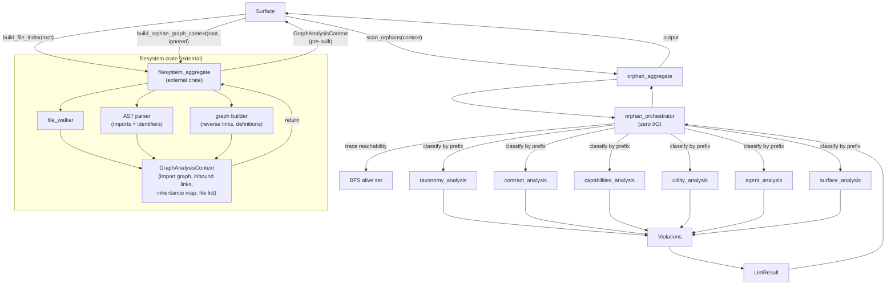

# FRD — orphan-rules (v2.0.0)

---

## System Overview

The orphan-rules crate identifies dead, unused, or unreachable code components across the 7-layer AES architecture. It receives a pre-built `GraphAnalysisContext` from the external `filesystem` crate and performs layer-specific orphan analysis starting from valid entry points (containers, binary entries, main files).

Graph construction is delegated to the external `filesystem` aggregate via `build_orphan_graph_context(root, ignored)`, which discovers workspace files, parses each file via tree-sitter AST, resolves imports to file edges, and returns a `GraphAnalysisContext`. The orphan-rules crate receives pre-built graph data and performs zero I/O — it only performs business logic analysis on pre-fetched data.

The orchestrator internally performs BFS reachability tracing over the import graph to determine which files are "alive" (reachable from entry points), then dispatches to 6 layer-specific orphan analyzers (AES501–AES506).

### Architecture & Data Flow



---

## Functional Requirements

### FR-001: Graph Context Reception and Dispatch

- **Description**: Receive the `GraphAnalysisContext` (built externally by the filesystem crate), trace BFS reachability from entry points, and dispatch to layer-specific orphan analyzers.
- **Input**: `GraphAnalysisContext` (built by filesystem crate) containing:

  - All workspace source files (workspace-root-relative paths).
  - All extracted import edges (file → file).
  - Forward import graph (file → file edges).
  - Inbound link map (file → list of importers).
  - Inheritance map (file → inherited/implemented trait, class, or interface names).
- **Output**: `GraphAnalysisContext` forwarded as-is; BFS alive set computed internally.
- **Business Rules**:

  - The filesystem crate builds the `GraphAnalysisContext` externally — orphan-rules performs zero I/O and zero graph construction.
  - All paths in the graph context are workspace-root-relative (the orchestrator converts between absolute and relative as needed).
  - Barrel files are identified via `DEFAULT_RULE_EXCEPTIONS` and skipped by the orchestrator before dispatching to analyzers.
  - File contents are pre-read via `IFilesystemAggregate::read_cached()` into a bounded content map so that sub-analyzers (contract, agent) can perform content-based searches without direct I/O.
- **Edge Cases**:

  - Empty workspace (zero files) → empty context, no violations.
  - Files with parse failures contribute no edges to the graph — they are treated as orphan candidates.
- **Error Handling**: Individual file read/parse failures degrade gracefully (empty edges → orphan candidacy).

---

### FR-002: Entry Point Discovery

- **Description**: Identify valid entry points that anchor the reachability graph, using configured patterns matched against all workspace files.
- **Input**: All workspace file paths from the graph context, configured entry point patterns from architecture configuration.
- **Output**: Set of entry point file paths.
- **Business Rules**:

  - Default entry point patterns (hardcoded when no config patterns provided):

    - Files ending with `_entry.rs`, `_entry.py`, `_entry.ts`, `_entry.js`
  - Additional patterns are merged from architecture configuration layer definitions (`orphan_entry_points`).
  - Pattern matching uses **segment matching**: exact match, stem match, prefix/suffix with `_`/`.` delimiters — never substring `contains()` to prevent false positives.
  - Entry points are identified from ALL workspace files (not just the scanned module) to resolve cross-module imports correctly.
  - All workspace file paths are converted to workspace-root-relative for graph key matching before entry point identification.
  - Deduplicates and sorts the final list.
- **Edge Cases**:

  - Workspace with zero entry points → all non-barrel files flagged as orphans.
  - Workspace with entry points in non-standard locations → requires config override.
- **Error Handling**: Missing or inaccessible entry point files (not in the file list) are excluded from the set.

---

### FR-003: Reachability Tracing

- **Description**: Perform BFS from all entry points through the forward import graph to determine which files are transitively reachable ("alive").
- **Input**: Entry point set and the forward import graph from the analysis context.
- **Output**: Set of all reachable file paths (alive set).
- **Business Rules**:

  - Uses breadth-first search with a visited tracker to avoid revisiting nodes.
  - A file is "alive" if it is transitively reachable from any entry point via import edges.
  - The alive set is used by all layer-specific orphan analyzers.
  - The alive set is converted to absolute paths for `contains()` checks by sub-analyzers.
- **Edge Cases**:

  - Isolated files with no imports from any entry point → not in alive set → flagged by analyzers.
  - Entry points that import nothing → valid (they are roots, alive by definition).
  - Cycles in the graph → handled by visited set, no infinite loops.
- **Error Handling**: Cycles handled by visited set. Missing graph nodes (file in file list but not in graph) → treated as unreachable.

---

### FR-004: Taxonomy Orphan Detection (AES501)

- **Description**: Check that taxonomy layer files (`taxonomy_*`) are imported by at least one file from a higher layer, or are reachable from entry points.
- **Input**: File path, inbound link map, all workspace files, content map, alive set.
- **Output**: Orphan indicator result with `is_orphan` flag, reason, and severity.
- **Business Rules**:

  - Two conditions for non-orphan:
    1. Must be in the alive set (reachable from entry points via BFS).
    2. Must have at least one higher-layer importer (contract, capabilities, agent, surface, root) from the inbound link map.
  - If only condition 1 is met but not condition 2, a barrel re-export fallback checks sibling `mod.rs` files for higher-layer importers.
  - If still no higher-layer consumer found, a content-based scan fallback searches all higher-layer files for string matching the taxonomy file's stem.
  - Internal taxonomy-to-taxonomy imports do NOT count — at least one non-taxonomy importer is required.
  - Barrel files (`mod.rs`, `__init__.py`, `index.ts`) do not count as importers.
  - Files that fail to parse → flagged as orphan (fail-strict).
- **Severity**: LOW.
- **Edge Cases**:

  - Taxonomy files imported only by other taxonomy files → flagged (no consumer outside taxonomy).
  - Taxonomy VO imported by a contract protocol → not orphan.
- **Error Handling**: Files with no detectable inbound links → orphan candidates.

---

### FR-005: Contract Orphan Detection (AES502)

- **Description**: Check that contract files are both reachable from entry points and have implementations and callers, using trait extraction and whole-word content searching.
- **Input**: File path, all workspace files, content map, alive set.
- **Output**: Orphan indicator result with `is_orphan` flag, reason, and severity.
- **Business Rules**:

  - **Reachability check first**: If file is not in the alive set, it is immediately orphan.
  - **Protocol contracts** (`_protocol` files):
    - Must have at least one implementation — checked by re-parsing capabilities/agent files for `impl <Trait> for ...` patterns.
    - Must be called/referenced by at least one higher-layer file — checked via whole-word content search.
    - Implementation without callers → orphan. Callers without implementation → orphan.
  - **Aggregate contracts** (`_aggregate` files):
    - Same conditions as protocols.
  - **Barrel re-export check**: If any trait/interface name from the contract file appears in a barrel file's re-exports, the contract is considered used as public API and is NOT flagged.
  - Whole-word matching is used for all identifier checks.
  - Uses cached search file lists per workspace root for performance.
- **Severity**: MEDIUM.
- **Edge Cases**:

  - Protocol with implementation but zero callers → orphan.
  - Protocol with callers but no implementation → orphan.
  - Aggregate re-exported in barrel → not orphan.
  - Contract file with no traits/interfaces (e.g., only type aliases) → not orphan (nothing to check).
- **Error Handling**: Files with empty content or no trait names → not flagged (nothing to check).

---

### FR-006: Capabilities Orphan Detection (AES503)

- **Description**: Check that capability files are both reachable from entry points and wired in a root container file.
- **Input**: File path, alive set, filesystem aggregate (for container wiring checks).
- **Output**: Orphan indicator result with `is_orphan` flag, reason, and severity.
- **Business Rules**:

  - Two conditions for non-orphan:
    1. Must be in the alive set (reachable from entry points).
    2. Must be wired in a root container file (struct/class identifiers from the capability file are found in container files via `check_wired_in_container`).
  - Container files are identified by suffix: `*_container.*`.
  - Both conditions must be satisfied. If either fails, the file is orphan.
- **Severity**: MEDIUM.
- **Edge Cases**:

  - Capability imported only by other capabilities in a chain → alive if any link in the chain reaches a container (BFS handles this).
  - Capability with no struct/class names → treated as potential orphan.
- **Error Handling**: Files that fail to parse → orphan (fail-strict).

---

### FR-007: Utility Orphan Detection (AES504)

- **Description**: Check that utility files are both reachable from entry points and imported by at least one consumer layer (capabilities, agent, surface, or root).
- **Input**: File path, inbound link map, all workspace files, content map, alive set.
- **Output**: Orphan indicator result with `is_orphan` flag, reason, and severity.
- **Business Rules**:

  - Two conditions for non-orphan:
    1. Must be in the alive set.
    2. Must have at least one consumer-layer importer (capabilities, agent, surface, root) from the inbound link map.
  - If condition 1 passes but condition 2 fails, a barrel re-export fallback checks sibling `mod.rs`/`__init__.py` for consumer importers.
  - If still no consumer found, a content-based scan searches all consumer-layer files for import patterns referencing the utility module.
  - Utility-only import chains are flagged as dead code (utility importing utility does not count).
  - Files that fail to parse → flagged as orphan (fail-strict).
- **Severity**: MEDIUM.
- **Edge Cases**:

  - Utility imported by another utility that is itself orphaned → the chain is dead → orphan.
  - Utility imported by a capabilities file → not orphan.
  - Utility with no inbound links → orphan.
- **Error Handling**: Files that fail to parse → orphan (fail-strict).

---

### FR-008: Agent Orphan Detection (AES505)

- **Description**: Check that agent files are both reachable from entry points and have their aggregate traits wired in a container file.
- **Input**: File path, all workspace files, content map, alive set.
- **Output**: Orphan indicator result with `is_orphan` flag, reason, and severity.
- **Business Rules**:

  - Two conditions for non-orphan:
    1. Must be reachable from entry points (fuzzy match: filename equality, suffix matching, path prefix).
    2. Must have at least one aggregate trait name wired in a container file — checked by extracting aggregate trait names from the agent file, then scanning `*_container.*` and `lib.rs` files for whole-word references.
  - If the agent file has no aggregate traits → condition 2 passes vacuously (not orphan).
  - Agent is orphan if **ANY** of the two conditions fail.
  - Candidate wiring files: `*_container.{rs,py,ts,js}` and `lib.rs`.
- **Severity**: HIGH — orphaned agent means entire feature behavior is unreachable.
- **Edge Cases**:

  - Agent with no aggregate implementation → not orphan (skip wiring check).
  - Agent with aggregate traits but none found in container files → orphan.
- **Error Handling**: Files that fail to parse → flagged as orphan (fail-strict).

---

### FR-009: Surface Orphan Detection (AES506)

- **Description**: Check that surface files are reachable from entry points based on their group classification (Smart, Utility, Passive).
- **Input**: File path, alive set, inbound link map, layer definition.
- **Output**: Orphan indicator result with `is_orphan` flag, reason, and severity.
- **Business Rules**:

  - **Surface classification by filename suffix**:

    - **Smart**: `_command`, `_controller`, `_page`, `_router` — must be reachable from entry points. Severity: HIGH.
    - **Utility**: `_hook`, `_store`, `_action`, `_screen` — must be reachable from entry points. Severity: MEDIUM.
    - **Passive**: `_component`, `_view`, `_layout` — must be reachable from entry points. Severity: LOW.
  - Surface is the outermost layer — orphan check uses **only** BFS reachability from entry points (the alive set).
  - Files with **unclassifiable suffixes** (not in Smart, Utility, or Passive lists) → **skipped** (no orphan check performed).
  - Files that fail to parse → flagged as orphan (fail-strict).
- **Edge Cases**:

  - Surface not reachable from any entry file → orphan.
  - Surface file with unclassifiable suffix → skipped entirely (no violation, no error).
- **Error Handling**: Files that fail to parse → orphan (fail-strict). Unclassifiable suffix → skip.

---

### FR-010: Barrel File Exception Handling

- **Description**: Skip known barrel/package marker files from orphan detection.
- **Input**: File path.
- **Output**: Skip signal (no violation produced).
- **Business Rules**:

  - Barrel files are identified via `DEFAULT_RULE_EXCEPTIONS` from the shared crate.
  - These files are package markers or re-export files, not logic.
  - Check is performed in the orchestrator before dispatching to any analyzer.
- **Edge Cases**: A barrel file inside a deeply nested module is still skipped.
- **Error Handling**: N/A — simple filename check.

---

## API Contract

| Function                           | Input                                                        | Output                     | Description                                                                                  |
| ---------------------------------- | ------------------------------------------------------------ | -------------------------- | -------------------------------------------------------------------------------------------- |
| Full orphan scan                   | Target path                                                  | Lint results               | Build graph context via filesystem crate, discover entry points, trace reachability, run all analyzers |
| Orphan scan with context           | Pre-built analysis context                                   | Lint results               | Orphan scan with pre-built context (avoids filesystem crate call)                            |
| Identify entry points              | File list from analysis context, configured patterns         | Set of entry point paths   | Discover all valid entry points                                                              |
| Trace reachability                 | Entry point set, import graph                                | Alive file set             | BFS from entry points through import graph                                                   |
| Check taxonomy orphan              | File path, inbound link map, files, content, alive set       | Orphan indicator result    | AES501 — taxonomy file orphan check                                                         |
| Check contract orphan              | File path, files, content, alive set                         | Orphan indicator result    | AES502 — contract file orphan check                                                         |
| Check capabilities orphan          | File path, alive set, filesystem aggregate                   | Orphan indicator result    | AES503 — capabilities file orphan check                                                     |
| Check utility orphan               | File path, inbound link map, files, content, alive set       | Orphan indicator result    | AES504 — utility file orphan check                                                          |
| Check agent orphan                 | File path, files, content, alive set                         | Orphan indicator result    | AES505 — agent file orphan check                                                            |
| Check surface orphan               | File path, alive set, inbound link map, layer definition     | Orphan indicator result    | AES506 — surface file orphan check                                                          |
| Create default DI container        | Filesystem aggregate                                         | Orphan detection container | Default dependency injection container                                                       |
| Create DI container with config    | Architecture configuration, filesystem aggregate             | Orphan detection container | DI container with custom config                                                              |
| Create DI from config orchestrator | Config orchestrator reference, root directory, filesystem    | Orphan detection container | Canonical DI from config orchestrator                                                        |

---

## Integration Points

- **Internal** (orphan-rules crate):

  - The orphan detection aggregate contract — `IOrphanAggregate` trait defining the public API surface.
  - The orphan detection protocol contracts — 6 layer-specific orphan indicator protocols.
  - The `utility_orphan_filename` module — entry point identification, filename parsing (basename, stem, suffix), whole-word content search.
  - The `utility_orphan_graph` module — pure BFS reachability tracing over `ImportGraph`.
  - The `ArchOrphanDeps` struct — DI bundle for all 6 analyzers + filesystem.
  - The `OrphanContainer` root — DI composition wiring all analyzers.
- **External**:

  - **`filesystem` crate** — provides `IFilesystemAggregate` which handles:
    - Graph construction: `build_orphan_graph_context()` discovers files, parses ASTs, resolves imports, returns `GraphAnalysisContext`.
    - Workspace root detection (`workspace_root`), ignore filtering, content reads (`read_cached`).
    - Container wiring checks (`check_wired_in_container`).
    - `resolve_orphan_module_path` for Rust `#[path = "..."]` mod resolution.
  - **`shared` crate** — provides `IOrphanParserProtocol`, `GraphAnalysisContext`, `OrphanIndicatorResult`, `ReachabilityResult`, `ImportGraph`, and other VOs.
  - No network calls. No filesystem writes. Pure static analysis.

---

## Non-functional Requirements

- **Performance**:

  - 1,000 files < 500ms; 5,000 files < 2s; 10,000 files < 5s.
  - BFS reachability is O(V + E). Per-analyzer checks are O(n) for map lookups.
  - Contract/agent analyzers use cached search file lists and whole-word content lookups instead of re-reading files per check.
  - File-level analysis is parallelized via `rayon` (`par_iter`).
- **Memory**:

  - `GraphAnalysisContext` holds all graph data in memory. File contents are held in a bounded cache via `IFilesystemAggregate::read_cached()`.
  - The orchestrator pre-reads all file contents into a `content_map` for sub-analyzers.
- **Accuracy**:

  - **Rust** uses full AST parsing via `syn` (shared crate). **Python/TS** use comment-aware line-based parsing (shared crate).
  - Zero false positives on transitively reachable code. A file is valid if it is transitively reachable from an entry point.
  - Known limitation: macro-generated code (Rust `macro_rules!`, proc macros) is not expanded — trait implementations inside macros are invisible to the detector.
  - Parse failure → orphan (fail-strict). This eliminates false negatives at the cost of potential false positives for files with syntax errors.
- **Concurrency**: Thread-safe via trait object shared ownership. File-level analysis is parallelized via `rayon`. Graph analysis is read-only after construction.
- **Configurability**:

  - **Hardcoded conventions (permanent, by design)**:
    - Layer detection from filename prefix (`taxonomy_*`, `contract_*`, `utility_*`, `capabilities_*`, `agent_*`, `surface_*`, `root_*`).
    - Workspace directory structure (`crates/`, `packages/`, `modules/`).
    - Barrel file names (`DEFAULT_RULE_EXCEPTIONS`).
    - Default entry point suffix pattern (`_entry.*`).
  - **Configurable (via YAML)**:
    - Additional entry point patterns per layer.
    - Per-layer orphan check toggle (`check_orphan`).
    - Per-rule enable/disable (AES501–AES506).
    - Per-layer exceptions.
    - Ignored paths.

---

## Test Scenarios / QA Checklist

### Core Detection

| #  | Scenario                                            | Expected                                   | Rule   |
| -- | --------------------------------------------------- | ------------------------------------------ | ------ |
| 1  | Workspace with 100 files, 5 orphans across 3 layers | All 5 detected, 0 false positives          | all    |
| 2  | Circular imports between two capabilities           | Both reachable, neither flagged            | pass   |
| 3  | Workspace with zero entry points                    | All non-barrel files flagged as orphans    | all    |
| 4  | Cross-crate imports (crate A imports from crate B)  | Graph resolves correctly                   | pass   |
| 5  | Configuration disabled                              | Full orphan scan returns empty immediately | config |
| 6  | File with parse failure                             | Flagged as orphan (fail-strict)            | all    |

### Barrel Files

| #  | Scenario                                 | Expected             | Rule |
| -- | ---------------------------------------- | -------------------- | ---- |
| 1  | Python `__init__.py` package marker      | Skipped, not flagged | excl |
| 2  | TypeScript barrel `index.ts` re-exports  | Skipped, not flagged | excl |
| 3  | Rust `mod.rs` re-exports                 | Skipped, not flagged | excl |
| 4  | Rust `lib.rs` library root               | Skipped, not flagged | excl |

### AES501 — Taxonomy Orphan

| #  | Scenario                                            | Expected                          | Rule   |
| -- | --------------------------------------------------- | --------------------------------- | ------ |
| 1  | Taxonomy file imported by a contract file           | Not orphan                        | pass   |
| 2  | Taxonomy file imported only by other taxonomy files | Orphan (no non-taxonomy consumer) | AES501 |
| 3  | Taxonomy file with no inbound links                 | Orphan                            | AES501 |
| 4  | Taxonomy file imported by capabilities file         | Not orphan                        | pass   |

### AES502 — Contract Orphan

| #  | Scenario                                          | Expected                      | Rule   |
| -- | ------------------------------------------------- | ----------------------------- | ------ |
| 1  | Protocol with implementation AND callers          | Not orphan                    | pass   |
| 2  | Protocol with implementation but zero callers     | Orphan                        | AES502 |
| 3  | Protocol with callers but no implementation       | Orphan                        | AES502 |
| 4  | Aggregate re-exported in barrel file              | Not orphan (public API)       | pass   |
| 5  | Aggregate implemented by agent, called by surface | Not orphan                    | pass   |
| 6  | Contract file with no traits (only type aliases)  | Not orphan (nothing to check) | pass   |

### AES503 — Capabilities Orphan

| #  | Scenario                                                           | Expected                 | Rule   |
| -- | ------------------------------------------------------------------ | ------------------------ | ------ |
| 1  | Capability struct referenced in container file                     | Not orphan               | pass   |
| 2  | Capability file transitively reachable from entry point            | Not orphan               | pass   |
| 3  | Capability file not in alive set, not in any container             | Orphan                   | AES503 |
| 4  | Capability imported by other capabilities, chain reaches container | Not orphan (chain alive) | pass   |

### AES504 — Utility Orphan

| #  | Scenario                                 | Expected                           | Rule   |
| -- | ---------------------------------------- | ---------------------------------- | ------ |
| 1  | Utility imported by a capabilities file  | Not orphan                         | pass   |
| 2  | Utility imported only by other utilities | Orphan (utility chain = dead code) | AES504 |
| 3  | Utility with no inbound links            | Orphan                             | AES504 |
| 4  | Utility imported by agent file           | Not orphan                         | pass   |

### AES505 — Agent Orphan

| #  | Scenario                                                  | Expected                      | Rule   |
| -- | --------------------------------------------------------- | ----------------------------- | ------ |
| 1  | Agent aggregate called by container file                  | Not orphan                    | pass   |
| 2  | Agent aggregate not called by any container/lib           | Orphan (HIGH)                 | AES505 |
| 3  | Agent with no aggregate implementation                    | Not orphan (skip check)       | pass   |
| 4  | Agent with aggregate traits, none found in containers     | Orphan (HIGH)                 | AES505 |

### AES506 — Surface Orphan

| #  | Scenario                                                          | Expected                                | Rule   |
| -- | ----------------------------------------------------------------- | --------------------------------------- | ------ |
| 1  | Smart surface (`_command`) reachable from entry point             | Not orphan                              | pass   |
| 2  | Smart surface not reachable from any entry point                  | Orphan (HIGH)                           | AES506 |
| 3  | Utility surface (`_hook`) reachable from entry point              | Not orphan                              | pass   |
| 4  | Utility surface not reachable from any entry point                | Orphan (MEDIUM)                         | AES506 |
| 5  | Passive surface (`_component`) reachable from entry point         | Not orphan                              | pass   |
| 6  | Passive surface not reachable from any entry point                | Orphan (LOW)                            | AES506 |
| 7  | Surface file with unclassifiable suffix                           | Skipped (no check)                      | skip   |

### Configuration

| #  | Scenario                                  | Expected                                       | Rule   |
| -- | ----------------------------------------- | ---------------------------------------------- | ------ |
| 1  | Config `check_orphan: false` for a layer  | No violations for that layer                   | config |
| 2  | Config with exceptions list               | Excepted files produce no violations           | config |
| 3  | Config with `ignored_paths: ["tests"]`    | `tests/` segment files produce no violations   | config |
| 4  | Config with AES501 disabled               | No taxonomy orphan violations                  | config |
| 5  | Config with custom entry point patterns   | Additional entry points recognized             | config |

### Performance

| #  | Scenario                                      | Expected                                   | Rule |
| -- | --------------------------------------------- | ------------------------------------------ | ---- |
| 1  | 10,000 file workspace                         | Completes in under 5 seconds               | perf |
| 2  | Contract analyzer with 50 traits × 500 files | Completes in under 2 seconds (map lookups) | perf |

---

## Assumptions & Constraints

- Workspace follows AES convention with `crates/`, `packages/`, `modules/` directories.
- Naming convention validation is handled by the naming-rules crate; orphan-rules assumes filenames are correctly named.
- Entry points are identified by filename suffix patterns (default: `_entry.*`), configurable via YAML.
- Graph construction (file discovery, AST parsing, import resolution, inheritance mapping) is performed by the external `filesystem` crate. orphan-rules receives a pre-built `GraphAnalysisContext` and performs zero I/O.
- Parsing in the filesystem crate: Rust via `syn` (shared parser), Python/TS via tree-sitter AST. orphan-rules itself does not parse files.
- No network calls are required; all analysis is local.
- Configuration is loaded once and reused across all checks in a scan.
- Macro-generated code (Rust `macro_rules!`, proc macros) is not expanded — trait implementations inside macros are invisible to the detector.
- Parse failure → orphan (fail-strict). Files that fail to parse are flagged as orphans because reachability cannot be verified.
- Surface files with unclassifiable suffixes are skipped (no orphan check performed).

---

## Glossary

| Term                           | Definition                                                                                                         |
| ------------------------------ | ------------------------------------------------------------------------------------------------------------------ |
| **AES**                        | Agentic Engineering System — the 7-layer coding convention                                                        |
| **Orphan**                     | A source file not transitively reachable from any entry point, or failing layer-specific consumer requirements     |
| **Entry point**                | A file that anchors the reachability graph (main, lib, container, entry, root)                                     |
| **Barrel file**                | A package marker or re-export file (`__init__.py`, `mod.rs`, `lib.rs`, `index.ts`)                                |
| **Alive file**                 | A file reachable via BFS from any entry point through the import graph                                              |
| **DI**                         | Dependency Injection — wiring implementations to trait/interface contracts                                          |
| **Inbound link**               | A file that imports the target file (reverse import edge)                                                          |
| **AST**                        | Abstract Syntax Tree — structured representation of source code produced by a parser                               |
| **GraphAnalysisContext**       | Pre-built analysis context from the filesystem crate containing file list, import graph, inbound links, and inheritance map |
| **ImportGraph**                | Forward import graph (file → file edges) used for BFS reachability tracing                                         |
| **InboundLinkMap**             | Map of file path to list of files that import it                                                                   |
| **InheritanceMap**             | Map of file to inherited/implemented trait, class, or interface names                                              |
| **ReachabilityResult**         | Set of files reachable from entry points (the alive set)                                                           |
| **Segment matching**           | Path matching by splitting on `/` and comparing individual segments (not substring containment)                     |
| **Filesystem crate**           | External crate providing graph construction, file walking, AST parsing, and content reads to orphan-rules.         |

---

## Appendix A: YAML Configuration Schema

### Top-Level Structure

```yaml
architecture:
  enabled: true
  rules:
    AES501: { ... }
    AES502: { ... }
    AES503: { ... }
    AES504: { ... }
    AES505: { ... }
    AES506: { ... }
  layers:
    <layer_name>:
      orphan:
        check_orphan: true
        orphan_entry_points:
          - "*_container.*"
          - "main.rs"
          - "lib.rs"
```

### Per-Rule Configuration

```yaml
AES50X:
  enabled: true
  exceptions: []
```

---

## Reference

- PRD: [PRD.md](../../PRD.md)
- Architecture: [ARCHITECTURE.md](../../ARCHITECTURE.md)
- Filesystem crate FRD: `../filesystem/FRD.md`
