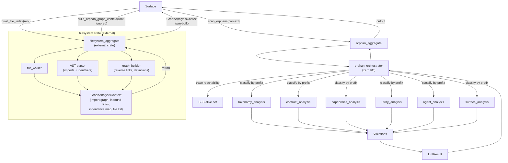

# FRD — orphan-rules (v2.0.0)

## Reference

- Backlog: [BACKLOG.md](BACKLOG.md) — real condition for this feature; this file is specification only.
- PRD: [PRD.md](../../PRD.md)
- Architecture: [ARCHITECTURE.md](../../ARCHITECTURE.md)
- Filesystem crate FRD: `../filesystem/FRD.md`

## System Overview

The orphan-rules crate identifies dead, unused, or unreachable code components across the 7-layer AES architecture. It receives a pre-built `GraphAnalysisContext` from the external `filesystem` crate and performs layer-specific orphan analysis starting from valid entry points (containers, binary entries, main files).

Graph construction is delegated to the external `filesystem` aggregate via `build_orphan_graph_context(root, ignored)`, which discovers workspace files, parses each file via tree-sitter AST, resolves imports to file edges, and returns a `GraphAnalysisContext`. The orphan-rules crate receives pre-built graph data and performs zero I/O — it only performs business logic analysis on pre-fetched data.

The orchestrator internally performs BFS reachability tracing over the import graph to determine which files are "alive" (reachable from entry points), then dispatches to 6 layer-specific orphan analyzers (AES501–AES506).

- **Architecture & Data Flow**


```mermaid
flowchart TD
    A["Surface"] -->|"build_file_index(root)"| D["filesystem_aggregate\n(external crate)"]
    A -->|"build_orphan_graph_context(root, ignored)"| D

    subgraph FS ["filesystem crate (external)"]
        D --> E1["file_walker"]
        D --> E2["AST parser\n(imports + identifiers)"]
        D --> E3["graph builder\n(reverse links, definitions)"]
        E1 --> G1["GraphAnalysisContext\n(import graph, inbound links,\ninheritance map, file list)"]
        E2 --> G1
        E3 --> G1
    end

    G1 -->|"return"| D
    D -->|"GraphAnalysisContext\n(pre-built)"| A

    A -->|"scan_orphans(context)"| B["orphan_aggregate"]
    B --> C["orphan_orchestrator\n(zero I/O)"]

    C -->|"trace reachability"| BFS["BFS alive set"]
    C -->|"classify by prefix"| H1["taxonomy_analysis"]
    C -->|"classify by prefix"| H2["contract_analysis"]
    C -->|"classify by prefix"| H3["capabilities_analysis"]
    C -->|"classify by prefix"| H4["utility_analysis"]
    C -->|"classify by prefix"| H5["agent_analysis"]
    C -->|"classify by prefix"| H6["surface_analysis"]

    H1 --> I["Violations"]
    H2 --> I
    H3 --> I
    H4 --> I
    H5 --> I
    H6 --> I
    I --> J["LintResult"]
    J --> C
    C --> B
    B -->|output| A

```

## Functional Requirements

### FR-OrphanRules-001: Graph Context, Entry Points, and Reachability

- **Description**: Receive the `GraphAnalysisContext` (built externally by the filesystem crate), identify the entry points that anchor the reachability graph, trace BFS reachability from them, and dispatch to layer-specific orphan analyzers.
- **Input**: `GraphAnalysisContext` (built by filesystem crate) containing:

  - All workspace source files (workspace-root-relative paths).
  - All extracted import edges (file → file).
  - Forward import graph (file → file edges).
  - Inbound link map (file → list of importers).
  - Inheritance map (file → trait, class, or interface names it inherits).

  Plus the configured entry-point patterns from architecture configuration.
- **Output**: `GraphAnalysisContext` forwarded as-is; the entry-point set and the BFS alive set computed internally.
- **Business Rules**:

  - The filesystem crate builds the `GraphAnalysisContext` externally — orphan-rules performs zero I/O and zero graph construction.
  - All paths in the graph context are workspace-root-relative (the orchestrator converts between absolute and relative as needed).
  - Barrel/package marker files — package markers and re-export files, not logic — are identified via `DEFAULT_RULE_EXCEPTIONS` from the shared crate and skipped by the orchestrator before dispatching to any analyzer. A barrel file inside a deeply nested module is still skipped.
  - File contents are pre-read via `IFilesystemAggregate::read_cached()` into a bounded content map so that sub-analyzers (contract, agent) can perform content-based searches without direct I/O.
  - Entry-point discovery: default patterns (files whose name ends with the entry-point marker for any supported language) plus configured `orphan_entry_points` from layer definitions. Matching uses **segment matching** — exact match, stem match, prefix/suffix with `_`/`.` delimiters — never substring `contains()`, to prevent false positives. Identified from ALL workspace files (not just the scanned module); paths are converted to workspace-root-relative before matching; the result is deduplicated and sorted.
  - Reachability tracing: breadth-first search from the entry-point set through the forward import graph, with a visited tracker, to produce the set of transitively reachable ("alive") files. The alive set is consumed by all layer-specific analyzers and converted to absolute paths for sub-analyzer `contains()` checks.
- **Edge Cases**:

  - Empty workspace (zero files) → empty context, no violations.
  - Files with parse failures contribute no edges to the graph — they are treated as orphan candidates.
  - Workspace with zero entry points → all non-barrel files flagged as orphans.
  - Workspace with entry points in non-standard locations → requires config override.
  - Isolated files with no imports from any entry point → not in alive set → flagged by analyzers.
  - Entry points that import nothing → valid (they are roots, alive by definition).
  - Cycles in the graph → handled by visited set, no infinite loops.
- **Error Handling**: Individual file read/parse failures degrade gracefully (empty edges → orphan candidacy). Missing or inaccessible entry-point files (not in the file list) are excluded from the set. Cycles handled by visited set; missing graph nodes (file in file list but not in graph) → treated as unreachable.

### FR-OrphanRules-002: Taxonomy Orphan Detection (AES501)

- **Description**: Check that taxonomy layer files (`taxonomy_*`) are imported by at least one file from a higher layer, or are reachable from entry points.
- **Input**: File path, inbound link map, all workspace files, content map, alive set.
- **Output**: Orphan indicator result with `is_orphan` flag, reason, and severity.
- **Business Rules**:

  - Two conditions for non-orphan:
    1. Must be in the alive set (reachable from entry points via BFS).
    2. Must have at least one higher-layer importer (contract, capabilities, agent, surface, root) from the inbound link map.
  - If only condition 1 is met but not condition 2, a barrel re-export fallback checks sibling barrel files for higher-layer importers.
  - If still no higher-layer consumer found, a content-based scan fallback searches all higher-layer files for string matching the taxonomy file's stem.
  - Internal taxonomy-to-taxonomy imports do NOT count — at least one non-taxonomy importer is required.
  - Barrel files do not count as importers.
  - Files that fail to parse → flagged as orphan (fail-strict).
- **Severity**: LOW.
- **Edge Cases**:

  - Taxonomy files imported only by other taxonomy files → flagged (no consumer outside taxonomy).
  - Taxonomy VO imported by a contract protocol → not orphan.
- **Error Handling**: Files with no detectable inbound links → orphan candidates.

### FR-OrphanRules-003: Contract Orphan Detection (AES502)

- **Description**: Check that contract files are reachable from entry points and have implementations, using trait extraction and whole-word content searching.
- **Input**: File path, all workspace files, content map, alive set.
- **Output**: Orphan indicator result with `is_orphan` flag, reason, and severity.
- **Business Rules**:

  - **Reachability check first**: If file is not in the alive set (not reachable from any entry or container), it is immediately orphan.
  - **Protocol contracts** (`_protocol` files):
    - Must have at least one implementation — checked by re-parsing capabilities files for `impl <Trait> for ...` patterns.
    - No caller check — only implementation is verified.
    - No implementation → orphan.
  - **Aggregate contracts** (`_aggregate` files):
    - Same conditions as protocols — must have at least one implementation by agent files.
    - No caller check — only implementation is verified.
  - **Barrel re-export check**: If any trait/interface name from the contract file appears in a barrel file's re-exports, the contract is considered used as public API and is NOT flagged.
  - Whole-word matching is used for all identifier checks.
  - Uses cached search file lists per workspace root for performance.
- **Severity**: MEDIUM.
- **Edge Cases**:

  - Protocol with implementation but not wired → not orphan (if reachable via DI).
  - Protocol with no implementation → orphan.
  - Aggregate with implementation but not wired → not orphan (if reachable via DI).
  - Aggregate with no implementation → orphan.
  - Barrel re-exported contract → not orphan.
  - Contract file with no traits/interfaces (e.g., only type aliases) → not orphan (nothing to check).
- **Error Handling**: Files with empty content or no trait names → not flagged (nothing to check).

### FR-OrphanRules-004: Capabilities Orphan Detection (AES503)

- **Description**: Check that capability files are both reachable from entry points and wired in a root container file.
- **Input**: File path, alive set, filesystem aggregate (for container wiring checks).
- **Output**: Orphan indicator result with `is_orphan` flag, reason, and severity.
- **Business Rules**:

  - Two conditions for non-orphan:
    1. Must be in the alive set (reachable from entry points).
    2. Must be wired in a root container file (struct/class identifiers from the capability file are found in container files via `check_wired_in_container`).
  - Container files are identified by suffix: `*_container.*`.
  - Both conditions must be satisfied. If either fails, the file is orphan.
- **Severity**: MEDIUM.
- **Edge Cases**:

  - Capability imported only by other capabilities in a chain → alive if any link in the chain reaches a container (BFS handles this).
  - Capability with no struct/class names → treated as potential orphan.
- **Error Handling**: Files that fail to parse → orphan (fail-strict).

### FR-OrphanRules-005: Utility Orphan Detection (AES504)

- **Description**: Check that utility files are both reachable from entry points and imported by at least one consumer layer (capabilities, agent, surface, or root).
- **Input**: File path, inbound link map, all workspace files, content map, alive set.
- **Output**: Orphan indicator result with `is_orphan` flag, reason, and severity.
- **Business Rules**:

  - Two conditions for non-orphan:
    1. Must be in the alive set.
    2. Must have at least one consumer-layer importer (capabilities, agent, surface, root) from the inbound link map.
  - If condition 1 passes but condition 2 fails, a barrel re-export fallback checks sibling barrel files for consumer importers.
  - If still no consumer found, a content-based scan searches all consumer-layer files for import patterns referencing the utility module.
  - Utility-only import chains are flagged as dead code (utility importing utility does not count).
  - Files that fail to parse → flagged as orphan (fail-strict).
- **Severity**: MEDIUM.
- **Edge Cases**:

  - Utility imported by another utility that is itself orphaned → the chain is dead → orphan.
  - Utility imported by a capabilities file → not orphan.
  - Utility with no inbound links → orphan.
- **Error Handling**: Files that fail to parse → orphan (fail-strict).

### FR-OrphanRules-006: Agent Orphan Detection (AES505)

- **Description**: Check that agent files are both reachable from entry points and have their aggregate traits wired in a container file.
- **Input**: File path, all workspace files, content map, alive set.
- **Output**: Orphan indicator result with `is_orphan` flag, reason, and severity.
- **Business Rules**:

  - Two conditions for non-orphan:
    1. Must be reachable from entry points (fuzzy match: filename equality, suffix matching, path prefix).
    2. Must have at least one aggregate trait name wired in a composition root — checked by extracting aggregate trait names from the agent file, then scanning container-role and library-root files for whole-word references.
  - If the agent file has no aggregate traits → condition 2 passes vacuously (not orphan).
  - Agent is orphan if **ANY** of the two conditions fail.
  - Candidate wiring files: container-role files and library roots.
- **Severity**: HIGH — orphaned agent means entire feature behavior is unreachable.
- **Edge Cases**:

  - Agent with no aggregate implementation → not orphan (skip wiring check).
  - Agent with aggregate traits but none found in container files → orphan.
- **Error Handling**: Files that fail to parse → flagged as orphan (fail-strict).

### FR-OrphanRules-007: Surface Orphan Detection (AES506)

- **Description**: Check that surface files are reachable from entry points based on their group classification (Smart, Utility, Passive).
- **Input**: File path, alive set, inbound link map, layer definition.
- **Output**: Orphan indicator result with `is_orphan` flag, reason, and severity.
- **Business Rules**:

  - **Surface classification by filename suffix**:

    - **Smart**: `_command`, `_controller`, `_page`, `_router` — must be reachable from entry points. Severity: HIGH.
    - **Utility**: `_hook`, `_store`, `_action`, `_screen` — must be reachable from entry points. Severity: MEDIUM.
    - **Passive**: `_component`, `_view`, `_layout` — must be reachable from entry points. Severity: LOW.
  - Surface is the outermost layer — orphan check uses **only** BFS reachability from entry points (the alive set).
  - Files with **unclassifiable suffixes** (not in Smart, Utility, or Passive lists) → **skipped** (no orphan check performed).
  - Files that fail to parse → flagged as orphan (fail-strict).
- **Edge Cases**:

  - Surface not reachable from any entry file → orphan.
  - Surface file with unclassifiable suffix → skipped entirely (no violation, no error).
- **Error Handling**: Files that fail to parse → orphan (fail-strict). Unclassifiable suffix → skip.

## API Contract

FR-OrphanRules-001's graph-context, entry-point, and reachability steps have **no trait** in the shared contract module. They are orchestration the orphan-rules agent owns: it receives the graph context from the filesystem aggregate and delegates the pure work to the shared orphan/quality utilities. An agent must never implement a contract protocol (AES405), and no other feature consumes these steps, so a seam would have exactly one implementer — the agent — which is the shape the rule forbids. They are therefore inherent methods on the aggregate:

| Method | Input | Output | Error | Description |
|---|---|---|---|---|
| `build_orphan_graph_context` | &FilePath | `GraphAnalysisContext` | — | Ask the filesystem aggregate to build the analysis context for a root. |
| `identify_orphan_entry_points` | &OrphanFileListVO | `OrphanFileListVO` | — | Identify entry points from a workspace file list. |
| `trace_alive_files` | &OrphanFileListVO, &GraphAnalysisContext | `ReachabilityResult` | — | Trace which files are alive (reachable) from the entry points. |

### Protocol API

| Method | Input | Output | Error | Event | Description |
|---|---|---|---|---|---|
| `is_agent_orphan` | &FilePath, &FilePath, &[String], &HashMap<String, String>, &ReachabilityResult | `OrphanIndicatorResult` | — | — | Is agent orphan. |
| `is_capabilities_orphan` | &FilePath, &FilePath, &ReachabilityResult, &HashMap<String, String>, &std::path::Path | `OrphanIndicatorResult` | — | — | Is capabilities orphan. |
| `is_contract_orphan` | &FilePath, &FilePath, &InheritanceMap, &[String], &HashMap<String, String>, &ReachabilityResult | `OrphanIndicatorResult` | — | — | Is contract orphan. |
| `parse_file` | &str, &str | `FileParseResultVO` | — | — | Parse file. |
| `is_supported` | &str | `bool` | — | — | Is supported. |
| `is_surface_orphan` | &FilePath, &FilePath, &ReachabilityResult, &InboundLinkMap, Option<&LayerDefinition> | `OrphanIndicatorResult` | — | — | Is surface orphan. |
| `is_taxonomy_orphan` | &FilePath, &FilePath, Option<&LayerDefinition>, &InboundLinkMap, &[String], &HashMap<String, String>, &ReachabilityResult | `OrphanIndicatorResult` | — | — | Is taxonomy orphan. |
| `is_utility_orphan` | &FilePath, &FilePath, &[String], &InboundLinkMap, &HashMap<String, String>, &ReachabilityResult | `OrphanIndicatorResult` | — | — | Is utility orphan. |

### Aggregate API

| Method | Input | Output | Error | Event | Description |
|---|---|---|---|---|---|
| `execute` | OrphanRequest | `OrphanResponse` | — | — | Single composite entry point over the feature. |

## Integration Points

| System | Direction | Purpose | Failure mode |
| --- | --- | --- | --- |
| Orphan aggregate contract | out (internal) | Expose the single composite entry point the surface calls | A request supplies no graph context → the orchestrator returns an empty result set and performs no I/O of its own |
| Layer-specific orphan indicator protocols | out (internal) | Define the shape each of the six per-layer orphan checks implements | An indicator does not satisfy its protocol → it is not wired, and the layer's check is reported as not run |
| Filename analysis utility | out (internal) | Identify entry points and split a name into base, stem, and suffix | A name has no suffix → the file is classified as a barrel or entry point and skipped |
| Reachability utility | out (internal) | Trace import edges from entry points to mark reachable files | The graph is empty → every file is reported as an orphan, which is fail-strict rather than a false pass |
| `filesystem` aggregate | in | Build the graph context, detect the workspace root, apply ignore filters, and resolve module paths | Building the graph fails → the scan reports the failure and produces no orphan claims |
| `shared` crate | in | Supply the parser contract, graph context, indicator results, reachability results, and the import graph | Parsing fails for a file → the file is reported as an orphan, because failing open would hide dead code |
| `rayon` | in (internal) | Parallelize the per-file analyzer checks | A worker is interrupted → the parallel iterator yields only the results it completed, and the run is reported as partial |

## Non-functional Requirements

| Metric | Target | Measurement method |
| --- | --- | --- |
| 1,000 files | Under 500 ms | Time a full orphan analysis over a 1,000-file workspace |
| 5,000 files | Under 2 s | Time a full orphan analysis over a 5,000-file workspace |
| 10,000 files | Under 5 s | Time a full orphan analysis over a 10,000-file workspace |
| Reachability | O(V + E) breadth-first traversal | Scale the graph tenfold and confirm linear growth |
| Cached lookups | Per-analyzer checks use cached file lists and whole-word content lookups rather than re-reading | Count filesystem reads during analysis and confirm it does not grow with analyzer count |
| Memory | The graph context and file contents are resident once, contents via a bounded cache | Measure retained memory against workspace size for two sizes |
| Parallel checks | File-level analysis is parallelized | Assert the parallel iterator is used for file-level analysis |
| Reachability accuracy | Zero false positives on transitively reachable code | Assert the good-workspace fixtures report zero orphans |
| Parse failure | A file that cannot be parsed is reported as an orphan | Feed an unparseable file and assert it is reported rather than silently passed |
| Macro limitation | Macro-generated code is invisible to the detector; fail-strict on parse error is deliberate | Record the limitation in the rule description, since it cannot be measured from outside |
| Graph read-only | Graph analysis performs no mutation after construction | Assert the analysis phase takes the graph by shared reference and mutates nothing |

## Test Scenarios

Each scenario is stated below as a table of cases: the input condition and the expected result.

- **Core Detection** — e.g. Workspace with 100 files, 5 orphans across 3 layers → All 5 detected, 0 false positives
- **Barrel files** — e.g. a Python package marker → Skipped, not flagged
- **AES501 — Taxonomy Orphan** — e.g. Taxonomy file imported by a contract file → Not orphan
- **AES502 — Contract Orphan** — e.g. Protocol with implementation AND callers → Not orphan
- **AES503 — Capabilities Orphan** — e.g. Capability struct referenced in container file → Not orphan
- **AES504 — Utility Orphan** — e.g. Utility imported by a capabilities file → Not orphan
- **AES505 — Agent Orphan** — e.g. Agent aggregate called by container file → Not orphan
- **AES506 — Surface Orphan** — e.g. Smart surface (`_command`) reachable from entry point → Not orphan
- **Configuration** — e.g. Config `check_orphan: false` for a layer → No violations for that layer
- **Performance** — e.g. 10,000 file workspace → Completes in under 5 seconds

- **Core Detection**

| # | Scenario | Expected |
| - | - | - |
| 1 | Workspace with 100 files, 5 orphans across 3 layers | All 5 detected, 0 false positives |
| 2 | Circular imports between two capabilities | Both reachable, neither flagged |
| 3 | Workspace with zero entry points | All non-barrel files flagged as orphans |
| 4 | Cross-crate imports (crate A imports from crate B) | Graph resolves correctly |
| 5 | Configuration disabled | Full orphan scan returns empty immediately |
| 6 | File with parse failure | Flagged as orphan (fail-strict) |

- **Barrel Files**

| # | Scenario | Expected |
| - | - | - |
| 1 | Python package marker | Skipped, not flagged |
| 2 | TypeScript barrel re-exports | Skipped, not flagged |
| 3 | Rust module barrel re-exports | Skipped, not flagged |
| 4 | Rust library root | Skipped, not flagged |

- **AES501 — Taxonomy Orphan**

| # | Scenario | Expected |
| - | - | - |
| 1 | Taxonomy file imported by a contract file | Not orphan |
| 2 | Taxonomy file imported only by other taxonomy files | Orphan (no non-taxonomy consumer) |
| 3 | Taxonomy file with no inbound links | Orphan |
| 4 | Taxonomy file imported by capabilities file | Not orphan |

- **AES502 — Contract Orphan**

| # | Scenario | Expected |
| - | - | - |
| 1 | Protocol with implementation AND callers | Not orphan |
| 2 | Protocol with implementation but zero callers | Orphan |
| 3 | Protocol with callers but no implementation | Orphan |
| 4 | Aggregate re-exported in barrel file | Not orphan (public API) |
| 5 | Aggregate behind an agent, called by surface | Not orphan |
| 6 | Contract file with no traits (only type aliases) | Not orphan (nothing to check) |

- **AES503 — Capabilities Orphan**

| # | Scenario | Expected |
| - | - | - |
| 1 | Capability struct referenced in container file | Not orphan |
| 2 | Capability file transitively reachable from entry point | Not orphan |
| 3 | Capability file not in alive set, not in any container | Orphan |
| 4 | Capability imported by other capabilities, chain reaches container | Not orphan (chain alive) |

- **AES504 — Utility Orphan**

| # | Scenario | Expected |
| - | - | - |
| 1 | Utility imported by a capabilities file | Not orphan |
| 2 | Utility imported only by other utilities | Orphan (utility chain = dead code) |
| 3 | Utility with no inbound links | Orphan |
| 4 | Utility imported by agent file | Not orphan |

- **AES505 — Agent Orphan**

| # | Scenario | Expected |
| - | - | - |
| 1 | Agent aggregate called by container file | Not orphan |
| 2 | Agent aggregate not called by any container/lib | Orphan (HIGH) |
| 3 | Agent with no aggregate implementation | Not orphan (skip check) |
| 4 | Agent with aggregate traits, none found in containers | Orphan (HIGH) |

- **AES506 — Surface Orphan**

| # | Scenario | Expected |
| - | - | - |
| 1 | Smart surface (`_command`) reachable from entry point | Not orphan |
| 2 | Smart surface not reachable from any entry point | Orphan (HIGH) |
| 3 | Utility surface (`_hook`) reachable from entry point | Not orphan |
| 4 | Utility surface not reachable from any entry point | Orphan (MEDIUM) |
| 5 | Passive surface (`_component`) reachable from entry point | Not orphan |
| 6 | Passive surface not reachable from any entry point | Orphan (LOW) |
| 7 | Surface file with unclassifiable suffix | Skipped (no check) |

- **Configuration**

| # | Scenario | Expected |
| - | - | - |
| 1 | Config `check_orphan: false` for a layer | No violations for that layer |
| 2 | Config with exceptions list | Excepted files produce no violations |
| 3 | Config with `ignored_paths: ["tests"]` | `tests/` segment files produce no violations |
| 4 | Config with AES501 disabled | No taxonomy orphan violations |
| 5 | Config with custom entry point patterns | Additional entry points recognized |

- **Performance**

| # | Scenario | Expected |
| - | - | - |
| 1 | 10,000 file workspace | Completes in under 5 seconds |
| 2 | Contract analyzer with 50 traits × 500 files | Completes in under 2 seconds (map lookups) |

## Assumptions & Constraints

- Workspace follows AES convention with `crates/`, `packages/`, `modules/` directories.
- Naming convention validation is handled by the naming-rules crate; orphan-rules assumes filenames are correctly named.
- Entry points are identified by filename suffix patterns (default: `_entry.*`), configurable via YAML.
- Graph construction (file discovery, AST parsing, import resolution, inheritance mapping) is performed by the external `filesystem` crate. orphan-rules receives a pre-built `GraphAnalysisContext` and performs zero I/O.
- Parsing in the filesystem crate: Rust via `syn` (shared parser), Python/TS via tree-sitter AST. orphan-rules itself does not parse files.
- No network calls are required; all analysis is local.
- Configuration is loaded once and reused across all checks in a scan.
- Macro-generated code (Rust `macro_rules!`, proc macros) is not expanded — trait implementations inside macros are invisible to the detector.
- Parse failure → orphan (fail-strict). Files that fail to parse are flagged as orphans because reachability cannot be verified.
- Surface files with unclassifiable suffixes are skipped (no orphan check performed).

## Glossary

- **AES**: Agentic Engineering System — the 7-layer coding convention
- **Orphan**: A source file not transitively reachable from any entry point, or failing layer-specific consumer requirements
- **Entry point**: A file that anchors the reachability graph (main, lib, container, entry, root)
- **Barrel file**: A package marker or re-export file whose role is to re-export a package's public surface
- **Alive file**: A file reachable via BFS from any entry point through the import graph
- **DI**: Dependency Injection — wiring implementations to trait/interface contracts
- **Inbound link**: A file that imports the target file (reverse import edge)
- **AST**: Abstract Syntax Tree — structured representation of source code produced by a parser
- **GraphAnalysisContext**: Pre-built analysis context from the filesystem crate containing file list, import graph, inbound links, and inheritance map
- **ImportGraph**: Forward import graph (file → file edges) used for BFS reachability tracing
- **InboundLinkMap**: Map of file path to list of files that import it
- **InheritanceMap**: Map of file to trait, class, or interface names it inherits
- **ReachabilityResult**: Set of files reachable from entry points (the alive set)
- **Segment matching**: Path matching by splitting on `/` and comparing individual segments (not substring containment)
- **Filesystem crate**: External crate providing graph construction, file walking, AST parsing, and content reads to orphan-rules.

- **Appendix A: YAML Configuration Schema**

- **Top-Level Structure**

```yaml
architecture:
  enabled: true
  rules:
    AES501: { ... }
    AES502: { ... }
    AES503: { ... }
    AES504: { ... }
    AES505: { ... }
    AES506: { ... }
  layers:
    <layer_name>:
      orphan:
        check_orphan: true
        orphan_entry_points:
          - "*_container.*"
          - a binary-entry filename
          - a library-root filename
```

- **Per-Rule Configuration**

```yaml
AES50X:
  enabled: true
  exceptions: []
```
