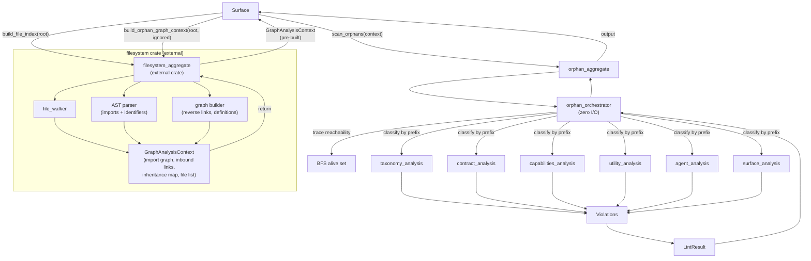

# FRD — orphan-rules (v2.0.0)

## Reference
- Backlog: [BACKLOG.md](BACKLOG.md) — real condition for this feature; this file is specification only.
- PRD: [PRD.md](../../PRD.md)
- Architecture: [ARCHITECTURE.md](../../ARCHITECTURE.md)
- Filesystem crate FRD: `../filesystem/FRD.md`

## System Overview
The orphan-rules crate identifies dead, unused, or unreachable code components across the 7-layer AES architecture. It receives a pre-built `GraphAnalysisContext` from the external `filesystem` crate and performs layer-specific orphan analysis starting from valid entry points (containers, binary entries, main files).

Graph construction is delegated to the external `filesystem` aggregate via `build_orphan_graph_context(root, ignored)`, which discovers workspace files, parses each file via tree-sitter AST, resolves imports to file edges, and returns a `GraphAnalysisContext`. The orphan-rules crate receives pre-built graph data and performs zero I/O — it only performs business logic analysis on pre-fetched data.

The orchestrator internally performs BFS reachability tracing over the import graph to determine which files are "alive" (reachable from entry points), then dispatches to six layer-specific orphan analyzers (AES501–AES506).

### Architecture & Data Flow

```mermaid
flowchart TD
    A["Surface"] -->|"build_file_index(root)"| D["filesystem_aggregate\n(external crate)"]
    A -->|"build_orphan_graph_context(root, ignored)"| D

    subgraph FS ["filesystem crate (external)"]
        D --> E1["file_walker"]
        D --> E2["AST parser\n(imports + identifiers)"]
        D --> E3["graph builder\n(reverse links, definitions)"]
        E1 --> G1["GraphAnalysisContext\n(import graph, inbound links,\ninheritance map, file list)"]
        E2 --> G1
        E3 --> G1
    end

    G1 -->|"return"| D
    D -->|"GraphAnalysisContext\n(pre-built)"| A

    A -->|"scan_orphans(context)"| B["orphan_aggregate"]
    B --> C["orphan_orchestrator\n(zero I/O)"]

    C -->|"trace reachability"| BFS["BFS alive set"]
    C -->|"classify by prefix"| H1["taxonomy_analysis"]
    C -->|"classify by prefix"| H2["contract_analysis"]
    C -->|"classify by prefix"| H3["capabilities_analysis"]
    C -->|"classify by prefix"| H4["utility_analysis"]
    C -->|"classify by prefix"| H5["agent_analysis"]
    C -->|"classify by prefix"| H6["surface_analysis"]

    H1 --> I["Violations"]
    H2 --> I
    H3 --> I
    H4 --> I
    H5 --> I
    H6 --> I
    I --> J["LintResult"]
    J --> C
    C --> B
    B -->|output| A

```

## Functional Requirements

### FR-ORPHANRULES-001: Graph Context Reception and Dispatch
- **Description**: Receive the `GraphAnalysisContext` (built externally by the filesystem crate), trace BFS reachability from entry points, and dispatch to layer-specific orphan analyzers.
- **Input**: `GraphAnalysisContext` (built by filesystem crate) containing all workspace source files, extracted import edges, forward import graph, inbound link map, and inheritance map.
- **Output**: `GraphAnalysisContext` forwarded as-is; BFS alive set computed internally; `Vec<LintResult>` returned to the caller.
- **Business Rules**:
  - The filesystem crate builds the `GraphAnalysisContext` externally — orphan-rules performs zero I/O and zero graph construction.
  - All paths in the graph context are workspace-root-relative (the orchestrator converts between absolute and relative as needed).
  - Barrel files are identified via `DEFAULT_RULE_EXCEPTIONS` and skipped by the orchestrator before dispatching to analyzers.
  - File contents are pre-read via `IFilesystemAggregate::read_cached()` into a bounded content map so that sub-analyzers (contract, agent) can perform content-based searches without direct I/O.
- **Edge Cases**:
  - Empty workspace (zero files) → empty context, no violations.
  - Files with parse failures contribute no edges to the graph — they are treated as orphan candidates.
- **Error Handling**: Individual file read/parse failures degrade gracefully (empty edges → orphan candidacy).

### FR-ORPHANRULES-002: Entry Point Discovery
- **Description**: Identify valid entry points that anchor the reachability graph, using configured patterns matched against all workspace files.
- **Input**: All workspace file paths from the graph context, configured entry point patterns from architecture configuration.
- **Output**: Set of entry point file paths.
- **Business Rules**:
  - Default entry point patterns (hardcoded when no config patterns provided): files whose stem ends with the configured entry-point suffix (e.g. `_entry`) across Rust, Python, TypeScript, and JavaScript.
  - Additional patterns are merged from architecture configuration layer definitions (`orphan_entry_points`).
  - Pattern matching uses **segment matching**: exact match, stem match, prefix/suffix with `_`/`.` delimiters — never substring `contains()` to prevent false positives.
  - Entry points are identified from ALL workspace files (not just the scanned module) to resolve cross-module imports correctly.
  - All workspace file paths are converted to workspace-root-relative for graph key matching before entry point identification.
  - Deduplicates and sorts the final list.
- **Edge Cases**:
  - Workspace with zero entry points → all non-barrel files flagged as orphans.
  - Workspace with entry points in non-standard locations → requires config override.
- **Error Handling**: Missing or inaccessible entry point files (not in the file list) are excluded from the set.

### FR-ORPHANRULES-003: Reachability Tracing
- **Description**: Perform BFS from all entry points through the forward import graph to determine which files are transitively reachable ("alive").
- **Input**: Entry point set and the forward import graph from the analysis context.
- **Output**: Set of all reachable file paths (alive set).
- **Business Rules**:
  - Uses breadth-first search with a visited tracker to avoid revisiting nodes.
  - A file is "alive" if it is transitively reachable from any entry point via import edges.
  - The alive set is used by all layer-specific orphan analyzers.
  - The alive set is converted to absolute paths for `contains()` checks by sub-analyzers.
- **Edge Cases**:
  - Isolated files with no imports from any entry point → not in alive set → flagged by analyzers.
  - Entry points that import nothing → valid (they are roots, alive by definition).
  - Cycles in the graph → handled by visited set, no infinite loops.
- **Error Handling**: Cycles handled by visited set. Missing graph nodes (file in file list but not in graph) → treated as unreachable.

### FR-ORPHANRULES-004: Taxonomy Orphan Detection (AES501)
- **Description**: Check that taxonomy layer files are imported by at least one file from a higher layer, or are reachable from entry points.
- **Input**: File path, inbound link map, all workspace files, content map, alive set.
- **Output**: Orphan indicator result with `is_orphan` flag, reason, and severity.
- **Business Rules**:
  - Two conditions for non-orphan:
    1. Must be in the alive set (reachable from entry points via BFS).
    2. Must have at least one higher-layer importer (contract, capabilities, agent, surface, root) from the inbound link map.
  - If only condition 1 is met but not condition 2, a barrel re-export fallback checks sibling module entry point files for higher-layer importers.
  - If still no higher-layer consumer found, a content-based scan fallback searches all higher-layer files for string matching the taxonomy file's stem.
  - Internal taxonomy-to-taxonomy imports do NOT count — at least one non-taxonomy importer is required.
  - Barrel files (the module entry point, the package entry point, the barrel file) do not count as importers.
  - Files that fail to parse → flagged as orphan (fail-strict).
- **Severity**: LOW.
- **Edge Cases**:
  - Taxonomy files imported only by other taxonomy files → flagged (no consumer outside taxonomy).
  - Taxonomy VO imported by a contract protocol → not orphan.
- **Error Handling**: Files with no detectable inbound links → orphan candidates.

### FR-ORPHANRULES-005: Contract Orphan Detection (AES502)
- **Description**: Check that contract files are both reachable from entry points and have implementations and callers, using trait extraction and whole-word content searching.
- **Input**: File path, all workspace files, content map, alive set.
- **Output**: Orphan indicator result with `is_orphan` flag, reason, and severity.
- **Business Rules**:
  - **Reachability check first**: If file is not in the alive set, it is immediately orphan.
  - **Protocol contracts** (`_protocol` files):
    - Must have at least one implementation — checked by re-parsing capabilities/agent files for `impl <Trait> for ...` patterns.
    - Must be called/referenced by at least one higher-layer file — checked via whole-word content search.
    - Implementation without callers → orphan. Callers without implementation → orphan.
  - **Aggregate contracts** (`_aggregate` files):
    - Same conditions as protocols.
  - **Barrel re-export check**: If any trait/interface name from the contract file appears in a barrel file's re-exports, the contract is considered used as public API and is NOT flagged.
  - Whole-word matching is used for all identifier checks.
  - Uses cached search file lists per workspace root for performance.
- **Severity**: MEDIUM.
- **Edge Cases**:
  - Protocol with implementation but zero callers → orphan.
  - Protocol with callers but no implementation → orphan.
  - Aggregate re-exported in barrel → not orphan.
  - Contract file with no traits/interfaces (e.g., only type aliases) → not orphan (nothing to check).
- **Error Handling**: Files with empty content or no trait names → not flagged (nothing to check).

### FR-ORPHANRULES-006: Capabilities Orphan Detection (AES503)
- **Description**: Check that capability files are both reachable from entry points and wired in a root container file.
- **Input**: File path, alive set, filesystem aggregate (for container wiring checks).
- **Output**: Orphan indicator result with `is_orphan` flag, reason, and severity.
- **Business Rules**:
  - Two conditions for non-orphan:
    1. Must be in the alive set (reachable from entry points).
    2. Must be wired in a root container file (struct/class identifiers from the capability file are found in container files via `check_wired_in_container`).
  - Container files are identified by suffix: `*_container.*`.
  - Both conditions must be satisfied. If either fails, the file is orphan.
- **Severity**: MEDIUM.
- **Edge Cases**:
  - Capability imported only by other capabilities in a chain → alive if any link in the chain reaches a container (BFS handles this).
  - Capability with no struct/class names → treated as potential orphan.
- **Error Handling**: Files that fail to parse → orphan (fail-strict).

### FR-ORPHANRULES-007: Utility Orphan Detection (AES504)
- **Description**: Check that utility files are both reachable from entry points and imported by at least one consumer layer (capabilities, agent, surface, or root).
- **Input**: File path, inbound link map, all workspace files, content map, alive set.
- **Output**: Orphan indicator result with `is_orphan` flag, reason, and severity.
- **Business Rules**:
  - Two conditions for non-orphan:
    1. Must be in the alive set.
    2. Must have at least one consumer-layer importer (capabilities, agent, surface, root) from the inbound link map.
  - If condition 1 passes but condition 2 fails, a barrel re-export fallback checks sibling module entry point files or package entry point files for consumer importers.
  - If still no consumer found, a content-based scan searches all consumer-layer files for import patterns referencing the utility module.
  - Utility-only import chains are flagged as dead code (utility importing utility does not count).
  - Files that fail to parse → flagged as orphan (fail-strict).
- **Severity**: MEDIUM.
- **Edge Cases**:
  - Utility imported by another utility that is itself orphaned → the chain is dead → orphan.
  - Utility imported by a capabilities file → not orphan.
  - Utility with no inbound links → orphan.
- **Error Handling**: Files that fail to parse → orphan (fail-strict).

### FR-ORPHANRULES-008: Agent Orphan Detection (AES505)
- **Description**: Check that agent files are both reachable from entry points and have their aggregate traits wired in a container file.
- **Input**: File path, all workspace files, content map, alive set.
- **Output**: Orphan indicator result with `is_orphan` flag, reason, and severity.
- **Business Rules**:
  - Two conditions for non-orphan:
    1. Must be reachable from entry points (fuzzy match: filename equality, suffix matching, path prefix).
    2. Must have at least one aggregate trait name wired in a container file — checked by extracting aggregate trait names from the agent file, then scanning container files and the library entry point for whole-word references.
  - If the agent file has no aggregate traits → condition 2 passes vacuously (not orphan).
  - Agent is orphan if **ANY** of the two conditions fail.
  - Candidate wiring files: container files and the library entry point.
- **Severity**: HIGH — orphaned agent means entire feature behavior is unreachable.
- **Edge Cases**:
  - Agent with no aggregate implementation → not orphan (skip wiring check).
  - Agent with aggregate traits but none found in container files → orphan.
- **Error Handling**: Files that fail to parse → flagged as orphan (fail-strict).

### FR-ORPHANRULES-009: Surface Orphan Detection (AES506)
- **Description**: Check that surface files are reachable from entry points based on their group classification (Smart, Utility, Passive).
- **Input**: File path, alive set, inbound link map, layer definition.
- **Output**: Orphan indicator result with `is_orphan` flag, reason, and severity.
- **Business Rules**:
  - **Surface classification by filename suffix**:
    - **Smart**: `_command`, `_controller`, `_page`, `_router` — must be reachable from entry points. Severity: HIGH.
    - **Utility**: `_hook`, `_store`, `_action`, `_screen` — must be reachable from entry points. Severity: MEDIUM.
    - **Passive**: `_component`, `_view`, `_layout` — must be reachable from entry points. Severity: LOW.
  - Surface is the outermost layer — orphan check uses **only** BFS reachability from entry points (the alive set).
  - Files with **unclassifiable suffixes** (not in Smart, Utility, or Passive lists) → **skipped** (no orphan check performed).
  - Files that fail to parse → flagged as orphan (fail-strict).
- **Edge Cases**:
  - Surface not reachable from any entry file → orphan.
  - Surface file with unclassifiable suffix → skipped entirely (no violation, no error).
- **Error Handling**: Files that fail to parse → orphan (fail-strict). Unclassifiable suffix → skip.

### FR-ORPHANRULES-010: Barrel File Exception Handling
- **Description**: Skip known barrel/package marker files from orphan detection.
- **Input**: File path.
- **Output**: Skip signal (no violation produced).
- **Business Rules**:
  - Barrel files are identified via `DEFAULT_RULE_EXCEPTIONS` from the shared crate.
  - These files are package markers or re-export files, not logic.
  - Check is performed in the orchestrator before dispatching to any analyzer.
- **Edge Cases**: A barrel file inside a deeply nested module is still skipped.
- **Error Handling**: N/A — simple filename check.

## API Contract

### Protocol API

| Method | Input | Output | Error | Event | Description |
| --- | --- | --- | --- | --- | --- |
| `execute` | `OrphanRequest` | `OrphanResponse` | None — errors carried as structured fields in the response | — | Single composite entry point on the orphan aggregate protocol trait, dispatching every request variant (build context, identify entry points, check orphans, scan) to the corresponding capability. |

### Aggregate API

| Method | Input | Output | Error | Event | Description |
| --- | --- | --- | --- | --- | --- |
| `new` | `ArchOrphanDeps`, `ArchitectureConfig` | `ArchOrphanAnalyzer` | None | — | Construct the orphan orchestrator with its dependency bundle and configuration. |
| `build_orphan_graph_context` | `FilePath` | `GraphAnalysisContext` | Non-fatal — partial context on error | — | Build the import graph, inbound links, and file list from a root directory via the filesystem aggregate. |
| `identify_orphan_entry_points` | `OrphanFileListVO` | `OrphanFileListVO` | None | — | Discover all files matching the configured entry-point suffix patterns. |
| `check_orphans` | `OrphanFileListVO`, `FilePath` | `Vec<LintResult>` | None | — | Full orphan scan: build context, discover entry points, trace reachability, run all analyzers. |
| `check_orphans_with_context` | `OrphanFileListVO`, `FilePath`, `GraphAnalysisContext` | `Vec<LintResult>` | None | — | Run orphan checks against a pre-built graph context (avoids filesystem crate call). |
| `check_orphans_with_entries` | `Vec<FileEntry>`, `GraphAnalysisContext` | `Vec<LintResult>` | None | — | Run orphan checks from parsed file entries and a pre-built context. |
| `scan_orphans` | `FilePath`, `&[String]` | `(GraphAnalysisContext, Vec<LintResult>)` | Non-fatal — partial context on error | — | One-shot scan that builds the graph and returns both the context and the violations. |
| `new_with_ignored` | `ignored_paths`, `filesystem`, `workspace` | `OrphanContainer` | None | — | Create the DI container with explicit ignored-path overrides. |
| `new_with_config` | `ArchitectureConfig`, `filesystem`, `workspace` | `OrphanContainer` | None | — | Create the DI container from a user-supplied configuration. |
| `from_orchestrator` | Config orchestrator, project root, filesystem, workspace | `OrphanContainer` | None | — | Canonical DI container built from the loaded architecture configuration. |
| `analyzer` | — | `Arc<dyn IOrphanAggregate>` | None | — | Return the composition root's orphan detection aggregate. |
| `check_taxonomy_orphan` | File path, inbound link map, files, content, alive set | `OrphanIndicatorResult` | None | — | AES501 — taxonomy file orphan check. |
| `check_contract_orphan` | File path, files, content, alive set | `OrphanIndicatorResult` | None | — | AES502 — contract file orphan check. |
| `check_capabilities_orphan` | File path, alive set, filesystem aggregate | `OrphanIndicatorResult` | None | — | AES503 — capabilities file orphan check. |
| `check_utility_orphan` | File path, inbound link map, files, content, alive set | `OrphanIndicatorResult` | None | — | AES504 — utility file orphan check. |
| `check_agent_orphan` | File path, files, content, alive set | `OrphanIndicatorResult` | None | — | AES505 — agent file orphan check. |
| `check_surface_orphan` | File path, alive set, inbound link map, layer definition | `OrphanIndicatorResult` | None | — | AES506 — surface file orphan check. |

## Integration Points

| System | Direction | Purpose | Failure mode |
| --- | --- | --- | --- |
| filesystem crate | in | Provides `IFilesystemAggregate` for graph construction, workspace root detection, ignore filtering, content reads, and container wiring checks | Graph construction error → degraded context with fewer edges |
| shared crate | in | Provides `IOrphanAggregate`, `GraphAnalysisContext`, `OrphanIndicatorResult`, `ReachabilityResult`, `ImportGraph`, and other VOs | Missing VO → compile-time failure |
| quality-rules crate | out | Consumes `LintResult` produced by the analyzers | None — same-process composition |
| naming-rules crate | out | Consumes `LintResult` produced by the analyzers | None — same-process composition |
| import-rules crate | out | Consumes `LintResult` produced by the analyzers | None — same-process composition |
| role-rules crate | out | Consumes `LintResult` produced by the analyzers | None — same-process composition |
| config-system crate | in | Provides `ArchitectureConfig` with per-rule enable/disable, exceptions, and entry-point overrides | Missing config → falls back to hardcoded conventions |
| shared crate (filesystem) | in | Provides `IWorkspaceProtocol` for workspace discovery and member resolution | Workspace discovery fails → limited to single root |

## Non-functional Requirements

| Metric | Target | Measurement method |
| --- | --- | --- |
| Performance (1,000 files) | < 500ms | Time `check_orphans` over a 1,000-file generated workspace |
| Performance (5,000 files) | < 2s | Time `check_orphans` over a 5,000-file generated workspace |
| Performance (10,000 files) | < 5s | Time `check_orphans` over a 10,000-file generated workspace |
| BFS complexity | O(V + E) | Inspect the reachability tracer implementation |
| Per-analyzer lookup cost | O(n) for map lookups | Inspect the inbound-link and content-map accessors |
| Concurrency | Thread-safe via `Arc<dyn Trait>`; file-level analysis parallelized via `rayon` | Assert concurrent calls to the same container do not race |
| Parse failure handling | Fail-strict — files that fail to parse are flagged as orphan | Inject a malformed source file and assert it appears in violations |

## Test Scenarios

- A workspace with 100 files and 5 orphans across 3 layers detects all 5 orphans with zero false positives.
- Circular imports between two capabilities leaves both reachable; neither is flagged.
- A workspace with zero entry points flags all non-barrel files as orphans.
- Cross-crate imports (crate A imports from crate B) resolve the graph edges correctly.
- A configuration that disables orphan checks returns an empty scan result immediately.
- A file with a syntax parse failure is flagged as orphan (fail-strict).
- A Python package entry point marker is skipped and not flagged.
- A TypeScript barrel re-export file is skipped and not flagged.
- A Rust module entry point file is skipped and not flagged.
- A Rust library entry point file is skipped and not flagged.
- A taxonomy file imported by a contract file is not orphan.
- A taxonomy file imported only by other taxonomy files is flagged as orphan (no non-taxonomy consumer).
- A taxonomy file with no inbound links is flagged as orphan.
- A taxonomy file imported by a capabilities file is not orphan.
- A protocol with both implementation and callers is not orphan.
- A protocol with an implementation but zero callers is flagged as orphan.
- A protocol with callers but no implementation is flagged as orphan.
- An aggregate re-exported in a barrel file is not orphan (public API).
- An aggregate behind an agent and called by a surface is not orphan.
- A contract file containing only type aliases and no traits/interfaces is not orphan (nothing to check).
- A capability struct referenced in a container file is not orphan.
- A capability file transitively reachable from an entry point is not orphan.
- A capability file not in the alive set and not in any container is flagged as orphan.
- A capability imported by other capabilities, where the chain reaches a container, is not orphan (chain alive).
- A utility imported by a capabilities file is not orphan.
- A utility imported only by other utilities is flagged as orphan (dead code chain).
- A utility with no inbound links is flagged as orphan.
- A utility imported by an agent file is not orphan.
- An agent aggregate called by a container file is not orphan.
- An agent aggregate not called by any container or library entry point is flagged as orphan (HIGH).
- An agent with no aggregate implementation is not orphan (skip check).
- An agent with aggregate traits but none found in container files is flagged as orphan (HIGH).
- A Smart surface (`_command`) reachable from an entry point is not orphan.
- A Smart surface not reachable from any entry point is flagged as orphan (HIGH).
- A Utility surface (`_hook`) reachable from an entry point is not orphan.
- A Utility surface not reachable from any entry point is flagged as orphan (MEDIUM).
- A Passive surface (`_component`) reachable from an entry point is not orphan.
- A Passive surface not reachable from any entry point is flagged as orphan (LOW).
- A surface file with an unclassifiable suffix is skipped entirely (no violation, no error).
- A configuration with `check_orphan: false` for a layer produces no violations for that layer.
- A configuration with an exceptions list produces no violations for the excepted files.
- A configuration with ignored paths that include a test segment produces no violations for files in that segment.
- A configuration disabling AES501 produces no taxonomy orphan violations.
- A configuration with custom entry-point patterns recognizes additional entry points.
- A 10,000-file workspace completes the full orphan scan in under five seconds.
- The contract analyzer with 50 traits against 500 files completes in under two seconds (map lookups).
  - **Rust** uses full AST parsing via `syn` (shared crate). **Python/TS** use comment-aware line-based parsing (shared crate).
  - Zero false positives on transitively reachable code. A file is valid if it is transitively reachable from an entry point.
  - Known limitation: macro-generated code (Rust `macro_rules!`, proc macros) is not expanded — trait implementations inside macros are invisible to the detector.
  - Parse failure → orphan (fail-strict). This eliminates false negatives at the cost of potential false positives for files with syntax errors.
- **Concurrency**: Thread-safe via trait object shared ownership. File-level analysis is parallelized via `rayon`. Graph analysis is read-only after construction.
- **Configurability**:

  - **Hardcoded conventions (permanent, by design)**:
    - Layer detection from filename prefix (`taxonomy_*`, `contract_*`, `utility_*`, `capabilities_*`, `agent_*`, `surface_*`, `root_*`).
    - Workspace directory structure (`crates/`, `packages/`, `modules/`).
    - Barrel file names (`DEFAULT_RULE_EXCEPTIONS`).
    - Default entry point suffix pattern (`_entry.*`).
  - **Configurable (via YAML)**:
    - Additional entry point patterns per layer.
    - Per-layer orphan check toggle (`check_orphan`).
    - Per-rule enable/disable (AES501–AES506).
    - Per-layer exceptions.
    - Ignored paths.

## Test Scenarios / QA Checklist
### Core Detection
| # | Scenario | Expected |
| - | - | - |
| 1 | Workspace with 100 files, 5 orphans across 3 layers | All 5 detected, 0 false positives |
| 2 | Circular imports between two capabilities | Both reachable, neither flagged |
| 3 | Workspace with zero entry points | All non-barrel files flagged as orphans |
| 4 | Cross-crate imports (crate A imports from crate B) | Graph resolves correctly |
| 5 | Configuration disabled | Full orphan scan returns empty immediately |
| 6 | File with parse failure | Flagged as orphan (fail-strict) |

### Barrel Files
| # | Scenario | Expected |
| - | - | - |
| 1 | Python `__init__.py` package marker | Skipped, not flagged |
| 2 | TypeScript barrel `index.ts` re-exports | Skipped, not flagged |
| 3 | Rust `mod.rs` re-exports | Skipped, not flagged |
| 4 | Rust `lib.rs` library root | Skipped, not flagged |

### AES501 — Taxonomy Orphan
| # | Scenario | Expected |
| - | - | - |
| 1 | Taxonomy file imported by a contract file | Not orphan |
| 2 | Taxonomy file imported only by other taxonomy files | Orphan (no non-taxonomy consumer) |
| 3 | Taxonomy file with no inbound links | Orphan |
| 4 | Taxonomy file imported by capabilities file | Not orphan |

### AES502 — Contract Orphan
| # | Scenario | Expected |
| - | - | - |
| 1 | Protocol with implementation AND callers | Not orphan |
| 2 | Protocol with implementation but zero callers | Orphan |
| 3 | Protocol with callers but no implementation | Orphan |
| 4 | Aggregate re-exported in barrel file | Not orphan (public API) |
| 5 | Aggregate behind an agent, called by surface | Not orphan |
| 6 | Contract file with no traits (only type aliases) | Not orphan (nothing to check) |

### AES503 — Capabilities Orphan
| # | Scenario | Expected |
| - | - | - |
| 1 | Capability struct referenced in container file | Not orphan |
| 2 | Capability file transitively reachable from entry point | Not orphan |
| 3 | Capability file not in alive set, not in any container | Orphan |
| 4 | Capability imported by other capabilities, chain reaches container | Not orphan (chain alive) |

### AES504 — Utility Orphan
| # | Scenario | Expected |
| - | - | - |
| 1 | Utility imported by a capabilities file | Not orphan |
| 2 | Utility imported only by other utilities | Orphan (utility chain = dead code) |
| 3 | Utility with no inbound links | Orphan |
| 4 | Utility imported by agent file | Not orphan |

### AES505 — Agent Orphan
| # | Scenario | Expected |
| - | - | - |
| 1 | Agent aggregate called by container file | Not orphan |
| 2 | Agent aggregate not called by any container/lib | Orphan (HIGH) |
| 3 | Agent with no aggregate implementation | Not orphan (skip check) |
| 4 | Agent with aggregate traits, none found in containers | Orphan (HIGH) |

### AES506 — Surface Orphan
| # | Scenario | Expected |
| - | - | - |
| 1 | Smart surface (`_command`) reachable from entry point | Not orphan |
| 2 | Smart surface not reachable from any entry point | Orphan (HIGH) |
| 3 | Utility surface (`_hook`) reachable from entry point | Not orphan |
| 4 | Utility surface not reachable from any entry point | Orphan (MEDIUM) |
| 5 | Passive surface (`_component`) reachable from entry point | Not orphan |
| 6 | Passive surface not reachable from any entry point | Orphan (LOW) |
| 7 | Surface file with unclassifiable suffix | Skipped (no check) |

### Configuration
| # | Scenario | Expected |
| - | - | - |
| 1 | Config `check_orphan: false` for a layer | No violations for that layer |
| 2 | Config with exceptions list | Excepted files produce no violations |
| 3 | Config with `ignored_paths: ["tests"]` | `tests/` segment files produce no violations |
| 4 | Config with AES501 disabled | No taxonomy orphan violations |
| 5 | Config with custom entry point patterns | Additional entry points recognized |

### Performance
| # | Scenario | Expected |
| - | - | - |
| 1 | 10,000 file workspace | Completes in under 5 seconds |
| 2 | Contract analyzer with 50 traits × 500 files | Completes in under 2 seconds (map lookups) |


## Assumptions & Constraints
- Workspace follows AES convention with `crates/`, `packages/`, `modules/` directories.
- Naming convention validation is handled by the naming-rules crate; orphan-rules assumes filenames are correctly named.
- Entry points are identified by filename suffix patterns (default: `_entry`), configurable via YAML.
- Graph construction (file discovery, AST parsing, import resolution, inheritance mapping) is performed by the external `filesystem` crate. orphan-rules receives a pre-built `GraphAnalysisContext` and performs zero I/O.
- Parsing in the filesystem crate: Rust via `syn` (shared parser), Python/TS via tree-sitter AST. orphan-rules itself does not parse files.
- No network calls are required; all analysis is local.
- Configuration is loaded once and reused across all checks in a scan.
- Macro-generated code (Rust `macro_rules!`, proc macros) is not expanded — trait implementations inside macros are invisible to the detector.
- Parse failure → orphan (fail-strict). Files that fail to parse are flagged as orphans because reachability cannot be verified.
- Surface files with unclassifiable suffixes are skipped (no orphan check performed).

## Glossary
- **AES**: Agentic Engineering System — the 7-layer coding convention
- **Orphan**: A source file not transitively reachable from any entry point, or failing layer-specific consumer requirements
- **Entry point**: A file that anchors the reachability graph (main, lib, container, entry, root)
- **Barrel file**: A package marker or re-export file (the module entry point, the package entry point, the library entry point, or the barrel file)
- **Alive file**: A file reachable via BFS from any entry point through the import graph
- **DI**: Dependency Injection — wiring implementations to trait/interface contracts
- **Inbound link**: A file that imports the target file (reverse import edge)
- **AST**: Abstract Syntax Tree — structured representation of source code produced by a parser
- **GraphAnalysisContext**: Pre-built analysis context from the filesystem crate containing file list, import graph, inbound links, and inheritance map
- **ImportGraph**: Forward import graph (file → file edges) used for BFS reachability tracing
- **InboundLinkMap**: Map of file path to list of files that import it
- **InheritanceMap**: Map of file to trait, class, or interface names it inherits
- **ReachabilityResult**: Set of files reachable from entry points (the alive set)
- **Segment matching**: Path matching by splitting on `/` and comparing individual segments (not substring containment)
- **Filesystem crate**: External crate providing graph construction, file walking, AST parsing, and content reads to orphan-rules

## Appendix A: YAML Configuration Schema
### Top-Level Structure
```yaml
architecture:
  enabled: true
  rules:
    AES501: { ... }
    AES502: { ... }
    AES503: { ... }
    AES504: { ... }
    AES505: { ... }
    AES506: { ... }
  layers:
    <layer_name>:
      orphan:
        check_orphan: true
        orphan_entry_points:
          - "*_container.*"
          - "main"
          - "lib"
```
### Per-Rule Configuration
```yaml
AES50X:
  enabled: true
  exceptions: []
```

## Reference
- Backlog: [BACKLOG.md](BACKLOG.md) — real condition for this feature; this file is specification only.
- PRD: [PRD.md](../../PRD.md)
- Architecture: [ARCHITECTURE.md](../../ARCHITECTURE.md)
- Filesystem crate FRD: `../filesystem/FRD.md`
