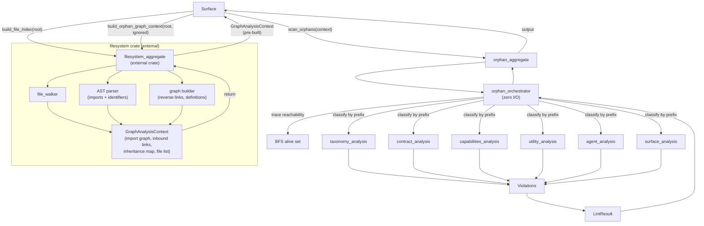

# FRD — orphan-rules

## Feature Overview

```mermaid
flowchart TD
    A["Surface"] -->|"build_file_index(root)"| D["filesystem_aggregate\n(external crate)"]
    A -->|"build_orphan_graph_context(root, ignored)"| D

    subgraph FS ["filesystem crate (external)"]
        D --> E1["file_walker"]
        D --> E2["AST parser\n(imports + identifiers)"]
        D --> E3["graph builder\n(reverse links, definitions)"]
        E1 --> G1["GraphAnalysisContext\n(import graph, inbound links,\ninheritance map, file list)"]
        E2 --> G1
        E3 --> G1
    end

    G1 -->|"return"| D
    D -->|"GraphAnalysisContext\n(pre-built)"| A

    A -->|"scan_orphans(context)"| B["orphan_aggregate"]
    B --> C["orphan_orchestrator\n(zero I/O)"]

    C -->|"trace reachability"| BFS["BFS alive set"]
    C -->|"classify by prefix"| H1["taxonomy_analysis"]
    C -->|"classify by prefix"| H2["contract_analysis"]
    C -->|"classify by prefix"| H3["capabilities_analysis"]
    C -->|"classify by prefix"| H4["utility_analysis"]
    C -->|"classify by prefix"| H5["agent_analysis"]
    C -->|"classify by prefix"| H6["surface_analysis"]

    H1 --> I["Violations"]
    H2 --> I
    H3 --> I
    H4 --> I
    H5 --> I
    H6 --> I
    I --> J["LintResult"]
    J --> C
    C --> B
    B -->|output| A

```

## Functional Requirements

### FR-OrphanRules-001: Graph Context, Entry Points, and Reachability

| Aspect | Detail|
|--------|-------|
| Description | Build the graph context and entry-point set that reachability checks run against. |
| Business Rules | BuildGraphContext sources the file graph from the filesystem aggregate (BuildOrphanGraphContext); IdentifyEntryPoints computes alive entry points (containers, mains, surfaces calling aggregates); fr001 asserts orchestration steps are inherent agent methods. Reachability flows entry point through DI implementation bridges to capabilities. |
| Edge Cases | Empty graph yields empty entry points without error; entry points computed from any subset still reach consistently; paths compared by absolute-path suffix so case/nesting differences still match. |
| Capability | ArchOrphanAnalyzer coordinates context building; shared filesystem serves graph data. |
| Protocol | IOrphanAggregate::execute resolves the context variants; IOrphanParserProtocol (parse_file, is_supported) parses files. |
| Method | execute(&self, request: OrphanRequest) -> OrphanResponse for BuildGraphContext and IdentifyEntryPoints; IOrphanParserProtocol parses each candidate file. |
| Input | Root path plus optional entries; source is OrphanRequest::{BuildGraphContext, IdentifyEntryPoints}. |
| Output | OrphanResponse::{GraphContext, EntryPoints} used by FR-OrphanRules-002..007. |
| Error | Unreadable trees skip nodes; missing entry points yield an empty alive set, causing downstream orphans (correct behavior). |
| Event | None; context build is synchronous. |
| Test | fr001_orchestration_steps_are_inherent_agent_methods asserts the orchestration steps; e2e_entry_point_detection_default_patterns derives the alive set from default container patterns, and e2e_empty_file_list_yields_no_entry_points expects an empty entry set from an empty file list. |
| Metric | Seeded container entry points identify the expected alive set; empty graphs produce empty context with zero errors. |

### FR-OrphanRules-002: Taxonomy Orphan Detection (AES501)

| Aspect | Detail|
|--------|-------|
| Description | Flag taxonomy files that no other layer imports (AES501). |
| Business Rules | A taxonomy file is alive only when imported by agent, capabilities, or surface layers; imports from other taxonomy files do not count (self-import only is still an orphan); helper/utility-suffix taxonomy files are categorized as utility and checked under utility rules, and utility-suffix files are flagged under taxonomy rules as well. |
| Edge Cases | Taxonomy imported by agent/capabilities/surface is not an orphan; imported only by other taxonomy is an orphan; self-import only is an orphan; helper suffix categorized as utility; utility suffix also flagged under taxonomy rules. |
| Capability | TaxonomyOrphanAnalyzer computes taxonomy reachability. |
| Protocol | ITaxonomyOrphanProtocol. |
| Method | is_taxonomy_orphan identifying taxonomy files with no alive cross-layer importer (AES501) |
| Input | Graph context and entry points; source is OrphanRequest::{Check, CheckWithContext, CheckWithEntries}. |
| Output | OrphanResponse::Violations with AES501 codes. |
| Error | Missing context causes a pre-check build rather than a crash; unreadable files are skipped. |
| Event | None. |
| Test | aes501_taxonomy_file_imported_by_surface_is_not_orphan, aes501_taxonomy_file_only_imported_by_other_taxonomy_is_orphan, aes501_taxonomy_file_with_self_import_only_is_orphan, and aes501_taxonomy_helper_suffix_categorized_as_utility assert rules. |
| Metric | Each seeded taxonomy orphan fires exactly one AES501 finding; cross-layer-imported taxonomy fixtures fire zero. |

### FR-OrphanRules-003: Contract Orphan Detection (AES502)

| Aspect | Detail|
|--------|-------|
| Description | Flag contract files whose traits have no alive implementor wired into the app (AES502). |
| Business Rules | A contract is alive when at least one implementor is reachable (DI bridge or direct wiring) from entry points; matching uses absolute-path suffix so same-basename files at different paths stay distinct; multiple traits in one file each evaluated independently; an implementor that is itself unreachable does not save the contract (still orphan); surface not calling an aggregate marks the aggregate contract orphan. |
| Edge Cases | Aggregate not called by surface is an orphan; implementor matched by absolute-path suffix is alive; same basename at different path stays orphan; implementor not alive remains orphan; multi-trait file with only one alive implementor keeps only that trait alive. |
| Capability | ContractOrphanAnalyzer resolves implementors per contract. |
| Protocol | IContractOrphanProtocol. |
| Method | is_contract_orphan mapping contracts to alive implementors (AES502) |
| Input | Graph context, entry points, and parsed entries; source is OrphanRequest check variants (Also OrphanRequest::Scan for full runs). |
| Output | OrphanResponse::Violations with AES502 codes; ScanOutcome for full scans. |
| Error | Unmatched references report orphan rather than erroring; unreadable files skipped. |
| Event | None. |
| Test | aes502_contract_wired_through_implementation, aes502_contract_implementor_same_basename_different_path_is_orphan, aes502_contract_implementor_not_alive_is_still_orphan, and aes502_aggregate_not_called_by_surface_is_orphan assert matching rules. |
| Metric | Seeded wired contract fires zero findings; each seeded unwired contract fires exactly one AES502 finding. |

### FR-OrphanRules-004: Capabilities Orphan Detection (AES503)

| Aspect | Detail|
|--------|-------|
| Description | Flag capability files unreachable from entry points through the DI wiring (AES503). |
| Business Rules | Reachability flows entry point to contract to implementation to capability; DI implementation bridges extend reachability (impl bridge edges wire implementor to capability); broken chains detect unreachable files; one reachable file satisfies it while sibling unwired files remain orphans; Python class bases register bridges for multiple inheritance; class without bases registers no bridge; reachability wraps implementation bridge edges. |
| Edge Cases | Reachable file not an orphan; broken chain detects unreachable; DI bridge reaches capabilities; unwired reachable file reports a DI bridge gap message; python chained imports reachable; multiple impls on one contract all examined. |
| Capability | CapabilitiesOrphanAnalyzer walks DI chains to capabilities. |
| Protocol | ICapabilitiesOrphanProtocol. |
| Method | is_capabilities_orphan walking DI chains over the graph plus bridge edges (AES503) |
| Input | Graph context with implementation bridges; source is OrphanRequest check variants. |
| Output | OrphanResponse::Violations with AES503 codes including violation display messages. |
| Error | Gap in wiring is reported as the violation itself (message mentions DI bridge gap), not a tool error. |
| Event | None. |
| Test | aes503_reachable_file_is_not_orphan, aes503_di_impl_bridge_reaches_capabilities, aes503_broken_chain_detects_unreachable, and aes503_reachable_unwired_message_mentions_di_bridge_gap assert reachability and messaging. |
| Metric | Seeded reachable capability fires zero; each seeded unwired capability fires one AES503 finding with the documented message. |

### FR-OrphanRules-005: Utility Orphan Detection (AES504)

| Aspect | Detail|
|--------|-------|
| Description | Flag utility files that nothing references (AES504). |
| Business Rules | A utility file is alive when any alive file imports or references it; pure helpers with no importers are orphans; suffix categorization routes helper-suffix files here (fr005 protocol). |
| Edge Cases | Utility imported by any alive file is not an orphan; unimported utility is an orphan; self-references do not count; empty content is handled without panic; categorization of utility suffix files verified by test_utility_suffix_categorization and aes501_taxonomy_helper_suffix_categorized_as_utility. |
| Capability | UtilityOrphanAnalyzer computes utility reachability. |
| Protocol | IUtilityOrphanProtocol. |
| Method | is_utility_orphan flagging utility files no alive file references (AES504) |
| Input | Graph context and entry points; source is OrphanRequest check variants. |
| Output | OrphanResponse::Violations with AES504 codes. |
| Error | Missing references produce a violation (the orphan), not an error. |
| Event | None. |
| Test | fr005_utility_orphan_analyzer_implements_protocol, utility_analyzer_is_object_safe, and test_utility_suffix_categorization assert contract and categorization. |
| Metric | Seeded unimported utility fires one AES504 finding; referenced utility fires zero. |

### FR-OrphanRules-006: Agent Orphan Detection (AES505)

| Aspect | Detail|
|--------|-------|
| Description | Flag agent orchestrator files whose aggregate is never used by surface, container, or main (AES505). |
| Business Rules | An agent is alive when its aggregate trait appears in the alive set via surface, container, or main usage; agent without aggregate traits in alive set is an orphan; an agent with aggregate traits not in the alive set is an orphan; agent even with no aggregate traits but reachable is not judged harshly (empty-alive-set rule: no orphan). |
| Edge Cases | Agent aggregate used by surface/container/main is not an orphan; aggregate trait never in alive set is an orphan; empty alive set yields no agent orphans; empty file not an orphan; display message contract covered by aes505_agent_violation_display_message. |
| Capability | AgentOrphanAnalyzer checks agent aggregate usage. |
| Protocol | IAgentOrphanProtocol. |
| Method | is_agent_orphan checking aggregate usage against the alive set (AES505) |
| Input | Graph context, entry points, alive aggregate set; source is OrphanRequest check variants. |
| Output | OrphanResponse::Violations with AES505 codes. |
| Error | Unreachable aggregate registers as orphan rather than failing. |
| Event | None. |
| Test | aes505_agent_with_aggregate_used_by_surface_is_not_orphan, aes505_no_aggregate_traits_not_in_alive_set_is_orphan, aes505_no_aggregate_traits_in_alive_set_is_not_orphan, and aes505_empty_content_is_not_orphan assert rules. |
| Metric | Seeded used agent fires zero; seeded unused agent fires exactly one AES505 finding. |

### FR-OrphanRules-007: Surface Orphan Detection (AES506)

| Aspect | Detail|
|--------|-------|
| Description | Flag surface files (render trees) that never get invoked (AES506). |
| Business Rules | A surface file is alive when invoked from entry flows (container/main wiring); uninvoled render trees are orphans; object-safety of the surfaces analyzer asserted by fr007; protocol surface normalizes display. |
| Edge Cases | Surface used from wiring is not an orphan; unused surface file is orphaned with its own violation kind; unchanged inputs classify deterministically; parse of surface tree with no entries yields no finding. |
| Capability | SurfacesOrphanAnalyzer checks surface reachability. |
| Protocol | ISurfacesOrphanProtocol. |
| Method | is_surface_orphan flagging render trees never invoked from entry flows (AES506) |
| Input | Graph context and registration data; source is OrphanRequest check variants. |
| Output | OrphanResponse::Violations with AES506 codes. |
| Error | No registration entry maps to an orphan finding; parse errors skip entries. |
| Event | None. |
| Test | fr007_surfaces_orphan_analyzer_implements_protocol and surfaces_analyzer_is_object_safe assert the analyzer contract. |
| Metric | Seeded wired surface fires zero; seeded unwired surface fires exactly one AES506 finding. |

## Public Interface

| Aspect | Detail|
|--------|-------|
| Agent | ArchOrphanAnalyzer — the agent-layer orchestrator behind the orphan-rule stage of the check command. |
| Aggregate | IOrphanAggregate — the feature's single front door. |
| Method | execute(&self, request: OrphanRequest) -> OrphanResponse |
| Request | OrphanRequest::{BuildGraphContext, IdentifyEntryPoints, Check, CheckWithContext, CheckWithEntries, Scan} |
| Response | OrphanResponse::{GraphContext, EntryPoints, Violations, ScanOutcome} |

## Reference

| Artifact | Purpose | Link |
|----------|---------|------|
| PRD | Business goals, user stories, and scope | [PRD.md](../../PRD.md) |
| Backlog | Task tracking, epics, and implementation status | [BACKLOG.md](BACKLOG.md) |
| Roadmap | Timeline, phasing, and dependencies | [ROADMAP.md](../../ROADMAP.md) |
| Architecture | System boundaries, tech stack, and infra | [ARCHITECTURE.md](../../ARCHITECTURE.md) |
