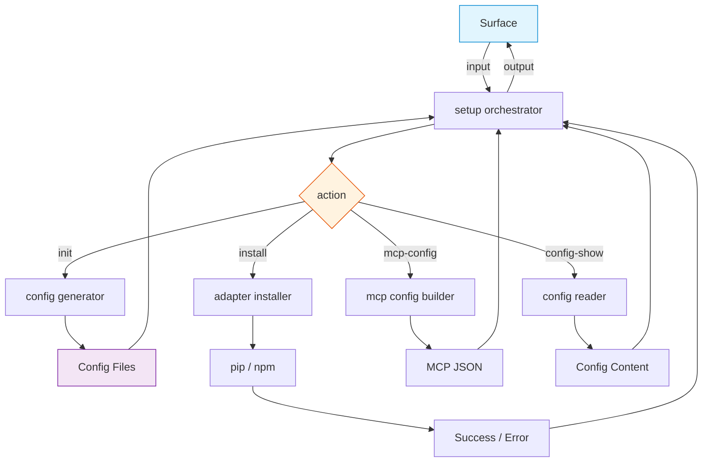

# FRD — project-setup (v1.11.0)

---

## System Overview

The project-setup crate provides scaffolding facilities and adapter
installation for new and existing projects. It detects project languages
(Rust, Python, JavaScript/TypeScript), generates MCP configuration for
different AI clients, creates `.env` files, installs linter adapters via
pip/npm, loads language-specific config templates, and manages XDG config
directories.

The crate follows the AES 7-layer architecture: the setup management
processor (capabilities) implements the setup management protocol, the setup
management orchestrator (agent) delegates to the protocol, and the setup
container (root) wires dependencies.

> **Note**: Environment diagnostics (`doctor`, `diagnose`) are handled by the
> **maintenance** crate, not project-setup. This crate focuses on scaffolding
> and installation only.

### Architecture & Data Flow



---

## Functional Requirements

### FR-001: MCP Configuration Generation

- **Description**: Generate MCP server configuration files in formats
  compatible with different AI clients.
- **Input**: `client: &str` (claude-code, cursor, windsurf, copilot, hermes,
  vscode, all), `TransportProtocol`.
- **Output**: `McpConfigVO` containing a JSON-compatible configuration map.
- **Business Rules**:

  - Base config:

    ```json
    {
      "lint-arwaky": {
        "command": "<resolved-binary-path>",
        "args": [],
        "alwaysAllow": ["execute_command", "list_commands", "read_skill", "health_check", "get_config"]
      }
    }
    ```
  - Client-specific wrappers:


    | Client      | Format                              |
    | ------------- | ------------------------------------- |
    | claude-code | `{"mcpServers": { ...base }}`       |
    | cursor      | `{"mcpServers": { ...base }}`       |
    | windsurf    | `{"mcpServers": { ...base }}`       |
    | copilot     | `{"mcpServers": { ...base }}`       |
    | hermes      | base config directly (no wrapper)   |
    | vscode      | `{"mcp": {"servers": { ...base }}}` |
    | all         | JSON object with all client formats |
  - Binary resolution priority (aligned with cli-commands FR-009):

    1. `LINT_ARWAKY_MCP_BIN` environment variable (must point to existing file).
    2. Sibling of current executable (`lint-arwaky-mcp` next to `lint-arwaky-cli`).
    3. `CARGO_HOME/bin/lint-arwaky-mcp` (`CARGO_HOME` defaults to `~/.cargo`).
    4. Bare name `lint-arwaky-mcp` (relies on OS PATH resolution at runtime).
- **Edge Cases**:

  - `LINT_ARWAKY_MCP_BIN` points to non-file → falls through to priority 2.
  - `CARGO_HOME` not set → defaults to `~/.cargo`.
  - Binary not found in any candidate → uses bare name `lint-arwaky-mcp`.
  - Unknown client → uses claude-code format as default.
- **Error Handling**:

  - `current_exe()` failure → skips sibling candidate.
  - `CARGO_HOME` env read failure → falls back to `~/.cargo`.

---

### FR-002: Environment File Generation

- **Description**: Generate `.env` configuration file for the lint-arwaky
  environment.
- **Input**: `DirectoryPath` (home directory for the project).
- **Output**: `EnvContentVO` with environment variable content including
  `PHANTOM_ROOT`.
- **Business Rules**:

  - Creates the home directory if it does not exist.
  - Content format:
    ```
    # Lint Arwaky Environment Configuration
    # Generated by: lint-arwaky init

    # Phantom root (for JS/TS linters):
    PHANTOM_ROOT=<home>/
    ```
- **Edge Cases**:

  - Home directory creation fails → continues (may fail at write time).
  - Home path is empty → `PHANTOM_ROOT=/`.
- **Error Handling**: Directory creation failure: non-fatal, generation
  continues.

---

### FR-003: Language Detection

- **Description**: Detect programming languages present in a project
  directory.
- **Input**: None (scans current working directory).
- **Output**: `ProjectLanguagesVO` containing a list of detected
  `ProjectLanguageVO` items.
- **Business Rules**:

  - Phase 1 (marker-based): checks for `crates/`, `Cargo.toml` (Rust),
    `packages/`, `modules/`, `pyproject.toml`, `setup.py`, `requirements.txt`
    (Python), `package.json`, `tsconfig.json` (JavaScript/TypeScript).
  - Phase 2 (file-extension scan): recursively scans directory tree
    (depth ≤ 4) for `.rs`, `.py`, `.ts`, `.tsx`, `.mts`, `.cts`, `.js`,
    `.jsx`, `.mjs`, `.cjs` extensions.
  - Skips hidden dirs, `target/`, `node_modules/`, `vendor/`, `dist/`,
    `build/`, `__pycache__/`.
  - **No default language** — if no languages detected, returns empty list.
    Caller decides how to handle (prompt user, skip config generation, or
    use explicit `--language` flag).
- **Edge Cases**:

  - All three languages found in Phase 1 → skips Phase 2.
  - Empty directory → returns empty list.
  - Permission denied on subdirectory → skipped silently.
  - Symlinks → followed if target is within workspace root, skipped otherwise.
- **Error Handling**: `read_dir` failure on a directory → skipped, continues
  scan.

---

### FR-004: Adapter Installation

- **Description**: Install linter adapters for Python and JavaScript
  projects.
- **Input**: `sudo: bool` (for npm global installs).
- **Output**: `SuccessStatus` indicating success or failure.
- **Business Rules**:

  - Python adapters: `ruff`, `mypy`, `bandit` installed via
    `pip install --user`.
  - JavaScript adapters: `eslint`, `prettier`, `typescript` installed via
    `npm install -g`.
  - Rust adapters (clippy, rustfmt, cargo-audit): **not installed by
    project-setup** — managed via `rustup`. Print suggestion:
    "Rust tools are managed via rustup. Run `rustup component add clippy rustfmt`
    and `cargo install cargo-audit`."
  - Python installer retries with `--break-system-packages` on failure
    (PEP 668 compatibility).
  - JavaScript installer supports `sudo` prefix for global installations.
  - Empty package list → returns `Ok(())` immediately.
- **Edge Cases**:

  - `pip` not installed → returns error with spawn failure message.
  - `npm` not installed → returns error with spawn failure message.
  - `pip install --user` fails but `--break-system-packages` succeeds →
    returns `Ok(())`.
  - Network failure during install → returns error with process exit status.
- **Error Handling**:

  - Command spawn failure → returns an IO setup error.
  - Command exits with non-zero status → returns an other setup error.

---

### FR-005: Config Template Loading

- **Description**: Load language-specific lint-arwaky configuration
  templates.
- **Input**: Language identifier string (`"rust"`, `"python"`,
  `"javascript"`, `"typescript"`).
- **Output**: `Result<&'static str, SetupError>` — embedded YAML config
  content, or error for unknown language.
- **Business Rules**:

  - `"rust"`, `"python"`, `"javascript"`, `"typescript"` → `lint_arwaky.config.yaml` (unified)
  - Unknown language → returns `Err(SetupError::UnknownLanguage)` with
    list of supported languages. **No silent default.**
  - Templates are embedded at compile time.
- **Edge Cases**:

  - Empty string → returns error with supported languages list.
  - Case mismatch (e.g., `"Rust"`) → normalized to lowercase before lookup.
- **Error Handling**: Unknown language → `SetupError::UnknownLanguage`.

---

### FR-006: Config File Writing and Global Config Directory

- **Description**: Write configuration files to disk and create XDG-compliant
  global config directories.
- **Input**: Filename + content (for write), or none (for directory
  creation).
- **Output**: `WriteConfigResult` (description with byte count) or
  `CreateConfigDirResult` (PathBuf to created dir).
- **Business Rules**:

  - Config directory: `~/.config/lint-arwaky/` (XDG `config_dir`).
  - Write reports byte count: `"wrote <filename> (<N> bytes)"`.
- **Edge Cases**:

  - XDG config dir cannot be determined → returns an invalid state error.
  - Directory already exists → directory creation is idempotent.
  - File already exists → overwritten.
- **Error Handling**:

  - Write failure → returns an IO setup error.
  - Directory creation failure → returns an IO setup error.

---

### FR-007: Pre-flight Check

- **Description**: Verify that package managers (pip, npm) are available
  before adapter installation. This is a lightweight pre-check, not a full
  toolchain diagnostic (full diagnostics are in the maintenance crate).
- **Input**: None.
- **Output**: JSON status of package manager availability.
- **Business Rules**:

  - Checks `pip` (or `python3 -m pip`) availability.
  - Checks `npm` availability.
  - Returns `{"tool": "<name>", "status": "ok" | "not_found"}` for each.
  - Used by `install` command to provide early feedback before attempting
    installation.
- **Edge Cases**:

  - `which` not available on system → falls back to direct spawn attempt.
- **Error Handling**: Process spawn failure → treated as `not_found`.

---

## API Contract


| Operation                      | Input             | Output                           | Purpose                                      |
| -------------------------------- | ------------------- | ---------------------------------- | ---------------------------------------------- |
| Generate MCP config            | client, transport | MCP config                       | Generate client-specific MCP config          |
| Generate env file              | home path         | Environment content              | Generate .env file content                   |
| Detect primary language        | —                | Project language                 | Detect primary project language              |
| Detect all languages           | —                | Project languages                | Detect all project languages                 |
| Get config template            | language string   | Embedded config content or error | Load embedded YAML config template           |
| Write config file              | filename, content | Write result                     | Write config file to disk                    |
| Create global config directory | —                | Created directory path           | Create XDG config directory                  |
| Install Python adapters        | —                | Success status                   | Install ruff, mypy, bandit via pip           |
| Install JavaScript adapters    | sudo flag         | Success status                   | Install eslint, prettier, typescript via npm |
| Pre-flight check               | —                | Package manager status           | Check pip/npm availability                   |
| Check file exists              | path string       | Boolean                          | Check if file exists                         |

---

## Integration Points

- **Internal**:

  - The shared crate: value objects, contracts (setup management protocol,
    setup installer protocol, setup management aggregate), and utilities
    (filesystem checker, setup I/O).
- **External**:

  - `pip` / `python3 -m pip`: Python package installation.
  - `npm`: JavaScript package installation.
  - `dirs` crate: XDG config directory resolution.
  - Filesystem: config file writing, directory creation, file existence checks.
  - Embedded YAML templates: compile-time embedded config files per language.
  - No async runtime dependency.

---

## Non-functional Requirements

- **Performance**: Language detection scans up to depth 4; early termination
  when all languages found. Adapter installation is I/O-bound
  (network + subprocess).
- **Memory**: Config templates are compile-time embedded (zero runtime
  allocation). Language detection uses mutable booleans, not collections.
- **Accuracy**: MCP config formats must match client expectations (Claude,
  Cursor, Windsurf, Copilot, Hermes, VS Code). Binary resolution must find
  the correct `lint-arwaky-mcp` path.
- **Reliability**: Adapter installation retries with
  `--break-system-packages` for PEP 668 compatibility on modern Linux
  distros.
- **Portability**: Supports Linux, macOS, Windows (pip works cross-platform;
  npm requires Node.js).

---

## Test Scenarios / QA Checklist

### FR-001 — MCP Config


| #  | Scenario                  | Expected                                      | Rule   |
| ---- | --------------------------- | ----------------------------------------------- | -------- |
| 1  | Claude config             | `mcpServers` wrapper with `lint-arwaky` entry | FR-001 |
| 2  | Cursor config             | `mcpServers` wrapper                          | FR-001 |
| 3  | Windsurf config           | `mcpServers` wrapper                          | FR-001 |
| 4  | Copilot config            | `mcpServers` wrapper                          | FR-001 |
| 5  | Hermes config             | Base config without wrapper                   | FR-001 |
| 6  | VS Code config            | `mcp.servers` wrapper                         | FR-001 |
| 7  | `all` client              | All client formats in one JSON                | FR-001 |
| 8  | Binary in CARGO_HOME/bin  | Resolved path used                            | FR-001 |
| 9  | Binary not found anywhere | Bare name`lint-arwaky-mcp`                    | FR-001 |
| 10 | LINT_ARWAKY_MCP_BIN set   | Env var path used                             | FR-001 |

### FR-002 — Env File


| # | Scenario         | Expected                   | Rule   |
| --- | ------------------ | ---------------------------- | -------- |
| 1 | Normal home path | Correct PHANTOM_ROOT value | FR-002 |
| 2 | Empty home path  | PHANTOM_ROOT=/             | FR-002 |

### FR-003 — Language Detection


| # | Scenario                    | Expected                | Rule   |
| --- | ----------------------------- | ------------------------- | -------- |
| 1 | Cargo.toml exists           | Rust detected           | FR-003 |
| 2 | pyproject.toml exists       | Python detected         | FR-003 |
| 3 | package.json exists         | JavaScript detected     | FR-003 |
| 4 | Empty directory             | Empty list (no default) | FR-003 |
| 5 | Multi-language project      | All detected languages  | FR-003 |
| 6 | target/, node_modules/ dirs | Skipped                 | FR-003 |

### FR-004 — Adapter Installation


| # | Scenario             | Expected                                  | Rule   |
| --- | ---------------------- | ------------------------------------------- | -------- |
| 1 | Python install       | pip install --user ruff mypy bandit       | FR-004 |
| 2 | Python PEP 668 retry | --break-system-packages on failure        | FR-004 |
| 3 | JS install           | npm install -g eslint prettier typescript | FR-004 |
| 4 | JS install with sudo | sudo npm install -g                       | FR-004 |
| 5 | Rust tools           | Suggestion message (not installed)        | FR-004 |
| 6 | Empty package list   | Ok(()) without spawning                   | FR-004 |

### FR-005 — Config Template


| # | Scenario               | Expected                            | Rule   |
| --- | ------------------------ | ------------------------------------- | -------- |
| 1 | "rust"                 | Rust config template                | FR-005 |
| 2 | "python"               | Python config template              | FR-005 |
| 3 | "typescript"           | TypeScript config template          | FR-005 |
| 4 | Unknown language       | Error with supported languages list | FR-005 |
| 5 | "Rust" (case mismatch) | Normalized to "rust"                | FR-005 |

### FR-006 — Config Writing


| # | Scenario                 | Expected                       | Rule   |
| --- | -------------------------- | -------------------------------- | -------- |
| 1 | Write config file        | Byte count in description      | FR-006 |
| 2 | Create global config dir | ~/.config/lint-arwaky/ created | FR-006 |
| 3 | Dir already exists       | Idempotent                     | FR-006 |

### FR-007 — Pre-flight Check


| # | Scenario      | Expected           | Rule   |
| --- | --------------- | -------------------- | -------- |
| 1 | pip available | status "ok"        | FR-007 |
| 2 | npm not found | status "not_found" | FR-007 |

---

## Assumptions & Constraints

- `pip` and `npm` are available on the system when adapter installation is
  requested.
- The working directory is the project root when language detection runs.
- Embedded YAML config templates are valid and complete at compile time.
- XDG config directory is available on the target platform (Linux, macOS).
- The `dirs` crate correctly resolves the config directory.
- Rust tools (clippy, rustfmt, cargo-audit) are managed via `rustup`, not
  by project-setup.
- Full toolchain diagnostics (`doctor`, `diagnose`) are handled by the
  maintenance crate, not project-setup.
- No async runtime dependency.

---

## Glossary


| Term                | Definition                                                                                                                  |
| --------------------- | ----------------------------------------------------------------------------------------------------------------------------- |
| **AES**             | Agentic Engineering System — the 7-layer coding convention                                                                 |
| **MCP**             | Model Context Protocol — JSON-RPC standard for AI agent tool integration                                                   |
| **Adapter**         | External linter binary (ruff, mypy, clippy, eslint, etc.)                                                                   |
| **PEP 668**         | Python enhancement proposal marking system-managed Python environments; requires`--break-system-packages` for `pip install` |
| **XDG**             | X Desktop Group base directory specification (`~/.config`, `~/.local/share`, etc.)                                          |
| **PHANTOM_ROOT**    | Environment variable used by JS/TS linters to resolve project root                                                          |
| **Config template** | Embedded YAML file providing default lint-arwaky configuration per language                                                 |

---

## Reference

- PRD: [PRD.md](../../PRD.md)
- Architecture: [ARCHITECTURE.md](../../ARCHITECTURE.md)
- CLI Commands FRD: `crates/cli-commands/FRD.md` (FR-009 MCP binary resolution)
- Maintenance FRD: `crates/maintenance/FRD.md` (doctor, diagnose)
- MCP Server FRD: `crates/mcp-server/FRD.md`
