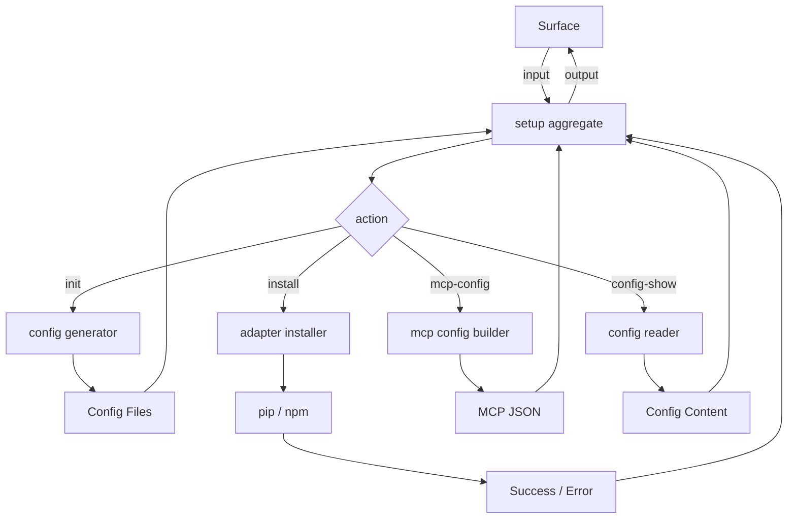

# FRD — project-setup (v2.0.0)

---

## Reference

- Backlog: [BACKLOG.md](BACKLOG.md) — real condition for this feature; this file is specification only.
- PRD: [PRD.md](../../PRD.md)
- Architecture: [ARCHITECTURE.md](../../ARCHITECTURE.md)
- CLI Commands FRD: `crates/cli-commands/FRD.md` (FR-PROJECTSETUP-009 MCP binary resolution)
- Maintenance FRD: `crates/maintenance/FRD.md` (doctor, diagnose)
- MCP Server FRD: `crates/mcp-server/FRD.md`

## System Overview

The project-setup crate provides scaffolding facilities and adapter
installation for new and existing projects. It detects project languages
(Rust, Python, JavaScript/TypeScript), generates MCP configuration for
different AI clients, creates `.env` files, installs linter adapters via
pip/npm, loads language-specific config templates, and manages XDG config
directories.

The crate follows the AES 7-layer architecture: the setup management
processor (capabilities) implements the setup management protocol, the setup
management orchestrator (agent) delegates to the protocol, and the setup
container (root) wires dependencies.

> **Note**: Environment diagnostics (`doctor`, `diagnose`) are handled by the
> **maintenance** crate, not project-setup. This crate focuses on scaffolding
> and installation only.

### Architecture & Data Flow


```mermaid
flowchart TD
    A["Surface"] -->|input| B["setup aggregate"]
    B --> C{"action"}

    C -->|"init"| D["config generator"]
    C -->|"install"| E["adapter installer"]
    C -->|"mcp-config"| F["mcp config builder"]
    C -->|"config-show"| G["config reader"]

    D --> H["Config Files"]
    E --> I["pip / npm"]
    I --> J["Success / Error"]
    F --> K["MCP JSON"]
    G --> L["Config Content"]

    H --> B
    J --> B
    K --> B
    L --> B
    B -->|output| A

```

---

## Functional Requirements

### FR-PROJECTSETUP-001: MCP Configuration Generation

- **Description**: Generate MCP server configuration files in formats
  compatible with different AI clients.
- **Input**: `client: &str` (claude-code, cursor, windsurf, copilot, hermes,
  vscode, all), `TransportProtocol`.
- **Output**: `McpConfigVO` containing a JSON-compatible configuration map.
- **Business Rules**:

  - Base config:

    ```json
    {
      "lint-arwaky": {
        "command": "<resolved-binary-path>",
        "args": [],
        "alwaysAllow": ["execute_command", "list_commands", "read_skill", "health_check", "get_config"]
      }
    }
    ```
  - Client-specific wrappers:

    | Client      | Format                              |
    | ------------- | ------------------------------------- |
    | claude-code | `{"mcpServers": { ...base }}`       |
    | cursor      | `{"mcpServers": { ...base }}`       |
    | windsurf    | `{"mcpServers": { ...base }}`       |
    | copilot     | `{"mcpServers": { ...base }}`       |
    | hermes      | base config directly (no wrapper)   |
    | vscode      | `{"mcp": {"servers": { ...base }}}` |
    | all         | JSON object with all client formats |
  - Binary resolution priority (aligned with cli-commands FR-PROJECTSETUP-009):

    1. `LINT_ARWAKY_MCP_BIN` environment variable (must point to existing file).
    2. Sibling of current executable (`lint-arwaky-mcp` next to `lint-arwaky-cli`).
    3. `CARGO_HOME/bin/lint-arwaky-mcp` (`CARGO_HOME` defaults to `~/.cargo`).
    4. Bare name `lint-arwaky-mcp` (relies on OS PATH resolution at runtime).
- **Edge Cases**:

  - `LINT_ARWAKY_MCP_BIN` points to non-file → falls through to priority 2.
  - `CARGO_HOME` not set → defaults to `~/.cargo`.
  - Binary not found in any candidate → uses bare name `lint-arwaky-mcp`.
  - Unknown client → uses claude-code format as default.
- **Error Handling**:

  - `current_exe()` failure → skips sibling candidate.
  - `CARGO_HOME` env read failure → falls back to `~/.cargo`.

---

### FR-PROJECTSETUP-002: Environment File Generation

- **Description**: Generate `.env` configuration file for the lint-arwaky
  environment.
- **Input**: `DirectoryPath` (home directory for the project).
- **Output**: `EnvContentVO` with environment variable content including
  `PHANTOM_ROOT`.
- **Business Rules**:

  - Creates the home directory if it does not exist.
  - Content format:
    ```
    # Lint Arwaky Environment Configuration
    # Generated by: lint-arwaky init

    # Phantom root (for JS/TS linters):
    PHANTOM_ROOT=<home>/
    ```
- **Edge Cases**:

  - Home directory creation fails → continues (may fail at write time).
  - Home path is empty → `PHANTOM_ROOT=/`.
- **Error Handling**: Directory creation failure: non-fatal, generation
  continues.

---

### FR-PROJECTSETUP-003: Language Detection

- **Description**: Detect programming languages present in a project
  directory.
- **Input**: None (scans current working directory).
- **Output**: `ProjectLanguagesVO` containing a list of detected
  `ProjectLanguageVO` items.
- **Business Rules**:

  - Phase 1 (marker-based): checks for `crates/`, `Cargo.toml` (Rust),
    `packages/`, `modules/`, `pyproject.toml`, the Python setup script,
    `requirements.txt` (Python), `package.json`, `tsconfig.json`
    (JavaScript/TypeScript).
  - Phase 2 (file-extension scan): recursively scans directory tree
    (depth ≤ 4) for `.rs`, `.py`, `.ts`, `.tsx`, `.mts`, `.cts`, `.js`,
    `.jsx`, `.mjs`, `.cjs` extensions.
  - Skips hidden dirs and default ignored paths (`target/`, `node_modules/`,
    `vendor/`, `dist/`, `build/`, `__pycache__/`).
  - **No default language** — if no languages detected, returns empty list.
    Caller decides how to handle (prompt user, skip config generation, or
    use explicit `--language` flag).
- **Edge Cases**:

  - All three languages found in Phase 1 → skips Phase 2.
  - Empty directory → returns empty list.
  - Permission denied on subdirectory → skipped silently.
  - Symlinks → followed if target is within workspace root, skipped otherwise.
- **Error Handling**: `read_dir` failure on a directory → skipped, continues
  scan.

---

### FR-PROJECTSETUP-004: Adapter Installation

- **Description**: Install linter adapters for Python and JavaScript
  projects.
- **Input**: `sudo: bool` (for npm global installs).
- **Output**: `SuccessStatus` indicating success or failure.
- **Business Rules**:

  - Python adapters: `ruff`, `mypy`, `bandit` installed via
    `pip install --user`.
  - JavaScript adapters: `eslint`, `prettier`, `typescript` installed via
    `npm install -g`.
  - Rust adapters (clippy, rustfmt, cargo-audit): **not installed by
    project-setup** — managed via `rustup`. Print suggestion:
    "Rust tools are managed via rustup. Run `rustup component add clippy rustfmt`
    and `cargo install cargo-audit`."
  - Python installer retries with `--break-system-packages` on failure
    (PEP 668 compatibility).
  - JavaScript installer supports `sudo` prefix for global installations.
  - Empty package list → returns `Ok(())` immediately.
- **Edge Cases**:

  - `pip` not installed → returns error with spawn failure message.
  - `npm` not installed → returns error with spawn failure message.
  - `pip install --user` fails but `--break-system-packages` succeeds →
    returns `Ok(())`.
  - Network failure during install → returns error with process exit status.
- **Error Handling**:

  - Command spawn failure → returns an IO setup error.
  - Command exits with non-zero status → returns an other setup error.

---

### FR-PROJECTSETUP-005: Config Template Loading

- **Description**: Load language-specific lint-arwaky configuration
  templates.
- **Input**: Language identifier string (`"rust"`, `"python"`,
  `"javascript"`, `"typescript"`, `"all"`).
- **Output**: `Result<&'static str, SetupError>` — embedded YAML config
  content, or error for unknown language.
- **Business Rules**:

  - `"rust"`, `"python"`, `"javascript"`, `"typescript"`, `"all"` → `lint_arwaky.config.yaml` (unified)
  - `"all"` is the fallback used when the detectable-language list is empty, so
    `init` still writes a config in a directory with no recognized source files
  - Unknown language → returns `Err(SetupError::UnknownLanguage)` with
    list of supported languages. **No silent default.**
  - Templates are embedded at compile time.
- **Edge Cases**:

  - Empty string → returns error with supported languages list.
  - Case mismatch (e.g., `"Rust"`) → normalized to lowercase before lookup.
- **Error Handling**: Unknown language → `SetupError::UnknownLanguage`.

---

### FR-PROJECTSETUP-006: Config File Writing and Global Config Directory

- **Description**: Write configuration files to disk and create XDG-compliant
  global config directories.
- **Input**: Filename + content (for write), or none (for directory
  creation).
- **Output**: `WriteConfigResult` (description with byte count) or
  `CreateConfigDirResult` (PathBuf to created dir).
- **Business Rules**:

  - Config directory: `~/.config/lint-arwaky/` (XDG `config_dir`).
  - Write reports byte count: `"wrote <filename> (<N> bytes)"`.
- **Edge Cases**:

  - XDG config dir cannot be determined → returns an invalid state error.
  - Directory already exists → directory creation is idempotent.
  - File already exists → overwritten.
- **Error Handling**:

  - Write failure → returns an IO setup error.
  - Directory creation failure → returns an IO setup error.

---

### FR-PROJECTSETUP-007: Pre-flight Check

- **Description**: Verify that package managers (pip, npm) are available
  before adapter installation. This is a lightweight pre-check, not a full
  toolchain diagnostic (full diagnostics are in the maintenance crate).
- **Input**: None.
- **Output**: JSON status of package manager availability.
- **Business Rules**:

  - Checks `pip` (or `python3 -m pip`) availability.
  - Checks `npm` availability.
  - Returns `{"tool": "<name>", "status": "ok" | "not_found"}` for each.
  - Used by `install` command to provide early feedback before attempting
    installation.
- **Edge Cases**:

  - `which` not available on system → falls back to direct spawn attempt.
- **Error Handling**: Process spawn failure → treated as `not_found`.

---

### FR-PROJECTSETUP-008: File Existence Check

- **Description**: Check whether a file exists at the given path.
- **Input**: Path string.
- **Output**: Boolean indicating file existence.
- **Business Rules**:

  - Delegates to `std::path::Path::new(path).exists()`.
- **Edge Cases**:

  - Path with special characters — returned result reflects the actual filesystem state.
  - Path pointing to a directory rather than a file — the check reflects whatever exists at that path.
- **Error Handling**: Non-existent path returns `false`.

---

## API Contract

### Protocol API

| Method | Input | Output | Error | Event | Description |
| --- | --- | --- | --- | --- | --- |
| `execute` | `SetupRequest` | `SetupResponse` | Setup errors carried in the response variant | — | Single composite entry point on the setup management protocol, dispatching every request variant to the setup capabilities. |

### Aggregate API

| Method | Input | Output | Error | Event | Description |
| --- | --- | --- | --- | --- | --- |
| `execute` | `SetupRequest` | `SetupResponse` | Setup errors carried in the response variant | — | Dispatch a typed setup request to the matching capability. |
| `generate_mcp_config` | client name, transport | `McpConfigVO` | None | — | Generate the MCP configuration in the format the named client expects. |
| `mcp_config_claude` | transport | `McpConfigVO` | None | — | Generate the `mcpServers` wrapper format used by Claude Code. |
| `mcp_config_cursor` | transport | `McpConfigVO` | None | — | Generate the `mcpServers` wrapper format used by Cursor. |
| `mcp_config_windsurf` | transport | `McpConfigVO` | None | — | Generate the `mcpServers` wrapper format used by Windsurf. |
| `mcp_config_copilot` | transport | `McpConfigVO` | None | — | Generate the `mcpServers` wrapper format used by Copilot. |
| `mcp_config_hermes` | transport | `McpConfigVO` | None | — | Generate the unwrapped base configuration used by Hermes. |
| `mcp_config_vscode` | transport | `McpConfigVO` | None | — | Generate the `mcp.servers` wrapper format used by VS Code. |
| `mcp_config_all` | transport | `McpConfigVO` | None | — | Generate one JSON object holding every client format. |
| `generate_env` | `DirectoryPath` | `EnvContentVO` | Directory creation failure is non-fatal | — | Generate environment file content including the phantom root value. |
| `detect_language` | — | `Option<ProjectLanguageVO>` | Unreadable directory → skipped | — | Return the primary detected project language, or none when nothing is found. |
| `detect_languages` | — | `ProjectLanguagesVO` | Unreadable directory → skipped | — | Return every language detected in the project directory. |
| `get_config_template` | Language string | `Result<&'static str, SetupError>` | `SetupError::UnknownLanguage` with the supported list | — | Return the embedded YAML configuration template for a language. |
| `get_embedded_skills` | — | `&'static [EmbeddedSkillVO]` | None | — | Return the skill definitions installed by the init command. |
| `write_config_file` | Filename, content | `WriteConfigResult` | IO setup error on write failure | — | Write a configuration file to disk and report the byte count written. |
| `create_global_config_dir` | — | `CreateConfigDirResult` | Invalid state error when the XDG directory cannot be determined; IO setup error on creation failure | — | Create the XDG-compliant global configuration directory. |
| `install_python_adapters` | — | `SuccessStatus` | IO setup error on spawn failure; other setup error on non-zero exit | — | Install the Python linter adapters through pip. |
| `install_javascript_adapters` | `sudo: bool` | `SuccessStatus` | IO setup error on spawn failure; other setup error on non-zero exit | — | Install the JavaScript linter adapters through npm. |
| `pre_flight_check` | — | `PreFlightResult` | Spawn failure reported as `not_found` | — | Report whether the pip and npm package managers are available. |
| `file_exists` | Path string | `bool` | None | — | Report whether a file exists at the given path. |
| `check_http` | `TransportUrlVO` | `SuccessStatus` | Non-zero exit reported as failure | — | Probe a transport endpoint for reachability. |

---

## Integration Points

| System | Direction | Purpose | Failure mode |
| --- | --- | --- | --- |
| `shared` crate | in | Value objects, contract traits, and I/O utilities for the setup pipeline | Compile-time dependency; unavailable at build time |
| `pip` / `python3 -m pip` | in | Install Python linter adapters (`ruff`, `mypy`, `bandit`) | Spawn failure → IO setup error; non-zero exit → other setup error |
| `npm` | in | Install JavaScript linter adapters (`eslint`, `prettier`, `typescript`) | Spawn failure → IO setup error; non-zero exit → other setup error |
| `dirs` crate | in | Resolve XDG-compliant config directory | Directory resolution failure → invalid state error |
| Filesystem I/O | in | Write config files, create global config directory, check file existence | Write failure → IO setup error; directory creation failure → IO setup error |
| Embedded YAML templates | in | Provide default configuration templates per language at compile time | Unknown language → `SetupError::UnknownLanguage` |
| Rust toolchain (`rustup`) | out | Consumer receives suggestion to use `rustup component add` for Rust linters | Adapter not installed — user must run `rustup` manually |
| Lint-arwaky CLI binary | out | Child process resolved via binary resolution chain; used by MCP config generation | Binary not found → bare name emitted in config |

---

## Non-functional Requirements

| Metric | Target | Measurement method |
| --- | --- | --- |
| Language detection depth | Scans up to depth 4 | Detect languages in a project with sources nested four levels deep |
| Language detection early termination | Stops once all languages are found | Detect in a project with all three languages; confirm the extension scan is skipped |
| Adapter installation | I/O-bound; completion time bounded by subprocess and network, not CPU | Time a full adapter installation run |
| Memory: config templates | Compile-time embedded, zero runtime allocation | Confirm no filesystem read for templates at runtime |
| Memory: language detection | Uses mutable flags, not collections | Inspect the detection loop for collection allocation |
| MCP config format accuracy | Formats match expectations for Claude, Cursor, Windsurf, Copilot, Hermes, and VS Code | Generate each client config and validate its structure against the client spec |
| Binary resolution accuracy | Resolves the correct `lint-arwaky-mcp` path | Generate a config with the binary installed at each candidate location |
| PEP 668 compatibility | Python install retries with `--break-system-packages` | Attempt an install on a PEP 668 managed environment and confirm the retry succeeds |
| Portability | Runs on Linux, macOS, and Windows; npm requires Node.js | Run the init flow on each supported platform |

---

## Test Scenarios

- Generating the Claude Code config produces an `mcpServers` wrapper containing the `lint-arwaky` entry.
- Generating the Cursor config produces an `mcpServers` wrapper.
- Generating the Windsurf config produces an `mcpServers` wrapper.
- Generating the Copilot config produces an `mcpServers` wrapper.
- Generating the Hermes config produces the base config without a wrapper.
- Generating the VS Code config produces an `mcp.servers` wrapper.
- Generating the `all` client config produces every client format in one JSON object.
- A binary present in the cargo home bin directory is used as the resolved path.
- A binary absent from every candidate location yields the bare name `lint-arwaky-mcp`.
- A set `LINT_ARWAKY_MCP_BIN` environment variable supplies the resolved path.
- A normal home path yields the correct phantom root value.
- An empty home path yields `PHANTOM_ROOT=/`.
- A project with `Cargo.toml` detects Rust.
- A project with `pyproject.toml` detects Python.
- A project with `package.json` detects JavaScript.
- An empty directory returns an empty list with no default language.
- A multi-language project detects all of its languages.
- `target/` and `node_modules/` directories are skipped during detection.
- A Python install runs pip with the user flag for the Python adapters.
- A Python install on a PEP 668 environment retries with the break-system-packages flag.
- A JavaScript install runs a global npm install for the JavaScript adapters.
- A JavaScript install with the sudo flag prefixes the npm command with sudo.
- Rust tools produce a suggestion message rather than an install.
- An empty package list returns `Ok(())` without spawning a process.
- Requesting the `"rust"` template returns the Rust config template.
- Requesting the `"python"` template returns the Python config template.
- Requesting the `"typescript"` template returns the TypeScript config template.
- Requesting an unknown language returns an error listing the supported languages.
- Requesting `"Rust"` normalizes the case and returns the Rust template.
- Writing a config file reports the byte count in its description.
- Creating the global config directory creates the XDG config path.
- Creating the global config directory when it already exists is idempotent.
- A pre-flight check with pip available reports status `ok`.
- A pre-flight check with npm absent reports status `not_found`.

---

## Assumptions & Constraints

- `pip` and `npm` are available on the system when adapter installation is
  requested.
- The working directory is the project root when language detection runs.
- Embedded YAML config templates are valid and complete at compile time.
- XDG config directory is available on the target platform (Linux, macOS).
- The `dirs` crate correctly resolves the config directory.
- Rust tools (clippy, rustfmt, cargo-audit) are managed via `rustup`, not
  by project-setup.
- Full toolchain diagnostics (`doctor`, `diagnose`) are handled by the
  maintenance crate, not project-setup.
- No async runtime dependency.

---

## Glossary

- **AES**: Agentic Engineering System — the 7-layer coding convention.
- **MCP**: Model Context Protocol — JSON-RPC standard for AI agent tool integration.
- **Adapter**: External linter binary (ruff, mypy, clippy, eslint, etc.).
- **PEP 668**: Python enhancement proposal marking system-managed Python environments; requires `--break-system-packages` for `pip install`.
- **XDG**: X Desktop Group base directory specification (`~/.config`, `~/.local/share`, etc.).
- **PHANTOM_ROOT**: Environment variable used by JS/TS linters to resolve the project root.
- **Config template**: Embedded YAML content providing the default lint-arwaky configuration for a language.

---
