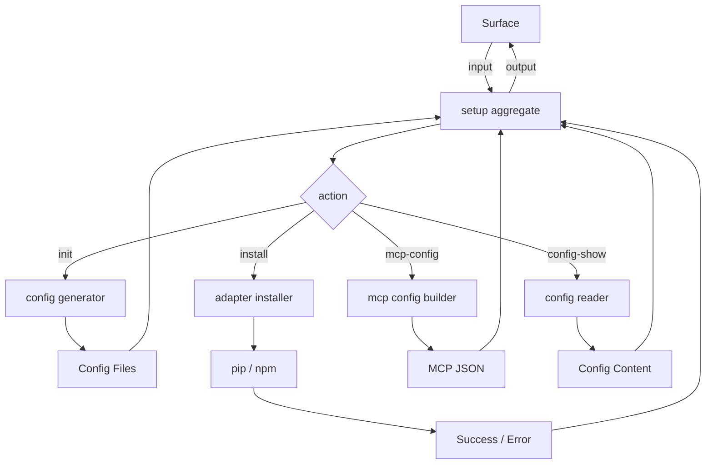

# FRD — project-setup (v2.0.0)

---

## Reference

- Backlog: [BACKLOG.md](BACKLOG.md) — real condition for this feature; this file is specification only.
- PRD: [PRD.md](../../PRD.md)
- Architecture: [ARCHITECTURE.md](../../ARCHITECTURE.md)
- Maintenance FRD: `crates/maintenance/FRD.md` (doctor, diagnose)

## System Overview

The project-setup crate provides scaffolding facilities and adapter
installation for new and existing projects. It detects project languages
(Rust, Python, JavaScript/TypeScript), generates MCP configuration for
different AI clients, creates `.env` files, installs linter adapters via
pip/npm, loads language-specific config templates, and manages XDG config
directories.

The crate follows the AES 7-layer architecture: the setup management
processor (capabilities) implements the setup management protocol, the setup
management orchestrator (agent) delegates to the protocol, and the setup
container (root) wires dependencies.

> **Note**: Environment diagnostics (`doctor`, `diagnose`) are handled by the
> **maintenance** crate, not project-setup. This crate focuses on scaffolding
> and installation only.

### Architecture & Data Flow


```mermaid
flowchart TD
    A["Surface"] -->|input| B["setup aggregate"]
    B --> C{"action"}

    C -->|"init"| D["config generator"]
    C -->|"install"| E["adapter installer"]
    C -->|"mcp-config"| F["mcp config builder"]
    C -->|"config-show"| G["config reader"]

    D --> H["Config Files"]
    E --> I["pip / npm"]
    I --> J["Success / Error"]
    F --> K["MCP JSON"]
    G --> L["Config Content"]

    H --> B
    J --> B
    K --> B
    L --> B
    B -->|output| A

```

---

## Functional Requirements

### FR-ProjectSetup-001: MCP Configuration Generation

- **Description**: Generate MCP server configuration files in formats
  compatible with different AI clients.
- **Input**: `client: &str` (claude-code, cursor, windsurf, copilot, hermes,
  vscode, all), `TransportProtocol`.
- **Output**: `McpConfigVO` containing a JSON-compatible configuration map.
- **Business Rules**:

  - Base config:

    ```json
    {
      "lint-arwaky": {
        "command": "<resolved-binary-path>",
        "args": [],
        "alwaysAllow": ["execute_command", "list_commands", "read_skill", "health_check", "get_config"]
      }
    }
    ```
  - Client-specific wrappers:

    | Client      | Format                              |
    | ------------- | ------------------------------------- |
    | claude-code | `{"mcpServers": { ...base }}`       |
    | cursor      | `{"mcpServers": { ...base }}`       |
    | windsurf    | `{"mcpServers": { ...base }}`       |
    | copilot     | `{"mcpServers": { ...base }}`       |
    | hermes      | base config directly (no wrapper)   |
    | vscode      | `{"mcp": {"servers": { ...base }}}` |
    | all         | JSON object with all client formats |
  - Binary resolution priority (aligned with cli-commands FR-009):

    1. `LINT_ARWAKY_MCP_BIN` environment variable (must point to existing file).
    2. Sibling of current executable (`lint-arwaky-mcp` next to `lint-arwaky-cli`).
    3. `CARGO_HOME/bin/lint-arwaky-mcp` (`CARGO_HOME` defaults to `~/.cargo`).
    4. Bare name `lint-arwaky-mcp` (relies on OS PATH resolution at runtime).
- **Edge Cases**:

  - `LINT_ARWAKY_MCP_BIN` points to non-file → falls through to priority 2.
  - `CARGO_HOME` not set → defaults to `~/.cargo`.
  - Binary not found in any candidate → uses bare name `lint-arwaky-mcp`.
  - Unknown client → uses claude-code format as default.
- **Error Handling**:

  - `current_exe()` failure → skips sibling candidate.
  - `CARGO_HOME` env read failure → falls back to `~/.cargo`.

---

### FR-ProjectSetup-002: Environment File Generation

- **Description**: Generate `.env` configuration file for the lint-arwaky
  environment.
- **Input**: `DirectoryPath` (home directory for the project).
- **Output**: `EnvContentVO` with environment variable content including
  `PHANTOM_ROOT`.
- **Business Rules**:

  - Creates the home directory if it does not exist.
  - Content format:
    ```
    # Lint Arwaky Environment Configuration
    # Generated by: lint-arwaky init

    # Phantom root (for JS/TS linters):
    PHANTOM_ROOT=<home>/
    ```
- **Edge Cases**:

  - Home directory creation fails → continues (may fail at write time).
  - Home path is empty → `PHANTOM_ROOT=/`.
- **Error Handling**: Directory creation failure: non-fatal, generation
  continues.

---

### FR-ProjectSetup-003: Language Detection

- **Description**: Detect programming languages present in a project
  directory.
- **Input**: None (scans current working directory).
- **Output**: `ProjectLanguagesVO` containing a list of detected
  `ProjectLanguageVO` items.
- **Business Rules**:

  - Phase 1 (marker-based): checks for `crates/`, `Cargo.toml` (Rust),
    `packages/`, `modules/`, `pyproject.toml`, `requirements.txt`, a Python packaging manifest
    (Python), `package.json`, `tsconfig.json` (JavaScript/TypeScript).
  - Phase 2 (file-extension scan): recursively scans directory tree
    (depth ≤ 4) for `.rs`, `.py`, `.ts`, `.tsx`, `.mts`, `.cts`, `.js`,
    `.jsx`, `.mjs`, `.cjs` extensions.
  - Skips hidden dirs and default ignored paths (`target/`, `node_modules/`,
    `vendor/`, `dist/`, `build/`, `__pycache__/`).
  - **No default language** — if no languages detected, returns empty list.
    Caller decides how to handle (prompt user, skip config generation, or
    use explicit `--language` flag).
- **Edge Cases**:

  - All three languages found in Phase 1 → skips Phase 2.
  - Empty directory → returns empty list.
  - Permission denied on subdirectory → skipped silently.
  - Symlinks → followed if target is within workspace root, skipped otherwise.
- **Error Handling**: `read_dir` failure on a directory → skipped, continues
  scan.

---

### FR-ProjectSetup-004: Adapter Installation

- **Description**: Install linter adapters for Python and JavaScript
  projects.
- **Input**: `sudo: bool` (for npm global installs).
- **Output**: `SuccessStatus` indicating success or failure.
- **Business Rules**:

  - Python adapters: `ruff`, `mypy`, `bandit` installed via
    `pip install --user`.
  - JavaScript adapters: `eslint`, `prettier`, `typescript` installed via
    `npm install -g`.
  - Rust adapters (clippy, rustfmt, cargo-audit): **not installed by
    project-setup** — managed via `rustup`. Print suggestion:
    "Rust tools are managed via rustup. Run `rustup component add clippy rustfmt`
    and `cargo install cargo-audit`."
  - Python installer retries with `--break-system-packages` on failure
    (PEP 668 compatibility).
  - JavaScript installer supports `sudo` prefix for global installations.
  - Empty package list → returns `Ok(())` immediately.
- **Edge Cases**:

  - `pip` not installed → returns error with spawn failure message.
  - `npm` not installed → returns error with spawn failure message.
  - `pip install --user` fails but `--break-system-packages` succeeds →
    returns `Ok(())`.
  - Network failure during install → returns error with process exit status.
- **Error Handling**:

  - Command spawn failure → returns an IO setup error.
  - Command exits with non-zero status → returns an other setup error.

---

### FR-ProjectSetup-005: Config Template Loading

- **Description**: Load language-specific lint-arwaky configuration
  templates.
- **Input**: Language identifier string (`"rust"`, `"python"`,
  `"javascript"`, `"typescript"`, `"all"`).
- **Output**: `Result<&'static str, SetupError>` — embedded YAML config
  content, or error for unknown language.
- **Business Rules**:

  - `"rust"`, `"python"`, `"javascript"`, `"typescript"`, `"all"` → `lint_arwaky.config.yaml` (unified)
  - `"all"` is the fallback used when the detectable-language list is empty, so
    `init` still writes a config in a directory with no recognized source files
  - Unknown language → returns `Err(SetupError::UnknownLanguage)` with
    list of supported languages. **No silent default.**
  - Templates are embedded at compile time.
- **Edge Cases**:

  - Empty string → returns error with supported languages list.
  - Case mismatch (e.g., `"Rust"`) → normalized to lowercase before lookup.
- **Error Handling**: Unknown language → `SetupError::UnknownLanguage`.

---

### FR-ProjectSetup-006: Config File Writing and Global Config Directory

- **Description**: Write configuration files to disk and create XDG-compliant
  global config directories.
- **Input**: Filename + content (for write), or none (for directory
  creation).
- **Output**: `WriteConfigResult` (description with byte count) or
  `CreateConfigDirResult` (PathBuf to created dir).
- **Business Rules**:

  - Config directory: `~/.config/lint-arwaky/` (XDG `config_dir`).
  - Write reports byte count: `"wrote <filename> (<N> bytes)"`.
- **Edge Cases**:

  - XDG config dir cannot be determined → returns an invalid state error.
  - Directory already exists → directory creation is idempotent.
  - File already exists → overwritten.
- **Error Handling**:

  - Write failure → returns an IO setup error.
  - Directory creation failure → returns an IO setup error.

---

### FR-ProjectSetup-007: Pre-flight Check

- **Description**: Verify that package managers (pip, npm) are available
  before adapter installation. This is a lightweight pre-check, not a full
  toolchain diagnostic (full diagnostics are in the maintenance crate).
- **Input**: None.
- **Output**: JSON status of package manager availability.
- **Business Rules**:

  - Checks `pip` (or `python3 -m pip`) availability.
  - Checks `npm` availability.
  - Returns `{"tool": "<name>", "status": "ok" | "not_found"}` for each.
  - Used by `install` command to provide early feedback before attempting
    installation.
- **Edge Cases**:

  - `which` not available on system → falls back to direct spawn attempt.
- **Error Handling**: Process spawn failure → treated as `not_found`.

---

### FR-ProjectSetup-008: File Existence Check

- **Description**: Check whether a file exists at the given path.
- **Input**: Path string.
- **Output**: Boolean indicating file existence.
- **Business Rules**:

  - Delegates to `std::path::Path::new(path).exists()`.
- **Error Handling**: Non-existent path returns `false`.

---

## API Contract

### Protocol API

| Method | Input | Output | Error | Event | Description |
|---|---|---|---|---|---|
| `install_python_packages` | &PatternList | `InstallPackagesResult` | — | — | Install python packages. |
| `install_npm_packages` | &PatternList, bool | `InstallPackagesResult` | — | — | Install npm packages. |
| `generate_env` | &DirectoryPath | `EnvContentVO` | — | — | Generate env. |
| `generate_mcp_config` | — | `McpConfigVO` | — | — | Generate mcp config. |
| `mcp_config_claude` | — | `McpConfigVO` | — | — | Mcp config claude. |
| `mcp_config_cursor` | — | `McpConfigVO` | — | — | Mcp config cursor. |
| `mcp_config_windsurf` | — | `McpConfigVO` | — | — | Mcp config windsurf. |
| `mcp_config_copilot` | — | `McpConfigVO` | — | — | Mcp config copilot. |
| `mcp_config_hermes` | — | `McpConfigVO` | — | — | Mcp config hermes. |
| `mcp_config_vscode` | — | `McpConfigVO` | — | — | Mcp config vscode. |
| `mcp_config_all` | — | `McpConfigVO` | — | — | Mcp config all. |
| `which_mcp_binary` | — | `McpBinaryNameVO` | — | — | Which mcp binary. |
| `install_python_adapters` | — | `SuccessStatus` | — | — | Install python adapters. |
| `install_javascript_adapters` | bool | `SuccessStatus` | — | — | Install javascript adapters. |
| `detect_language` | — | `Option<ProjectLanguageVO>` | — | — | Detect language. |
| `detect_languages` | — | `ProjectLanguagesVO` | — | — | Detect languages. |
| `get_config_template` | &str | `&'static str` | `SetupError` | — | Get config template. |
| `pre_flight_check` | — | `PreFlightResult` | — | — | Pre flight check. |
| `get_embedded_skills` | — | `&'static [EmbeddedSkillVO]` | — | — | Get embedded skills. |
| `write_config_file` | &str, &str | `WriteConfigResult` | — | — | Write config file. |
| `create_global_config_dir` | — | `CreateConfigDirResult` | — | — | Create global config dir. |
| `file_exists` | &str | `bool` | — | — | File exists. |

### Aggregate API

| Method | Input | Output | Error | Event | Description |
|---|---|---|---|---|---|
| `execute` | SetupRequest | `SetupResponse` | — | — | Single composite entry point over the feature. |

## Integration Points
| System | Direction | Purpose | Failure mode |
| --- | --- | --- | --- |
| `shared` crate | in | Supply value objects plus the setup-management, installer, and aggregate contracts | A contract is missing at compile time → the build fails before setup runs |
| `pip` / `python3 -m pip` | in | Install the Python adapter | The interpreter is managed by the OS and refuses the install → the retry adds the system-packages override |
| `npm` | in | Install the JavaScript adapter | Node.js is absent → the JavaScript adapter install is reported as skipped and the rest of setup continues |
| `dirs` crate | in | Resolve the per-user configuration directory | The platform has no such convention → setup falls back to the project-local configuration path |
| Filesystem | in | Create directories, write configuration files, and check existence | A path is not writable → setup reports the failing path and leaves the existing configuration in place |
| Embedded configuration templates | in | Provide the default per-language configuration, compiled into the binary so nothing is downloaded | A language has no embedded template → that language's configuration is skipped and reported |

## Non-functional Requirements
| Metric | Target | Measurement method |
| --- | --- | --- |
| Language detection | Scans to depth 4 at most, stopping early once every language is found | Instrument the walk and assert it stops at the first directory containing all markers |
| Detection memory | Detection uses scalar flags rather than collections | Inspect the detection state for the absence of allocated collections |
| Template residency | Configuration templates are compiled in, so nothing is downloaded at run time | Assert the binary carries the templates and that a run performs no template fetch |
| Install latency | Installation cost is dominated by network and subprocess time, not by local work | Time a run with adapters already present and compare against a cold run |
| MCP config fidelity | Every supported client receives the config shape that client expects | Diff the generated config against each client's documented schema |
| Binary resolution | The MCP server binary is found at the expected install path | Install to a custom prefix and assert the resolved path matches |
| Managed-interpreter retry | A system-managed interpreter refusal is retried with the system-packages override | Run the install against a managed interpreter and assert the retry happens and is reported |
| Portability | Install succeeds on Linux, macOS, and Windows, with npm gated on Node.js presence | Run the installer on each platform and assert the JavaScript step is skipped where Node is absent |

## Test Scenarios / QA Checklist

Each scenario is stated below as a table of cases: the input condition and the expected result.

- **SCEN-001 — MCP Config** — e.g. Claude config → `mcpServers` wrapper with `lint-arwaky` entry
- **SCEN-002 — Env File** — e.g. Normal home path → Correct PHANTOM_ROOT value
- **SCEN-003 — Language Detection** — e.g. Cargo.toml exists → Rust detected
- **SCEN-004 — Adapter Installation** — e.g. Python install → pip install --user ruff mypy bandit
- **SCEN-005 — Config Template** — e.g. "rust" → Rust config template
- **SCEN-006 — Config Writing** — e.g. Write config file → Byte count in description
- **SCEN-007 — Pre-flight Check** — e.g. pip available → status "ok"

### SCEN-001 — MCP Config

FRD Ref: FR-ProjectSetup-001

| # | Scenario | Expected |
| - | - | - |
| 1 | Claude config | `mcpServers` wrapper with `lint-arwaky` entry |
| 2 | Cursor config | `mcpServers` wrapper |
| 3 | Windsurf config | `mcpServers` wrapper |
| 4 | Copilot config | `mcpServers` wrapper |
| 5 | Hermes config | Base config without wrapper |
| 6 | VS Code config | `mcp.servers` wrapper |
| 7 | `all` client | All client formats in one JSON |
| 8 | Binary in CARGO_HOME/bin | Resolved path used |
| 9 | Binary not found anywhere | Bare name`lint-arwaky-mcp` |
| 10 | LINT_ARWAKY_MCP_BIN set | Env var path used |

### SCEN-002 — Env File

FRD Ref: FR-ProjectSetup-002

| # | Scenario | Expected |
| - | - | - |
| 1 | Normal home path | Correct PHANTOM_ROOT value |
| 2 | Empty home path | PHANTOM_ROOT=/ |

### SCEN-003 — Language Detection

FRD Ref: FR-ProjectSetup-003

| # | Scenario | Expected |
| - | - | - |
| 1 | Cargo.toml exists | Rust detected |
| 2 | pyproject.toml exists | Python detected |
| 3 | package.json exists | JavaScript detected |
| 4 | Empty directory | Empty list (no default) |
| 5 | Multi-language project | All detected languages |
| 6 | target/, node_modules/ dirs | Skipped |

### SCEN-004 — Adapter Installation

FRD Ref: FR-ProjectSetup-004

| # | Scenario | Expected |
| - | - | - |
| 1 | Python install | pip install --user ruff mypy bandit |
| 2 | Python PEP 668 retry | --break-system-packages on failure |
| 3 | JS install | npm install -g eslint prettier typescript |
| 4 | JS install with sudo | sudo npm install -g |
| 5 | Rust tools | Suggestion message (not installed) |
| 6 | Empty package list | Ok(()) without spawning |

### SCEN-005 — Config Template

FRD Ref: FR-ProjectSetup-005

| # | Scenario | Expected |
| - | - | - |
| 1 | "rust" | Rust config template |
| 2 | "python" | Python config template |
| 3 | "typescript" | TypeScript config template |
| 4 | Unknown language | Error with supported languages list |
| 5 | "Rust" (case mismatch) | Normalized to "rust" |

### SCEN-006 — Config Writing

FRD Ref: FR-ProjectSetup-006

| # | Scenario | Expected |
| - | - | - |
| 1 | Write config file | Byte count in description |
| 2 | Create global config dir | ~/.config/lint-arwaky/ created |
| 3 | Dir already exists | Idempotent |

### SCEN-007 — Pre-flight Check

FRD Ref: FR-ProjectSetup-007

| # | Scenario | Expected |
| - | - | - |
| 1 | pip available | status "ok" |
| 2 | npm not found | status "not_found" |

---

## Assumptions & Constraints

- `pip` and `npm` are available on the system when adapter installation is
  requested.
- The working directory is the project root when language detection runs.
- Embedded YAML config templates are valid and complete at compile time.
- XDG config directory is available on the target platform (Linux, macOS).
- The `dirs` crate correctly resolves the config directory.
- Rust tools (clippy, rustfmt, cargo-audit) are managed via `rustup`, not
  by project-setup.
- Full toolchain diagnostics (`doctor`, `diagnose`) are handled by the
  maintenance crate, not project-setup.
- No async runtime dependency.

---

## Glossary

- **AES**: Agentic Engineering System — the 7-layer coding convention
- **MCP**: Model Context Protocol — JSON-RPC standard for AI agent tool integration
- **Adapter**: External linter binary (ruff, mypy, clippy, eslint, etc.)
- **PEP 668**: Python enhancement proposal marking system-managed Python environments; requires`--break-system-packages` for `pip install`
- **XDG**: X Desktop Group base directory specification (`~/.config`, `~/.local/share`, etc.)
- **PHANTOM_ROOT**: Environment variable used by JS/TS linters to resolve project root
- **Config template**: Embedded YAML file providing default lint-arwaky configuration per language

---
